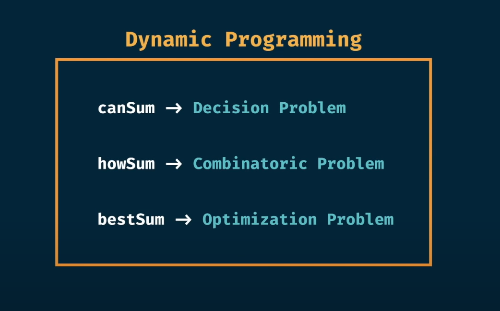
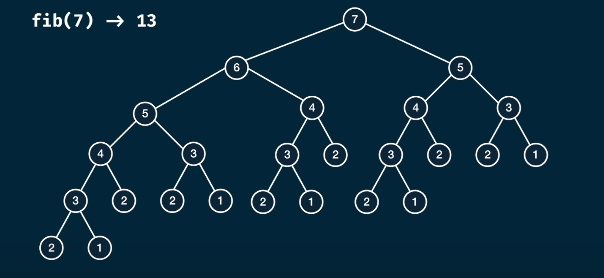
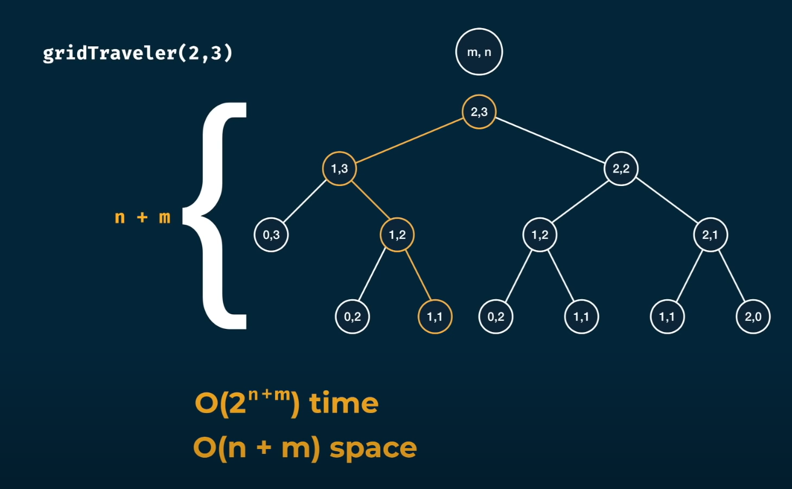
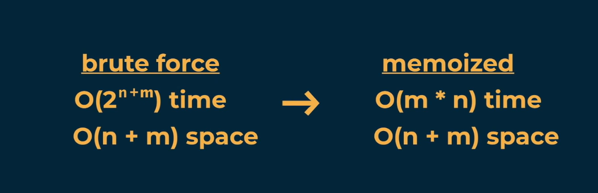
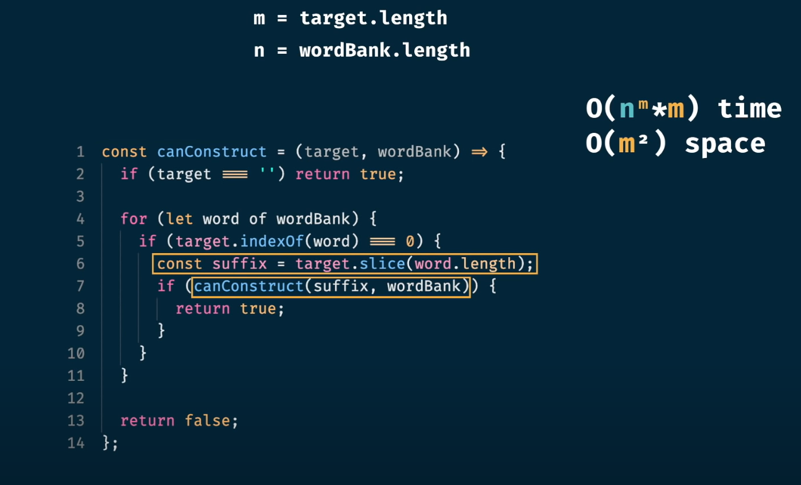

- [Binary system](#binary-system)
- [Data size](#data-size)
- [Big O notation](#big-o-notation)
  - [Constant](#constant)
  - [Logarithmic O(log(n))](#logarithmic-ologn)
  - [Linear O(n)](#linear-on)
  - [Loglinear O(n \* log(n))](#loglinear-on--logn)
  - [Polynomial O(n^c)](#polynomial-onc)
    - [O(n^2)](#on2)
    - [O(n^3)](#on3)
  - [Exponential O(C ^ n)](#exponential-oc--n)
    - [O(2^n)](#o2n)
    - [O(3^n)](#o3n)
  - [Factorial O(n!)](#factorial-on)
  - [Analyzing multi-argument functions](#analyzing-multi-argument-functions)
    - [O(n + m)](#on--m)
    - [O(n \* m)](#on--m-1)
    - [Max](#max)
- [Combinatorics](#combinatorics)
  - [Combinations](#combinations)
  - [Permutations](#permutations)
- [Data structures](#data-structures)
  - [Array](#array)
    - [Merge two arrays (Zipper with comparison)](#merge-two-arrays-zipper-with-comparison)
  - [Linked list](#linked-list)
    - [Variants](#variants)
    - [How to reverse Linked List?](#how-to-reverse-linked-list)
    - [Zipper](#zipper)
  - [Stack](#stack)
    - [Bracket mather](#bracket-mather)
  - [Queue](#queue)
    - [Snake](#snake)
  - [Snake with motion](#snake-with-motion)
  - [Binary Tree](#binary-tree)
    - [Breadth-first traversal](#breadth-first-traversal)
    - [Depth first traversal](#depth-first-traversal)
      - [Using Stack](#using-stack)
      - [Recursive](#recursive)
    - [max root to leaf path sum](#max-root-to-leaf-path-sum)
  - [Graph](#graph)
    - [Depth first traversal](#depth-first-traversal-1)
    - [Breadh first traversal](#breadh-first-traversal)
    - [Has path](#has-path)
    - [Undirected path Has path](#undirected-path-has-path)
    - [Connected components count](#connected-components-count)
    - [Largest component](#largest-component)
    - [Shortest path](#shortest-path)
    - [Island count](#island-count)
    - [Minimum Island](#minimum-island)
- [Algorithms](#algorithms)
  - [Memory addresses arrays and linked list](#memory-addresses-arrays-and-linked-list)
  - [traveling salesperson problem.](#traveling-salesperson-problem)
  - [Search](#search)
    - [Binary search](#binary-search)
  - [Sorting](#sorting)
    - [Selection sorting](#selection-sorting)
  - [Recursive](#recursive-1)
- [Dynamic programming](#dynamic-programming)
  - [Memoization](#memoization)
    - [Fib](#fib)
    - [Trib](#trib)
    - [Grid traveler](#grid-traveler)
    - [GridTraveler with walls](#gridtraveler-with-walls)
    - [MaxTravelersWithScores](#maxtravelerswithscores)
    - [canSum](#cansum)
    - [howSum](#howsum)
    - [bestSum](#bestsum)
    - [Coins counting change](#coins-counting-change)
    - [canConstruct](#canconstruct)
    - [countConstruct](#countconstruct)
    - [allConstruct](#allconstruct)
  - [Tabulation](#tabulation)
    - [Fib](#fib-1)
    - [GridTraveler](#gridtraveler)
    - [CanSum](#cansum-1)
    - [howSum](#howsum-1)
    - [bestSum](#bestsum-1)
    - [munSumCount](#munsumcount)
    - [canConstruct](#canconstruct-1)
    - [countConstruct](#countconstruct-1)
    - [allConstruct](#allconstruct-1)


# Binary system


# Data size


# Big O notation 

[Good website about big O](https://www.bigocheatsheet.com/)

Big O notation lets you compare the number of operations. It tells you how fast the algorithm grows. Big O establishes a worst-case run time

+ O(1) constant time
+ O(log n), also known as log time. Example: Binary search.
+ O(n), also known as linear time. Example: Simple search.
+ O(n * log n). Example: A fast sorting algorithm, like quicksort
+ O(n2). A slow sorting algorithm, like selection sort
+ O(n!). A really slow algorithm, like the traveling salesperson


## Constant 

the number of steps does not depend on the input size

```java
    int bar(int n) {
        int result = 0;
        for (int i = 0; i < 5; i++) {
            result += n;
        }
        return result;
    }
```

```java
    int bar(int[] numbers) {
        return numbers[0] * numbers[numbers.length - 1];
    }
```

## Logarithmic O(log(n))

- A log is the opposite of an exponent
- An exponent is a repeated multiplication a log is a repeated division
- if 2 ^ 5 = 32 then log2(32) = 5


```java
    void bar(int n) {

        while(n > 1){
            System.out.println(n);
            n /= 2;
        }
        System.out.println("done");
    }
```

```java
    void bar(int n) {

        if (n <= 1) {
            System.out.println("finish");
            return;
        }

        System.out.println(n);
        bar(n / 2);
    }
```

## Linear O(n)

```java
    void bar(int[] numbers) {
        for (int i = 0; i < numbers.length; i++) {
            System.out.println(numbers[i]);
        }
    }
```

```java
    void bar(int n) {

        if (n == 0) {
            System.out.println("finish");
            return;
        }

        System.out.println(n);
        bar(n - 1);
    }
```

## Loglinear O(n * log(n))

- Has linear behavior nested in log steps
- bigger than O(n) but less than O(n^2)


```java
    void bar(String str) {
        System.out.println(str);
        if (str.length() <= 1) {
            return;
        }
        int middleIndex = (int) Math.floor(str.length() / 2);
        bar(str.substring(0, middleIndex));
    }
```

```java
    void bar(String[] array) {

        StringBuilder str = new StringBuilder();
        for(int i = 0; i< array.length; i++){
            str.append(array[i]);
        }

        System.out.println(str);
        System.out.println("------");

        if (array.length <= 1) {
            return;
        }

        int middleIndex = (int) Math.floor(array.length / 2);
        String[] left = Arrays.copyOfRange(array, 0, middleIndex);
        String[] right = Arrays.copyOfRange(array, middleIndex, array.length - 1);
        bar(left);
        bar(right);
    }
```

## Polynomial O(n^c)

- n is the size of the input
- c is some constant
- includes O(n^2) quadratic, O(n^3) cubic etc.


### O(n^2)
```java
    void bar(String[] array) {

        for(int i = 0; i< array.length; i++){
            for(int j = 0; j<array.length; j++) {
                System.out.println(array[i] + "/" + array[j]);;
            }
        }
    }
```

```java
    void bar(String s) {

        if (s.length() == 0) {
            return;
        }

        char firstChar = s.charAt(0);
        String rest = s.substring(1);
        bar(rest);
    }
```

### O(n^3)
```java
    void bar(int n) {
        for (int i = 0; i < n; i++) {
            for (int j = 0; j < n; j++) {
                for (int k = 0; k < n; k++)
                    System.out.println(i + "/" + j + "/" + k);
            }
        }
    }
```

## Exponential O(C ^ n)


- n is the size of the input
- c is some constant
- includes O(2^n), O(3^n), etc.


### O(2^n)

```java
    void bar(int n) {

        if (n == 1) {
            return;
        }

        bar(n - 1);
        bar(n - 1);
    }
```

### O(3^n)

```java
    void bar(int n) {

        if (n == 1) {
            return;
        }

        bar(n - 1);
        bar(n - 1);
        bar(n - 1);
    }
```

## Factorial O(n!)

n! = (n)(n-1)(n-2)(n-3)...(2)(1)

4! = 4 * 3 * 2 * 1 = 24

```java
    void bar(int n) {

        if (n == 1) {
            return;
        }

        for (int i = 0; i < n; i++) {
            bar(n - 1);
        }
    }
```

## Analyzing multi-argument functions

### O(n + m)

```java

    void bar(int n, int m) {
        
        for (int i = 0; i < n; i++) {
            System.out.println("hi");
        }
        
        for (int i = 0; i < m; i++) {
            System.out.println("bye");
        }
    }
```

### O(n * m)

```java

    void bar(String[] array1, String[] array2) {

        for (int i = 0; i < array1.length; i++) {
            for (int j = 0; j < array2.length; j++) {
                System.out.println(array1[i] + "/" + array2[j]);
                ;
            }
        }
    }
```

### Max

```java

    void bar(String s1, String s2) {
        if (s1.length() > s2.length()) {

            for (int i = 0; i < s1.length(); i++) {
                System.out.println(s1.charAt(i));
            }

        } else {
            for (int j = 0; j < s2.length(); j++) {
                System.out.println(s2.charAt(j));
            }
        }
    }
```

O(max(m, n)) where m, n are the string length

or

O(n) where n is the length of the longer string

# Combinatorics

## Combinations

Combination - a collection of things where the order does not matter

```
combinations of [a, b, c]

1. []
2. [a]
3. [b]
4. [c]
5. [a,b]
6. [b,c]
7. [a,c]
8. [a,b,c]
```

Given a set of n things there are `2^n` possible combinations


```java
package comb;

import java.util.ArrayList;
import java.util.Arrays;
import java.util.List;

public class AllCombinations {


    public static List<Object[]> getAllCombinationsAlt(Object[] things) {

        if (things.length == 0) {
            List<Object[]> result = new ArrayList<>();
            result.add(new Object[]{});
            return result;
        }

        Object first = things[0];
        Object[] rest = Arrays.copyOfRange(things, 1, things.length);

        List<Object[]> combsWithoutFirst = getAllCombinations(rest);
        List<Object[]> combsWithFirst = new ArrayList<>();

        combsWithoutFirst.forEach(objects -> {

            Object[] combWithFirst = Arrays.copyOf(objects, objects.length + 1);
            combWithFirst[combWithFirst.length - 1] = first;
            combsWithFirst.add(combWithFirst);
        });

        List<Object[]> result = new ArrayList<>();
        result.addAll(combsWithFirst);
        result.addAll(combsWithoutFirst);
        return result;

    }

    public static List<Object[]> getAllCombinations(Object[] things) {
        return getAllCombinations(things, new Object[]{}, 0);
    }


    public static List<Object[]> getAllCombinations(Object[] things, Object[] currentArray, int index) {
        if (index == things.length) {
            List<Object[]> result = new ArrayList<>();
            result.add(currentArray);
            return result;
        }

        Object[] nextArray = Arrays.copyOf(currentArray, currentArray.length + 1);
        nextArray[nextArray.length - 1] = things[index];

        List<Object[]> result = new ArrayList<>();
        result.addAll(getAllCombinations(things, currentArray, index + 1));
        result.addAll(getAllCombinations(things, nextArray, index + 1));
        return result;
    }

    public static void printAllCombinations(Object[] things) {
        printAllCombinations(things, new Object[]{}, 0);
    }

    public static void printAllCombinations(Object[] things, Object[] currentArray, int index) {

        if (index == things.length) {
            System.out.println(Arrays.toString(currentArray));
            return;
        }

        Object[] nextArray = Arrays.copyOf(currentArray, currentArray.length + 1);
        nextArray[nextArray.length - 1] = things[index];

        printAllCombinations(things, currentArray, index + 1);
        printAllCombinations(things, nextArray, index + 1);
    }

    public static void main(String[] args) {
        getAllCombinationsAlt(new Object[]{"a", "b", "c"}).forEach(e -> System.out.println(Arrays.toString(e)));
    }
}

```

## Permutations

Permutation - collection of things where the order matters

```
Permutations of [a, b, c]

1. [c, b, a]
2. [b, c, a]
3. [b, a, c]
4. [c, a, b]
5. [a, c, b]
6. [a, b, c]
```

given a set of n things there are `n!` permutations


```java
package comb;

import java.util.ArrayList;
import java.util.List;

public class AllPermutations {


    public static void main(String[] args) {
        getAllPermutation(List.of("a", "b", "c")).forEach(System.out::println);
    }

    private static List<List<Object>> getAllPermutation(List<Object> objects) {

        if (objects == null || objects.isEmpty()) {
            return List.of(List.of());
        }

        Object firstElement = objects.get(0);
        List<Object> rest = objects.subList(1, objects.size());
        List<List<Object>> permsWithoutFirst = getAllPermutation(rest);

        List<List<Object>> result = new ArrayList<>();

        for (List<Object> perm : permsWithoutFirst) {
            for (int j = 0; j <= perm.size(); j++) {
                List<Object> permWithFirst = new ArrayList<>(perm);
                permWithFirst.add(j, firstElement);
                result.add(permWithFirst);
            }
        }

        return result;
    }

}

// TIME : O(n!)
// SPACE: O(n^2)

```

# Data structures

## Array

### Merge two arrays (Zipper with comparison)

```java
package datastruct;

import java.util.Arrays;

public class MergeSortedArrays {

    public static void merge(int[] nums1, int m, int[] nums2, int n) {
        int[] first = Arrays.copyOf(nums1, m);

        int value1;
        int value2;
        int i = 0;
        int j = 0;
        int k = 0;

        while (i < first.length && j < n) {

            value1 = first[i];
            value2 = nums2[j];

            if (value1 < value2) {

                nums1[k] = value1;
                i++;
                k++;
            } else {
                nums1[k] = value2;
                j++;
                k++;
            }
        }

        if (i < m) {
            System.arraycopy(first, i, nums1, k, m - i);
        }

        if (j < n) {
            System.arraycopy(nums2, j, nums1, k, n - j);
        }
    }

    public static void main(String[] args) {

        int[] first = new int[]{1, 2, 3, 0, 0, 0};

        int[] second = new int[]{2, 5, 6};

        merge(first, 3, second, 3);
        System.out.println(Arrays.toString(first));

    }
}
```


## Linked list

- data structure where values are chained sequentially
- more efficient for insertion/deletion than arrays
- does not require contiguous memory addressing


Composed of nodes that contain a stored value and a reference to the next node

### Variants


singly linked list

```java
package datastruct;

public class LinkedListIterative<T> {

    public static final String TO_STRING_PATTERN = "[%s]";
    private Node head;

    public void add(T value) {
        if (head == null) {
            head = new Node(value);
            return;
        }

        Node lastNode = getTail(head);
        lastNode.setNext(new Node(value));
    }

    public T get(int index) {
        if (head == null) {
            throw new IllegalArgumentException("list bound violation ");
        }

        if (index == 0) {
            return head.getValue();
        }

        return getNodeByIndex(index).getValue();
    }

    public boolean remove(T value) {

        if(head == null){
            return false;
        }

        if (head.getValue().equals(value)) {
            head = head.getNext();
            return true;
        }

        Node previous = head;
        Node current = head.getNext();
        while (current != null) {
            if (current.getValue().equals(value)) {
                previous.setNext(current.getNext());
                return true;
            }

            previous = current;
            current = current.getNext();
        }

        return false;
    }

    public Node remove(T value, Node head) {

        if (head.getValue().equals(value)) {
            return head.getNext();
        }

        Node previous = head;
        Node current = head.getNext();
        while (current != null) {
            if (current.getValue().equals(value)) {
                previous.setNext(current.getNext());
                break;
            }

            previous = current;
            current = current.getNext();
        }

        return head;
    }

    public boolean contains(T value) {
        if (head == null) {
            return false;
        }

        Node current = head;
        boolean result = false;
        while (current != null) {
            if (current.getValue().equals(value)) {
                result = true;
                break;
            }
            current = current.getNext();
        }

        return result;
    }

    public void print() {
        StringBuilder result = new StringBuilder();
        Node current = head;
        while (current != null) {
            result.append(current.getValue());
            result.append("->");
            current = current.getNext();
        }
        System.out.println(result);
    }

    public void print(Node head) {
        StringBuilder result = new StringBuilder();
        Node current = head;
        while (current != null) {
            result.append(current.getValue());
            result.append("->");
            current = current.getNext();
        }
        System.out.println(result);
    }

    @Override
    public String toString() {

        if (head == null) {
            return "";
        }

        return TO_STRING_PATTERN.formatted(head);
    }

    private Node getNodeByIndex(int index) {
        Node currentNode = head;
        for (int i = 0; i < index; i++) {
            if (currentNode.getNext() == null) {
                throw new IllegalArgumentException("list bound violation ");
            }
            currentNode = currentNode.getNext();
        }
        return currentNode;
    }

    private Node getTail(Node firstNode) {

        while (firstNode.getNext() != null) {
            firstNode = firstNode.getNext();
        }

        return firstNode;
    }

    private class Node {
        private final T value;
        private Node next;

        public Node(T value) {
            this.value = value;
        }

        public T getValue() {
            return value;
        }

        public Node getNext() {
            return next;
        }

        public void setNext(Node next) {
            this.next = next;
        }

        @Override
        public String toString() {
            return "Node{" +
                    "value=" + value +
                    ", next=" + next +
                    '}';
        }
    }

    public static void main(String[] args) {
        LinkedListIterative<Integer> things = new LinkedListIterative<>();
        things.add(4);
        things.add(5);
        things.print();
        System.out.println(things.get(1));
        System.out.println(things.contains(10));
        System.out.println(things.contains(4));
        things.add(7);
        things.add(8);
        things.print();
        things.remove(8);
        things.print();
        things.remove(4);
        things.print();

    }
}

```

```java
package datastruct;

import java.util.Objects;

public class LinkedListRecursive<T> {

    public static final String TO_STRING_PATTERN = "[%s]";
    private Node head;

    public void add(T value) {
        if (head == null) {
            head = new Node(value);
            return;
        }

        Node lastNode = getTail(head);
        lastNode.setNext(new Node(value));
    }

    private boolean nodeContains(T value, Node node) {

        if (node == null) {
            return false;
        }

        if (Objects.equals(value, node.getValue())) {
            return true;
        }

        return nodeContains(value, node.getNext());
    }

    public boolean contains(T value) {
        if (head == null) {
            return false;
        }

        return nodeContains(value, head);
    }


    public T get(int index) {
        if (head == null) {
            throw new IllegalArgumentException("list bound violation ");
        }

        Node foundNode = getNodeByIndex(index, head);
        if (foundNode == null) {
            return null;
        }

        return foundNode.getValue();
    }

    private String printNode(Node node) {

        if (node == null) {
            return "";
        }

        return node.getValue() + "->" + printNode(node.getNext());
    }

    public void print() {
        System.out.println(printNode(head));
    }

    public boolean remove(T value) {

        if (head == null) {
            return false;
        }

        if (head.getValue().equals(value)) {
            head = head.getNext();
            return true;
        }

        return removeHelper(value, head.getNext(), head);
    }

    public Node remove(T value, Node head) {

        if (head.getValue().equals(value)) {
            return head.getNext();
        }

        removeHelper(value, head.getNext(), head);

        return head;
    }

    private boolean removeHelper(T value, Node current, Node previous) {

        if (current == null) {
            return false;
        }

        if (current.getValue().equals(value)) {
            previous.setNext(current.getNext());
            return true;
        }

        return removeHelper(value, current.getNext(), current);
    }

    @Override
    public String toString() {

        if (head == null) {
            return "";
        }

        return TO_STRING_PATTERN.formatted(head);
    }


    private Node getNodeByIndex(int index, Node currentNode) {

        if (currentNode == null) {
            return null;
        }

        if (index == 0) {
            return currentNode;
        }

        return getNodeByIndex(index - 1, currentNode.getNext());
    }

    private Node getTail(Node firstNode) {

        if (firstNode.getNext() == null) {
            return firstNode;
        }

        return getTail(firstNode.getNext());
    }

    private class Node {
        private final T value;
        private Node next;

        public Node(T value) {
            this.value = value;
        }

        public T getValue() {
            return value;
        }

        public Node getNext() {
            return next;
        }

        public void setNext(Node next) {
            this.next = next;
        }

        @Override
        public String toString() {
            return "Node{" +
                    "value=" + value +
                    ", next=" + next +
                    '}';
        }
    }

    public static void main(String[] args) {
        LinkedListRecursive<Integer> things = new LinkedListRecursive<>();
        things.add(4);
        things.add(5);
        things.print();
        System.out.println(things.get(1));
        System.out.println(things.contains(10));
        System.out.println(things.contains(4));
        things.add(7);
        things.add(8);
        things.print();
        things.remove(8);
        things.print();
        things.remove(4);
        things.print();

    }
}


```

### How to reverse Linked List?

```java
package datastruct;

public class ReverseLinkedList {

    public static class Node<T> {

        private final T value;
        private Node<T> next;

        public Node(T value, Node<T> next) {
            this.value = value;
            this.next = next;
        }

        public T getValue() {
            return value;
        }

        public Node<T> getNext() {
            return next;
        }

        public void setNext(Node<T> next) {
            this.next = next;
        }

        @Override
        public String toString() {
            return "Node{" +
                    "value=" + value +
                    '}';
        }
    }


    public static Node reverseLinkedListIterativeMutable(Node head) {

        if (head.getNext() == null) {
            return head;
        }

        Node current = head;
        Node newHead = null;

        while (current != null) {
            Node next = current.getNext();
            current.setNext(newHead);
            newHead = current;
            current = next;
        }

        return newHead;
    }

    public static Node reverseLinkedListIterative(Node head) {

        if (head.getNext() == null) {
            return head;
        }

        Node current = head;
        Node newHead = null;

        while (current != null) {
            newHead = new Node(current.getValue(), newHead);
            current = current.getNext();
        }

        return newHead;
    }

    public static Node reverseLinkedListRecursive(Node current) {

        return reverseLinkedListRecursive(current, null);
    }

    public static Node reverseLinkedListRecursive(Node current, Node head) {

        if (current == null) {
            return head;
        }

        return reverseLinkedListRecursive(current.getNext(), new Node(current.getValue(), head));
    }


    public static Node reverseLinkedListRecursiveMutable(Node head) {

        if (head.getNext() == null) {
            return head;
        }

        return reverseLinkedListRecursiveMutableHelper(head, null);
    }

    public static Node reverseLinkedListRecursiveMutableHelper(Node current, Node newHead) {

        if (current == null) {
            return newHead;
        }

        Node next = current.getNext();
        current.setNext(newHead);
        return reverseLinkedListRecursiveMutableHelper(next, current);
    }
    
    public static void print(Node<?> node) {

        StringBuilder sb = new StringBuilder();
        Node<?> current = node;
        while (current != null) {
            sb.append(current.getValue());
            sb.append("->");
            current = current.getNext();
        }
        System.out.println(sb);
    }

    public static void main(String[] args) {

        Node<String> head = new Node<>("A", new Node<>("B", new Node<>("C", new Node<>("D", null))));
        print(reverseLinkedListIterativeMutable(head));
        head = new Node<>("A", new Node<>("B", new Node<>("C", new Node<>("D", null))));
        print(reverseLinkedListRecursiveMutable(head));
        head = new Node<>("A", new Node<>("B", new Node<>("C", new Node<>("D", null))));
        print(reverseLinkedListIterative(head));
        print(reverseLinkedListRecursive(head));

    }

}

```

### Zipper


```java
package datastruct;

public class Zipper {

    public static class Node<T> {

        private final T value;
        private Node<T> next;

        public Node(T value, Node<T> next) {
            this.value = value;
            this.next = next;
        }

        public T getValue() {
            return value;
        }

        public Node<T> getNext() {
            return next;
        }

        public void setNext(Node<T> next) {
            this.next = next;
        }

        @Override
        public String toString() {
            return "Node{" +
                    "value=" + value +
                    '}';
        }
    }

    public static Node zipper(Node head1, Node head2) {

        Node tail = head1;
        Node current1 = head1.getNext();
        Node current2 = head2;
        int count = 0;

        while (current1 != null && current2 != null) {
            if (count % 2 == 0) {
                tail.setNext(current2);
                current2 = current2.getNext();
            } else {
                tail.setNext(current1);
                current1 = current1.getNext();
            }
            tail = tail.getNext();
            count++;
        }

        if (current1 != null) {
            tail.setNext(current1);
        }

        if (current2 != null) {
            tail.setNext(current2);
        }

        return head1;
    }

    public static Node zipperRecursivelly(Node head1, Node head2) {

        if (head1 == null && head2 == null) {
            return null;
        }

        if (head1 == null) {
            return head2;
        }

        if (head2 == null) {
            return head1;
        }

        Node next1 = head1.getNext();
        Node next2 = head2.getNext();

        head1.setNext(head2);
        head2.setNext(zipperRecursivelly(next1, next2));

        return head1;
    }

    public static void print(Node<?> node) {

        StringBuilder sb = new StringBuilder();
        Node<?> current = node;
        while (current != null) {
            sb.append(current.getValue());
            sb.append("->");
            current = current.getNext();
        }
        System.out.println(sb);
    }

    public static void main(String[] args) {

        Node<String> first = new Node<>("A", new Node<>("C", new Node<>("E", new Node<>("F", null))));
        Node<String> second = new Node<>("B", new Node<>("D", null));
        print(zipperRecursivelly(first, second));
    }
}

```

## Stack

- collection of items
- add to top of stack (push)
- remove top of stack (pop)
- last-in-first-out (LIFO)
  
  Useful for:
  - tracking a history of steps
  - browser history
  - backtracking algorithms

```java
package datastruct.stack;

public class LinkedListStack<T> {

    private Node top = null;

    // O(1)
    private void push(T value) {
        top = new Node(value, top);
    }

    // O(1)
    private T pop() {

        if (top == null) {
            return null;
        }

        T resut = top.getValue();
        top = top.getNext();
        return resut;
    }


    private String printNode(Node node) {

        if (node == null) {
            return "";
        }

        return node.getValue() + "->" + printNode(node.getNext());
    }

    public void print() {
        System.out.println(printNode(top));
    }


    public class Node {
        private final T value;
        private Node next;

        public Node(T value, Node next) {
            this.value = value;
            this.next = next;
        }

        public T getValue() {
            return value;
        }

        public Node getNext() {
            return next;
        }

        public void setNext(Node next) {
            this.next = next;
        }
    }

    public static void main(String[] args) {
        LinkedListStack<String> stack = new LinkedListStack<>();
        stack.push("a");
        stack.push("b");
        stack.push("c");
        stack.print();

        stack.pop();
        stack.print();
        stack.pop();
        stack.print();
    }
}

```

### Bracket mather

```java
package datastruct.stack;

import java.util.LinkedList;

public class BracketMatcher {

    private static LinkedList<Integer> memo = new LinkedList<>();


    private static int match(String input) {

        for (char c : input.toCharArray()) {

            if (c == ')') {
                if (memo.isEmpty()) {
                    return 0;
                } else {
                    memo.pop();
                }
            }

            if (c == '(') {
                memo.push(1);
            }
        }

        return memo.isEmpty() ? 1 : 0;
    }

    public static void main(String[] args) {
        System.out.println(match("(hello)"));
        System.out.println(match("(()hello)"));
        System.out.println(match("()hello)"));

    }

}

```

## Queue

- collection of items
- add to back of queue (enqueue)
- remove front of queue (dequeue)
- First-in-first-out (FIFO)

Useful for:
- FIFO order
- tracking requests for a limited resource
- graph algorithms

```java
package datastruct.queue;

import datastruct.stack.LinkedListStack;

public class Queue<T> {

    private Node head = null;
    private Node tail = null;

    private void enqueue(T value) {
        Node nodeToAdd = new Node(value, null);
        if (head == null) {
            head = nodeToAdd;
            tail = nodeToAdd;
        } else {
            tail.setNext(nodeToAdd);
            tail = nodeToAdd;
        }
    }

    private T dequeue() {

        if (head == null) {
            return null;
        }

        T result = head.getValue();

        head = head.getNext();

        if (head == null) {
            tail = null;
        }

        return result;

    }


    private String printNode(Node node) {

        if (node == null) {
            return "";
        }

        return node.getValue() + "->" + printNode(node.getNext());
    }

    public void print() {
        System.out.println(printNode(head));
    }


    public class Node {
        private final T value;
        private Node next;

        public Node(T value, Node next) {
            this.value = value;
            this.next = next;
        }

        public T getValue() {
            return value;
        }

        public Node getNext() {
            return next;
        }

        public void setNext(Node next) {
            this.next = next;
        }
    }

    public static void main(String[] args) {
        Queue<String> stack = new Queue<>();
        stack.enqueue("a");
        stack.enqueue("b");
        stack.enqueue("c");
        stack.print();

        stack.dequeue();
        stack.print();
        stack.dequeue();
        stack.print();
        stack.dequeue();
        stack.print();

        stack.enqueue("a");
        stack.enqueue("b");
        stack.enqueue("c");
        stack.print();

    }

}

```

### Snake


```java
package datastruct.queue;

import java.util.ArrayList;
import java.util.HashMap;
import java.util.List;
import java.util.Map;

public class SnakeGame {

    private Snake snake = new Snake();

    private Map<Direction, Integer[]> delta = new HashMap<>();

    public SnakeGame() {

        snake.setBody(new Integer[][]{new Integer[]{4, 1}, new Integer[]{4, 2}, new Integer[]{4, 3}, new Integer[]{4, 4},});

        delta.put(Direction.UP, new Integer[]{-1, 0});
        delta.put(Direction.DOWN, new Integer[]{1, 0});
        delta.put(Direction.LEFT, new Integer[]{0, -1});
        delta.put(Direction.RIGHT, new Integer[]{0, 1});

    }

    private static class Snake {

        private Integer[][] body;

        public Integer[][] getBody() {
            return body;
        }

        public void setBody(Integer[][] body) {
            this.body = body;
        }
    }

    public enum Direction {
        UP, DOWN, LEFT, RIGHT;
    }

    public void move(Direction direction) {

        Integer[][] currentBody = snake.getBody();

        Integer[] currentHead = currentBody[currentBody.length - 1];
        int currentHeadRow = currentHead[0];
        int currentHeadColumn = currentHead[1];

        Integer[] currentDelta = delta.get(direction);

        Integer[] newHead = new Integer[]{currentHeadRow + currentDelta[0], currentHeadColumn + currentDelta[1]};


        Integer[][] newBody = new Integer[snake.getBody().length][2];
        System.arraycopy(snake.getBody(), 1, newBody, 0, snake.getBody().length - 1);
        newBody[newBody.length - 1] = newHead;
        snake.setBody(newBody);
    }

    public void draw() {

        List<List<String>> grid = new ArrayList<>();

        for (int i = 0; i < 10; i++) {
            List<String> row = new ArrayList<>();
            for (int j = 0; j < 10; j++) {
                row.add(" ");
            }
            grid.add(row);
        }

        for (Integer[] pos : snake.getBody()) {

            int row = pos[0];
            int col = pos[1];

            grid.get(row).set(col, "0");
        }

        grid.stream().forEach(System.out::println);
    }

    public static void main(String[] args) {

        SnakeGame game = new SnakeGame();
        game.draw();
        game.move(Direction.UP);
        game.draw();
        game.move(Direction.RIGHT);
        game.draw();
        game.move(Direction.RIGHT);
        game.draw();
        game.move(Direction.RIGHT);
        game.draw();
    }

}
```

## Snake with motion

```java
package org.example;

import org.jline.terminal.Terminal;
import org.jline.terminal.TerminalBuilder;
import org.jline.utils.NonBlockingReader;

import java.util.ArrayList;
import java.util.HashMap;
import java.util.List;
import java.util.Map;

public class SnakeGame {

    private Snake snake = new Snake();

    private Map<Direction, Integer[]> delta = new HashMap<>();

    public SnakeGame() {

        snake.setBody(new Integer[][]{new Integer[]{4, 1}, new Integer[]{4, 2}, new Integer[]{4, 3}, new Integer[]{4, 4},});

        delta.put(Direction.UP, new Integer[]{-1, 0});
        delta.put(Direction.DOWN, new Integer[]{1, 0});
        delta.put(Direction.LEFT, new Integer[]{0, -1});
        delta.put(Direction.RIGHT, new Integer[]{0, 1});

    }

    private static class Snake {

        private Integer[][] body;

        public Integer[][] getBody() {
            return body;
        }

        public void setBody(Integer[][] body) {
            this.body = body;
        }
    }

    public enum Direction {
        UP, DOWN, LEFT, RIGHT;
    }

    public void move(Direction direction) {

        Integer[][] currentBody = snake.getBody();

        Integer[] currentHead = currentBody[currentBody.length - 1];
        int currentHeadRow = currentHead[0];
        int currentHeadColumn = currentHead[1];

        Integer[] currentDelta = delta.get(direction);

        Integer[] newHead = new Integer[]{currentHeadRow + currentDelta[0], currentHeadColumn + currentDelta[1]};


        Integer[][] newBody = new Integer[snake.getBody().length][2];
        System.arraycopy(snake.getBody(), 1, newBody, 0, snake.getBody().length - 1);
        newBody[newBody.length - 1] = newHead;
        snake.setBody(newBody);
    }

    public void draw(Terminal terminal) {

        clearScreen(terminal);

        List<List<String>> grid = new ArrayList<>();

        for (int i = 0; i < 10; i++) {
            List<String> row = new ArrayList<>();
            for (int j = 0; j < 10; j++) {
                row.add(" ");
            }
            grid.add(row);
        }

        for (Integer[] pos : snake.getBody()) {

            int row = pos[0];
            int col = pos[1];

            grid.get(row).set(col, "0");
        }

        grid.stream().forEach(System.out::println);
    }

    private static void clearScreen(Terminal terminal) {
        if (terminal != null) {
            try {
                terminal.puts(org.jline.utils.InfoCmp.Capability.clear_screen);
                terminal.flush();
            } catch (Exception e) {
                e.printStackTrace();
            }
        }
    }

    private static volatile Direction currentDirection = Direction.RIGHT; // Default direction


    public static void main(String[] args) {
        try {
            SnakeGame game = new SnakeGame();

            Terminal terminal = TerminalBuilder.terminal();
            game.draw(terminal);

            terminal.enterRawMode();
            NonBlockingReader reader = terminal.reader();

            Thread moveThread = new Thread(() -> {
                while (true) {
                    try {
                        game.move(currentDirection);
                        game.draw(terminal);
                        Thread.sleep(200);
                    } catch (InterruptedException e) {
                        Thread.currentThread().interrupt();
                        return;
                    } catch (Exception ex) {
                        System.out.println("GAME OVER");
                        return;
                    }
                }
            });

            moveThread.start();

            int ch;
            while ((ch = reader.read()) != -1) {
                switch (ch) {
                    case 'w':
                        currentDirection = Direction.UP;
                        break;
                    case 'a':
                        currentDirection = Direction.LEFT;
                        break;
                    case 's':
                        currentDirection = Direction.DOWN;
                        break;
                    case 'd':
                        currentDirection = Direction.RIGHT;
                        break;
                }
            }
        } catch (Exception e) {
            System.out.println("GAME OVER");
        }
    }

}

```

```xml
<?xml version="1.0" encoding="UTF-8"?>
<project xmlns="http://maven.apache.org/POM/4.0.0"
         xmlns:xsi="http://www.w3.org/2001/XMLSchema-instance"
         xsi:schemaLocation="http://maven.apache.org/POM/4.0.0 http://maven.apache.org/xsd/maven-4.0.0.xsd">
    <modelVersion>4.0.0</modelVersion>

    <groupId>org.example</groupId>
    <artifactId>Snake</artifactId>
    <version>1.0-SNAPSHOT</version>

    <properties>
        <maven.compiler.source>17</maven.compiler.source>
        <maven.compiler.target>17</maven.compiler.target>
        <project.build.sourceEncoding>UTF-8</project.build.sourceEncoding>
    </properties>

    <dependencies>
        <dependency>
            <groupId>org.jline</groupId>
            <artifactId>jline</artifactId>
            <version>3.20.0</version> <!-- Check for the latest version -->
        </dependency>
    </dependencies>

    <build>
        <plugins>
            <plugin>
                <artifactId>maven-assembly-plugin</artifactId>
                <version>3.3.0</version> <!-- Use the latest version available -->
                <configuration>
                    <archive>
                        <manifest>
                            <mainClass>org.example.SnakeGame</mainClass> <!-- Replace with your main class -->
                        </manifest>
                    </archive>
                    <descriptorRefs>
                        <descriptorRef>jar-with-dependencies</descriptorRef>
                    </descriptorRefs>
                </configuration>
                <executions>
                    <execution>
                        <id>make-assembly</id> <!-- This is used for an identifier of the phase -->
                        <phase>package</phase> <!-- Bind to the packaging phase -->
                        <goals>
                            <goal>single</goal>
                        </goals>
                    </execution>
                </executions>
            </plugin>
        </plugins>
    </build>
</project>

```

## Binary Tree

Tree is a collection of elements where:
- there is one root
- there is only one unique path between any two nodes

Binary Tree is:
- Tree where each node has at most two children
- Tree whith 0 childer or 1 children is ok binary tree

```java
package datastruct.tree.binary;

public class BinaryTree<T> {

    private Node<T> root;

    public Node<T> getRoot() {
        return root;
    }

    public void setRoot(Node<T> root) {
        this.root = root;
    }

    private static class Node<T> {

        private final T value;
        private Node<T> left;
        private Node<T> right;

        public Node(T value, Node<T> left, Node<T> right) {
            this.value = value;
            this.left = left;
            this.right = right;
        }

        public Node(T value) {
            this.value = value;
        }

        public T getValue() {
            return value;
        }

        public Node<T> getLeft() {
            return left;
        }

        public void setLeft(Node<T> left) {
            this.left = left;
        }

        public Node<T> getRight() {
            return right;
        }

        public void setRight(Node<T> right) {
            this.right = right;
        }
    }

    public static void main(String[] args) {

        Node a = new Node("a");
        Node b = new Node("b");
        Node c = new Node("d");
        Node d = new Node("d");
        Node e = new Node("e");
        Node f = new Node("f");

        a.setLeft(b);
        a.setRight(c);
        b.setLeft(d);
        b.setRight(e);
        c.setRight(f);
    }
}

```

### Breadth-first traversal

Iterate over node on one level of the tree.


```java
package datastruct.tree.binary;

import java.util.LinkedList;
import java.util.List;
import java.util.Queue;

public class BreadthFirst {

    private static class Node<T> {

        private final T value;
        private Node<T> left;
        private Node<T> right;

        public Node(T value, Node<T> left, Node<T> right) {
            this.value = value;
            this.left = left;
            this.right = right;
        }

        public Node(T value) {
            this.value = value;
        }

        public T getValue() {
            return value;
        }

        public Node<T> getLeft() {
            return left;
        }

        public void setLeft(Node<T> left) {
            this.left = left;
        }

        public Node<T> getRight() {
            return right;
        }

        public void setRight(Node<T> right) {
            this.right = right;
        }
    }

    public static void breadthFirstPrint(Node root) {

        Queue<Node> memo = new LinkedList<>();

        memo.offer(root);

        while (!memo.isEmpty()) {
            Node current = memo.poll();
            System.out.println(current.getValue());
            if (current.getLeft() != null) {
                memo.offer(current.getLeft());
            }
            if (current.getRight() != null) {
                memo.offer(current.getRight());
            }
        }
    }

    public static boolean containsBreadthFirst(Node root, Object value) {

        Queue<Node> memo = new LinkedList<>();

        memo.offer(root);

        while (!memo.isEmpty()) {
            Node current = memo.poll();
            Object currentValue = current.getValue();
            if (currentValue.equals(value)) {
                return true;
            }
            if (current.getLeft() != null) {
                memo.offer(current.getLeft());
            }
            if (current.getRight() != null) {
                memo.offer(current.getRight());
            }
        }
        return false;
    }


    public static void main(String[] args) {

        Node a = new Node("a");
        Node b = new Node("b");
        Node c = new Node("c");
        Node d = new Node("d");
        Node e = new Node("e");
        Node f = new Node("f");

        a.setLeft(b);
        a.setRight(c);
        b.setLeft(d);
        b.setRight(e);
        c.setRight(f);

        breadthFirstPrint(a);
        System.out.println(containsBreadthFirst(a, "d"));
        System.out.println(containsBreadthFirst(a, "t"));
    }

}

```

```java
package datastruct.tree.binary;

import java.util.LinkedList;
import java.util.Queue;

public class BreadthFirstSum {

    private static class Node<T> {

        private final T value;
        private Node<T> left;
        private Node<T> right;

        public Node(T value, Node<T> left, Node<T> right) {
            this.value = value;
            this.left = left;
            this.right = right;
        }

        public Node(T value) {
            this.value = value;
        }

        public T getValue() {
            return value;
        }

        public Node<T> getLeft() {
            return left;
        }

        public void setLeft(Node<T> left) {
            this.left = left;
        }

        public Node<T> getRight() {
            return right;
        }

        public void setRight(Node<T> right) {
            this.right = right;
        }
    }

    public static int sumBreadthFirst(Node<Integer> root) {

        Queue<Node<Integer>> memo = new LinkedList<>();

        memo.offer(root);

        int result = 0;
        while (!memo.isEmpty()) {
            Node<Integer> current = memo.poll();
            result += current.getValue();
            if (current.getLeft() != null) {
                memo.offer(current.getLeft());
            }
            if (current.getRight() != null) {
                memo.offer(current.getRight());
            }
        }
        return result;
    }


    public static void main(String[] args) {

        Node<Integer> a = new Node<>(3);
        Node<Integer> b = new Node<>(2);
        Node<Integer> c = new Node<>(7);
        Node<Integer> d = new Node<>(4);
        Node<Integer> e = new Node<>(-2);
        Node<Integer> f = new Node<>(5);

        a.setLeft(b);
        a.setRight(c);
        b.setLeft(d);
        b.setRight(e);
        c.setRight(f);

        System.out.println(sumBreadthFirst(a)); // 19
    }
}
```

### Depth first traversal


#### Using Stack

```java
package datastruct.tree.binary;

import java.util.Deque;
import java.util.LinkedList;
import java.util.Queue;

public class DepthFirst {

    private static class Node<T> {

        private final T value;
        private Node<T> left;
        private Node<T> right;

        public Node(T value, Node<T> left, Node<T> right) {
            this.value = value;
            this.left = left;
            this.right = right;
        }

        public Node(T value) {
            this.value = value;
        }

        public T getValue() {
            return value;
        }

        public Node<T> getLeft() {
            return left;
        }

        public void setLeft(Node<T> left) {
            this.left = left;
        }

        public Node<T> getRight() {
            return right;
        }

        public void setRight(Node<T> right) {
            this.right = right;
        }
    }

    public static void depthFirstPrint(Node root) {

        // TIME O(n)
        // SPACE O(n)

        Deque<Node> memo = new LinkedList<>();

        memo.push(root);

        while (!memo.isEmpty()) {
            Node current = memo.pop();
            System.out.println(current.getValue());
            if (current.getRight() != null) {
                memo.push(current.getRight());
            }
            if (current.getLeft() != null) {
                memo.push(current.getLeft());
            }
        }
    }

    public static boolean containsDepthFirst(Node root, Object value) {


        Deque<Node> memo = new LinkedList<>();

        memo.push(root);

        while (!memo.isEmpty()) {
            Node current = memo.pop();
            if (current.getValue().equals(value)) {
                return true;
            }
            if (current.getRight() != null) {
                memo.push(current.getRight());
            }
            if (current.getLeft() != null) {
                memo.push(current.getLeft());
            }
        }

        return false;
    }


    public static void main(String[] args) {

        Node a = new Node("a");
        Node b = new Node("b");
        Node c = new Node("c");
        Node d = new Node("d");
        Node e = new Node("e");
        Node f = new Node("f");

        a.setLeft(b);
        a.setRight(c);
        b.setLeft(d);
        b.setRight(e);
        c.setRight(f);

        depthFirstPrint(a);
        System.out.println(containsDepthFirst(a, "d"));
        System.out.println(containsDepthFirst(a, "t"));
    }

}
```

```java
package datastruct.tree.binary;

import java.util.Deque;
import java.util.LinkedList;

public class DepthFirstSum {

    private static class Node<T> {

        private final T value;
        private Node<T> left;
        private Node<T> right;

        public Node(T value, Node<T> left, Node<T> right) {
            this.value = value;
            this.left = left;
            this.right = right;
        }

        public Node(T value) {
            this.value = value;
        }

        public T getValue() {
            return value;
        }

        public Node<T> getLeft() {
            return left;
        }

        public void setLeft(Node<T> left) {
            this.left = left;
        }

        public Node<T> getRight() {
            return right;
        }

        public void setRight(Node<T> right) {
            this.right = right;
        }
    }

    public static int sumDepthFirst(Node<Integer> root) {
        // TIME O(n)
        // SPACE O(n)

        Deque<Node<Integer>> memo = new LinkedList<>();

        memo.push(root);

        int sum = 0;
        while (!memo.isEmpty()) {
            Node<Integer> current = memo.pop();

            sum += current.getValue();
            if (current.getRight() != null) {
                memo.push(current.getRight());
            }
            if (current.getLeft() != null) {
                memo.push(current.getLeft());
            }
        }
        return sum;
    }


    public static void main(String[] args) {

        Node<Integer> a = new Node<>(3);
        Node<Integer> b = new Node<>(2);
        Node<Integer> c = new Node<>(7);
        Node<Integer> d = new Node<>(4);
        Node<Integer> e = new Node<>(-2);
        Node<Integer> f = new Node<>(5);

        a.setLeft(b);
        a.setRight(c);
        b.setLeft(d);
        b.setRight(e);
        c.setRight(f);

        System.out.println(sumDepthFirst(a)); // 19
    }

}
```

#### Recursive

3 ways:
- pre-order: sel, left, right
- post-order: left, right, self
- in-order: left, self, right

```java
package datastruct.tree.binary;

import java.util.Deque;
import java.util.LinkedList;

public class DepthFirstRecursive {

    private static class Node<T> {

        private final T value;
        private Node<T> left;
        private Node<T> right;

        public Node(T value, Node<T> left, Node<T> right) {
            this.value = value;
            this.left = left;
            this.right = right;
        }

        public Node(T value) {
            this.value = value;
        }

        public T getValue() {
            return value;
        }

        public Node<T> getLeft() {
            return left;
        }

        public void setLeft(Node<T> left) {
            this.left = left;
        }

        public Node<T> getRight() {
            return right;
        }

        public void setRight(Node<T> right) {
            this.right = right;
        }
    }

    public static void depthFirstPrint(Node root) {

        // TIME O(n)
        // SPACE O(n)

        if (root == null) {
            return;
        }

        System.out.println(root.getValue());
        depthFirstPrint(root.getLeft());
        depthFirstPrint(root.getRight());
    }

    public static boolean containsDepthFirst(Node root, Object value) {
        if (root == null) {
            return false;
        }

        if(root.getValue().equals(value)){
            return true;
        }

        return containsDepthFirst(root.getLeft(), value) || containsDepthFirst(root.getRight(), value);
    }

    public static void preOrder(Node root) {
        // self left right
        // TIME O(n)
        // SPACE O(n)

        if (root == null) {
            return;
        }

        System.out.println(root.getValue());
        preOrder(root.getLeft());
        preOrder(root.getRight());
    }


    public static void postOrder(Node root) {
        // left right self
        // TIME O(n)
        // SPACE O(n)

        if (root == null) {
            return;
        }

        postOrder(root.getLeft());
        postOrder(root.getRight());
        System.out.println(root.getValue()); // print before
    }


    public static void inOrder(Node root) {
        // left self right
        // TIME O(n)
        // SPACE O(n)

        if (root == null) {
            return;
        }

        inOrder(root.getLeft());
        System.out.println(root.getValue()); // print before
        inOrder(root.getRight());
    }

    public static void main(String[] args) {

        Node a = new Node("a");
        Node b = new Node("b");
        Node c = new Node("c");
        Node d = new Node("d");
        Node e = new Node("e");
        Node f = new Node("f");

        a.setLeft(b);
        a.setRight(c);
        b.setLeft(d);
        b.setRight(e);
        c.setRight(f);

        depthFirstPrint(a);
        System.out.println(containsDepthFirst(a, "d"));
        System.out.println(containsDepthFirst(a, "t"));
        preOrder(a);
        System.out.println("--");
        postOrder(a);
        System.out.println("--");
        inOrder(a);
    }

}

```

```java
package datastruct.tree.binary;

public class DepthFirstSumRecursive {

    private static class Node<T> {

        private final T value;
        private Node<T> left;
        private Node<T> right;

        public Node(T value, Node<T> left, Node<T> right) {
            this.value = value;
            this.left = left;
            this.right = right;
        }

        public Node(T value) {
            this.value = value;
        }

        public T getValue() {
            return value;
        }

        public Node<T> getLeft() {
            return left;
        }

        public void setLeft(Node<T> left) {
            this.left = left;
        }

        public Node<T> getRight() {
            return right;
        }

        public void setRight(Node<T> right) {
            this.right = right;
        }
    }

    public static int sumDepthFirst(Node<Integer> root) {

        // TIME O(n)
        // SPACE O(n)

        if (root == null) {
            return 0;
        }

        return root.getValue() + sumDepthFirst(root.getLeft()) + sumDepthFirst(root.getRight());
    }


    public static void main(String[] args) {

        Node<Integer> a = new Node<>(3);
        Node<Integer> b = new Node<>(2);
        Node<Integer> c = new Node<>(7);
        Node<Integer> d = new Node<>(4);
        Node<Integer> e = new Node<>(-2);
        Node<Integer> f = new Node<>(5);

        a.setLeft(b);
        a.setRight(c);
        b.setLeft(d);
        b.setRight(e);
        c.setRight(f);

        System.out.println(sumDepthFirst(a)); // 19
    }

}
```

### max root to leaf path sum

```java
package datastruct.tree.binary;

import java.util.LinkedList;
import java.util.Queue;

public class MaxPathRootToLeafSum {

    private static class Node<T> {

        private final T value;
        private Node<T> left;
        private Node<T> right;

        public Node(T value, Node<T> left, Node<T> right) {
            this.value = value;
            this.left = left;
            this.right = right;
        }

        public Node(T value) {
            this.value = value;
        }

        public T getValue() {
            return value;
        }

        public Node<T> getLeft() {
            return left;
        }

        public void setLeft(Node<T> left) {
            this.left = left;
        }

        public Node<T> getRight() {
            return right;
        }

        public void setRight(Node<T> right) {
            this.right = right;
        }
    }

    public static int maxRootToLeafPathSum(Node<Integer> root) {

        if (root == null) {
            return Integer.MIN_VALUE;
        }

        if (root.getLeft() == null && root.getRight() == null) {
            return root.getValue();
        }

        return root.getValue() + Math.max(maxRootToLeafPathSum(root.getLeft()), maxRootToLeafPathSum(root.getRight()));
    }


    public static void main(String[] args) {

        Node<Integer> a = new Node<>(3);
        Node<Integer> b = new Node<>(2);
        Node<Integer> c = new Node<>(7);
        Node<Integer> d = new Node<>(4);
        Node<Integer> e = new Node<>(-2);
        Node<Integer> f = new Node<>(5);

        a.setLeft(b);
        a.setRight(c);
        b.setLeft(d);
        b.setRight(e);
        c.setRight(f);

        System.out.println(maxRootToLeafPathSum(a)); // 15
    }

}

```

## Graph

- Collection of nodes and edges


### Depth first traversal


```java
package datastruct.graph;

import java.util.*;

public class DepthFirstIterative {

    public static void depthFirstPrint(Map<Character, List<Character>> graph, Character source) {

        Deque<Character> stack = new LinkedList<>();
        stack.push(source);

        while (!stack.isEmpty()) {
            Character current = stack.pop();

            System.out.println(current);
            List<Character> neighbours = graph.get(current);
            if (neighbours != null && !neighbours.isEmpty()) {
                neighbours.forEach(stack::push);
            }
        }

    }

    public static void main(String[] args) {
        Map<Character, List<Character>> graph = new HashMap<>();
        graph.put('a', List.of( 'c', 'b'));
        graph.put('b', List.of('d'));
        graph.put('c', List.of('e'));
        graph.put('d', List.of('f'));
        graph.put('e', List.of());
        graph.put('f', List.of());

        depthFirstPrint(graph, 'a');
    }
}

```

```java
package datastruct.graph;

import java.util.*;

public class DepthFirstRecursive {

    public static void depthFirstPrint(Map<Character, List<Character>> graph, Character source) {

        System.out.println(source);

        graph.get(source).forEach(e -> depthFirstPrint(graph, e));
    }

    public static void main(String[] args) {
        Map<Character, List<Character>> graph = new HashMap<>();
        graph.put('a', List.of('b', 'c'));
        graph.put('b', List.of('d'));
        graph.put('c', List.of('e'));
        graph.put('d', List.of('f'));
        graph.put('e', List.of());
        graph.put('f', List.of());

        depthFirstPrint(graph, 'a');
    }
}

```

### Breadh first traversal


```java
package datastruct.graph;

import java.util.*;

public class BreadthFirstIterative {

    public static void breadthFirstPrint(Map<Character, List<Character>> graph, Character source) {

        Queue<Character> queue = new LinkedList<>();
        queue.offer(source);

        while (!queue.isEmpty()) {
            Character current = queue.poll();

            System.out.println(current);
            List<Character> neighbours = graph.get(current);
            if (neighbours != null && !neighbours.isEmpty()) {
                neighbours.forEach(queue::offer);
            }
        }

    }

    public static void main(String[] args) {
        Map<Character, List<Character>> graph = new HashMap<>();
        graph.put('a', List.of( 'b', 'c'));
        graph.put('b', List.of('d'));
        graph.put('c', List.of('e'));
        graph.put('d', List.of('f'));
        graph.put('e', List.of());
        graph.put('f', List.of());

        breadthFirstPrint(graph, 'a');
    }
}

```

### Has path


```java
package datastruct.graph;

import java.util.HashMap;
import java.util.List;
import java.util.Map;

public class HasPathRecursive {

    public static boolean hasPath(Map<Character, List<Character>> graph, Character source, Character dest) {

        if (source.equals(dest)) {
            return true;
        }

        List<Character> neighbours = graph.get(source);

        for (Character neighbour : neighbours) {
            if (hasPath(graph, neighbour, dest)) {
                return true;
            }
        }
        return false;
    }

    public static void main(String[] args) {
        Map<Character, List<Character>> graph = new HashMap<>();
        graph.put('f', List.of('g', 'i'));
        graph.put('g', List.of('h'));
        graph.put('h', List.of());
        graph.put('i', List.of('g', 'k'));
        graph.put('j', List.of('i'));
        graph.put('k', List.of());

        System.out.println(hasPath(graph, 'f', 'k'));
    }
}

```

```java
package datastruct.graph;

import java.util.*;

public class HasPathIterative {

    public static boolean hasPath(Map<Character, List<Character>> graph, Character source, Character dest) {

        Queue<Character> queue = new LinkedList<>();
        queue.offer(source);

        while (!queue.isEmpty()) {
            Character current = queue.poll();

            if (current.equals(dest)) {
                return true;
            }

            List<Character> neighbours = graph.get(current);
            if (neighbours != null && !neighbours.isEmpty()) {
                neighbours.forEach(queue::offer);
            }
        }

        return false;
    }

    public static void main(String[] args) {
        Map<Character, List<Character>> graph = new HashMap<>();
        graph.put('f', List.of('g', 'i'));
        graph.put('g', List.of('h'));
        graph.put('h', List.of());
        graph.put('i', List.of('g', 'k'));
        graph.put('j', List.of('i'));
        graph.put('k', List.of());

        System.out.println(hasPath(graph, 'f', 'k'));
    }
}
```

### Undirected path Has path


```java
package datastruct.graph;

import java.util.*;

public class UndirectedPath {

    public static boolean undirectedPath(List<List<Character>> edges, Character source, Character target) {

        Map<Character, List<Character>> graph = buildGraph(edges);
        return hasPath(graph, source, target, new HashSet<>());
    }

    private static boolean hasPath(Map<Character,
            List<Character>> graph,
                                   Character source,
                                   Character target,
                                   Set<Character> visited) {

        if (source.equals(target)) {
            return true;
        }

        if (visited.contains(source)) {
            return false;
        }

        visited.add(source);

        List<Character> neighbours = graph.get(source);
        for (char neighbour : neighbours) {
            if (hasPath(graph, neighbour, target, visited)) {
                return true;
            }
        }

        return false;
    }

    private static Map<Character, List<Character>> buildGraph(List<List<Character>> edges) {

        Map<Character, List<Character>> result = new HashMap<>();

        for (List<Character> edge : edges) {

            Character source = edge.get(0);
            Character target = edge.get(1);

            if (!result.containsKey(source)) {
                result.put(source, new ArrayList<>());
            }

            if (!result.containsKey(target)) {
                result.put(target, new ArrayList<>());
            }

            result.get(source).add(target);
            result.get(target).add(source);
        }

        return result;
    }

    public static void main(String[] args) {

        List<List<Character>> graph = List.of(
                List.of('i', 'j'),
                List.of('k', 'i'),
                List.of('m', 'k'),
                List.of('k', 'l'),
                List.of('o', 'n'));
        System.out.println(undirectedPath(graph, 'j', 'm'));
    }

}
```

### Connected components count


```java
package datastruct.graph;

import java.util.*;

public class ComponentsCount {

    public static int connectedComponentsCount(Map<Integer, List<Integer>> graph) {

        int count = 0;
        Set<Integer> visited = new HashSet<>();
        for (Integer node : graph.keySet()) {

            if(explore(graph, node, visited)){
                count++;
            }
        }

        return count;
    }

    private static boolean explore(Map<Integer, List<Integer>> graph, Integer current, Set<Integer> visited) {

        if (visited.contains(current)) {
            return false;
        }

        visited.add(current);

        for(Integer neighbour : graph.get(current)){
            explore(graph, neighbour, visited);
        }

        return true;
    }

    public static void main(String[] args) {
        Map<Integer, List<Integer>> graph = new HashMap<>();
        graph.put(0, List.of(8, 1, 5 ));
        graph.put(1, List.of(0));
        graph.put(5, List.of(0, 8));
        graph.put(8, List.of(0, 5));
        graph.put(2, List.of(3, 4));
        graph.put(3, List.of(2, 4));
        graph.put(4, List.of(3, 2));

        System.out.println(connectedComponentsCount(graph)); // 2
    }
}
```

### Largest component


```java
package datastruct.graph;

import java.util.*;

public class LargestComponent {

    public static int largestComponentSize(Map<Integer, List<Integer>> graph) {

        int largest = 0;
        Set<Integer> visited = new HashSet<>();
        for (Integer node : graph.keySet()) {
            int componentLength = explore(graph, node, visited);
            if (componentLength > largest) {
                largest = componentLength;
            }
        }

        return largest;
    }

    private static int explore(Map<Integer, List<Integer>> graph, Integer current, Set<Integer> visited) {

        if (visited.contains(current)) {
            return 0;
        }

        visited.add(current);

        int size = 1;
        for (Integer neighbour : graph.get(current)) {
            size += explore(graph, neighbour, visited); 
        }

        return size;
    }

    public static void main(String[] args) {
        Map<Integer, List<Integer>> graph = new HashMap<>();
        graph.put(0, List.of(8, 1, 5));
        graph.put(1, List.of(0));
        graph.put(5, List.of(0, 8));
        graph.put(8, List.of(0, 5));
        graph.put(2, List.of(3, 4));
        graph.put(3, List.of(2, 4));
        graph.put(4, List.of(3, 2));

        System.out.println(largestComponentSize(graph)); // 4
    }
}
```

### Shortest path


```java
package datastruct.graph;

import java.util.*;

public class ShortestPath {

    public record Entry(Character value, Integer count) {
    }

    public static int shortestPath(List<List<Character>> edges, Character source, Character target) {

        Map<Character, List<Character>> graph = buildGraph(edges);

        Set<Character> visited = new HashSet<>();
        Queue<Entry> queue = new LinkedList<>();
        Entry entry = new Entry(source, 0);

        queue.offer(entry);
        visited.add(source);

        while (!queue.isEmpty()) {

            Entry current = queue.poll();
            if (current.value().equals(target)) {
                return current.count();
            }

            for (Character neighbour : graph.get(current.value)) {
                if (!visited.contains(neighbour)) {
                    visited.add(neighbour);
                    queue.offer(new Entry(neighbour, current.count + 1));
                }
            }
        }

        return -1;
    }

    private static boolean shortestPath(Map<Character,
            List<Character>> graph,
                                        Character source,
                                        Character target,
                                        Set<Character> visited) {

        if (source.equals(target)) {
            return true;
        }

        if (visited.contains(source)) {
            return false;
        }

        visited.add(source);

        List<Character> neighbours = graph.get(source);
        for (char neighbour : neighbours) {
            if (shortestPath(graph, neighbour, target, visited)) {
                return true;
            }
        }

        return false;
    }

    private static Map<Character, List<Character>> buildGraph(List<List<Character>> edges) {

        Map<Character, List<Character>> result = new HashMap<>();

        for (List<Character> edge : edges) {

            Character source = edge.get(0);
            Character target = edge.get(1);

            if (!result.containsKey(source)) {
                result.put(source, new ArrayList<>());
            }

            if (!result.containsKey(target)) {
                result.put(target, new ArrayList<>());
            }

            result.get(source).add(target);
            result.get(target).add(source);
        }

        return result;
    }

    public static void main(String[] args) {

        List<List<Character>> graph = List.of(
                List.of('w', 'x'),
                List.of('x', 'y'),
                List.of('z', 'y'),
                List.of('z', 'v'),
                List.of('w', 'v'));
        System.out.println(shortestPath(graph, 'w', 'z'));
    }

}

```

### Island count


```java
package datastruct.graph;

import java.util.ArrayList;
import java.util.HashSet;
import java.util.List;
import java.util.Set;

public class IslandCount {

    private record Position(int r, int c) {
    }

    public static int countIsland(List<List<Character>> graph) {

        Set<Position> visited = new HashSet<>();

        int count = 0;

        for (int r = 0; r < graph.size(); r++) {

            for (int c = 0; c < graph.get(0).size(); c++) {

                if (explore(graph, r, c, visited)) {
                    count++;
                }

            }
        }

        return count;
    }

    private static boolean explore(List<List<Character>> graph, int r, int c, Set<Position> visited) {

        if (r < 0 || r >= graph.size() || c < 0 || c >= graph.get(0).size()) {
            return false;
        }

        if (graph.get(r).get(c).equals('W')) {
            return false;
        }

        Position currentPosition = new Position(r, c);
        if (visited.contains(currentPosition)) {
            return false;
        }

        visited.add(currentPosition);

        explore(graph, r - 1, c, visited);
        explore(graph, r + 1, c, visited);
        explore(graph, r, c - 1, visited);
        explore(graph, r, c + 1, visited);

        return true;
    }

    public static void main(String[] args) {

        List<List<Character>> graph = List.of(
                List.of('W', 'L', 'W', 'W', 'W'),
                List.of('W', 'L', 'W', 'W', 'W'),
                List.of('W', 'W', 'W', 'L', 'W'),
                List.of('W', 'W', 'L', 'L', 'W'),
                List.of('L', 'W', 'W', 'L', 'L'),
                List.of('L', 'L', 'W', 'W', 'W')
        );

        System.out.println(countIsland(graph)); // 3
    }

}
```

### Minimum Island


```java
package datastruct.graph;

import java.util.HashSet;
import java.util.List;
import java.util.Set;

public class MinIslandSize {

    private record Position(int r, int c) {
    }

    public static int minIslandSize(List<List<Character>> graph) {

        Set<Position> visited = new HashSet<>();

        int minSize = Integer.MAX_VALUE;

        for (int r = 0; r < graph.size(); r++) {

            for (int c = 0; c < graph.get(0).size(); c++) {

                int currentIsland = explore(graph, r, c, visited);
                if (currentIsland > 0 && currentIsland < minSize) {
                    minSize = currentIsland;
                }
            }
        }

        return minSize;
    }

    private static int explore(List<List<Character>> graph, int r, int c, Set<Position> visited) {

        if (r < 0 || r >= graph.size() || c < 0 || c >= graph.get(0).size()) {
            return 0;
        }

        if (graph.get(r).get(c).equals('W')) {
            return 0;
        }

        Position currentPosition = new Position(r, c);
        if (visited.contains(currentPosition)) {
            return 0;
        }

        visited.add(currentPosition);

        return 1
                + explore(graph, r - 1, c, visited)
                + explore(graph, r + 1, c, visited)
                + explore(graph, r, c - 1, visited)
                + explore(graph, r, c + 1, visited);
    }

    public static void main(String[] args) {

        List<List<Character>> graph = List.of(
                List.of('W', 'L', 'W', 'W', 'W'),
                List.of('W', 'L', 'W', 'W', 'W'),
                List.of('W', 'W', 'W', 'L', 'W'),
                List.of('W', 'W', 'L', 'L', 'W'),
                List.of('L', 'W', 'W', 'L', 'L'),
                List.of('L', 'L', 'W', 'W', 'W')
        );

        System.out.println(minIslandSize(graph)); // 2
    }

}

```


# Algorithms

- An algorithm is a set of instructions for accomplishing a task

- The study of algorithms is concerned with both **correctness** (will this algorithm work for all input?) and **performance** (is this the most efficient way to solve this problem?).

Generally you want to choose the most efficient algorithmwhether youre trying to optimize for time or space.

## Memory addresses arrays and linked list

Sometimes you need to store a list of elements in memory. Suppose youre writing an app to manage your todos. Youll want to store the todos as a list in memory. 

 Using an array means all your tasks are stored contiguously (right next to each other) in memory. Now suppose you want to add a fourth task. But the next drawer is taken up by someone elses stuff! Its like going to a movie with your friends and finding a place to sitbut another friend joins you, and theres no place for them. You have to move to a new spot where you all fit. In this case, you need to ask your computer for a different chunk of memory that can fit four tasks. Then you need to move all your tasks there. If another friend comes by, youre out of room againand you all have to move a second time! What a pain. Similarly, adding new items to an array can be a big pain. If youre out of space and need to move to a new spot in memory every time, adding a new item will be really slow. One easy fix is to hold seats: even if you have only 3 items in your task list, you can ask the computer for 10 slots, just in case. Then you can add 10 items to your task list without having to move. This is a good workaround, but you should be aware of a couple of downsides:

You may not need the extra slots that you asked for, and then that memory will be wasted. You arent using it, but no one else can use it either.
You may add more than 10 items to your task list and have to move anyway.
So its a good workaround, but its not a perfect solution. Linked lists solve this problem of adding items.

With linked lists, your items can be anywhere in memory. Each item stores the address of the next item in the list. A bunch of random memory addresses are linked together.

Its like a treasure hunt. You go to the first address, and it says, The next item can be found at address 123. So you go to address 123, and it says, The next item can be found at address 847, and so on. Adding an item to a linked list is easy: you stick it anywhere in memory and store the address with the previous item.

With linked lists, you never have to move your items. You also avoid another problem. Lets say you go to a popular movie with five of your friends. The six of you are trying to find a place to sit, but the theater is packed. There arent six seats together. Well, sometimes this happens with arrays. Lets say youre trying to find 10,000 slots for an array. Your memory has 10,000 slots, but it doesnt have 10,000 slots together. You cant get space for your array! A linked list is like saying, Lets split up and watch the movie. If theres space in memory, you have space for your linked list.

Suppose you want to read the last item in a linked list. You cant just read it, because you dont know what address its at. Instead, you have to go to item #1 to get the address for item #2. Then you have to go to item #2 to get the address for item #3. And so on, until you get to the last item. Linked lists are great if youre going to read all the items one at a time: you can read one item, follow the address to the next item, and so on. But if youre going to keep jumping around, linked lists are terrible.

Arrays are different. You know the address for every item in your array. For example, suppose your array contains five items, and you know it starts at address 00. What is the address of item #5?  Simple math tells you: its 04. Arrays are great if you want to read random elements, because you can look up any element in your array instantly. With a linked list, the elements arent next to each other, so you cant instantly calculate the position of the fifth element in memoryyou have to go to the first element to get the address to the second element, then go to the second element to get the address of the third element, and so on until you get to the fifth element.

Its worth mentioning that insertions and deletions are O(1) time only if you can instantly access the element to be deleted. Its a common practice to keep track of the first and last items in a linked list, so it would take only O(1) time to delete those.

##  traveling salesperson problem.

The travelling salesman problem (TSP) asks the following question: "Given a list of cities and the distances between each pair of cities, what is the shortest possible route that visits each city exactly once and returns to the origin city?" It is an NP-hard problem in combinatorial optimization, important in theoretical computer science and operations research.

O(n!)

## Search

### Binary search 

Binary search is an algorithm; its input is a sorted list of elements. With binary search, you guess the middle number and eliminate half the remaining numbers every time. For any list of n, binary search will take $log_2n$ n steps to run in the worst case, whereas simple search will take n steps.


```java
    int binarySearch(int arr[], int x)
    {
        int l = 0, r = arr.length - 1;
        while (l <= r) {
            int m = l + (r - l) / 2;
 
            // Check if x is present at mid
            if (arr[m] == x)
                return m;
 
            // If x greater, ignore left half
            if (arr[m] < x)
                l = m + 1;
 
            // If x is smaller, ignore right half
            else
                r = m - 1;
        }
 
        // If we reach here, then element was
        // not present
        return -1;
    }
```


## Sorting

### Selection sorting


```java
public static void sortAscending(final int[] arr) {
    for (int i = 0; i < arr.length - 1; i++) {
        int minElementIndex = i;
        for (int j = i + 1; j < arr.length; j++) {
            if (arr[minElementIndex] > arr[j]) {
                minElementIndex = j;
            }
        }

        if (minElementIndex != i) {
            int temp = arr[i];
            arr[i] = arr[minElementIndex];
            arr[minElementIndex] = temp;
        }
    }
}

public static void sortDescending(final int[] arr) {
    for (int i = 0; i < arr.length - 1; i++) {
        int maxElementIndex = i;
        for (int j = i + 1; j < arr.length; j++) {
            if (arr[maxElementIndex] < arr[j]) {
                maxElementIndex = j;
            }
        }

        if (maxElementIndex != i) {
            int temp = arr[i];
            arr[i] = arr[maxElementIndex];
            arr[maxElementIndex] = temp;
        }
    }
}       
```

## Recursive

When you write a recursive function, you have to tell it when to stop recursing. Thats why every recursive function has two parts: 
- **recursive case** -  when the function calls itself
- **base case** - when the function doesnt call itself again ... so it doesnt go into an infinite loop.
  
  so it doesnt go into an infinite loop.

```python
def factorial(x):
  if x == 1:
    return 1
  else:
    return x * factorial(x-1)
```

# Dynamic programming



## Memoization


### Fib

Write a function `fib(n)` that makes in a number as an argument. The function should return the n-th number of the Fibonacci sequence.

The 1st and 2nd number of the sequence is 1. 
To generate the next number of the sequence, we sum the previous two.



how to calculate time complexity


it can be possible to memorize a previous results


```java
public class Fib {

    public static long fib(long n, Map<Long, Long> memo) {

        if (memo.containsKey(n)) {
            return memo.get(n);
        }

        if (n <= 2) return 1;


        memo.put(n, fib(n - 1, memo) + fib(n - 2, memo));
        return memo.get(n);
    }

    public static long fib(long n) {      // TIME 0(N)
        return fib(n, new HashMap<>());
    }

    public static long fibBrut(long n) {  // TIME 0(2^N)
        if (n <= 2) return 1;
        return fib(n - 1) + fib(n - 2);
    }

    public static void main(String[] args) {
        System.out.println(fib(1));
        System.out.println(fib(9)); // 34
        System.out.println(fib(50)); // 12586269025
    }
}
```


### Trib


```java
package dynamic.memo;

import java.util.HashMap;
import java.util.Map;

public class Trib {

    public static long fib(long n, Map<Long, Long> memo) {

        if (n == 0 || n == 1) {
            return 0;
        }
        if (n == 2) {
            return 1;
        }

        if (memo.containsKey(n)) {
            return memo.get(n);
        }

        memo.put(n, fib(n - 1, memo) + fib(n - 2, memo) + fib(n - 3));
        return memo.get(n);
    }

    public static long fib(long n) {
        return fib(n, new HashMap<>());
    }

    public static long fibBrut(long n) {

        if (n == 0 || n == 1) {
            return 0;
        }
        if (n == 2) {
            return 1;
        }

        if (n <= 2) return 1;
        return fib(n - 1) + fib(n - 2) + fib(n - 3);
    }

    public static void main(String[] args) {
        System.out.println(fib(1));
        System.out.println(fib(8)); // 24
        System.out.println(fib(30)); // 15902591
    }
}
```

### Grid traveler

You are a traveler on a 2D grid. You begin in the top-left corner and your goal is to travel to the bottom-right corner. You may only move down or right.

How many ways can you travel to the goal on a grid with dimensions m * n

Write functions `gridTraveler(m, n)` that calculates this




```java
import java.util.HashMap;
import java.util.Map;

public class GridTraveler {

    public static int gridTraveler(int m, int n, Map<String, Integer> memo) {
        String preparedMemoKey = "%s,%s".formatted(m, n);
        if (memo.containsKey(preparedMemoKey)) {
            return memo.get(preparedMemoKey);
        }
        if (m == 0 || n == 0) {
            return 0;
        }
        if (m == 1 && n == 1) {
            return 1;
        }

        memo.put(preparedMemoKey, gridTraveler(m - 1, n, memo) + gridTraveler(m, n - 1, memo));
        return memo.get(preparedMemoKey);
    }

    public static int gridTraveler(int m, int n) {

        return gridTraveler(m, n, new HashMap<>());
    }

    public static int gridTravelerBrut(int m, int n) {

        if (m == 0 || n == 0) {
            return 0;
        }
        if (m == 1 && n == 1) {
            return 1;
        }
        return gridTravelerBrut(m - 1, n) + gridTravelerBrut(m, n - 1);
    }

    public static void main(String[] args) {
        System.out.println(gridTraveler(8, 0)); // 1
        System.out.println(gridTraveler(1, 1)); // 1
        System.out.println(gridTraveler(3, 2)); // 3
        System.out.println(gridTraveler(30, 30)); // 51542064
    }
}

```




### GridTraveler with walls

```java
package dynamic.memo;

import java.util.ArrayList;
import java.util.HashMap;
import java.util.List;
import java.util.Map;

public class GridTravelerWithWalls {

    public static int countToRightBottomCorner(int startRow, int startColumn, List<List<String>> grid, Map<String, Integer> memo) {
        String preparedMemoKey = "%s,%s".formatted(startRow, startColumn);

        if (memo.containsKey(preparedMemoKey)) {
            return memo.get(preparedMemoKey);
        }


        if (startRow == grid.size() || startColumn == grid.get(0).size()) {
            return 0;
        }

        boolean isItWall = grid.get(startRow).get(startColumn).equals("X");
        if (isItWall) {
            return 0;
        }

        if (startRow == grid.size() - 1 && startColumn == grid.get(0).size() - 1) {
            return 1;
        }

        int result = countToRightBottomCorner(startRow + 1, startColumn, grid, memo) + countToRightBottomCorner(startRow, startColumn + 1, grid, memo);
        memo.put(preparedMemoKey, result);
        return result;
    }

    public static int countToRightBottomCorner(int startRow, int startColumn, List<List<String>> grid) {

        return countToRightBottomCorner(startRow, startColumn, grid, new HashMap<>());
    }

    public static int countToRightBottomCornerBrut(int startRow, int startColumn, List<List<String>> grid) {

        if (startRow == grid.size() || startColumn == grid.get(0).size()) {
            return 0;
        }

        boolean isItWall = grid.get(startRow).get(startColumn).equals("X");
        if (isItWall) {
            return 0;
        }

        if (startRow == grid.size() - 1 && startColumn == grid.get(0).size() - 1) {
            return 1;
        }


        return countToRightBottomCornerBrut(startRow + 1, startColumn, grid) + countToRightBottomCornerBrut(startRow, startColumn + 1, grid);
    }

    public static void main(String[] args) {

        List<List<String>> grid = new ArrayList<>();
        grid.add(List.of("", "", "X"));
        grid.add(List.of("", "", ""));
        grid.add(List.of("", "", ""));

        System.out.println(countToRightBottomCorner(0, 0, grid)); // 5
    }
}

```

### MaxTravelersWithScores


```java
package dynamic.memo;

import java.util.HashMap;
import java.util.List;
import java.util.Map;


public class GridTravelerWithScores {

    public static double findMaxScoresPathBrut(int r, int c, List<List<Integer>> grid) {

        if (r == grid.size() || c == grid.get(0).size()) {
            return Double.NEGATIVE_INFINITY;
        }

        if (r == grid.size() - 1 && c == grid.get(0).size() - 1) {
            return grid.get(r).get(c);
        }

        return grid.get(r).get(c) + Math.max(findMaxScoresPathBrut(r + 1, c, grid), findMaxScoresPathBrut(r, c + 1, grid));
    }

    public static double findMaxScoresPath(int r, int c, List<List<Integer>> grid, Map<List<Integer>, Double> memo) {

        if (r == grid.size() || c == grid.get(0).size()) {
            return Double.NEGATIVE_INFINITY;
        }

        if (r == grid.size() - 1 && c == grid.get(0).size() - 1) {
            return grid.get(r).get(c);
        }

        List<Integer> pos = List.of(r, c);

        if (memo.containsKey(pos)) {
            return memo.get(pos);
        }

        double result = grid.get(r).get(c) + Math.max(findMaxScoresPath(r + 1, c, grid, memo), findMaxScoresPath(r, c + 1, grid, memo));
        memo.put(pos, result);

        return result;
    }


    public static double findMaxScoresPath(int r, int c, List<List<Integer>> grid) {
        return findMaxScoresPath(r, c, grid, new HashMap<>());
    }

    public static void main(String[] args) {
        List<List<Integer>> grid = List.of(
                List.of(1, 2, 1),
                List.of(1, 2, 1),
                List.of(1, 2, 1));

        System.out.println(findMaxScoresPath(0, 0, grid));

    }

}

```

### canSum

Write a function `canSum(targetSum, numbers)` that takes in a targetSum and array of numbers as arguments

The function  should return a boolean indicating whether or not it is possible to generate the targetSum using numbers from the array

You may use an element of the array as many times as needed.

You may assume that all input numbers are non-negative


```java
public class CanSum {

    public static boolean canSumBrut(int targetSum, int[] numbers) {

        if (targetSum == 0) {
            return true;
        }
        if (targetSum < 0) {
            return false;
        }

        for (int number : numbers) {
            if (canSumBrut(targetSum - number, numbers)) {
                return true;
            }
        }

        return false;
    }

    public static void main(String[] args) {

        System.out.println(canSumBrut(7, new int[]{2, 3})); // true
        System.out.println(canSumBrut(7, new int[]{5, 3, 4, 7})); // true
        System.out.println(canSumBrut(7, new int[]{2, 4})); // false
        System.out.println(canSumBrut(8, new int[]{2, 3, 5})); // true
        System.out.println(canSumBrut(300, new int[]{7, 14})); // false

    }
}
```


```java
public static boolean canSum(int targetSum, int[] numbers, Map<Integer, Boolean> memo) {

        if (memo.containsKey(targetSum)) {
            return memo.get(targetSum);
        }

        if (targetSum == 0) {
            return true;
        }
        if (targetSum < 0) {
            return false;
        }

        for (int number : numbers) {
            int remainder = targetSum - number;
            boolean result = canSum(remainder, numbers, memo);
            memo.put(targetSum, result);
            if (result) {
                return true;
            }
        }

        return false;
    }


    public static boolean canSum(int targetSum, int[] numbers) {
        return canSum(targetSum, numbers, new HashMap<>());
    }

    public static void main(String[] args) {

        System.out.println(canSum(7, new int[]{2, 3})); // true
        System.out.println(canSum(7, new int[]{5, 3, 4, 7})); // true
        System.out.println(canSum(7, new int[]{2, 4})); // false
        System.out.println(canSum(8, new int[]{2, 3, 5})); // true
        System.out.println(canSum(300, new int[]{7, 14})); // false

    }
```


### howSum

Write a function `howSum(targetSum, numbers)` that takes in a targetSum and an array of numbers as argument

The function should return an array containing any combination of elements that add up to exactly the targetSum. If there is no combination that adds up to the targetSum, then return null

If there are multiple combinations possible, you may return any single one.

```java
package dynamic.memo;

import java.util.ArrayList;
import java.util.Arrays;

public class HowSum {

    public static int[] howSum(int targetSum, int[] numbers) {

        if (targetSum < 0) {
            return null;
        }

        if (targetSum == 0) {
            return new int[]{};
        }

        for (int number : numbers) {
            int[] sum = howSum(targetSum - number, numbers);
            if (sum != null) {
                return addToArray(sum, number);
            }
        }

        return null;
    }

    private static int[] addToArray(int[] arrayToAdd, int number) {
        int[] result = Arrays.copyOf(arrayToAdd, arrayToAdd.length + 1);
        result[result.length - 1] = number;
        return result;
    }

    public static void main(String[] args) {

        // m = targetSum
        // n =  numbers.lengh
        // time: 0(n ^ m * m)
        // space: 0(m)
        System.out.println(Arrays.toString(howSum(7, new int[]{2, 3}))); // [3, 2, 2]
        System.out.println(Arrays.toString(howSum(7, new int[]{5, 3, 4, 7}))); // [4, 3]
        System.out.println(Arrays.toString(howSum(7, new int[]{2, 4}))); // null
        System.out.println(Arrays.toString(howSum(8, new int[]{2, 3, 5}))); // [2,2,2,2]
        System.out.println(Arrays.toString(howSum(300, new int[]{7, 14}))); // null

    }
}

```

after memoization

```java
    public static int[] howSum(int targetSum, int[] numbers, Map<Integer, int[]> memo) {

        if (memo.containsKey(targetSum)) {
            return memo.get(targetSum);
        }

        if (targetSum < 0) {
            return null;
        }

        if (targetSum == 0) {
            return new int[]{};
        }

        for (int number : numbers) {
            int[] sum = howSum(targetSum - number, numbers, memo);
            if (sum != null) {
                int[] result = addToArray(sum, number);
                memo.put(targetSum, result);
                return result;
            }
        }

        memo.put(targetSum, null);
        return null;
    }

// time: 0(n * m^2)
// time 0(m ^ 2)

    public static int[] howSum(int targetSum, int[] numbers) {
        return howSum(targetSum, numbers, new HashMap<>());
    }
```


### bestSum

Write a function `bestSum(targetSum, numbers)` that takes in a targetSum and an array of numbers as argument

The function should return an array containing the shortest combination of numbers that add up to exactly the targetSum. If there is no combination that adds up to the targetSum, then return null

If there is a tie for the shortest combination you may return any one of the shortest

If there are multiple combinations possible, you may return any single one.


```java
public static int[] bestSumBrut(int targetSum, int[] numbers) {

        if (targetSum < 0) {
            return null;
        }

        if (targetSum == 0) {
            return new int[]{};
        }

        int[] shortestCombination = null;

        for (int number : numbers) {
            int[] sum = bestSumBrut(targetSum - number, numbers);
            if (sum != null) {
                int[] resultCombination = addToArray(sum, number);
                if (shortestCombination == null || shortestCombination.length > resultCombination.length) {
                    shortestCombination = resultCombination;
                }
            }
        }

        return shortestCombination;
    }
```

after memoization

```java
package dynamic.memo;

import java.util.Arrays;
import java.util.HashMap;
import java.util.Map;

public class BestSum {


    public static int[] bestSumBrut(int targetSum, int[] numbers) {

        if (targetSum < 0) {
            return null;
        }

        if (targetSum == 0) {
            return new int[]{};
        }

        int[] shortestCombination = null;

        for (int number : numbers) {
            int[] sum = bestSumBrut(targetSum - number, numbers);
            if (sum != null) {
                int[] resultCombination = addToArray(sum, number);
                if (shortestCombination == null || shortestCombination.length > resultCombination.length) {
                    shortestCombination = resultCombination;
                }
            }
        }

        return shortestCombination;
    }


    public static int[] bestSum(int targetSum, int[] numbers, Map<Integer, int[]> memo) {

        if (memo.containsKey(targetSum)) {
            return memo.get(targetSum);
        }

        if (targetSum < 0) {
            return null;
        }

        if (targetSum == 0) {
            return new int[]{};
        }

        int[] shortestCombination = null;

        for (int number : numbers) {
            int[] sum = bestSum(targetSum - number, numbers, memo);
            if (sum != null) {
                int[] resultCombination = addToArray(sum, number);
                if (shortestCombination == null || shortestCombination.length > resultCombination.length) {
                    shortestCombination = resultCombination;
                }
            }
        }

        memo.put(targetSum, shortestCombination);

        return shortestCombination;
    }

    public static int[] bestSum(int targetSum, int[] numbers) {
        return bestSum(targetSum, numbers, new HashMap<>());
    }

    private static int[] addToArray(int[] arrayToAdd, int number) {
        int[] result = Arrays.copyOf(arrayToAdd, arrayToAdd.length + 1);
        result[result.length - 1] = number;
        return result;
    }

    public static void main(String[] args) {


        // m = targetSum
        // n =  numbers.lengh

        // brut
        // time: 0(n ^ m * m)
        // space: 0(m ^ 2)

        // memo
        // time: 0(n * m^2)
        // time 0(m ^ 2)
        System.out.println(Arrays.toString(bestSum(7, new int[]{5, 3, 4, 7}))); // [7]
        System.out.println(Arrays.toString(bestSum(8, new int[]{2, 3, 5}))); // [3,5]
        System.out.println(Arrays.toString(bestSum(8, new int[]{1, 4, 5}))); // [4,4]
        System.out.println(Arrays.toString(bestSum(100, new int[]{1, 2, 5, 25}))); // [25,25,25,25]

    }
}

```


### Coins counting change


```java
package dynamic.memo;

import java.util.Arrays;
import java.util.HashMap;
import java.util.List;
import java.util.Map;

public class CountOfUniqueCombinationCoins {

    public static int countingChangeBrut(int targetSum, int[] coins) {
        return countingChangeBrut(targetSum, 0, coins);
    }

    public static int countingChangeBrut(int targetSum, int coinIndex, int[] coins) {

        if (targetSum == 0) {
            return 1;
        }

        if (coinIndex >= coins.length) {
            return 0;
        }

        int value = coins[coinIndex];

        int totalWays = 0;
        for (int qty = 0; qty * value <= targetSum; qty++) {
            int subSum = targetSum - (qty * value);
            totalWays += countingChangeBrut(subSum, coinIndex + 1, coins);
        }
        return totalWays;
    }


    public static int countingChange(int targetSum, int[] coins) {
        return countingChange(targetSum, 0, coins, new HashMap<>());
    }

    public static int countingChange(int targetSum, int coinIndex, int[] coins, Map<List<Integer>, Integer> memo) {

        if (targetSum == 0) {
            return 1;
        }

        if (coinIndex >= coins.length) {
            return 0;
        }

        List<Integer> key = List.of(targetSum, coinIndex);
        if (memo.containsKey(key)) {
            return memo.get(key);
        }

        int value = coins[coinIndex];

        int totalWays = 0;
        for (int qty = 0; qty * value <= targetSum; qty++) {
            int subSum = targetSum - (qty * value);
            totalWays += countingChange(subSum, coinIndex + 1, coins, memo);
        }

        memo.put(key, totalWays);

        return totalWays;
    }

    public static void main(String[] args) {

        System.out.println(countingChangeBrut(4, new int[]{1, 2, 3})); // 4
        System.out.println(countingChangeBrut(8, new int[]{1, 2, 3})); // 10
        System.out.println(countingChangeBrut(24, new int[]{5, 7, 3})); // 5
        System.out.println(countingChangeBrut(13, new int[]{2, 6, 12, 10})); // 0
        System.out.println(countingChangeBrut(512, new int[]{1, 5, 10, 25})); // 20119
        System.out.println(countingChangeBrut(1000, new int[]{1, 5, 10, 25})); // 142511
        System.out.println(countingChangeBrut(240, new int[]{1, 2, 3, 4, 5, 6, 7, 8, 9})); // 1525987916
    }
}

```

### canConstruct

Write a function `canConstruct(target, wordBank)` that accepts a target and an array of strings.

The function should return a boolean indicating whether or not the target can be constructed by concatenating elements of the wordBank array.

You may reuse elements of the wordBank as many times as you needed.


```java
package dynamic.memo;

public class CanConstruct {

    public static boolean canConstructBrut(String target, String[] wordBank) {

        if (target.isEmpty()) {
            return true;
        }

        for (String word : wordBank) {
            if (target.startsWith(word)) {
                String suffix = target.substring(word.length());
                if (canConstructBrut(suffix, wordBank)) {
                    return true;
                }
            }
        }

        return false;
    }

    public static void main(String[] args) {

        // m length
        // n wordBank length

        // brute
        // time: 0( (n ^ m) * m )
        // space: 0 (m ^ 2)

        System.out.println(canConstructBrut("abcdef", new String[]{"ab", "abc", "cd", "def", "abcd"})); // true
        System.out.println(canConstructBrut("skateboard", new String[]{"bo", "rd", "ate", "t", "ska", "sk", "boar"})); // false
        System.out.println(canConstructBrut("enterapotentpot", new String[]{"a", "p", "ent", "enter", "ot", "o", "t"})); // true
        System.out.println(canConstructBrut("eeeeeeeeeeeeeeeeeef", new String[]{"e", "ee", "eee", "eeee", "eeeee", "eeeeee"})); // false
    }
}
```





```java
package dynamic.memo;

import java.util.HashMap;
import java.util.Map;

public class CanConstruct {

    public static boolean canConstructBrut(String target, String[] wordBank) {

        if (target.isEmpty()) {
            return true;
        }

        for (String word : wordBank) {
            if (target.startsWith(word)) {
                String suffix = target.substring(word.length());
                if (canConstructBrut(suffix, wordBank)) {
                    return true;
                }
            }
        }

        return false;
    }

    public static boolean canConstruct(String target, String[] wordBank) {
        return canConstruct(target, wordBank, new HashMap<>());
    }


    public static boolean canConstruct(String target, String[] wordBank, Map<String, Boolean> memo) {

        if (memo.containsKey(target)) {
            return memo.get(target);
        }

        if (target.isEmpty()) {
            return true;
        }

        for (String word : wordBank) {
            if (target.startsWith(word)) {
                String suffix = target.substring(word.length());
                if (canConstruct(suffix, wordBank, memo)) {
                    memo.put(target, true);
                    return true;
                }
            }
        }

        memo.put(target, false);
        return false;
    }

    public static void main(String[] args) {

        // m length
        // n wordBank length

        // brut
        // time: 0( n ^ m * m)
        // space: 0 (m ^ 2)
        
        // memo
        // time: 0( n * m ^ 2)
        // space: 0( m ^ 2)

        System.out.println(canConstruct("abcdef", new String[]{"ab", "abc", "cd", "def", "abcd"})); // true
        System.out.println(canConstruct("skateboard", new String[]{"bo", "rd", "ate", "t", "ska", "sk", "boar"})); // false
        System.out.println(canConstruct("enterapotentpot", new String[]{"a", "p", "ent", "enter", "ot", "o", "t"})); // true
        System.out.println(canConstruct("eeeeeeeeeeeeeeeeeeeeeeef", new String[]{"e", "ee", "eee", "eeee", "eeeee", "eeeeee"})); // false
    }
}

```


### countConstruct

Write a function `countConstruct(target, wordBank)` that accepts a target string and an array of strings.

The function should return the number of ways that the target can be constructed by concatenating elements of wordBank array

You may reuse elements of the wordBank as many times as you needed.


```java
    public static int countConstructBrut(String target, String[] wordBank) {

        if (target.isEmpty()) {
            return 1;
        }

        int result = 0;

        for (String word : wordBank) {
            if (target.startsWith(word)) {
                String suffix = target.substring(word.length());
                result += countConstructBrut(suffix, wordBank);
            }
        }

        return result;
    }


    public static void main(String[] args) {

        // m length
        // n wordBank length

        // brut
        // time: 0( n ^ m * m)
        // space: 0 (m ^ 2)

        // memo
        // time: 0( n * m ^ 2)
        // space: 0( m ^ 2)

        System.out.println(countConstructBrut("purple", new String[]{"purp", "p", "ur", "le", "purpl"})); // 2
        System.out.println(countConstructBrut("abcdef", new String[]{"ab", "abc", "cd", "def", "abcd"})); // 1
        System.out.println(countConstructBrut("skateboard", new String[]{"bo", "rd", "ate", "t", "ska", "sk", "boar"})); // 0
        System.out.println(countConstructBrut("enterapotentpot", new String[]{"a", "p", "ent", "enter", "ot", "o", "t"})); // 4
        System.out.println(countConstructBrut("eeeeeeeeeeeeeeeeeeeeeeef", new String[]{"e", "ee", "eee", "eeee", "eeeee", "eeeeee"})); // 0
    }
```

after memo

```java
package dynamic.memo;

import java.util.HashMap;
import java.util.Map;

public class CountConstruct {


    public static int countConstruct(String target, String[] wordBank) {
        return countConstruct(target, wordBank, new HashMap<>());
    }


    public static int countConstruct(String target, String[] wordBank, Map<String, Integer> memo) {

        if (memo.containsKey(target)) {
            return memo.get(target);
        }

        if (target.isEmpty()) {
            return 1;
        }

        int result = 0;

        for (String word : wordBank) {
            if (target.startsWith(word)) {
                String suffix = target.substring(word.length());
                result += countConstruct(suffix, wordBank, memo);
            }
        }

        memo.put(target, result);
        return result;
    }

    public static int countConstructBrut(String target, String[] wordBank) {

        if (target.isEmpty()) {
            return 1;
        }

        int result = 0;

        for (String word : wordBank) {
            if (target.startsWith(word)) {
                String suffix = target.substring(word.length());
                result += countConstructBrut(suffix, wordBank);
            }
        }

        return result;
    }


    public static void main(String[] args) {

        // m length
        // n wordBank length

        // brut
        // time: 0( n ^ m * m)
        // space: 0 (m ^ 2)

        // memo
        // time: 0( n * m ^ 2)
        // space: 0( m ^ 2)

        System.out.println(countConstruct("purple", new String[]{"purp", "p", "ur", "le", "purpl"})); // 2
        System.out.println(countConstruct("abcdef", new String[]{"ab", "abc", "cd", "def", "abcd"})); // 1
        System.out.println(countConstruct("skateboard", new String[]{"bo", "rd", "ate", "t", "ska", "sk", "boar"})); // 0
        System.out.println(countConstruct("enterapotentpot", new String[]{"a", "p", "ent", "enter", "ot", "o", "t"})); // 4
        System.out.println(countConstruct("eeeeeeeeeeeeeeeeeeeeeeef", new String[]{"e", "ee", "eee", "eeee", "eeeee", "eeeeee"})); // 0
    }
}

```


### allConstruct

Write a function `allConstruct(target, wordBank)` that accepts a target and an array of strings.

The function should return a 2D array containing all the ways that the target can be constructed by concatenating elements of the wordBank array. Each elements of the 2D array should represents one combination that construct the target. Each element of the 2D array should represent one combination that constructs the target. 

You may reuse elements of the wordBank as many times as you needed.


```java
public static List<List<String>> allConstructBrut(String target, String[] wordBank) {

        if (target.isEmpty()) {
            return List.of(List.of());
        }

        List<List<String>> result = new ArrayList<>();

        for (String word : wordBank) {
            if (target.startsWith(word)) {

                String suffix = target.substring(word.length());
                List<List<String>> suffixWays = allConstructBrut(suffix, wordBank);

                List<List<String>> suffixWaysWithAddedWord = suffixWays.stream().map(ways -> {
                    List<String> waysWithAddedWord = new ArrayList<>();
                    waysWithAddedWord.add(word);
                    waysWithAddedWord.addAll(ways);
                    return waysWithAddedWord;
                }).toList();

                result.addAll(suffixWaysWithAddedWord);
            }
        }
        return result;
    }


    public static void main(String[] args) {

        System.out.println(allConstructBrut("purple", new String[]{"purp", "p", "ur", "le", "purpl"}));
        // [
        //  [ "purp", "le" ]
        //  [ "p", "ur", "p", "le" ]
        // ]
        System.out.println(allConstructBrut("abcdef", new String[]{"ab", "abc", "cd", "def", "abcd", "ef", "c"}));
        // [
        //  [ "ab", "cd", "ef" ]
        //  [ "ab", "c", "def" ]
        //  [ "abc", "def" ]
        //  [ "abcd", "ef" ]
        // ]
        System.out.println(allConstructBrut("skateboard", new String[]{"bo", "rd", "ate", "t", "ska", "sk", "boar"})); // []
        System.out.println(allConstructBrut("eeeeeeeeeeeeeeeeeeeeeeez", new String[]{"e", "ee", "eee", "eeee", "eeeee", "eeeeee"})); // []
    }
```

after memoization

```java
package dynamic.memo;

import java.util.ArrayList;
import java.util.HashMap;
import java.util.List;
import java.util.Map;

public class AllConstruct {


    public static List<List<String>> allConstruct(String target, String[] wordBank, Map<String, List<List<String>>> memo) {

        if (memo.containsKey(target)) {
            return memo.get(target);
        }

        if (target.isEmpty()) {
            return List.of(List.of());
        }

        List<List<String>> result = new ArrayList<>();

        for (String word : wordBank) {
            if (target.startsWith(word)) {

                String suffix = target.substring(word.length());
                List<List<String>> suffixWays = allConstruct(suffix, wordBank, memo);

                List<List<String>> suffixWaysWithAddedWord = suffixWays.stream().map(ways -> {
                    List<String> waysWithAddedWord = new ArrayList<>();
                    waysWithAddedWord.add(word);
                    waysWithAddedWord.addAll(ways);
                    return waysWithAddedWord;
                }).toList();

                result.addAll(suffixWaysWithAddedWord);
            }
        }
        memo.put(target, result);
        return result;
    }

    public static List<List<String>> allConstruct(String target, String[] wordBank) {
        return allConstruct(target, wordBank, new HashMap<>());
    }

    public static List<List<String>> allConstructBrut(String target, String[] wordBank) {

        if (target.isEmpty()) {
            return List.of(List.of());
        }

        List<List<String>> result = new ArrayList<>();

        for (String word : wordBank) {
            if (target.startsWith(word)) {

                String suffix = target.substring(word.length());
                List<List<String>> suffixWays = allConstructBrut(suffix, wordBank);

                List<List<String>> suffixWaysWithAddedWord = suffixWays.stream().map(ways -> {
                    List<String> waysWithAddedWord = new ArrayList<>();
                    waysWithAddedWord.add(word);
                    waysWithAddedWord.addAll(ways);
                    return waysWithAddedWord;
                }).toList();

                result.addAll(suffixWaysWithAddedWord);
            }
        }
        return result;
    }


    public static void main(String[] args) {

        System.out.println(allConstruct("purple", new String[]{"purp", "p", "ur", "le", "purpl"}));
        // [
        //  [ "purp", "le" ]
        //  [ "p", "ur", "p", "le" ]
        // ]
        System.out.println(allConstruct("abcdef", new String[]{"ab", "abc", "cd", "def", "abcd", "ef", "c"}));
        // [
        //  [ "ab", "cd", "ef" ]
        //  [ "ab", "c", "def" ]
        //  [ "abc", "def" ]
        //  [ "abcd", "ef" ]
        // ]
        System.out.println(allConstruct("skateboard", new String[]{"bo", "rd", "ate", "t", "ska", "sk", "boar"})); // []
        System.out.println(allConstruct("eeeeeeeeeeeeeeeeeeeeeeez", new String[]{"e", "ee", "eee", "eeee", "eeeee", "eeeeee"})); // []
    }
}

```


## Tabulation


### Fib


```java
package dynamic.tab;

public class Fib {

    public static int fib(int n) {

        int[] tab = new int[n + 1];
        tab[1] = 1;

        for (int i = 0; i <= n; i++) {
            if (i + 1 < tab.length) {
                tab[i + 1] += tab[i];
            }
            if (i + 2 < tab.length) {
                tab[i + 2] += tab[i];
            }
        }

        return tab[n];
    }

    public static void main(String[] args) {
        
        // TIME: 0(n)
        // SPACE: 0(n)
        
        System.out.println(fib(1));
        System.out.println(fib(9)); // 34
        System.out.println(fib(30)); // 832040
    }
}

```


### GridTraveler

You are a traveler on a 2D grid. You begin in the top-left corner and your goal is to travel to the bottom-right corner. You may only move down or right.

How many ways can you travel to the goal on a grid with dimensions m * n

Write functions `gridTraveler(m, n)` that calculates this


```java
package dynamic.tab;

public class GridTraveler {

    public static int gridTraveler(int m, int n) {

        if (m == 0 || n == 0) {
            return 0;
        }

        int[][] tab = new int[m + 1][n + 1];
        tab[1][1] = 1;

        for (int i = 0; i <= m; i++) {

            for (int j = 0; j <= n; j++) {

                int currentValue = tab[i][j];
                if (j + 1 <= n) {
                    tab[i][j + 1] += currentValue;
                }
                if (i + 1 <= m) {
                    tab[i + 1][j] += currentValue;
                }
            }
        }

        return tab[m][n];
    }


    public static void main(String[] args) {
        System.out.println(gridTraveler(8, 0)); // 1
        System.out.println(gridTraveler(1, 1)); // 1
        System.out.println(gridTraveler(3, 2)); // 3
        System.out.println(gridTraveler(30, 30)); // 51542064
    }

}

```

### CanSum

Write a function `canSum(targetSum, numbers)` that takes in a targetSum and array of numbers as arguments

The function  should return a boolean indicating whether or not it is possible to generate the targetSum using numbers from the array

You may use an element of the array as many times as needed.

You may assume that all input numbers are non-negative


```java
package dynamic.tab;

public class CanSum {

    public static boolean canSum(int targetSum, int[] numbers) {

        boolean[] tab = new boolean[targetSum + 1];
        tab[0] = true;

        for (int i = 0; i < tab.length; i++) {

            if (tab[i]) {
                for (int number : numbers) {
                    int positionToTrue = i + number;
                    if (positionToTrue < tab.length) {
                        tab[positionToTrue] = true;
                    }
                }
            }
        }


        return tab[targetSum];
    }

    public static void main(String[] args) {
        
        // m = targetSum
        // n = numbers.length

        // TIME 0 (nm)
        // SPACE 0(m)
        
        System.out.println(canSum(0, new int[]{2, 3})); // true
        System.out.println(canSum(7, new int[]{5, 3, 4, 7})); // true
        System.out.println(canSum(7, new int[]{2, 4})); // false
        System.out.println(canSum(8, new int[]{2, 3, 5})); // true
        System.out.println(canSum(300, new int[]{7, 14})); // false

    }

}

```

### howSum

Write a function `howSum(targetSum, numbers)` that takes in a targetSum and an array of numbers as argument

The function should return an array containing any combination of elements that add up to exactly the targetSum. If there is no combination that adds up to the targetSum, then return null

If there are multiple combinations possible, you may return any single one.


```java
package dynamic.tab;

import java.util.Arrays;

public class HowSum {

    public static int[] howSum(int targetSum, int[] numbers) {

        int[][] tab = new int[targetSum + 1][];
        tab[0] = new int[0];

        for (int i = 0; i < tab.length; i++) {

            int[] currentItem = tab[i];
            if (currentItem != null) {
                for (int number : numbers) {
                    int positionToAdd = i + number;
                    if (positionToAdd < tab.length) {
                        tab[positionToAdd] = addToArray(currentItem, number);
                    }
                }
            }
        }

        return tab[targetSum];
    }

    private static int[] addToArray(int[] arrayToAdd, int number) {
        int[] result = Arrays.copyOf(arrayToAdd, arrayToAdd.length + 1);
        result[result.length - 1] = number;
        return result;
    }

    public static void main(String[] args) {


        // m = targetSum
        // n =  numbers.length

        System.out.println(Arrays.toString(howSum(7, new int[]{2, 3}))); // [3, 2, 2]
        System.out.println(Arrays.toString(howSum(7, new int[]{5, 3, 4, 7}))); // [4, 3]
        System.out.println(Arrays.toString(howSum(7, new int[]{2, 4}))); // null
        System.out.println(Arrays.toString(howSum(8, new int[]{2, 3, 5}))); // [2,2,2,2]
        System.out.println(Arrays.toString(howSum(300, new int[]{7, 14}))); // null

    }
}

```

### bestSum


Write a function `bestSum(targetSum, numbers)` that takes in a targetSum and an array of numbers as argument

The function should return an array containing the shortest combination of numbers that add up to exactly the targetSum. If there is no combination that adds up to the targetSum, then return null

If there is a tie for the shortest combination you may return any one of the shortest

If there are multiple combinations possible, you may return any single one.


```java
package dynamic.tab;

import java.util.Arrays;
import java.util.HashMap;
import java.util.Map;

public class BestSum {

    public static int[] bestSum(int targetSum, int[] numbers) {

        int[][] tab = new int[targetSum + 1][];
        tab[0] = new int[0];

        for (int i = 0; i < tab.length; i++) {
            int[] currentItem = tab[i];
            if (currentItem != null) {

                for (int number : numbers) {
                    int positionToAdd = i + number;
                    if (positionToAdd < tab.length) {
                        int[] candidate = addToArray(currentItem, number);
                        int[] valueOnPosition = tab[positionToAdd];
                        if (valueOnPosition == null || candidate.length < valueOnPosition.length) {
                            tab[positionToAdd] = candidate;
                        }
                    }
                }
            }
        }

        return tab[targetSum];
    }

    private static int[] addToArray(int[] arrayToAdd, int number) {
        int[] result = Arrays.copyOf(arrayToAdd, arrayToAdd.length + 1);
        result[result.length - 1] = number;
        return result;
    }

    public static void main(String[] args) {
        
        // m = targetSum
        // n =  numbers.lengh

        System.out.println(Arrays.toString(bestSum(7, new int[]{5, 3, 4, 7}))); // [7]
        System.out.println(Arrays.toString(bestSum(8, new int[]{2, 3, 5}))); // [3,5]
        System.out.println(Arrays.toString(bestSum(8, new int[]{1, 4, 5}))); // [4,4]
        System.out.println(Arrays.toString(bestSum(100, new int[]{1, 2, 5, 25}))); // [25,25,25,25]

    }
}

```

### munSumCount

```java
package dynamic.memo;

import java.util.Arrays;
import java.util.HashMap;
import java.util.Map;

public class MinSumCount {

    public static int minSumCountBrut(int targetSum, int[] numbers) {

        if (targetSum < 0) {
            return -1;
        }

        if (targetSum == 0) {
            return 0;
        }

        int shortestCombination = -1;

        for (int number : numbers) {
            int sum = minSumCountBrut(targetSum - number, numbers);
            if (sum != -1) {
                sum++;
                if (shortestCombination == -1 || shortestCombination > sum) {
                    shortestCombination = sum;
                }
            }
        }

        return shortestCombination;
    }


    public static int minSumCount(int targetSum, int[] numbers, Map<Integer, Integer> memo) {

        if (targetSum < 0) {
            return -1;
        }

        if (targetSum == 0) {
            return 0;
        }


        if (memo.containsKey(targetSum)) {
            return memo.get(targetSum);
        }

        int shortestCombination = -1;

        for (int number : numbers) {
            int sum = minSumCount(targetSum - number, numbers, memo);
            if (sum != -1) {
                sum++;
                if (shortestCombination == -1 || shortestCombination > sum) {
                    shortestCombination = sum;
                }
            }
        }

        memo.put(targetSum, shortestCombination);

        return shortestCombination;
    }

    public static int minSumCount(int targetSum, int[] numbers) {
        return minSumCount(targetSum, numbers, new HashMap<>());
    }

    public static void main(String[] args) {

        System.out.println(minSumCount(7, new int[]{7})); // 1
        System.out.println(minSumCount(7, new int[]{5, 3, 4, 7})); // 1
        System.out.println(minSumCount(8, new int[]{2, 3, 5})); // 2
        System.out.println(minSumCount(8, new int[]{1, 4, 5})); // 2
        System.out.println(minSumCount(100, new int[]{1, 2, 5, 25})); // 4

    }
}

```

### canConstruct


Write a function `canConstruct(target, wordBank)` that accepts a target and an array of strings.

The function should return a boolean indicating whether or not the target can be constructed by concatenating elements of the wordBank array.

You may reuse elements of the wordBank as many times as you needed.


```java
package dynamic.tab;

public class CanConstruct {

    public static boolean canConstruct(String target, String[] wordBank) {

        boolean[] tab = new boolean[target.length() + 1];
        tab[0] = true;

        for (int i = 0; i < tab.length; i++) {
            if (tab[i]) {
                for (String word : wordBank) {
                    if (i + word.length() < tab.length) {
                        String targetOnPosition = target.substring(i, i + word.length());
                        if (targetOnPosition.equals(word)) {
                            tab[i + word.length()] = true;
                        }
                    }
                }
            }

        }

        return tab[target.length()];
    }

    public static void main(String[] args) {

        // m length
        // n wordBank length


        System.out.println(canConstruct("abc", new String[]{"abc"})); // true
        System.out.println(canConstruct("abcdef", new String[]{"ab", "abc", "cd", "def", "abcd"})); // true
        System.out.println(canConstruct("skateboard", new String[]{"bo", "rd", "ate", "t", "ska", "sk", "boar"})); // false
        System.out.println(canConstruct("enterapotentpot", new String[]{"a", "p", "ent", "enter", "ot", "o", "t"})); // true
        System.out.println(canConstruct("eeeeeeeeeeeeeeeeeeeeeeef", new String[]{"e", "ee", "eee", "eeee", "eeeee", "eeeeee"})); // false
    }
}

```

### countConstruct


Write a function `countConstruct(target, wordBank)` that accepts a target string and an array of strings.

The function should return the number of ways that the target can be constructed by concatenating elements of wordBank array

You may reuse elements of the wordBank as many times as you needed.


```java
package dynamic.tab;

import java.util.HashMap;
import java.util.Map;

public class CountConstruct {


    public static int countConstruct(String target, String[] wordBank) {

        int[] tab = new int[target.length() + 1];
        tab[0] = 1;

        for (int i = 0; i < tab.length; i++) {

            int currentValue = tab[i];
            if (currentValue != 0) {
                for (String word : wordBank) {
                    if (i + word.length() < tab.length) {
                        String currentSuffix = target.substring(i, i + word.length());
                        if (currentSuffix.equals(word)) {
                            tab[i + word.length()] += currentValue;
                        }
                    }
                }
            }
        }
        return tab[target.length()];
    }


    public static void main(String[] args) {

        // m length
        // n wordBank length

        // memo
        // time: 0( n * m ^ 2)
        // space: 0( m ^ 2)


        System.out.println(countConstruct("purple", new String[]{"purple"})); // 1
        System.out.println(countConstruct("purple", new String[]{"purp", "p", "ur", "le", "purpl"})); // 2
        System.out.println(countConstruct("abcdef", new String[]{"ab", "abc", "cd", "def", "abcd"})); // 1
        System.out.println(countConstruct("skateboard", new String[]{"bo", "rd", "ate", "t", "ska", "sk", "boar"})); // 0
        System.out.println(countConstruct("enterapotentpot", new String[]{"a", "p", "ent", "enter", "ot", "o", "t"})); // 4
        System.out.println(countConstruct("eeeeeeeeeeeeeeeeeeeeeeef", new String[]{"e", "ee", "eee", "eeee", "eeeee", "eeeeee"})); // 0
    }
}
```

### allConstruct


Write a function `allConstruct(target, wordBank)` that accepts a target and an array of strings.

The function should return a 2D array containing all the ways that the target can be constructed by concatenating elements of the wordBank array. Each elements of the 2D array should represents one combination that construct the target. Each element of the 2D array should represent one combination that constructs the target. 

You may reuse elements of the wordBank as many times as you needed.


```java
package dynamic.tab;

import java.util.ArrayList;
import java.util.Arrays;
import java.util.List;

public class AllConstruct {


    public static List<List<String>> allConstruct(String target, String[] wordBank) {

        List<List<String>>[] tab = new List[target.length() + 1];
        Arrays.fill(tab, List.of());
        tab[0] = List.of(List.of());

        for (int i = 0; i < tab.length; i++) {
            List<List<String>> currentValue = tab[i];

            if (!currentValue.isEmpty()) {

                for (String word : wordBank) {

                    if (i + word.length() < tab.length) {

                        String suffix = target.substring(i, i + word.length());
                        if (suffix.equals(word)) {

                            List<List<String>> newValueAtPosition = new ArrayList<>();
                            newValueAtPosition.addAll(tab[i + word.length()]);
                            newValueAtPosition.addAll(currentValue.stream().map(o -> {
                                List<String> resultWithCurrentWord = new ArrayList<>(o);
                                resultWithCurrentWord.add(word);
                                return resultWithCurrentWord;
                            }).toList());

                            tab[i + word.length()] = newValueAtPosition;
                        }
                    }
                }
            }
        }
        return tab[target.length()];
    }


    public static void main(String[] args) {

        System.out.println(allConstruct("purple", new String[]{"purp", "p", "ur", "le", "purpl"}));
        // [
        //  [ "purp", "le" ]
        //  [ "p", "ur", "p", "le" ]
        // ]
        System.out.println(allConstruct("abcdef", new String[]{"ab", "abc", "cd", "def", "abcd", "ef", "c"}));
        // [
        //  [ "ab", "cd", "ef" ]
        //  [ "ab", "c", "def" ]
        //  [ "abc", "def" ]
        //  [ "abcd", "ef" ]
        // ]
        System.out.println(allConstruct("skateboard", new String[]{"bo", "rd", "ate", "t", "ska", "sk", "boar"})); // []
        System.out.println(allConstruct("eeeeeeeeeeeeeeeeeeeeeeez", new String[]{"e", "ee", "eee", "eeee", "eeeee", "eeeeee"})); // []
    }
}

```