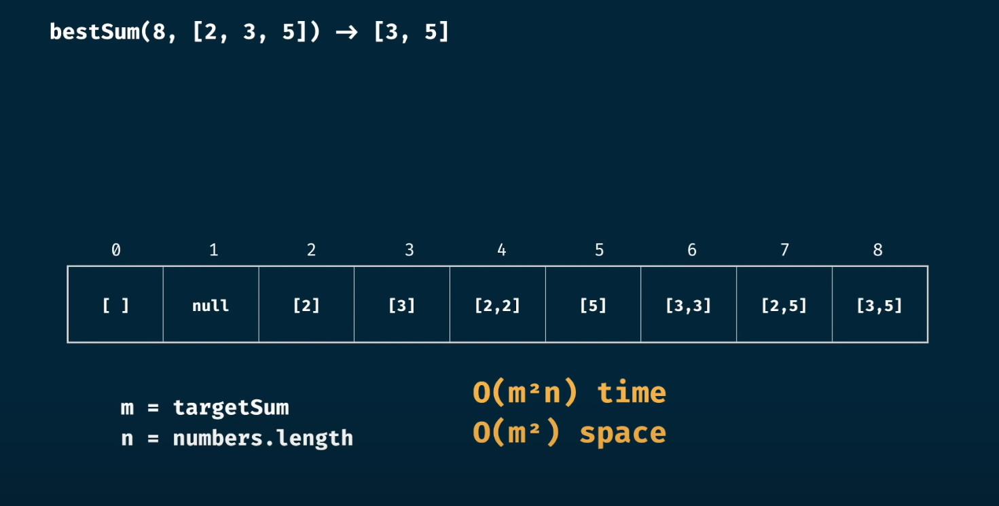

- [Binary system](#binary-system)
- [Data size](#data-size)
- [Algorithms](#algorithms)
  - [Big O notation](#big-o-notation)
  - [Memory addresses arrays and linked list](#memory-addresses-arrays-and-linked-list)
  - [traveling salesperson problem.](#traveling-salesperson-problem)
  - [Search](#search)
    - [Binary search](#binary-search)
  - [Sorting](#sorting)
    - [Selection sorting](#selection-sorting)
  - [Recursive](#recursive)
- [Dynamic programming](#dynamic-programming)
  - [Memoization](#memoization)
    - [Fib](#fib)
    - [Grid traveler](#grid-traveler)
    - [canSum](#cansum)
    - [howSum](#howsum)
    - [bestSum](#bestsum)
    - [canConstruct](#canconstruct)
    - [countConstruct](#countconstruct)
    - [allConstruct](#allconstruct)
  - [Tabulation](#tabulation)
    - [Fib](#fib-1)
    - [GridTraveler](#gridtraveler)
    - [CanSum](#cansum-1)
    - [howSum](#howsum-1)
    - [bestSum](#bestsum-1)
    - [canConstruct](#canconstruct-1)


# Binary system


# Data size


# Algorithms

- An algorithm is a set of instructions for accomplishing a task

- The study of algorithms is concerned with both **correctness** (will this algorithm work for all input?) and **performance** (is this the most efficient way to solve this problem?).

Generally you want to choose the most efficient algorithm—whether you’re trying to optimize for time or space.


## Big O notation 
Big O notation lets you compare the number of operations. It tells you how fast the algorithm grows. Big O establishes a worst-case run time

+ O(log n), also known as log time. Example: Binary search.
+ O(n), also known as linear time. Example: Simple search.
+ O(n * log n). Example: A fast sorting algorithm, like quicksort
+ O(n2). Example: A slow sorting algorithm, like selection sort
+ O(n!). Example: A really slow algorithm, like the traveling salesperson

## Memory addresses arrays and linked list

Sometimes you need to store a list of elements in memory. Suppose you’re writing an app to manage your todos. You’ll want to store the todos as a list in memory. 

 Using an array means all your tasks are stored contiguously (right next to each other) in memory. Now suppose you want to add a fourth task. But the next drawer is taken up by someone else’s stuff! It’s like going to a movie with your friends and finding a place to sit—but another friend joins you, and there’s no place for them. You have to move to a new spot where you all fit. In this case, you need to ask your computer for a different chunk of memory that can fit four tasks. Then you need to move all your tasks there. If another friend comes by, you’re out of room again—and you all have to move a second time! What a pain. Similarly, adding new items to an array can be a big pain. If you’re out of space and need to move to a new spot in memory every time, adding a new item will be really slow. One easy fix is to “hold seats”: even if you have only 3 items in your task list, you can ask the computer for 10 slots, just in case. Then you can add 10 items to your task list without having to move. This is a good workaround, but you should be aware of a couple of downsides:

You may not need the extra slots that you asked for, and then that memory will be wasted. You aren’t using it, but no one else can use it either.
You may add more than 10 items to your task list and have to move anyway.
So it’s a good workaround, but it’s not a perfect solution. Linked lists solve this problem of adding items.

With linked lists, your items can be anywhere in memory. Each item stores the address of the next item in the list. A bunch of random memory addresses are linked together.

It’s like a treasure hunt. You go to the first address, and it says, “The next item can be found at address 123.” So you go to address 123, and it says, “The next item can be found at address 847,” and so on. Adding an item to a linked list is easy: you stick it anywhere in memory and store the address with the previous item.

With linked lists, you never have to move your items. You also avoid another problem. Let’s say you go to a popular movie with five of your friends. The six of you are trying to find a place to sit, but the theater is packed. There aren’t six seats together. Well, sometimes this happens with arrays. Let’s say you’re trying to find 10,000 slots for an array. Your memory has 10,000 slots, but it doesn’t have 10,000 slots together. You can’t get space for your array! A linked list is like saying, “Let’s split up and watch the movie.” If there’s space in memory, you have space for your linked list.

Suppose you want to read the last item in a linked list. You can’t just read it, because you don’t know what address it’s at. Instead, you have to go to item #1 to get the address for item #2. Then you have to go to item #2 to get the address for item #3. And so on, until you get to the last item. Linked lists are great if you’re going to read all the items one at a time: you can read one item, follow the address to the next item, and so on. But if you’re going to keep jumping around, linked lists are terrible.

Arrays are different. You know the address for every item in your array. For example, suppose your array contains five items, and you know it starts at address 00. What is the address of item #5?  Simple math tells you: it’s 04. Arrays are great if you want to read random elements, because you can look up any element in your array instantly. With a linked list, the elements aren’t next to each other, so you can’t instantly calculate the position of the fifth element in memory—you have to go to the first element to get the address to the second element, then go to the second element to get the address of the third element, and so on until you get to the fifth element.

It’s worth mentioning that insertions and deletions are O(1) time only if you can instantly access the element to be deleted. It’s a common practice to keep track of the first and last items in a linked list, so it would take only O(1) time to delete those.

##  traveling salesperson problem.

The travelling salesman problem (TSP) asks the following question: "Given a list of cities and the distances between each pair of cities, what is the shortest possible route that visits each city exactly once and returns to the origin city?" It is an NP-hard problem in combinatorial optimization, important in theoretical computer science and operations research.

O(n!)

## Search

### Binary search 

Binary search is an algorithm; its input is a sorted list of elements. With binary search, you guess the middle number and eliminate half the remaining numbers every time. For any list of n, binary search will take $log_2n$ n steps to run in the worst case, whereas simple search will take n steps.


```java
    int binarySearch(int arr[], int x)
    {
        int l = 0, r = arr.length - 1;
        while (l <= r) {
            int m = l + (r - l) / 2;
 
            // Check if x is present at mid
            if (arr[m] == x)
                return m;
 
            // If x greater, ignore left half
            if (arr[m] < x)
                l = m + 1;
 
            // If x is smaller, ignore right half
            else
                r = m - 1;
        }
 
        // If we reach here, then element was
        // not present
        return -1;
    }
```


## Sorting

### Selection sorting


```java
public static void sortAscending(final int[] arr) {
    for (int i = 0; i < arr.length - 1; i++) {
        int minElementIndex = i;
        for (int j = i + 1; j < arr.length; j++) {
            if (arr[minElementIndex] > arr[j]) {
                minElementIndex = j;
            }
        }

        if (minElementIndex != i) {
            int temp = arr[i];
            arr[i] = arr[minElementIndex];
            arr[minElementIndex] = temp;
        }
    }
}

public static void sortDescending(final int[] arr) {
    for (int i = 0; i < arr.length - 1; i++) {
        int maxElementIndex = i;
        for (int j = i + 1; j < arr.length; j++) {
            if (arr[maxElementIndex] < arr[j]) {
                maxElementIndex = j;
            }
        }

        if (maxElementIndex != i) {
            int temp = arr[i];
            arr[i] = arr[maxElementIndex];
            arr[maxElementIndex] = temp;
        }
    }
}       
```

## Recursive

When you write a recursive function, you have to tell it when to stop recursing. That’s why every recursive function has two parts: 
- **recursive case** -  when the function calls itself
- **base case** - when the function doesn’t call itself again ... so it doesn’t go into an infinite loop.
  
  so it doesn’t go into an infinite loop.

```python
def factorial(x):
  if x == 1:
    return 1
  else:
    return x * factorial(x-1)
```

# Dynamic programming


## Memoization


### Fib

Write a function `fib(n)` that makes in a number as an argument. The function should return the n-th number of the Fibonacci sequence.

The 1st and 2nd number of the sequence is 1. 
To generate the next number of the sequence, we sum the previous two.


how to calculate time complexity


it can be possible to memorize a previous results


```java
public class Fib {

    public static long fib(long n, Map<Long, Long> memo) {

        if (memo.containsKey(n)) {
            return memo.get(n);
        }

        if (n <= 2) return 1;


        memo.put(n, fib(n - 1, memo) + fib(n - 2, memo));
        return memo.get(n);
    }

    public static long fib(long n) {      // TIME 0(N)
        return fib(n, new HashMap<>());
    }

    public static long fibBrut(long n) {  // TIME 0(2^N)
        if (n <= 2) return 1;
        return fib(n - 1) + fib(n - 2);
    }

    public static void main(String[] args) {
        System.out.println(fib(1));
        System.out.println(fib(9)); // 34
        System.out.println(fib(50)); // 12586269025
    }
}
```


### Grid traveler

You are a traveler on a 2D grid. You begin in the top-left corner and your goal is to travel to the bottom-right corner. You may only move down or right.

How many ways can you travel to the goal on a grid with dimensions m * n

Write functions `gridTraveler(m, n)` that calculates this


```java
import java.util.HashMap;
import java.util.Map;

public class GridTraveler {

    public static int gridTraveler(int m, int n, Map<String, Integer> memo) {
        String preparedMemoKey = "%s,%s".formatted(m, n);
        if (memo.containsKey(preparedMemoKey)) {
            return memo.get(preparedMemoKey);
        }
        if (m == 0 || n == 0) {
            return 0;
        }
        if (m == 1 && n == 1) {
            return 1;
        }

        memo.put(preparedMemoKey, gridTraveler(m - 1, n, memo) + gridTraveler(m, n - 1, memo));
        return memo.get(preparedMemoKey);
    }

    public static int gridTraveler(int m, int n) {

        return gridTraveler(m, n, new HashMap<>());
    }

    public static int gridTravelerBrut(int m, int n) {

        if (m == 0 || n == 0) {
            return 0;
        }
        if (m == 1 && n == 1) {
            return 1;
        }
        return gridTravelerBrut(m - 1, n) + gridTravelerBrut(m, n - 1);
    }

    public static void main(String[] args) {
        System.out.println(gridTraveler(8, 0)); // 1
        System.out.println(gridTraveler(1, 1)); // 1
        System.out.println(gridTraveler(3, 2)); // 3
        System.out.println(gridTraveler(30, 30)); // 51542064
    }
}

```


### canSum

Write a function `canSum(targetSum, numbers)` that takes in a targetSum and array of numbers as arguments

The function  should return a boolean indicating whether or not it is possible to generate the targetSum using numbers from the array

You may use an element of the array as many times as needed.

You may assume that all input numbers are non-negative


```java
public class CanSum {

    public static boolean canSumBrut(int targetSum, int[] numbers) {

        if (targetSum == 0) {
            return true;
        }
        if (targetSum < 0) {
            return false;
        }

        for (int number : numbers) {
            if (canSumBrut(targetSum - number, numbers)) {
                return true;
            }
        }

        return false;
    }

    public static void main(String[] args) {

        System.out.println(canSumBrut(7, new int[]{2, 3})); // true
        System.out.println(canSumBrut(7, new int[]{5, 3, 4, 7})); // true
        System.out.println(canSumBrut(7, new int[]{2, 4})); // false
        System.out.println(canSumBrut(8, new int[]{2, 3, 5})); // true
        System.out.println(canSumBrut(300, new int[]{7, 14})); // false

    }
}
```


```java
public static boolean canSum(int targetSum, int[] numbers, Map<Integer, Boolean> memo) {

        if (memo.containsKey(targetSum)) {
            return memo.get(targetSum);
        }

        if (targetSum == 0) {
            return true;
        }
        if (targetSum < 0) {
            return false;
        }

        for (int number : numbers) {
            int remainder = targetSum - number;
            boolean result = canSum(remainder, numbers, memo);
            memo.put(targetSum, result);
            if (result) {
                return true;
            }
        }

        return false;
    }


    public static boolean canSum(int targetSum, int[] numbers) {
        return canSum(targetSum, numbers, new HashMap<>());
    }

    public static void main(String[] args) {

        System.out.println(canSum(7, new int[]{2, 3})); // true
        System.out.println(canSum(7, new int[]{5, 3, 4, 7})); // true
        System.out.println(canSum(7, new int[]{2, 4})); // false
        System.out.println(canSum(8, new int[]{2, 3, 5})); // true
        System.out.println(canSum(300, new int[]{7, 14})); // false

    }
```


### howSum

Write a function `howSum(targetSum, numbers)` that takes in a targetSum and an array of numbers as argument

The function should return an array containing any combination of elements that add up to exactly the targetSum. If there is no combination that adds up to the targetSum, then return null

If there are multiple combinations possible, you may return any single one.

```java
package dynamic.memo;

import java.util.ArrayList;
import java.util.Arrays;

public class HowSum {

    public static int[] howSum(int targetSum, int[] numbers) {

        if (targetSum < 0) {
            return null;
        }

        if (targetSum == 0) {
            return new int[]{};
        }

        for (int number : numbers) {
            int[] sum = howSum(targetSum - number, numbers);
            if (sum != null) {
                return addToArray(sum, number);
            }
        }

        return null;
    }

    private static int[] addToArray(int[] arrayToAdd, int number) {
        int[] result = Arrays.copyOf(arrayToAdd, arrayToAdd.length + 1);
        result[result.length - 1] = number;
        return result;
    }

    public static void main(String[] args) {

        // m = targetSum
        // n =  numbers.lengh
        // time: 0(n ^ m * m)
        // space: 0(m)
        System.out.println(Arrays.toString(howSum(7, new int[]{2, 3}))); // [3, 2, 2]
        System.out.println(Arrays.toString(howSum(7, new int[]{5, 3, 4, 7}))); // [4, 3]
        System.out.println(Arrays.toString(howSum(7, new int[]{2, 4}))); // null
        System.out.println(Arrays.toString(howSum(8, new int[]{2, 3, 5}))); // [2,2,2,2]
        System.out.println(Arrays.toString(howSum(300, new int[]{7, 14}))); // null

    }
}

```

after memoization

```java
    public static int[] howSum(int targetSum, int[] numbers, Map<Integer, int[]> memo) {

        if (memo.containsKey(targetSum)) {
            return memo.get(targetSum);
        }

        if (targetSum < 0) {
            return null;
        }

        if (targetSum == 0) {
            return new int[]{};
        }

        for (int number : numbers) {
            int[] sum = howSum(targetSum - number, numbers, memo);
            if (sum != null) {
                int[] result = addToArray(sum, number);
                memo.put(targetSum, result);
                return result;
            }
        }

        memo.put(targetSum, null);
        return null;
    }

// time: 0(n * m^2)
// time 0(m ^ 2)

    public static int[] howSum(int targetSum, int[] numbers) {
        return howSum(targetSum, numbers, new HashMap<>());
    }
```


### bestSum

Write a function `bestSum(targetSum, numbers)` that takes in a targetSum and an array of numbers as argument

The function should return an array containing the shortest combination of numbers that add up to exactly the targetSum. If there is no combination that adds up to the targetSum, then return null

If there is a tie for the shortest combination you may return any one of the shortest

If there are multiple combinations possible, you may return any single one.


```java
public static int[] bestSumBrut(int targetSum, int[] numbers) {

        if (targetSum < 0) {
            return null;
        }

        if (targetSum == 0) {
            return new int[]{};
        }

        int[] shortestCombination = null;

        for (int number : numbers) {
            int[] sum = bestSumBrut(targetSum - number, numbers);
            if (sum != null) {
                int[] resultCombination = addToArray(sum, number);
                if (shortestCombination == null || shortestCombination.length > resultCombination.length) {
                    shortestCombination = resultCombination;
                }
            }
        }

        return shortestCombination;
    }
```

after memoization

```java
package dynamic.memo;

import java.util.Arrays;
import java.util.HashMap;
import java.util.Map;

public class BestSum {


    public static int[] bestSumBrut(int targetSum, int[] numbers) {

        if (targetSum < 0) {
            return null;
        }

        if (targetSum == 0) {
            return new int[]{};
        }

        int[] shortestCombination = null;

        for (int number : numbers) {
            int[] sum = bestSumBrut(targetSum - number, numbers);
            if (sum != null) {
                int[] resultCombination = addToArray(sum, number);
                if (shortestCombination == null || shortestCombination.length > resultCombination.length) {
                    shortestCombination = resultCombination;
                }
            }
        }

        return shortestCombination;
    }


    public static int[] bestSum(int targetSum, int[] numbers, Map<Integer, int[]> memo) {

        if (memo.containsKey(targetSum)) {
            return memo.get(targetSum);
        }

        if (targetSum < 0) {
            return null;
        }

        if (targetSum == 0) {
            return new int[]{};
        }

        int[] shortestCombination = null;

        for (int number : numbers) {
            int[] sum = bestSum(targetSum - number, numbers, memo);
            if (sum != null) {
                int[] resultCombination = addToArray(sum, number);
                if (shortestCombination == null || shortestCombination.length > resultCombination.length) {
                    shortestCombination = resultCombination;
                }
            }
        }

        memo.put(targetSum, shortestCombination);

        return shortestCombination;
    }

    public static int[] bestSum(int targetSum, int[] numbers) {
        return bestSum(targetSum, numbers, new HashMap<>());
    }

    private static int[] addToArray(int[] arrayToAdd, int number) {
        int[] result = Arrays.copyOf(arrayToAdd, arrayToAdd.length + 1);
        result[result.length - 1] = number;
        return result;
    }

    public static void main(String[] args) {


        // m = targetSum
        // n =  numbers.lengh

        // brut
        // time: 0(n ^ m * m)
        // space: 0(m ^ 2)

        // memo
        // time: 0(n * m^2)
        // time 0(m ^ 2)
        System.out.println(Arrays.toString(bestSum(7, new int[]{5, 3, 4, 7}))); // [7]
        System.out.println(Arrays.toString(bestSum(8, new int[]{2, 3, 5}))); // [3,5]
        System.out.println(Arrays.toString(bestSum(8, new int[]{1, 4, 5}))); // [4,4]
        System.out.println(Arrays.toString(bestSum(100, new int[]{1, 2, 5, 25}))); // [25,25,25,25]

    }
}

```


### canConstruct

Write a function `canConstruct(target, wordBank)` that accepts a target and an array of strings.

The function should return a boolean indicating whether or not the target can be constructed by concatenating elements of the wordBank array.

You may reuse elements of the wordBank as many times as you needed.


```java
package dynamic.memo;

public class CanConstruct {

    public static boolean canConstructBrut(String target, String[] wordBank) {

        if (target.isEmpty()) {
            return true;
        }

        for (String word : wordBank) {
            if (target.startsWith(word)) {
                String suffix = target.substring(word.length());
                if (canConstructBrut(suffix, wordBank)) {
                    return true;
                }
            }
        }

        return false;
    }

    public static void main(String[] args) {

        // m length
        // n wordBank length

        // brute
        // time: 0( (n ^ m) * m )
        // space: 0 (m ^ 2)

        System.out.println(canConstructBrut("abcdef", new String[]{"ab", "abc", "cd", "def", "abcd"})); // true
        System.out.println(canConstructBrut("skateboard", new String[]{"bo", "rd", "ate", "t", "ska", "sk", "boar"})); // false
        System.out.println(canConstructBrut("enterapotentpot", new String[]{"a", "p", "ent", "enter", "ot", "o", "t"})); // true
        System.out.println(canConstructBrut("eeeeeeeeeeeeeeeeeef", new String[]{"e", "ee", "eee", "eeee", "eeeee", "eeeeee"})); // false
    }
}
```


```java
package dynamic.memo;

import java.util.HashMap;
import java.util.Map;

public class CanConstruct {

    public static boolean canConstructBrut(String target, String[] wordBank) {

        if (target.isEmpty()) {
            return true;
        }

        for (String word : wordBank) {
            if (target.startsWith(word)) {
                String suffix = target.substring(word.length());
                if (canConstructBrut(suffix, wordBank)) {
                    return true;
                }
            }
        }

        return false;
    }

    public static boolean canConstruct(String target, String[] wordBank) {
        return canConstruct(target, wordBank, new HashMap<>());
    }


    public static boolean canConstruct(String target, String[] wordBank, Map<String, Boolean> memo) {

        if (memo.containsKey(target)) {
            return memo.get(target);
        }

        if (target.isEmpty()) {
            return true;
        }

        for (String word : wordBank) {
            if (target.startsWith(word)) {
                String suffix = target.substring(word.length());
                if (canConstruct(suffix, wordBank, memo)) {
                    memo.put(target, true);
                    return true;
                }
            }
        }

        memo.put(target, false);
        return false;
    }

    public static void main(String[] args) {

        // m length
        // n wordBank length

        // brut
        // time: 0( n ^ m * m)
        // space: 0 (m ^ 2)
        
        // memo
        // time: 0( n * m ^ 2)
        // space: 0( m ^ 2)

        System.out.println(canConstruct("abcdef", new String[]{"ab", "abc", "cd", "def", "abcd"})); // true
        System.out.println(canConstruct("skateboard", new String[]{"bo", "rd", "ate", "t", "ska", "sk", "boar"})); // false
        System.out.println(canConstruct("enterapotentpot", new String[]{"a", "p", "ent", "enter", "ot", "o", "t"})); // true
        System.out.println(canConstruct("eeeeeeeeeeeeeeeeeeeeeeef", new String[]{"e", "ee", "eee", "eeee", "eeeee", "eeeeee"})); // false
    }
}

```


### countConstruct

Write a function `countConstruct(target, wordBank)` that accepts a target string and an array of strings.

The function should return the number of ways that the target can be constructed by concatenating elements of wordBank array

You may reuse elements of the wordBank as many times as you needed.


```java
    public static int countConstructBrut(String target, String[] wordBank) {

        if (target.isEmpty()) {
            return 1;
        }

        int result = 0;

        for (String word : wordBank) {
            if (target.startsWith(word)) {
                String suffix = target.substring(word.length());
                result += countConstructBrut(suffix, wordBank);
            }
        }

        return result;
    }


    public static void main(String[] args) {

        // m length
        // n wordBank length

        // brut
        // time: 0( n ^ m * m)
        // space: 0 (m ^ 2)

        // memo
        // time: 0( n * m ^ 2)
        // space: 0( m ^ 2)

        System.out.println(countConstructBrut("purple", new String[]{"purp", "p", "ur", "le", "purpl"})); // 2
        System.out.println(countConstructBrut("abcdef", new String[]{"ab", "abc", "cd", "def", "abcd"})); // 1
        System.out.println(countConstructBrut("skateboard", new String[]{"bo", "rd", "ate", "t", "ska", "sk", "boar"})); // 0
        System.out.println(countConstructBrut("enterapotentpot", new String[]{"a", "p", "ent", "enter", "ot", "o", "t"})); // 4
        System.out.println(countConstructBrut("eeeeeeeeeeeeeeeeeeeeeeef", new String[]{"e", "ee", "eee", "eeee", "eeeee", "eeeeee"})); // 0
    }
```

after memo

```java
package dynamic.memo;

import java.util.HashMap;
import java.util.Map;

public class CountConstruct {


    public static int countConstruct(String target, String[] wordBank) {
        return countConstruct(target, wordBank, new HashMap<>());
    }


    public static int countConstruct(String target, String[] wordBank, Map<String, Integer> memo) {

        if (memo.containsKey(target)) {
            return memo.get(target);
        }

        if (target.isEmpty()) {
            return 1;
        }

        int result = 0;

        for (String word : wordBank) {
            if (target.startsWith(word)) {
                String suffix = target.substring(word.length());
                result += countConstruct(suffix, wordBank, memo);
            }
        }

        memo.put(target, result);
        return result;
    }

    public static int countConstructBrut(String target, String[] wordBank) {

        if (target.isEmpty()) {
            return 1;
        }

        int result = 0;

        for (String word : wordBank) {
            if (target.startsWith(word)) {
                String suffix = target.substring(word.length());
                result += countConstructBrut(suffix, wordBank);
            }
        }

        return result;
    }


    public static void main(String[] args) {

        // m length
        // n wordBank length

        // brut
        // time: 0( n ^ m * m)
        // space: 0 (m ^ 2)

        // memo
        // time: 0( n * m ^ 2)
        // space: 0( m ^ 2)

        System.out.println(countConstruct("purple", new String[]{"purp", "p", "ur", "le", "purpl"})); // 2
        System.out.println(countConstruct("abcdef", new String[]{"ab", "abc", "cd", "def", "abcd"})); // 1
        System.out.println(countConstruct("skateboard", new String[]{"bo", "rd", "ate", "t", "ska", "sk", "boar"})); // 0
        System.out.println(countConstruct("enterapotentpot", new String[]{"a", "p", "ent", "enter", "ot", "o", "t"})); // 4
        System.out.println(countConstruct("eeeeeeeeeeeeeeeeeeeeeeef", new String[]{"e", "ee", "eee", "eeee", "eeeee", "eeeeee"})); // 0
    }
}

```


### allConstruct

Write a function `allConstruct(target, wordBank)` that accepts a target and an array of strings.

The function should return a 2D array containing all the ways that the target can be constructed by concatenating elements of the wordBank array. Each elements of the 2D array should represents one combination that construct the target. Each element of the 2D array should represent one combination that constructs the target. 

You may reuse elements of the wordBank as many times as you needed.


```java
public static List<List<String>> allConstructBrut(String target, String[] wordBank) {

        if (target.isEmpty()) {
            return List.of(List.of());
        }

        List<List<String>> result = new ArrayList<>();

        for (String word : wordBank) {
            if (target.startsWith(word)) {

                String suffix = target.substring(word.length());
                List<List<String>> suffixWays = allConstructBrut(suffix, wordBank);

                List<List<String>> suffixWaysWithAddedWord = suffixWays.stream().map(ways -> {
                    List<String> waysWithAddedWord = new ArrayList<>();
                    waysWithAddedWord.add(word);
                    waysWithAddedWord.addAll(ways);
                    return waysWithAddedWord;
                }).toList();

                result.addAll(suffixWaysWithAddedWord);
            }
        }
        return result;
    }


    public static void main(String[] args) {

        System.out.println(allConstructBrut("purple", new String[]{"purp", "p", "ur", "le", "purpl"}));
        // [
        //  [ "purp", "le" ]
        //  [ "p", "ur", "p", "le" ]
        // ]
        System.out.println(allConstructBrut("abcdef", new String[]{"ab", "abc", "cd", "def", "abcd", "ef", "c"}));
        // [
        //  [ "ab", "cd", "ef" ]
        //  [ "ab", "c", "def" ]
        //  [ "abc", "def" ]
        //  [ "abcd", "ef" ]
        // ]
        System.out.println(allConstructBrut("skateboard", new String[]{"bo", "rd", "ate", "t", "ska", "sk", "boar"})); // []
        System.out.println(allConstructBrut("eeeeeeeeeeeeeeeeeeeeeeez", new String[]{"e", "ee", "eee", "eeee", "eeeee", "eeeeee"})); // []
    }
```

after memoization

```java
package dynamic.memo;

import java.util.ArrayList;
import java.util.HashMap;
import java.util.List;
import java.util.Map;

public class AllConstruct {


    public static List<List<String>> allConstruct(String target, String[] wordBank, Map<String, List<List<String>>> memo) {

        if (memo.containsKey(target)) {
            return memo.get(target);
        }

        if (target.isEmpty()) {
            return List.of(List.of());
        }

        List<List<String>> result = new ArrayList<>();

        for (String word : wordBank) {
            if (target.startsWith(word)) {

                String suffix = target.substring(word.length());
                List<List<String>> suffixWays = allConstruct(suffix, wordBank, memo);

                List<List<String>> suffixWaysWithAddedWord = suffixWays.stream().map(ways -> {
                    List<String> waysWithAddedWord = new ArrayList<>();
                    waysWithAddedWord.add(word);
                    waysWithAddedWord.addAll(ways);
                    return waysWithAddedWord;
                }).toList();

                result.addAll(suffixWaysWithAddedWord);
            }
        }
        memo.put(target, result);
        return result;
    }

    public static List<List<String>> allConstruct(String target, String[] wordBank) {
        return allConstruct(target, wordBank, new HashMap<>());
    }

    public static List<List<String>> allConstructBrut(String target, String[] wordBank) {

        if (target.isEmpty()) {
            return List.of(List.of());
        }

        List<List<String>> result = new ArrayList<>();

        for (String word : wordBank) {
            if (target.startsWith(word)) {

                String suffix = target.substring(word.length());
                List<List<String>> suffixWays = allConstructBrut(suffix, wordBank);

                List<List<String>> suffixWaysWithAddedWord = suffixWays.stream().map(ways -> {
                    List<String> waysWithAddedWord = new ArrayList<>();
                    waysWithAddedWord.add(word);
                    waysWithAddedWord.addAll(ways);
                    return waysWithAddedWord;
                }).toList();

                result.addAll(suffixWaysWithAddedWord);
            }
        }
        return result;
    }


    public static void main(String[] args) {

        System.out.println(allConstruct("purple", new String[]{"purp", "p", "ur", "le", "purpl"}));
        // [
        //  [ "purp", "le" ]
        //  [ "p", "ur", "p", "le" ]
        // ]
        System.out.println(allConstruct("abcdef", new String[]{"ab", "abc", "cd", "def", "abcd", "ef", "c"}));
        // [
        //  [ "ab", "cd", "ef" ]
        //  [ "ab", "c", "def" ]
        //  [ "abc", "def" ]
        //  [ "abcd", "ef" ]
        // ]
        System.out.println(allConstruct("skateboard", new String[]{"bo", "rd", "ate", "t", "ska", "sk", "boar"})); // []
        System.out.println(allConstruct("eeeeeeeeeeeeeeeeeeeeeeez", new String[]{"e", "ee", "eee", "eeee", "eeeee", "eeeeee"})); // []
    }
}

```


## Tabulation


### Fib


```java
package dynamic.tab;

public class Fib {

    public static int fib(int n) {

        int[] tab = new int[n + 1];
        tab[1] = 1;

        for (int i = 0; i <= n; i++) {
            if (i + 1 < tab.length) {
                tab[i + 1] += tab[i];
            }
            if (i + 2 < tab.length) {
                tab[i + 2] += tab[i];
            }
        }

        return tab[n];
    }

    public static void main(String[] args) {
        
        // TIME: 0(n)
        // SPACE: 0(n)
        
        System.out.println(fib(1));
        System.out.println(fib(9)); // 34
        System.out.println(fib(30)); // 832040
    }
}

```

### GridTraveler

You are a traveler on a 2D grid. You begin in the top-left corner and your goal is to travel to the bottom-right corner. You may only move down or right.

How many ways can you travel to the goal on a grid with dimensions m * n

Write functions `gridTraveler(m, n)` that calculates this


```java
package dynamic.tab;

public class GridTraveler {

    public static int gridTraveler(int m, int n) {

        if (m == 0 || n == 0) {
            return 0;
        }

        int[][] tab = new int[m + 1][n + 1];
        tab[1][1] = 1;

        for (int i = 0; i <= m; i++) {

            for (int j = 0; j <= n; j++) {

                int currentValue = tab[i][j];
                if (j + 1 <= n) {
                    tab[i][j + 1] += currentValue;
                }
                if (i + 1 <= m) {
                    tab[i + 1][j] += currentValue;
                }
            }
        }

        return tab[m][n];
    }


    public static void main(String[] args) {
        System.out.println(gridTraveler(8, 0)); // 1
        System.out.println(gridTraveler(1, 1)); // 1
        System.out.println(gridTraveler(3, 2)); // 3
        System.out.println(gridTraveler(30, 30)); // 51542064
    }

}

```

### CanSum

Write a function `canSum(targetSum, numbers)` that takes in a targetSum and array of numbers as arguments

The function  should return a boolean indicating whether or not it is possible to generate the targetSum using numbers from the array

You may use an element of the array as many times as needed.

You may assume that all input numbers are non-negative


```java
package dynamic.tab;

public class CanSum {

    public static boolean canSum(int targetSum, int[] numbers) {

        boolean[] tab = new boolean[targetSum + 1];
        tab[0] = true;

        for (int i = 0; i < tab.length; i++) {

            if (tab[i]) {
                for (int number : numbers) {
                    int positionToTrue = i + number;
                    if (positionToTrue < tab.length) {
                        tab[positionToTrue] = true;
                    }
                }
            }
        }


        return tab[targetSum];
    }

    public static void main(String[] args) {
        
        // m = targetSum
        // n = numbers.length

        // TIME 0 (nm)
        // SPACE 0(m)
        
        System.out.println(canSum(0, new int[]{2, 3})); // true
        System.out.println(canSum(7, new int[]{5, 3, 4, 7})); // true
        System.out.println(canSum(7, new int[]{2, 4})); // false
        System.out.println(canSum(8, new int[]{2, 3, 5})); // true
        System.out.println(canSum(300, new int[]{7, 14})); // false

    }

}

```

### howSum

Write a function `howSum(targetSum, numbers)` that takes in a targetSum and an array of numbers as argument

The function should return an array containing any combination of elements that add up to exactly the targetSum. If there is no combination that adds up to the targetSum, then return null

If there are multiple combinations possible, you may return any single one.


```java
package dynamic.tab;

import java.util.Arrays;

public class HowSum {

    public static int[] howSum(int targetSum, int[] numbers) {

        int[][] tab = new int[targetSum + 1][];
        tab[0] = new int[0];

        for (int i = 0; i < tab.length; i++) {

            int[] currentItem = tab[i];
            if (currentItem != null) {
                for (int number : numbers) {
                    int positionToAdd = i + number;
                    if (positionToAdd < tab.length) {
                        tab[positionToAdd] = addToArray(currentItem, number);
                    }
                }
            }
        }

        return tab[targetSum];
    }

    private static int[] addToArray(int[] arrayToAdd, int number) {
        int[] result = Arrays.copyOf(arrayToAdd, arrayToAdd.length + 1);
        result[result.length - 1] = number;
        return result;
    }

    public static void main(String[] args) {


        // m = targetSum
        // n =  numbers.length

        System.out.println(Arrays.toString(howSum(7, new int[]{2, 3}))); // [3, 2, 2]
        System.out.println(Arrays.toString(howSum(7, new int[]{5, 3, 4, 7}))); // [4, 3]
        System.out.println(Arrays.toString(howSum(7, new int[]{2, 4}))); // null
        System.out.println(Arrays.toString(howSum(8, new int[]{2, 3, 5}))); // [2,2,2,2]
        System.out.println(Arrays.toString(howSum(300, new int[]{7, 14}))); // null

    }
}

```

### bestSum


Write a function `bestSum(targetSum, numbers)` that takes in a targetSum and an array of numbers as argument

The function should return an array containing the shortest combination of numbers that add up to exactly the targetSum. If there is no combination that adds up to the targetSum, then return null

If there is a tie for the shortest combination you may return any one of the shortest

If there are multiple combinations possible, you may return any single one.




```java
package dynamic.tab;

import java.util.Arrays;
import java.util.HashMap;
import java.util.Map;

public class BestSum {

    public static int[] bestSum(int targetSum, int[] numbers) {

        int[][] tab = new int[targetSum + 1][];
        tab[0] = new int[0];

        for (int i = 0; i < tab.length; i++) {
            int[] currentItem = tab[i];
            if (currentItem != null) {

                for (int number : numbers) {
                    int positionToAdd = i + number;
                    if (positionToAdd < tab.length) {
                        int[] candidate = addToArray(currentItem, number);
                        int[] valueOnPosition = tab[positionToAdd];
                        if (valueOnPosition == null || candidate.length < valueOnPosition.length) {
                            tab[positionToAdd] = candidate;
                        }
                    }
                }
            }
        }

        return tab[targetSum];
    }

    private static int[] addToArray(int[] arrayToAdd, int number) {
        int[] result = Arrays.copyOf(arrayToAdd, arrayToAdd.length + 1);
        result[result.length - 1] = number;
        return result;
    }

    public static void main(String[] args) {
        
        // m = targetSum
        // n =  numbers.lengh

        System.out.println(Arrays.toString(bestSum(7, new int[]{5, 3, 4, 7}))); // [7]
        System.out.println(Arrays.toString(bestSum(8, new int[]{2, 3, 5}))); // [3,5]
        System.out.println(Arrays.toString(bestSum(8, new int[]{1, 4, 5}))); // [4,4]
        System.out.println(Arrays.toString(bestSum(100, new int[]{1, 2, 5, 25}))); // [25,25,25,25]

    }
}

```

### canConstruct


Write a function `canConstruct(target, wordBank)` that accepts a target and an array of strings.

The function should return a boolean indicating whether or not the target can be constructed by concatenating elements of the wordBank array.

You may reuse elements of the wordBank as many times as you needed.


```java
package dynamic.tab;

public class CanConstruct {

    public static boolean canConstruct(String target, String[] wordBank) {

        boolean[] tab = new boolean[target.length() + 1];
        tab[0] = true;

        for (int i = 0; i < tab.length; i++) {
            if (tab[i]) {
                for (String word : wordBank) {
                    if (i + word.length() < tab.length) {
                        String targetOnPosition = target.substring(i, i + word.length());
                        if (targetOnPosition.equals(word)) {
                            tab[i + word.length()] = true;
                        }
                    }
                }
            }

        }

        return tab[target.length()];
    }

    public static void main(String[] args) {

        // m length
        // n wordBank length


        System.out.println(canConstruct("abc", new String[]{"abc"})); // true
        System.out.println(canConstruct("abcdef", new String[]{"ab", "abc", "cd", "def", "abcd"})); // true
        System.out.println(canConstruct("skateboard", new String[]{"bo", "rd", "ate", "t", "ska", "sk", "boar"})); // false
        System.out.println(canConstruct("enterapotentpot", new String[]{"a", "p", "ent", "enter", "ot", "o", "t"})); // true
        System.out.println(canConstruct("eeeeeeeeeeeeeeeeeeeeeeef", new String[]{"e", "ee", "eee", "eeee", "eeeee", "eeeeee"})); // false
    }
}

```

