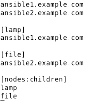
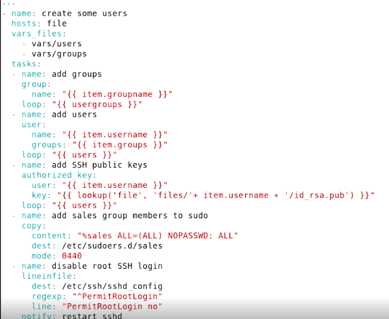

# Table of contents

- [Table of contents](#table-of-contents)
- [Настройка](#настройка)
  - [Подготовка узлов](#подготовка-узлов)
  - [inventory](#inventory)
    - [ansible.cfg](#ansiblecfg)
    - [первые команды](#первые-команды)
  - [Понимание ad-hoc модулей и playbook](#понимание-ad-hoc-модулей-и-playbook)
  - [Модули](#модули)
    - [Вызов модуля](#вызов-модуля)
    - [Получение справки по модулю](#получение-справки-по-модулю)
  - [Playbook](#playbook)
    - [Создание и вызов playbook](#создание-и-вызов-playbook)
    - [Расширенная диагностика запуска playbook](#расширенная-диагностика-запуска-playbook)
    - [Использование переменных](#использование-переменных)
      - [Обьявление переменных внутри playbook](#обьявление-переменных-внутри-playbook)
      - [Обьявление переменных внутри отдельного файла для группы хостов](#обьявление-переменных-внутри-отдельного-файла-для-группы-хостов)
    - [Ansible Facts](#ansible-facts)
    - [Ansible vault - средство для хранения секретов](#ansible-vault---средство-для-хранения-секретов)
    - [Лучшие практики по организации файловой структуры:](#лучшие-практики-по-организации-файловой-структуры)
    - [Управление задачами](#управление-задачами)
      - [Register (Результат команды помещаем в переменную)](#register-результат-команды-помещаем-в-переменную)
    - [Циклы:](#циклы)
    - [When (условие)](#when-условие)
    - [Handler](#handler)
    - [Шаблоны (Templates)](#шаблоны-templates)
    - [Операции с файлами](#операции-с-файлами)
    - [Ansible roles (Ansible Galaxy)](#ansible-roles-ansible-galaxy)
    - [Создание кастомных ролей](#создание-кастомных-ролей)
      - [Использование системных ролей](#использование-системных-ролей)

# Настройка

## Подготовка узлов

- Для примера у нас будет одна управляющая нода `ansible` и две дочерние.
- Создадим на всех нодах пользователя `ansible` и дадим ему права запрашивать `sudo` без ввода пароля. 
- Cкопируем через `ssh-copy-id` сертификат для аутентификации по сертификатую См. Руководство по linux.

Также пропишем в `/etc/hosts` ip адреса (если они есть) управляемых нод для того, чтобы использовать имена.


## inventory

Создадим `inventory` файл на управляющей ноде в домашнем каталоге пользователя.

```
[webservers]
ansible1
ansible2

[dbservers]
ansible1
ansible2

[lamp]
ansible1
```

- можно делать группы серверов. Есть группа `all`, куда входят все сервера.
- эталонный инвентори файл `/etc/ansible/hosts` с примерами, как писать inventory. Видно, что можно писать хосты, ip адреса,  а также группы серверов , диапазоны в названии. Не рекомендуется править его, лучше создать собственный inventory.


- Выше речь шла про статический inventory- список хостов. Для небольшого окружения он вполне подходит. Часто бывает полезным получать список хостов извне. Ansible поддерживает это. В документации есть набор скриптов для различного окружения, например получить список хостов ec2 Amazon.

Можно создавать вложенные группы черед  nodes:children. Например




Первая команда ansible . Показать все имена хостов из инвентори. Указываем файл инвентори через -i

ansible all -i inventory --list-hosts


### ansible.cfg

Файл настроек Ansible : /etc/ansible/ansible.cfg

Рекомендуется создать собственный файл в каталоге пользователя c таким же именем

\[defaults\]

remote_user = ansible

host\_key\_checking = false

inventory = inventory

\[privilege_escalation\]

become = True

become_method = sudo

become_user = root

become\_ask\_pass = False


### первые команды

Запускаем из домашней папки пользователя ansible

ansible all -m command -a "useradd bob"

All - группа серверов

-m модуль. В данном случае модуль command

-a агрументы для модуля

Итого создадим на серверах пользователя bob


Понимание ad-hoc модулей и playbook
-----------------------------------

Через m можем вызвать 1 модуль. Но часто конфигурация это вызов нескольких действий. В этом случае делают плейбуки, которые вызывают несколько модулей.


Модули
------

### Вызов модуля

Пример простого вызова (ad-hoc) модуля.

ansible all -m command -a "yum install -y mc"


Пример вызова модуля с аргументами

ansible all -m user -a "name=linda shell=/bin/bash"


Модуль command не позволяют делать piping, но есть модуль shell

ansible all -m shell -a "cat /etc/passwd | grep ansible"


Выше был пример вызова пакетного менеджера yum. Есть модуль package который может тоже самое, только через модуль

Стейт можно указать absent или present или


ansible all -m package -a "name=vsftpd state=installed"


### Получение справки по модулю

Вывести список всех модулей (их очень много \- много экранов):

ansible-doc -l | less


В примере выше добавляли пользователя через модуль command. Но есть модуль для работы с пользователями. Поищем его:


 ansible-doc -l | grep user


По каждому модулю есть справка, например ansible-doc user


Обязательные аргументы при вызове отмечены символом =


Внизу есть примеры. Правда они для плейбуков в yml формате

Playbook
--------

### Создание и вызов playbook

Пример:

\-\-\-

\- name: mytest

  hosts: all

  tasks:

  \- name: task1

    debug:

      msg: this is the debug module


Используем плагин debug который просто напишет сообщение в консоль:

ansible-playbook test.yml


Пример посложнее:

\-\-\-

\- name: deploy vsftpd

  hosts: ansible1

  tasks:

  \- name: install vsftpd

    yum: name=vsftpd

  \- name: enable vsftpd

    service: name=vsftpd enabled=true

  \- name: create readme file

    copy:

      content: "welcome to this FTP server"

      dest: /var/ftp/pub/README

      force: no

      mode: 0444

Тут главное заметить, что аргументы можно передавать как одной строкой сразу после модуля, так и делать полноценную yml структуру.


Первый раз


Второй раз


Установка httpd

\-\-\-

\- name: install httpd

  hosts: ansible2

  tasks:

    \- name: install package

      package:

        name: httpd

        state: present

    \- name: create an index.html

      copy:

        content: "welcome to this webserver"

        dest: /var/www/html/index.html

    \- name: start the service

      service:

        name: httpd

        state: started

        enabled: true

    \- name: open firewall

      firewalld:

        service: http

        permanent: yes

        state: enabled


Удаление httpd

\-\-\-

\- name: remove httpd

  hosts: ansible2

  tasks:

    \- name: close firewall

      firewalld:

        service: htpd

        permanent: yes

        state: disabled

    \- name: remove file

      file:

        path: /var/www/html/index.html

        state: absent

    \- name: remove package

      package:

        name: httpd

        state: absent

### Расширенная диагностика запуска playbook

Ключ -v позволяет увидеть расширенный вывод при запуске плейбука.

ansible-playbook -v ./uninstall-httpd.yml

Причем, есть до 4-х уровней детализации. Т.е -vv, -vvv, -vvvv. Последний вообще очень подробный.


### Использование переменных

#### Обьявление переменных внутри playbook

Внутри playbook можно использовать переменные.

\-\-\-

\- name: create a user using a variable

  hosts: all

  vars:

    user: lisa

  tasks:

    \- name: create a user {{ user }}

      user:

        name: "{{ user }}"


Тут важно, что в name ссылка на переменную в кавычках. Это важно, когда в строчке встречается переменная и она идет первой


#### Обьявление переменных внутри отдельного файла для группы хостов

Переменные можно задавать в отдельном файле для группы хостов.

Каталог для создания файла с переменными group_vars

mkdir group_vars


Создадим в нем файле для группы серверов lamp и укажем в нем переменные:


Добавим группу lamp в inventory


И напишем простой плейбук:

\-\-\-

\- name: configure web services

  hosts: lamp

  tasks:

    \- name: this is the {{ web_package }} package

      debug:

        msg: "Installing {{ web_package }}"

    \- name: this is the {{ web_service }} service

      debug:

        msg: "Starting {{ web_service }}"


Запустим плейбук


Видим, что переменные подставились из файла.

Также можно объявлять переменные для конкретного хоста в каталоге host_vars


Есть встроенные переменные, переменные уровня группы groups , а также hostvars (список переменных окружения на хосте)

У свойств есть приоритет. Наивысший приоритет имеют те, которые передаются из командной строки под ключом -e key=value

Далее идит переменные на уровне плейбука. Они имеют приоритет выше чем дефолтные переменные группы.

Переменные группы имеют приоритет выше чем переменные плейбука, выше них только переменные командной строки.

Наконец посление по приоритету это переменны из inventory.

Выше был пример с переменными из группы. Покажем, что переменные из командной строки имеют выше приоритет.


Теперь добавим переменную в плейбук. Покажем что переменные в плейбуке имеют приоритет над приоритетами группы


### Ansible Facts

Каждый раз при исполнении плейбука, ансибле запускает фазу gathering facts. Во время нее собирается много информации о хосте, которая  в дальнейшем может быть использована в плейбуке. Эта информация присваивается переменной ansible_facts

Простой пример:

\- name: show facts

  hosts: all

  tasks:

    \- name: pring facts

      debug:

        var: ansible_facts


\-\-\-

\- name: show ip of hosts

  hosts: all

  tasks:

    \- name: show IP address

      debug:

        msg: IP address {{ansible\_facts.default\_ipv4.address}}


### Ansible vault - средство для хранения секретов

Создание защифрованного хранилища

ansible-vault create secret.yml


Введем пароль для хранилища, затем откроется редактор с пустым файлом, добавим туда те свойства, которые хотим хранить внутри хранилища


И сохраним файл

Вот содержимое файла:


Демонстрация использования.

Создадим простой плейбук:

\-\-\-

\- name: create a user

  hosts: all

  vars_files:

    \- secret.yml

  tasks:

    \- name: creating user

      user:

        name: "{{ username }}"

        password: "{{ pwhash }}"


Передавать пароли так нельзя. Т.к их будет видно в shadow


### Лучшие практики по организации файловой структуры:

[https://docs.ansible.com/ansible/2.8/user\_guide/playbooks\_best_practices.html#directory-layout](https://www.google.com/url?q=https://docs.ansible.com/ansible/2.8/user_guide/playbooks_best_practices.html%23directory-layout&sa=D&source=editors&ust=1674732886701807&usg=AOvVaw2RBhPQozIHid4hNW-B5SxY)


### Управление задачами


#### Register (Результат команды помещаем в переменную)

Пример показывает, вызывали команду , сохранили результат stdout в переменную, далее можем использовать failed_when - условие определения неуспешности команды. Все последующие команды будут отменны.


T

Если напишем 

Ignore_errors тогда попадем во второй шаг


### Циклы:


Записали переменную в виде массива. Далее с помощью loop итерируемся по нему и подставляем в item значение из массива.


|     |     |
| --- | --- |
| \# Problem: |     |
|     | #   |
|     | \# If you use git submodules linking two private github repos, you'll need to create a separate deploy key for each. |
|     | \# Multiple keys are not supported by Ansible, nor does ansible (when running git module) resort to your `.ssh/config` file. |
|     | \# This means your ansible playbook will hang in this case. |
|     | #   |
|     | \# You can however use the ansible git module to checkout your repo in multiple steps, like this: |
|     | #   |
|     | \- hosts: webserver |
|     | vars: |
|     | \- destination: /your/dest/path |
|     | tasks: |
|     | \- name: App \| Cloning repos + submodules |
|     | git: repo=git@github.com:Organisation/{{ item.repo }}.git |
|     | dest={{ item.dest }} |
|     | accept_hostkey=yes |
|     | force=yes |
|     | recursive=no |
|     | key\_file=/home/user/.ssh/id\_rsa.github-{{ item.repo }} |
|     | with_items: |
|     | -   |
|     | dest: "{{ destination }}" |
|     | repo: PrimaryRepo |
|     | -   |
|     | dest: "{{ destination }}/app/core" |
|     | repo: SubmoduleRepo |

### When (условие)

Выполняем команды, если выполнилось условие. When использует массив фактов, которые собираеются на фазе gathering facts или проверки переменных, которые ранее поместили через register


Поменяем дату и увидим, что условие не выполнилось и команда не выполнилась.


Важно понимать что есть статегии сбора тасков. Можно посмотреть их описание в файле конфигурации.

/etc/ansible/ansible.cfg


Если поставить explicit факты будут собираться только если выставлена опция gathering_facts: True. По-умолчанию поведение implicitit , т.е собирается всегда, если не передана опция не собирать.

Помним что мы создавал файл локальных конфигураций для пользователя в его домашней директории. Добавим туда строчку включающую explicity режим сбора фактов.


Если запустим опять плейбук, получим ошибку. Т.к факты не собрались и нет такой переменной с датой.


Чтобы починить, явно указать на сбор фактов в плейбуке


Починилось


Пример установки пакетов только если дистрибутив линукса из списка допустимых:


Пример установки пакета с использованием цикла. Если есть определенная точка монтирования и места на ней достаточно, тогда устанавливаем пакет


Посмотрим какие точки монтирования есть на машинах


Поменяем на /vagrant


Пример рестартуем сервис, если команда вернула return code 0


пример с несколькими условиями


Удобная команда, чтобы посмотреть значения факта для набора серверов

ansible all -m setup -a "filter=ansible_distribution"


Сложное условие


### Handler


В случае если все таски успешно пройдены, то словом notify запускаем handler


Видно, что т.к вторая таска упала, хендлер не запустился.

Поправим плейбук


Видим, что все такси завершились и ошибка игнорируется. Но хендлер не запустился. Почему? Потому что хедлер запускается только если таска, которая вызывает notify должна менять состояние хоста, если было бы changed , то хендлер бы вызвался. В принципе логично, т.к не было копирования файла (файл уже был скопирован ранее) нет необходимости в перезагрузке сервиса.

Удалим файл из одного из хостов


Тут не указываем модуль, т.к если не передан модуль, значит по умолчанию модуль command

Запустим плейбук заново


И ура. У нас вызвался хендлер который рестартанул сервис.

### Шаблоны (Templates)


Шаблоны располагаются в папке /templates

Шаблон в нашем случае выглядит так


Тут можно использовать переменные в том числе и из ansible_facts. Можно их писать через точку, а можно через квадратные скобки.

### Операции с файлами


Т.к запускали на нескольких хостах файлы скопируются в /tmp но для каждого хоста будет создан отдельный каталог


Добавились и комменты к блоку добавления через ansible

Сложный пример ( не проверено)




### Ansible roles (Ansible Galaxy)

Существует сайт ansible galaxy

[https://galaxy.ansible.com/](https://www.google.com/url?q=https://galaxy.ansible.com/&sa=D&source=editors&ust=1674732886728697&usg=AOvVaw3-Xpf2INfudZYLi9TH2hfu)

 где есть всевозможные плейбуки написанные другими.


Также можно поискать командой:

ansible-galaxy seach name\_of\_roles


Также есть команда ansible-galaxy которая может скачать роль ( набор файлов плейбука) с этого сайта.

Установким в систему это роль:


Для использование роли нужно написать плейбук и вызвать роль.


Роли позволяют существенно облегчить работу с ansible

### Создание кастомных ролей


#### Использование системных ролей

Почти каждый дистрибутив линукса имеет набор системных ролей. В нем роли для администрирования этого дистрибутива. Если приходится поддерживать множество серверов они могут быть очень полезны \- так например есть роли для настройки сети.


Посмотрим содержимое установочного пакета


