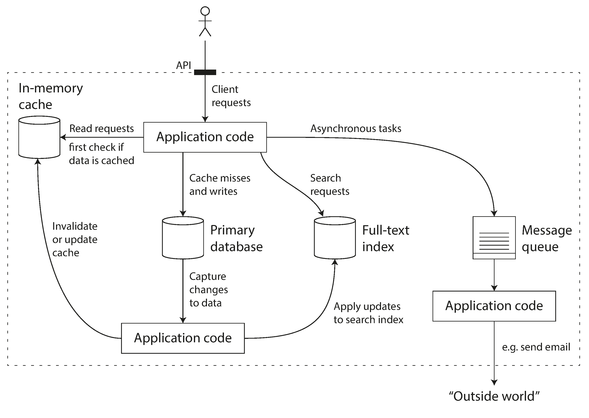

## Table of contents

- [Table of contents](#table-of-contents)
- [Data intensive applications](#data-intensive-applications)
  - [Reliability](#reliability)
- [API problems](#api-problems)
  - [Paginating](#paginating)
    - [Links](#links)
    - [Overview](#overview)
    - [Page — based pagination](#page--based-pagination)
      - [Pros](#pros)
      - [Cons](#cons)
    - [KeySet-based pagination](#keyset-based-pagination)
      - [Pros](#pros-1)
      - [Cons](#cons-1)
    - [Cursor-based pagination](#cursor-based-pagination)
      - [Pros](#pros-2)
      - [Cons](#cons-2)
- [Cloud architecture](#cloud-architecture)
  - [IaaS](#iaas)
  - [CaaS](#caas)
  - [Paas](#paas)
  - [FaaS](#faas)
  - [SaaS](#saas)
  - [Cloud native properties](#cloud-native-properties)
    - [Scalability](#scalability)
    - [Loose coupling](#loose-coupling)
    - [Resilience](#resilience)
    - [Observability](#observability)
    - [Maintainability](#maintainability)
  - [Culture and practices supporting cloud native](#culture-and-practices-supporting-cloud-native)
    - [Automation](#automation)
    - [Continuous delivery](#continuous-delivery)
    - [DevOps](#devops)
  - [Is the cloud your best option?](#is-the-cloud-your-best-option)


## Data intensive applications

Many applications today are **data-intensive**, as opposed to **compute-intensive**. Raw CPU power is rarely a limiting factor for these applications—bigger problems are usually the amount of data, the complexity of data, and the speed at which it is changing.

A data-intensive application is typically built from standard building blocks:
- Store data so that they, or another application, can find it again later (databases)
- Remember the result of an expensive operation, to speed up reads (caches)
- Allow users to search data by keyword or filter it in various ways (search indexes)
- Send a message to another process, to be handled asynchronously (stream processing)
- Periodically crunch a large amount of accumulated data (batch processing)

Just an example:



Several general questions about architecture:
- How do you ensure that the data remains correct and complete, even when things go wrong internally
- How do you provide consistently good performance to clients, even when parts of your system are degraded?
- How do you scale to handle an increase in load?
- What does a good API for the service look like?

many factors that may influence the design of a data system:
- skills and experience of the people involved
- legacy system dependencies
- timescale for delivery
- organization’s tolerance of different kinds of risk
- regulatory constraints

Main aspects:
- **Reliability**
  The system should continue to work correctly (performing the correct function at the desired level of performance) even in the face of adversity (hardware or software faults, and even human error).

- **Scalability**
  As the system grows (in data volume, traffic volume, or complexity), there should be reasonable ways of dealing with that growth. 
- **Maintainability**
  Over time, many different people will work on the system (engineering and operations, both maintaining current behavior and adapting the system to new use cases), and they should all be able to work on it productively. 

### Reliability

For software, typical expectations include:
- The application performs the function that the user expected.
- It can tolerate the user making mistakes or using the software in unexpected ways.
- Its performance is good enough for the required use case, under the expected load and data volume.
- The system prevents any unauthorized access and abuse.

If all those things together mean “working correctly,” then we can understand reliability as meaning, roughly, “continuing to - work correctly, even when things go wrong.”

 **faults** - the things that can go wrong. Usually defined as one component of the system deviating from its spec

 **failure** - when the system as a whole stops providing the required service to the user. 

 **fault-tolerant or resilient systems** - systems that anticipate faults and can cope with them

 it only makes sense to talk about tolerating certain types of faults, not a black hole close to the Earth. 

 It is impossible to reduce the probability of a fault to zero; therefore it is usually best to design fault-tolerance mechanisms that prevent faults from causing failures

The goal of architect is building reliable systems from unreliable parts.

Although we generally prefer tolerating faults over preventing faults, there are cases where prevention is better than cure (e.g., because no cure exists). This is the case with security matters, for example: if an attacker has compromised a system and gained access to sensitive data, that event cannot be undone.


## API problems

### Paginating 

#### Links

[Paginating Requests in APIs](https://ignaciochiazzo.medium.com/paginating-requests-in-apis-d4883d4c1c4c)

#### Overview

Multiple names are used in the industry for endpoints that return a paginated set, particularly in REST APIS, such as 
- collection resource
- listing endpoints
-  index endpoints

Before exposing any listing endpoint, we should ask ourselves at least the following questions: 
- Can the list be sorted? 
- Is there any default order? 
- Can the list be filtered? 
- If so, which filter params should it accept? 
- Are the queries, executed under the hood, performant enough? 

Exposing endpoints is very easy. Deprecating and deleting them is extremely hard and potentially impossible.

#### Page — based pagination

This is the simplest and most common form of paging, particularly for Apps that use SQL Databases. The set is divided into pages. The endpoint accepts a page param that is an integer indicating the page within the list to be returned.


```sql
select *
from products
order by id
limit 20
offset 200;
```

SQL offset skips the first `N` results of the query. Nonetheless, the database will have to fetch the `N` results from the disks and bring them to return the records next to them.

>  …the rows are first sorted according to the order by clause and then limited by dropping the number of rows specified in the result offset clause from the beginning…. .” SQL:2016, Part 2, §4.15.3 Derived tables

##### Pros
- You can jump to any particular page, not needing to query 99 pages to get the page 100.
- It allows sending parallel requests with different pages.
- Stateless on the server-side.
- Easy to understand and debug.
- This approach requires very little business logic. Many libraries are written in different languages that are easy to use.

##### Cons
- Bad performance for large OFFSET in SQL. The database must scan and count N rows when doing OFFSET in SQL.
- It can return repeated or missing if any is added/deleted while paginating. E.g., If the first request asks for page 1 and a new record is inserted to the first page, then the request with page 2 will have a record repeated which was returned on the previous request.

#### KeySet-based pagination

The API provides a key param that acts as a delimiter of the page. This key param should be the same key of the set sort order. For example, if the set is sorted by `ID`, then the key param should be `since_id`. Other examples would be `since_updated_at`, `since_created_at` etc.


```sql
select *
from products
where ID > since_id
order by ID ASC
limit 100
```

##### Pros

- The SQL query is more efficient than OFFSET (for most cases) since it uses a WHERE condition (assuming it has good SQL indexes).
- Unlike page-based pagination, new records inserted on previous pages won’t cause duplicated elements.
  
##### Cons
- It’s tied to the sort order. If you want to use since_id, the set should be sorted by id.
- There is no way to jump to a specific page. It needs to iterate through all the previous pages.
- It doesn’t allow sending parallel requests for different batches.
- The API needs to expose multiple key-params (e.g. since_id,since_updated_at).
- The client needs to keep track of the key-value of the set.
- Missing items if they are added to the previous pages

#### Cursor-based pagination

Given a set, a cursor will be a piece of data that contains a pointer to an element and the info to get the next/previous elements. The server should return the cursor pointing to the next page in each request


The SQL query will depend on the implementation, but it will be similar to the query generated by the KeySet-based Pagination method using a WHERE condition.

There are different approaches to implementing this method. Some return the cursor as part of the payload. Others return the cursor as part of the Header, particularly in the LINK headers. The cursor might contain all the information needed or partially allowing clients to add other filter parameters.

Clients should not store the cursor on their side. Google API Documentation suggests adding an expiration date to the token and expiring cursors sent in requests.

##### Pros

- If the cursor is opaque, the implementation underneath can change without introducing an API change.
- In most cases, it is much faster than using page in SQL since it won’t use OFFSET in the database.
- There is no issue when a record is deleted as opposed to Page-based Pagination.

##### Cons

- There is no way to skip pages. If the user wants page X, it must request pages from 1 to X.
- It doesn’t allow sending parallel requests for different batches.
- The implementation is more complex than LIMIT/OFFSET.
- Hard to debug. Given a request, you have to decode it to debug it.
- Missing items if they are added to the previous pages

## Cloud architecture


[Cloud native computer foundation](https://www.cncf.io/)


### IaaS
- AWS Elastic Compute Cloud (EC2)
- Azure Virtual Machines
- Google Compute Engine
- Alibaba Virtual Machines
- DigitalOcean Droplets.

### CaaS 
- Amazon Elastic Kubernetes Service (EKS)
- Azure Kubernetes Service (AKS)
- Google Kubernetes Engine (GKE)
- Alibaba Container Service for Kubernetes (ACK)
- DigitalOcean Kubernetes.

### Paas
- Cloud Foundry
- Heroku
- AWS Elastic Beanstalk
- Azure App Service
- Google App Engine
- Alibaba Web App Service
- DigitalOcean App Platform

In the past few years, vendors have been converging on Kubernetes for building a new PaaS experience for developers and operators. Examples of this new generation of services are VMware Tanzu Application Platform and RedHat OpenShift.

### FaaS

Examples of commercial FaaS:
- Amazon AWS Lambda
- Microsoft Azure Functions
- Google Cloud Functions
- Alibaba Functions Compute 
  
Examples of open source FaaS:
- Knative 
- Apache OpenWhisk.

### SaaS

- Proton Mail
- GitHub
- Plausible Analytics
- Microsoft Office 365.

### Cloud native properties


#### Scalability

In the cloud, where everything is dynamic and in constant change, horizontal scalability is preferred


#### Loose coupling

Loose coupling is an essential property of a system where parts have as little knowledge of each other as possible. 

The goal is to evolve each piece independently so that when one is changed, the others don’t need to change accordingly.

we should aim at achieving proper modularization with loose coupling and high cohesion.

Parnas identified three benefits of modularization

- Managerial—Since each module is loosely coupled, the team responsible for it should not need to spend much time coordinating and communicating with other teams.

- Product flexibility—The overall system should be flexible since each module is evolved independently of the others.

- Comprehensibility—People should be able to understand and work with a module without having to study the whole system.

> The preceding benefits are usually among those associated with microservices, but the truth is that you don’t need microservices to achieve them. In the last few years, many organizations have decided to migrate from monoliths to microservices. Some of them have failed because they lacked proper modularization. A monolith made up of tightly coupled, non-cohesive components, when migrated, produces a tightly coupled, non-cohesive microservice system, which sometimes is referred to as a distributed monolith. I don’t consider this a good name because it implies that monoliths are made up of tightly coupled, non-cohesive components by definition. That’s not true. The architectural style doesn’t matter: a bad design is a bad design. Indeed, I like the modular monolith term proposed by Simon Brown to increase awareness that monoliths can promote loose coupling and high cohesion, and that both monoliths and microservices can end up being “big balls of mud.”

#### Resilience

**Fault** —A fault is a defect that produces an incorrect internal state either in the software or the infrastructure. For example, a method call returns a null value, even if its specification mandates that a non-null value is returned.

**Error** —An error is a discrepancy between the expected behavior of a system and the actual one. For example, due to the preceding fault, a NullPointerException is thrown.

**Failure** —When a fault is triggered and results in an error, a failure might occur, making the system unresponsive and unable to behave according to its specifications. For example, if the NullPointerException is not caught, the error provokes a failure: the system responds to any request with a 500 response.

Faults can become errors, which may provoke failures, so we should design applications to be fault tolerant. An essential part of resilience is ensuring that a failure will not cascade to other components of the system but stay isolated while it gets fixed. We also want the system to be self-repairing or self-healing, and the cloud model can enable that.

#### Observability

#### Maintainability

manageability is deploying and updating applications while keeping the overall system up and running

Another element is configuration. Modify their behavior without changing their code and building a new release. It’s common to make configurable settings like data source URLs, service credentials, and certificates. For example, depending on the environment, you may use different data sources: one for development, one for testing, and one for production. 

Other types of configuration could be feature flags, which determine whether specific features should be enabled at runtime.

### Culture and practices supporting cloud native


#### Automation 

Martin Fowler defines **infrastructure as code** as 
> the approach to defining computing and network infrastructure through source code that can then be treated just like any software system.”10

Cloud providers offer convenient APIs for creating and provisioning servers, networks, and storage. By automating those tasks with a tool like Terraform, putting the code in source control, and applying the same test and delivery practices used for application development, we get a more reliable and predictable infrastructure, which is reproducible, more efficient, and less risky. A simple example of an automated task could be creating a new virtual machine with 8 CPUs, 64 GB of memory, and Ubuntu 22.04 as the operating system.

After we’ve provisioned computing resources, we can manage them and automate their configuration. 

**configuration as code** is the approach to defining the configuration of computing resources through source code, which can be treated just like any software system.

Using tools like Ansible, we can specify how a server or a network should be configured. For example, after provisioning the Ubuntu server from the previous paragraph, we can automate the task of installing the Java Runtime Environment (JRE) 17 and opening the ports 8080 and 8443 from the firewall. Configuration as code applies to application configuration as well.

After their initial provisioning and configuration, immutable servers are not changed: they are immutable. If any change is necessary, it’s defined as code and delivered. A new server is then provisioned and configured from the new code while the previous server is destroyed.

#### Continuous delivery

**Continuous delivery** - a software development discipline where you build software in such a way that the software can be released to production at any time

Continuous integration (CI) is a foundational practice in continuous delivery. Developers commit their changes to the mainline (the main branch) continuously (at least once a day). At each commit, the software is automatically compiled, tested, and packaged as executable artifacts (such as JAR files or container images). The idea is to get fast feedback about the software’s status after each new change. If an error is detected, it should be immediately fixed to ensure the mainline keeps being a stable foundation for further development.

Continuous delivery (CD) builds on CI and focuses on keeping the mainline always healthy and in a releasable state. After an executable artifact is produced as part of the integration with the mainline, the software is deployed to a production-like environment. It goes through additional tests to assess its releasability, such as user acceptance tests, performance tests, security tests, compliance tests, and any other tests that might increase the confidence that the software can be released. If the mainline is always in a releasable state, releasing a new version of the software becomes a business decision instead of a technical one.

Sometimes continuous delivery is confused with **continuous deployment**. The former approach makes sure that after every change, the software is in a state in which it can be deployed to production. When that’s actually done is a business decision. With **continuous deployment** we add one last step to the deployment pipeline to automatically deploy a new release in production after every change.

#### DevOps

> culture where people, regardless of title or background, work together to imagine, develop, deploy, and operate a system.1

*DevOps doesn’t mean NoOps*. It’s a common mistake to think that developers take care of operations and that the operator’s role disappears. Instead, it’s a collaboration. A team will include both roles, contributing to the overall team’s skills required to bring a product from the original idea to production.

*DevOps is not a tool*. Tools like Docker, Ansible, Kubernetes, and Prometheus are usually referred to as DevOps tools, but that’s wrong. DevOps is a culture. You don’t turn into a DevOps organization by using particular tools. In other words, DevOps is not a product, but tools are relevant enablers.

*DevOps is not automation*. Even if automation is an essential part of DevOps, automation is not its definition. DevOps is about developers and operators working together from the original idea to production while possibly automating some of their processes, such as continuous delivery.

*DevOps is not a role*. If we consider DevOps to be a culture or a mindset, it’s hard to make sense of a DevOps role. And yet, there is an increasing request for DevOps engineers. Usually when recruiters search for DevOps engineers, they are looking for skills like proficiency with automation tools, scripting, and IT systems.

*DevOps is not a team*. Organizations not fully understanding the preceding points risk keeping the same silos as before, with one change: replacing the Ops silo with a DevOps silo, or, even worse, simply adding a new DevOps silo.

### Is the cloud your best option?

One of the biggest mistakes in our industry is deciding to adopt a technology or approach just because it’s new and everyone is talking about it. There are endless stories about companies migrating their monoliths to microservices and ending up with disastrous failures

The point is to figure out whether a specific technology or approach can solve your problems. We turn ideas into software that we deliver to our customers and that provides them with some value. That’s our end goal. If a technology or approach helps you provide more value to your customers, you should consider it. If it’s not worthy, and you decide to go with it anyway, you’ll likely end up having higher costs and many problems.

> What problem are we trying to solve?

Before deciding to migrate to the cloud, it’s essential also to consider other types of costs. On the one hand, you can optimize costs by paying for only what you use. But on the other hand, you should consider the cost of migrating and its consequences.

- investing in education to acquire the necessary skills
- perhaps hiring professionals as consultants to help with the migration to the cloud. 
- handling security in the cloud, which in turn requires specific skills. 
- business interruptions during the migration
- retraining end users
- updating documentation and support materials
