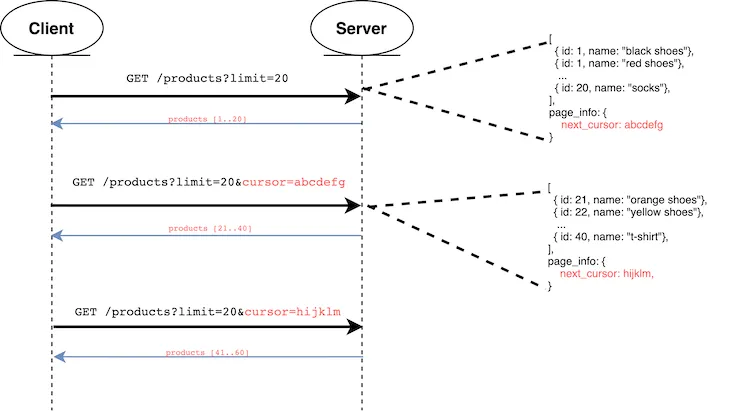

- [Data intensive applications](#data-intensive-applications)
  - [Reliability](#reliability)
  - [Scalabllity](#scalabllity)
    - [What to measure?](#what-to-measure)
    - [Approaches for Coping with Load](#approaches-for-coping-with-load)
  - [Maintainability](#maintainability)
    - [Operability](#operability)
    - [Simplicity](#simplicity)
    - [Evolvability](#evolvability)
- [Data models](#data-models)
  - [NoSQL](#nosql)
    - [sign to use nosql](#sign-to-use-nosql)
    - [limitations](#limitations)
    - [Schema flexibility in the document model](#schema-flexibility-in-the-document-model)
    - [Data locality for queries](#data-locality-for-queries)
    - [Example of query language](#example-of-query-language)
  - [SQL](#sql)
  - [The Object-Relational Mismatch](#the-object-relational-mismatch)
  - [The Object-Relational Mismatch](#the-object-relational-mismatch-1)
    - [Representing a LinkedIn profile using a relational schema](#representing-a-linkedin-profile-using-a-relational-schema)
    - [Representing a LinkedIn profile as a JSON document](#representing-a-linkedin-profile-as-a-json-document)
    - [Many-to-One problem](#many-to-one-problem)
    - [Many-to-Many Relationships problem](#many-to-many-relationships-problem)
  - [Are Document Databases Repeating History (hierarchical model)](#are-document-databases-repeating-history-hierarchical-model)
  - [Network model](#network-model)
  - [Relational model](#relational-model)
  - [How document model resolves many-to-one and many-to-many problem](#how-document-model-resolves-many-to-one-and-many-to-many-problem)
  - [Graph-Like Data Models](#graph-like-data-models)
    - [Property graph](#property-graph)
  - [Query languages](#query-languages)
      - [Pros](#pros)
      - [Cons](#cons)
    - [KeySet-based pagination](#keyset-based-pagination)
      - [Pros](#pros-1)
      - [Cons](#cons-1)
    - [Cursor-based pagination](#cursor-based-pagination)
      - [Pros](#pros-2)
      - [Cons](#cons-2)
- [Cloud architecture](#cloud-architecture)
  - [IaaS](#iaas)
  - [CaaS](#caas)
  - [Paas](#paas)
  - [FaaS](#faas)
  - [SaaS](#saas)
  - [Cloud native properties](#cloud-native-properties)
    - [Scalability](#scalability)
    - [Loose coupling](#loose-coupling)
    - [Resilience](#resilience)
    - [Observability](#observability)
    - [Maintainability](#maintainability-1)
  - [Culture and practices supporting cloud native](#culture-and-practices-supporting-cloud-native)
    - [Automation](#automation)
    - [Continuous delivery](#continuous-delivery)
    - [DevOps](#devops)
  - [Is the cloud your best option?](#is-the-cloud-your-best-option)
  - [Cloud native development principles](#cloud-native-development-principles)


## Data intensive applications

Many applications today are **data-intensive**, as opposed to **compute-intensive**. Raw CPU power is rarely a limiting factor for these applications—bigger problems are usually the amount of data, the complexity of data, and the speed at which it is changing.

A data-intensive application is typically built from standard building blocks:
- Store data so that they, or another application, can find it again later (databases)
- Remember the result of an expensive operation, to speed up reads (caches)
- Allow users to search data by keyword or filter it in various ways (search indexes)
- Send a message to another process, to be handled asynchronously (stream processing)
- Periodically crunch a large amount of accumulated data (batch processing)

Just an example:


Several general questions about architecture:
- How do you ensure that the data remains correct and complete, even when things go wrong internally
- How do you provide consistently good performance to clients, even when parts of your system are degraded?
- How do you scale to handle an increase in load?
- What does a good API for the service look like?

many factors that may influence the design of a data system:
- skills and experience of the people involved
- legacy system dependencies
- timescale for delivery
- organization’s tolerance of different kinds of risk
- regulatory constraints

An application has to meet various requirements in order to be useful. 

**functional requirements**
- what it should do, such as allowing data to be stored, retrieved, searched, and processed in various ways

**nonfunctional requirements** 
- security
- reliability
- compliance
- scalability
- compatibility
- maintainability 

Main aspects:
- **Reliability**
  The system should continue to work correctly (performing the correct function at the desired level of performance) even in the face of adversity (hardware or software faults, and even human error).

- **Scalability**
  As the system grows (in data volume, traffic volume, or complexity), there should be reasonable ways of dealing with that growth. 
- **Maintainability**
  Over time, many different people will work on the system (engineering and operations, both maintaining current behavior and adapting the system to new use cases), and they should all be able to work on it productively. 

### Reliability

For software, typical expectations include:
- The application performs the function that the user expected.
- It can tolerate the user making mistakes or using the software in unexpected ways.
- Its performance is good enough for the required use case, under the expected load and data volume.
- The system prevents any unauthorized access and abuse.

If all those things together mean “working correctly,” then we can understand reliability as meaning, roughly, “continuing to - work correctly, even when things go wrong.”

 **faults** - the things that can go wrong. Usually defined as one component of the system deviating from its spec

 **failure** - when the system as a whole stops providing the required service to the user. 

 **fault-tolerant or resilient systems** - systems that anticipate faults and can cope with them

 it only makes sense to talk about tolerating certain types of faults, not a black hole close to the Earth. 

 It is impossible to reduce the probability of a fault to zero; therefore it is usually best to design fault-tolerance mechanisms that prevent faults from causing failures

The goal of architect is building reliable systems from unreliable parts.

Although we generally prefer tolerating faults over preventing faults, there are cases where prevention is better than cure (e.g., because no cure exists). This is the case with security matters, for example: if an attacker has compromised a system and gained access to sensitive data, that event cannot be undone.

- Hardware Faults. Disk, cpu, power.  first response is usually to add redundancy to the individual hardware components . However, as data volumes and applications’ computing demands have increased, more applications have begun using larger numbers of machines, which proportionally increases the rate of hardware faults. There is a move toward systems that can tolerate the loss of entire machines, by using software fault-tolerance techniques in preference or in addition to hardware redundancy

- Software Errors. There is no quick solution to the problem of systematic faults in software. Lots of small things can help: 
  - carefully thinking about assumptions and interactions in the system; 
  - thorough testing; 
  - process isolation; 
  - allowing processes to crash and restart; 
  - measuring, monitoring, and analyzing system behavior in production

- Human Errors. Even when they have the best intentions, humans are known to be unreliable. For example, one study of large internet services found that configuration errors by operators were the leading cause of outages, whereas hardware faults (servers or network) played a role in only 10–25% of outages [13].
  - Design systems in a way that minimizes opportunities for error. For example, well-designed abstractions, APIs, and admin interfaces make it easy to do “the right thing” and discourage “the wrong thing.” However, if the interfaces are too restrictive people will work around them, negating their benefit, so this is a tricky balance to get right.
  - Decouple the places where people make the most mistakes from the places where they can cause failures. In particular, provide fully featured non-production sandbox environments where people can explore and experiment safely, using real data, without affecting real users.
  - Test thoroughly at all levels, from unit tests to whole-system integration tests and manual tests. Automated testing is widely used, well understood, and especially valuable for covering corner cases that rarely arise in normal operation.
  - Allow quick and easy recovery from human errors, to minimize the impact in the case of a failure. For example, make it fast to roll back configuration changes, roll out new code gradually (so that any unexpected bugs affect only a small subset of users), and provide tools to recompute data (in case it turns out that the old computation was incorrect).
  - Set up detailed and clear monitoring, such as performance metrics and error rates. Monitoring can show us early warning signals and allow us to check whether any assumptions or constraints are being violated. When a problem occurs, metrics can be invaluable in diagnosing the issue.
  - Implement good management practices and training

There are situations in which we may choose to sacrifice reliability in order to reduce development cost (e.g., when developing a prototype product for an unproven market) or operational cost (e.g., for a service with a very narrow profit margin)—but we should be very conscious of when we are cutting corners.

### Scalabllity

 - If the system grows in a particular way, what are our options for coping with the growth?
 - How can we add computing resources to handle the additional load?


two views:
- When you increase a load parameter and keep the system resources (CPU, memory, network bandwidth, etc.) unchanged, how is the performance of your system affected?
- When you increase a load parameter, how much do you need to increase the resources if you want to keep performance unchanged?

#### What to measure? 

**throughput** - the number of records we can process per second, or the total time it takes to run a job on a dataset of a certain size

**response time** - the time between a client sending a request and receiving a response.

**Latency** and **response time** are often used synonymously, but they are not the same. The **response time** is what the client sees: besides the actual time to process the request (the service time), it includes network delays and queueing delays. **Latency** is the duration that a request is waiting to be handled—during which it is latent, awaiting service 

We need to think of response time not as a single number, but as a distribution of values that you can measure.

 the mean is not a very good metric if you want to know your “typical” response time, because it doesn’t tell you how many users actually experienced that delay.

Usually it is better to use percentiles. If you take your list of response times and sort it from fastest to slowest, then the median is the halfway point: for example, if your median response time is 200 ms, that means half your requests return in less than 200 ms, and half your requests take longer than that. The median is also known as the 50th percentile, and sometimes abbreviated as p50. The median refers to a single request; if the user makes several requests (over the course of a session, or because several resources are included in a single page), the probability that at least one of them is slower than the median is much greater than 50%.

In order to figure out how bad your outliers are, you can look at higher percentiles: 95th, 99th, and 99.9th percentiles are common (abbreviated p95, p99, and p999). They are the response time thresholds at which 95%, 99%, or 99.9% of requests are faster than that particular threshold.

Amazon has observed that a 100 ms increase in response time reduces sales by 1% [20], and others report that a 1-second slowdown reduces a customer satisfaction metric by 16% 

On the other hand, optimizing the 99.99th percentile (the slowest 1 in 10,000 requests) was deemed too expensive and to not yield enough benefit for Amazon’s purposes. 

High percentiles become especially important in backend services that are called multiple times as part of serving a single end-user request. Even if you make the calls in parallel, the end-user request still needs to wait for the slowest of the parallel calls to complete.  Even if only a small percentage of backend calls are slow, the chance of getting a slow call increases if an end-user request requires multiple backend calls, and so a higher proportion of end-user requests end up being slow (an effect known as tail latency amplification)

#### Approaches for Coping with Load

- If you are working on a fast-growing service, it is therefore likely that you will need to rethink your architecture on every order of magnitude load increase—or perhaps even more often than that.


**scaling up, vertical scaling**

- moving to a more powerful machine
- often simpler 
- high-end machines can become very expensive, so very intensive workloads often can’t avoid scaling out. 

**scaling out, horizontal scaling**

- distributing the load across multiple smaller machines. 
- also known as a shared-nothing architecture. 
 
but 

- In reality, good architectures usually involve a pragmatic mixture of approaches: for example, using several fairly powerful machines can still be simpler and cheaper than a large number of small virtual machines.

- Some systems are elastic, meaning that they can automatically add computing resources when they detect a load increase, whereas other systems are scaled manually (a human analyzes the capacity and decides to add more machines to the system). An elastic system can be useful if load is highly unpredictable, but manually scaled systems are simpler and may have fewer operational surprises

-  common wisdom until recently was to keep your database on a single node (scale up) until scaling cost or high-availability requirements forced you to make it distributed.

- The architecture of systems that operate at large scale is usually highly specific to the application
- The problem may be:
  -  the volume of reads
  -  the volume of writes
  -  the volume of data to store
  -  the complexity of the data
  -  the response time requirements
  -  the access patterns
  -  (usually) some mixture of all of these plus many more issues.

- For example, a system that is designed to handle 100,000 requests per second, each 1 kB in size, looks very different from a system that is designed for 3 requests per minute, each 2 GB in size—even though the two systems have the same data throughput.

- An architecture that scales well for a particular application is built around assumptions of which operations will be common and which will be rare—the load parameters. If those assumptions turn out to be wrong, the engineering effort for scaling is at best wasted, and at worst counterproductive. In an early-stage startup or an unproven product it’s usually more important to be able to iterate quickly on product features than it is to scale to some hypothetical future load.

### Maintainability

majority of the cost of software is not in its initial development, but in 
  - its ongoing maintenance—fixing bugs
  - keeping its systems operational
  - investigating failures
  - adapting it to new platforms
  - modifying it for new use cases
  - repaying technical debt
  - adding new features.

particular attention to three design principles for software systems:

#### Operability

Make it easy for operations teams to keep the system running smoothly. Making Life Easy for Operations

> good operations can often work around the limitations of bad (or incomplete) software, but good software cannot run reliably with bad operations

A good operations team typically is responsible for the following, and more:
- Monitoring the health of the system and quickly restoring service if it goes into a bad state
- Tracking down the cause of problems, such as system failures or degraded performance
- Keeping software and platforms up to date, including security patches
- Keeping tabs on how different systems affect each other, so that a problematic change can be avoided before it causes damage
- Anticipating future problems and solving them before they occur (e.g., capacity planning)
- Establishing good practices and tools for deployment, configuration management, and more
- Performing complex maintenance tasks, such as moving an application from one platform to another
- Maintaining the security of the system as configuration changes are made
- Defining processes that make operations predictable and help keep the production environment stable
- Preserving the organization’s knowledge about the system, even as individual people come and go

Data systems can do various things to make routine tasks easy, including:
- Providing visibility into the runtime behavior and internals of the system, with good monitoring
- Providing good support for automation and integration with standard tools
- Avoiding dependency on individual machines (allowing machines to be taken down for maintenance while the system as a whole continues running uninterrupted)
- Providing good documentation and an easy-to-understand operational model (“If I do X, Y will happen”)
- Providing good default behavior, but also giving administrators the freedom to override defaults when needed
- Self-healing where appropriate, but also giving administrators manual control over the system state when needed
- Exhibiting predictable behavior, minimizing surprises


#### Simplicity

- Make it easy for new engineers to understand the system, by removing as much complexity as possible from the system. (Note this is not the same as simplicity of the user interface.)

- reducing complexity greatly improves the maintainability of software, and thus simplicity should be a key goal for the systems we build.

- A software project mired in complexity is sometimes described as a big ball of mud

- possible symptoms of complexity
  - explosion of the state space
  - tight coupling of modules
  - tangled dependencies
  - inconsistent naming and terminology
  - hacks aimed at solving performance problems
  - special-casing to work around issues elsewhere

- One of the best tools we have for removing accidental complexity is abstraction. A good abstraction can hide a great deal of implementation detail behind a clean, simple-to-understand façade

#### Evolvability

Making Change Easy. 

Make it easy for engineers to make changes to the system in the future, adapting it for unanticipated use cases as requirements change. Also known as extensibility, modifiability, or plasticity.

It’s extremely unlikely that your system’s requirements will remain unchanged forever. 
- you learn new facts
- previously unanticipated use cases emerge
- business priorities change
- users request new features
- new platforms replace old platforms
- legal or regulatory requirements change
- growth of the system forces architectural changes, etc.

## Data models

### NoSQL

-  The name “NoSQL” is unfortunate, since it doesn’t actually refer to any particular technology—it was originally intended simply as a catchy Twitter hashtag for a meetup on open source, distributed, nonrelational databases in 2009. Nevertheless, the term struck a nerve and quickly spread through the web startup community and beyond. A number of interesting database systems are now associated with the #NoSQL hashtag, and it has been retroactively reinterpreted as Not Only SQL

driving forces
- A need for greater scalability than relational databases can easily achieve, including very large datasets or very high write throughput
- Specialized query operations that are not well supported by the relational model
- Frustration with the restrictiveness of relational schemas, and a desire for a more dynamic and expressive data model.


#### sign to use nosql

 - If the data in your application has a document-like structure (i.e., a tree of one-to-many relationships, where typically the entire tree is loaded at once)

#### limitations

- you cannot refer directly to a nested item within a document, but instead you need to say something like “the second item in the list of positions for user 251” (much like an access path in the hierarchical model). However, as long as documents are not too deeply nested, that is not usually a problem.
- The poor support for joins in document databases may or may not be a problem, depending on the application. For example, many-to-many relationships may never be needed in an analytics application that uses a document database to record which events occurred at which time
- For highly interconnected data, the document model is awkward, the relational model is acceptable, and graph models are the most natural.

#### Schema flexibility in the document model

 No schema means that arbitrary keys and values can be added to a document, and when reading, clients have no guarantees as to what fields the documents may contain.

Document databases are sometimes called **schemaless**, but that’s misleading, as the code that reads the data usually assumes some kind of structure—i.e., there is an implicit schema, but it is not enforced by the database. A more accurate term is **schema-on-read** (the structure of the data is implicit, and only interpreted when the data is read), in contrast with **schema-on-write** (the traditional approach of relational databases, where the schema is explicit and the database ensures all written data conforms to it).

Schema-on-read is similar to dynamic (runtime) type checking in programming languages

For example, say you are currently storing each user’s full name in one field, and you instead want to store the first name and last name separately. In a document database, you would just start writing new documents with the new fields and have code in the application that handles the case when old documents are read. For example:

```js
if (user && user.name && !user.first_name) {
    // Documents written before Dec 8, 2013 don't have first_name
    user.first_name = user.name.split(" ")[0];
}
```

with sql we need perform a migration 

```sql
ALTER TABLE users ADD COLUMN first_name text;
UPDATE users SET first_name = split_part(name, ' ', 1);      -- PostgreSQL
UPDATE users SET first_name = substring_index(name, ' ', 1); 
```

sign to use schema or read
- There are many different types of objects, and it is not practicable to put each type of object in its own table.
- The structure of the data is determined by external systems over which you have no control and which may change at any time.

#### Data locality for queries

If your application often needs to access the entire document (for example, to render it on a web page), there is a performance advantage to this storage locality. 

The locality advantage only applies if you need large parts of the document at the same time.

The database typically needs to load the entire document, even if you access only a small portion of it, which can be wasteful on large documents

On updates to a document, the entire document usually needs to be rewritten—only modifications that don’t change the encoded size of a document can easily be performed in place

For these reasons, it is generally recommended that you keep documents fairly small and avoid writes that increase the size of a document

The column-family concept in the Bigtable data model (used in Cassandra and HBase) has a similar purpose of managing locality 

 Oracle allows the same, using a feature called multi-table index cluster tables

#### Example of query language

aggregation pipeline in MongoDB. Realy similar to sql, but with json

```js
db.observations.aggregate([
    { $match: { family: "Sharks" } },
    { $group: {
        _id: {
            year:  { $year:  "$observationTimestamp" },
            month: { $month: "$observationTimestamp" }
        },
        totalAnimals: { $sum: "$numAnimals" }
    } }
]);
```

### SQL

- relational model proposed by Edgar Codd in 1970. Data is organized into relations (called tables in SQL), where each relation is an unordered collection of tuples (rows in SQL). It was  theoretical proposal.
- Other databases at that time forced application developers to think a lot about the internal representation of the data in the database. The goal of the relational model was to hide that implementation detail behind a cleaner interface.
- In the 1970s and early 1980s, the network model and the hierarchical model were the main alternatives, but the relational model came to dominate them. Object databases came and went again in the late 1980s and early 1990s. XML databases appeared in the early 2000s, but have only seen niche adoption. 

pros:
- better support for joins
- support many-to-one and many-to-many relationships

### The Object-Relational Mismatch

### The Object-Relational Mismatch

- Most application development today is done in object-oriented programming languages, which leads to a common criticism of the SQL data model: if data is stored in relational tables, an awkward translation layer is required between the objects in the application code and the database model of tables, rows, and columns. The disconnect between the models is sometimes called an impedance mismatch.

#### Representing a LinkedIn profile using a relational schema


There is a one-to-many relationship from the user to these items, which can be represented in various ways:

- In the traditional SQL model (prior to SQL:1999), the most common normalized representation is to put positions, education, and contact information in separate tables, with a foreign key reference to the users table, as in Figure.
- Later versions of the SQL standard added support for structured datatypes and XML data; this allowed multi-valued data to be stored within a single row, with support for querying and indexing inside those documents. These features are supported to varying degrees by Oracle, IBM DB2, MS SQL Server, and PostgreSQL. A JSON datatype is also supported by several databases, including IBM DB2, MySQL, and PostgreSQL.
- A third option is to encode jobs, education, and contact info as a JSON or XML document, store it on a text column in the database, and let the application interpret its structure and content. In this setup, you typically cannot use the database to query for values inside that encoded column.

####  Representing a LinkedIn profile as a JSON document

```json
{
  "user_id":     251,
  "first_name":  "Bill",
  "last_name":   "Gates",
  "summary":     "Co-chair of the Bill & Melinda Gates... Active blogger.",
  "region_id":   "us:91",
  "industry_id": 131,
  "photo_url":   "/p/7/000/253/05b/308dd6e.jpg",
  "positions": [
    {"job_title": "Co-chair", "organization": "Bill & Melinda Gates Foundation"},
    {"job_title": "Co-founder, Chairman", "organization": "Microsoft"}
  ],
  "education": [
    {"school_name": "Harvard University",       "start": 1973, "end": 1975},
    {"school_name": "Lakeside School, Seattle", "start": null, "end": null}
  ],
  "contact_info": {
    "blog":    "https://www.gatesnotes.com/",
    "twitter": "https://twitter.com/BillGates"
  }
}
```

The JSON representation has better locality than the multi-table schema. If you want to fetch a profile in the relational example, you need to either perform multiple queries (query each table by user_id) or perform a messy multi-way join between the users table and its subordinate tables. In the JSON representation, all the relevant information is in one place, and one query is sufficient.

#### Many-to-One problem

 the preceding section, region_id and industry_id are given as IDs, 


 there are advantages to having standardized lists of geographic regions and industries, and letting users choose from a drop-down list or autocompleter:
- Consistent style and spelling across profiles
- Avoiding ambiguity (e.g., if there are several cities with the same name)
- Ease of updating—the name is stored in only one place, so it is easy to update across the board if it ever needs to be changed (e.g., change of a city name due to political events)
- Localization support—when the site is translated into other languages, the standardized lists can be localized, so the region and industry can be displayed in the viewer’s language
- Better search—e.g., a search for philanthropists in the state of Washington can match this profile, because the list of regions can encode the fact that Seattle is in Washington (which is not apparent from the string "Greater Seattle Area")

Whether you store an ID or a text string is a question of duplication. When you use an ID, the information that is meaningful to humans (such as the word Philanthropy) is stored in only one place, and everything that refers to it uses an ID (which only has meaning within the database). When you store the text directly, you are duplicating the human-meaningful information in every record that uses it.

The advantage of using an ID is that because it has no meaning to humans, it never needs to change: the ID can remain the same, even if the information it identifies changes. Anything that is meaningful to humans may need to change sometime in the future—and if that information is duplicated, all the redundant copies need to be updated. That incurs write overheads, and risks inconsistencies (where some copies of the information are updated but others aren’t). Removing such duplication is the key idea behind normalization in databases

Unfortunately, normalizing this data requires many-to-one relationships (many people live in one particular region, many people work in one particular industry), which don’t fit nicely into the document model. In relational databases, it’s normal to refer to rows in other tables by ID, because joins are easy. In document databases, joins are not needed for one-to-many tree structures, and support for joins is often weak

If the database itself does not support joins, you have to emulate a join in application code by making multiple queries to the database. (In this case, the lists of regions and industries are probably small and slow-changing enough that the application can simply keep them in memory.  But nevertheless, the work of making the join is shifted from the database to the application code.

####  Many-to-Many Relationships problem

consider some changes we could make to the résumé example:

- Organizations and schools as entities

    In the previous description, organization (the company where the user worked) and school_name (where they studied) are just strings. Perhaps they should be references to entities instead? Then each organization, school, or university could have its own web page (with logo, news feed, etc.); each résumé could link to the organizations and schools that it mentions, and include their logos and other information

- Recommendations

    Say you want to add a new feature: one user can write a recommendation for another user. The recommendation is shown on the résumé of the user who was recommended, together with the name and photo of the user making the recommendation. If the recommender updates their photo, any recommendations they have written need to reflect the new photo. Therefore, the recommendation should have a reference to the author’s profile.


### Are Document Databases Repeating History (hierarchical model)

The most popular database for business data processing in the 1970s was IBM’s Information Management System (IMS), originally developed for stock-keeping in the Apollo space program 

The design of IMS used a fairly simple data model called the hierarchical model, which has some remarkable similarities to the JSON model used by document databases. It represented all data as a tree of records nested within records, much like the JSON structure

Like document databases, IMS worked well for one-to-many relationships, but it made many-to-many relationships difficult, and it didn’t support joins. Developers had to decide whether to duplicate (denormalize) data or to manually resolve references from one record to another.

The “great debate” between  relational model and network mode  lasted for much of the 1970s

### Network model

The CODASYL model was a generalization of the hierarchical model. In the tree structure of the hierarchical model, every record has exactly one parent; in the network model, a record could have multiple parents. For example, there could be one record for the "Greater Seattle Area" region, and every user who lived in that region could be linked to it. This allowed many-to-one and many-to-many relationships to be modeled.

The links between records in the network model were not foreign keys, but more like pointers in a programming language (while still being stored on disk). The only way of accessing a record was to follow a path from a root record along these chains of links. This was called an access path.

In the simplest case, an access path could be like the traversal of a linked list: start at the head of the list, and look at one record at a time until you find the one you want. But in a world of many-to-many relationships, several different paths can lead to the same record, and a programmer working with the network model had to keep track of these different access paths in their head.

A query in CODASYL was performed by moving a cursor through the database by iterating over lists of records and following access paths. If a record had multiple parents (i.e., multiple incoming pointers from other records), the application code had to keep track of all the various relationships. Even CODASYL committee members admitted that this was like navigating around an n-dimensional data space 

With both the hierarchical and the network model, if you didn’t have a path to the data you wanted, you were in a difficult situation. You could change the access paths, but then you had to go through a lot of handwritten database query code and rewrite it to handle the new access paths. It was difficult to make changes to an application’s data model.

### Relational model

What the relational model did, by contrast, was to lay out all the data in the open: a relation (table) is simply a collection of tuples (rows), and that’s it. There are no labyrinthine nested structures, no complicated access paths to follow if you want to look at the data. You can read any or all of the rows in a table, selecting those that match an arbitrary condition. You can read a particular row by designating some columns as a key and matching on those. You can insert a new row into any table without worrying about foreign key relationships to and from other tables.iv

In a relational database, the query optimizer automatically decides which parts of the query to execute in which order, and which indexes to use. Those choices are effectively the “access path,” but the big difference is that they are made automatically by the query optimizer, not by the application developer, so we rarely need to think about them.

You don’t need to change your queries to take advantage of a new index. The relational model thus made it much easier to add new features to applications.

### How document model resolves many-to-one and many-to-many problem 

 when it comes to representing many-to-one and many-to-many relationships, relational and document databases are not fundamentally different: in both cases, the related item is referenced by a unique identifier, which is called a foreign key in the relational model and a document reference in the document model. That identifier is resolved at read time by using a join or follow-up queries. To date, document databases have not followed the path of CODASYL.

### Graph-Like Data Models

what if many-to-many relationships are very common in your data? The relational model can handle simple cases of many-to-many relationships, but as the connections within your data become more complex, it becomes more natural to start modeling your data as a graph.

A graph consists of two kinds of objects: 
- vertices (also known as nodes or entities) 
- edges (also known as relationships or arcs). 
  
Typical examples include:
- Social graphs
    Vertices are people, and edges indicate which people know each other.
- The web graph
    Vertices are web pages, and edges indicate HTML links to other pages.
- Road or rail networks
    Vertices are junctions, and edges represent the roads or railway lines between them.

graphs are not limited to such homogeneous data: an equally powerful use of graphs is to provide a consistent way of storing completely different types of objects in a single datastore. For example, Facebook maintains a single graph with many different types of vertices and edges: vertices represent people, locations, events, checkins, and comments made by users; edges indicate which people are friends with each other, which checkin happened in which location, who commented on which post, who attended which event, and so o


There are several different, but related, ways of structuring and querying data in graphs.
- property graph model (implemented by Neo4j, Titan, and InfiniteGraph) 
- triple-store model (implemented by Datomic, AllegroGraph, and others). 


#### Property graph

In the property graph model, each vertex consists of:
- A unique identifier
- A set of outgoing edges
- A set of incoming edges
- A collection of properties (key-value pairs)

Each edge consists of:

- A unique identifier
- The vertex at which the edge starts (the tail vertex)
- The vertex at which the edge ends (the head vertex)
- A label to describe the kind of relationship between the two vertices
- A collection of properties (key-value pairs)


### Query languages

- imperative 
  - all for IMS (hierachical) and CODASYL (network)
- declerative
  - SQL (for RDMVS)
  
    ```sql
    SELECT * FROM animals WHERE family = 'Sharks';
    ```
  - aggregation pipeline for Mongo  
    ```js
    db.observations.aggregate([
        { $match: { family: "Sharks" } },
        { $group: {
            _id: {
                year:  { $year:  "$observationTimestamp" },
                month: { $month: "$observationTimestamp" }
            },
            totalAnimals: { $sum: "$numAnimals" }
        } }
    ]);
    ```
  - for graphs
    - Cypher
    - SPARQL
    - Datalog. 
    - Gremlin 
    - Pregel 
  - for web CSS
    ```css
      li.selected > p {
        background-color: blue;
    }
    ```

- combined approach
  - map reduce
    ```sql
    SELECT date_trunc('month', observation_timestamp) AS observation_month, 1
          sum(num_animals) AS total_animals
    FROM observations
    WHERE family = 'Sharks'
    GROUP BY observation_month;
    ```

    for MongoDB map reduce

    ```js
    db.observations.mapReduce(
        function map() { 2
            var year  = this.observationTimestamp.getFullYear();
            var month = this.observationTimestamp.getMonth() + 1;
            emit(year + "-" + month, this.numAnimals); 3
        },
        function reduce(key, values) { 4
            return Array.sum(values); 5
        },
        {
            query: { family: "Sharks" }, 1
            out: "monthlySharkReport" 6
        }
    );
```

## API problems

### Paginating 

#### Links

[Paginating Requests in APIs](https://ignaciochiazzo.medium.com/paginating-requests-in-apis-d4883d4c1c4c)

#### Overview

Multiple names are used in the industry for endpoints that return a paginated set, particularly in REST APIS, such as 
- collection resource
- listing endpoints
-  index endpoints

Before exposing any listing endpoint, we should ask ourselves at least the following questions: 
- Can the list be sorted? 
- Is there any default order? 
- Can the list be filtered? 
- If so, which filter params should it accept? 
- Are the queries, executed under the hood, performant enough? 

Exposing endpoints is very easy. Deprecating and deleting them is extremely hard and potentially impossible.

#### Page — based pagination

This is the simplest and most common form of paging, particularly for Apps that use SQL Databases. The set is divided into pages. The endpoint accepts a page param that is an integer indicating the page within the list to be returned.


```sql
select *
from products
order by id
limit 20
offset 200;
```

SQL offset skips the first `N` results of the query. Nonetheless, the database will have to fetch the `N` results from the disks and bring them to return the records next to them.

>  …the rows are first sorted according to the order by clause and then limited by dropping the number of rows specified in the result offset clause from the beginning…. .” SQL:2016, Part 2, §4.15.3 Derived tables

##### Pros
- You can jump to any particular page, not needing to query 99 pages to get the page 100.
- It allows sending parallel requests with different pages.
- Stateless on the server-side.
- Easy to understand and debug.
- This approach requires very little business logic. Many libraries are written in different languages that are easy to use.

##### Cons
- Bad performance for large OFFSET in SQL. The database must scan and count N rows when doing OFFSET in SQL.
- It can return repeated or missing if any is added/deleted while paginating. E.g., If the first request asks for page 1 and a new record is inserted to the first page, then the request with page 2 will have a record repeated which was returned on the previous request.

#### KeySet-based pagination

The API provides a key param that acts as a delimiter of the page. This key param should be the same key of the set sort order. For example, if the set is sorted by `ID`, then the key param should be `since_id`. Other examples would be `since_updated_at`, `since_created_at` etc.


```sql
select *
from products
where ID > since_id
order by ID ASC
limit 100
```

##### Pros

- The SQL query is more efficient than OFFSET (for most cases) since it uses a WHERE condition (assuming it has good SQL indexes).
- Unlike page-based pagination, new records inserted on previous pages won’t cause duplicated elements.
  
##### Cons
- It’s tied to the sort order. If you want to use since_id, the set should be sorted by id.
- There is no way to jump to a specific page. It needs to iterate through all the previous pages.
- It doesn’t allow sending parallel requests for different batches.
- The API needs to expose multiple key-params (e.g. since_id,since_updated_at).
- The client needs to keep track of the key-value of the set.
- Missing items if they are added to the previous pages

#### Cursor-based pagination

Given a set, a cursor will be a piece of data that contains a pointer to an element and the info to get the next/previous elements. The server should return the cursor pointing to the next page in each request



The SQL query will depend on the implementation, but it will be similar to the query generated by the KeySet-based Pagination method using a WHERE condition.

There are different approaches to implementing this method. Some return the cursor as part of the payload. Others return the cursor as part of the Header, particularly in the LINK headers. The cursor might contain all the information needed or partially allowing clients to add other filter parameters.

Clients should not store the cursor on their side. Google API Documentation suggests adding an expiration date to the token and expiring cursors sent in requests.

##### Pros

- If the cursor is opaque, the implementation underneath can change without introducing an API change.
- In most cases, it is much faster than using page in SQL since it won’t use OFFSET in the database.
- There is no issue when a record is deleted as opposed to Page-based Pagination.

##### Cons

- There is no way to skip pages. If the user wants page X, it must request pages from 1 to X.
- It doesn’t allow sending parallel requests for different batches.
- The implementation is more complex than LIMIT/OFFSET.
- Hard to debug. Given a request, you have to decode it to debug it.
- Missing items if they are added to the previous pages

## Cloud architecture

[Cloud native computer foundation](https://www.cncf.io/)


### IaaS
- AWS Elastic Compute Cloud (EC2)
- Azure Virtual Machines
- Google Compute Engine
- Alibaba Virtual Machines
- DigitalOcean Droplets.

### CaaS 
- Amazon Elastic Kubernetes Service (EKS)
- Azure Kubernetes Service (AKS)
- Google Kubernetes Engine (GKE)
- Alibaba Container Service for Kubernetes (ACK)
- DigitalOcean Kubernetes.

### Paas
- Cloud Foundry
- Heroku
- AWS Elastic Beanstalk
- Azure App Service
- Google App Engine
- Alibaba Web App Service
- DigitalOcean App Platform

In the past few years, vendors have been converging on Kubernetes for building a new PaaS experience for developers and operators. Examples of this new generation of services are VMware Tanzu Application Platform and RedHat OpenShift.

### FaaS

Examples of commercial FaaS:
- Amazon AWS Lambda
- Microsoft Azure Functions
- Google Cloud Functions
- Alibaba Functions Compute 
  
Examples of open source FaaS:
- Knative 
- Apache OpenWhisk.

### SaaS

- Proton Mail
- GitHub
- Plausible Analytics
- Microsoft Office 365.

### Cloud native properties


#### Scalability

In the cloud, where everything is dynamic and in constant change, horizontal scalability is preferred


#### Loose coupling

Loose coupling is an essential property of a system where parts have as little knowledge of each other as possible. 

The goal is to evolve each piece independently so that when one is changed, the others don’t need to change accordingly.

we should aim at achieving proper modularization with loose coupling and high cohesion.

Parnas identified three benefits of modularization

- Managerial—Since each module is loosely coupled, the team responsible for it should not need to spend much time coordinating and communicating with other teams.

- Product flexibility—The overall system should be flexible since each module is evolved independently of the others.

- Comprehensibility—People should be able to understand and work with a module without having to study the whole system.

> The preceding benefits are usually among those associated with microservices, but the truth is that you don’t need microservices to achieve them. In the last few years, many organizations have decided to migrate from monoliths to microservices. Some of them have failed because they lacked proper modularization. A monolith made up of tightly coupled, non-cohesive components, when migrated, produces a tightly coupled, non-cohesive microservice system, which sometimes is referred to as a distributed monolith. I don’t consider this a good name because it implies that monoliths are made up of tightly coupled, non-cohesive components by definition. That’s not true. The architectural style doesn’t matter: a bad design is a bad design. Indeed, I like the modular monolith term proposed by Simon Brown to increase awareness that monoliths can promote loose coupling and high cohesion, and that both monoliths and microservices can end up being “big balls of mud.”

#### Resilience

**Fault** —A fault is a defect that produces an incorrect internal state either in the software or the infrastructure. For example, a method call returns a null value, even if its specification mandates that a non-null value is returned.

**Error** —An error is a discrepancy between the expected behavior of a system and the actual one. For example, due to the preceding fault, a NullPointerException is thrown.

**Failure** —When a fault is triggered and results in an error, a failure might occur, making the system unresponsive and unable to behave according to its specifications. For example, if the NullPointerException is not caught, the error provokes a failure: the system responds to any request with a 500 response.

Faults can become errors, which may provoke failures, so we should design applications to be fault tolerant. An essential part of resilience is ensuring that a failure will not cascade to other components of the system but stay isolated while it gets fixed. We also want the system to be self-repairing or self-healing, and the cloud model can enable that.

#### Observability

#### Maintainability

manageability is deploying and updating applications while keeping the overall system up and running

Another element is configuration. Modify their behavior without changing their code and building a new release. It’s common to make configurable settings like data source URLs, service credentials, and certificates. For example, depending on the environment, you may use different data sources: one for development, one for testing, and one for production. 

Other types of configuration could be feature flags, which determine whether specific features should be enabled at runtime.

### Culture and practices supporting cloud native


#### Automation 

Martin Fowler defines **infrastructure as code** as 
> the approach to defining computing and network infrastructure through source code that can then be treated just like any software system.”10

Cloud providers offer convenient APIs for creating and provisioning servers, networks, and storage. By automating those tasks with a tool like Terraform, putting the code in source control, and applying the same test and delivery practices used for application development, we get a more reliable and predictable infrastructure, which is reproducible, more efficient, and less risky. A simple example of an automated task could be creating a new virtual machine with 8 CPUs, 64 GB of memory, and Ubuntu 22.04 as the operating system.

After we’ve provisioned computing resources, we can manage them and automate their configuration. 

**configuration as code** is the approach to defining the configuration of computing resources through source code, which can be treated just like any software system.

Using tools like Ansible, we can specify how a server or a network should be configured. For example, after provisioning the Ubuntu server from the previous paragraph, we can automate the task of installing the Java Runtime Environment (JRE) 17 and opening the ports 8080 and 8443 from the firewall. Configuration as code applies to application configuration as well.

After their initial provisioning and configuration, immutable servers are not changed: they are immutable. If any change is necessary, it’s defined as code and delivered. A new server is then provisioned and configured from the new code while the previous server is destroyed.

#### Continuous delivery

**Continuous delivery** - a software development discipline where you build software in such a way that the software can be released to production at any time

Continuous integration (CI) is a foundational practice in continuous delivery. Developers commit their changes to the mainline (the main branch) continuously (at least once a day). At each commit, the software is automatically compiled, tested, and packaged as executable artifacts (such as JAR files or container images). The idea is to get fast feedback about the software’s status after each new change. If an error is detected, it should be immediately fixed to ensure the mainline keeps being a stable foundation for further development.

Continuous delivery (CD) builds on CI and focuses on keeping the mainline always healthy and in a releasable state. After an executable artifact is produced as part of the integration with the mainline, the software is deployed to a production-like environment. It goes through additional tests to assess its releasability, such as user acceptance tests, performance tests, security tests, compliance tests, and any other tests that might increase the confidence that the software can be released. If the mainline is always in a releasable state, releasing a new version of the software becomes a business decision instead of a technical one.

Sometimes continuous delivery is confused with **continuous deployment**. The former approach makes sure that after every change, the software is in a state in which it can be deployed to production. When that’s actually done is a business decision. With **continuous deployment** we add one last step to the deployment pipeline to automatically deploy a new release in production after every change.

#### DevOps

> culture where people, regardless of title or background, work together to imagine, develop, deploy, and operate a system.1

*DevOps doesn’t mean NoOps*. It’s a common mistake to think that developers take care of operations and that the operator’s role disappears. Instead, it’s a collaboration. A team will include both roles, contributing to the overall team’s skills required to bring a product from the original idea to production.

*DevOps is not a tool*. Tools like Docker, Ansible, Kubernetes, and Prometheus are usually referred to as DevOps tools, but that’s wrong. DevOps is a culture. You don’t turn into a DevOps organization by using particular tools. In other words, DevOps is not a product, but tools are relevant enablers.

*DevOps is not automation*. Even if automation is an essential part of DevOps, automation is not its definition. DevOps is about developers and operators working together from the original idea to production while possibly automating some of their processes, such as continuous delivery.

*DevOps is not a role*. If we consider DevOps to be a culture or a mindset, it’s hard to make sense of a DevOps role. And yet, there is an increasing request for DevOps engineers. Usually when recruiters search for DevOps engineers, they are looking for skills like proficiency with automation tools, scripting, and IT systems.

*DevOps is not a team*. Organizations not fully understanding the preceding points risk keeping the same silos as before, with one change: replacing the Ops silo with a DevOps silo, or, even worse, simply adding a new DevOps silo.

### Is the cloud your best option?

One of the biggest mistakes in our industry is deciding to adopt a technology or approach just because it’s new and everyone is talking about it. There are endless stories about companies migrating their monoliths to microservices and ending up with disastrous failures

The point is to figure out whether a specific technology or approach can solve your problems. We turn ideas into software that we deliver to our customers and that provides them with some value. That’s our end goal. If a technology or approach helps you provide more value to your customers, you should consider it. If it’s not worthy, and you decide to go with it anyway, you’ll likely end up having higher costs and many problems.

> What problem are we trying to solve?

Before deciding to migrate to the cloud, it’s essential also to consider other types of costs. On the one hand, you can optimize costs by paying for only what you use. But on the other hand, you should consider the cost of migrating and its consequences.

- investing in education to acquire the necessary skills
- perhaps hiring professionals as consultants to help with the migration to the cloud. 
- handling security in the cloud, which in turn requires specific skills. 
- business interruptions during the migration
- retraining end users
- updating documentation and support materials

### Cloud native development principles

The engineers working at the Heroku cloud platform have proposed the 12-Factor methodology as a collection of development principles for designing and building cloud native applications. Later, the methodology was revised and expanded by Kevin Hoffman in his book Beyond the Twelve-Factor App, refreshing the contents of the original factors and adding three extra ones.

1. One codebase, one application

a one-to-one mapping between an application and its codebase, so there’s one codebase for each application. Any shared code should be tracked in its own codebase as a library that can be included as a dependency or service that can be run in standalone mode, acting as a backing service for other applications. Each codebase can optionally be tracked in its own repository.

A deployment is a running instance of the application. Many deployments are possible in different environments, all sharing the same application artifact. There is no need to rebuild the codebase to deploy an application to a specific environment: any aspect that changes between deployments (such as configuration) should be outside the application codebase.

2. API first
   
A cloud native system is usually made up of different services that communicate through APIs. Using an API first approach while designing a cloud native application encourages you to think about fitting it into a distributed system and favors the distribution of the work across different teams. By designing the API first, another team using that application as a backing service could create their solution against that API. By designing the contract up front, integration with other systems will be more robust and testable as part of the deployment pipeline. Internally, the API implementation can be changed without affecting other applications (and teams) depending on it.