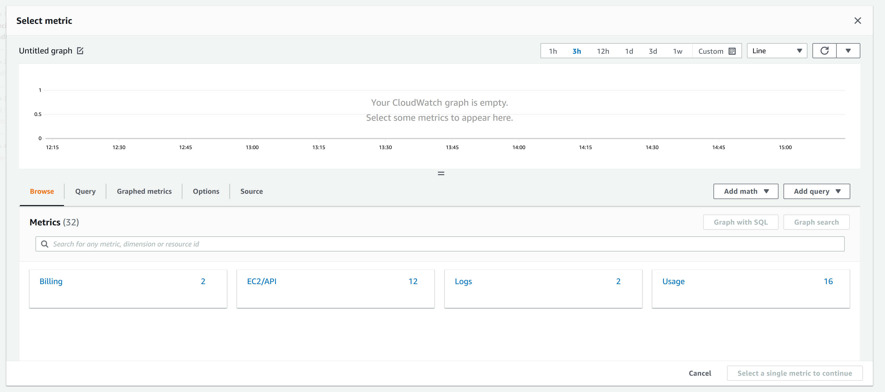

# Table of contents
- [Table of contents](#table-of-contents)
- [Advice for the Amazon exams](#advice-for-the-amazon-exams)
- [Zones and Regions](#zones-and-regions)
- [User management](#user-management)
  - [Generate secret key](#generate-secret-key)
  - [Billing](#billing)
- [EC2 (Elastic compute cloud)](#ec2-elastic-compute-cloud)
  - [Create simple vm](#create-simple-vm)
  - [Simple network rules](#simple-network-rules)
  - [Horizontal scalling via create another ec2 instance](#horizontal-scalling-via-create-another-ec2-instance)
- [EBS Elastic block storage](#ebs-elastic-block-storage)
- [EFS Elastic file system](#efs-elastic-file-system)
- [S3 Simple storage service](#s3-simple-storage-service)
- [AWS ClI](#aws-cli)
  - [Installing](#installing)
  - [конфигурирование](#конфигурирование)
  - [s3 cli](#s3-cli)
- [AWS SAM CLI](#aws-sam-cli)
  - [Installation](#installation)
- [Networking](#networking)
- [Load balancing](#load-balancing)
- [Serverless](#serverless)
  - [BaaS (Backend as a service)](#baas-backend-as-a-service)
  - [FaaS (Function as a service)](#faas-function-as-a-service)
  - [AWS Lambda](#aws-lambda)
  - [How lambda can be invoked](#how-lambda-can-be-invoked)
  - [Examples](#examples)
    - [Web API](#web-api)
    - [File processing](#file-processing)
  - [Other](#other)
  - [First Java example (compile and deploy via SAM)](#first-java-example-compile-and-deploy-via-sam)
  - [Invoke lambda via AWS CLI](#invoke-lambda-via-aws-cli)
  - [Example with async lambda invocatoin and writing to log](#example-with-async-lambda-invocatoin-and-writing-to-log)
  - [The Lambda Execution Environment](#the-lambda-execution-environment)
  - [Lambda Function Method Signatures](#lambda-function-method-signatures)
    - [Example with basic types](#example-with-basic-types)
    - [Lists and Maps](#lists-and-maps)
    - [POJO in lambdas](#pojo-in-lambdas)
    - [Streams](#streams)
    - [Context](#context)
  - [Timeout](#timeout)
  - [Memory and CPU](#memory-and-cpu)
    - [Example pricing](#example-pricing)
  - [Environment Variables](#environment-variables)

# Advice for the Amazon exams

You should have three times to solve every task. Starting from first to last.:
1. We try to find easy questions and do it immediately. And mark others by categories.
2. We solve complex tasks but which we understood but we need just more time for them
3. Others which we don't know how to solve. We need to choose answers for each of the questions. Perhaps it will work

# Zones and Regions

AWS houses its computers in more than 60 data centers spread around the world as shown in Figure 1-2. In AWS terminology, each data center corresponds to an Availability Zone (AZ), and clusters of data centers in close proximity to each other are grouped into regions. AWS has more than 20 different regions, across 5 continents.

A compelling aspect of Amazon’s region model is that each region is largely independent, logistically and from a software management point of view. That means that if a physical problem like a power outage, or a software problem like a deployment bug, happens in one region, the others will almost certainly be unaffected. 

# User management

There is root user, who has full rights for all operations in aws. As well there are IAM regular users, which possible to add to groups. To create IAM User we need first to activate capability to add such users. 

- Log in as root user
- Open Account Settings
- Find that sections 'IAM User and Role Access to Billing Information' and enable 'activate IAM access'


- Open AIM panel


- Create admins group


- Put rights as AdministratorsAccess


У всего есть ARN идентификатор амазона, используется в ссылках на компоненты. вот у той группы которую создали. Тут цифра это ID аккаунта. 


Создадим пользователя


После создания пользователя будет показана ссылка, которую можно будет сохранить и использовать для логина. Потом нужно выйти из root account and then needs to log in by the previous link. After that regenerate a password and then you will be as a new user.


## Generate secret key


Не рекомендуется создавать ключ доступа для root акаунта. Все ключи должны храниться в секретных местах. На той же странице можно настроить двухфакторную аутентификацию. Ключи нельзя посмотреть после, только отозвать и создать заново. 

## Billing
Зайти в Billing и выбрать.


на этой же странице есть ссылка на Managed Billing Alerts. Откроется Cloud Watch сервис нотификаций амазона. В нем можно настроить мониторить сервисы, смотреть логи сервисов, а также настроить нотификации об оплате. 





после этого подтвердить подписку на электронной почте и вот финальная картинка


# EC2 (Elastic compute cloud)

EC2 was one of the first infrastructure-as-a-service **IaaS** products.

## Create simple vm


Далее копируем публичный ключ, применяем права доступа и заходим через ssh

```bash
mv /mnt/c/Users/anton/Downloads/awsdemo.pem ~/.ssh

chmod 400 ~/.ssh/awsdemo.pem

ssh -i "~/.ssh/awsdemo.pem" ubuntu@ec2-54-157-214-250.compute-1.amazonaws.com
```

## Simple network rules

для проверки поставим apache сервер в инстанс
обновим индекс пакетов в vm
```bash
sudo apt-get update
sudo apt-get install apache2
```
потом попробуем подключиться из браузера на порт 80 по публичному dns имени, его можно найти в деталях инстанса
Затем зайдем в настройки security group и добавим доступ по 80 порту


## Horizontal scalling via create another ec2 instance
Идея простая. Настроили инстанс, потом можно создать его образ и раскатить еще один инстанс на основе этого образа.
Создадим шаблон

Созданим новый инсанс в другой зоне доступности с уже существующими ключами и правила security group


# EBS Elastic block storage
К каждому инстансу ec2 подключается volume который можно расширять по мере необходимости. 
Но он доступн в один момент времени только для одного инстанса. Можно делать периодические снепшоты с volume, т.е слепки файловой системы. Отличается от создание образов на основе инстанса т.к сохраняет только файловую систему.


# EFS Elastic file system
Можно создать общую файловую систему, которую можно разделять между инстансами ec2.
Итого имеем 2 инстанса, хотим сделать общую папку между ними.


Создадим файловую систему через efs


потом нужно подкрутить security group чтобы трафик мог ходить между сервисами aws
Добавляем для каждого инстанса


далее логинимся на каждый инстанс


Устанавливаем пакет nfs-common

```bash
sudo apt install nfs-common
```

создадим каталог `/efs`
```bash
cd /
sudo mkdir /efs
```
далее можем создадить временную точку монтирования для проверки. Потом переделать на fstab
(постоянное монтирование)
команду можно найти в описании к efs


```bash
cd /
sudo mount -t nfs4 -o nfsvers=4.1,rsize=1048576,wsize=1048576,hard,timeo=600,retrans=2,noresvport fs-0f1e7ae9d1a311501.efs.us-east-1.amazonaws.com:/ efs
```


теперь можем шарить файлы между инстансами


# S3 Simple storage service


Можно создавать бакеты (buckets) и в них создавать файлы. Доступ можно настраивать как на папки так и на бакеты. Лучше для публичных данных создавать отдельный бакет. 
Имя бакета уникально для всех пользователей. Т.е назвать tests3 нельзя. 


Есть также S3 Glacier метафора про холодильник, достать данные из которого потребует значительного времени, но дешевле чем S3. Подходит для бекапов, логов и тд, которые не нужно постоянно читать. Можно настроить политику переноса данных в Glasier после некоторого времени хранения. 

Также если нужен CDN , есть CloudFront. Например если делаем статический сайт и храним его в S3 бакете, можно настроить CloudFront так, чтобы в зависимости от расположения пользователя выбирался ближайший сервис, чтобы сделать загрузку быстрее.

# AWS ClI

## Installing

```bash
$ curl "https://awscli.amazonaws.com/awscli-exe-linux-x86_64.zip" -o "awscliv2.zip"
unzip awscliv2.zip
sudo ./aws/install
```

## конфигурирование
```bash
aws configure
```
указать Access Key ID , AWS Secret Access Key далее регион, обычно us-east-1 формат json

for checking

```bash
aws iam get-user
```

output like this
```
{
  "User": {
    "Path": "/",
    "UserName": "book",
    "UserId": "AIDA111111111111111111",
    "Arn": "arn:aws:iam::181111111111:user/book",
    "CreateDate": "2019-10-21T20:27:05Z"
  }
}
```

## s3 cli

show list of s3 buckets
```bash
 aws s3api list-buckets
```


при подключении может быть ошибка 
> An error occurred (RequestTimeTooSkewed) when calling the ListBuckets operation: The difference between the request time and the current time is too large.

такое встречал в wsl ubuntu. Нужно синхронизировать время
```bash
sudo hwclock -s
```
посмотреть список бакетов  в простом формате
```bash
aws s3 ls
```


скопировать файл в s3

```
aws s3 cp ./file.txt s3://tests355465646546/folder_3/
```


# AWS SAM CLI

## Installation


```bash
curl "https://github.com/aws/aws-sam-cli/releases/latest/download/aws-sam-cli-linux-x86_64.zip" -o "aws-sam-cli.zip"
unzip aws-sam-cli.zip -d sam-installation
sudo ./aws/install
sam --version
```


# Networking

# Load balancing
ELB - Elastic load balancer

# Serverless

All three of these ideas—`IaaS` (EC2 + S3 and etc), `PaaS` (Heroku.. etc), and `CaaS` (EKS with Kubernates etc) —can be grouped as compute as a service; in other words, they are different types of generic environments that we can run our own specialized software in. 

PaaS and CasS differ from IaaS by raising the level of abstraction further, allowing us to hand off more of our “heavy lifting” to others.

Serverless is the next evolution of cloud computing and can be divided into two ideas: backend as a service and functions as a service.

## BaaS (Backend as a service)
Backend as a service (`BaaS`) allows us to replace server-side components that we code and/or manage ourselves with off-the-shelf services. It’s closer in concept to software as a service (SaaS) than it is to things like virtual instances and containers. SaaS is typically about outsourcing business processes, though—think HR or sales tools or, on the technical side, products like GitHub—whereas with BaaS, we’re breaking up our applications into smaller pieces and implementing some of those pieces entirely with externally hosted products.

Example of BaaS:
- AWS Cognito. For authentication and user management
- Google Firebase. Database

## FaaS (Function as a service)

The other half of serverless is functions as a service (FaaS). FaaS, like IaaS, PaaS, and CaaS, is another form of compute as a service—a generic environment within which we can run our own software. Some people like to use the term serverless compute instead of FaaS.

With FaaS we deploy our code as independent functions or operations, and we configure those functions to be called, or triggered, when a specific event or request occurs within the FaaS platform. The platform itself calls our functions by instantiating a dedicated environment for each event—this environment consists of an ephemeral, fully managed lightweight virtual machine, or container; the FaaS runtime; and our code.

The functions are not constantly active in an application process,

Once the function has finished executing, the FaaS platform is free to tear it down. Alternatively, as an optimization, it may keep the function around for a little while until there’s another event to be processed.


## AWS Lambda

AWS Lambda was launched in 2014

Lambda implements the FaaS pattern by instantiating ephemeral, managed, Linux environments to host each of our function instances. Lambda guarantees that only one event is processed per environment at a time. 

Lambda also requires that the function completes processing of the event within 15 minutes; otherwise, the execution is aborted.

Since we are fully abstracted from the underlying host with Lambda, we can’t specify a number or type of underlying EC2 instances to use. Instead, we specify how much RAM our function requires (up to a maximum of 3GB), and other aspects of performance are tied to this too. 

If a particular data center/Availability Zone fails, then Lambda will automatically start environments in a different AZ in the same region.

## How lambda can be invoked

- Lambda functions can be called synchronously—named **RequestResponse** by AWS. In this scenario, an upstream component calls the Lambda function and waits for whatever response the Lambda function generates.

- Lambda function may be invoked asynchronously—named **Event** by AWS. This time the request from the upstream caller is responded to immediately by the Lambda platform, while the Lambda function proceeds with processing the request. No further response is returned to the caller in this scenario.

## Examples

### Web API

 While Lambda functions aren’t HTTP servers themselves, we can use another AWS component, API Gateway, to provide the HTTP protocol and routing logic

PI Gateway will invoke the Lambda function synchronously and will wait for the function to evaluate the request and return a response.

 

 ### File processing

S3 can be configured to invoke the Lambda platform when the file is uploaded, specifying the function to be called, and passing a path to the file. As with the previous example, the Lambda platform then instantiates the Lambda function and calls it with the request details passed this time by S3. The difference now, though, is that this is an asynchronous invocation (S3 specified the Event invocation type)—no value is returned to S3 nor does S3 wait for a return value.

 

 ## Other

 - We can build message-processing applications, using message buses like Simple Notification Service (SNS), Simple Queue Service (SQS), EventBridge, or Kinesis as the event source.
 - We can build email-processing applications, using Simple Email Service (SES) as the event source
 - We can build scheduled-task applications, similar to cron programs, using CloudWatch Scheduled Events as the trigger.

## First Java example (compile and deploy via SAM)

- this class in simple maven project

```java
package book;

public class HelloWorld {
    public String handler(String s) {
        return "Hello, " + s;
    }
}
```
- `pom.xml`
```xml
<?xml version="1.0" encoding="UTF-8"?>
<project xmlns="http://maven.apache.org/POM/4.0.0"
         xmlns:xsi="http://www.w3.org/2001/XMLSchema-instance"
         xsi:schemaLocation="http://maven.apache.org/POM/4.0.0
         http://maven.apache.org/xsd/maven-4.0.0.xsd">
  <modelVersion>4.0.0</modelVersion>

  <groupId>my.groupId</groupId>
  <artifactId>HelloWorldLambdaJava</artifactId>
  <version>1.0-SNAPSHOT</version>

  <properties>
    <maven.compiler.source>1.8</maven.compiler.source>
    <maven.compiler.target>1.8</maven.compiler.target>
    <project.build.sourceEncoding>UTF-8</project.build.sourceEncoding>
  </properties>

  <build>
    <plugins>
      <plugin>
        <artifactId>maven-shade-plugin</artifactId>
        <version>3.2.1</version>
        <executions>
          <execution>
            <phase>package</phase>
            <goals>
              <goal>shade</goal>
            </goals>
          </execution>
        </executions>
        <configuration>
          <finalName>lambda</finalName>
        </configuration>
      </plugin>
    </plugins>
  </build>

</project>
```
- `template.yml` Artifact to deploy jar file in aws lambda
```yml
AWSTemplateFormatVersion: 2010-09-09
Transform: AWS::Serverless-2016-10-31
Description: HelloWorldLambdaJava

Resources:

  HelloWorldLambda:
    Type: AWS::Serverless::Function
    Properties:
      Runtime: java8
      MemorySize: 512
      Handler: book.HelloWorld::handler # package class and method to invoke
      CodeUri: target/lambda.jar        # path to jar file where class is
```

- structure of project (just simple java maven project)


- build project via simple `mvn clear package`
- create s3 bucket to uploading jar file

```bash
aws s3 mb s3://some_unique_name
```


- change directory where `template.yml` file is inside 
- upload via sam compiled jar
  ```bash
   sam deploy \
  --s3-bucket tests465465465465 \
  --stack-name HelloWorldLambdaJava \
  --capabilities CAPABILITY_IAM
  ```


- then open AWS Lambda web interface


- clear lambda 

```bash
aws cloudformation delete-stack --stack-name HelloWorldLambdaJava
```

## Invoke lambda via AWS CLI

- Edit an example above by adding `FunctionName`

```yml
AWSTemplateFormatVersion: 2010-09-09
Transform: AWS::Serverless-2016-10-31
Description: HelloWorldLambdaJava

Resources:

  HelloWorldLambda:
    Type: AWS::Serverless::Function
    Properties:
      FunctionName: HelloWorldJava
      Runtime: java8
      MemorySize: 512
      Handler: book.HelloWorld::handler 
      CodeUri: target/lambda.jar
```      

- deploy function 
- invoke lambda via cli

where `payload` is a Base64 String

```bash
 aws lambda invoke --invocation-type RequestResponse --function-name HelloWorldJava --payload IkhlbGxvIg== outputfile.txt
```

- result will be in `outputfile.txt`

if we changed as ``--invocation-type Event ``  we will get 202 Status "Accepted".

## Example with async lambda invocatoin and writing to log

- change example above

```java
public class HelloWorld {
        public void handler(String s) {

            System.out.println("Hello, " + s);
        }
}
```
- deploy with `sam`

  ```bash
   sam deploy \
  --s3-bucket tests465465465465 \
  --stack-name HelloWorldLambdaJava \
  --capabilities CAPABILITY_IAM
  ```

- invoke via cli

```bash
aws lambda invoke   --invocation-type Event --function-name HelloWorldJava   --payload IkhlbGxvIg== outputfile.txt
```

- open cloud watch logs


- open latest log stream


- find hello in logs


## The Lambda Execution Environment


A lambda function is executed whenever the `invoke` command of the `AWS Lambda API` is called. 

This happens at the following times:
- When a function is triggered by an event source
- When you use the test harness in the web console
- When you call the Lambda API invoke command yourself, typically via the CLI or SDK, from your own code or scripts

After that:
- `Lambda service` will create a `host Linux environment`
- Lambda will start a language runtime within it. In our case a JVM. The JVM is started with a set of environment flags that we can’t change
- Starting `Lambda Java Runtime`, such as aws java application server. It is responsible for top-level error handling, logging, and more.

## Lambda Function Method Signatures

- `output-type handler-name(input-type input)`
- `output-type handler-name(input-type input, Context context)`
- `void handler-name(InputStream is, OutputStream os)`
- `void handler-name(InputStream is, OutputStream os, Context context)`

where:

- `output-type` can be `void`, a Java primitive, or a JSON-serializable type.
- `input-type` is a Java primitive, or a JSON-serializable type.
- `Context` refers to `com.amazonaws.services.lambda.runtime.Context` 
- `InputStream` and `OutputStream` refer to the types with those names in the `java.io` package.
- `handler-name` can be any valid Java method name, and we refer to it in our application’s configuration.

- Java Lambda methods can be either instance methods or static methods, but must be public.
- A class containing a Lambda function cannot be abstract and must have a no-argument constructor—either the default constructor (i.e., no constructor specified)
- You are not required to implement any interfaces or base classes, although you may do so if you desire. AWS provides a `RequestHandler` interface if you want to be very explicit about the type of your Lambda classes
- You may have multiple Lambda functions defined in one class with different names, but we don’t usually recommend this style

### Example with basic types

- for `true`, `false`, `"true"`, or `"false"`
- for `5` or `"5"`
```java
package book;

public class StringIntegerBooleanLambda {
  public void handlerString(String s) {
    System.out.println("Hello, " + s);
  }

  public boolean handlerBoolean(boolean input) {
    return !input;
  }

  public boolean handlerInt(int input) {
    return input > 100;
  }
}
```

### Lists and Maps

```java
package book;

import java.util.ArrayList;
import java.util.HashMap;
import java.util.List;
import java.util.Map;
import java.util.stream.IntStream;

public class ListMapLambda {


// [ 1, 2, 3 ]  output [ 101, 102, 103 ]

  public List<Integer> handlerList(List<Integer> input) {
    List<Integer> newList = new ArrayList<>();
    input.forEach(x -> newList.add(100 + x));
    return newList;
  }

  // { "a" : "x", "b" : "y"}  output { "New Map → a" : "x", "New Map → b" : "y" }

  public Map<String,String> handlerMap(Map<String,String> input) {
    Map<String, String> newMap = new HashMap<>();
    input.forEach((k, v) -> newMap.put("New Map -> " + k, v));
    return newMap;
  }

/*
[
  { "m" : 1, "n" : 2 },
  { "x" : 8, "y" : 9 }
]
*/

/* Output
{
  "Nested at position 0": { "m" : 1, "n" : 2},
  "Nested at position 1": { "x": 8, "y" : 9}
}
*/
  public Map<String,Map<String, Integer>> handlerNestedCollection(List<Map<String, Integer>> input) {
    Map<String, Map<String, Integer>> newMap = new HashMap<>();
    IntStream.range(0, input.size())
          .forEach(i -> newMap.put("Nested at position " + i, input.get(i)));
    return newMap;
  }
}
```

### POJO in lambdas

- POJO input classes can be static nested classes or regular (outer) classes. 
- they need to have an empty constructor and have field setters that follow the naming of the expected fields to be deserialized from the input JSON. 
- If no JSON field is found with the same name as a setter, then the POJO field will be left null. 
- Input POJO objects need to be mutable since the runtime will modify them after they’ve been instantiated

- There are fewer limitations on POJO output classes—since they are not created or mutated by the Lambda runtime, you are free to construct them as you please and free to make them immutable.
-  Like input classes, POJO output classes can be static nested classes or regular (outer) classes.

```java
package book;


// { "a" : "Hello Lambda" }  output { "b" : "Input was Hello Lambda" }

public class PojoLambda {
  public PojoResponse handlerPojo(PojoInput input) {
    return new PojoResponse("Input was " + input.getA());
  }

  public static class PojoInput {
    private String a;

    public String getA() {
      return a;
    }

    public void setA(String a) {
      this.a = a;
    }
  }

  public static class PojoResponse {
    private final String b;

    PojoResponse(String b) {
      this.b = b;
    }

    public String getB() {
      return b;
    }
  }
}
```

```java
package book;

public class PojoLambda {
  public PojoResponse handlerPojo(PojoInput input) {
    return new PojoResponse("Input was " + input.c);
  }

  public static class PojoInput {
    public String c;
  }

  public static class PojoResponse {
    public final String d;

    PojoResponse(String d) {
      this.d = d;
    }
  }
}
```

One of the main uses for POJO input deserialization is when you tie your Lambda function to one of the AWS ecosystem Lambda event sources.

```java
public void handler(S3Event input) {
  // …
}
```

### Streams

```java
package book;

import java.io.IOException;
import java.io.InputStream;
import java.io.OutputStream;

public class StreamLambda {
  public void handlerStream(InputStream inputStream, OutputStream outputStream) throws IOException {
    int letter;
    while((letter = inputStream.read()) != -1)
    {
      outputStream.write(Character.toUpperCase(letter));
    }
  }
}
```

### Context

```com.amazonaws.services.lambda.runtime.Context```


[Context documentation](https://docs.aws.amazon.com/lambda/latest/dg/java-context.html)

```java
package book;

import com.amazonaws.services.lambda.runtime.Context;

import java.util.HashMap;
import java.util.Map;

public class ContextLambda {
  public Map<String,Object> handler (Object input, Context context) {
    Map<String, Object> toReturn = new HashMap<>();
    toReturn.put("getMemoryLimitInMB", context.getMemoryLimitInMB() + "");
    toReturn.put("getFunctionName",context.getFunctionName());
    toReturn.put("getFunctionVersion",context.getFunctionVersion());
    toReturn.put("getInvokedFunctionArn",context.getInvokedFunctionArn());
    toReturn.put("getAwsRequestId",context.getAwsRequestId());
    toReturn.put("getLogStreamName",context.getLogStreamName());
    toReturn.put("getLogGroupName",context.getLogGroupName());
    toReturn.put("getClientContext",context.getClientContext());
    toReturn.put("getIdentity",context.getIdentity());
    toReturn.put("getRemainingTimeInMillis",
                   context.getRemainingTimeInMillis() + "");
    return toReturn;
  }
}
```

```xml
<dependencies>
  <dependency>
    <groupId>com.amazonaws</groupId>
    <artifactId>aws-lambda-java-core</artifactId>
    <version>1.2.0</version>
    <scope>provided</scope>
  </dependency>
</dependencies>
```

output 
```json
{
  "getFunctionName": "ContextLambda",
  "getLogStreamName": "2019/07/24/[$LATEST]0f1b1111111111111111111111111111",
  "getInvokedFunctionArn":
    "arn:aws:lambda:us-west-2:181111111111:function:ContextLambda",
  "getIdentity": {
    "identityId": "",
    "identityPoolId": ""
  },
  "getRemainingTimeInMillis": "2967",
  "getLogGroupName": "/aws/lambda/ContextLambda",
  "getLogger": {},
  "getFunctionVersion": "$LATEST",
  "getMemoryLimitInMB": "512",
  "getClientContext": null,
  "getAwsRequestId": "2108d0a2-a271-11e8-8e33-cdbf63de49d2"
}
```

## Timeout

- You are able to specify this timeout when you create the function
- you can update it later in the function’s configuration.
- maximum timeout is 15 minutes. For a long time the maximum timeout was 5 minutes.
- it defaults to 3 seconds
- the timeout period is not started during the cold start of a function 

```yml
AWSTemplateFormatVersion: 2010-09-09
Transform: AWS::Serverless-2016-10-31
Description: HelloWorldLambdaJava

Resources:

  HelloWorldLambda:
    Type: AWS::Serverless::Function
    Properties:
      FunctionName: TimeoutLambda
      Timeout: 2 # 2s 
      Runtime: java8
      MemorySize: 512 # Mb
      Handler: book.TimeoutLambda::handler 
      CodeUri: target/lambda.jar
```      

```java
package book;

import com.amazonaws.services.lambda.runtime.Context;

public class TimeoutLambda {
  public void handler (Object input, Context context) throws InterruptedException {
    while(true) {
      Thread.sleep(100);
      System.out.println("Context.getRemainingTimeInMillis() : " +
        context.getRemainingTimeInMillis());
    }
  }
}
```


```log
2023-02-12T23:45:18.725+01:00	INIT_START Runtime Version: java:8.v14 Runtime Version ARN: arn:aws:lambda:eu-north-1::runtime:976f6b03f8ebcf9a902c3d59a05ba4b7c260b2841a5a10b307bb8bbd15e34a03
2023-02-12T23:45:19.219+01:00	START RequestId: 2fee9e4c-4466-4b68-8f9d-e40bcd8b5015 Version: $LATEST
2023-02-12T23:45:19.370+01:00	Context.getRemainingTimeInMillis() : 1849
2023-02-12T23:45:19.470+01:00	Context.getRemainingTimeInMillis() : 1748
2023-02-12T23:45:19.570+01:00	Context.getRemainingTimeInMillis() : 1648
2023-02-12T23:45:19.670+01:00	Context.getRemainingTimeInMillis() : 1548
2023-02-12T23:45:19.771+01:00	Context.getRemainingTimeInMillis() : 1448
2023-02-12T23:45:19.871+01:00	Context.getRemainingTimeInMillis() : 1347
2023-02-12T23:45:19.971+01:00	Context.getRemainingTimeInMillis() : 1247
2023-02-12T23:45:20.071+01:00	Context.getRemainingTimeInMillis() : 1147
2023-02-12T23:45:20.171+01:00	Context.getRemainingTimeInMillis() : 1047
2023-02-12T23:45:20.272+01:00	Context.getRemainingTimeInMillis() : 947
2023-02-12T23:45:20.372+01:00	Context.getRemainingTimeInMillis() : 846
2023-02-12T23:45:20.472+01:00	Context.getRemainingTimeInMillis() : 746
2023-02-12T23:45:20.572+01:00	Context.getRemainingTimeInMillis() : 646
2023-02-12T23:45:20.672+01:00	Context.getRemainingTimeInMillis() : 546
2023-02-12T23:45:20.773+01:00	Context.getRemainingTimeInMillis() : 445
2023-02-12T23:45:20.873+01:00	Context.getRemainingTimeInMillis() : 345
2023-02-12T23:45:20.973+01:00	Context.getRemainingTimeInMillis() : 245
2023-02-12T23:45:21.073+01:00	Context.getRemainingTimeInMillis() : 145
2023-02-12T23:45:21.174+01:00	Context.getRemainingTimeInMillis() : 45
2023-02-12T23:45:21.224+01:00	2023-02-12T22:45:21.223Z 2fee9e4c-4466-4b68-8f9d-e40bcd8b5015 Task timed out after 2.00 seconds
2023-02-12T23:45:21.224+01:00	END RequestId: 2fee9e4c-4466-4b68-8f9d-e40bcd8b5015
2023-02-12T23:45:21.224+01:00	REPORT RequestId: 2fee9e4c-4466-4b68-8f9d-e40bcd8b5015 Duration: 2004.97 ms Billed Duration: 2000 ms Memory Size: 512 MB Max Memory Used: 72 MB Init Duration: 492.71 ms
2023-02-12T23:45:21.317+01:00	INIT_START Runtime Version: java:8.v14 Runtime Version ARN: arn:aws:lambda:eu-north-1::runtime:976f6b03f8ebcf9a902c3d59a05ba4b7c260b2841a5a10b307bb8bbd15e34a03
```

## Memory and CPU

`memory-size` can be as small as 64MB, although for Java Lambda functions you should probably use at least 256MB. memory-size must be a multiple of 64MB.

A very important thing to know is that the memory-size setting is not just for how much RAM your function can use—it also specifies how much CPU power you get. In fact, a Lambda function’s CPU power scales linearly from 64MB up to 1792MB. Therefore a Lambda function configured with 1024MB of RAM has twice the CPU power of one with 512MB of RAM.

AWS charges for Lambda functions by two primary factors:
- How long a function runs, rounded up to the nearest 100 ms
- How much memory a function is specified to use

In other words, given the same execution duration, a Lambda function that has 2GB of RAM costs twice as much to execute as one with 1GB of RAM. Or, one with 512MB of RAM costs 17% of one with 3008MB. This, at scale, could be a big difference.

### Example pricing

First, let’s think back to the photo resizer  Let’s say that we set that function to use 1.5GB RAM, it takes on average 10 seconds to run, and it processes 10,000 photos per day. Lambda pricing consists of two parts—request pricing, which is $0.20 per million requests, and duration pricing, which is $0.0000166667 per gigabyte-second. Therefore we need to calculate both parts to estimate cost for our photo resizer:

- The request cost is `$0.20 × .01 = $0.002/day`, or `$0.06/month`.
- The duration cost is `10 (seconds/invocation) × 10,000 (invocations) × 1.5 (GB) × $0.0000166667 = $2.50/day`, or `$75/month`.

Obviously the duration cost is the vast majority here.

$75/month is about the same cost as a “m5.large” EC2 instance—which is $70/month. An m5.large EC2 instance is the smallest size VM in the m5 “general purpose” family; it has 8GB RAM and two CPUs, so it would likely be about right as an alternative to host our photo resizer. However, Lambda has significant benefits as a solution, even though the costs appear at first glance about the same:

- Lambda doesn’t require the operations cost of managing an EC2 instance—there’s no need to think about operating system patches, user management, etc. Therefore our total cost of ownership (TCO) is lower for Lambda.
- Lambda already manages the “event driven” nature of the application, so we don’t need to build that into the version we would run on a regular server.
- Lambda will auto-scale without effort and so will handle, without concern, any spikes in traffic. A server-based solution may become overloaded or need to be built to include buffering. In fact, the more “spikey” your application’s load, the more cost effective Lambda is as a solution.
- Lambda is already highly available across AZs—to guarantee that availability with a server-based solution, we would need to double or triple our costs for two or three zones of availability.

Now let’s look back to our web API. Let’s say we set the web API Lambda functions to use 512MB RAM and each invocation takes no more than 100 ms to run. Let’s say the API processes on average 10 requests per second (864,000 requests/day) but can peak up to 100 requests per second.

- The request cost is `$0.20 × 0.864 = $0.17/day`, or `$5.18/month`.
- The duration cost is `0.1 × 864,000 × 0.5 × $0.0000166667 = $0.72/day`, or `$21.60/month`.

In other words, we need to spend $27/month to handle 10 requests/second average, and this system could happily could peak to 10x that rate, without breaking a sweat (or increasing the costs).

## Environment Variables

```java
package book;

public class EnvVarLambda {
  public void handler(Object event) {
    String databaseUrl = System.getenv("DATABASE_URL");
    if (databaseUrl == null || databaseUrl.isEmpty())
      System.out.println("DATABASE_URL is not set");
    else
      System.out.println("DATABASE_URL is set to: " + databaseUrl);
  }
}
```

```yml
HelloWorldLambda:
  Type: AWS::Serverless::Function
  Properties:
    FunctionName: HelloWorldJava
    Runtime: java8
    MemorySize: 512
    Handler: book.EnvVarLambda::handler
    CodeUri: target/lambda.jar
    Environment:
      Variables:
        DATABASE_URL: my-database-url
```        