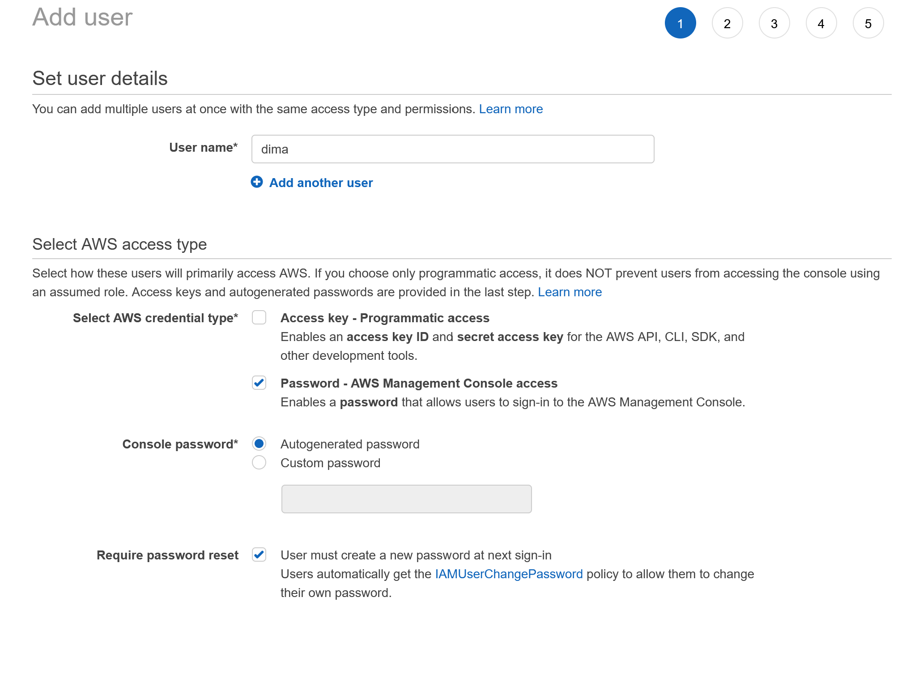

# Содержание
- [Содержание](#содержание)
- [Советы для прохождения экзамена](#советы-для-прохождения-экзамена)
- [User management](#user-management)
  - [Generate sectet key](#generate-sectet-key)
  - [Billing](#billing)
- [EC2 (Elastic compute cloud)](#ec2-elastic-compute-cloud)
  - [Create simple vm](#create-simple-vm)
  - [Simple network rules](#simple-network-rules)
  - [Горизонтальное масштабирование путем создания образа инстанса](#горизонтальное-масштабирование-путем-создания-образа-инстанса)
- [EBS Elastic block storage](#ebs-elastic-block-storage)
- [EFS Elastic file system](#efs-elastic-file-system)
- [S3 Simple storage service](#s3-simple-storage-service)
- [AWS ClI](#aws-cli)
  - [Installing](#installing)
  - [конфигурирование](#конфигурирование)
- [Networking](#networking)
- [Load balancing](#load-balancing)


# Советы для прохождения экзамена

Доллжно быть 3 прохода:
1. Ищем простые вопросы и отвечаем на них. Отмечаем все остальные
2. Решаем сложные вопросы, задания в которых понятны, но нужно больше времени чтобы дать верный ответ
3. Задания решать которые без понятия как. Нужно что-то выбрать.
Перед тем как отправить нужно поставить вариант ответа у каждого вопроса.

# User management

Есть Root user, при котором доступны все возможные операции с пользователями на aws и также IAM User регулярные пользователи, которые можно добавлять в группы. Для того чтобы возможно было создать IAM User нужно сначала активировать возможность добавления таких пользователей. 


Войдем в консоль пользователей


Создадим группу admins


Поставим права AdministratorsAccess


У всего есть ARN идентификатор амазона, используется в ссылках на компоненты. вот у той группы которую создали. Тут цифра это ID аккаунта. 


Создадим пользователя





После создания пользователя будет показана ссылка, которую можно будет сохранить и использовать для логина. Потом нужно выйти из root account and then needs to log in by the previous link. After that regenerate a password and then you will be as a new user.


## Generate sectet key


Не рекомендуется создавать ключ доступа для root акаунта. Все ключи должны храниться в секретных местах. На той же странице можно настроить двухфакторную аутентификацию. Ключи нельзя посмотреть после, только отозвать и создать заново. 

## Billing
Зайти в Billing и выбрать.


на этой же странице есть ссылка на Managed Billing Alerts. Откроется Cloud Watch сервис нотификаций амазона. В нем можно настроить мониторить сервисы, смотреть логи сервисов, а также настроить нотификации об оплате. 


после этого подтвердить подписку на электронной почте и вот финальная картинка


# EC2 (Elastic compute cloud)

## Create simple vm


Далее копируем публичный ключ, применяем права доступа и заходим через ssh

```
mv /mnt/c/Users/anton/Downloads/awsdemo.pem ~/.ssh

chmod 400 ~/.ssh/awsdemo.pem

ssh -i "~/.ssh/awsdemo.pem" ubuntu@ec2-54-157-214-250.compute-1.amazonaws.com
```

## Simple network rules

для проверки поставим apache сервер в инстанс
обновим индекс пакетов в vm
```
sudo apt-get update
```
```
sudo apt-get install apache2
```
потом попробуем подключиться из браузера на порт 80 по публичному dns имени, его можно найти в деталях инстанса
Затем зайдем в настройки security group и добавим доступ по 80 порту


## Горизонтальное масштабирование путем создания образа инстанса
Идея простая. Настроили инстанс, потом можно создать его образ и раскатить еще один инстанс на основе этого образа.
Создадим шаблон

Созданим новый инсанс в другой зоне доступности с уже существующими ключами и правила security group


# EBS Elastic block storage
К каждому инстансу ec2 подключается volume который можно расширять по мере необходимости. 
Но он доступн в один момент времени только для одного инстанса. Можно делать периодические снепшоты с volume, т.е слепки файловой системы. Отличается от создание образов на основе инстанса т.к сохраняет только файловую систему.


# EFS Elastic file system
Можно создать общую файловую систему, которую можно разделять между инстансами ec2.
Итого имеем 2 инстанса, хотим сделать общую папку между ними.


Создадим файловую систему через efs


потом нужно подкрутить security group чтобы трафик мог ходить между сервисами aws
Добавляем для каждого инстанса


далее логинимся на каждый инстанс


Устанавливаем пакет nfs-common

```bash
sudo apt install nfs-common
```

создадим каталог `/efs`
```bash
cd /
sudo mkdir /efs
```
далее можем создадить временную точку монтирования для проверки. Потом переделать на fstab
(постоянное монтирование)
команду можно найти в описании к efs


```bash
cd /
sudo mount -t nfs4 -o nfsvers=4.1,rsize=1048576,wsize=1048576,hard,timeo=600,retrans=2,noresvport fs-0f1e7ae9d1a311501.efs.us-east-1.amazonaws.com:/ efs
```


теперь можем шарить файлы между инстансами


# S3 Simple storage service


Можно создавать бакеты (buckets) и в них создавать файлы. Доступ можно настраивать как на папки так и на бакеты. Лучше для публичных данных создавать отдельный бакет. 
Имя бакета уникально для всех пользователей. Т.е назвать tests3 нельзя. 


Есть также S3 Glacier метафора про холодильник, достать данные из которого потребует значительного времени, но дешевле чем S3. Подходит для бекапов, логов и тд, которые не нужно постоянно читать. Можно настроить политику переноса данных в Glasier после некоторого времени хранения. 

Также если нужен CDN , есть CloudFront. Например если делаем статический сайт и храним его в S3 бакете, можно настроить CloudFront так, чтобы в зависимости от расположения пользователя выбирался ближайший сервис, чтобы сделать загрузку быстрее.

# AWS ClI

## Installing

```bash
$ curl "https://awscli.amazonaws.com/awscli-exe-linux-x86_64.zip" -o "awscliv2.zip"
unzip awscliv2.zip
sudo ./aws/install
```

## конфигурирование
```bash
aws configure
```
указать Access Key ID , AWS Secret Access Key далее регион, обычно us-east-1 формат json

посмотреть список бакетов s3 через api
```bash
 aws s3api list-buckets
```


при подключении может быть ошибка 
> An error occurred (RequestTimeTooSkewed) when calling the ListBuckets operation: The difference between the request time and the current time is too large.

такое встречал в wsl ubuntu. Нужно синхронизировать время
```bash
sudo hwclock -s
```
посмотреть список бакетов  в простом формате
```bash
aws s3 ls
```


скопировать файл в s3

```
aws s3 cp ./file.txt s3://tests355465646546/folder_3/
```


# Networking

# Load balancing
ELB - Elastic load balancer


