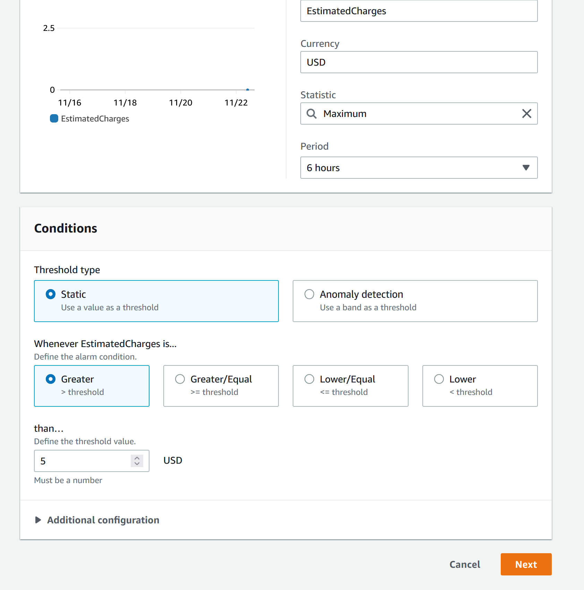

# AWS

## User management

Есть Root user, при котором доступны все возможные операции с пользователями на aws и также IAM User регулярные пользователи, которые можно добавлять в группы. Для того чтобы возможно было создать IAM User нужно сначала активировать возможность добавления таких пользователей. 


Войдем в консоль пользователей


Создадим группу admins


Поставим права AdministratorsAccess


У всего есть ARN идентификатор амазона, используется в ссылках на компоненты. вот у той группы которую создали. Тут цифра это ID аккаунта. 


Создадим пользователя


После создания пользователя будет показана ссылка, которую можно будет сохранить и использовать для логина. Потом нужно выйти из root account and then needs to log in by the previous link. After that regenerate a password and then you will be as a new user.


## Generate sectet key


Не рекомендуется создавать ключ доступа для root акаунта. Все ключи должны храниться в секретных местах. На той же странице можно настроить двухфакторную аутентификацию. Ключи нельзя посмотреть после, только отозвать и создать заново. 

## Billing
Зайти в Billing и выбрать.


на этой же странице есть ссылка на Managed Billing Alerts. Откроется Cloud Watch сервис нотификаций амазона. В нем можно настроить мониторить сервисы, смотреть логи сервисов, а также настроить нотификации об оплате. 





после этого подтвердить подписку на электронной почте и вот финальная картинка


## EC2

### Create simple vm


Далее копируем публичный ключ, применяем права доступа и заходим через ssh

```
mv /mnt/c/Users/anton/Downloads/awsdemo.pem ~/.ssh

chmod 400 ~/.ssh/awsdemo.pem

ssh -i "~/.ssh/awsdemo.pem" ubuntu@ec2-54-157-214-250.compute-1.amazonaws.com
```