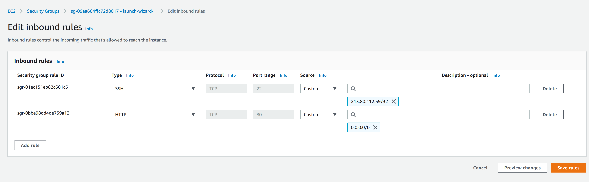
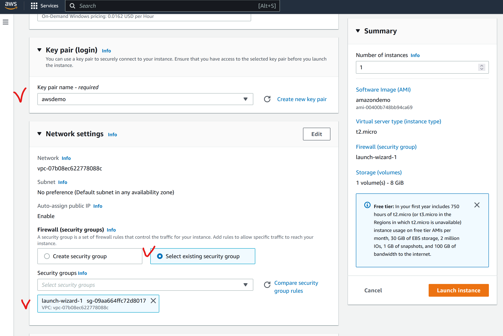
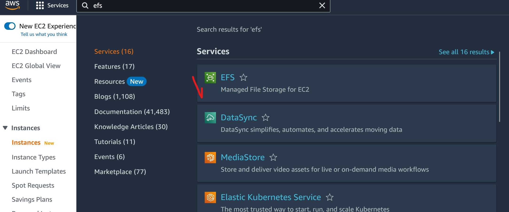

# Table of contents
- [Table of contents](#table-of-contents)
- [Advice for the Amazon exams](#advice-for-the-amazon-exams)
- [Zones and Regions](#zones-and-regions)
- [User management](#user-management)
  - [Generate sectet key](#generate-sectet-key)
  - [Billing](#billing)
- [EC2 (Elastic compute cloud)](#ec2-elastic-compute-cloud)
  - [Create simple vm](#create-simple-vm)
  - [Simple network rules](#simple-network-rules)
  - [Horizontal scalling via create another ec2 instance](#horizontal-scalling-via-create-another-ec2-instance)
- [EBS Elastic block storage](#ebs-elastic-block-storage)
- [EFS Elastic file system](#efs-elastic-file-system)
- [S3 Simple storage service](#s3-simple-storage-service)
- [AWS ClI](#aws-cli)
  - [Installing](#installing)
  - [конфигурирование](#конфигурирование)
- [Networking](#networking)
- [Load balancing](#load-balancing)
- [Serverless](#serverless)
  - [BaaS (Backend as a service)](#baas-backend-as-a-service)
  - [FaaS (Function as a service)](#faas-function-as-a-service)
  - [AWS Lambda](#aws-lambda)
  - [How lambda can be invoked](#how-lambda-can-be-invoked)
  - [Examples](#examples)
    - [Web API](#web-api)
    - [File processing](#file-processing)
  - [Other](#other)

# Advice for the Amazon exams

You should have three times to solve every task. Starting from first to last.:
1. We try to find easy questions and do it immediately. And mark others by categories.
2. We solve complex tasks but which we understood but we need just more time for them
3. Others which we don't know how to solve. We need to choose answers for each of the questions. Perhaps it will work

# Zones and Regions

AWS houses its computers in more than 60 data centers spread around the world as shown in Figure 1-2. In AWS terminology, each data center corresponds to an Availability Zone (AZ), and clusters of data centers in close proximity to each other are grouped into regions. AWS has more than 20 different regions, across 5 continents.

A compelling aspect of Amazon’s region model is that each region is largely independent, logistically and from a software management point of view. That means that if a physical problem like a power outage, or a software problem like a deployment bug, happens in one region, the others will almost certainly be unaffected. 

# User management

There is root user, who has full rights for all operations in aws. As well there are IAM regular users, which possible to add to groups. To create IAM User we need first to activate capability to add such users. 

- Log in as root user
- Open Account Settings
- Find that sections 'IAM User and Role Access to Billing Information' and enable 'activate IAM access'


- Open AIM panel


- Create admins group


- Put rights as AdministratorsAccess


У всего есть ARN идентификатор амазона, используется в ссылках на компоненты. вот у той группы которую создали. Тут цифра это ID аккаунта. 


Создадим пользователя


После создания пользователя будет показана ссылка, которую можно будет сохранить и использовать для логина. Потом нужно выйти из root account and then needs to log in by the previous link. After that regenerate a password and then you will be as a new user.


## Generate sectet key


Не рекомендуется создавать ключ доступа для root акаунта. Все ключи должны храниться в секретных местах. На той же странице можно настроить двухфакторную аутентификацию. Ключи нельзя посмотреть после, только отозвать и создать заново. 

## Billing
Зайти в Billing и выбрать.


на этой же странице есть ссылка на Managed Billing Alerts. Откроется Cloud Watch сервис нотификаций амазона. В нем можно настроить мониторить сервисы, смотреть логи сервисов, а также настроить нотификации об оплате. 


после этого подтвердить подписку на электронной почте и вот финальная картинка


# EC2 (Elastic compute cloud)

EC2 was one of the first infrastructure-as-a-service **IaaS** products.

## Create simple vm


Далее копируем публичный ключ, применяем права доступа и заходим через ssh

```bash
mv /mnt/c/Users/anton/Downloads/awsdemo.pem ~/.ssh

chmod 400 ~/.ssh/awsdemo.pem

ssh -i "~/.ssh/awsdemo.pem" ubuntu@ec2-54-157-214-250.compute-1.amazonaws.com
```

## Simple network rules

для проверки поставим apache сервер в инстанс
обновим индекс пакетов в vm
```bash
sudo apt-get update
sudo apt-get install apache2
```
потом попробуем подключиться из браузера на порт 80 по публичному dns имени, его можно найти в деталях инстанса
Затем зайдем в настройки security group и добавим доступ по 80 порту





## Horizontal scalling via create another ec2 instance
Идея простая. Настроили инстанс, потом можно создать его образ и раскатить еще один инстанс на основе этого образа.
Создадим шаблон

Созданим новый инсанс в другой зоне доступности с уже существующими ключами и правила security group





# EBS Elastic block storage
К каждому инстансу ec2 подключается volume который можно расширять по мере необходимости. 
Но он доступн в один момент времени только для одного инстанса. Можно делать периодические снепшоты с volume, т.е слепки файловой системы. Отличается от создание образов на основе инстанса т.к сохраняет только файловую систему.


# EFS Elastic file system
Можно создать общую файловую систему, которую можно разделять между инстансами ec2.
Итого имеем 2 инстанса, хотим сделать общую папку между ними.


Создадим файловую систему через efs




потом нужно подкрутить security group чтобы трафик мог ходить между сервисами aws
Добавляем для каждого инстанса


далее логинимся на каждый инстанс


Устанавливаем пакет nfs-common

```bash
sudo apt install nfs-common
```

создадим каталог `/efs`
```bash
cd /
sudo mkdir /efs
```
далее можем создадить временную точку монтирования для проверки. Потом переделать на fstab
(постоянное монтирование)
команду можно найти в описании к efs


```bash
cd /
sudo mount -t nfs4 -o nfsvers=4.1,rsize=1048576,wsize=1048576,hard,timeo=600,retrans=2,noresvport fs-0f1e7ae9d1a311501.efs.us-east-1.amazonaws.com:/ efs
```


теперь можем шарить файлы между инстансами


# S3 Simple storage service


Можно создавать бакеты (buckets) и в них создавать файлы. Доступ можно настраивать как на папки так и на бакеты. Лучше для публичных данных создавать отдельный бакет. 
Имя бакета уникально для всех пользователей. Т.е назвать tests3 нельзя. 


Есть также S3 Glacier метафора про холодильник, достать данные из которого потребует значительного времени, но дешевле чем S3. Подходит для бекапов, логов и тд, которые не нужно постоянно читать. Можно настроить политику переноса данных в Glasier после некоторого времени хранения. 

Также если нужен CDN , есть CloudFront. Например если делаем статический сайт и храним его в S3 бакете, можно настроить CloudFront так, чтобы в зависимости от расположения пользователя выбирался ближайший сервис, чтобы сделать загрузку быстрее.

# AWS ClI

## Installing

```bash
$ curl "https://awscli.amazonaws.com/awscli-exe-linux-x86_64.zip" -o "awscliv2.zip"
unzip awscliv2.zip
sudo ./aws/install
```

## конфигурирование
```bash
aws configure
```
указать Access Key ID , AWS Secret Access Key далее регион, обычно us-east-1 формат json

посмотреть список бакетов s3 через api
```bash
 aws s3api list-buckets
```


при подключении может быть ошибка 
> An error occurred (RequestTimeTooSkewed) when calling the ListBuckets operation: The difference between the request time and the current time is too large.

такое встречал в wsl ubuntu. Нужно синхронизировать время
```bash
sudo hwclock -s
```
посмотреть список бакетов  в простом формате
```bash
aws s3 ls
```


скопировать файл в s3

```
aws s3 cp ./file.txt s3://tests355465646546/folder_3/
```


# Networking

# Load balancing
ELB - Elastic load balancer

# Serverless

All three of these ideas—`IaaS` (EC2 + S3 and etc), `PaaS` (Heroku.. etc), and `CaaS` (EKS with Kubernates etc) —can be grouped as compute as a service; in other words, they are different types of generic environments that we can run our own specialized software in. 

PaaS and CasS differ from IaaS by raising the level of abstraction further, allowing us to hand off more of our “heavy lifting” to others.

Serverless is the next evolution of cloud computing and can be divided into two ideas: backend as a service and functions as a service.

## BaaS (Backend as a service)
Backend as a service (`BaaS`) allows us to replace server-side components that we code and/or manage ourselves with off-the-shelf services. It’s closer in concept to software as a service (SaaS) than it is to things like virtual instances and containers. SaaS is typically about outsourcing business processes, though—think HR or sales tools or, on the technical side, products like GitHub—whereas with BaaS, we’re breaking up our applications into smaller pieces and implementing some of those pieces entirely with externally hosted products.

Example of BaaS:
- AWS Cognito. For authentication and user management
- Google Firebase. Database

## FaaS (Function as a service)

The other half of serverless is functions as a service (FaaS). FaaS, like IaaS, PaaS, and CaaS, is another form of compute as a service—a generic environment within which we can run our own software. Some people like to use the term serverless compute instead of FaaS.

With FaaS we deploy our code as independent functions or operations, and we configure those functions to be called, or triggered, when a specific event or request occurs within the FaaS platform. The platform itself calls our functions by instantiating a dedicated environment for each event—this environment consists of an ephemeral, fully managed lightweight virtual machine, or container; the FaaS runtime; and our code.

The functions are not constantly active in an application process,

Once the function has finished executing, the FaaS platform is free to tear it down. Alternatively, as an optimization, it may keep the function around for a little while until there’s another event to be processed.


## AWS Lambda

AWS Lambda was launched in 2014

Lambda implements the FaaS pattern by instantiating ephemeral, managed, Linux environments to host each of our function instances. Lambda guarantees that only one event is processed per environment at a time. 

Lambda also requires that the function completes processing of the event within 15 minutes; otherwise, the execution is aborted.

Since we are fully abstracted from the underlying host with Lambda, we can’t specify a number or type of underlying EC2 instances to use. Instead, we specify how much RAM our function requires (up to a maximum of 3GB), and other aspects of performance are tied to this too. 

If a particular data center/Availability Zone fails, then Lambda will automatically start environments in a different AZ in the same region.

## How lambda can be invoked

- Lambda functions can be called synchronously—named **RequestResponse** by AWS. In this scenario, an upstream component calls the Lambda function and waits for whatever response the Lambda function generates.

- Lambda function may be invoked asynchronously—named **Event** by AWS. This time the request from the upstream caller is responded to immediately by the Lambda platform, while the Lambda function proceeds with processing the request. No further response is returned to the caller in this scenario.

## Examples

### Web API

 While Lambda functions aren’t HTTP servers themselves, we can use another AWS component, API Gateway, to provide the HTTP protocol and routing logic

PI Gateway will invoke the Lambda function synchronously and will wait for the function to evaluate the request and return a response.

 

 ### File processing

S3 can be configured to invoke the Lambda platform when the file is uploaded, specifying the function to be called, and passing a path to the file. As with the previous example, the Lambda platform then instantiates the Lambda function and calls it with the request details passed this time by S3. The difference now, though, is that this is an asynchronous invocation (S3 specified the Event invocation type)—no value is returned to S3 nor does S3 wait for a return value.

 

 ## Other

 - We can build message-processing applications, using message buses like Simple Notification Service (SNS), Simple Queue Service (SQS), EventBridge, or Kinesis as the event source.
 - We can build email-processing applications, using Simple Email Service (SES) as the event source
 - We can build scheduled-task applications, similar to cron programs, using CloudWatch Scheduled Events as the trigger.