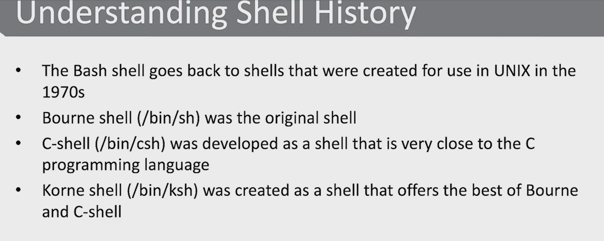
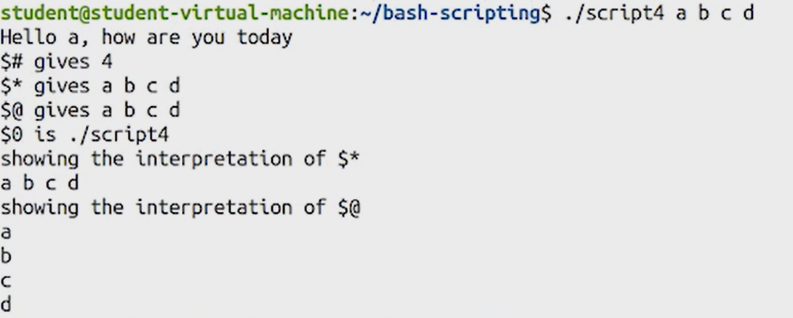
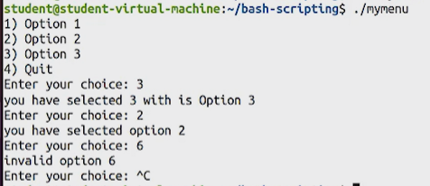

# Bash

- [Bash](#bash)
  - [History](#history)
  - [Recommended sources to help](#recommended-sources-to-help)
  - [Variables](#variables)
    - [Дефолтные переменные](#дефолтные-переменные)
  - [Bash options](#bash-options)
    - [set](#set)
    - [shopt](#shopt)
  - [Коды завершения](#коды-завершения)
  - [Производительность.](#производительность)
  - [Начало скрипта](#начало-скрипта)
  - [Кавычки](#кавычки)
  - [Типы данных](#типы-данных)
  - [Пользовательский ввод](#пользовательский-ввод)
  - [Ссылки на файлы с переменными и функциями](#ссылки-на-файлы-с-переменными-и-функциями)
  - [Аргументы скрипта](#аргументы-скрипта)
    - [Positional arguments](#positional-arguments)
    - [More complex arguments](#more-complex-arguments)
  - [Оператор shift](#оператор-shift)
  - [Command substitution](#command-substitution)
  - [Parameter substitution](#parameter-substitution)
  - [Here document](#here-document)
  - [Function](#function)
    - [Arguments](#arguments)
    - [Variable scope](#variable-scope)
  - [Simple script example](#simple-script-example)
  - [Pattern matching](#pattern-matching)
    - [почистить строку](#почистить-строку)
    - [сделать замену в переменной](#сделать-замену-в-переменной)
    - [Поменять регистр](#поменять-регистр)
    - [примеры скриптов](#примеры-скриптов)
  - [Примеры использования ext globing](#примеры-использования-ext-globing)
  - [Численные вычисления](#численные-вычисления)
    - [Операции с целыми числами](#операции-с-целыми-числами)
    - [Операции с дробными числами](#операции-с-дробными-числами)
      - [bc - утилита для дробных вычислений](#bc---утилита-для-дробных-вычислений)
    - [Полезные утилиты для вычислений](#полезные-утилиты-для-вычислений)
    - [Примеры скриптов](#примеры-скриптов-1)
  - [Ветвление](#ветвление)
    - [if](#if)
    - [case](#case)
  - [Циклы](#циклы)
    - [for](#for)
    - [while](#while)
    - [until (oposite while)](#until-oposite-while)
    - [break and contiunue](#break-and-contiunue)
  - [Menu](#menu)
  - [trap](#trap)
  - [Arrays](#arrays)


## History




Bash это Bourne again shell

## Recommended sources to help

- `man bash`
- [Text book for Beginner. Recomended by Sandar van Vagt](https://tldp.org/LDP/Bash-Beginners-Guide/html/)
- [Text book for Advanced. Recomended by Sandar van Vugt](https://tldp.org/LDP/abs/html/)

## Variables
When you create new variable it can be seen only in current bash. Many commands invoke another bash. In that case you can use `export`


we can create variable and at the same place export to all child bashes
```bash
export KEY=VALUE
```

> Переменные регистронезависимые

> Обычно переменные окружения пишутся с заглавных букв. Локальные переменные пишет кто как, автор курса пишет с большой буквы, но не все люди с этим согласны, аргумент, что происходит путанница.

чтобы обнулить значение переменной
```bash
variable=
```
удалить саму переменную
```bash
unset variable
```

Ссылка на переменную:
- `$variable`
- `${variable}` рекомендуемый способ
- `echo "${variable}"`в некоторых случаех предпочтительно использовать ссылку внутри двойных кавычек

### Дефолтные переменные

`$RANDOM` - случайное число

`$SECONDS` - число секунд, которое работает текущий shell

`$LINENO` - номер строки текущего скрипта

`$HISTCMD`- номер текущей команды в истории команд

`$GROUPS`- массиd с именами групп, в которые входит текущий пользователь

`$DIRSTACK`- история недавно посещаемых директорий

`$BASH_ENV` `$BASH_OPT` - 

## Bash options

посмотреть все опции bash
```
man bash
```


### set
Меняют поведение программ. Например `-x` меняеn работe команд, при старте команды будет выводиться в stdout сама команда и ее аргументы. Удобно для дебага скриптов.
```
set -x
ls
set +x
```


Варианты использования:
- поставить в текущей консоли для временного использования (удобно для дебага) `bash -x ./my_script`
- поставить в скрипты для пользователя или пользователей при старте
- включать для действия в конкретном скрипте через `#!/bin/bash -x`


### shopt

Некоторые опции ставятеся через команду `shopt` . Они также описаны в `man bash`

показать все опции `shopt`

пример включения мониторинга джобов при выходе
```bash
shopt -s checkjobs
sleep 3600 &
exit
```


## Коды завершения
каждая команда заканчивается каким-то кодом

посмотреть предыдущий код
```
echo $?
```
0 - успешно
1 - ошибка общего характера general error
Обычно все что не 0 это какая-то проблема.

скрипт можно завершить кодом
```
exit n где n это код
``` 

## Производительность.

- Для лучшей производительности лучше не использовать утилиты, подгружаемые с диска, например `sed` и `awk`. 
- По возможности использовать встроенными в баш командами. 
- Команда `help` выводит все встроенные команды в баш. 
- Команда `type` выводит тип команды. 
- Командой `time` можно проверить время исполнения конкретной команды. 
- Можно посмотреть от каких библиотек зависит команда, командой `ldd`. Детальнее смотри заметки по линуксу. 

## Начало скрипта

Для надежности стоит писать в самом начале скрипта
```bash
#!/bin/bash
``` 

или
```bash
#!/usr/bin/env bash
``` 

в этом случае если текущий shell не bash, например zsh, все равно будет исполняться bash

проверить текущий shell
```bash
echo $SHELL 
``` 

## Кавычки
`"` - двойные кавычки используются для указания того, что проблемы в подстроке относятся к одному аргументу. Все внедрения переменных через $ будут работать.

`'` - одинарные кавычки используются для остановки внедрения переменных и скриптов. 

## Типы данных
В баше нет типов данных, но есть массивы. 
Также есть ключевое слово `declare` , которое используюется для указания некоторых свойств переменных

Установка свойства read-only на переменную `ANSWER` со значением `yes`
```bash
declare -r ANSWER=yes
```

указание что переменная является индексированным или ассоциативным массивом
```bash
declare -a MYARRAY
```

печатает тип переменной 
```bash
declare -p VARIABLE
```

## Пользовательский ввод

самый простой способ
```bash
echo enter the value
read value
echo you have entered $value
```
если после `read` не указано переменной, ввод сохраняется в переменной `$REPLY`

удобный способ завершать скрипт с фразой `Press any key to continue`

```bash
echo Press Enter to continue
read
```

можно использовать для установки нескольких переменных
```bash
echo enter firstnane, lastname and city
read firstname lastname city
echo nice to meet you $firstname $lastname from $city
```

## Ссылки на файлы с переменными и функциями
Есть механизм подключения файлов в текущий bash это называется sourcing

два способа, после начала скрипта написать:
```bash
source path_to_file_with_variables
```

```bash
. path_to_file_with_variables
```

## Аргументы скрипта

### Positional arguments
Можно ссылать на аргументы скрипта через `$1` и до `$9` . Если аргументов больше тогда ссылки будут с использованием фигурных скобок `${10}`. 

Переменная `$0` содержит имя текущего скрипта. 

Переменная `$#` содержит количество аргументов

Также можно ссылаться сразу на все аргументы через `$@` и `$*`. Без кавычек эти способы равнозначны. С кавычками `$@` массив аргументов по которому можно итерироваться `$*` c кавычками помещает все аргументы в один аргумент. Рекомендуется использовать `$@` во всех случаях, если не нужно поместить все аргументы в массив.

```bash
#!/bin/bash
#
# ...

echo "Hello $1, how are you today"
echo " hello $2, how are you"
echo " hello $10, how are you"
echo " hello ${10}" 
echo " hello ${11}"
shift
echo hi $1
echo "\$0 is $0"
```


```bash
#!/bin/bash
echo "Hello $1, how are you today"
echo "\$# gives $#"
echo "\$* gives $*"
echo "\$@ gives $@"
echo "\$0 is $0"

# trying to show every single argument on a separated line
echo showing the interpretation of \$* 
for i in "$*"
do
	echo $i
done

echo showing the interpretation of \$@
for i in "$@"
do
	echo $i
done
```



### More complex arguments


```bash
#!/bin/bash
while getopts "hs:" arg; do
case $arg in
	h)
		echo "usage"
		;;
	s)
		strength=$OPTARG
		echo $strength
		;;
	esac
done
```


complex example

```bash

#!/bin/bash
#makeusr [-u uid] [-g gid] [-i info] [-h homedir] [-s shell] username
	function usage
	{
			echo ‘usage: makeusr [-u uid] [-g gid] [-i info] [-h homedir] ‘
			echo ‘[-s shell] username
			exit 1
	}

	function helpmessage
	{
			echo "makeusr is a script ... "
			echo "blablabla"
	}

	while getopts "u:g:i:h:s:" opt; do
			case $opt in
				u ) uid=$OPTARG ;;
				g ) gid=$OPTARG ;;
				i ) info=$OPTARG ;;
				h ) home=$OPTARG ;;
				s ) shell=$OPTARG ;;
				? ) helpmessage ;;
				* ) usage ;;
			esac
	shift $(($OPTIND -1))
	done

	if [ -z "$1" ]; then
			usage
	fi

	if [ -n "$2" ]; then
			usage
	fi

	if [ -z "$uid" ]; then
			uid=500
			while cut -d : -f3 /etc/passwd | grep -x $uid
			do
				uid=$((uid+1)) > /dev/null
			done
	fi

	if [ -z "$gid" ]; then
			gid=$(grep users /etc/group | cut -d: -f3)
	fi

	if [ -z "$info" ]; then
			echo Provide information about the user.
			read info
	fi

	if [ -z "$home" ]; then
			home=/home/$1
	fi

	if [ -z "$shell" ]; then
			shell=/bin/bash
	fi

	echo $1:x:$uid:$gid:$info:$home:$shell >> /etc/passwd
	echo $1:::::::: >> /etc/shadow
	mkdir -p $home
	chmod 660 $home
	chown $1:users $home
	passwd $1
```


## Оператор shift

Удаляет аргументы скрипта при использовании. 

Если не указывать ничего после `shift` сместит все аргументы влево, т.е первый аргумент будет удален, а второй займет его место и так далее. 

Если указать цифру после `shift` в этом случае произойдет смещение влево аргументов на величину цифры


```bash
#!/bin/bash
echo the script has $# arguments

echo print $1
shift 
echo print $1
shift 3
echo print $1
```


## Command substitution 

Можно использовать о скобки и тильду

```bash
today=$(date +%d-%m-%y)
mykernel=$(uname -r)
```
```bash
today=`date +%d-%m-%y`
mykernel=`uname -r`
```
для читаемости лучше использовать `$()`

```bash
#!/bin/bash
#simple demo backup script
#writes backup file to current directory and backs up everything provided as an argument

if [ -z $1]
then
    echo argument required
    exit 9
fi 

sudo tar -cvf $(date +%d-%m-%y).bak $@
```

## Parameter substitution

можно ставить дефолтное значение в случае отсутствия значения, либо вызывать выражение, которое определит значение

```bash
#!/bin/bash

echo press username or press enter to use default value
read username
echo ${username:-$(whoami)}
```

тут выполняется попытка чтения инпута в переменную username. Далее через `${}` осущесвляется ссылка на переменную, если она пустая, то вызывается command substitution whoami который возвращает имя текущего пользователя. При этом присвоение к usename не происходит, оно по-прежнему пустое.

Если `$1` не задан, то используется дефолтное значение и присваивается к `filename`
```bash
filename=${1:-$DEFAULT_FILENAME}
```

тут происходит присваивание в случае отсутствия
```bash
echo ${username:=$(whoami)}
filename=${1:=$DEFAULT_FILENAME}
```

```bash
#!/bin/bash
echo take one
echo ${var:-abc}
echo ${var}

echo take two
echo ${var:=abc}
echo ${var}
```


если переменная не задана пишем сообщение и выходим с кодом 1
```bash
echo ${myvar:?error_message}
```

## Here document

A here document is a special-purpose code block. It uses a form of I/O redirection to feed a command list to an interactive program or a command, such as ftp, cat, or the ex text editor.

```bash
COMMAND <<InputComesFromHERE
...
...
...
InputComesFromHERE
```

```bash
ssh $SERVER bash <<EOF
cd downloads/
read -e -p "Enter the path to the file: " FILEPATH
echo $FILEPATH
eval FILEPATH="$FILEPATH"

echo "Downloading $FILEPATH to $CLIENT"
EOF
```

## Function

Two option to write function

> spaces between braces are mot matter

```bash
function_name () {

}
```

```bash
function function {

}
```

### Arguments

> Function argument has local scope

```bash
#!/bin/bash
hello(){
    echo hello $1
}
hello bob
```

> Arguments for all script are unavailable for function

### Variable scope

> No matter where try are defined, variables always have a global scope - even if defined in a fuction

`local` keyword to define local variable

```bash
#!/bin/bash
var1=A

my_function () {
	local var2=B
	var3=C
	echo "inside function: var1: $var1, var2: $var2, var3: $var3"
}

echo "before runninng function: var1: $var1, var2: $var2, var3: $var3"

my_function

echo "after running function: var1: $var1, var2: $var2, var3: $var3"
```


## Simple script example
```bash
#!/bin/bash

if grep -i 'ubuntu' /etc/os-release > /dev/null
then
    PACKAGE_MANAGER=apt
fi

if grep -i 'red hat' /etc/os-release > /dev/null
then
    PACKAGE_MANAGER=yum
fi

if [ -z $1 ]
then
    echo enter package name to install
    read PACKAGE
else
    PACKAGE=$1    
fi

sudo $PACKAGE_MANAGER install $PACKAGE -y

```

## Pattern matching

Рекомендуется к использованию, а не `sed` т.к это нативный bash, ничего с диска не читается, sed - утилита на диске.

длинну аргумента. Количество символов.
```bash
${1#}
```

### почистить строку 

- `${var#pattern}` удаляет самый короткий результат поиска слева направо
- `${var##pattern}` удаляет самый длинный результат поиска слева направо 
- `${var%pattern}` удаляет самый короткий результат поиска справа налево
- `${var%%pattern}` удаляет самый длинный результат поиска справа налево

```bash
#!/bin/bash
#
# ...
# to test, use /usr/bin/blah

filename=${1##*/}
echo 'filename=${1##*/}'
echo "The name of the file is $filename"
directoryname=${1%/*}
echo 'directoryname=${1%/*}'
echo "the name of the directory is $directoryname"
```


```bash
#!/bin/bash
BLAH=rababarabarabarara
clear

echo BLAH=$BLAH
echo 'the result of ##*ba is' ${BLAH##*ba} 
echo 'the result of #*ba is' ${BLAH#*ba} 
echo 'the result of %%ba* is' ${BLAH%%ba*}
echo 'the result of %ba* is' ${BLAH%ba*}
```

 

### сделать замену в переменной

```bash
${var/pattern/replacement}
```
да очень похоже на `sed`

для глобальной замены, т.е много раз используем двойной слеш

```bash
${var//pattern/replacement}
```

делать замену, только если переменная начинается с паттерна
```bash
${var/#pattern/replacement}
```

делать замену, только если переменная заканчивается паттерном
```bash
${var/%pattern/replacement}
```

```bash
#!/bin/bash

VAR=donkey
echo $VAR

VAR=${VAR/donkey/horse}
echo $VAR
```

### Поменять регистр

- `${var^^}` переводит в верхний регистр
- `${var,,}` переводит в нижний регистр

```bash
#!/bin/bash

color=red
echo ${color^^}

color=BLUE
echo ${color,,}
```

### примеры скриптов

Заменить в текущей директории названия файлов с .txt  на название без расширения

```bash
#!/bin/bash

for i in *txt
do
    mv $i ${i%.*}
done    
```


## Примеры использования ext globing 

Итерируемся по файлам в текущей директории, пишем имя файла в переменную `i`. В случае если выполняется выражение, т.е файл не заканчивается на doc, txt, pdf выводится строка с именем файла, что это не документ, иначе выводится строка, что этот файл документ.
```bash
#!/bin/bash
shopt -s extglob
for i in *
do
	case $i in
	!(*.doc|*.txt|*.pdf))
		echo $i is not a document
		;;
	*)
		echo $i is a document
	;;
	esac
done
```

Итерируемся по файлам в текущей директории и выводим их список, но удаляем расширения определенные. 

```bash
#!/bin/bash
shopt -s extglob
for i in *
do
	echo ${i%%*(.doc|.txt|.pdf)}
done
```
чуть подправим, чтобы не показывал, а прямо переименовывал файлы

```bash
#!/bin/bash
shopt -s extglob
for i in *
do
	mv $i ${i%%*(.doc|.txt|.pdf)}
done
```

## Численные вычисления

### Операции с целыми числами

Несколько способов посчитать целочисленное выражение
- `let expression` встроенное в баш
- `expr expression` внешняя программа - редко используется. 
- `$(( expression ))` встроенное в баш. Рекомендуемый способ

Операторы: `+` , `++`, `-`, `%`, `*` , `/`

```bash
let a=1+2
echo $a
let a++
echo $a

echo $(( 1 * 3))
```

что-нибудь посложнее
```bash
echo $(( $(sudo fdisk -l | grep '/dev/sda:' | awk '{ pring $5 }') / 1024 ))
echo $(( $(sudo fdisk -l | grep '/dev/sda:' | awk '{ pring $5 }') / $(( 1024 * 1024 )) ))
```
### Операции с дробными числами

#### bc - утилита для дробных вычислений

К сожалению ее нету в gitbash
Обычно используется в pipes 

```bash
echo "12/5" | bc
```
для того чтобы в результате присутствовала дробная часть используется опция `-l`

```bash
echo "12/5" | bc -l
```

Поддерживает разные математические функции, например
```bash
echo "sqrt(1000)" | bc -l
```

### Полезные утилиты для вычислений

разложение на простые множители `factor`
```bash
factor 3444 
```
output: `3444: 2 2 3 7 41`

### Примеры скриптов

Заметим что `COUNTER` в выражении понимается как переменная и не требует ссылки через `$`
```bash
#!/bin/bash

COUNTER=$1
COUNTER=$(( COUNTER * 60 ))

while true
do
	echo $COUNTER seconds remaining in break
	COUNTER=$(( COUNTER - 1 ))
	sleep 1
done
```

## Ветвление


### if

внутри выражение обычно используются модификации команды `test`. О ней можно почитать в 
```
man test
```


вместе с тем что есть test как внешняя команда, есть test, который является внутренней командой. И получить помощь по ней можно как обычно по встроенным командам в баш `help test`


Вот тут например `z` проверка на нулевую длину аргумента. Далее выходим `exit` с кодом 6. Код 0 успешно код 1 неуспешно.

```bash
if [ -z $1 ]
then
 echo'there is empty argument'
 exit 6
fi
echo'hello'
```

Можно указать ветку else
```bash
if [ -z $1 ]
then
 echo'there is empty argument'
 exit 6
else
 echo'hello'
fi
```

Тут обратите внимание на конструкцию `elif` внутри if секции.

```bash
if [ $1 = yes ]
then
  echo ok
elif [ $1 = no ]
then
  echo not ok
else
  echo sorry
fi
```

можно писать в одну строчку
```bash
if [ -f /etc/hosts ]; then echo file exists; fi
```

внутри if может быть любая команда. Происходит анализ кода заверршения этой команды, если этот код 0, тогда выполняется тело if. Выше мы использовали команду test в форме [ ]. Можно писать просто test. А также что-то такое.

```bash
if grep student /etc/passwd
then
  echo some text
fi  
```

можно использовать операторы И `&` или ИЛИ `||` 
```bash
if [ -d $1 ] && [ -f $2 ]
then
  echo $1
fi
```

можно использовать эти операторы для того чтобы сокращать вид ифа. Т.к тест проверяет возвращаемые код, в случае если первая команда выполнится с кодом 0, будет выполнена вторая
```bash
[ -f /etc/hosts ] && echo file exists
```

Есть еще один способ писать выражения, через [[]]. При этом будет использоваться не test, а еще один механизм встроенный в баш. 
Примеры:
```bash
[[ $VAR1 = yes && $VAR2 = red ]]
[[ 1 < 2 ]]
[[ -e $b ]]

[[ $var = img* && ($var = *.png || $var = *.jpg) ]] && echo $var starts with img and ends wirh .jpg or .png
```
### case

Если ответ на вопрос yes или oui пишем nice, если ответ no пишем no, иначе пишем okay.
```bash
#!/bin/bash

echo are you good?
reed GOOD
GOOD=$(echo $GOOD | tr [:upper:] [:lower:])

case $GOOD in
yes|oui)
  echo nice
  ;;
no)
  echo not nice
  ;;
*)
  echo okay
  ;;
esac
```


## Циклы

### for

Итерируемся по массиву, либо по списку файлов.

однострочный цикл бежит по всем аргументам скрипта
```bash
for i in $@; do echo $i; done
```

сделаем хитрый массив range и проитерируемся по нему
```bash
for i in {115..127}; do echo $i; done
```

сделаем на основе цикла пинг
```bash
for i in {115..127}; do ping -c 1 192.168.0.$i; done
```

```bash
for i in anna liza andrey
do
  grep $i /etc/passwd > /dev/null 2>&1 || echo $i user does not exist
done  
```

```bash
#!/bin/bash

if [ -z $1]
then
  echo you have to provide at least one argument
  exit 3
fi

MEMFREE=$(free -m | grep Mem | awk '{ print $4 }')

if [ $MEMFREE -lt 256 ]
then
  echo insufficient memory available
  exit 4
fi

sudo apt install -y "$@"

for s in "$@"
do
  sudo systemctl enable --now $s
done  
```


### while

```bash
while true; do true; done
```

```bash
while true 
do 
  echo true 
done
```

```bash
#!/bin/bash

COUNTER=$1
COUNTER=$(( COUNTER * 60))

minusone(){
  COUNTER=$(( COUNTER - 1))
  sleep 1
}

while [ $COUNTER -gt 0 ]
do
  echo you still have $COUNTER seconds left
  minusone
done  

[ $COUNTER = 0] && echo time is up && minusone
[ $COUNTER = "-1" ] && echo you now are one second late && minusone

while true
do
  echo you now are ${COUNTER#-} second late
  minusone
done  
```

### until (oposite while)

```bash
until who | grep $1; do echo $1 in not logged in; done
```

```bash
until who | grep $1
do 
  echo $1 in not logged in
 done
```

### break and contiunue

```bash
#!/bin/bash

# backup script that stops if insufficient disk space is available

if [ -z $1 ]
then
	echo enter the name of a directory to back up
	read dir
else
	dir=$1
fi

[ -d ${dir}.backup ] || mkdir ${dir}.backup

for file in $dir/*
do
	used=$( df $dir | tail -1 | awk '{ print $5 }' | sed 's/%//' )
	if [ $used -gt 98 ]
	then
		echo stopping: low disk space
		break
	fi

	cp $file ${dir}.backup
done
```

```bash
#!/bin/bash

# convert file names to lower case if required

FILES=$(ls)

for file in $FILES
do
	if [[ "$file" != *[[:upper:]]* ]]; then
		echo "$file" doesn\'t contain uppercase
		continue
	fi

	OLD="$file"
	NEW=$(echo $file | tr '[:upper:]' '[:lower:]')

	mv "$OLD" "$NEW"
	echo "$OLD has been renamed to $NEW"
done
```

## Menu

```bash
#!/bin/bash

PS3='Enter your choice: '
options=("Option 1" "Option 2" "Option 3" "Quit")

select opt in "${options[@]}"
do
	case $opt in
		"Option 1")
			echo "you have selected option 1"
			;;
		"Option 2")
			echo "you have selected option 2"
			;;
		"Option 3")
			echo "you have selected $REPLY with is $opt"
			;;
		"Quit")
			break
			;;
		*) echo "invalid option $REPLY";;
	esac
```  



- Control C to interrupt.

## trap

Use to catch information about signals (exeprt -9).

For help `man 7 signal` and `trap -l`

```bash
#!/bin/bash
trap "echo ignoring signal" SIGINT SIGTERM
echo pid is $$

while :
do
	sleep 60
done
```
`EXIT` for normal exit. 
```bash
#!/bin/bash
tempfile=/tmp/tmpdata
touch $tempfile
ls -l $tempfile
trap "rm -f $tempfile" EXIT
```

## Arrays

Let's compare. We want to copy list of files to directory. With simple string it will not work with names with spaces.

```bash
files=$(ls *.doc); cp $files ~/backup
```
but with array it will work
```bash
files=(*.txt); cp "${files[@]}" ~/backup
```
