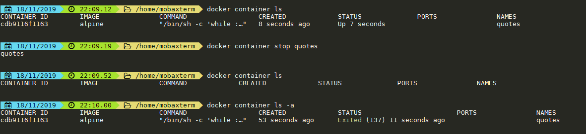

# Содержание

- [Содержание](#содержание)
- [Полезные ссылки](#полезные-ссылки)
- [Команды работы с контейнерами](#команды-работы-с-контейнерами)
  - [Знакомство с запуском контейнера из образа](#знакомство-с-запуском-контейнера-из-образа)
  - [Запуск, остановка, рестарт, удаление контейнеров](#запуск-остановка-рестарт-удаление-контейнеров)
    - [Создать и запустить контейнер из образа](#создать-и-запустить-контейнер-из-образа)
    - [Запустить контейнер и после остановки удалить его](#запустить-контейнер-и-после-остановки-удалить-его)
    - [Запуск дополнительный процесс внутри контейнера](#запуск-дополнительный-процесс-внутри-контейнера)
    - [Запустить контейнер ранее созданный](#запустить-контейнер-ранее-созданный)
    - [Запустить контейнер в интерактивном режиме:](#запустить-контейнер-в-интерактивном-режиме)
    - [Перестартовать контейнеры](#перестартовать-контейнеры)
    - [Удалить все контейнеры. ](#удалить-все-контейнеры)
    - [Остановить контейнер](#остановить-контейнер)
    - [Остановить все контейнеры](#остановить-все-контейнеры)
  - [Состояние контейнеров](#состояние-контейнеров)
    - [Статусы состояния контейнера](#статусы-состояния-контейнера)
    - [Посмотреть список контейнеров](#посмотреть-список-контейнеров)
    - [Показать логи контейнера](#показать-логи-контейнера)
    - [Получить инфу в JSON о контейнере](#получить-инфу-в-json-о-контейнере)
- [Образы](#образы)
  - [Команды работы с образами](#команды-работы-с-образами)
    - [Посмотреть список образов](#посмотреть-список-образов)
    - [Удалить образ](#удалить-образ)
    - [Экспорт образов из репозитория](#экспорт-образов-из-репозитория)
  - [Docker file](#docker-file)
    - [Простой докер файл:](#простой-докер-файл)
    - [Собрать образ из docker file (image):](#собрать-образ-из-docker-file-image)
- [Networking](#networking)
- [Storage](#storage)
- [Безопасность](#безопасность)
- [Docker compose](#docker-compose)
  - [Основные команды:](#основные-команды)


# Полезные ссылки
- [Справка по командам консоли докер:](https://www.google.com/url?q=https://docs.docker.com/engine/reference/commandline/docker/&sa=D&source=editors&ust=1674933852288248&usg=AOvVaw35oGxNduRoNxSp2fLfPmTk)
- [Полезная статья про отличия RUN, CMD, ENTRYPOINT](https://www.google.com/url?q=http://goinbigdata.com/docker-run-vs-cmd-vs-entrypoint/&sa=D&source=editors&ust=1674933852288797&usg=AOvVaw2tyKbsz1FJDFA9b7v5ieyJ)
- [Статья на русском для старта](https://www.google.com/url?q=https://habr.com/ru/company/billing/blog/350138/&sa=D&source=editors&ust=1674933852289195&usg=AOvVaw06sAyR8yV9JULGV77o4e2m)

# Команды работы с контейнерами

## Знакомство с запуском контейнера из образа

- Установим образ nginx и запустим его в `detached` режиме `-d` или` --detach`. Это значит не привязанным к терминалу.

```shell
docker run -d --name web nginx:latest
```


- Также для проверки
```
docker container run alpine echo "Hello World"
```


## Запуск, остановка, рестарт, удаление контейнеров

### Создать и запустить контейнер из образа
```
docker run image_name
```


Когда запускается контейнер и даже останавливается без опции `--rm`, он остается в списке контейнеров, но в остановленном состоянии.

### Запустить контейнер и после остановки удалить его
```
 docker run --rm image_name
```


### Запуск дополнительный процесс внутри контейнера

Можно запустить команду внутри контейнера. Т.е запустить дополнительный процесс внутри контейнера. Также на этом примере видно исоляцию процессов. В каждом контейнере свой namespace PID

```
docker run -d --name name_of_contaner main_command -c "additional command"
```

```
docker run -d --name quotes alpine /bin/sh -c "while :; do wget -qO- https://talaikis.com/api/quotes/random; printf '\\n'; sleep 5; done"
```


### Запустить контейнер ранее созданный
```
$ docker container start container_name
```

Принимает название контейнера. В отличие от `docker run`, который принимает имя image

### Запустить контейнер в интерактивном режиме:
```
docker run -it image_name command
```


После этого можно нажать комбинация `ctrl p ctrl q` и выйти из интерактивного режима, при этом контейнер останется работать.


### Перестартовать контейнеры

```
docker restart container_name
```


### Удалить все контейнеры. 

Нужно, т.к остановленный контейнер остается в памяти. И, например, для удаления образа, нужно удалить все остановленные контейнеры
```
docker rm $(docker ps -a -q)
```


### Остановить контейнер
```
docker container stop container_name
```


- При этом докер посылает `kill` процессу. Если процесс не реагирует, то ждет 10 секунд и посылает `kill -9`
- Пример скрипта, который ищет контейнер с именем quates, вытаскивает его хеш и останавливает
```
export CONTAINER_ID = $(docker container ls | grep quotes | awk '{print $1}')
docker container stop $CONTAINER_ID
```

### Остановить все контейнеры
```
docker stop $(docker ps -a -q)
```


## Состояние контейнеров

### Статусы состояния контейнера 


### Посмотреть список контейнеров
```
docker ps
```


- Container ID - The unique ID of the contaner. It is a SHA-256
- Image - The name of the container image from which this container is instantiated
- Comand - The command that is used to run he main process in the container
- Created - The date and time when the container was created
- Status - The status of the container (created, restarting, running, removing, paused, exited or dead)
- Ports - The list of contaner ports that have been mapped to the host
- Name - The name assigned to this container (multiple names are possible)


Или иначе
```
docker container ls
```


Показать не только запущенные контейнеры, а все (all)

```
docker ps -a
```
или
```
$ docker container ls -a  
```


Показать только id контейнеров (полезно, когда нужно например удалить все)
```
docker container ls -q
```


### Показать логи контейнера

```
docker logs container_name
```


Также можно запустить обновляемый вывод `--follow` или `-f`
```
docker logs -f container_name
```


### Получить инфу в JSON о контейнере
```
$ docker container inspect quotes
```


# Образы

## Команды работы с образами

### Посмотреть список образов
```
docker images
```


### Удалить образ
```
docker image rm hello-world:latest
```


Можно и покороче
```
docker rmi ubuntu --force
```


### Экспорт образов из репозитория 

Выгрузить из репозитория образ и сохранить его в файл
```
docker save -o ./java-hello.tar java-hello
```


## Docker file

### Простой докер файл:
```docker
FROM openjdk:8-jre-alpine
CMD java -version
``` 

### Собрать образ из docker file (image):
```
docker build -f hello_java_world_docker -t java-hello .
```
- `-f`  Имя докер файла            
- `-t`  имя образа
- `.` директория где искать докер файл


# Networking


- При установке docker на хостовой системе создается виртуальный bridge docker0. К нему подключаются виртуальные сетевые интерфейс veth0, veth1, ….  И тд.
- Вся сеть докера это `172.17.0.0/16`
- Запустим 2 контейнера с `nginx`
```
docker run -d nginx
```

- Запустим контейнер с nmap
```
docker run nmap
```


- Видим что в сети сейчас 4 ip адреса.
- На хостовой машине запустим 
```
ip a
```


- Видим bridge docker0 и 2 виртуальных интерфейса veth
- Если зайдем в интерактивном режиме на контейнер и попробуем узнать его ip.
```
docker exec -it name_of_container /bin/bash
```


- Обычные команды не работает. Но есть хак
```
cd /proc/net
cat fib_trie
```


- Тут видим что ip 172.17.0.3
- То же самое увидим через `inspect`
```bash
docker inspect name_of_container | grep 172
```


- Ели изнутри контейнера мы попробуем обратиться в другому контейнеру по ip это получится
```bash
cat /proc/net/fib_trie | grep 172
curl 172.17.0.2
```


- Выше в примере с nmap видели 4 хоста в сети. Первый это gataway `172.17.0.1`. Вторые 2 это 2 nginx. `172.17.0.2` `172.17.0.3`. И четвертый это сам контейнер с nmap

# Storage

Стартовать контейнер с двухсторонним мапингом на директорию на хостовой машине
```
docker run -it --rm -v /home/student:/data ubuntu /bin/bash
```


- `-it`  интерактивный режим
- `--rm` удалить контейнер сразу после его остановки
- `-v` мапинг директориев


# Безопасность

С хостовой машины можно видеть все запущенные контейнеры.

- Запустим на хосте 
```bash
sudo ps -fax
```
- увидим информацию про все запущенные контейнеры и их рабочие директории

- Рекомендуется использовать SELinux

# Docker compose

## Основные команды:

Запустить в detached режиме
```
docker-compose up -d
```

Остановить
```
docker-compose stop
```

Удалить контейенры и volumes
```
docker-compose down --volumes
```