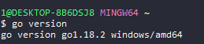
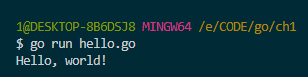
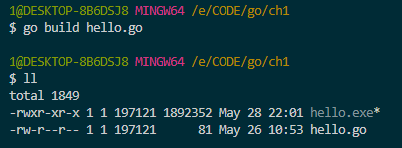
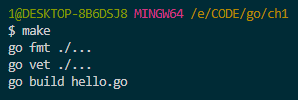
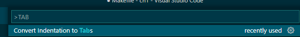
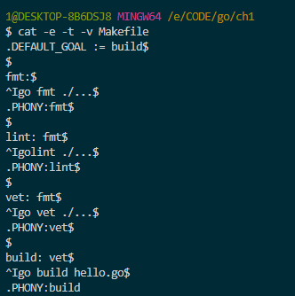
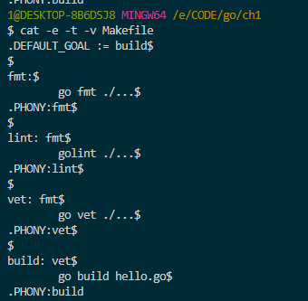

- [Basics](#basics)
  - [Installation](#installation)
    - [Check go installation](#check-go-installation)
    - [Setup environment variable](#setup-environment-variable)
  - [First program](#first-program)
  - [Launch without a binary file](#launch-without-a-binary-file)
  - [Build a binary file](#build-a-binary-file)
  - [Install additional tools](#install-additional-tools)
  - [Example with linter usage](#example-with-linter-usage)
  - [Troubleshooting](#troubleshooting)
    - [Tabs and spaces](#tabs-and-spaces)
  - [Variables](#variables)
  - [Data types](#data-types)
    - [integer literals](#integer-literals)
  - [Conditional](#conditional)
  - [Cycles](#cycles)
    - [For](#for)
    - [Range](#range)
  - [Slices](#slices)
  - [Funсtions](#funсtions)
  - [Structures](#structures)
    - [Anonymous struct](#anonymous-struct)
  - [Method with structure](#method-with-structure)
  - [Visibility](#visibility)
  - [Pointers](#pointers)
  - [go routines](#go-routines)
  - [channels](#channels)
    - [buffer channel](#buffer-channel)
  - [Interfaces](#interfaces)
  - [Error handling](#error-handling)
  - [defer](#defer)
  - [Modules](#modules)
  - [Testing](#testing)
    - [Naming](#naming)
    - [Example](#example)
    - [How to run](#how-to-run)
    - [Table tests](#table-tests)
    - [Coverage](#coverage)
- [Network](#network)
  - [http server](#http-server)
- [JSON](#json)
- [SQL](#sql)

# Basics

## Installation

### Check go installation

```
go version
```



### Setup environment variable

for linux
```bash
export GOPATH=$HOME/go
export PATH=$PATH:$GOPATH/bin
```

For windows
```bat
setx GOPATH %USERPROFILE%\go
setx path "%path%;%GOPATH%\bin"
```

## First program

```go
package main

import"fmt"

func main(){

 fmt.Println("Hello, world!")

}
```
- Save file as `hello.go`

## Launch without a binary file

- Launch 

    ```bash
    go run hello.go
    ```
    
- While launching binary file was created in temporary directory and deleted after program was finished


## Build a binary file

```bash
go build -o hello_world hello.go
```



## Install additional tools

You can install additional tools via `go install`

For example install aggregate linter (include many popular linters)

```
go install github.com/golangci/golangci-lint/cmd/golangci-lint@v1.46.2
```

## Example with linter usage

- create module for an application 

```
go mod init ch1
```

- create makefile for build. It will apply linter and create binary file

```makefile
.DEFAULT_GOAL:= build

fmt:
        go fmt ./...
.PHONY:fmt

lint:fmt
        golint ./...
.PHONY:lint

vet:fmt
        go vet ./...
.PHONY:vet

build:vet
        go build hello.go
.PHONY:build
```

After `:` defined previous `target`, link to previous task which has to been completed before current task

- launch build

  ```
  make
  ```

    

if you don't have `make` on Windows, you can install `choko` manager and then install `make`

```powershell
Set-ExecutionPolicy Bypass -Scope Process -Force; [System.Net.ServicePointManager]::SecurityProtocol = [System.Net.ServicePointManager]::SecurityProtocol -bor 3072; iex ((New-Object System.Net.WebClient).DownloadString('[https://community.chocolatey.org/install.ps1](https://www.google.com/url?q=https://community.chocolatey.org/install.ps1&sa=D&source=editors&ust=1675178682544290&usg=AOvVaw1Vvl_ZL3FJM_aIM1uyGrzj)'))

choco install make
```

## Troubleshooting

### Tabs and spaces 

In the process writing VS code change tab to spaces. Then I find an option



You can check indentation with halp of  `cat`

```
cat -e -t -v Makefile
```

+

Before it was like this



## Variables

keyword var then name of variable then type of variable

```go
var age int
```

```go
package main

import "fmt"

func main() {

	var name string = "John"
	fmt.Println(name)
}
```

## Data types

### integer literals

- `0b` for binary (base 2), 
- `0o` for octal (base 8), (without o is also octal but bad practice)
- `0x` for hexadecimal (base 16). 
- You can use either upper- or lowercase letters for the prefix
- In integral literal you can write underscores `_` (they can’t be at the beginning or end of numbers, and you can’t have them next to each other)
  
`int`, `int8`, `int16`, `int32`, `int64`

`float32`, `float64` - floating-point 

`bool` - boolean data type


## Conditional 

```go
if condition {
} else {
}
```

comparison operators: ==, !=, <, >, <=, >=.

```go
package main

import "fmt"

func main() {

	const age = 20

	if age >= 18 {
		fmt.Println("Этот человек совершеннолетний")
	} else {
		fmt.Println("Этот человек несовершеннолетний")
	}

}
```

## Cycles

### For

```go
package main

import "fmt"

func main() {
    for i := 0; i < 5; i++ {
        fmt.Println(i)
    }
}
```

### Range

```go
package main

import "fmt"

func main() {
    names := []string{"Ivan", "Petr", "Johan"}
    
    for index, name := range names {
        fmt.Println(index, name)
    }
}
```

```go
package main

import "fmt"

func main() {

	numbers := []int{0, 2, 3, 4}
	for index, value := range numbers {
		fmt.Println(index, value)
	}
}
```

ignoring index
```go
for _, value := range slice {
    fmt.Println(value) 
}
```

ignoring value

```go
for index, _ := range slice {
    fmt.Println(index)
}

```

## Slices

```go
package main

import "fmt"

func main() {
 
    numbers := []int{1, 2, 3, 4, 5}   
    numbers = append(numbers, 6)
    subset := numbers[2:4]
    fmt.Println("numbers:", numbers)
    fmt.Println("subset:", subset)
}
```

```go
package main

import "fmt"

func main() {

	names := []string{"Ivan", "Petr", "Johan"}
	fmt.Println(names) // [Ivan Petr Johan]
	afterAppend := append(names, "Dima")
	fmt.Println(names)       // [Ivan Petr Johan]
	fmt.Println(afterAppend) // [Ivan Petr Johan Dima]
}
```

## Funсtions

```go
func add(x int, y int) int {
    return x + y
}
```

```go
package main

import "fmt"

func main() {

	fmt.Println(isEven(0))
	fmt.Println(isEven(2))
	fmt.Println(isEven(145))
	fmt.Println(isEven(3))
	fmt.Println(isEven(10))
}

func isEven(number int) bool {
	return number%2 == 0
}
```

## Structures

```go
package main

import "fmt"

type Person struct {
	name string
	age  int
}

func main() {

	var first Person
	first.name = "John"
	first.age = 30

	var second Person = Person{"Mary", 28}
	var third Person = Person{name: "Jim", age: 3}

	var family []Person = []Person{first, second, third}

	fmt.Println(family)
}
```

### Anonymous struct

```go
	my := struct {
		name       string
		age        int
		occupation string
	}{"Dima", 12, "programmer"}
    
	fmt.Println("occupation", my.occupation)
```


## Method with structure

method is outside of structure. The first part after func is reciever. So called that connected to structure. 

```go
package main

import "fmt"

func main() {

	var field Rectangle
	field.height = 10
	field.width = 20
	fmt.Println(field.perimeter())
}

type Rectangle struct {
	width  int
	height int
}

func (rectangle Rectangle) perimeter() int {
	return rectangle.height + rectangle.width
}
```

## Visibility

Visibility rules:

- Capitalization: If the name of a method, function, variable, or structure begins with a capital letter, then the identifier is exportable, meaning it can be accessed from other packages. This is similar to public in other programming languages.
- Lowercase Letter: If the name begins with a lowercase letter, then this identifier is non-exportable and can only be accessed within its package.

```go
package mypackage

type Car struct { // Exportable structure
    Make  string // public field
    model string // package private field
}

func (c Car) Describe() string { // public method
    return fmt.Sprintf("%s %s", c.Make, c.model)
}

func secretFunction() { // private method
    fmt.Println("This is a secret")
}
```

## Pointers

```go
var ptr *int
```

```go
var x int = 10
ptr := &x
fmt.Println(*ptr) 
```

```go
package main

import "fmt"

func main() {

	var variable int = 10
	ptr := &variable

	*ptr = 20

	fmt.Println(variable) // 20

}
```

```go
	var source []string = []string{"ivan", "dima"}
	var p *[]string = &source

	*p = append(source, "vasya")
	p = &append(source, "vasya") // wrong. does not compoile
	

	fmt.Println(*p)
```

```go
package main

import "fmt"

func increment(x *int) {
    *x += 1
}

func main() {
    var a int = 5
    increment(&a)
    fmt.Println(a) // 6
}
```

```go
package main

import "fmt"

func newInt() *int {
    var dummy int = 10
    return &dummy
}

func main() {
    numPtr := newInt()
    fmt.Println(*numPtr) // Выведет 10
}
```

if we will change to `fmt.Println(numPtr)` then we just print an address to memory as hex digit. `0xc000014088`

## go routines

it is lightweight threads. 

```go
package main

import (
    "fmt"
    "time"
)

func say(s string) {
    for i := 0; i < 5; i++ {
        time.Sleep(100 * time.Millisecond)
        fmt.Println(s)
    }
}

func main() {
    go say("world")
    say("hello")
}
```

## channels

a way to exchange data between go routines without races. It can be described as a stream of data. 

```go
package main

import "fmt"

func sum(s []int, c chan int) {
    sum := 0
    for _, v := range s {
        sum += v
    }
    c <- sum // put int to the channel
}

func main() {
    s := []int{7, 2, 8, -9, 4, 0}

    c := make(chan int)
    go sum(s[:len(s)/2], c)
    go sum(s[len(s)/2:], c)
    x, y := <-c, <-c // blocking operation before results are ready

    fmt.Println(x, y, x+y)
}
```

### buffer channel

```go
resultChan := make(chan int, 2)
```

A buffered pipe has an internal buffer that allows it to store a certain number of elements without having to read them immediately. When you create a channel using `make(chan Type, size)`, you specify the maximum number of elements that can be stored in the channel buffe

Sending to a buffered channel:
- If a buffered channel has free buffer space, sending to the channel occurs without blocking—the sender does not wait for the receiver to start reading.
- If the channel's buffer is full, the sender blocks and waits until the buffer becomes free (when another goroutine reads from the channel).

Receiving from a buffered channel:
- If there is data in the channel, the reception occurs without blocking  the recipient immediately receives the data.
- If the channel is empty, the receiver blocks and waits until data is sent to the channel.


```go
package main

import (
    "fmt"
)

func calculateSum(values []int, resultChan chan int) {
    sum := 0
    for _, value := range values {
        sum += value
    }
    resultChan <- sum
}

func main() {
    numbers := []int{1, 2, 3, 4, 5, 6, 7, 8, 9, 10}
    resultChan := make(chan int, 2)

    mid := len(numbers) / 2
    go calculateSum(numbers[:mid], resultChan)
    go calculateSum(numbers[mid:], resultChan)

    sum1, sum2 := <-resultChan, <-resultChan

    fmt.Println("Total Sum:", sum1 + sum2)
}
```

## Interfaces

```go
type Describer interface {
    Describe() string
}
```

both of the next structures implemented interface 

```go
func (p Person) Describe() string {
    return fmt.Sprintf("%s is %d years old", p.Name, p.Age)
}

func (c Car) Describe() string {
    return fmt.Sprintf("%s %s, made in %d", c.Make, c.Model, c.Year)
}
```

```go
func printDescription(d Describer) {
    fmt.Println(d.Describe())
}
```

## Error handling


```go
package main

import (
	"fmt"
	"errors"
)

func divide(a, b float64) (float64, error) {
	if b == 0 {
		return 0, errors.New("division by zero")
	}
	return a / b, nil
}

func main() {
	result, err := divide(10.0, 0)
	if err != nil {
		fmt.Println("Error:", err)
	} else {
		fmt.Println("Result:", result)
	}
}
```

```go
package main

import (
	"fmt"
	"io"
	"os"
)

func main() {

	result, err := readFile("/home/dmitrii/.bashrc")
	if err != nil {
		fmt.Println(err.Error())
	} else {
		fmt.Println(result)
	}
}

func readFile(path string) (string, error) {

	file, error := os.Open(path)

	if error != nil {
		return "", error
	}
	defer file.Close()

	result, error := io.ReadAll(file)
	if error != nil {
		return "", error
	}

	return string(result), nil
}

```

## defer 

for closing resources. 

```go
func example() {
    fmt.Println("Начало функции")
    defer fmt.Println("Это выполнится в конце")
    fmt.Println("Это выполнится до defer")
}
```

```go
package main

import "fmt"

func main() {
    fmt.Println("Начало функции")

    defer fmt.Println("Первый defer")
    defer fmt.Println("Второй defer")
    defer fmt.Println("Третий defer")

    fmt.Println("Конец функции")
}

```

```
Начало функции
Конец функции
Третий defer
Второй defer
Первый defer
```

## Modules

to create a module

```sh
go mod init <module-name>
```

an example file `go.mod`

```go
module test

go 1.16
```


## Testing

### Naming

if file `math.go` then test should be in `math_test.go`

### Example

```go
// math.go
package main

func Add(a, b int) int {
    return a + b
}
```
```go
// math_test.go
package main

import "testing"

func TestAdd(t *testing.T) {
    result := Add(2, 3)
    expected := 5
    if result != expected {
        t.Errorf("Add(2, 3) = %d; want %d", result, expected)
    }
}

```

```go
package main

import "errors"

func Divide(a, b float64) (float64, error) {
	if b == 0 {
		return 0, errors.New("division by zero")
	}
	return a / b, nil
}
```


```go
package main

import "testing"

func TestDivideByPositiveNumber(t *testing.T) {
	var expected float64 = 3

	result, error := Divide(6, 2)

	if result != expected {
		t.Errorf("Divide(6, 2) = %f; expected %f", result, expected)
	}
	if error != nil {
		t.Error("error should be nil")
	}
}

func TestDivideByZero(t *testing.T) {

	_, error := Divide(6, 0)

	if error == nil {
		t.Error("Divide(6, 0) should return error")
	}
}

```

### How to run

```sh
go test
```

with verbose

```sh
go test -v
```

```log
dmitrii@dmitrii-ThinkPad-T15-Gen-2i:~/CODE/go/test$ go test -v
=== RUN   TestDivideByPositiveNumber
--- PASS: TestDivideByPositiveNumber (0.00s)
=== RUN   TestDivideByZero
--- PASS: TestDivideByZero (0.00s)
PASS
ok  	test	0.001s
```

### Table tests

```go
package main

import "testing"

func TestDivide(t *testing.T) {
    tests := []struct {
        a, b     float64
        expected float64
        err      bool
    }{
        {6, 2, 3, false},
        {10, 5, 2, false},
        {8, 0, 0, true},
        {0, 2, 0, false},
    }

    for _, tt := range tests {
        result, err := Divide(tt.a, tt.b)
        if (err != nil) != tt.err {
            t.Errorf("Divide(%f, %f) expected error: %v, got: %v", tt.a, tt.b, tt.err, err)
        }
        if result != tt.expected {
            t.Errorf("Divide(%f, %f) = %f; expected %f", tt.a, tt.b, result, tt.expected)
        }
    }
}
```

### Coverage

```sh
go test -cover
```

to create a html report

```go
go test -coverprofile=coverage.out
go tool cover -html=coverage.out
```

# Network

## http server

```go
package main

import (
	"fmt"
	"net/http"
)

func helloHandler(w http.ResponseWriter, r *http.Request) {
	fmt.Fprintf(w, "Hello, World!")
}

func main() {
	http.HandleFunc("/hello", helloHandler)
	fmt.Println("Starting server at port 8080")
	http.ListenAndServe(":8080", nil)
}
```

a bit more

```go
package main

import (
	"fmt"
	"net/http"
)

func helloHandler(w http.ResponseWriter, r *http.Request) {
	fmt.Fprintf(w, "Hello, World!")
}

func goodbyeHandler(w http.ResponseWriter, r *http.Request) {
	fmt.Fprintf(w, "Goodbye, World!")
}

func greetHandler(w http.ResponseWriter, r *http.Request) {
	name := r.FormValue("name")
	if name == "" {
		name = "Guest"
	}
	fmt.Fprintf(w, "Hello, %s", name)
}

func main() {
	http.HandleFunc("/hello", helloHandler)
	http.HandleFunc("/goodbye", goodbyeHandler)
	http.HandleFunc("/greet", greetHandler)

	fmt.Println("Starting server at port 8080")
	http.ListenAndServe(":8080", nil)
}
```

# JSON

```go
package main

import (
	"encoding/json"
	"fmt"
	"log"
)

type User struct {
	ID    int    `json:"id"`
	Name  string `json:"name"`
	Email string `json:"email"`
}

func main() {
	// Пример данных
	user := User{ID: 1, Name: "John Doe", Email: "john@example.com"}

	// Шаг 2: Сериализация (Marshalling)
	jsonData, err := json.Marshal(user)
	if err != nil {
		log.Fatal(err)
	}
	fmt.Println("Serialized JSON:", string(jsonData))

	// Пример JSON строки
	jsonString := `{"id":2,"name":"Jane Doe","email":"jane@example.com"}`

	// Шаг 3: Десериализация (Unmarshalling)
	var newUser User
	err = json.Unmarshal([]byte(jsonString), &newUser)
	if err != nil {
		log.Fatal(err)
	}
	fmt.Println("Deserialized User struct:", newUser)
}
```

```go
package main

import (
	"encoding/json"
	"fmt"
	"log"
)

type Product struct {
	Id      int     `json:"id"`
	Name    string  `json:"name"`
	Price   float64 `json:"price"`
	InStock bool    `json:"in_stock"`
}

func main() {

	var product Product = Product{Id: 12, Name: "Alex", Price: 65.65, InStock: false}
	jsonData, error := json.Marshal(product)
	if error != nil {
		log.Fatal(error)
		return
	}

	productInString := string(jsonData)
	fmt.Println("JSON: ", productInString)

	var productSecond Product
	error = json.Unmarshal([]byte(productInString), &productSecond)
	if error != nil {
		log.Fatal(error)
		return
	}
	fmt.Println("Deserialized Product struct", productSecond)
}
```

# SQL

install the driver to db

```sh
go get github.com/mattn/go-sqlite3
```

```go
package main

import (
    "database/sql"
    "fmt"
    _ "github.com/mattn/go-sqlite3"
    "log"
)

func main() {
    
    db, err := sql.Open("sqlite3", "./test.db")
    if err != nil {
        log.Fatal(err)
    }
    defer db.Close()

    sqlStmt := `
    CREATE TABLE IF NOT EXISTS product (
        id INTEGER NOT NULL PRIMARY KEY,
        name TEXT,
        price REAL,
        in_stock BOOLEAN
    );
    `
    _, err = db.Exec(sqlStmt)
    if err != nil {
        log.Fatalf("%q: %s\n", err, sqlStmt)
    }

    _, err = db.Exec(`INSERT INTO product (name, price, in_stock) VALUES (?, ?, ?)`, "Laptop", 999.99, true)
    if err != nil {
        log.Fatal(err)
    }

    rows, err := db.Query("SELECT id, name, price, in_stock FROM product")
    if err != nil {
        log.Fatal(err)
    }
    defer rows.Close()

    for rows.Next() {
        var id int
        var name string
        var price float64
        var in_stock bool
        err = rows.Scan(&id, &name, &price, &in_stock)
        if err != nil {
            log.Fatal(err)
        }
        fmt.Printf("ID: %d, Name: %s, Price: %.2f, InStock: %t\n", id, name, price, in_stock)
    }
    err = rows.Err()
    if err != nil {
        log.Fatal(err)
    }
}
```