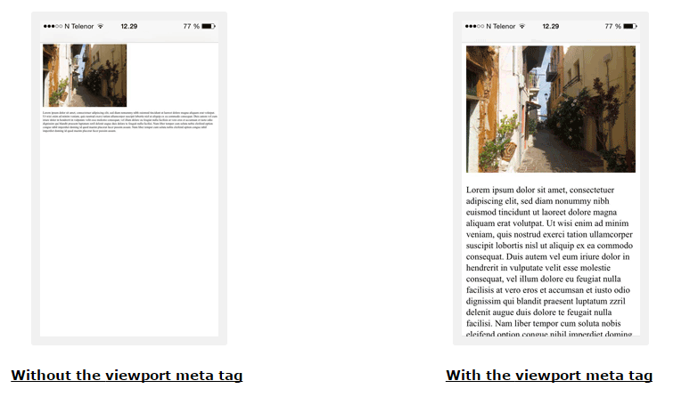
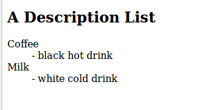
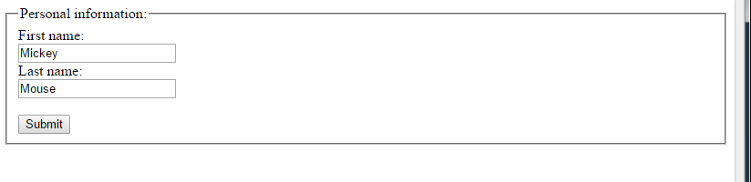
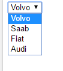
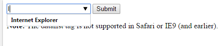

# Table of contents

- [Table of contents](#table-of-contents)
- [Simple document](#simple-document)
- [Quike facts](#quike-facts)
- [Tags inside head](#tags-inside-head)
  - [Title](#title)
  - [Encoding](#encoding)
  - [Description](#description)
  - [Words for search engines](#words-for-search-engines)
  - [Author](#author)
  - [How to refresh every n seconds](#how-to-refresh-every-n-seconds)
  - [Viewport](#viewport)
  - [Connect to stylesheet](#connect-to-stylesheet)
  - [Base path for all relational path and links](#base-path-for-all-relational-path-and-links)
- [body tags](#body-tags)
  - [Link (a)](#link-a)
    - [target attribute](#target-attribute)
    - [Link as a picture](#link-as-a-picture)
    - [Link as bookmark](#link-as-bookmark)
  - [Image](#image)
    - [Map from the image](#map-from-the-image)
  - [Paragraph](#paragraph)
  - [Horizontal line](#horizontal-line)
  - [Headings](#headings)
  - [Line break](#line-break)
  - [Text block](#text-block)
  - [Text mark](#text-mark)
  - [Quotes](#quotes)
    - [Quote](#quote)
    - [Quote block](#quote-block)
  - [Abbreviation](#abbreviation)
  - [Address](#address)
  - [Title of book, article or post](#title-of-book-article-or-post)
  - [Change text direction](#change-text-direction)
  - [Table](#table)
    - [Combine two cells horizontally](#combine-two-cells-horizontally)
    - [Combine two cells vertically](#combine-two-cells-vertically)
    - [Table header](#table-header)
  - [Lists](#lists)
    - [Unordered list](#unordered-list)
      - [List inside list](#list-inside-list)
    - [Ordered list](#ordered-list)
      - [Change view of the ordered list](#change-view-of-the-ordered-list)
    - [Description List](#description-list)
  - [Div blocks](#div-blocks)
  - [Not blocks span](#not-blocks-span)
  - [Frame](#frame)
  - [Code](#code)
  - [Keyboard or voice input](#keyboard-or-voice-input)
  - [Program output (samp)](#program-output-samp)
  - [Var - variable](#var---variable)
- [Layout](#layout)
- [Forms](#forms)
  - [Input arguments](#input-arguments)
  - [Text input](#text-input)
  - [Radio button](#radio-button)
  - [Button Submit. To send data forms to a server.](#button-submit-to-send-data-forms-to-a-server)
  - [FieldSet. Group of inputs.](#fieldset-group-of-inputs)
  - [Combobox](#combobox)
  - [TextArea](#textarea)
  - [Button to action](#button-to-action)
  - [Text input with combobox and suggestions](#text-input-with-combobox-and-suggestions)


# Simple document

```html
<!DOCTYPE html>

<html>
    <body>
        <h1>My First Heading</h1>
        <p>My first paragraph.</p>
    </body>
</html>
```

# Quike facts

* Html case insensitive. `<P>` and '<p>> are the same
* According to the HTML5 standard the `<html>`, `<body>`, and `<head>` tags can be omitted.

# Tags inside head

## Title

```html
<title>My First HTML</title>
```

## Encoding

> when you use russian language (or other non-english) encoding is mandatory

```html
<meta charset="UTF-8">
```

## Description 

```html
<meta name="description" content="Free Web tutorials"> 
```

## Words for search engines

```html
<meta name="keywords" content="HTML, CSS, XML, JavaScript">
```

## Author 

```html
<meta name="author" content="John Doe">
```

## How to refresh every n seconds

```html
<meta http-equiv="refresh" content="30">
```

## Viewport

Element responsible for change size of the page dependng on size of the screen

```html
<meta name="viewport" content="width=device-width, initial-scale=1.0">  
```



## Connect to stylesheet

when css in current folder
```html
<link rel="stylesheet" href="styles.css">
```

when css file is on external resource
```html
<link rel="stylesheet" href="[](https://www.w3schools.com/html/styles.css)"\> 
```

When stylesheet in the head element in `style` tag

```html
<style>
body {background-color: powderblue;}
h1 {color: red;}
p {color: blue;}
</style>

<script>
function myFunction {
document.getElementById("demo").innerHTML = "Hello JavaScript!";
}
</script>
```

## Base path for all relational path and links

```html
<base href="https://www.w3schools.com/images/" target="_blank">
```

```html
<!DOCTYPE html>
<html>
    <head>
      <title>Page Title</title>
      <base href="https://www.w3schools.com/images/" target="_blank">
    </head>
<body>
    
    <p>
        Since we have specified a base URL, the browser will look for the image "html5.gif" at "https://www.w3schools.com/images/html5.gif"
    </p>
    <p>
        <a href="https://www.w3schools.com">W3Schools</a>
    </p>
    <p>The link above opens in a new window. This is because the base target is set to "_blank".</p>
</body>
</html>
```

# body tags

## Link (a)

```html
<a href="https://www.w3schools.com">This is a link</a>
```

### target attribute

* `_blank` Open link in a new window
* `_self` Open link in current window (by default)
* `_parent` Opens the linked document in the parent frame
* `_top` Opens the linked document in the full body of the window
* `framename` Opens the linked document in a named frame

### Link as a picture

```html
<a href="default.asp">
    
</a>
```

### Link as bookmark 

```html
<h2 id="C4">Chapter 4</h2>
<a href="#C4">Jump to Chapter 4 in current document</a>
<a href="html_demo.html#C4">Jump to Chapter 4 in another document</a>
```

## Image

```html

```

### Map from the image

```html


<map name="planetmap">
  <area shape="rect" coords="0,0,82,126" alt="Sun" href="sun.htm">
  <area shape="circle" coords="90,58,3" alt="Mercury" href="mercur.htm">
  <area shape="circle" coords="124,58,8" alt="Venus" href="venus.htm">
</map>
```


## Paragraph

Paragraph with tooltip
```html
<p title="I'm a tooltip"> 
    This is the text of the paragraph 
</p>
```

## Horizontal line

```html
<h1>This is heading 1</h1>
<p>This is some text.</p>
<hr>

<h2>This is heading 2</h2>
<p>This is some other text.</p>
<hr>
```


## Headings

* Heading h1 - h6. 
* Use should use it only for heading and not for highlighting of text. Search engines look at the headings


## Line break

Line break. Good to use inside the `<p>`
```html
<br>
```

## Text block

 In this block spaces are not ignored
```html
<pre> 

</pre> 
```

 
## Text mark

```html
<mark>Bright yellow text</mark> 
<b> bold text </b>
<em>emphasized text</em>
<i> italic text </i>
<small> smaller text </small>
<strong> bold text </strong>
<sub> subscripted text </sub>
<sup> superscripted text </sup>
<ins> inserted text </ins>
<del> deleted text </del>

```

Output: 

<mark>Bright yellow text</mark>

<b> bold text </b>

<em>emphasized text</em>

<i> italic text </i>

<small> smaller text </small>

<strong> bold text </strong>

<sub> subscripted text </sub>

<sup> superscripted text </sup>

<ins> inserted text </ins>

<del> deleted text </del>


## Quotes

### Quote
```html
<p>WWF's goal is to: <q>Build a future where people live in harmony with nature.</q></p>
```
It's quite common for browser just add `"`

### Quote block

```html
<p>Here is a quote from WWF's website:</p>

<blockquote cite="http://www.worldwildlife.org/who/index.html">
For 50 years, WWF has been protecting the future of nature.
The world's leading conservation organization,
WWF works in 100 countries and is supported by
1.2 million members in the United States and
close to 5 million globally.
</blockquote>
```

## Abbreviation

```html
<p>The <abbr title="World Health Organization">WHO</abbr> was founded in 1948.</p>
```
## Address

```html
<address>
Written by John Doe.<br>
Visit us at:<br>
Example.com<br>
Box 564, Disneyland<br>
USA
</address>
```

It's common to display as italic text


## Title of book, article or post

```html
<p><cite>The Scream</cite> by Edvard Munch. Painted in 1893.</p>
```

It's common to display as italic text

## Change text direction

```html
<bdo dir="rtl">This text will be written from right to left</bdo>
```

## Table

- `tr` row
- `th`  cell of head 
- `td` cell of table body

```html
<table style="width:100%">
    <tr>
        <th>Firstname</th>
        <th>Lastname</th>
        <th>Age</th>
    </tr>
    <tr>
        <td>Jill</td>
        <td>Smith</td>
        <td>50</td>
    </tr>
    <tr>
        <td>Eve</td>
        <td>Jackson</td>
        <td>94</td>
    </tr>
</table>
```


### Combine two cells horizontally

```html
<table style="width:100%">
    <tr>
        <th>Name</th>
        <th colspan="2">Telephone</th>
    </tr>
    <tr>
        <td>Bill Gates</td>
        <td>55577854</td>
        <td>55577855</td>
    </tr>
</table>
```

### Combine two cells vertically

```html
<table style="width:100%">
    <tr>
        <th>Name:</th>
        <td>Bill Gates</td>
    </tr>
    <tr>
        <th rowspan="2">Telephone:</th>
        <td>55577854</td>
    </tr>
    <tr>
        <td>55577855</td>
    </tr>
</table>
```

### Table header

```html
 <caption>Monthly savings</caption>
```

## Lists
                                                                 
### Unordered list

`<li>` list item

```html
<ul>
    <li>Coffee</li> 
    <li>Tea</li>
    <li>Milk</li>
</ul>
```

#### List inside list

```html
<ul>  
 <li>Coffee</li>  
 <li>Tea  
   <ul>  
     <li>Black tea</li>  
     <li>Green tea</li>  
   </ul>  
 </li>  
 <li>Milk</li>  
</ul>
```
Elements can be text, lists and other tags such as images and links

### Ordered list

```html
<ol>
 <li>Coffee</li>
 <li>Tea</li>
 <li>Milk</li>
</ol>
```

#### Change view of the ordered list
```html
<ol type="1">
 <li>Coffee</li>
 <li>Tea</li>
 <li>Milk</li>=
</ol>
```

- `type="1"` The list items will be numbered with numbers (default)
- `type="A"` The list items will be numbered with uppercase letters
- `type="a"` The list items will be numbered with lowercase letters
- `type="I"` The list items will be numbered with uppercase roman numbers
- `type="i"` The list items will be numbered with lowercase roman numbers

### Description List

```html
<dl>
 <dt>Coffee</dt>
 <dd>- black hot drink</dd>
 <dt>Milk</dt>
 <dd>- white cold drink</dd>
</dl>
```



## Div blocks

```html
<div>

</div>
```
## Not blocks span

```html
<span></span>
```

## Frame

```html
<iframe src="URL"></iframe>
```

Delete border in frame
```html
<iframe src="demo_iframe.htm" style="border:none;"></iframe>
```

Possible to use with the link. When link pushed then the contents shows in the frame

```html
<iframe src="demo_iframe.htm" name="iframe_a"></iframe>

<p>
    <a href="https://www.w3schools.com" target="iframe_a">W3Schools.com</a>
</p>
```

## Code

```html
<code>
x = 5;<br>
y = 6;<br>
z = x + y;
</code>
```

## Keyboard or voice input

```html
<p>
    Save the document by pressing <kbd>Ctrl + S</kbd>
</p>
```

## Program output (samp)
```html
<p>
    If you input wrong value, the program will return <samp>Error!</samp>
</p>
```

## Var - variable
```html
<p>The area of a triangle is: 1/2 x <var>b</var> x <var>h</var>, where <var>b</var> is the base, and <var>h</var> is the vertical height.</p>
```

# Layout

There a lot of means to layout page

* Table. Actually it' s a bed old practice
* Css Framework like Bootstrap
* Using css `float`

```html
<!DOCTYPE html>
<html>
    <head>
        <style>
            div.container {
                width: 100%;
                border: 1px solid gray;
            }

            header, footer {
                padding: 1em;
                color: white;
                background-color: black;
                clear: left;
                text-align: center;
            }

            nav {
                float:left;
                max-width: 160px;
                margin: 0;
                padding: 1em;
            }

            nav ul {
                list-style-type: none;
                padding: 0;
            }

            nav ul a {
                text-decoration: none;
            }

            article {
                margin-left: 170px;
                border-left: 1px solid gray;
                padding: 1em;
                overflow: hidden;
            }
        </style>
    </head>
    <body>
        <div class="container">
            <header>
                <h1>City Gallery</h1>
            </header>
            <nav>
              <ul>
                <li><a href="#">London</a></li>
                <li><a href="#">Paris</a></li>
                <li><a href="#">Tokyo</a></li>
              </ul>
            </nav>
            <article>
              <h1>London</h1>
              <p>London is the capital city of England. It is the most populous city in the  United Kingdom, with a metropolitan area of over 13 million inhabitants.</p>
              <p>Standing on the River Thames, London has been a major settlement for two millennia, its history going back to its founding by the Romans, who named it Londinium.</p>
            </article>
            <footer>Copyright W3Schools.com</footer>
        </div>
    </body>
</html>
```
* CSS Flexbos Included in CSS3


# Forms

Teg `<form>` use as a container for user inputs

```html
<form>
.
user inputs
.
</form>
```

## Input arguments

`Method` argument to interact with a server
- `get`
- `post`


```html
<form action="/action_page.php"method="get"\>
```

`type` argument for type of input
- `text` Text input
- `radio` Radio button
- `submit` Button

`name` argument to recognize this input. Mandatory argument

```html
 <input type="text" name="firstname" value="Mickey">
 <input type="text" name="lastname" value="Mouse">
```

to server:
`firstname=Mickey&lastname=Mouse`

## Text input

Default width 20 characters
```html
<form>
  First name:<br>
 <input type="text" name="firstname"><br>
  Last name:<br>
 <input type="text" name="lastname">
</form>
```

## Radio button

```html
<form>
 <input type="radio" name="gender" value="male" checked> Male<br>
 <input type="radio" name="gender" value="female"> Female<br>
 <input type="radio" name="gender" value="other"> Other
</form>
```

## Button Submit. To send data forms to a server.

```html
<form action="/action_page.php">
  First name:<br>
 <input type="text" name="firstname" value="Mickey"><br>
  Last name:<br>
 <input type="text" name="lastname" value="Mouse"><br><br>
 <input type="submit" value="Submit">
</form>
```

## FieldSet. Group of inputs.

```html
<form action="/action_page.php">
 <fieldset>
    <legend>Personal information:</legend>
            First name:<br>
    <input type="text" name="firstname" value="Mickey"><br>
            Last name:<br>
    <input type="text" name="lastname" value="Mouse"><br><br>
    <input type="submit" value="Submit">
 </fieldset>
</form>
```



## Combobox

```html
<select name="cars">
 <option value="volvo">Volvo</option>
 <option value="saab">Saab</option>
 <option value="fiat">Fiat</option>
 <option value="audi">Audi</option>
</select>
```



to select default valut

```html
<option value="fiat" selected>Fiat</option>
```

## TextArea

```html
<textarea name="message" rows="10" cols="30">
The cat was playing in the garden.
</textarea>
```

## Button to action
```html
<button type="button" onclick="alert('Hello World!')">Click Me!</button>
```

## Text input with combobox and suggestions

```html
<form action="/action_page.php">
 <input list="browsers">
 <datalist id="browsers">
 <option value="Internet Explorer">
 <option value="Firefox">
 <option value="Chrome">
 <option value="Opera">
 <option value="Safari">
 </datalist>
</form>
```


