# Table of contents

- [Table of contents](#table-of-contents)
- [OCP preparation](#ocp-preparation)
- [Main method tricks](#main-method-tricks)
- [Compile and Run](#compile-and-run)
  - [Create Jar via CLI](#create-jar-via-cli)
- [Main arguments tricks](#main-arguments-tricks)
- [Import packages](#import-packages)
  - [Static import](#static-import)
- [Initializing class](#initializing-class)
  - [Constructor](#constructor)
  - [this](#this)
- [Numeric literals](#numeric-literals)
- [Underscores](#underscores)
- [Wrapper classes](#wrapper-classes)
- [Text blocks](#text-blocks)
- [Naming](#naming)
- [Variables declaration and initialization](#variables-declaration-and-initialization)
  - [Var](#var)
- [Eligibility for GC](#eligibility-for-gc)
- [Operators](#operators)
  - [Order of operator precedence](#order-of-operator-precedence)
  - [Some of unary operator](#some-of-unary-operator)
      - [Logical complement	`!a`](#logical-complementa)
    - [Bitwise complement\*\*	`~b`](#bitwise-complementb)
    - [Negation operator](#negation-operator)
    - [Increment decrement operators](#increment-decrement-operators)
    - [Modulus](#modulus)
- [Numeric promotion](#numeric-promotion)
- [Casting primitives](#casting-primitives)
- [Comparison](#comparison)
- [Ternary Operator tricks](#ternary-operator-tricks)
- [Pattern matching](#pattern-matching)
- [switch](#switch)
  - [switch statement](#switch-statement)
  - [Switch expression. New switch, which can return a value](#switch-expression-new-switch-which-can-return-a-value)
- [Cycles](#cycles)
  - [do while](#do-while)
  - [for](#for)
  - [Examples](#examples)
- [Labels](#labels)
- [Strings](#strings)
  - [String concatenation](#string-concatenation)
  - [important methods for OCP exam](#important-methods-for-ocp-exam)
  - [substring](#substring)
  - [equals](#equals)
  - [replace](#replace)
  - [strip and trim](#strip-and-trim)
  - [Working with indent](#working-with-indent)
  - [translateEscapes](#translateescapes)
  - [empty string](#empty-string)
  - [Formatting](#formatting)
  - [StringBuilder](#stringbuilder)
    - [Important methods](#important-methods)
    - [substring returns String](#substring-returns-string)
    - [append](#append)
    - [insert](#insert)
    - [delete](#delete)
    - [replace](#replace-1)
    - [reverse](#reverse)
  - [String pool](#string-pool)
- [Arrays](#arrays)
  - [Sort](#sort)
  - [Search](#search)
  - [Compare](#compare)
  - [Mismatch](#mismatch)
  - [Multidimensional Array](#multidimensional-array)
- [Math APIs](#math-apis)
  - [min max](#min-max)
  - [round](#round)
  - [Ceil and floor](#ceil-and-floor)
  - [Pow](#pow)
  - [random](#random)
- [Working with Dates and Times](#working-with-dates-and-times)
  - [LocalDate](#localdate)
  - [LocalTime](#localtime)
  - [LocalDateTime](#localdatetime)
  - [ZonedDateTime](#zoneddatetime)
  - [Manipulating date and times](#manipulating-date-and-times)
  - [Period](#period)
  - [Duration](#duration)
  - [Period vs Duration](#period-vs-duration)
  - [Instant](#instant)
  - [Daylight saving](#daylight-saving)
- [Methods](#methods)
  - [Signature](#signature)
  - [Access modifiers](#access-modifiers)
  - [return for void](#return-for-void)
  - [Local variables](#local-variables)
  - [Varargs](#varargs)
- [Access modifiers](#access-modifiers-1)
- [Static](#static)
- [Autoboxing](#autoboxing)
- [Overloading](#overloading)
  - [Rules](#rules)
- [Inheritance](#inheritance)
  - [Constructor](#constructor-1)
  - [Class initialization](#class-initialization)
  - [Overriding](#overriding)
    - [Rules](#rules-1)
    - [Examples](#examples-1)
  - [Calling the parent version of an overridden method](#calling-the-parent-version-of-an-overridden-method)
  - [Redeclaring private methods](#redeclaring-private-methods)
  - [static method hiding](#static-method-hiding)
  - [variable hiding](#variable-hiding)
  - [final hiding and overriding](#final-hiding-and-overriding)
  - [super](#super)
- [Abstract classes](#abstract-classes)
  - [Rules](#rules-2)
  - [Constructor in abstract class](#constructor-in-abstract-class)
- [Immutable classes](#immutable-classes)
  - [copy on read access method](#copy-on-read-access-method)
  - [Performing a Defensive Copy](#performing-a-defensive-copy)
- [Interfaces](#interfaces)
  - [Inheriting Duplicate Abstract Methods](#inheriting-duplicate-abstract-methods)
  - [default methods](#default-methods)
  - [Declaring static Interface Methods](#declaring-static-interface-methods)
  - [Private static and private methods](#private-static-and-private-methods)
  - [Calling Abstract Methods](#calling-abstract-methods)
- [Enum](#enum)
- [Sealing Classes](#sealing-classes)
  - [Omitting the permits Clause](#omitting-the-permits-clause)
  - [Sealed interfaces](#sealed-interfaces)
- [Encapsulation](#encapsulation)
- [Records](#records)
  - [Declaring Constructors](#declaring-constructors)
    - [Long constructor](#long-constructor)
    - [Compact constructor](#compact-constructor)
    - [Overloaded Constructors](#overloaded-constructors)
  - [Customized records](#customized-records)
- [Nested classes](#nested-classes)
  - [Inner class](#inner-class)
    - [Instantiating an Instance of an Inner Class](#instantiating-an-instance-of-an-inner-class)
  - [static nested class](#static-nested-class)
  - [Local Class](#local-class)
  - [Anonymous classes](#anonymous-classes)
- [Polymorphism discussion](#polymorphism-discussion)
- [Lambdas and Functional Interfaces](#lambdas-and-functional-interfaces)
  - [Lambda syntax](#lambda-syntax)
  - [Using Local Variables Inside a Lambda Body](#using-local-variables-inside-a-lambda-body)
  - [Referencing Variables from the Lambda Body](#referencing-variables-from-the-lambda-body)
  - [Functional interface](#functional-interface)
  - [Method References](#method-references)
    - [Calling static Methods](#calling-static-methods)
    - [Calling Instance Methods on a Particular Object](#calling-instance-methods-on-a-particular-object)
    - [Calling Instance Methods on a Parameter](#calling-instance-methods-on-a-parameter)
    - [Calling Constructors](#calling-constructors)
  - [General functional interfaces](#general-functional-interfaces)
    - [Supplier](#supplier)
    - [Consumer and BiConsumer](#consumer-and-biconsumer)
    - [Predicate and BiPredicate](#predicate-and-bipredicate)
    - [Function and BiFunction](#function-and-bifunction)
    - [UnaryOperator and BinaryOperator](#unaryoperator-and-binaryoperator)
    - [Convenience Methods on Functional Interfaces](#convenience-methods-on-functional-interfaces)
  - [Functional Interfaces for Primitives](#functional-interfaces-for-primitives)
- [Collections Framework](#collections-framework)
  - [Overview](#overview)
  - [Common methods for Collections](#common-methods-for-collections)
  - [Lists](#lists)
    - [Comparing Lists](#comparing-lists)
    - [Create list via factory methods](#create-list-via-factory-methods)
    - [Create lists via constructors](#create-lists-via-constructors)
    - [Lists methods](#lists-methods)
    - [List to Array](#list-to-array)
  - [Sets](#sets)
    - [Comparing sets](#comparing-sets)
      - [HashSet](#hashset)
      - [TreeSet](#treeset)
  - [Creating via factory methods](#creating-via-factory-methods)
    - [Sets methods](#sets-methods)
  - [Queue and Deque Interfaces](#queue-and-deque-interfaces)
    - [Comparing Deque Implementations](#comparing-deque-implementations)
    - [Methods Queue](#methods-queue)
    - [Methods Deque](#methods-deque)
  - [Maps](#maps)
    - [Factory methods](#factory-methods)
    - [Comparison maps](#comparison-maps)
      - [HashMap](#hashmap)
      - [LinkedHashMap](#linkedhashmap)
      - [TreeMap](#treemap)
    - [Maps methods](#maps-methods)
- [Sorting data](#sorting-data)
  - [Comparable Class](#comparable-class)
    - [Keeping compareTo() and equals() Consistent](#keeping-compareto-and-equals-consistent)
  - [Comparator](#comparator)
  - [Comparing Comparable and Comparator](#comparing-comparable-and-comparator)
  - [Helper methods to compare multiple fields](#helper-methods-to-compare-multiple-fields)
    - [Helper static methods for building a Comparator](#helper-static-methods-for-building-a-comparator)
    - [Helper default methods for building a Comparator to chain methods](#helper-default-methods-for-building-a-comparator-to-chain-methods)
  - [Sorting and Searching](#sorting-and-searching)
  - [Sorting a List](#sorting-a-list)
- [Generics](#generics)
  - [Generic Classes](#generic-classes)
    - [Understanding Type Erasure](#understanding-type-erasure)
  - [Generic interfaces and their implementation](#generic-interfaces-and-their-implementation)
  - [Generic limitations](#generic-limitations)
  - [Generic Methods](#generic-methods)
  - [Generic Record](#generic-record)
  - [Bounding Generic Types](#bounding-generic-types)
    - [Unbounded Wildcards](#unbounded-wildcards)
    - [Upper-Bounded Wildcards](#upper-bounded-wildcards)
      - [Upper+bounded and interfaces](#upperbounded-and-interfaces)
  - [Lower-Bounded Wildcards](#lower-bounded-wildcards)
  - [Examples](#examples-2)
  - [Naming conventions](#naming-conventions)
- [Optional](#optional)
  - [Optional methods](#optional-methods)
  - [Chaining Optionals](#chaining-optionals)
- [Streams](#streams)
  - [Finite stream](#finite-stream)
  - [Infinite Streams](#infinite-streams)
  - [Common terminal operations](#common-terminal-operations)
    - [reduce](#reduce)
  - [collect](#collect)
    - [Using Basic Collectors](#using-basic-collectors)
    - [Collecting into Maps](#collecting-into-maps)
    - [Grouping](#grouping)
    - [Partitioning](#partitioning)
    - [Mapping](#mapping)
    - [Teeing Collectors](#teeing-collectors)
  - [Common Intermediate Operations](#common-intermediate-operations)
    - [Restricting by Position](#restricting-by-position)
    - [Mapping](#mapping-1)
      - [map](#map)
      - [flatMap](#flatmap)
    - [Sorting](#sorting)
    - [Taking a Peek](#taking-a-peek)
  - [Examples](#examples-3)
  - [Primitive Streams](#primitive-streams)
    - [Create primitive stream](#create-primitive-stream)
    - [Mapping Streams](#mapping-streams)
    - [Optional with Primitive Streams](#optional-with-primitive-streams)
    - [Summarizing Statistics](#summarizing-statistics)
  - [Advanced Stream Pipeline Concepts](#advanced-stream-pipeline-concepts)
    - [Linking Streams to the Underlying Data](#linking-streams-to-the-underlying-data)
    - [Checked exceptions and functional interfaces](#checked-exceptions-and-functional-interfaces)
  - [Spliterator](#spliterator)
- [Exceptions](#exceptions)
  - [Checked Exceptions](#checked-exceptions)
  - [Unchecked exceptions](#unchecked-exceptions)
  - [Error and Throwable](#error-and-throwable)
  - [Examples](#examples-4)
  - [Calling Methods That Throw Exceptions](#calling-methods-that-throw-exceptions)
  - [Overriding Methods with Exceptions](#overriding-methods-with-exceptions)
  - [Printing an Exception](#printing-an-exception)
  - [Common Exceptions](#common-exceptions)
    - [RuntimeException Classes](#runtimeexception-classes)
    - [Checked Exception Classes](#checked-exception-classes)
    - [Error Classes](#error-classes)
  - [Handling exceptions](#handling-exceptions)
    - [Chaining catch Blocks](#chaining-catch-blocks)
    - [Multi-catch Block](#multi-catch-block)
    - [finally Block](#finally-block)
  - [Try-with-Resources](#try-with-resources)
    - [Applying Effectively Final](#applying-effectively-final)
  - [Suppressed Exceptions](#suppressed-exceptions)
- [Formatting values](#formatting-values)
  - [Formatting Numbers](#formatting-numbers)
  - [Formatting Dates and Times](#formatting-dates-and-times)
    - [Adding Custom Text Values](#adding-custom-text-values)
- [Supporting Internationalization and Localization](#supporting-internationalization-and-localization)
  - [Locale](#locale)
  - [Localizing Numbers](#localizing-numbers)
    - [CompactNumberFormat](#compactnumberformat)
  - [Localizing Dates](#localizing-dates)
  - [Locale Category](#locale-category)
  - [Loading Properties with Resource Bundles](#loading-properties-with-resource-bundles)
    - [Creating a Resource Bundle](#creating-a-resource-bundle)
    - [Picking a Resource Bundle](#picking-a-resource-bundle)
    - [Selecting Resource Bundle Values](#selecting-resource-bundle-values)
  - [Formatting Messages](#formatting-messages)
  - [Properties Class](#properties-class)
- [Concurrency](#concurrency)
  - [Introducing Threads](#introducing-threads)
    - [Thread Concurrency](#thread-concurrency)
    - [Creating a Thread](#creating-a-thread)
    - [Thread Types](#thread-types)
    - [Managing a Thread's Life Cycle](#managing-a-threads-life-cycle)
    - [Interrupting a Thread](#interrupting-a-thread)
  - [Creating Threads with the Concurrency API](#creating-threads-with-the-concurrency-api)
    - [Executors](#executors)
    - [Single-Thread Executor](#single-thread-executor)
    - [Shutting Down a Thread Executor](#shutting-down-a-thread-executor)
    - [Submitting Tasks](#submitting-tasks)
    - [Waiting for Results](#waiting-for-results)
    - [Introducing Callable](#introducing-callable)
    - [Waiting for All Tasks to Finish](#waiting-for-all-tasks-to-finish)
    - [Scheduling Tasks](#scheduling-tasks)
  - [Writing Thread-Safe Code](#writing-thread-safe-code)
    - [Accessing Data with volatile](#accessing-data-with-volatile)
    - [Protecting Data with Atomic Classes](#protecting-data-with-atomic-classes)
    - [synchronized Blocks](#synchronized-blocks)
    - [Synchronizing on Methods](#synchronizing-on-methods)
    - [Lock Framework](#lock-framework)
      - [ReentrantLock](#reentrantlock)
      - [ReentrantReadWriteLock](#reentrantreadwritelock)
    - [CyclicBarrier](#cyclicbarrier)
  - [Concurrent Collections](#concurrent-collections)
    - [Memory Consistency Errors](#memory-consistency-errors)
    - [Working with Concurrent Classes](#working-with-concurrent-classes)
    - [Obtaining Synchronized Collections](#obtaining-synchronized-collections)
  - [Identifying Threading Problems](#identifying-threading-problems)
    - [Liveness](#liveness)
      - [Deadlock](#deadlock)
      - [Starvation](#starvation)
      - [Livelock](#livelock)
    - [Managing Race Conditions](#managing-race-conditions)
  - [Working with Parallel Streams](#working-with-parallel-streams)
    - [Parallel Decomposition](#parallel-decomposition)
    - [Unordered stream](#unordered-stream)
    - [Parallel reduction](#parallel-reduction)
      - [Combining Results with reduce()](#combining-results-with-reduce)
      - [Combining Results with collect()](#combining-results-with-collect)
      - [Requirements for Parallel Reduction with collect()](#requirements-for-parallel-reduction-with-collect)
      - [Avoiding stateful streams](#avoiding-stateful-streams)
  - [Data races](#data-races)
- [I/O](#io)
  - [Referencing Files and Directories](#referencing-files-and-directories)
  - [Operating on File and Path](#operating-on-file-and-path)
    - [Interacting with NIO.2 Paths](#interacting-with-nio2-paths)
      - [Viewing the Path](#viewing-the-path)
      - [Creating Part of the Path](#creating-part-of-the-path)
      - [Accessing Path Elements](#accessing-path-elements)
      - [Resolving Paths](#resolving-paths)
      - [Relativizing a Path](#relativizing-a-path)
      - [Normalizing a Path](#normalizing-a-path)
      - [Retrieving the Real File System Path](#retrieving-the-real-file-system-path)
    - [Creating, Moving, and Deleting Files and Directories](#creating-moving-and-deleting-files-and-directories)
      - [Making Directories](#making-directories)
      - [Copying Files](#copying-files)
      - [Copying Files with I/O Streams](#copying-files-with-io-streams)
      - [Copying Files into a Directory](#copying-files-into-a-directory)
      - [Moving or Renaming Paths with move()](#moving-or-renaming-paths-with-move)
      - [Performing an Atomic Move](#performing-an-atomic-move)
      - [Deleting a File](#deleting-a-file)
      - [Comparing Files](#comparing-files)
  - [I/O Streams](#io-streams)
    - [Character encoding](#character-encoding)
    - [Line separator](#line-separator)
    - [Using I/O Streams](#using-io-streams)
  - [Reading and Writing Files](#reading-and-writing-files)
  - [Serializing Data](#serializing-data)
    - [SerialVersionUID](#serialversionuid)
    - [Ensuring That a Class Is Serializable](#ensuring-that-a-class-is-serializable)
      - [Storing Data with ObjectOutputStream and ObjectInputStream](#storing-data-with-objectoutputstream-and-objectinputstream)
  - [Interacting with Users](#interacting-with-users)
    - [Reading Input as an I/O Stream](#reading-input-as-an-io-stream)
    - [Console](#console)
  - [Working with Advanced APIs](#working-with-advanced-apis)
    - [Manipulating Input Streams](#manipulating-input-streams)
      - [Marking Data](#marking-data)
      - [Skipping Data](#skipping-data)
      - [Manipulation APIs](#manipulation-apis)
    - [Discovering File Attributes](#discovering-file-attributes)
      - [Checking for Symbolic Links](#checking-for-symbolic-links)
      - [Checking File Accessibility](#checking-file-accessibility)
      - [Attribute and View Types](#attribute-and-view-types)
      - [Retrieving Attributes](#retrieving-attributes)
      - [Modifying Attributes](#modifying-attributes)
    - [Traversing a Directory Tree](#traversing-a-directory-tree)
      - [Walking a Directory](#walking-a-directory)
      - [Applying a Depth Limit](#applying-a-depth-limit)
      - [Avoiding Circular Paths](#avoiding-circular-paths)
    - [Searching a Directory](#searching-a-directory)
  - [Review of Key APIs](#review-of-key-apis)
- [JDBC](#jdbc)
  - [Connecting to a Database](#connecting-to-a-database)
  - [Working with a PreparedStatement](#working-with-a-preparedstatement)
    - [Obtaining a PreparedStatement](#obtaining-a-preparedstatement)
    - [Executing a PreparedStatement](#executing-a-preparedstatement)
      - [Modifying Data with executeUpdate()](#modifying-data-with-executeupdate)
      - [Reading Data with executeQuery()](#reading-data-with-executequery)
      - [Processing Data with execute()](#processing-data-with-execute)
      - [Using the Correct Method](#using-the-correct-method)
  - [Reviewing PreparedStatement Methods](#reviewing-preparedstatement-methods)
    - [Working with Parameters](#working-with-parameters)
    - [Updating Multiple Records](#updating-multiple-records)
  - [Getting Data from a ResultSet](#getting-data-from-a-resultset)
    - [Reading a ResultSet](#reading-a-resultset)
    - [Getting Data for a Column](#getting-data-for-a-column)
    - [Using Bind Variables](#using-bind-variables)
  - [Calling a CallableStatement](#calling-a-callablestatement)
    - [Calling a Procedure without Parameters](#calling-a-procedure-without-parameters)
    - [Passing an IN Parameter](#passing-an-in-parameter)
    - [Returning an OUT Parameter](#returning-an-out-parameter)
    - [Working with an INOUT Parameter](#working-with-an-inout-parameter)
    - [Comparing Callable Statement Parameters](#comparing-callable-statement-parameters)
    - [Using Additional Options](#using-additional-options)
  - [Controlling Data with Transactions](#controlling-data-with-transactions)
    - [Committing and Rolling Back](#committing-and-rolling-back)
    - [Bookmarking with Savepoints](#bookmarking-with-savepoints)
    - [Reviewing Transaction APIs](#reviewing-transaction-apis)
  - [Closing Database Resources](#closing-database-resources)
- [Modules](#modules)
  - [A Module](#a-module)
  - [Creating and Running a First Modular Program](#creating-and-running-a-first-modular-program)
    - [Compile](#compile)
    - [Running](#running)
    - [Packaging](#packaging)
    - [Creating module with dependency](#creating-module-with-dependency)
    - [Module with many dependencies](#module-with-many-dependencies)
  - [Module Declaration](#module-declaration)
    - [Exporting a Package](#exporting-a-package)
    - [Requiring a Module Transitively](#requiring-a-module-transitively)
    - [Opening a Package for Reflection](#opening-a-package-for-reflection)
  - [Service](#service)
    - [Declaring Service provider](#declaring-service-provider)
    - [Creating a Service Locator](#creating-a-service-locator)
    - [Invoking from a Consumer](#invoking-from-a-consumer)
    - [Adding a Service Provider](#adding-a-service-provider)
    - [Summary about directives](#summary-about-directives)
  - [Discovering Modules](#discovering-modules)
    - [Built-in Modules](#built-in-modules)
    - [Getting Details with java](#getting-details-with-java)
      - [Describing a Module](#describing-a-module)
      - [Listing Available Modules](#listing-available-modules)
      - [Showing Module Resolution](#showing-module-resolution)
    - [Describing with jar](#describing-with-jar)
    - [Learning about Dependencies with jdeps](#learning-about-dependencies-with-jdeps)
    - [Using the --jdk-internals Flag](#using-the---jdk-internals-flag)
    - [Using Module Files with jmod](#using-module-files-with-jmod)
    - [Creating Java Runtimes with jlink](#creating-java-runtimes-with-jlink)
    - [Reviewing Command-Line Options](#reviewing-command-line-options)
  - [Comparing Types of Modules](#comparing-types-of-modules)
    - [Named Modules](#named-modules)
    - [Automatic Modules](#automatic-modules)
    - [Unnamed modules](#unnamed-modules)
  - [Migrating an Application](#migrating-an-application)
    - [a Bottom-Up Migration Strategy](#a-bottom-up-migration-strategy)
    - [a Top-Down Migration Strategy](#a-top-down-migration-strategy)
    - [Splitting a Big Project into Modules](#splitting-a-big-project-into-modules)
    - [Failing to Compile with a Cyclic Dependency](#failing-to-compile-with-a-cyclic-dependency)


# OCP preparation

>  Some of the most time-consuming questions you may see on the exam could involve nested loops with lots of branching. Unless you spot an obvious compiler error, we recommend skipping these questions and coming back to them at the end. Remember, all questions on the exam are weighted evenly!


# Main method tricks

Allowed final word in main main method and arguments
```java
public final static void main(final String[] args) {}
```

# Compile and Run

If file doesn't contain any public class it can named any. After compiling this name of file will be vanish, and we get several file with classes.

If file contain main method and package name then java after javac doesn't invoke main method if we launch it from the package directory, it can not find main method to handle this
```
javac packagea/ClassA.java packageb/ClassB.java
```
of with wildcard
```
javac packagea/*.java packageb/*.java
```

then run it with package 
```
java packageb.ClassB
```

`javac` creates by default class at the same directories. It's not good enough. It's useful to specify a directory for classes for created package structure and put compiled files there.
```
javac -d classes packagea/ClassA.java packageb/ClassB.java
```
this command created classes folder and package structure and then compiled java classes to class files.

after that from current directory it's possible to run this program with class path options. There are several ways to do that:
```
java -cp classes packageb.ClassB
java -classpath classes packageb.ClassB
java --class-path classes packageb.ClassB
```
On Windows, you type the following:
```
java -cp ".;C:\temp\someOtherLocation;c:\temp\myJar.jar" myPackage.MyClass
```

And on macOS/Linux, you type this:
```
java -cp ".:/tmp/someOtherLocation:/tmp/myJar.jar" myPackage.MyClass
```
The period `.`indicates that you want to include the current directory in the classpath. The rest of the command says to look for loose class files (or packages) in someOtherLocation and within myJar.jar. Windows uses semicolons `;` to separate parts of the classpath; other operating systems use colons.

Just like when you're compiling, you can use a wildcard (*) to match all the JARs in a directory. Here's an example:
```
java -cp "C:\temp\directoryWithJars\*" myPackage.MyClass
```
This command will add to the classpath all the JARs that are in directoryWithJars. It won't include any JARs in the classpath that are in a subdirectory of directoryWithJars.

## Create Jar via CLI

create jar with classes and packages from the current folder
```
jar -cvf myNewFile.jar .
jar --create --verbose --file myNewFile.jar .
```
with '-C' option to specify directory with classes
```
jar -cvf myNewFile.jar -C dir .
```

# Main arguments tricks
---
use quotes for arguments with spaces
```
javac Zoo.java
java Zoo "San Diego" Zoo
```
---
single file source code - compile and launch with one command and pass parameters
```
java Zoo.java Bronx Zoo
```

# Import packages

The import statement doesn't bring in child packages, fields, or methods; it imports only classes directly under the package

---

When we use multiple import sql classes and date from util. We need explicitly write date class
```java
import java.util.Date;
import java.sql.*;
```
if it will be that , then it's compile error
```java
import java.util.*;
import java.sql.*;  // causes Date declaration to not compile
```


## Static import

```java
import java.util.List;
import static java.util.Arrays.asList;         
public class ZooParking {
   public static void main(String[] args) {
      List<String> list = asList("one", "two"); // No Arrays. prefix
   }
}
```


```java
import static java.util.Arrays;       // DOES NOT COMPILE
import static java.util.Arrays.asList;
static import java.util.Arrays.*;     // DOES NOT COMPILE
public class BadZooParking {
   public static void main(String[] args) {
      Arrays.asList("one");           // DOES NOT COMPILE
   }
}
```

```java
import static zoo.A.TYPE;
import static zoo.B.TYPE;     // DOES NOT COMPILE
```


# Initializing class

> Sometimes code blocks are inside a method. These are run when the method is called. Other times, code blocks appear outside a method. These are called **instance initializers**

> Class can have name started with lower case. 

```java
// Bear.java
class Bird {}
class Bear {}
class Fish {}
```

```java
// ClownFish.java
protected class ClownFish{} // DOES NOT COMPILE
 
// BlueTang.java
private class BlueTang {} // DOES NOT COMPILE
```

## Constructor

- A class can contain many overloaded constructors, provided the signature for each is distinct.
- The compiler inserts a default no-argument constructor if no constructors are declared.
- If a constructor calls `this()`, then it must be the first line of the constructor. Comments aren't considered statements and are allowed anywhere.
- Java does not allow cyclic constructor calls.

```java
public class Bunny {
   public bunny() {} // DOES NOT COMPILE
   public void Bunny() {}
}
```

```java
public class Bonobo {
   public Bonobo(var food) {  // DOES NOT COMPILE
   }
}
```

overloaded constructors
```java
public class Turtle {
   private String name;
   public Turtle() {
      name = "John Doe";
   }
   public Turtle(int age) {}
   public Turtle(long age) {}
   public Turtle(String newName, String… favoriteFoods) {
      name = newName;
   }
}
```

```java
public Hamster(int weight) {
   System.out.println("chew");
   // Set weight and default color
   this(weight, "brown");     // DOES NOT COMPILE
}
```

```java
public class Gopher {
   public Gopher(int dugHoles) {
      this(5);  // DOES NOT COMPILE
   }
}
```

```java
public class Gopher {
   public Gopher() {
      this(5);  // DOES NOT COMPILE
   }
   public Gopher(int dugHoles) {
      this();   // DOES NOT COMPILE
   }
}
```

## this

>the `this` reference refers to the current instance of the class and can be used to access any member of the class, including inherited members. 

> It can be used in any instance method, constructor, or instance initializer block. 

> It cannot be used when there is no implicit instance of the class, such as in a static method or static initializer block.

# Numeric literals

- **Octal** (digits 0–7), which uses the number `0` as a prefix—for example, `017`.
- **Hexadecimal** (digits 0–9 and letters A–F/a–f), which uses `0x` or `0X` as a prefix—for example, `0xFF`, `0xff`, `0XFf`. Hexadecimal is case insensitive, so all of these examples mean the same value.
- **Binary** (digits 0–1), which uses the number 0 followed by b or B as a prefix—for example, `0b10`, `0B10`.
# Underscores

You can add underscores anywhere except at the beginning of a literal, the end of a literal, right before a decimal point, or right after a decimal point. You can even place multiple underscore characters next to each other, although we don't recommend it.

Let's look at a few examples:

```java
double notAtStart = _1000.00;          // DOES NOT COMPILE
double notAtEnd = 1000.00_;            // DOES NOT COMPILE
double notByDecimal = 1000_.00;        // DOES NOT COMPILE
double annoyingButLegal = 1_00_0.0_0;  // Ugly, but compiles
double reallyUgly = 1__________2;      // Also compiles
```

# Wrapper classes

| Primitive type | Wrapper class | inherits Number? | Example of creating          |
| -------------- | ------------- | ---------------- | ---------------------------- |
| boolean        | Boolean       | No               | `Boolean.valueOf(true)`      |
| byte           | Byte          | Yes              | `Byte.valueOf((byte) 1)`     |
| short          | Short         | Yes              | `Short.valueOf((short) 1)`   |
| int            | Integer       | Yes              | `Integer.valueOf(1)`         |
| long           | Long          | Yes              | `Long.valueOf(1)`            |
| float          | Float         | Yes              | `Float.valueOf((float) 1.0)` |
| double         | Double        | Yes              | `Double.valueOf(1.0)`        |
| char           | Character     | No               | `Character.valueOf('c')`     |

There is also a `valueOf()` variant that converts a String into the wrapper class and `parse()`
```java
int primitive = Integer.parseInt("123");
Integer wrapper = Integer.valueOf("123");
```

All of the numeric classes in Table extend the `Number` class, which means they all come with some useful helper methods: `byteValue()`, `shortValue()`, `intValue()`, `longValue()`, `floatValue()`, and `doubleValue()`. 

```java
public abstract class Number implements java.io.Serializable {
    public Number() {super();}
    public abstract int intValue();
    public abstract long longValue();
    public abstract float floatValue();
    public abstract double doubleValue();
    public byte byteValue() {
        return (byte)intValue();
    }
    public short shortValue() {
        return (short)intValue();
    }
}
```


The `Boolean` and `Character` wrapper classes include `booleanValue()` and `charValue()`, respectively.

# Text blocks

> new line after first """ or compile error

> quotes inside may be with escaping \ or not

> spaces at the end of the line are ignored but we can use \s

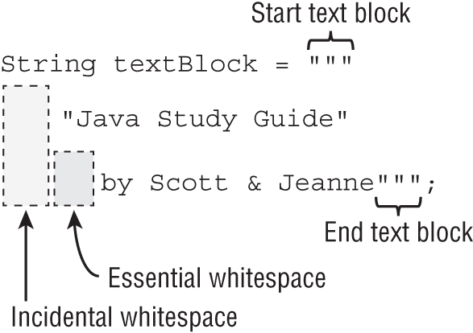

<table>
<thead>
<tr>
<th scope="col" class="left">Formatting</th>
<th scope="col" class="left">Meaning in regular <code>String</code></th>
<th scope="col" class="left">Meaning in text block</th> </tr> </thead>
<tbody>
<tr>
<td class="left"><code>\"</code></td>
<td class="left"><code>"</code></td>
<td class="left"><code>"</code></td> </tr>
<tr>
<td class="left"><code>\"""</code></td>
<td class="left">n/a – Invalid</td>
<td class="left"><code>"""</code></td> </tr>
<tr>
<td class="left"><code>\"\"\"</code></td>
<td class="left"><code>"""</code></td>
<td class="left"><code>"""</code></td> </tr>
<tr>
<td class="left">Space (at end of line)</td>
<td class="left">Space</td>
<td class="left">Ignored</td> </tr>
<tr>
<td class="left"><code>\s</code></td>
<td class="left">Two spaces (<code>\s</code> is a space and preserves leading space on the line)</td>
<td class="left">Two spaces</td> </tr>
<tr>
<td class="left"><code>\</code> (at end of line)</td>
<td class="left">n/a – Invalid</td>
<td class="left">Omits new line on that line</td> </tr> </tbody> </table>

# Naming

- Identifiers must begin with a letter, a currency symbol, or a `_` symbol. Currency symbols include dollar `$`, yuan `¥`, euro `€`, and so on.
- Identifiers can include numbers but not start with them.
- A single underscore `_` is not allowed as an identifier.
- You cannot use the same name as a Java reserved word.

# Variables declaration and initialization

initialized only `i3`
```java
void paintFence() {
   int i1, i2, i3 = 0;
}
```

Different types in one statement do not compile
```java
int num, String value; // DOES NOT COMPILE
```

```java
boolean b1, b2; // COMPILE
String s1 = "1", s2; // COMPILE
double d1, double d2; // DOES NOT COMPILE. Use one double in this case double d1, d2;
int i1; int i2; // COMPILE
int i3; i4; // DOES NOT COMPILE. Statement is finished ; and next statement without type
```

With final
```java
final int a =5, b = 4;
b = 5; // DOES NOT COMPILE

final int c =5, d;
d = 4;
d = 5; // DOES NOT COMPILE
```

```java
public void findAnswer(boolean check) {
   int answer;
   int otherAnswer;
   int onlyOneBranch;
   if (check) {
      onlyOneBranch = 1;
      answer = 1;
   } else {
      answer = 2;
   }
   System.out.println(answer);
   System.out.println(onlyOneBranch);  // DOES NOT COMPILE
}
```

```java
public void checkAnswer() {
   boolean value;
   findAnswer(value);  // DOES NOT COMPILE
}
```

> Instance and class variables (static) do not require you to initialize them. As soon as you declare these variables, they are given a default value. The compiler doesn't know what value to use and so wants the simplest value it can give the type: null for an object, zero for the numeric types, and false for a boolean. You don't need to know the default value for char, but in case you are curious, it is '\u0000' (NUL).

> The compiler does not apply a default value to final variables, though. A final instance or final static variable must receive a value when it is declared or as part of initialization.

## Var
> local variable type inference. Let's take that apart. First comes **local** variable. This means just what it sounds like. You can only use this feature for local variables.

> The compiler looks at the code **on the line of the declaration** and uses it to infer the type

```java
public class VarKeyword {
   var tricky = "Hello"; // DOES NOT COMPILE
}
```

```java
public void reassignment() {
   var number = 7;
   number = 4;
   number = "five";  // DOES NOT COMPILE
}
```

```java
public void breakingDeclaration() {
   var silly
      = 1;
}
```

```java
 public void doesThisCompile(boolean check) {
    var question; // DOES NOT COMPILE
    question = 1;
    var answer;  // DOES NOT COMPILE
    if (check) {
       answer = 2;
    } else {
       answer = 3;
    }
    System.out.println(answer);
 }
```

It can be possible to resolve Object type while assigning null to var. But not.. designers of the language decided do not compile this.
```java
public void twoTypes() {
   int a, var b = 3;  // DOES NOT COMPILE
   var n = null;      // DOES NOT COMPILE
   var fall = 2, autumn = 2; // DOES NOT COMPILE
}
```

```java
public int addition(var a, var b) { // DOES NOT COMPILE
   return a + b;
}
```

>var is not a reserved word and allowed to be used as an identifier. It is considered a reserved type name. A reserved type name means it cannot be used to define a type, such as a class, interface, or enum

```java
package var; 
public class Var {
   public void var() {
      var var = "var";
   }
   public void Var() {
      Var var = new Var();
   }
}
```

# Eligibility for GC
```java
 public class Scope {
    public static void main(String[] args) {
       String one, two;
       one = new String("a");
       two = new String("b");
       one = two;
       String three = one;
       one = null;
    } }
```
# Operators

## Order of operator precedence


| Operator                        | Symbols and examples                             | Evaluation    |
| ------------------------------- | ------------------------------------------------ | ------------- |
| Post-unary operators            | `expression++`, `expression--`                   | Left-to-right |
| Pre-unary operators             | `++expression`, `--expression`                   | Left-to-right |
| Other unary operators           | `- ! ~ + (type)`                                 | Right-to-left |
| Cast                            | `(Type)reference`                                | Right-to-left |
| Multiplication/division/modulus | `* / %`                                          | Left-to-right |
| Addition/subtraction            | `+ -`                                            | Left-to-right |
| Shift operators                 | `<< >> >>>`                                      | Left-to-right |
| Relational operators            | `< > <= >= instanceof`                           | Left-to-right |
| Equal to/not equal to           | `== !=`                                         | Left-to-right |
| Logical AND                     | `&`                                              | Left-to-right |
| Logical exclusive OR            | `^`                                              | Left-to-right |
| Logical inclusive OR            | `\|`                                             | Left-to-right |
| Conditional AND                 | `&&`                                             | Left-to-right |
| Conditional OR                  | `\|\|`                                           | Left-to-right |
| Ternary operators               | `boolean expression ? expression1 : expression2` | Right-to-left |
| Assignment operators            | `= += -= *= /= %= &= ^= \|= <<= >>= >>>=`        | Right-to-left |
| Arrow operator                  | `->`                                             | Right-to-left |

## Some of unary operator

```java
int pelican = !5;         // DOES NOT COMPILE
boolean penguin = -true;  // DOES NOT COMPILE
boolean peacock = !0;     // DOES NOT COMPILE
```

#### Logical complement	`!a`	
Inverts a boolean's logical value
```java
boolean isAnimalAsleep = false;
System.out.print(isAnimalAsleep);  // false
isAnimalAsleep = !isAnimalAsleep;
System.out.print(isAnimalAsleep);  // true
```


### Bitwise complement**	`~b`	
which flips all of the 0s and 1s in a number. It can only be applied to integer numeric types such as `byte`, `short`, `char`, `int`, and `long`. Let's try an example. For simplicity, we only show the last four bits (instead of all 32 bits).

```java
int value = 3;                   // Stored as 0011
int complement = ~value;         // Stored as 1100
System.out.println(value);       // 3
System.out.println(complement);  // -4
```

to find the bitwise complement of a number, multiply it by negative one and then subtract one.
```java
System.out.println(-1*value - 1);      // -4
System.out.println(-1*complement - 1); // 3
```

### Negation operator

```java
double zooTemperature = 1.21;
System.out.println(zooTemperature);  // 1.21
zooTemperature = -zooTemperature;
System.out.println(zooTemperature);  // -1.21
zooTemperature = -(-zooTemperature);
System.out.println(zooTemperature);  // -1.21
```

### Increment decrement operators

Pre-increment	`++w`	Increases the value by 1 and returns the **new** value

Pre-decrement	`--x`	Decreases the value by 1 and returns the **new** value

Post-increment	`y++`	Increases the value by 1 and returns the **original** value

Post-decrement	`z--`	Decreases the value by 1 and returns the **original** value

```java
int a = 2, b = 4, c = 2;
System.out.println(a ˃ 2 ? --c : b++); // 4
System.out.println(b = (a!=c ? a : b++)); // 5  first decrement but return old value. 
//b is already 6, but then result of ternary assign to b. 
// And this result of ternary is 5 (old value of b)
```

```java
int ph = 7, vis = 2;
boolean clear = vis ˃ 1 & (vis ˂ 9 || ph ˂ 2);
boolean safe = (vis ˃ 2) && (ph++ ˃ 1);
boolean tasty = 7 ˂= --ph;
System.out.println(clear + "-" + safe + "-" + tasty); // true - false - false
```

```java
int parkAttendance = 0;
System.out.println(parkAttendance);    // 0
System.out.println(++parkAttendance); // 1
System.out.println(parkAttendance);    // 1
System.out.println(parkAttendance--); // 1
System.out.println(parkAttendance);    // 0
```

> All of the arithmetic operators may be applied to any Java primitives, with the exception of boolean. Furthermore, only the addition operators + and += may be applied to String values, which results in `String` concatenation

### Modulus 

```java
System.out.println(9 / 3);  // 3
System.out.println(9 % 3);  // 0
 
System.out.println(10 / 3); // 3
System.out.println(10 % 3); // 1
 
System.out.println(11 / 3); // 3
System.out.println(11 % 3); // 2
 
System.out.println(12 / 3); // 4
System.out.println(12 % 3); // 0
```

> For a given divisor y, the modulus operation results in a value between `0` and `(y - 1)` for positive dividends, or 0, 1, 2 in this example.

> The modulus operation is not limited to positive integer values in Java; it may also be applied to negative integers and floating-point numbers. For example, if the divisor is 5, then the modulus value of a negative number is between -4 and 0. 

# Numeric promotion

1. If two values have different data types, Java will automatically promote one of the values to the larger of the two data types.
2. If one of the values is integral and the other is floating-point, Java will automatically promote the integral value to the floating-point value's data type.
3. Smaller data types, namely, byte, short, and char, are first promoted to int any time they're used with a Java binary arithmetic operator with a variable (as opposed to a value), even if neither of the operands is int.
4. After all promotion has occurred and the operands have the same data type, the resulting value will have the same data type as its promoted operands.

> For the third rule, note that unary operators are excluded from this rule. For example, applying ++ to a short value results in a short value.

```java
int x = 1;
long y = 33;
var z = x * y; // long (first rule)
```

```java
short x = 10;
short y = 3;
var z = x * y; // int (third rule)
```

```java
double x = 39.21;
float y = 2.1; // doesn't compile
var z = x + y;
```

```java
char a = 'a' + 'c'; // compile because literals
char b = 'b';
char k = a + b; // doesn't compile because of int
```

```java 
short w = 14;
float x = 13;
double y = 30;
var z = w * x / y; // double 
```

# Casting primitives

```java
int fish = 1.0;        // DOES NOT COMPILE
short bird = 1921222;  // DOES NOT COMPILE
int mammal = 9f;       // DOES NOT COMPILE
long reptile = 192_301_398_193_810_323;  // DOES NOT COMPILE
```

fix
```java
int fish = (int)1.0;
short bird = (short)1921222;  // Stored as 20678
int mammal = (int)9f;
long reptile = (long)192301398193810323;  // DOES NOT COMPILE
long reptile = 192301398193810323L
```
---
```java
short mouse = 10;
short hamster = 3;
short capybara = mouse * hamster;  // DOES NOT COMPILE
```
fix
```java
short mouse = 10;
short hamster = 3;
short capybara = (short)(mouse * hamster);
```
---
```java
short mouse = 10;
short hamster = 3;
short capybara = (short)mouse * hamster;      // DOES NOT COMPILE
short capybara = 1 + (short)(mouse * hamster);  // DOES NOT COMPILE
```

```java
double lion = 2;
long tiger = (long)lion + 1.0f; // DOES NOT COMPILE.  
// all right expression is float and then without casting to long
```

> compiler doesn't require casting when working with literal values that fit into the data type

```java
byte hat = 1;
byte gloves = 7 * 10;
short scarf = 5;
short boots = 2 + 1;
```

```java
short boots = 2 + hat;  // DOES NOT COMPILE
byte gloves = 7 * 100;  // DOES NOT COMPILE
```

Compound operates can handle casting
```java
long goat = 10;
int sheep = 5;
sheep = sheep * goat;   // DOES NOT COMPILE
```

```java
long goat = 10;
int sheep = 5;
sheep *= goat;  // The compound operator will first cast sheep to a long, apply the multiplication of two long values, and then cast the result to an int. 
```

assignment with assignment
```java
long wolf = 5;
long coyote = (wolf=3);
System.out.println(wolf);   // 3
System.out.println(coyote); // 3
```
and as well
```java
long wolf = 5;
long coyote = (wolf=3);
long tiger = wolf = coyote = 10;
System.out.println(wolf);   // 10
System.out.println(coyote); // 10
 System.out.println(tiger); // 10
```

```java
boolean healthy = false;
if(healthy = true)
   System.out.print("Good!");
```


```java
public class CandyCounter {
   static long addCandy(double fruit, float vegetables) {
      return (int)fruit+vegetables;                         // doesn't compile because result will be float and float not casting to long
   }
   
   public static void main(String[] args) {
      System.out.print(addCandy(1.4, 2.4f) + ", ");
      System.out.print(addCandy(1.9, (float)4) + ", ");
      System.out.print(addCandy((long)(int)(short)2, (float)4)); } } // correct
```

# Comparison

>The equality operator can be applied to numeric values, boolean values, and objects (including String and null). When applying the equality operator, you cannot mix these types. I.E it's legal to compare different numeric types with each other.


```java
boolean monkey = true == 3;       // DOES NOT COMPILE
boolean ape = false != "Grape";   // DOES NOT COMPILE
boolean gorilla = 10.2 == "Koko"; // DOES NOT COMPILE
boolean a = 34L == 3.9f;
```

```java
boolean bear = false;
boolean polar = (bear = true);
System.out.println(polar);  // true
```

```java
var monday = new File("schedule.txt");
var tuesday = new File("schedule.txt");
var wednesday = tuesday;
System.out.println(monday == tuesday);    // false
System.out.println(tuesday == wednesday); // true
```

```java
System.out.print(null == null);  // true
```

> If the compiler can determine that a variable cannot possibly be cast to a specific class, it reports an error.

```java
public void openZoo(Number time) {
   if(time instanceof String) // DOES NOT COMPILE
      System.out.print(time);
}
```

```java
System.out.print(null instanceof Object);  // false
 
Object noObjectHere = null;
System.out.print(noObjectHere instanceof String);  // false
System.out.print(null instanceof null);  // DOES NOT COMPILE
```

```java
if(duck!=null & duck.getAge()<5) { // Could throw a NullPointerException
   // Do something
}
```

```java
if(duck!=null && duck.getAge()<5) {
   // Do something
}
```

```java
int ph = 7, vis = 2;
boolean clear = vis ˃ 1 & (vis ˂ 9 || ph ˂ 2);
boolean safe = (vis ˃ 2) && (ph++ ˃ 1);                 // right side never invokes
boolean tasty = 7 ˂= --ph;
System.out.println(clear + "-" + safe + "-" + tasty);  // true, false, false 
```

# Ternary Operator tricks

```java
int food1 = owl < 4 ? owl > 2 ? 3 : 4 : 5;
int food2 = (owl < 4 ? ((owl > 2) ? 3 : 4) : 5)
```

> there is no requirement that second and third expressions in ternary operations have the same data types, although it does come into play when combined with the assignment operator
```java
int stripes = 7;
 
System.out.print((stripes > 5) ? 21 : "Zebra");
 
int animal = (stripes < 9) ? 3 : "Horse";  // DOES NOT COMPILE
```

```java
int sheep = 1;
int zzz = 1;
int sleep = zzz < 10 ? sheep++ : zzz++;
System.out.print(sleep + "," + sheep + "," + zzz);  // 1,2,1
```    

```java
int sheep = 1;
int zzz = 1;
int sleep = sheep>=10 ? sheep++ : zzz++;
System.out.print(sleep + "," + sheep + "," + zzz);  // 1,1,2
```    

# Pattern matching 

For escaping type checking and casting in Java 16 there are pattern matching. Variable `data` is so called *pattern variable*.
```java
void compareIntegers(Number number) {
   if(number instanceof Integer data) {
      System.out.print(data.compareTo(5));
   }
}
```

if pattern variable is not final it can be reassigned
```java
if(number instanceof Integer data) {
   data = 10;
}
```

```java
if(number instanceof final Integer data) {
   data = 10;  // DOES NOT COMPILE
}
```

pattern variable can be possible to use in the same equations further

```java
void printIntegersGreaterThan5(Number number) {
   if(number instanceof Integer data && data.compareTo(5)>0)
      System.out.print(data);
}
```

Pattern variable must by sub type. In comparison an usual instanceof
```java
Integer value = 123;
if(value instanceof Integer) {}
if(value instanceof Integer data) {}  // DOES NOT COMPILE
```

the variable should be exist before using

```java
void printIntegersOrNumbersGreaterThan5(Number number) {
   if(number instanceof Integer data || data.compareTo(5)>0)  // DOES NOT COMPILE
      System.out.print(data);
}
```

Scope of variable is far beyond code block. Compilation will decide
```java
void printOnlyIntegers(Number number) { 
   if (!(number instanceof Integer data))
      return;
   System.out.print(data.intValue());
}
```

```java
void getFish(Object fish) {
   if (!(fish instanceof String guppy))
      System.out.print("Eat!");
   else if (!(fish instanceof String guppy)) { // DOES NOT COMPILE variable guppy that is a duplicate of the previously defined local variable defined
      throw new RuntimeException();
   }
   System.out.print("Swim!");
}
```

# switch

## switch statement

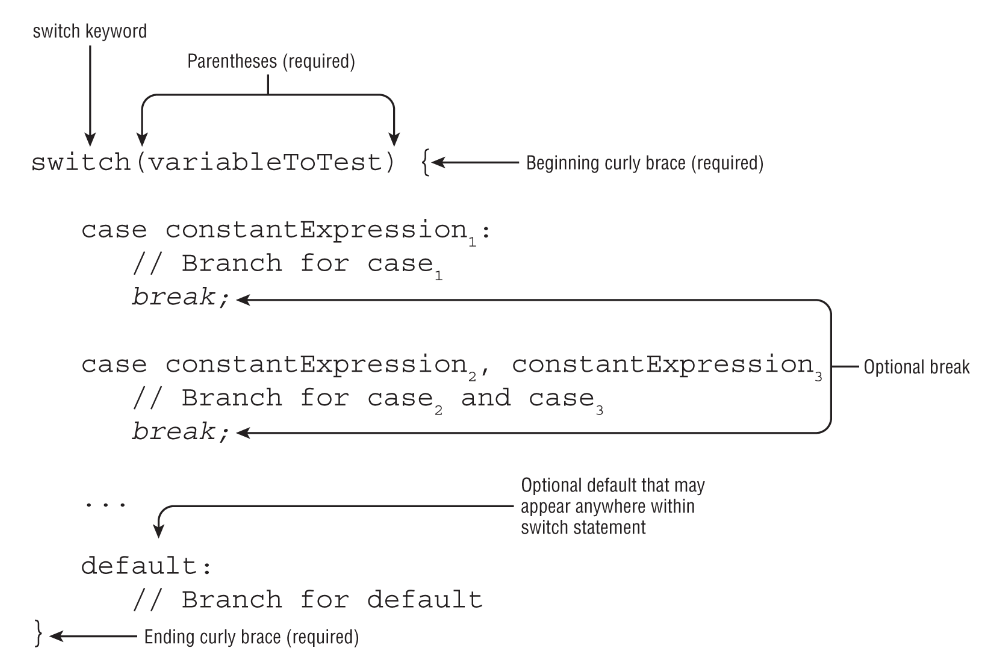

 - `default` can be everywhere among cases. It possible that there are no cases at all, and default will work in that case. Moreover there is nothing inside braces
 - If after value followed by `:` then it could be block of code or sequence of expression divided by `;`

```java
switch (random) {
       case 4:
        System.out.println("first");
        System.out.println("second");
        break;
    case 5: {
        System.out.println("third");
        System.out.println("other");
        break;
    }
}
```        

- legal empty switch
```java
switch(month) {}
```

The following is a list of all data types supported by switch statements:

- `int` and `Integer`
- `byte` and `Byte`
- `short` and `Short`
- `char` and `Character`
- `String`
- `enum` values
- `var` (if the type resolves to one of the preceding types)

Notice that `boolean`, `long`, `float`, and `double` are excluded from switch statements, as are their associated `Boolean`, `Long`, `Float`, and `Double` classes

several values in one `case`.  Added in Java 14
```java
switch(animal) {
   case 1,2: System.out.print("Lion");
   case 3:   System.out.print("Tiger");
}
```
in the past we need to write like this

```java
switch(animal) {
   case 1: case 2: System.out.print("Lion");
   case 3:         System.out.print("Tiger");
}
``` 

if break is not invokes, all branches invokes after current including default
```java
public void printSeason(int month) {
   switch(month) {
      case 1, 2, 3:    System.out.print("Winter");
      case 4, 5, 6:    System.out.print("Spring");
      default:         System.out.print("Unknown");
      case 7, 8, 9:    System.out.print("Summer");
      case 10, 11, 12: System.out.print("Fall");
   } 
}

printSeason(2);

// WinterSpringUnknownSummerFall
```

```java
 String instrument = "violin";
 final String CELLO = "cello";
 String viola = "viola";
 int p = -1;
 switch(instrument) {
    case "bass" : break;
    case CELLO : p++;
    default: p++;
    case "VIOLIN": p++;
    case "viola" : ++p; break;
 }
 System.out.print(p); // 2
```


In case we can write only constants and values which known in compile time
```java
final int getCookies() { return 4; }
void feedAnimals() {
   final int bananas = 1;
   int apples = 2;
   int numberOfAnimals = 3;
   final int cookies = getCookies();
   switch(numberOfAnimals) {
      case bananas:
      case apples:        // DOES NOT COMPILE
      case getCookies():  // DOES NOT COMPILE
      case cookies :      // DOES NOT COMPILE
      case 3 * 5 :
   } }
```   


## Switch expression. New switch, which can return a value
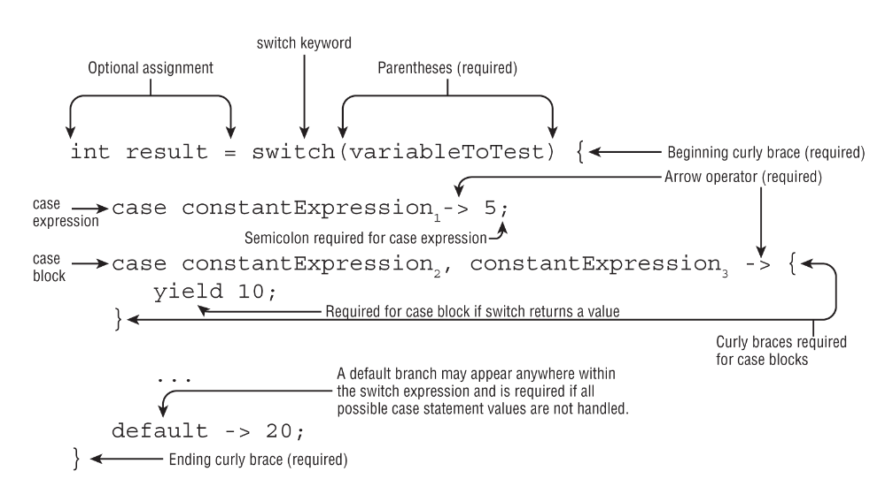

- After operator `->` is NOT lambda. 
- After comma separated values there is `->` but not `:`
- Mandatory use `;` if you use not a block of code but one expression.
- Mandatory use `;` after switch, since there is assignment result of switch to a local variable
- you don't need `break` branch is executed only if the expression matches.
- After code block `;` must no be used 
```java
public void printDayOfWeek(int day) {
   var result = switch(day) {
      case 0 -> "Sunday";
      case 1 -> "Monday";
      case 2 -> "Tuesday";
      case 3 -> "Wednesday";
      case 4 -> "Thursday";
      case 5 -> "Friday";
      case 6 -> "Saturday";
      default -> "Invalid value";
   };
   System.out.print(result);
}
```

here is no assignment to a variable, so you don't need a default branch 
```java
public void printSeason(int month) {
   switch(month) {
      case 1, 2, 3    -> System.out.print("Winter");
      case 4, 5, 6    -> System.out.print("Spring");
      case 7, 8, 9    -> System.out.print("Summer");
      case 10, 11, 12 -> System.out.print("Fall");
   } 
}
```   

1. All of the branches of a switch expression that do not throw an exception must return a consistent data type (if the switch expression returns a value).

      ```java
      int measurement = 10;
      int size = switch(measurement) {
         case 5 -> 1;
         case 10 -> (short)2;
         default -> 5;
         case 20 -> "3";   // DOES NOT COMPILE
         case 40 -> 4L;    // DOES NOT COMPILE
         case 50 -> null;  // DOES NOT COMPILE
      };
      ```

2. If the switch expression returns a value, then every branch that isn't an expression must yield a value.

```java
int fish = 5;
int length = 12;
var name = switch(fish) {
   case 1 -> "Goldfish";
   case 2 -> {yield "Trout";}
   case 3 -> {
      if(length > 10) yield "Blowfish";
      else yield "Green";
   }
   default -> "Swordfish";
};
```

```java
int fish = 5;
int length = 12;
var name = switch(fish) {
   case 1 -> "Goldfish";
   case 2 -> {}  // DOES NOT COMPILE
   case 3 -> {
      if(length > 10) yield "Blowfish";
   }  // DOES NOT COMPILE
   default -> "Swordfish";
};
```

3. A default branch is required unless all cases are covered or no value is returned.

```java
String type = switch(animal) { // DOES NOT COMPILE
   case 1 -> "dog";
   case 2 -> "wolf";
   case 3 -> "coyote";
};
```
Two ways how to fix:
1. Add default branch.
2. If the switch expression takes an enum value, add a case branch for every possible enum value.

```java
enum Season {WINTER, SPRING, SUMMER, FALL}
 
String getWeather(Season value) {
   return switch(value) {
      case WINTER -> "Cold";
      case SPRING -> "Rainy";
      case SUMMER -> "Hot";
      case FALL -> "Warm";
   };
}
```

- When you use enums with switch it's useful to use a default branch as well, even if it's not mandatory. If you add a value to enum there will be mandatory fixes to all using this enum in switch since code does not compiled. 


```java
public class Weather {
   enum Seasons {
      WINTER, SPRING, SUMMER, FALL
   }

   public static void main(String[] args) {
      Seasons v = null;
      switch (v) {
         case Seasons.SPRING -˃ System.out.print("s");    // DOES NOT COMPILE
         case Seasons.WINTER -˃ System.out.print("w");    // DOES NOT COMPILE
         case Seasons.SUMMER -˃ System.out.print("m");    // DOES NOT COMPILE
         default -˃ System.out.println("missing data"); }
   }
}
```

if the enum name is used in the case statement value, then the code does not compile. In this question, `SPRING` is acceptable, but `Seasons.SPRING` is not.

# Cycles

## do while
Mandatory use `;` after `while` in `do while` cycle
```java
int lizard = 0;
do {
   lizard++;
} while(false);
System.out.println(lizard);  // 1
```

## for

- Blocks can be compound. In such cases you need to use comma between them
- Expression in blocks are optional. This is infinite cycle. Mandatory `;` between blocks

```java
for( ; ; )
   System.out.println("Hello World");
```
this does not compiled `for( )`


variables scope
```java
for(int i=0; i < 10; i++)
   System.out.println("Value is: "+i);
System.out.println(i);  // DOES NOT COMPILE
```

```java
int i;
for(i=0; i < 10; i++)
   System.out.println("Value is: "+i);
System.out.println(i);
```

correct
```java
int x = 0;
for(long y = 0, z = 4; x < 5 && y < 10; x++, y++) {
   System.out.print(y + " "); }
System.out.print(x + " ");
```

not correct
```java
int x = 0;
for(long y = 0, int z = 4; x < 5; x++)  // DOES NOT COMPILE
   System.out.print(y + " ");

```java
int x = 0;
for(int x = 4; x < 5; x++)   // DOES NOT COMPILE
   System.out.print(x + " ");
```

## Examples

```java
private void countAttendees() {
   int participants = 4, animals = 2, performers = -1;

   while((participants = participants+1) ˂ 10) {}
   do {} while (animals++ ˂= 1);
   for( ; performers˂2; performers+=2) {}

   System.out.println(participants);   // 10
   System.out.println(animals);        // 3
   System.out.println(performers);     // 3
}
```

# Labels

Labels can be before `if`, `switch` and all cycles.

```java
int[][] myComplexArray = {{5,2,1,3},{3,9,8,9},{5,7,12,7}};
 
OUTER_LOOP:  for(int[] mySimpleArray : myComplexArray) {
   INNER_LOOP:  for(int i=0; i<mySimpleArray.length; i++) {
      System.out.print(mySimpleArray[i]+"\t");
   }
   System.out.println();
}
```

such labels can be before any block
```java
int frog = 15;
BAD_IDEA: if(frog>10)
EVEN_WORSE_IDEA: {
   frog++;
}
```

`break` with label
```java
public class FindInMatrix {
   public static void main(String[] args) {
      int[][] list = {{1,13},{5,2},{2,2}};
      int searchValue = 2;
      int positionX = -1;
      int positionY = -1;
 
      PARENT_LOOP: for(int i=0; i<list.length; i++) {
         for(int j=0; j<list[i].length; j++) {
            if(list[i][j]==searchValue) {
               positionX = i;
               positionY = j;
               break PARENT_LOOP;
            }
         }
      }
      if(positionX==-1 || positionY==-1) {
         System.out.println("Value "+searchValue+" not found");
      } else {
         System.out.println("Value "+searchValue+" found at: " +
            "("+positionX+","+positionY+")");
      }
   }
}
```

you can interrupt cycles using `return`
```java
   private static int[] searchForValue(int[][] list, int v) {
      for (int i = 0; i < list.length; i++) {
         for (int j = 0; j < list[i].length; j++) {
            if (list[i][j] == v) {
               return new int[] {i,j};
            }
         }
      }
      return null;
   }
```   


`continue` with label
```java
public class CleaningSchedule {
   public static void main(String[] args) {
      CLEANING: for(char stables = 'a'; stables<='d'; stables++) {
         for(int leopard = 1; leopard<4; leopard++) {
            if(stables=='b' || leopard==2) {
               continue CLEANING;
            }
            System.out.println("Cleaning: "+stables+","+leopard);
} } } }
```

unreachable code for break, continue, return
```java
int checkDate = 0;
while(checkDate<10) {
   checkDate++;
   if(checkDate>100) {
      break;
      checkDate++;  // DOES NOT COMPILE
   }
}

int minute = 1;
WATCH: while(minute>2) {
   if(minute++>2) {
      continue WATCH;
      System.out.print(minute);  // DOES NOT COMPILE
   }
}
 
int hour = 2;
switch(hour) {
   case 1: return; hour++;  // DOES NOT COMPILE
   case 2:
}
```
# Strings

## String concatenation

Rules:
- If both operands are numeric, + means numeric addition.
- If either operand is a String, + means concatenation.
- The expression is evaluated left to right.

```java
System.out.println(1 + 2);           // 3
System.out.println("a" + "b");       // ab
System.out.println("a" + "b" + 3);   // ab3
System.out.println(1 + 2 + "c");     // 3c
System.out.println("c" + 1 + 2);     // c12
System.out.println("c" + null);      // cnull
```

```java
int three = 3;
String four = "4";
System.out.println(1 + 2 + three + four);
```

## important methods for OCP exam
```java
public int length()

public char charAt(int index)

public int indexOf(int ch) 
public int indexOf(int ch, int fromIndex)
public int indexOf(String str)
public int indexOf(String str, int fromIndex)

public String substring(int beginIndex)
public String substring(int beginIndex, int endIndex)

public String toLowerCase()
public String toUpperCase()

public boolean equals(Object obj)
public boolean equalsIgnoreCase(String str)

public boolean startsWith(String prefix)
public boolean endsWith(String suffix)
public boolean contains(CharSequence charSeq)

public String replace(char oldChar, char newChar)
public String replace(CharSequence target, CharSequence replacement)

public String strip()
public String stripLeading()
public String stripTrailing()
public String trim()

public String indent(int numberSpaces)
public String stripIndent()

public String translateEscapes()

public boolean isEmpty()
public boolean isBlank()

public static String format(String format, Object args…)
public static String format(Locale loc, String format, Object args…)
public String formatted(Object args…)
```

```java
var name = "animals";
System.out.println(name.indexOf('a'));       // 0
System.out.println(name.indexOf("al"));      // 4
System.out.println(name.indexOf('a', 4));    // 4
System.out.println(name.indexOf("al", 5));   // -1
```

## substring 

```java
public String substring(int beginIndex)
public String substring(int beginIndex, int endIndex)
```

second argument in `substring` doesn't included. Such as math `[left_arg, right_arg)`
```java
var name = "animals";
System.out.println(name.substring(3));                 // mals
System.out.println(name.substring(name.indexOf('m'))); // mals
System.out.println(name.substring(3, 4));              // m
System.out.println(name.substring(3, 7));              // mals

System.out.println(name.substring(3, 3)); // empty string
System.out.println(name.substring(3, 2)); // exception
System.out.println(name.substring(3, 8)); // exception
```

## equals

```java
public boolean equals(Object obj)
public boolean equalsIgnoreCase(String str)
```

```java
System.out.println("abc".equals("ABC"));            // false
System.out.println("ABC".equals("ABC"));            // true
System.out.println("abc".equalsIgnoreCase("ABC"));  // true
```

## replace

```java
public String replace(char oldChar, char newChar)
public String replace(CharSequence target, CharSequence replacement)
```

```java
System.out.println("abcabc".replace('a', 'A')); // AbcAbc
System.out.println("abcabc".replace("a", "A")); // AbcAbc
```

## strip and trim

- The `strip()` method does everything that `trim()` does, but it supports Unicode.

```java
public String strip()
public String stripLeading()
public String stripTrailing()
```

```java
System.out.println("abc".strip());                 // abc
System.out.println("\t   a b c\n".strip());        // a b c
 
String text = " abc\t ";
System.out.println(text.trim().length());          // 3
System.out.println(text.strip().length());         // 3
System.out.println(text.stripLeading().length());  // 5
System.out.println(text.stripTrailing().length()); // 4
```

## Working with indent

```java
public String indent(int numberSpaces)
public String stripIndent()
```

- The `indent()` method adds the same number of blank spaces to the beginning of each line if you pass a positive number. If you pass a negative number, it tries to remove that number of whitespace characters from the beginning of the line. If you pass zero, the indentation will not change.
- `indent()` also normalizes whitespace characters. First, a line break is added to the end of the string if not already there. Second, any line breaks are converted to the \n format. Regardless of whether your operating system uses \r\n (Windows) or\n (Mac/Unix), Java will standardize on \n for you.
- The `stripIndent()` method is useful when a String was built with concatenation rather than using a text block. It gets rid of all incidental whitespace. This means that all non-blank lines are shifted left so the same number of whitespace characters are removed from each line and the first character that remains is not blank. Like indent(), \r\n is turned into \n. However, the stripIndent() method does not add a trailing line break if it is missing.

<table>
<thead>
<tr>
<th scope="col" class="left">Method</th>
<th scope="col" class="left">Indent change</th>
<th scope="col" class="left">Normalizes existing line breaks</th>
<th scope="col" class="left">Adds line break at end if missing</th> </tr> </thead>
<tbody>
<tr>
<td class="left"><code>indent(n)</code> where n &gt; 0</td>
<td class="left">Adds <code>n</code> spaces to beginning of each line</td>
<td class="left">Yes</td>
<td class="left">Yes</td> </tr>
<tr>
<td class="left"><code>indent(n)</code> where <code>n</code> == 0</td>
<td class="left">No change</td>
<td class="left">Yes</td>
<td class="left">Yes</td> </tr>
<tr>
<td class="left"><code>indent(n)</code> where <code>n</code> &lt; 0</td>
<td class="left">Removes up to <code>n</code> spaces from each line where the same number of characters is removed from each non-blank line</td>
<td class="left">Yes</td>
<td class="left">Yes</td> </tr>
<tr>
<td class="left"><code>stripIndent()</code></td>
<td class="left">Removes all leading incidental whitespace</td>
<td class="left">Yes</td>
<td class="left">No</td> </tr> </tbody> </table>

```java
var block = """
            a
             b
            c""";
var concat = " a\n"
           + "  b\n"
           + " c";
System.out.println(block.length());                 // 6
System.out.println(concat.length());                // 9
System.out.println(block.indent(1).length());       // 10
System.out.println(concat.indent(-1).length());     // 7
System.out.println(concat.indent(-4).length());     // 6
System.out.println(concat.stripIndent().length());  // 6
```

## translateEscapes

```java
public String translateEscapes()
```

```java
var str = "1\\t2";
System.out.println(str);                    // 1\t2
System.out.println(str.translateEscapes()); // 1    2
```

> this method can be used for escape sequences such as \t (tab), \n (new line), \s (space), \" (double quote), and \' (single quote.)

## empty string
```java
public boolean isEmpty()
public boolean isBlank()
```

```java
System.out.println(" ".isEmpty()); // false
System.out.println("".isEmpty());  // true
System.out.println(" ".isBlank()); // true
System.out.println("".isBlank());  // true
```

## Formatting

```java
var name = "Kate";
var orderId = 5;
 
// All print: Hello Kate, order 5 is ready
System.out.println("Hello "+name+", order "+orderId+" is ready");
System.out.println(String.format("Hello %s, order %d is ready", 
   name, orderId));
System.out.println("Hello %s, order %d is ready"
   .formatted(name, orderId));
```

- `%s`	Applies to any type, commonly String values
- `%d`	Applies to integer values like int and long
- `%f`	Applies to floating-point values like float and double
- `%n`	Inserts a line break using the system-dependent line separator

```java
var name = "James";
var score = 90.25;
var total = 100;
System.out.println("%s:%n   Score: %f out of %d"
   .formatted(name, score, total));

/*
James:
   Score: 90.250000 out of 100
*/      
```

don't mix that types
```java
var str = "Food: %d tons".formatted(2.0); // IllegalFormatConversionException
```

> By default, %f displays exactly six digits past the decimal. If you want to display only one digit after the decimal, you can use %.1f instead of %f.

more here - [Formatting values](#formatting-values)

## StringBuilder

### Important methods

> <mark> StringBuild does not have overridden `equals` </mark>

```java

public String substring(int start, int end) 
public int length()
public char charAt(int index)
public int indexOf(String str)

public StringBuilder append(String str)
public StringBuilder insert(int offset, String str)
public StringBuilder delete(int startIndex, int endIndex)
public StringBuilder deleteCharAt(int index)
public StringBuilder replace(int startIndex, int endIndex, String newString)
public StringBuilder reverse()
```

```java
StringBuilder sb1 = new StringBuilder();
StringBuilder sb2 = new StringBuilder("animal");
StringBuilder sb3 = new StringBuilder(10);
```

```java
StringBuilder sb = new StringBuilder("start");
sb.append("+middle"); // sb = "start+middle"
StringBuilder same = sb.append("+end"); // "start+middle+end"
```

```java
StringBuilder a = new StringBuilder("abc");
StringBuilder b = a.append("de");
b = b.append("f").append("g");
System.out.println("a=" + a);
System.out.println("b=" + b);
//only one StringBuilder here
```

```java
var one = new StringBuilder();
var two = new StringBuilder();
var three = one.append("a");
System.out.println(one == two);   // false
System.out.println(one == three); // true
```

### substring returns String


```java
var sb = new StringBuilder("animals");
String sub = sb.substring(sb.indexOf("a"), sb.indexOf("al"));
int len = sb.length();
char ch = sb.charAt(6);
System.out.println(sub + " " + len + " " + ch);
```

### append

```java
public StringBuilder append(String str)
```

```java
var sb = new StringBuilder().append(1).append('c');
sb.append("-").append(true);
System.out.println(sb);      // 1c-true
```

### insert
```java
public StringBuilder insert(int offset, String str)
```

```java
var sb = new StringBuilder("animals");
sb.insert(7, "-");                  // sb = animals-
sb.insert(0, "-");                  // sb = -animals-
sb.insert(4, "-");                  // sb = -ani-mals-
System.out.println(sb);
```

### delete
```java
public StringBuilder delete(int startIndex, int endIndex)
public StringBuilder deleteCharAt(int index)
```

```java
var sb = new StringBuilder("abcdef");
sb.delete(1, 3);                   // sb = adef
sb.deleteCharAt(5);                // exception
```

delete is method with no exception when we put too big right value
```java
var sb = new StringBuilder("abcdef");
sb.delete(1, 100);                  // sb = a
```

### replace

```java
public StringBuilder replace(int startIndex, int endIndex, String newString)
```

```java
var builder = new StringBuilder("pigeon dirty");
builder.replace(3, 6, "sty");
System.out.println(builder);  // pigsty dirty
// First, Java deletes the characters starting with index 3 and ending right before index 6. This gives us pig dirty. Then Java inserts the value "sty" in that position.

var builder = new StringBuilder("pigeon dirty");
builder.replace(3, 100, "");
System.out.println(builder); // pig

```

### reverse

```java
public StringBuilder reverse()
```
```java
var sb = new StringBuilder("ABC");
sb.reverse();
System.out.println(sb);
```

## String pool

The string pool, also known as the intern pool, is a location in the Java Virtual Machine (JVM) that collects all these strings.

```java
var x = "Hello World";
var y = "Hello World";
System.out.println(x == y); // true
```

```java
var x = "Hello World";
var z = " Hello World".trim();
System.out.println(x == z); // false
```

```java
var singleString = "hello world";
var concat = "hello ";
concat += "world";
System.out.println(singleString == concat); // false
```

```java
var x = "Hello World";
var y = new String("Hello World");
System.out.println(x == y); // false
```

`intern()` method will use an object in the string pool if one is present.

```java
public String intern()
```

```java
var name = "Hello World";
var name2 = new String("Hello World").intern();
System.out.println(name == name2); // true
```

Tricky. Concatenation of literals is just literal because compiler insert in byte code just one string. Except += like above. 
```java
var first = "rat" + 1;
var second = "r" + "a" + "t" + "1";
var third = "r" + "a" + "t" + new String("1");
System.out.println(first == second);          // true
System.out.println(first == second.intern()); // true
System.out.println(first == third);           // false
System.out.println(first == third.intern());  // true
```

# Arrays

The array does not allocate space for the objects. Instead, it allocates space for a reference to where the objects are really stored.

anonymous array
```java
int[] moreNumbers = new int[] {42, 55, 99};

int[] moreNumbers = {42, 55, 99};
```

```java
int[] numAnimals;
int [] numAnimals2;
int []numAnimals3;
int numAnimals4[];
int numAnimals5 [];
```

```java
int[] ids, types; 
  ```


```java
String[] strings = { "stringValue" };
Object[] objects = strings;
String[] againStrings = (String[]) objects;
againStrings[0] = new StringBuilder();   // DOES NOT COMPILE
objects[0] = new StringBuilder();        // ArrayStoreException in runtime
```

```java
String[] mammals = {"monkey", "chimp", "donkey"};
System.out.println(mammals.length());               // DOES NOT COMPILE
```

## Sort

```java
int[] numbers = { 6, 9, 1 };
Arrays.sort(numbers);
for (int i = 0; i < numbers.length; i++)
   System.out.print(numbers[i] +  " ");  // 1 6 9
```

```java
String[] strings = { "10", "9", "100" };
Arrays.sort(strings);
for (String s : strings)
   System.out.print(s + " "); // 10 100 9
```

## Search

Negative value showing one smaller than the negative of the index, where a match needs to be inserted to preserve sorted order

```java
int[] numbers = {2,4,6,8};
System.out.println(Arrays.binarySearch(numbers, 2)); // 0
System.out.println(Arrays.binarySearch(numbers, 4)); // 1
System.out.println(Arrays.binarySearch(numbers, 1)); // -1
System.out.println(Arrays.binarySearch(numbers, 3)); // -2
System.out.println(Arrays.binarySearch(numbers, 9)); // -5
```

Unsorted array	A surprise; this result is undefined

## Compare

```java
System.out.println(Arrays.compare(new int[] {1}, new int[] {2}));
```

compare return values: 
- A negative number means the first array is smaller than the second.
- A zero means the arrays are equal.
- A positive number means the first array is larger than the second.

rules:
- If both arrays are the same length and have the same values in each spot in the same order, return zero.
- If all the elements are the same but the second array has extra elements at the end, return a negative number.
- If all the elements are the same, but the first array has extra elements at the end, return a positive number.
- If the first element that differs is smaller in the first array, return a negative number.
- If the first element that differs is larger in the first array, return a positive number.
- `null` is smaller than any other value.
- For numbers, normal numeric order applies.
- For strings, one is smaller if it is a prefix of another.
- For strings/characters, numbers are smaller than letters.
- For strings/characters, uppercase is smaller than lowercase.

<table>
<thead>
<tr>
<th scope="col" class="left">First array</th>
<th scope="col" class="left">Second array</th>
<th scope="col" class="left">Result</th>
<th scope="col" class="left">Reason</th> </tr> </thead>
<tbody>
<tr>
<td class="left"><code>new int[] {1, 2}</code></td>
<td class="left"><code>new int[] {1}</code></td>
<td class="left">Positive number</td>
<td class="left">The first element is the same, but the first array is longer.</td> </tr>
<tr>
<td class="left"><code>new int[] {1, 2}</code></td>
<td class="left"><code>new int[] {1, 2}</code></td>
<td class="left">Zero</td>
<td class="left">Exact match</td> </tr>
<tr>
<td class="left"><code>new String[] {"a"}</code></td>
<td class="left"><code>new String[] {"aa"}</code></td>
<td class="left">Negative number</td>
<td class="left">The first element is a substring of the second.</td> </tr>
<tr>
<td class="left"><code>new String[] {"a"}</code></td>
<td class="left"><code>new String[] {"A"}</code></td>
<td class="left">Positive number</td>
<td class="left">Uppercase is smaller than lowercase.</td> </tr>
<tr>
<td class="left"><code>new String[] {"a"}</code></td>
<td class="left"><code>new String[] {null}</code></td>
<td class="left">Positive number</td>
<td class="left"><code>null</code> is smaller than a letter.</td> </tr> </tbody> </table>

```java
System.out.println(Arrays.compare(
   new int[] {1}, new String[] {"a"})); // DOES NOT COMPILE
```

## Mismatch

If the arrays are equal, `mismatch()` returns `-1`. Otherwise, it returns the first index where they differ. 

```java
System.out.println(Arrays.mismatch(new int[] {1}, new int[] {1})); // -1
System.out.println(Arrays.mismatch(new String[] {"a"},             // 0
   new String[] {"A"}));
System.out.println(Arrays.mismatch(new int[] {1, 2}, new int[] {1})); // 1
```

## Multidimensional Array

```java
int[][] vars1;          // 2D array
int vars2 [][];         // 2D array
int[] vars3[];          // 2D array
int[] vars4 [], space [][];  // a 2D AND a 3D array

String [][] rectangle = new String[3][2];

int[][] differentSizes = {{1, 4}, {3}, {9,8,7}};

int [][] args = new int[4][];
args[0] = new int[5];
args[1] = new int[3];
```

```java
int[][] java = new int[][]; // DOES NOT COMPILE
int[][] types = new int[];  // DOES NOT COMPILE
Object[][][] cubbies = new Object[3][0][5]; // correct
```

```java
var twoD = new int[3][2];
for(int i = 0; i < twoD.length; i++) {
   for(int j = 0; j < twoD[i].length; j++)
      System.out.print(twoD[i][j] + " "); // print element
   System.out.println();                  // time for a new row
}

for(int[] inner : twoD) {
   for(int num : inner)
      System.out.print(num + " ");
   System.out.println();
}
```

# Math APIs

## min max

```java
public static double min(double a, double b)
public static float min(float a, float b)
public static int min(int a, int b)
public static long min(long a, long b)
```

```java
int first = Math.max(3, 7);   // 7
int second = Math.min(7, -9); // -9
```

## round

If the fractional part is .5 or higher, we round up.

```java
public static long round(double num)
public static int round(float num)
```

```java
long low = Math.round(123.45);       // 123
long high = Math.round(123.50);      // 124
int fromFloat = Math.round(123.45f); // 123
```

## Ceil and floor

The `ceil()` method takes a `double` value. If it is a whole number, it returns the same value. If it has any fractional value, it rounds up to the **next** whole number. 

By contrast, the `floor()` method discards any values after the decimal.

```java
public static double ceil(double num)
public static double floor(double num)
```

```java
double c = Math.ceil(3.14);  // 4.0
double f = Math.floor(3.14); // 3.0 
```

## Pow

```java
public static double pow(double number, double exponent)
```

```java
double squared = Math.pow(5, 2); // 25.0
```

## random

```java
public static double random()
```

```java
double num = Math.random(); // greater than or equal to 0 and less than 1
```

# Working with Dates and Times

New modern Java Time classes
```java
 import java.time.*;    // import time classes
 ```

- `LocalDate` Contains just a date—no time and no time zone. A good example of LocalDate is your birthday this year. It is your birthday for a full day, regardless of what time it is
- `LocalTime` Contains just a time—no date and no time zone. A good example of LocalTime is midnight. It is midnight at the same time every day.
- `LocalDateTime` Contains both a date and time but no time zone. A good example of LocalDateTime is “the stroke of midnight on New Year's Eve.” Midnight on January 2 isn't nearly as special, making the date relatively unimportant, and clearly an hour after midnight isn't as special either.
- `ZonedDateTime` Contains a date, time, and time zone. A good example of ZonedDateTime is “a conference call at 9:00 a.m. EST.” If you live in California, you'll have to get up really early since the call is at 6:00 a.m. local time!

```java
System.out.println(LocalDate.now());  // 2021–10–25
System.out.println(LocalTime.now());   //09:13:07.768
System.out.println(LocalDateTime.now());  //2021–10–25T09:13:07.768 divided by T
System.out.println(ZonedDateTime.now());  //2021–10–25T09:13:07.769–05:00[America/New_York]
```

```java
var d = new LocalDate(); // DOES NOT COMPILE Only static methods
```

```java
var d = LocalDate.of(2022, Month.JANUARY, 32) // DateTimeException
```

## LocalDate

```java
public static LocalDate of(int year, int month, int dayOfMonth)
public static LocalDate of(int year, Month month, int dayOfMonth)
```

```java
var date1 = LocalDate.of(2022, Month.JANUARY, 20);
var date2 = LocalDate.of(2022, 1, 20);
```

## LocalTime

```java
public static LocalTime of(int hour, int minute)
public static LocalTime of(int hour, int minute, int second)
public static LocalTime of(int hour, int minute, int second, int nanos)
```

```java
var time1 = LocalTime.of(6, 15);              // hour and minute
var time2 = LocalTime.of(6, 15, 30);          // + seconds
var time3 = LocalTime.of(6, 15, 30, 200);     // + nanoseconds
```

## LocalDateTime

```java
public static LocalDateTime of(int year, int month, int dayOfMonth, int hour, int minute)
public static LocalDateTime of(int year, int month, int dayOfMonth, int hour, int minute, int second)
public static LocalDateTime of(int year, int month, int dayOfMonth, int hour, int minute, int second, int nanos)

public static LocalDateTime of(int year, Month month, int dayOfMonth, int hour, int minute)
public static LocalDateTime of(int year, Month month, int dayOfMonth, int hour, int minute, int second)
public static LocalDateTime of(int year, Month month, int dayOfMonth, int hour, int minute, int second, int nanos)

public static LocalDateTime of(LocalDate date, LocalTime time)
```

```java
var dateTime1 = LocalDateTime.of(2022, Month.JANUARY, 20, 6, 15, 30);
var dateTime2 = LocalDateTime.of(date1, time1);
```

## ZonedDateTime

```java
public static ZonedDateTime of(int year, int month, int dayOfMonth, int hour, int minute, int second, int nanos, ZoneId zone)
public static ZonedDateTime of(LocalDate date, LocalTime time, ZoneId zone)
public static ZonedDateTime of(LocalDateTime dateTime, ZoneId zone)
```

```java
var zone = ZoneId.of("US/Eastern");
var zoned1 = ZonedDateTime.of(2022, 1, 20,
       6, 15, 30, 200, zone);
var zoned2 = ZonedDateTime.of(date1, time1, zone);
var zoned3 = ZonedDateTime.of(dateTime1, zone);
```

## Manipulating date and times

> All date time api classes are immutable. So don't forget to assign the result of manipulation to a reference

```java
var date = LocalDate.of(2022, Month.JANUARY, 20);
System.out.println(date);    // 2022–01–20
date = date.plusDays(2);
System.out.println(date);    // 2022–01–22
date = date.plusWeeks(1);
System.out.println(date);    // 2022–01–29
date = date.plusMonths(1);
System.out.println(date);    // 2022–02–28
date = date.plusYears(5);
System.out.println(date);    // 2027–02–28
```

```java
var date = LocalDate.of(2024, Month.JANUARY, 20);
var time = LocalTime.of(5, 15);
var dateTime = LocalDateTime.of(date, time);
System.out.println(dateTime);       // 2024–01–20T05:15
dateTime = dateTime.minusDays(1);
System.out.println(dateTime);       // 2024–01–19T05:15
dateTime = dateTime.minusHours(10);
System.out.println(dateTime);       // 2024–01–18T19:15
dateTime = dateTime.minusSeconds(30);
System.out.println(dateTime);       // 2024–01–18T19:14:30
```

or with chain
```java
var date = LocalDate.of(2024, Month.JANUARY, 20);
var time = LocalTime.of(5, 15);
var dateTime = LocalDateTime.of(date, time)
       .minusDays(1).minusHours(10).minusSeconds(30);
```       

```java
var date = LocalDate.of(2024, Month.JANUARY, 20);
date.plusDays(10);
System.out.println(date);  // January 20, 2024.
```

```java
var date = LocalDate.of(2024, Month.JANUARY, 20);
date = date.plusMinutes(1);       // DOES NOT COMPILE
```

## Period

```java
public static void main(String[] args) {
   var start = LocalDate.of(2022, Month.JANUARY, 1);
   var end = LocalDate.of(2022, Month.MARCH, 30);
   performAnimalEnrichment(start, end);
}
private static void performAnimalEnrichment(LocalDate start, LocalDate end) {
   var upTo = start;
   while (upTo.isBefore(end)) { // check if still before end
      System.out.println("give new toy: " + upTo);
      upTo = upTo.plusMonths(1); // add a month
} }
```

with `Period` is more reusable

```java
public static void main(String[] args) {
   var start = LocalDate.of(2022, Month.JANUARY, 1);
   var end = LocalDate.of(2022, Month.MARCH, 30);
   var period = Period.ofMonths(1); // create a period
   performAnimalEnrichment(start, end, period);
}

private static void performAnimalEnrichment(LocalDate start, LocalDate end,
   Period period) { // uses the generic period
 
   var upTo = start;
   while (upTo.isBefore(end)) {
      System.out.println("give new toy: " + upTo);
      upTo = upTo.plus(period); // adds the period
} }
```

```java
var annually = Period.ofYears(1);            // every 1 year
var quarterly = Period.ofMonths(3);          // every 3 months
var everyThreeWeeks = Period.ofWeeks(3);     // every 3 weeks
var everyOtherDay = Period.ofDays(2);        // every 2 days
var everyYearAndAWeek = Period.of(1, 0, 7);  // every year and 7 days
```

chain doesn't work because of static method

```java
var wrong = Period.ofYears(1).ofWeeks(1); // every week
```

```java
var date = LocalDate.of(2022, 1, 20);
var time = LocalTime.of(6, 15);
var dateTime = LocalDateTime.of(date, time);
var period = Period.ofMonths(1);
System.out.println(date.plus(period));     // 2022–02–20
System.out.println(dateTime.plus(period)); // 2022–02–20T06:15
System.out.println(time.plus(period));     // Exception
```

## Duration

```java
var daily = Duration.ofDays(1);               // PT24H
var hourly = Duration.ofHours(1);             // PT1H
var everyMinute = Duration.ofMinutes(1);      // PT1M
var everyTenSeconds = Duration.ofSeconds(10); // PT10S
var everyMillis = Duration.ofMillis(1);        // PT0.001S
var everyNano = Duration.ofNanos(1);          // PT0.000000001S
```

```java
var daily = Duration.of(1, ChronoUnit.DAYS);
var hourly = Duration.of(1, ChronoUnit.HOURS);
var everyMinute = Duration.of(1, ChronoUnit.MINUTES);
var everyTenSeconds = Duration.of(10, ChronoUnit.SECONDS);
var everyMillis = Duration.of(1, ChronoUnit.MILLIS);
var everyNano = Duration.of(1, ChronoUnit.NANOS);
```

how to calculate difference between temporal values
```java
var one = LocalTime.of(5, 15);
var two = LocalTime.of(6, 30);
var date = LocalDate.of(2016, 1, 20);
System.out.println(ChronoUnit.HOURS.between(one, two));     // 1
System.out.println(ChronoUnit.MINUTES.between(one, two));   // 75
System.out.println(ChronoUnit.MINUTES.between(one, date));  // DateTimeException
```

```java
LocalTime time = LocalTime.of(3,12,45);
System.out.println(time);      // 03:12:45
LocalTime truncated = time.truncatedTo(ChronoUnit.MINUTES);
System.out.println(truncated); // 03:12
```

```java
var date = LocalDate.of(2022, 1, 20);
var time = LocalTime.of(6, 15);
var dateTime = LocalDateTime.of(date, time);
var duration = Duration.ofHours(6);
System.out.println(dateTime.plus(duration));  // 2022–01–20T12:15
System.out.println(time.plus(duration));      // 12:15
System.out.println(
   date.plus(duration));  // UnsupportedTemporalTypeException
```

```java
var date = LocalDate.of(2022, 1, 20);
var time = LocalTime.of(6, 15);
var dateTime = LocalDateTime.of(date, time);
var duration = Duration.ofHours(23);
System.out.println(dateTime.plus(duration));  // 2022–01–21T05:15
System.out.println(time.plus(duration));      // 05:15
System.out.println(
   date.plus(duration));  // UnsupportedTemporalTypeException
```

## Period vs Duration

```java
var date = LocalDate.of(2022, 5, 25);
var period = Period.ofDays(1);
var days = Duration.ofDays(1);
 
System.out.println(date.plus(period));   // 2022–05–26
System.out.println(date.plus(days));     // Unsupported unit: Seconds
```

## Instant

The `Instant` class represents a specific moment in time in the GMT time zone.

```java
var now = Instant.now();
// do something time consuming
var later = Instant.now();
 
var duration = Duration.between(now, later);
System.out.println(duration.toMillis());  // Returns number milliseconds
```

you can convert `ZonedDateTime` to `Instant`

```java
var date = LocalDate.of(2022, 5, 25);
var time = LocalTime.of(11, 55, 00);
var zone = ZoneId.of("US/Eastern");
var zonedDateTime = ZonedDateTime.of(date, time, zone);
var instant = zonedDateTime.toInstant(); // 2022–05–25T15:55:00Z
System.out.println(zonedDateTime); // 2022–05–25T11:55–04:00[US/Eastern]
System.out.println(instant); // 202–05–25T15:55:00Z
```

```java
Instant ins = new Instant()
```

## Daylight saving

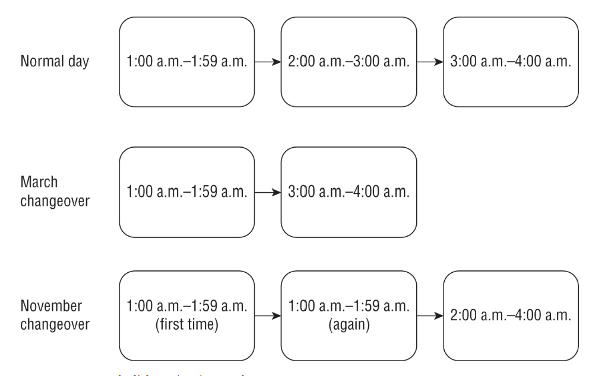

```java
var date = LocalDate.of(2022, Month.MARCH, 13);
var time = LocalTime.of(1, 30);
var zone = ZoneId.of("US/Eastern");
var dateTime = ZonedDateTime.of(date, time, zone);
System.out.println(dateTime);  // 2022–03-13T01:30-05:00[US/Eastern]
System.out.println(dateTime.getHour()); // 1
System.out.println(dateTime.getOffset()); // -05:00
 
dateTime = dateTime.plusHours(1);
System.out.println(dateTime);  // 2022–03-13T03:30-04:00[US/Eastern]
System.out.println(dateTime.getHour()); // 3
System.out.println(dateTime.getOffset()); // -04:00
```

```java
var date = LocalDate.of(2022, Month.NOVEMBER, 6);
var time = LocalTime.of(1, 30);
var zone = ZoneId.of("US/Eastern");
var dateTime = ZonedDateTime.of(date, time, zone);
System.out.println(dateTime); // 2022-11-06T01:30-04:00[US/Eastern]
 
dateTime = dateTime.plusHours(1);
System.out.println(dateTime); // 2022-11-06T01:30-05:00[US/Eastern]
 
dateTime = dateTime.plusHours(1);
System.out.println(dateTime); // 2022-11-06T02:30-05:00[US/Eastern]
```

```java
var date = LocalDate.of(2022, Month.MARCH, 13);
var time = LocalTime.of(2, 30);
var zone = ZoneId.of("US/Eastern");
var dateTime = ZonedDateTime.of(date, time, zone);
System.out.println(dateTime);    // 2022–03–13T03:30–04:00[US/Eastern]
```

# Methods

## Signature

the method name and parameter list—are called the method signature. The method signature provides instructions for how callers can reference this method. The method signature does not include the return type and access modifiers, which control where the method can be referenced.

```java
public class Trip {
   public void visitZoo(String name, int waitTime) {}
   public void visitZoo(int rainFall, String attraction) {}
}
```

## Access modifiers

- **private** The private modifier means the method can be called only from within the same class.
- **Package Access** With package access, the method can be called only from a class in the same package. This one is tricky because there is no keyword. You simply omit the access modifier. Package access is sometimes referred to as package-private or default access (even within this book!).
- **protected** The protected modifier means the method can be called **only from a class in the same package or a subclass**.
- **public** The public modifier means the method can be called from anywhere.


## return for void

```java
public void swim(int distance) {
   if(distance <= 0) {
      // Exit early, nothing to do!
      return;
   }
   System.out.print("Fish is swimming " + distance + " meters");
}
```

## Local variables


> While it might not seem obvious, marking a local variable final is often a good practice. For example, you may have a complex method in which a variable is referenced dozens of times. It would be really bad if someone came in and reassigned the variable in the middle of the method. Using the final attribute is like sending a message to other developers to leave the variable alone!

> An **effectively final** local variable is one that is not modified after it is assigned. This means that the value of a variable doesn't change after it is set, regardless of whether it is explicitly marked as final. If you aren't sure whether a local variable is effectively final, just add the final keyword. If the code still compiles, the variable is effectively final.

## Varargs

- A method can have at most one varargs parameter.
- If a method contains a varargs parameter, it must be the last parameter in the list.

```java
public void walk1(int… steps) {}

// Pass an array
int[] data = new int[] {1, 2, 3};
walk1(data);
 
// Pass a list of values
walk1(1,2,3);

walk1(); // legal. Empty array will be created
```

```java
public void walk1(int… steps) {
   int[] step2 = steps; // Not necessary, but shows steps is of type int[]
   System.out.print(step2.length);
}
```

```java
public class DogWalker {
   public static void walkDog(int start, int… steps) {
      System.out.println(steps.length);
   }
   public static void main(String[] args) {
      walkDog(1);                    // 0
      walkDog(1, 2);                 // 1
      walkDog(1, 2, 3);              // 2
      walkDog(1, new int[] {4, 5});  // 2
      walkDog(1, null); // Triggers NullPointerException in walkDog()
   } }
```

# Access modifiers

```java
package pond.shore;

public class Bird {
    protected String text = "floating";
    protected void floatInWater() {
        System.out.print(text);
    }
}

-- 
package pond.swan;

import pond.shore.Bird;

public class Swan extends Bird {
    public void swim() {
        floatInWater();
        System.out.print(text);
    }

    public void helpOtherSwanSwim() {
        Swan other = new Swan();
        other.floatInWater();
        System.out.print(other.text);
    }

    public void helpOtherBirdSwim() {
        Bird other = new Bird();
        other.floatInWater();             // DOES NOT COMPILE
        System.out.print(other.text);     // DOES NOT COMPILE
    }
}

--
package pond.other;

import pond.swan.Swan;

public class SwanWatcher {

    public void watch() {
        Swan swan = new Swan();
        swan.floatInWater();              // DOES NOT COMPILE
    }
}
```

# Static
```java
public class Snake {
   public static long hiss = 2;
}

Snake s = new Snake();
System.out.println(s.hiss); 
s = null;
System.out.println(s.hiss);
```

# Autoboxing

```java
int quack = 5;
Integer quackquack = quack;        // Autoboxing
int quackquackquack = quackquack;  // Unboxing
```

```java
Short tail = 8;                        // Autoboxing
Character p = Character.valueOf('p');
char paw = p;                          // Unboxing
Boolean nose = true;                   // Autoboxing
Integer e = Integer.valueOf(9);
long ears = e;                         // Unboxing, then implicit casting
Long badGorilla = 8; // DOES NOT COMPILE
```

> Java will cast or autobox the value automatically, but not both at the same time.

```java
public class Gorilla {
   public void rest(Long x) {
      System.out.print("long");
   }
   public static void main(String[] args) {
      var g = new Gorilla();
      g.rest(8); // DOES NOT COMPILE
   }
}
```

```java
Character elephant = null;
char badElephant = elephant;   // NullPointerException
```

```java
Long aw = 12434L;
long a = 34234;
byte result;

result = (byte)a;
result = (byte)(long)aw;

---

Long aw = 12434L;
long a = 34234;
Byte result;

result = (byte)a;
result = (byte)(long)aw;

---

Byte aw = 124;
byte a = 3;

long result;
result = a;
result = aw;

---

Byte aw = 124;
byte a = 3;

Long result;
result = (long) a;
result = (long) aw;
```

# Overloading

```java
public class Falcon {
   public void fly(int numMiles) {}
   public void fly(short numFeet) {}
   public boolean fly() { return false; }
   void fly(int numMiles, short numFeet) {}
   public void fly(short numFeet, int numMiles) throws Exception {}
}
```

```java
public class Eagle {
   public void fly(int numMiles) {}
   public int fly(int numMiles) { return 1; }     // DOES NOT COMPILE
}
```

```java
public class Pelican {
   public void fly(String s) {
      System.out.print("string");
   }
 
   public void fly(Object o) {
      System.out.print("object");
   }
   public static void main(String[] args) {
      var p = new Pelican();
      p.fly("test");
      System.out.print("-");
      p.fly(56);            // string - object
   }
}
```

```java
import java.time.*;
import java.util.*;
public class Parrot {
   public static void print(List<Integer> i) {
      System.out.print("I");
   }
   public static void print(CharSequence c) {
      System.out.print("C");
   }
   public static void print(Object o) {
      System.out.print("O");
   }
   public static void main(String[] args){
      print("abc");
      print(Arrays.asList(3));
      print(LocalDate.of(2019, Month.JULY, 4)); // CIO
   }
}
```

```java
public class Ostrich {
   public void fly(int i) {
      System.out.print("int");
   }
   public void fly(long l) {
      System.out.print("long");
   }
   public static void main(String[] args) {
      var p = new Ostrich();
      p.fly(123);
      System.out.print("-");
      p.fly(123L); // int - long
   }
}
```

```java
public class Kiwi {
   public void fly(int numMiles) {}
   public void fly(Integer numMiles) {}
   // When the primitive int version isn't present, Java will autobox. However, when the primitive int version is provided, there is no reason for Java to do the extra work of autoboxing.
}
```

without autobox
```java
public static void walk(int[] ints) {}
public static void walk(Integer[] integers) {}
```

```java
public class Toucan {
   public void fly(int[] lengths) {}
   public void fly(int… lengths) {} // DOES NOT COMPILE
}

fly(new int[] { 1, 2, 3 }); // Allowed to call either fly() method
fly(1, 2, 3); // Allowed to call only the fly() method using varargs
```

## Rules 

Example of what will be chosen for glide(1,2)
- Exact match by type	`String glide(int i, int j)`
- Larger primitive type	`String glide(long i, long j)`
- Autoboxed type	`String glide(Integer i, Integer j)`
- Varargs	`String glide(int… nums)`

# Inheritance

> When one class inherits from a parent class, all public and protected members are automatically available as part of the child class. 

> If the two classes are in the same package, then package members are available to the child class

```java
public class Zoo { }
public class Zoo extends java.lang.Object { }
```

## Constructor

- The first line of every constructor is a call to a parent constructor using `super()` or an overloaded constructor using `this()`.
- If the constructor does not contain a `this()` or `super()` reference, then the compiler automatically inserts `super()` with no arguments as the first line of the constructor.
- If a constructor calls `super()`, then it must be the first line of the constructor.

```java
public class Animal {
   private int age;
   public Animal(int age) {
      super(); // Refers to constructor in java.lang.Object
      this.age = age;
   }
}
 
public class Zebra extends Animal {
   public Zebra(int age) {
      super(age); // Refers to constructor in Animal
   }
   public Zebra() {
      this(4); // Refers to constructor in Zebra with int argument
   }
}
```

```java
public class Zoo {
   public Zoo() {
      System.out.println("Zoo created");
      super();      // DOES NOT COMPILE
   }
}
 
public class Zoo {
   public Zoo() {
      super();
      System.out.println("Zoo created");
      super();      // DOES NOT COMPILE
   }
}
```

```java
public class Animal {
   private int age;
   private String name;
   public Animal(int age, String name) {
      super();
      this.age = age;
      this.name = name;
   }
   public Animal(int age) {
      super();
      this.age = age;
      this.name = null;
   }
}
 
public class Gorilla extends Animal {
   public Gorilla(int age) {
      super(age,"Gorilla");  // Calls the first Animal constructor
   }
   public Gorilla() {
      super(5);              // Calls the second Animal constructor
   }
}
```


```java
public class Donkey {}
 
public class Donkey {
   public Donkey() {}
}
 
public class Donkey {
   public Donkey() {
      super();
   }
}
```

```java
public class Mammal {
   public Mammal(int age) {}
}
 
public class Seal extends Mammal {}  // DOES NOT COMPILE
 
public class Elephant extends Mammal {
   public Elephant() {}             // DOES NOT COMPILE
}
```

## Class initialization

> the class containing the program entry point, aka the main() method, is loaded before the main() method is executed.

>  by the time the constructor completes, all final instance variables must be assigned a value exactly once.

- If there is a superclass Y of X, then initialize class Y first.
- Process all static variable declarations in the order in which they appear in the class.
- Process all static initializers in the order in which they appear in the class.

- Initialize class X if it has not been previously initialized.
- If there is a superclass Y of X, then initialize the instance of Y first.
- Process all instance variable declarations in the order in which they appear in the class.
- Process all instance initializers in the order in which they appear in the class.
- Initialize the constructor, including any overloaded constructors referenced with this().

```java
public class Animal {
   static { System.out.print("A"); }
}
 
public class Hippo extends Animal {
   public static void main(String[] grass) {
      System.out.print("C");
      new Hippo();
      new Hippo();
      new Hippo();
   }
   static { System.out.print("B"); }   // ABC
}
```

```java
public class MouseHouse {
   private final int volume;
   private final String name;
   public MouseHouse() {
      this.name = "Empty House"; // Constructor assignment
   }
   
   {
      volume = 10; // Instance initializer assignment
   }
}
```

```java
public class MouseHouse {
   private final int volume;
   private final String type;
   {
      this.volume = 10;
   }
   public MouseHouse(String type) {
      this.type = type;
   }
   public MouseHouse() {  // DOES NOT COMPILE
      this.volume = 2;    // DOES NOT COMPILE
   }
}
```

```java 
public class ZooTickets {
   private String name = "BestZoo";
   { System.out.print(name + "-"); }
   private static int COUNT = 0;
   static { System.out.print(COUNT + "-"); }
   static { COUNT += 10; System.out.print(COUNT + "-"); }

   public ZooTickets() {
      System.out.print("z-");
   }

   public static void main(String… patrons) {
      new ZooTickets();
   } }
   // 0-10-BestZoo-z-
```

```java
class Primate {
   public Primate() {
      System.out.print("Primate-");
   } }
 
class Ape extends Primate {
   public Ape(int fur) {
      System.out.print("Ape1-");
   }
   public Ape() {
      System.out.print("Ape2-");
   } }
 
public class Chimpanzee extends Ape {
   public Chimpanzee() {
      super(2);
      System.out.print("Chimpanzee-");
   }
   public static void main(String[] args) {
      new Chimpanzee();
   } }

   // Primate-Ape1-Chimpanzee-
```

```java
 public class Cuttlefish {
    private String name = "swimmy";
    { System.out.println(name); }
    private static int COUNT = 0;
    static { System.out.println(COUNT); }
    { COUNT++; System.out.println(COUNT); }

    public Cuttlefish() {
       System.out.println("Constructor");
    }

    public static void main(String[] args) {
       System.out.println("Ready");
       new Cuttlefish();
    } }
    
/*
0
Ready
swimmy
1
Constructor
*/
```

```java
  class GiraffeFamily {
     static { System.out.print("A"); }
     { System.out.print("B"); }

     public GiraffeFamily(String name) {
        this(1);
        System.out.print("C");
     }

    public GiraffeFamily() {
       System.out.print("D");
    }

    public GiraffeFamily(int stripes) {
       System.out.print("E");
    }
 }
 public class Okapi extends GiraffeFamily {
    static { System.out.print("F"); }

    public Okapi(int stripes) {
       super("sugar");
       System.out.print("G");
    }
    { System.out.print("H"); }

    public static void main(String[] grass) {
       new Okapi(1);
       System.out.println();
       new Okapi(2);
    }
 }
// AFBECHG
// BECHG
```

## Overriding

> In Java, overriding a method occurs when a subclass declares a new implementation for an inherited method with the same signature and compatible return type.

```java
public class Marsupial {
   public double getAverageWeight() {
      return 50;
   }
}
public class Kangaroo extends Marsupial {
   public double getAverageWeight() {
      return super.getAverageWeight()+20;
   }
   public static void main(String[] args) {
      System.out.println(new Marsupial().getAverageWeight());  // 50.0
      System.out.println(new Kangaroo().getAverageWeight());   // 70.0
   }
}
```

### Rules

- The method in the child class must have the same signature as the method in the parent class.
- The method in the child class must be at least as accessible as the method in the parent class.
- The method in the child class may not declare a checked exception that is new or broader than the class of any exception declared in the parent class method.
- If the method returns a value, it must be the same or a subtype of the method in the parent class, known as covariant return types.

### Examples

```java
public class Camel {
   public int getNumberOfHumps() {
      return 1;
   } }
 
public class BactrianCamel extends Camel {
   private int getNumberOfHumps() { // DOES NOT COMPILE
      return 2;
   } }
```

```java
public class Reptile {
   protected void sleep() throws IOException {}
 
   protected void hide() {}
 
   protected void exitShell() throws FileNotFoundException {}
}
 
public class GalapagosTortoise extends Reptile {
   public void sleep() throws FileNotFoundException {}
 
   public void hide() throws FileNotFoundException {} // DOES NOT COMPILE
 
 
   public void exitShell() throws IOException {} // DOES NOT COMPILE
}
```

```java
public class Rhino {
   protected CharSequence getName() {
      return "rhino";
   }
   protected String getColor() {
      return "grey, black, or white";
   } }
 
public class JavanRhino extends Rhino {
   public String getName() {
      return "javan rhino";
   }
   public CharSequence getColor() { // DOES NOT COMPILE
      return "grey";
   } }
```

```java
public class Fish {
   public void swim() {};
}
public class Shark extends Fish {
   @Override
   public void swim(int speed) {}; // DOES NOT COMPILE
}
```

## Calling the parent version of an overridden method

```java
public class EmperorPenguin extends Penguin {
    public int getHeight() { return 8; }
    public void printInfo() {
       System.out.print(super.getHeight());
    }
    public static void main(String []fish) {
       new EmperorPenguin().printInfo();  // 3
    }
 }
```


## Redeclaring private methods

```java
public class Beetle {
   private String getSize() {
      return "Undefined";
   } }
 
public class RhinocerosBeetle extends Beetle {
   private int getSize() {
      return 5;
   } }
```   

## static method hiding

The previous four rules for overriding a method must be followed when a method is hidden. In addition, a new fifth rule is added for hiding a method:

> The method defined in the child class must be marked as static if it is marked as static in a parent class.

Put simply, it is method hiding if the two methods are marked static and method overriding if they are not marked static. If one is marked static and the other is not, the class will not compile.

```java
public class Bear {
   public static void eat() {
      System.out.println("Bear is eating");
   } }
 
public class Panda extends Bear {
   public static void eat() {
      System.out.println("Panda is chewing");
   }
   public static void main(String[] args) {
      eat();
   } }
```

```java
public class Bear {
   public static void sneeze() {
      System.out.println("Bear is sneezing");
   }
   public void hibernate() {
      System.out.println("Bear is hibernating");
   }
   public static void laugh() {
      System.out.println("Bear is laughing");
   }
}
 
public class SunBear extends Bear {
   public void sneeze() {             // DOES NOT COMPILE
      System.out.println("Sun Bear sneezes quietly");
   }
   public static void hibernate() {   // DOES NOT COMPILE
      System.out.println("Sun Bear is going to sleep");
   }
   protected static void laugh() {    // DOES NOT COMPILE
      System.out.println("Sun Bear is laughing");
   }
}
```

## variable hiding

```java
// Reptile.java
public class Reptile {
   protected int speed = 10;
}
 
// Crocodile.java
public class Crocodile extends Reptile {
   protected int speed = 20;
   public int getSpeed() {
      return speed;
   }
   public static void main(String[] data) {
      var croc = new Crocodile();
      System.out.println(croc.getSpeed()); // 20
   } }
```


A hidden variable occurs when a child class defines a variable with the same name as an inherited variable defined in the parent class. This creates two distinct copies of the variable within an instance of the child class: one instance defined in the parent class and one defined in the child class.

```java
class Carnivore {
   protected boolean hasFur = false;
}
 
public class Meerkat extends Carnivore {
   protected boolean hasFur = true;
 
   public static void main(String[] args) {
      Meerkat m = new Meerkat();
      Carnivore c = m;
      System.out.println(m.hasFur); // true
      System.out.println(c.hasFur); // false
   }
}
```

## final hiding and overriding  

```java
public class Bird {
   public final boolean hasFeathers() {
      return true;
   }
   public final static void flyAway() {}
}
 
public class Penguin extends Bird {
   public final boolean hasFeathers() {   // DOES NOT COMPILE
      return false;
   }
   public final static void flyAway() {}  // DOES NOT COMPILE
}
```

the private methods would not be overridden or hidden.

## super

```java
class Insect {
   protected int numberOfLegs = 4;
   String label = "buggy";
}

public class Beetle extends Insect {
   protected int numberOfLegs = 6;
   short age = 3;
   public void printData() {
      System.out.println(this.label);
      System.out.println(super.label);
      System.out.println(this.age);
      System.out.println(super.age); // DOES NOT COMPILE
      System.out.println(numberOfLegs);
   }
   public static void main(String []n) {
      new Beetle().printData();
   }
}
```


# Abstract classes

 An abstract class is a class declared with the abstract modifier that cannot be instantiated directly and may contain abstract methods.

 ```java
 public abstract class Canine {}
 
public class Wolf extends Canine {}
 
public class Fox extends Canine {}
 
public class Coyote extends Canine {}
```

An abstract method is a method declared with the abstract modifier that does not define a body. Put another way, an abstract method forces subclasses to override the method.

```java
public abstract class Canine {
   public abstract String getSound();
   public void bark() { System.out.println(getSound()); }
}
 
public class Wolf extends Canine {
   public String getSound() {
      return "Wooooooof!";
   } }
 
public class Fox extends Canine {
   public String getSound() {
      return "Squeak!";
   } }
 
 
public class Coyote extends Canine {
   public String getSound() {
      return "Roar!";
   } }

public static void main(String[] p) {
   Canine w = new Fox();
   w.bark(); // Squeak!
}   
```

```java
abstract class Alligator {
   public static void main(String… food) {
      var a = new Alligator(); // DOES NOT COMPILE
   }
}
```

```java
public abstract class Llama {
   public void chew() {}
}
```

```java
public class abstract Bear { // DOES NOT COMPILE
   public int abstract howl(); // DOES NOT COMPILE
}
```

```java
public abstract class Animal {
   public abstract String getName();
}
 
public class Walrus extends Animal {} // DOES NOT COMPILE
```

```java
public abstract class Mammal {
   abstract void showHorn();
   abstract void eatLeaf();
}
 
public abstract class Rhino extends Mammal {
   void showHorn() {}  // Inherited from Mammal
}
 
public class BlackRhino extends Rhino {
   void eatLeaf() {}   // Inherited from Mammal
}
```

```java
public abstract class Animal {
   abstract String getName();
}
 
public abstract class BigCat extends Animal {
   protected abstract void roar();
}
 
public class Lion extends BigCat {
   public String getName() {
      return "Lion";
   }
   public void roar() {
      System.out.println("The Lion lets out a loud ROAR!");
   }
}
```

```java
public abstract class Whale {
   private abstract void sing(); // DOES NOT COMPILE
}
 
public class HumpbackWhale extends Whale {
   private void sing() {
      System.out.println("Humpback whale is singing");
   } }
```   

```java
abstract class Hippopotamus {
   abstract static void swim(); // DOES NOT COMPILE
}
```

## Rules

- Only instance methods can be marked abstract within a class, not variables, constructors, or static methods.
- An abstract method can only be declared in an abstract class.
- A non-abstract class that extends an abstract class must implement all inherited abstract methods.
- Overriding an abstract method follows the existing rules for overriding methods

> While it is not possible to declare a method abstract and private, it is possible (albeit redundant) to declare a method final and private.

## Constructor in abstract class

```java
abstract class Mammal {
   abstract CharSequence chew();
   public Mammal() {
      System.out.println(chew()); // Does this line compile?
   }
}
 
public class Platypus extends Mammal {
   String chew() { return "yummy!"; }
   public static void main(String[] args) {
      new Platypus();
   }
}
```

# Immutable classes

common strategy for making a class immutable:

+ Mark the class as final or make all of the constructors private.
+ Mark all the instance variables private and final.
+ Don't define any setter methods.
+ Don't allow referenced mutable objects to be modified.
+ Use a constructor to set all properties of the object, making a copy if needed.

```java
import java.util.*;
public final class Animal { // An immutable object declaration
   private final List<String> favoriteFoods;
 
   public Animal() {
      this.favoriteFoods = new ArrayList<String>();
      this.favoriteFoods.add("Apples");
   }
 
   public int getFavoriteFoodsCount() {
      return favoriteFoods.size();
   }
 
   public String getFavoriteFoodsItem(int index) {
      return favoriteFoods.get(index);
   } }
```

## copy on read access method

changes in the copy won't be reflected in the original, but at least the original is protected from external changes. This can be an expensive operation if called frequently by the caller.

```java
   public ArrayList<String> getFavoriteFoods() {
      return new ArrayList<String>(this.favoriteFoods);
   }
```   

## Performing a Defensive Copy

```java
public Animal(List<String> favoriteFoods) {
   if (favoriteFoods == null || favoriteFoods.size() == 0)
      throw new RuntimeException("favoriteFoods is required");
   this.favoriteFoods = new ArrayList<String>(favoriteFoods);
}
```   

# Interfaces

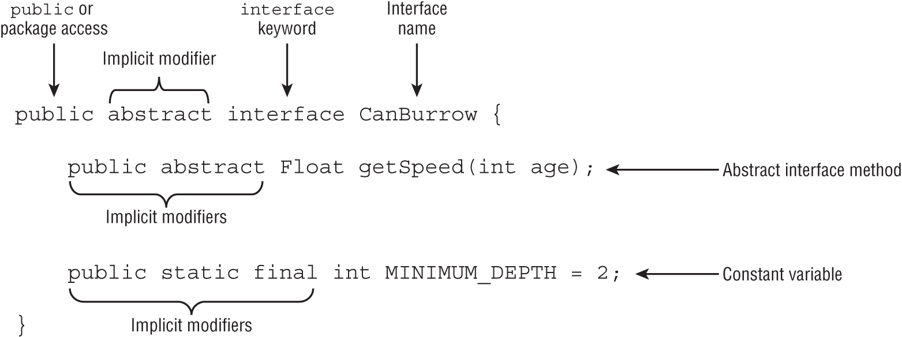

> Unlike a class, which can extend only one class, an interface can extend multiple interfaces.

- Interfaces are implicitly abstract.
- Interface variables are implicitly public, static, and final.
- Interface methods without a body are implicitly abstract.
- Interface methods without the private modifier are implicitly public.

| Item                  | Membership type | Required modifiers | Implicit modifiers  | Has value or body? |
| --------------------- | --------------- | ------------------ | ------------------- | ------------------ |
| Constant variable     | Class           | —                  | public static final | Yes                |
| abstract method       | Instance        | —                  | public abstract     | No                 |
| default method        | Instance        | default            | public              | Yes                |
| static method         | Class           | static             | public              | Yes                |
| private method        | Instance        | private            | —                   | Yes                |
| private static method | Class           | private static     | —                   | Yes                |

> Alongside public methods, interfaces now support private methods. They do not support protected access, though, as a class cannot extend an interface. They also do not support package access, although more likely for syntax reasons and backward compatibility


```java
public interface Soar {
   int MAX_HEIGHT = 10;
   final static boolean UNDERWATER = true;
   void fly(int speed);
   abstract void takeoff();
   public abstract double dive();
}
 
public abstract interface Soar {
   public static final int MAX_HEIGHT = 10;
   public final static boolean UNDERWATER = true;
   public abstract void fly(int speed);
   public abstract void takeoff();
   public abstract double dive();
}
```

```java
public interface Nocturnal {
   public int hunt();
}
 
public interface CanFly {
   public void flap();
}
 
public interface HasBigEyes extends Nocturnal, CanFly {}
 
public class Owl implements HasBigEyes {
   public int hunt() { return 5; }
   public void flap() { System.out.println("Flap!"); }
}
```


## Inheriting Duplicate Abstract Methods

By compatible, we mean a method can be written that properly overrides both inherited methods: for example, by using covariant return types

```java
public interface Herbivore { public void eatPlants(); }
 
public interface Omnivore  { public void eatPlants(); }
 
public class Bear implements Herbivore, Omnivore {
   public void eatPlants() {
      System.out.println("Eating plants");
   } }
```

```java
public interface Herbivore { public void eatPlants(); }
 
public interface Omnivore  { public int eatPlants(); }
 
public class Tiger implements Herbivore, Omnivore { // DOES NOT COMPILE
   …
}
```

## default methods

A default method is a method defined in an interface with the default keyword and includes a method body. It may be optionally overridden by a class implementing the interface.

One use of default methods is for backward compatibility. You can add a new default method to an interface without the need to modify all of the existing classes that implement the interface. The older classes will just use the default implementation of the method defined in the interface. 

- A default method may be declared only within an interface.
- A default method must be marked with the default keyword and include a method body.
- A default method is implicitly public.
- A default method cannot be marked abstract, final, or static.
- A default method may be overridden by a class that implements the interface.
If a class inherits two or more default methods with the same method signature, then the class must override the method.

```java
public interface IsColdBlooded {
   boolean hasScales();
   default double getTemperature() {
      return 10.0;
   } 
}

public class Snake implements IsColdBlooded {
   public boolean hasScales() {       // Required override
      return true;
   }
 
   public double getTemperature() {   // Optional override
      return 12;
   }
}
```

```java
public interface Walk {
   public default int getSpeed() { return 5; }
}
 
public interface Run {
   public default int getSpeed() { return 10; }
}

public class Cat implements Walk, Run {} // DOES NOT COMPILE
```

```java
public class Cat implements Walk, Run {
   public int getSpeed() { return 1; }
}
```

```java
public class Cat implements Walk, Run {
   public int getSpeed() {
      return 1;
   }
 
   public int getWalkSpeed() {
      return Walk.super.getSpeed();
   } 
}
```

## Declaring static Interface Methods

- A static method must be marked with the static keyword and include a method body.
- A static method without an access modifier is implicitly public.
- A static method cannot be marked abstract or final.
- A static method is not inherited and cannot be accessed in a class implementing the interface without a reference to the interface name.

```java
public interface Hop {
   static int getJumpHeight() {
      return 8;
   } }

public class Skip {
   public int skip() {
      return Hop.getJumpHeight();
   } 
}   
```   

```java
public class Bunny implements Hop {
   public void printDetails() {
      System.out.println(getJumpHeight()); // DOES NOT COMPILE
   } }
```

## Private static and private methods

- A private interface method must be marked with the private modifier and include a method body.
- A private static interface method may be called by any method within the interface definition.
- A private interface method may only be called by default and other private non-static methods within the interface definition.

```java
public interface Schedule {
   default void wakeUp()           { checkTime(7);  }
   private void haveBreakfast()    { checkTime(9);  }
   static void workOut()           { checkTime(18); }
   private static void checkTime(int hour) {
      if (hour> 17) {
         System.out.println("You're late!");
      } else {
         System.out.println("You have "+(17-hour)+" hours left "
               + "to make the appointment");
      } } }
```      

## Calling Abstract Methods

```java
public interface ZooRenovation {
   public String projectName();
   abstract String status();
   default void printStatus() {
      System.out.print("The " + projectName() + " project " + status());
   } }
```


# Enum


All enum constructors are implicitly private, with the modifier being optional. This is reasonable since you can't extend an enum and the constructors can be called only within the enum itself. In fact, an enum constructor will not compile if it contains a public or protected modifier.


```java
var s = Season.SUMMER;
System.out.println(Season.SUMMER);      // SUMMER
System.out.println(s == Season.SUMMER); // true
```

```java
public enum ExtendedSeason extends Season {} // DOES NOT COMPILE
```

```java
for(var season: Season.values()) {
   System.out.println(season.name() + " " + season.ordinal());
}
// WINTER 0
// SPRING 1
// SUMMER 2
// FALL 3
```

```java
Season s = Season.valueOf("SUMMER"); // SUMMER
Season t = Season.valueOf("summer"); // IllegalArgumentException
```

```java
public enum Season {
   WINTER("Low"), SPRING("Medium"), SUMMER("High"), FALL("Medium");
   private final String expectedVisitors;
   private Season(String expectedVisitors) {
      this.expectedVisitors = expectedVisitors;
   }
   public void printExpectedVisitors() {
      System.out.println(expectedVisitors);
   } }
```

```java
public enum Season {
   WINTER {
      public String getHours() { return "10am-3pm"; }
   },
   SPRING {
      public String getHours() { return "9am-5pm"; }
   },
   SUMMER {
      public String getHours() { return "9am-7pm"; }
   },
   FALL {
      public String getHours() { return "9am-5pm"; }
   };
   public abstract String getHours();
}
```

```java
public enum Season {
   WINTER {
      public String getHours() { return "10am-3pm"; }
   },
   SUMMER {
      public String getHours() { return "9am-7pm"; }
   },
   SPRING, FALL;
   public String getHours() { return "9am-5pm"; }
}
```

```java
public interface Weather { int getAverageTemperature(); }
 
public enum Season implements Weather {
   WINTER, SPRING, SUMMER, FALL;
   public int getAverageTemperature() { return 30; }
}
```

# Sealing Classes

 A sealed class is a class that restricts which other classes may directly extend it. These are brand new to Java 17

 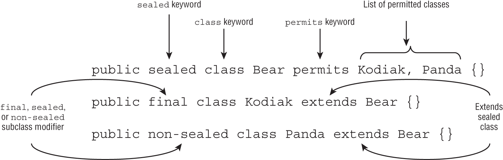


- **sealed**: Indicates that a class or interface may only be extended/implemented by named classes or interfaces
- **permits**: Used with the sealed keyword to list the classes and interfaces allowed
- **non-sealed**: Applied to a class or interface that extends a sealed class, indicating that it can be extended by unspecified classes

- Sealed classes are declared with the sealed and permits modifiers.
- Sealed classes must be declared in the same package or named module as their direct subclasses.
- Direct subclasses of sealed classes must be marked final, sealed, or non-sealed.
- The permits clause is optional if the sealed class and its direct subclasses are declared within the same file or the subclasses are nested within the sealed class.
- Interfaces can be sealed to limit the classes that implement them or the interfaces that extend them.

```java
public class sealed Frog permits GlassFrog {} // DOES NOT COMPILE
public final class GlassFrog extends Frog {}
 
public abstract sealed class Wolf permits Timber {}
public final class Timber extends Wolf {}
public final class MyWolf extends Wolf {} // DOES NOT COMPILE
```

> Sealed classes are commonly declared with the abstract modifier, although this is certainly not required.

```java
// Penguin.java
package zoo;
public sealed class Penguin permits Emperor {} // DOES NOT COMPILE
 
// Emperor.java
package zoo;
public final class Emperor {}
```

> Every class that directly extends a sealed class must specify exactly one of the following three modifiers: `final`, `sealed`, or `non-sealed`.

```java
public sealed class Antelope permits Gazelle {} 
public final class Gazelle extends Antelope {}
public class George extends Gazelle {} // DOES NOT COMPILE
```

```java
public sealed class Mammal permits Equine {}
public sealed class Equine extends Mammal permits Zebra {}
public final class Zebra extends Equine {}
```

```java
public sealed class Wolf permits Timber {}
public non-sealed class Timber extends Wolf {}
public class MyWolf extends Timber {}
```

## Omitting the permits Clause

Imagine that you have a Snake.java file with two top-level classes defined inside it

```java
// Snake.java
public sealed class Snake permits Cobra {}
final class Cobra extends Snake {}
```

may be without `permits`
```java
// Snake.java
public sealed class Snake {}
final class Cobra extends Snake {}
```

for nested classes

```java
// Snake.java
public sealed class Snake {
   final class Cobra extends Snake {}
}
```

```java
public sealed class Snake permits Cobra { // DOES NOT COMPILE
   final class Cobra extends Snake {}
}
```

```java
 public sealed class Snake permits Snake.Cobra {
       final class Cobra extends Snake {}
    }
 ```   

## Sealed interfaces

- Interfaces that extend a sealed interface can only be marked sealed or non-sealed. They cannot be marked final.

```java
// Sealed interface
public sealed interface Swims permits Duck, Swan, Floats {}
 
// Classes permitted to implement sealed interface
public final class Duck implements Swims {}
public final class Swan implements Swims {}
 
// Interface permitted to extend sealed interface
public non-sealed interface Floats extends Swims {}
```

# Encapsulation

Encapsulation is about protecting a class from unexpected use. It also allows us to modify the methods and behavior of the class later without someone already having direct access to an instance variable within the class. For example, we can change the data type of an instance variable but maintain the same method signatures. In this manner, we maintain full control over the internal workings of a class.

To review, remember that data (an instance variable) is private and getters/setters are public for encapsulation. You don't even have to provide getters and setters. As long as the instance variables are private, you are good. For example, the following class is well encapsulated, although it is not terribly useful since it doesn't declare any non-private methods:

```java
public class Vet {
   private String name = "Dr Rogers";
   private int yearsExperience = 25;
}
```

# Records

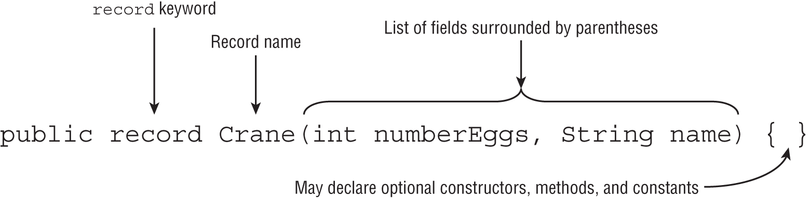

analogous encapsulated and immutable class

```java
public final class Crane {
   private final int numberEggs;
   private final String name;
   public Crane(int numberEggs, String name) {
      this.numberEggs = numberEggs; 
      this.name = name;
   }
   public int getNumberEggs() {    
      return numberEggs;
   }
   public String getName() {
      return name;
   } 
}
```

just in one row
```java
public record Crane(int numberEggs, String name) {}
```

legal but redundant
```java
public final record Crane(int numberEggs, String name) {}
```

As a bonus, the compiler inserts useful implementations of the Object methods `equals()`, `hashCode()`, and `toString()`

```java
var mommy = new Crane(4, "Cammy");
System.out.println(mommy.numberEggs());   // 4
System.out.println(mommy.name());         // Cammy
```

```java
var father = new Crane(0, "Craig");
System.out.println(father);               // Crane[numberEggs=0, name=Craig]
 
var copy = new Crane(0, "Craig");
System.out.println(copy);                 // Crane[numberEggs=0, name=Craig]
System.out.println(father.equals(copy));  // true
System.out.println(father.hashCode() + ", " + copy.hashCode()); // 1007, 1007
```

it's legal
```java
public record Crane() {}
```

```java
public record BlueCrane() extends Crane {} // DOES NOT COMPILE
```

```java
public interface Bird {}
public record Crane(int numberEggs, String name) implements Bird {}
```

## Declaring Constructors

### Long constructor

```java
public record Crane(int numberEggs, String name) {
   public Crane(int numberEggs, String name) {
      if (numberEggs < 0) throw new IllegalArgumentException();
      this.numberEggs = numberEggs;
      this.name = name;
   }
}
```

```java
public record Crane(int numberEggs, String name) {
   public Crane(int numberEggs, String name) {} // DOES NOT COMPILE
}
```

### Compact constructor

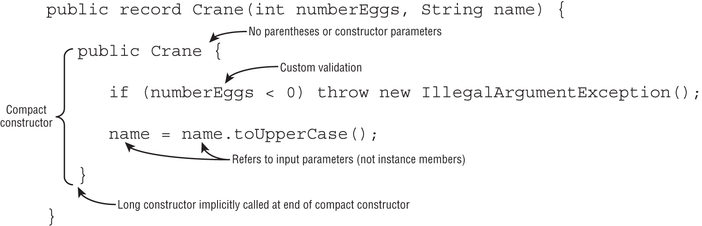

```java
public record Crane(int numberEggs, String name) {
   public Crane {
      if (name == null || name.length() < 1)
         throw new IllegalArgumentException();
      name = name.substring(0,1).toUpperCase() 
         + name.substring(1).toLowerCase();
   }
}
```

```java
public record Crane(int numberEggs, String name) {
   public Crane {
      this.numberEggs = 10; // DOES NOT COMPILE
   }
}
```

### Overloaded Constructors

```java
public record Crane(int numberEggs, String name) {
   public Crane(String firstName, String lastName) {
      this(0, firstName + " " + lastName);
   }
}
```

```java
public record Crane(int numberEggs, String name) {
   public Crane(int numberEggs, String firstName, String lastName) {
      this(numberEggs + 1, firstName + " " + lastName);
      numberEggs = 10; // NO EFFECT (applies to parameter, not instance field)
      this.numberEggs = 20; // DOES NOT COMPILE
   }
}
```

```java
public record Crane(int numberEggs, String name) {
   public Crane(String name) {
      this(1);  // DOES NOT COMPILE
   }
   public Crane(int numberEggs) {
      this("");  // DOES NOT COMPILE
   }
}
```

## Customized records

members that records can include:

- Overloaded and compact constructors
- instance methods including overriding any provided methods (accessors, equals(), hashCode(), toString())
- Nested classes, interfaces, annotations, enum, and records

```java
public record Crane(int numberEggs, String name) {
   @Override public int numberEggs() { return 10; }
   @Override public String toString() { return name; }
}
```

While you can add methods, static fields, and other data types, you cannot add instance fields outside the record declaration, even if they are private. 

Records also do not support instance initializers. All initialization for the fields of a record must happen in a constructor.

```java
public record Crane(int numberEggs, String name) {
   private static int type = 10;
   public int size;              // DOES NOT COMPILE
   private boolean friendly;     // DOES NOT COMPILE
}
```

# Nested classes

- **Inner class**: A non-static type defined at the member level of a class
- **Static nested class**: A static type defined at the member level of a class
- **Local class**: A class defined within a method body
- **Anonymous class**: A special case of a local class that does not have a name

> With the introduction of records in Java 16, the existing rule that prevented an inner class from having any static members (other than static constants) was removed. All four types of nested classes can now define static variables and methods!

## Inner class

- Can be declared public, protected, package, or private
- Can extend a class and implement interfaces
- Can be marked abstract or final
- Can access members of the outer class, including private members


```java
 public class Home {
   private String greeting = "Hi";   // Outer class instance variable

   protected class Room {            // Inner class declaration
      public int repeat = 3;
      public void enter() {
         for (int i = 0; i < repeat; i++) greet(greeting);
      }

      private static void greet(String message) {
         System.out.println(message);
      }
    }

    public void enterRoom() {         // Instance method in outer class
       var room = new Room();         // Create the inner class instance
       room.enter();
    }

    public static void main(String[] args) {
       var home = new Home();         // Create the outer class instance
       home.enterRoom();
   } 
 }
```

You should be expecting the `Home.class` file. For the inner class, the compiler creates `Home$Room.class`

### Instantiating an Instance of an Inner Class

```java
public static void main(String[] args) {
   var home = new Home();
   Room room = home.new Room(); // Create the inner class instance
   room.enter();

   new Home().new Room().enter(); 
}
```


```java
public class A {
   private int x = 10;
   class B {
      private int x = 20;
      class C {
         private int x = 30;
         public void allTheX() {
            System.out.println(x);        // 30
            System.out.println(this.x);   // 30
            System.out.println(B.this.x); // 20
            System.out.println(A.this.x); // 10
   } } }
   public static void main(String[] args) {
      A a = new A();
      A.B b = a.new B();
      A.B.C c = b.new C();
      c.allTheX();
}}
```

 We could have written B as the type because that is available at the member level of A. Java knows where to look for it. Then we instantiate a C. This time, the A.B.C type is necessary to specify. C is too deep for Java to know where to look

## static nested class

- A static nested class is a static type defined at the member level. Unlike an inner class, a static nested class can be instantiated without an instance of the enclosing class. 
- it can't access instance variables or methods declared in the outer class.
- The nesting creates a namespace because the enclosing class name must be used to refer to it.
- It can additionally be marked private or protected.
- The enclosing class can refer to the fields and methods of the static nested class.

```java
public class Park {
   static class Ride {
      private int price = 6;
   }
   public static void main(String[] args) {
      var ride = new Ride();
      System.out.println(ride.price);
} }
```

## Local Class

- A local class is a nested class defined within a method. 
- Like local variables, a local class declaration does not exist until the method is invoked, and it goes out of scope when the method returns. You can create instances only from within the method. 
- Those instances can still be returned from the method. This is just how local variables work
- It can be declared inside constructors and initializers.
- They do not have an access modifier.
- They can be declared final or abstract.
- They have access to all fields and methods of the enclosing class (when defined in an instance method).
- They can access final and effectively final local variables.

```java
public class PrintNumbers {
   private int length = 5;
   public void calculate() {
      final int width = 20;
      class Calculator {
         public void multiply() {
            System.out.print(length * width);
         }
      }
      var calculator = new Calculator();
      calculator.multiply();
   }
   public static void main(String[] args) {
      var printer = new PrintNumbers();
      printer.calculate();  // 100
   }
}
```

```java
public void processData() {
   final int length = 5;
   int width = 10;
   int height = 2;
   class VolumeCalculator {
      public int multiply() {
         return length * width * height; // DOES NOT COMPILE
      }
   }
   width = 2;
}
```

```java
public class Zebra {
   private int x = 24;
   public int hunt() {
      String message = "x is ";
      abstract class Stripes {
         private int x = 0;
         public void print() {
            System.out.print(message + Zebra.this.x); // x is 24
         }
      }
      var s = new Stripes() {};
      s.print();
      return x;
   }
   public static void main(String[] args) {
      new Zebra().hunt();
   } }
```

## Anonymous classes

- An anonymous class is a specialized form of a local class that does not have a name. 
- It is declared and instantiated all in one statement using the `new` keyword, a type name with parentheses, and a set of braces {}. 
- Anonymous classes must extend an existing class or implement an existing interface. 
- They are useful when you have a short implementation that will not be used anywhere else.

```java
public class ZooGiftShop {
   abstract class SaleTodayOnly {
      abstract int dollarsOff();
   }
   public int admission(int basePrice) {
      SaleTodayOnly sale = new SaleTodayOnly() {
         int dollarsOff() { return 3; }
      }; // Don't forget the semicolon!
      return basePrice - sale.dollarsOff();
} }
```

```java
public class ZooGiftShop {
   interface SaleTodayOnly {
      int dollarsOff();
   }
   public int admission(int basePrice) {
      SaleTodayOnly sale = new SaleTodayOnly() {
         public int dollarsOff() { return 3; }
      };
      return basePrice - sale.dollarsOff();
} }
```

```java
public class Gorilla {
   interface Climb {}
   Climb climbing = new Climb() {};
}
```

But what if we want to both implement an interface and extend a class? You can't do so with an anonymous class unless the class to extend is java.lang.Object


# Polymorphism discussion

**polymorphism**, the property of an object to take on many different forms. 

a Java object may be accessed using:

- A reference with the same type as the object
- A reference that is a superclass of the object
- A reference that defines an interface the object implements or inherits

The type of the object determines which properties exist within the object in memory.

The type of the reference to the object determines which methods and variables are accessible to the Java program.

```java
public class Primate {
   public boolean hasHair() {
      return true;
   }
}
 
public interface HasTail {
   public abstract boolean isTailStriped();
}
 
public class Lemur extends Primate implements HasTail {
   public boolean isTailStriped() {
      return false;
   }
   public int age = 10;
   public static void main(String[] args) {
      Lemur lemur = new Lemur();
      System.out.println(lemur.age);
 
      HasTail hasTail = lemur;
      System.out.println(hasTail.isTailStriped());
 
      Primate primate = lemur;
      System.out.println(primate.hasHair());
   } }
```

```java
Lemur lemur = new Lemur();
Primate primate = lemur;       // Implicit Cast to supertype
Lemur lemur2 = (Lemur)primate; // Explicit Cast to subtype
Lemur lemur3 = primate;        // DOES NOT COMPILE (missing cast)
```

- Casting a reference from a subtype to a supertype doesn't require an **explicit cast**. There is **implicit cast**
- Casting a reference from a supertype to a subtype requires an **explicit cast**.
- At runtime, an invalid cast of a reference to an incompatible type results in a `ClassCastException` being thrown.
- The compiler disallows casts to unrelated types.

```java
public class Bird {}
 
public class Fish {
   public static void main(String[] args) {
      Fish fish = new Fish();
      Bird bird = (Bird)fish;  // DOES NOT COMPILE
   }
}
```

In this example, the classes Fish and Bird are not related through any class hierarchy that the compiler is aware of. While they both extend Object implicitly, they are considered unrelated types since one cannot be a subtype of the other.

And for instanceof as well

```java
public class Bird {}
 
public class Fish {
   public static void main(String[] args) {
      Fish fish = new Fish();
      if (fish instanceof Bird b) { // DOES NOT COMPILE
         // Do stuff
      }
   }
}
```


While the compiler can enforce rules about casting to unrelated types for classes, it cannot always do the same for interfaces. Remember, instances support multiple inheritance, which limits what the compiler can reason about them. While a given class may not implement an interface, it's possible that some subclass may implement the interface. When holding a reference to a particular class, the compiler doesn't know which specific subtype it is holding.
```java
 interface Canine {}
 interface Dog {}
 class Wolf implements Canine {}

 public class BadCasts {
    public static void main(String[] args) {
       Wolf wolfy = new Wolf();
       Dog badWolf = (Dog)wolfy;
    } }
```

This limitation aside, the compiler can enforce one rule around interface casting. The compiler does not allow a cast from an interface reference to an object reference if the object type cannot possibly implement the interface, such as if the class is marked final. For example, if the Wolf interface is marked final on line 3, then line 8 no longer compiles. The compiler recognizes that there are no possible subclasses of Wolf capable of implementing the Dog interface.

# Lambdas and Functional Interfaces

## Lambda syntax

Lambdas allow you to specify code that will be run later in the program.

```java
public record Animal(String species, boolean canHop, boolean canSwim) { }

public interface CheckTrait {
   boolean test(Animal a);
}
```

```java
a -> a.canHop()
```

- A single parameter specified with the name a
- The arrow operator (->) to separate the parameter and body
- A body that calls a single method and returns the result of that method

```java
(Animal a) -> { return a.canHop(); }
```
- A single parameter specified with the name a and stating that the type is Animal
- The arrow operator (->) to separate the parameter and body
- A body that has one or more lines of code, including a semicolon and a return statement

valid
```java
a -> { return a.canHop(); }
(Animal a) -> a.canHop()
```

The parentheses around the lambda parameters can be omitted only if there is a single parameter and its type is not explicitly stated

fun but valid
```java
 s -> {}
```

valid lambdas examples
```java
() -> true
x -> x.startsWith("test")
(String x) -> x.startsWith("test")
(x, y) -> { return x.startsWith("test"); }
(String x, String y) -> x.startsWith("test")
```


```java
var invalid = (Animal a) -> a.canHop();  // DOES NOT COMPILE
```

```java
Predicate<String> p = x -> true;
Predicate<String> p = (var x) -> true;
Predicate<String> p = (String x) -> true;
```

```java
public void counts(List<Integer> list) {
   list.sort((final var x, @Deprecated var y) -> x.compareTo(y));
}
```

```java
(var x, y) -> "Hello"                  // DOES NOT COMPILE
(var x, Integer y) -> true             // DOES NOT COMPILE
(String x, var y, Integer z) -> true   // DOES NOT COMPILE
(Integer x, y) -> "goodbye"            // DOES NOT COMPILE
```

## Using Local Variables Inside a Lambda Body

```java
(a, b) -> { int c = 0; return 5; }
```

```java
(a, b) -> { int a = 0; return 5; }     // DOES NOT COMPILE
```

```java
public void variables(int a) {
   int b = 1;
   Predicate<Integer> p1 = a -> {  // DOES NOT COMPILE
      int b = 0;                    // DOES NOT COMPILE
      int c = 0;
      return b == c; }              // DOES NOT COMPILE
}
```

## Referencing Variables from the Lambda Body

-  Instance variables (and class variables) are always allowed to reference
-  lambdas cannot access are variables that are not final or effectively final

```java
public class Crow {
   private String color;
   public void caw(String name) {
      String volume = "loudly";
      Consumer<String> consumer = s -> System.out.println(name + " says " + volume + " that she is " + color);
   }
}
```

## Functional interface

A functional interface is an interface that contains a single abstract method

```java
@FunctionalInterface
public interface Dance {  // DOES NOT COMPILE
   void move();
   void rest();
}
```

```java
@FunctionalInterface
public interface Sprint {
   public void sprint(int speed);
}
 
public class Tiger implements Sprint {
   public void sprint(int speed) {
      System.out.println("Animal is sprinting fast! " + speed);
   }
}


public interface Dash extends Sprint {}  // Functional interface
 
public interface Skip extends Sprint {  // Not Functional interface
   void skip();
}
 
public interface Sleep {            // Not Functional interface
   private void snore() {}
   default int getZzz() { return 1; }
}
 
public interface Climb {         // Functional interface
   void reach();
   default void fall() {}
   static int getBackUp() { return 100; }
   private static boolean checkHeight() { return true; }
}
```

If a functional interface includes an abstract method with the same signature as a public method found in Object, those methods do not count toward the single abstract method test

Since Java assumes all classes extend from Object, you also cannot declare an interface method that is incompatible with Object. For example, declaring an abstract method `int toString()` in an interface would not compile since Object's version of the method returns a String.

```java
@FunctionalInterface
public interface Dive {
   String toString();
   public boolean equals(Object o);
   public abstract int hashCode();
   public void dive();
}
```


## Method References

```java
public interface LearnToSpeak {
   void speak(String sound);
}

public class DuckHelper {
   public static void teacher(String name, LearnToSpeak trainer) {
      // Exercise patience (omitted)
      trainer.speak(name);
   }
}

public class Duckling {
   public static void makeSound(String sound) {
      LearnToSpeak learner = s -> System.out.println(s);
      DuckHelper.teacher(sound, learner);
   }
}
```

or
```java
LearnToSpeak learner = System.out::println;
```

There are four formats for method references:

- static methods
- Instance methods on a particular object
- Instance methods on a parameter to be determined at runtime
- Constructors

### Calling static Methods

```java
interface Converter { 
   long round(double num);
}

Converter methodRef = Math::round;
Converter lambda = x -> Math.round(x);

System.out.println(methodRef.round(100.1));  // 100
```

### Calling Instance Methods on a Particular Object

```java
interface StringStart {
   boolean beginningCheck(String prefix);
}

var str = "Zoo";
StringStart methodRef = str::startsWith;
StringStart lambda = s -> str.startsWith(s);

System.out.println(methodRef.beginningCheck("A"));  // false
```

```java
interface StringChecker {
   boolean check();
}

var str = "";
StringChecker methodRef = str::isEmpty;
StringChecker lambda = () -> str.isEmpty();

System.out.print(methodRef.check());  // true
```

While all method references can be turned into lambdas, the opposite is not always true.

```java
var str = "";
StringChecker lambda = () -> str.startsWith("Zoo");

StringChecker methodReference = str::startsWith;         // DOES NOT COMPILE
StringChecker methodReference = str::startsWith("Zoo");  // DOES NOT COMPILE
```

### Calling Instance Methods on a Parameter

```java
interface StringParameterChecker {
   boolean check(String text);
}

StringParameterChecker methodRef = String::isEmpty;
StringParameterChecker lambda = s -> s.isEmpty();

System.out.println(methodRef.check("Zoo"));  // false
```

```java
interface StringTwoParameterChecker {
   boolean check(String text, String prefix);
}

StringTwoParameterChecker methodRef = String::startsWith;
StringTwoParameterChecker lambda = (s, p) -> s.startsWith(p);

System.out.println(methodRef.check("Zoo", "A"));  // false
```

### Calling Constructors

```java
interface EmptyStringCreator {
   String create();
}

EmptyStringCreator methodRef = String::new;
EmptyStringCreator lambda = () -> new String();

var myString = methodRef.create();
System.out.println(myString.equals("Snake"));  // false
```

```java
interface StringCopier {
   String copy(String value);
}

StringCopier methodRef = String::new;
StringCopier lambda = x -> new String(x);

var myString = methodRef.copy("Zebra");
System.out.println(myString.equals("Zebra"));  // true
```


## General functional interfaces


| Functional interface  | Return type | Method name   | # of parameters |
| --------------------- | ----------- | ------------- | --------------- |
| `Supplier<T>`         | `T`         | `get()`       | 0               |
| `Consumer<T>`         | `void`      | `accept(T)`   | 1 (T)           |
| `BiConsumer<T, U>`    | `void`      | `accept(T,U)` | 2 (T, U)        |
| `Predicate<T>`        | `boolean`   | `test(T)`     | 1 (T)           |
| `BiPredicate<T, U>`   | `boolean`   | `test(T,U)`   | 2 (T, U)        |
| `Function<T, R>`      | `R`         | `apply(T)`    | 1 (T)           |
| `BiFunction<T, U, R>` | `R`         | `apply(T,U)`  | 2 (T, U)        |
| `UnaryOperator<T>`    | `T`         | `apply(T)`    | 1 (T)           |
| `BinaryOperator<T>`   | `T`         | `apply(T,T)`  | 2 (T, T)        |

### Supplier

A Supplier is used when you want to generate or supply values without taking any input.

```java
@FunctionalInterface
public interface Supplier<T> {
   T get();
}
```

```java
Supplier<LocalDate> s1 = LocalDate::now;
Supplier<LocalDate> s2 = () -> LocalDate.now();
 
LocalDate d1 = s1.get();
LocalDate d2 = s2.get();
 
System.out.println(d1);  // 2022-02-20
System.out.println(d2);  // 2022-02-20
```

```java
Supplier<StringBuilder> s1 = StringBuilder::new;
Supplier<StringBuilder> s2 = () -> new StringBuilder();
 
System.out.println(s1.get()); // Empty string
System.out.println(s2.get()); // Empty string
```

```java
Supplier<ArrayList<String>> s3 = ArrayList::new;
ArrayList<String> a1 = s3.get();
System.out.println(a1);  // []
```

### Consumer and BiConsumer

You use a Consumer when you want to do something with a parameter but not return anything. 

```java
@FunctionalInterface
public interface Consumer<T> {
   void accept(T t);
   // omitted default method
}
 
@FunctionalInterface
public interface BiConsumer<T, U> {
   void accept(T t, U u);
   // omitted default method
}
```

```java
Consumer<String> c1 = System.out::println;
Consumer<String> c2 = x -> System.out.println(x);
 
c1.accept("Annie"); // Annie
c2.accept("Annie"); // Annie
```

```java
var map = new HashMap<String, Integer>();
BiConsumer<String, Integer> b1 = map::put;
BiConsumer<String, Integer> b2 = (k, v) -> map.put(k, v);
 
b1.accept("chicken", 7);
b2.accept("chick", 1);
 
System.out.println(map);  // {chicken=7, chick=1}
```

### Predicate and BiPredicate

Predicate is often used when filtering or matching. Both are common operations

```java
@FunctionalInterface
public interface Predicate<T> {
   boolean test(T t);
   // omitted default and static methods
}
 
@FunctionalInterface
public interface BiPredicate<T, U> {
   boolean test(T t, U u);
   // omitted default methods
}
```

```java
Predicate<String> p1 = String::isEmpty;
Predicate<String> p2 = x -> x.isEmpty();
 
System.out.println(p1.test("")); // true
System.out.println(p2.test("")); // true
```

```java
BiPredicate<String, String> b1 = String::startsWith;
BiPredicate<String, String> b2 =
   (string, prefix) -> string.startsWith(prefix);
 
System.out.println(b1.test("chicken", "chick")); // true
System.out.println(b2.test("chicken", "chick")); // true
```

### Function and BiFunction

- A `Function` is responsible for turning one parameter into a value of a potentially different type and returning it. 
- A `BiFunction` is responsible for turning two parameters into a value and returning it.

```java
@FunctionalInterface
public interface Function<T, R> {
   R apply(T t);
   // omitted default and static methods
}
 
@FunctionalInterface
public interface BiFunction<T, U, R> {
   R apply(T t, U u);
   // omitted default method
}
```

```java
Function<String, Integer> f1 = String::length;
Function<String, Integer> f2 = x -> x.length();
 
System.out.println(f1.apply("cluck")); // 5
System.out.println(f2.apply("cluck")); // 5
```

```java
BiFunction<String, String, String> b1 = String::concat;
BiFunction<String, String, String> b2 =
   (string, toAdd) -> string.concat(toAdd);
 
System.out.println(b1.apply("baby ", "chick")); // baby chick
System.out.println(b2.apply("baby ", "chick")); // baby chick
```

### UnaryOperator and BinaryOperator

`UnaryOperator` and `BinaryOperator` are special cases of a `Function`. They require all type parameters to be the same type. 

```java
@FunctionalInterface
public interface UnaryOperator<T> extends Function<T, T> { 
   // omitted static method
}
 
@FunctionalInterface
public interface BinaryOperator<T> extends BiFunction<T, T, T> {
   // omitted static methods 
}
```

```java
UnaryOperator<String> u1 = String::toUpperCase;
UnaryOperator<String> u2 = x -> x.toUpperCase();
 
System.out.println(u1.apply("chirp")); // CHIRP
System.out.println(u2.apply("chirp")); // CHIRP
```

```java
BinaryOperator<String> b1 = String::concat;
BinaryOperator<String> b2 = (string, toAdd) -> string.concat(toAdd);
 
System.out.println(b1.apply("baby ", "chick")); // baby chick
System.out.println(b2.apply("baby ", "chick")); // baby chick
```

### Convenience Methods on Functional Interfaces

| Interface instance | Method return type | Method name | Method parameters |
| ------------------ | ------------------ | ----------- | ----------------- |
| Consumer           | Consumer           | `andThen()` | Consumer          |
| Function           | Function           | `andThen()` | Function          |
| Function           | Function           | `compose()` | Function          |
| Predicate          | Predicate          | `and()`     | Predicate         |
| Predicate          | Predicate          | `negate()`  | —                 |
| Predicate          | Predicate          | `or()`      | Predicate         |

```java
Predicate<String> egg = s -> s.contains("egg");
Predicate<String> brown = s -> s.contains("brown");

Predicate<String> brownEggs = egg.and(brown);
Predicate<String> otherEggs = egg.and(brown.negate());
```

```java
Consumer<String> c1 = x -> System.out.print("1: " + x);
Consumer<String> c2 = x -> System.out.print(",2: " + x);
 
Consumer<String> combined = c1.andThen(c2);
combined.accept("Annie");  // 1: Annie,2: Annie
```

```java
Function<Integer, Integer> before = x -> x + 1;
Function<Integer, Integer> after = x -> x * 2;
 
Function<Integer, Integer> combined = after.compose(before);
System.out.println(combined.apply(3));   // 8
```

## Functional Interfaces for Primitives

```java
@FunctionalInterface
public interface BooleanSupplier {
   boolean getAsBoolean();
}
```

```java
BooleanSupplier b1 = () -> true;
BooleanSupplier b2 = () -> Math.random()> .5;
System.out.println(b1.getAsBoolean()); // true
System.out.println(b2.getAsBoolean()); // false
```

<table>
<thead>
<tr>
<th scope="col" class="left">Functional interfaces</th>
<th scope="col" class="left">Return type</th>
<th scope="col" class="left">Single abstract method</th>
<th scope="col" class="left"># of parameters</th> </tr> </thead>
<tbody>
<tr>
<td class="left"><code>DoubleSupplier</code> <br> <code>IntSupplier</code> <br> <code>LongSupplier</code></td>
<td class="left"><code>double</code> <br> <code>int</code> <br> <code>long</code></td>
<td class="left"><code>getAsDouble</code> <br> <code>getAsInt</code> <br> <code>getAsLong</code></td>
<td class="left">0</td> </tr>
<tr>
<td class="left"><code>DoubleConsumer</code> <br> <code>IntConsumer</code> <br> <code>LongConsumer</code></td>
<td class="left"><code>void</code></td>
<td class="left"><code>accept</code></td>
<td class="left">1 (<code>double</code>)<br> 1 (<code>int</code>)<br> 1 (<code>long</code>)</td> </tr>
<tr>
<td class="left"><code>DoublePredicate</code> <br> <code>IntPredicate</code> <br> <code>LongPredicate</code></td>
<td class="left"><code>boolean</code></td>
<td class="left"><code>test</code></td>
<td class="left">1 (<code>double</code>)<br> 1 (<code>int</code>)<br> 1 (<code>long</code>)</td> </tr>
<tr>
<td class="left"><code>DoubleFunction&lt;R&gt;</code> <br> <code>IntFunction&lt;R&gt;</code> <br> <code>LongFunction&lt;R&gt;</code></td>
<td class="left"><code>R</code></td>
<td class="left"><code>apply</code></td>
<td class="left">1 (<code>double</code>)<br> 1 (<code>int</code>)<br> 1 (<code>long</code>)</td> </tr>
<tr>
<td class="left"><code>DoubleUnaryOperator</code> <br> <code>IntUnaryOperator</code> <br> <code>LongUnaryOperator</code></td>
<td class="left"><code>double</code> <br> <code>int</code> <br> <code>long</code></td>
<td class="left"><code>applyAsDouble</code> <br> <code>applyAsInt</code> <br> <code>applyAsLong</code></td>
<td class="left">1 (<code>double</code>)<br> 1 (<code>int</code>)<br> 1 (<code>long</code>)</td> </tr>
<tr>
<td class="left"><code>DoubleBinaryOperator</code> <br> <code>IntBinaryOperator</code> <br> <code>LongBinaryOperator</code></td>
<td class="left"><code>double</code> <br> <code>int</code> <br> <code>long</code></td>
<td class="left"><code>applyAsDouble</code> <br> <code>applyAsInt</code> <br> <code>applyAsLong</code></td>
<td class="left">2 (<code>double, double</code>)<br> 2 (<code>int</code>, <code>int</code>)<br> 2 (<code>long</code>, <code>long</code>)</td> </tr> </tbody> </table>

<details>

| Functional interfaces  | Return type   | Single abstract method   |
| ---------------------- | ------------- | ------------------------ |
| DoubleSupplier         | double        | getAsDouble              |
| IntSupplier            | int           | getAsInt                 |
| LongSupplier           | long          | getAsLong                |
| ---------------------- | ------------- | ------------------------ |
| DoubleConsumer         | void          | accept                   |
| IntConsumer            | void          | accept                   |
| LongConsumer           | void          | accept                   |
| ---------------------- | ------------- | ------------------------ |
| DoublePredicate        | boolean       | test                     |
| IntPredicate           | boolean       | test                     |
| LongPredicate          | boolean       | test                     |
| ---------------------- | ------------- | ------------------------ |
| DoubleFunction<R>      | R             | apply                    |
| IntFunction<R>         | R             | apply                    |
| LongFunction<R>        | R             | apply                    |
| ---------------------- | ------------- | ------------------------ |
| DoubleUnaryOperator    | double        | applyAsDouble            |
| IntUnaryOperator       | int           | applyAsInt               |
| LongUnaryOperator      | long          | applyAsLong              |
| ---------------------- | ------------- | ------------------------ |
| DoubleBinaryOperator   | double        | applyAsDouble            |
| IntBinaryOperator      | int           | applyAsInt               |
| LongBinaryOperator     | long          | applyAsLong              |

| Functional interfaces     | Return type   | Single abstract method   |
| ------------------------- | ------------- | ------------------------ |
| ToDoubleFunction<T>       | double        | applyAsDouble            |
| ToIntFunction<T>          | int           | applyAsInt               |
| ToLongFunction<T>         | long          | applyAsLong              |
| ------------------------- | ------------- | ------------------------ |
| ToDoubleBiFunction<T, U>  | double        | applyAsDouble            |
| ToIntBiFunction<T, U>     | int           | applyAsInt               |
| ToLongBiFunction<T, U>    | long          | applyAsLong              |
| ------------------------- | ------------- | ------------------------ |
| DoubleToIntFunction       | int           | applyAsInt               |
| DoubleToLongFunction      | long          | applyAsLong              |
| ------------------------- | ------------- | ------------------------ |
| IntToDoubleFunction       | double        | applyAsDouble            |
| IntToLongFunction         | long          | applyAsLong              |
| ------------------------- | ------------- | ------------------------ |
| LongToDoubleFunction      | double        | applyAsDouble            |
| LongToIntFunction         | int           | applyAsInt               |
| ------------------------- | ------------- | ------------------------ |
| ObjDoubleConsumer<T>      | void          | accept                   |
| ObjIntConsumer<T>         | void          | accept                   |
| ObjLongConsumer<T>        | void          | accept                   |
</details>

# Collections Framework

## Overview

Interfaces - rectangles
Classes - ovals

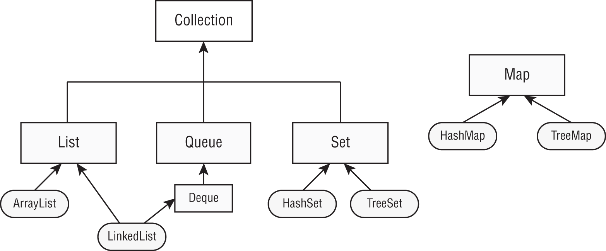

## Common methods for Collections

```java
public boolean add(E element)
public boolean remove(Object object)
public boolean removeIf(Predicate<? super E> filter)
public boolean isEmpty()
public int size()
public void clear()
public boolean contains(Object object)
public void forEach(Consumer<? super T> action)
boolean equals(Object object)
```

```java
Collection<String> list = new ArrayList<>();
System.out.println(list.add("Sparrow")); // true
System.out.println(list.add("Sparrow")); // true

Collection<String> set = new HashSet<>();
System.out.println(set.add("Sparrow")); // true
System.out.println(set.add("Sparrow")); // false
```

```java
Collection<String> birds = new ArrayList<>();
birds.add("hawk");                            // [hawk]
birds.add("hawk");                            // [hawk, hawk]
System.out.println(birds.remove("cardinal")); // false  // removes only one match.
System.out.println(birds.remove("hawk"));     // true
System.out.println(birds);                    // [hawk]
```

```java
Collection<String> list = new ArrayList<>();
list.add("Magician");
list.add("Assistant");
System.out.println(list);     // [Magician, Assistant]
list.removeIf(s -> s.startsWith("A"));
System.out.println(list);     // [Magician]
```

```java
Collection<String> set = new HashSet<>();
set.add("Wand");
set.add("");
set.removeIf(String::isEmpty); // s -> s.isEmpty()
System.out.println(set);       // [Wand]
```

```java
Collection<String> birds = new ArrayList<>();
System.out.println(birds.isEmpty()); // true
System.out.println(birds.size());    // 0
birds.add("hawk");                   // [hawk]
birds.add("hawk");                   // [hawk, hawk]
System.out.println(birds.isEmpty()); // false
System.out.println(birds.size());    // 2
```

```java
Collection<String> birds = new ArrayList<>();
birds.add("hawk");                   // [hawk]
birds.add("hawk");                   // [hawk, hawk]
System.out.println(birds.isEmpty()); // false
System.out.println(birds.size());    // 2
birds.clear();                       // []
System.out.println(birds.isEmpty()); // true
System.out.println(birds.size());    // 0
```

```java
Collection<String> birds = new ArrayList<>();
birds.add("hawk"); // [hawk]
System.out.println(birds.contains("hawk"));  // true
System.out.println(birds.contains("robin")); // false
```

```java
Collection<String> cats = List.of("Annie", "Ripley");
cats.forEach(System.out::println);
cats.forEach(c -> System.out.println(c));
```

```java
var list1 = List.of(1, 2);
var list2 = List.of(2, 1);
var set1 = Set.of(1, 2);
var set2 = Set.of(2, 1);

System.out.println(list1.equals(list2));  // false
System.out.println(set1.equals(set2));    // true
System.out.println(list1.equals(set1));   // false
```

## Lists

### Comparing Lists

- The main benefit of an `ArrayList` is that you can look up any element in constant time. Adding or removing an element is slower than accessing an element. This makes an ArrayList a good choice when you are reading more often than (or the same amount as) writing to the ArrayList.
- A `LinkedList` is special because it implements both `List` and `Deque`. It has all the methods of a List. It also has additional methods to facilitate adding or removing from the beginning and/or end of the list. The main benefits of a LinkedList are that you can access, add to, and remove from the beginning and end of the list in constant time. The trade-off is that dealing with an arbitrary index takes linear time

### Create list via factory methods

| Method                    | Description                                                      | Can add elements? | Can replace elements? | Can delete elements? |
| ------------------------- | ---------------------------------------------------------------- | ----------------- | --------------------- | -------------------- |
| `Arrays.asList(varargs)`  | Returns fixed size list backed by an array                       | No                | Yes                   | No                   |
| `List.of(varargs)`        | Returns immutable list                                           | No                | No                    | No                   |
| `List.copyOf(collection)` | Returns immutable list with copy of original collection's values | No                | No                    | No                   |

```java
String[] array = new String[] {"a", "b", "c"};
List<String> asList = Arrays.asList(array); // [a, b, c]
List<String> of = List.of(array);           // [a, b, c]
List<String> copy = List.copyOf(asList);    // [a, b, c]
array[0] = "z";
System.out.println(asList);                 // [z, b, c]
System.out.println(of);                     // [a, b, c]
System.out.println(copy);                   // [a, b, c]
asList.set(0, "x");
System.out.println(Arrays.toString(array)); // [x, b, c]
copy.add("y");            // UnsupportedOperationException
```

### Create lists via constructors

```java
var linked1 = new LinkedList<String>();
var linked2 = new LinkedList<String>(linked1);

var list1 = new ArrayList<String>();
var list2 = new ArrayList<String>(list1);
var list3 = new ArrayList<String>(10); // kind of size of the underlying array.
```

fun but valid
```java
var list = new ArrayList<>(); // ArrayList<Object>
```

```java
var list = new ArrayList<>();
list.add("a");
for (String s: list) { } // DOES NOT COMPILE
```

### Lists methods

- `public boolean add(E element)`	Adds element to end (available on all Collection APIs).
- `public void add(int index, E element)`	Adds element at index and moves the rest toward the end.
- `public E get(int index)`	Returns element at index.
- `public E remove(int index)`	Removes element at index and moves the rest toward the front.
- `public default void replaceAll(UnaryOperator<E> op)`	Replaces each element in list with result of operator.
- `public E set(int index, E e)`	Replaces element at index and returns original. Throws `IndexOutOfBoundsException` if index is invalid.
- `public default void sort(Comparator<? super E> c)`	Sorts list. We cover this later in the chapter in the “Sorting Data” section.

```java
List<String> list = new ArrayList<>();
list.add("SD");                  // [SD]
list.add(0, "NY");               // [NY,SD]
list.set(1, "FL");               // [NY,FL]
System.out.println(list.get(0)); // NY
list.remove("NY");               // [FL]
list.remove(0);                  // []
list.set(0, "?");                // IndexOutOfBoundsException
```

```java
var numbers = Arrays.asList(1, 2, 3);
numbers.replaceAll(x -> x*2);
System.out.println(numbers);   // [2, 4, 6]
```

```java
var list = new LinkedList<Integer>();
list.add(3);
list.add(2);
list.add(1);   // [3, 2, 1]
list.remove(2);   // [3, 2]
list.remove(Integer.valueOf(2)); // [3]
System.out.println(list);  // [3]
```

### List to Array

```java
List<String> list = new ArrayList<>();
list.add("hawk");
list.add("robin");
Object[] objectArray = list.toArray();
String[] stringArray = list.toArray(new String[0]);
list.clear(); // out list is empty now
System.out.println(objectArray.length);     // 2
System.out.println(stringArray.length);     // 2
```

## Sets

### Comparing sets

#### HashSet

- `HashSet` stores its elements in a hash table, which means the keys are a hash and the values are an `Object`. This means that the `HashSet` uses the `hashCode()` method of the objects to retrieve them more efficiently. 
- The main benefit is that adding elements and checking whether an element is in the set both have constant time
- The trade-off is that you lose the order in which you inserted the elements.

#### TreeSet
- `TreeSet` stores its elements in a sorted tree structure.
- The main benefit is that the set is always in sorted order.
- The trade-off is that adding and checking whether an element exists takes longer than with a HashSet, especially as the tree grows larger.

## Creating via factory methods

```java
Set<Character> letters = Set.of('z', 'o', 'o'); // immutable Set
Set<Character> copy = Set.copyOf(letters);      // just mutable copy
```

### Sets methods

```java
Set<Integer> set = new HashSet<>();
boolean b1 = set.add(66);     // true
boolean b2 = set.add(10);     // true
boolean b3 = set.add(66);     // false
boolean b4 = set.add(8);      // true
set.forEach(System.out::println);  // 66 8 10
```

```java
Set<Integer> set = new TreeSet<>();
boolean b1 = set.add(66);   // true
boolean b2 = set.add(10);   // true
boolean b3 = set.add(66);   // false
boolean b4 = set.add(8);    // true
set.forEach(System.out::println);  // 8 10 66
```

## Queue and Deque Interfaces

### Comparing Deque Implementations

- `LinkedList` In addition to being a list, it is a `Deque`. The main benefit of a `LinkedList` is that it implements both the `List` and `Deque` interfaces. The trade-off is that it isn't as efficient as a “pure” queue. 
- use the `ArrayDeque` class if you don't need the List methods.

### Methods Queue

```java
// Add to back	(tail)
public boolean add(E e)
public boolean offer(E e)

// Read from front (head)
public E element ()
public E peek()

// Get and remove from front (head)
public E remove()
public E poll()
```

```java
Queue<Integer> queue = new LinkedList<>();
queue.add(10);
queue.add(4);
System.out.println(queue.remove());   // 10
System.out.println(queue.peek());     // 4
```

### Methods Deque

Since the `Deque` interface supports double-ended queues, it inherits all Queue methods and adds more

```java
// Add to front (head)
public void addFirst(E e)
public boolean offerFirst(E e)

// Add to back (tail)	
public void addLast(E e)
public boolean offerLast(E e)

// Read from front (head)	
public E getFirst()
public E peekFirst()

// Read from back	(tail)
public E getLast()
public E peekLast()

// Get and remove from front (head)
public E removeFirst()
public E pollFirst()

// Get and remove from back	
public E removeLast()
public E pollLast()
```

Using `Deque` as a stack

```java
// Add to the front/top	
public void push(E e)
//Remove from the front/top
public E pop()
// Get first element
public E peek()
```

```java
var greetings = new ArrayDeque˂String˃();
greetings.offerLast("hello");
greetings.offerLast("hi");
greetings.offerFirst("ola");
greetings.pop();
greetings.peek();
while (greetings.peek() != null)
System.out.print(greetings.pop());     // hellohi
```

## Maps

### Factory methods

```java
Map.of("key1", "value1", "key2", "value2");
```

```java
Map.ofEntries(
   Map.entry("key1", "value1"),
   Map.entry("key2", "value2"));
```

### Comparison maps

#### HashMap
- `HashMap` stores the keys in a hash table. This means that it uses the `hashCode()` method of the keys to retrieve their values more efficiently.
- The main benefit is that adding elements and retrieving the element by key both have constant time. 
- The trade-off is that you lose the order in which you inserted the elements. 
  
#### LinkedHashMap  
- If you concerned an order in which you inserted the elements order in which you inserted the elements, you could use `LinkedHashMap`

#### TreeMap
- A `TreeMap` stores the keys in a sorted tree structure. 
- The main benefit is that the keys are always in sorted order. 
- the trade-off is that adding and checking whether a key is present takes longer as the tree grows larger.


```java
 public class UseTreeSet {
    static class Rabbit{ int id; }
    public static void main(String[] args) {
       Set<Duck> ducks = new TreeSet<>();
       ducks.add(new Duck("Puddles"));
       Set<Rabbit> rabbits = new TreeSet<>();
       rabbits.add(new Rabbit());  // ClassCastException
 } }
```

> Exception in thread "main" java.lang.ClassCastException:
   class Rabbit cannot be cast to class java.lang.Comparable

```java
Set<Rabbit> rabbits = new TreeSet<>((r1, r2) -> r1.id - r2.id);
rabbits.add(new Rabbit());
```

### Maps methods

```java
public void clear()	// Removes all keys and values from map.
public boolean containsKey(Object key)	// Returns whether key is in map.
public boolean containsValue(Object value)	// Returns whether value is in map.
public Set<Map.Entry<K,V>> entrySet()	// Returns Set of key/value pairs.
public void forEach(BiConsumer<K key, V value>)	// Loops through each key/value pair.
public V get(Object key) //	Returns value mapped by key or null if none is mapped.
public V getOrDefault(Object key, V defaultValue)	// Returns value mapped by key or default value if none is mapped.
public boolean isEmpty()	// Returns whether map is empty.
public Set<K> keySet()	// Returns set of all keys.
public V merge(K key, V value, Function(<V, V, V> func))	// Sets value if key not set. Runs function if key is set, to determine new value. Removes if value is null.
public V put(K key, V value)	// Adds or replaces key/value pair. Returns previous value or null.
public V putIfAbsent(K key, V value)	// Adds value if key not present and returns null. Otherwise, returns existing value.
public V remove(Object key)	// Removes and returns value mapped to key. Returns null if none.
public V replace(K key, V value)	// Replaces value for given key if key is set. Returns original value or null if none.
public void replaceAll(BiFunction<K, V, V> func)	// Replaces each value with results of function.
public int size()	// Returns number of entries (key/value pairs) in map.
public Collection<V> values()	// Returns Collection of all values.
```

```java
Map<String, String> map = new HashMap<>();
map.put("koala", "bamboo");
map.put("lion", "meat");
map.put("giraffe", "leaf");
String food = map.get("koala"); // bamboo
for (String key: map.keySet())
   System.out.print(key + ","); // koala,giraffe,lion,
```

```java
Map<String, String> map = new TreeMap<>();
map.put("koala", "bamboo");
map.put("lion", "meat");
map.put("giraffe", "leaf");
String food = map.get("koala"); // bamboo
for (String key: map.keySet())
   System.out.print(key + ","); // giraffe,koala,lion,
```   

```java
System.out.println(map.contains("lion")); // DOES NOT COMPILE
System.out.println(map.containsKey("lion")); // true
System.out.println(map.containsValue("lion")); // false
System.out.println(map.size()); // 3
map.clear();
System.out.println(map.size()); // 0
System.out.println(map.isEmpty()); // true
```

```java
Map<Integer, Character> map = new HashMap<>();
map.put(1, 'a');
map.put(2, 'b');
map.put(3, 'c');
map.forEach((k, v) -> System.out.println(v));
map.values().forEach(System.out::println);
map.entrySet().forEach(e ->
   System.out.println(e.getKey() + " " + e.getValue()));
```

```java
Map<Character, String> map = new HashMap<>();
map.put('x', "spot");
System.out.println("X marks the " + map.get('x'));
System.out.println("X marks the " + map.getOrDefault('x', ""));
System.out.println("Y marks the " + map.get('y'));
System.out.println("Y marks the " + map.getOrDefault('y', ""));
/*
X marks the spot
X marks the spot
Y marks the null
Y marks the
*/
```

```java
Map<Integer, Integer> map = new HashMap<>();
map.put(1, 2);
map.put(2, 4);
Integer original = map.replace(2, 10); // 4
System.out.println(map);    // {1=2, 2=10}
map.replaceAll((k, v) -> k + v);
System.out.println(map);    // {1=3, 2=12}
```

```java
Map<String, String> favorites = new HashMap<>();
favorites.put("Jenny", "Bus Tour");
favorites.put("Tom", null);
favorites.putIfAbsent("Jenny", "Tram");
favorites.putIfAbsent("Sam", "Tram");
favorites.putIfAbsent("Tom", "Tram");
System.out.println(favorites); // {Tom=Tram, Jenny=Bus Tour, Sam=Tram}
```

```java
BiFunction<String, String, String> mapper = (v1, v2) -> v1.length()> v2.length() ? v1: v2;
Map<String, String> favorites = new HashMap<>();
favorites.put("Jenny", "Bus Tour");
favorites.put("Tom", "Tram");

String jenny = favorites.merge("Jenny", "Skyride", mapper);
String tom = favorites.merge("Tom", "Skyride", mapper);

System.out.println(favorites); // {Tom=Skyride, Jenny=Bus Tour}
System.out.println(jenny);     // Bus Tour
System.out.println(tom);       // Skyride
```

```java
BiFunction<String, String, String> mapper =
   (v1, v2) -> v1.length()> v2.length() ? v1 : v2;
Map<String, String> favorites = new HashMap<>();
favorites.put("Sam", null);
favorites.merge("Tom", "Skyride", mapper);
favorites.merge("Sam", "Skyride", mapper);
System.out.println(favorites);   // {Tom=Skyride, Sam=Skyride}
```

```java
BiFunction<String, String, String> mapper = (v1, v2) -> null;
Map<String, String> favorites = new HashMap<>();
favorites.put("Jenny", "Bus Tour");
favorites.put("Tom", "Bus Tour");
 
favorites.merge("Jenny", "Skyride", mapper);
favorites.merge("Sam", "Skyride", mapper);
System.out.println(favorites);   // {Tom=Bus Tour, Sam=Skyride}
```

# Sorting data

- When working with a String, remember that numbers sort before letters, and uppercase letters sort before lowercase letters

##  Comparable Class

```java
public interface Comparable<T> {
   int compareTo(T o);
}
```

- The number 0 is returned when the current object is equivalent to the argument to compareTo().
- A negative number (less than 0) is returned when the current object is smaller than the argument to compareTo().
- A positive number (greater than 0) is returned when the current object is larger than the argument to compareTo().

```java
import java.util.*;
public class Duck implements Comparable<Duck> {
   private String name;
   public Duck(String name) {
      this.name = name;
   }
   public String toString() {         // use readable output
      return name;
   }
   public int compareTo(Duck d) {
      return name.compareTo(d.name); // sorts ascending by name
   }
   public static void main(String[] args) {
      var ducks = new ArrayList<Duck>();
      ducks.add(new Duck("Quack"));
      ducks.add(new Duck("Puddles"));
      Collections.sort(ducks);        // sort by name
      System.out.println(ducks);     // [Puddles, Quack]
}}
```

```java
public class Animal implements Comparable<Animal> {
   private int id;
   public int compareTo(Animal a) {
      return id - a.id;                       // sorts ascending by id
      // return Integer.compare(id, a.id)  sorts ascending by id
      // return a.id - id  for  descending order.
   }
   public static void main(String[] args) {
      var a1 = new Animal();
      var a2 = new Animal();
      a1.id = 5;
      a2.id = 7;
      System.out.println(a1.compareTo(a2));   // -2
      System.out.println(a1.compareTo(a1));   // 0
      System.out.println(a2.compareTo(a1));   // 2
   } }
```

```java
public class LegacyDuck implements Comparable {
   private String name;
   public int compareTo(Object obj) {
      LegacyDuck d = (LegacyDuck) obj; // cast because no generics
      return name.compareTo(d.name);
   }
}
```

you should check for null

```java
public class MissingDuck implements Comparable<MissingDuck> {
   private String name;
   public int compareTo(MissingDuck quack) {
      if (quack == null)
         throw new IllegalArgumentException("Poorly formed duck!");
      if (this.name == null && quack.name == null)
         return 0;
      else if (this.name == null) return -1;
      else if (quack.name == null) return 1;
      else return name.compareTo(quack.name);
   }
}
```

### Keeping compareTo() and equals() Consistent

- If you write a class that implements `Comparable`, you introduce new business logic for determining equality. 
- The `compareTo()` method returns `0` if two objects are equal, while your `equals()` method returns `true` if two objects are equal. 
- A natural ordering that uses `compareTo()` is said to be consistent with equals if, and only if, `x.equals(y)` is `true` whenever `x.compareTo(y)` equals `0`.
- `x.equals(y)` must be `false` whenever `x.compareTo(y)` is not `0`. 
- You are strongly encouraged to make your `Comparable` classes consistent with `equals` because not all collection classes behave predictably if the `compareTo()` and `equals()` methods are not consistent.

## Comparator

- Sometimes you want to sort an object that did not implement `Comparable`, or you want to sort objects in different ways at different times. 
- Comparable can be used without an import statement


```java
import java.util.ArrayList;
import java.util.Collections;
import java.util.Comparator;

public class Duck implements Comparable<Duck> {
   private String name;
   private int weight;

     // Assume getters/setters/#s provided

   public String toString() { return name; }

   public int compareTo(Duck d) {
       return name.compareTo(d.name);
    

   public static void main(String[] args) {
     Comparator<Duck> byWeight = new Comparator<Duck>() {
        public int compare(Duck d1, Duck d2) {
           return d1.getWeight()-d2.getWeight();
         }
      };
      
      var ducks = new ArrayList<Duck>();
      ducks.add(new Duck("Quack", 7));
      ducks.add(new Duck("Puddles", 10));
      Collections.sort(ducks);
      System.out.println(ducks); // [Puddles, Quack]
      Collections.sort(ducks, byWeight);
      System.out.println(ducks); // [Quack, Puddles]
   }
 }
```

```java
Comparator<Duck> byWeight = (d1, d2) -> d1.getWeight()-d2.getWeight();
Comparator<Duck> byWeight = Comparator.comparing(Duck::getWeight);
```      

## Comparing Comparable and Comparator

| Difference                                        | Comparable    | Comparator  |
| ------------------------------------------------- | ------------- | ----------- |
| Package name                                      | `java.lang`   | `java.util` |
| Interface must be implemented by class comparing? | Yes           | No          |
| Method name in interface                          | `compareTo()` | `compare()` |
| Number of parameters                              | 1             | 2           |
| Common to declare using a lambda                  | No            | Yes         |

```java
var byWeight = new Comparator<Duck>() { // DOES NOT COMPILE
   public int compareTo(Duck d1, Duck d2) {
      return d1.getWeight()-d2.getWeight();
   }
};
```

## Helper methods to compare multiple fields

```java
public class Squirrel {
   private int weight;
   private String species;
   // Assume getters/setters/constructors provided
}

public class MultiFieldComparator implements Comparator<Squirrel> {
   public int compare(Squirrel s1, Squirrel s2) {
      int result = s1.getSpecies().compareTo(s2.getSpecies());
      if (result != 0) return result;
      return s1.getWeight()-s2.getWeight();
   }}
``

more shorter

```java
Comparator<Squirrel> c = Comparator.comparing(Squirrel::getSpecies)
   .thenComparingInt(Squirrel::getWeight);
```

```java
var c = Comparator.comparing(Squirrel::getSpecies).reversed();
```

### Helper static methods for building a Comparator 

- `comparing(function)`	Compare by results of function that returns any Object (or primitive autoboxed into Object).
- `comparingDouble(function)`	Compare by results of function that returns double.
- `comparingInt(function)`	Compare by results of function that returns int.
- `comparingLong(function)`	Compare by results of function that returns long.
- `naturalOrder()`	Sort using order specified by the Comparable implementation on object itself.
- `reverseOrder()`	Sort using reverse of order specified by Comparable implementation on object itself.

### Helper default methods for building a Comparator to chain methods

- `reversed()`	Reverse order of chained Comparator.
- `thenComparing(function)`	If previous Comparator returns 0, use this comparator that returns Object or can be autoboxed into one.
- `thenComparingDouble(function)`	If previous Comparator returns 0, use this comparator that returns double. Otherwise, return value from previous Comparator.
- `thenComparingInt(function)`	If previous Comparator returns 0, use this comparator that returns int. Otherwise, return value from previous Comparator.
- `thenComparingLong(function)`	If previous Comparator returns 0, use this comparator that returns long. Otherwise, return value from previous Comparator.

## Sorting and Searching

```java
public class SortRabbits {
   static record Rabbit(int id) {}
   public static void main(String[] args) {
      List<Rabbit> rabbits = new ArrayList<>();
      rabbits.add(new Rabbit(3));
      rabbits.add(new Rabbit(1));
      Collections.sort(rabbits); // DOES NOT COMPILE
   } }
```

```java
Comparator<Rabbit> c = (r1, r2) -> r1.id - r2.id;
Collections.sort(rabbits, c);
System.out.println(rabbits); // [Rabbit[id=1], Rabbit[id=3]]
```

Suppose you want to sort the rabbits in descending order. You could change the Comparator to `r2.id - r1.id`. Alternatively, you could reverse the contents of the list afterward:

```java
Comparator<Rabbit> c = (r1, r2) -> r1.id - r2.id;
Collections.sort(rabbits, c);
Collections.reverse(rabbits);
System.out.println(rabbits); // [Rabbit[id=3], Rabbit[id=1]]
```

The `sort()` and `binarySearch()` methods allow you to pass in a `Comparator` object when you don't want to use the natural order.

```java
List<Integer> list = Arrays.asList(6,9,1,8);
Collections.sort(list); // [1, 6, 8, 9]
System.out.println(Collections.binarySearch(list, 6)); // 1
System.out.println(Collections.binarySearch(list, 3)); // -2
```

```java
var names = Arrays.asList("Fluffy", "Hoppy");
Comparator<String> c = Comparator.reverseOrder();
var index = Collections.binarySearch(names, "Hoppy", c);
System.out.println(index); // -1
```

 list `[Fluffy, Hoppy]`. This list happens to be sorted in ascending order. Then creates a `Comparator` that reverses the natural order. then requests a binary search in descending order. Since the list is not in that order, we don't meet the precondition for doing a search.

## Sorting a List

While you can call `Collections.sort(list)`, you can also sort directly on the list object

```java
List<String> bunnies = new ArrayList<>();
bunnies.add("long ear");
bunnies.add("floppy");
bunnies.add("hoppy");
System.out.println(bunnies);     // [long ear, floppy, hoppy]
bunnies.sort((b1, b2) -> b1.compareTo(b2));
System.out.println(bunnies);     // [floppy, hoppy, long ear]
```

# Generics

## Generic Classes

The syntax for introducing a generic is to declare a **formal type parameter** in angle brackets

```java
public class Crate<T> {
   private T contents;
   public T lookInCrate() {
      return contents;
   }
   public void packCrate(T contents) {
      this.contents = contents;
   }
}
```

The generic type T is available anywhere within the class. When you instantiate the class, you tell the compiler what T should be for that particular instance.

```java
Elephant elephant = new Elephant();
Crate<Elephant> crateForElephant = new Crate<>();
crateForElephant.packCrate(elephant);
Elephant inNewHome = crateForElephant.lookInCrate();
```

Generic classes become useful when the classes used as the type parameter can have absolutely nothing to do with each other

```java
Robot joeBot = new Robot();
Crate<Robot> robotCrate = new Crate<>();
robotCrate.packCrate(joeBot);
 
// ship to Houston
Robot atDestination = robotCrate.lookInCrate();
```
We aren't requiring the objects to implement an interface named Crateable or the like. A class can be put in the Crate without any changes at all.

```java
public class SizeLimitedCrate<T, U> {
   private T contents;
   private U sizeLimit;
   public SizeLimitedCrate(T contents, U sizeLimit) {
      this.contents = contents;
      this.sizeLimit = sizeLimit;
   } 
}
```   

```java
Elephant elephant = new Elephant();
Integer numPounds = 15_000;
SizeLimitedCrate<Elephant, Integer> c1 = new SizeLimitedCrate<>(elephant, numPounds);
```   

### Understanding Type Erasure

- After the code compiles, your generics are just Object types
- Process of removing the generics syntax from code is referred to as **type erasure**
- The compiler adds the relevant casts for code to work with this type of erased class.
  
```java
public class Crate {
   private Object contents;
   public Object lookInCrate() {
      return contents;
   }
   public void packCrate(Object contents) {
      this.contents = contents;
   }
}
```    

```java
Robot r = crate.lookInCrate();
```

The compiler turns it into the following:

```java
 Robot r = (Robot) crate.lookInCrate();
 ```

```java
public class LongTailAnimal {
   protected void chew(List<Object> input) {}
   protected void chew(List<Double> input) {}  // DOES NOT COMPILE
}
```

```java
public class LongTailAnimal {
   protected void chew(List<Object> input) {}
}
 
public class Anteater extends LongTailAnimal {
   protected void chew(List<Double> input) {}  // DOES NOT COMPILE
}
```


```java
public class Mammal {
   public List<CharSequence> play() { … }
   public CharSequence sleep() { … }
}
 
public class Monkey extends Mammal {
   public ArrayList<CharSequence> play() { … }
}
 
public class Goat extends Mammal {
   public List<String> play() { … }  // DOES NOT COMPILE
   public String sleep() { … }
}
```

The `Monkey` class compiles because `ArrayList` is a subtype of `List`. The `play()` method in the `Goat` class does not compile, though. For the return types to be covariant, the generic type parameter must match. Even though `String` is a subtype of `CharSequence`, it does not exactly match the generic type defined in the `Mammal` class. Therefore, this is considered an invalid override.

## Generic interfaces and their implementation

```java
public interface Shippable<T> {
   void ship(T t);
}
```

Three ways to implement generic interface:

1. Specify the generic type in the class. The following concrete class says that it deals only with `Robot`

   ```java
   class ShippableRobotCrate implements Shippable<Robot> {
      public void ship(Robot t) { }
   }
   ```
2. create a generic class. The following concrete class allows the caller to specify the type of the generic

   ```java
   class ShippableAbstractCrate<U> implements Shippable<U> {
      public void ship(U t) { }
   }  
   ```
3. not use generics at all. It generates a compiler warning about `Shippable` being a raw type, but it does compile.
   
   ```java
   class ShippableCrate implements Shippable {
   public void ship(Object t) { }
   }
   ```

## Generic limitations

- Call a constructor: Writing `new T()` is not allowed because at runtime, it would be `new Object()`.
- Create an array of that generic type: This one is the most annoying, but it makes sense because you'd be creating an array of `Object` values.
- Call `instanceof`: This is not allowed because at runtime `List<Integer>` and `List<String>` look the same to Java, thanks to type erasure.
- Use a primitive type as a generic type parameter: This isn't a big deal because you can use the wrapper class instead. If you want a type of `int`, just use `Integer`.
- Create a static variable as a generic type parameter: This is not allowed because the type is linked to the instance of the class.

## Generic Methods

formal type parameters can be declared both static and non-static methods

```java
public class Handler {
   public static <T> void prepare(T t) {
      System.out.println("Preparing " + t);
   }
   public static <T> Crate<T> ship(T t) {
      System.out.println("Shipping " + t);
      return new Crate<T>();
   }
}
```

```java
public class More {
   public static <T> void sink(T t) { }
   public static <T> T identity(T t) { return t; }
   public static T noGood(T t) { return t; } // DOES NOT COMPILE
}
```

you can specify the type explicitly to make it obvious what the type is.
```java
Box.<String>ship("package");
Box.<String[]>ship(args);
```

When you have a method declare a generic parameter type, it is independent of the class generics.
```java
public class TrickyCrate<T> {
   public <T> T tricky(T t) {
      return t;
   }
}
```

```java
public static String crateName() {
   TrickyCrate<Robot> crate = new TrickyCrate<>();
   return crate.tricky("bot");
}
```

## Generic Record

```java
public record CrateRecord<T>(T contents) {
   @Override
   public T contents() {
      if (contents == null)
         throw new IllegalStateException("missing contents");
      return contents; 
   }
}
```

This is convenient. Now we have an immutable, generic record!
```java
Robot robot = new Robot();
CrateRecord<Robot> record = new CrateRecord<>(robot);
```

## Bounding Generic Types

A **bounded parameter type** is a generic type that specifies a bound for the generic.


A **wildcard generic type** is an unknown generic type represented with a question mark `?`. 
You can use generic wildcards in three ways
1. Unbounded wildcard. `?`
   
   ```java
   List<?> a = new ArrayList<String>();
   ```
   
2. Wildcard with upper bound	`? extends type`
   ```java
   List<? extends Exception> a = new ArrayList<RuntimeException>();
   ```
3. Wildcard with lower bound	`? super type`	
   ```java
   List<? super Exception> a = new ArrayList<Object>();
   ```

### Unbounded Wildcards

An unbounded wildcard represents any data type. You use ? when you want to specify that any type is okay with you.

```java
public static void printList(List<Object> list) {
   for (Object x: list)
      System.out.println(x);
}
public static void main(String[] args) {
   List<String> keywords = new ArrayList<>();
   keywords.add("java");
   printList(keywords); // DOES NOT COMPILE
}
```

A String is a subclass of an Object. This is true. However, `List<String>` cannot be assigned to `List<Object>`

 Imagine if we could write code like this:

 ```java
List<Integer> numbers = new ArrayList<>();
numbers.add(Integer.valueOf(42));
List<Object> objects = numbers; // DOES NOT COMPILE
objects.add("forty two");
System.out.println(numbers.get(1));
```

the compiler promises us that only Integer objects will appear in numbers. If line compiled, line next line would break that promise by putting a String in there since numbers and objects are references to the same object. Good thing the compiler prevents this.

a List of “whatever.”. Unbounded generics are immutable
```java
public static void printList(List<?> list) {
   for (Object x: list)
      System.out.println(x);
}
public static void main(String[] args) {
   List<String> keywords = new ArrayList<>();
   keywords.add("java");
   printList(keywords);
}
```

```java
List<?> x1 = new ArrayList<>();
var x2 = new ArrayList<>(); // ArrayList<Object> = new ArrayList<>()
```

### Upper-Bounded Wildcards

```java
ArrayList<Number> list = new ArrayList<Integer>(); // DOES NOT COMPILE
```

```java
List<? extends Number> list = new ArrayList<Integer>();
```

The upper-bounded wildcard says that any class that `extends Number` or `Number` itself can be used as the formal parameter type:

```java
public static long total(List<? extends Number> list) {
   long count = 0;
   for (Number number: list)
      count += number.longValue();
   return count;
}
```

after type erasure
```java
public static long total(List list) {
   long count = 0;
   for (Object obj: list) {
      Number number = (Number) obj;
      count += number.longValue();
   }
   return count;
}
```

The list becomes logically immutable and therefore cannot be modified. Technically, you can remove elements from the list
```java
static class Sparrow extends Bird { }
static class Bird { }

public static void main(String[] args) {
   List<? extends Bird> birds = new ArrayList<Bird>();
   birds.add(new Sparrow()); // DOES NOT COMPILE
   birds.add(new Bird());    // DOES NOT COMPILE
}
```

The problem stems from the fact that Java doesn't know what type `List<? extends Bird>` really is. It could be `List<Bird>` or `List<Sparrow>` or some other generic type that hasn't even been written yet. Line doesn't compile because we can't add a `Sparrow` to `List<? extends Bird>`, and line  doesn't compile because we can't add a `Bird` to `List<Sparrow>`. From Java's point of view, both scenarios are equally possible, so neither is allowed.

#### Upper+bounded and interfaces

 Upper bounds are like anonymous classes in that they use extends regardless of whether we are working with a class or an interface.

```java
interface Flyer { void fly(); }
class HangGlider implements Flyer { public void fly() {} }
class Goose implements Flyer { public void fly() {} }
```

```java
private void anyFlyer(List<Flyer> flyer) {}
private void groupOfFlyers(List<? extends Flyer> flyer) {}
```

## Lower-Bounded Wildcards

Let's try to write a method that adds a string "quack" to two lists:

```java
List<String> strings = new ArrayList<String>();
strings.add("tweet");
 
List<Object> objects = new ArrayList<Object>(strings);
addSound(strings);
addSound(objects);
```

```java
static void addSound(List<?> list) {list.add("quack");} // DOES NOT COMPILE unbounded generics are immutable
static void addSound(List<? extends Object> list) {list.add("quack");} // DOES NOT COMPILE upper-bounded generics are immutable
static void addSound(List<Object> list) {list.add("quack");} // DOES NOT COMPILE with generics, must pass exact match

```

```java
public static void addSound(List<? super String> list) {
   list.add("quack");
}
```

With a lower bound, we are telling Java that the list will be a list of String objects or a list of some objects that are a superclass of String.  Either way, it is safe to add a String to that list.

tricky

```java
3: List<? super IOException> exceptions = new ArrayList<Exception>();
4: exceptions.add(new Exception()); // DOES NOT COMPILE
5: exceptions.add(new IOException());
6: exceptions.add(new FileNotFoundException());
```


```java
List<? super IOException> exceptions = new ArrayList<Exception>();
exceptions.add(new Exception()); 
```

Line 3 references a `List` that could be `List<IOException>` or `List<Exception>` or `List<Object>`. Line 4 does not compile because we could have a `List<IOException>`, and an Exception object wouldn't fit in there.

Line 5 is fine. `IOException` can be added to any of those types. Line 6 is also fine. `FileNotFoundException` can also be added to any of those three types. This is tricky because `FileNotFoundException` is a subclass of `IOException`, and the keyword says super. Java says, “Well, FileNotFoundException also happens to be an IOException, so everything is fine.”

## Examples

```java
class A {}
class B extends A {}
class C extends B {}
```

```java
List<?> list1 = new ArrayList<A>();
List<? extends A> list2 = new ArrayList<A>(); // You can have ArrayList<A>, ArrayList<B>, or ArrayList<C>
List<? super A> list3 = new ArrayList<A>();
```

```java
List<? extends B> list4 = new ArrayList<A>(); // DOES NOT COMPILE
List<? super B> list5 = new ArrayList<A>();  // ArrayList<A>, ArrayList<B>, or ArrayList<Object>.
List<?> list6 = new ArrayList<? extends A>(); // DOES NOT COMPILE
```

```java
<T> T first(List<? extends T> list) {
   return list.get(0);
}
```

```java
<T> <? extends T> second(List<? extends T> list) { // DOES NOT COMPILE
   return list.get(0);
}
```

```java
<B extends A> B third(List<B> list) {
   return new B(); // DOES NOT COMPILE
}
````

This method, third(), does not compile. `<B extends A>` says that you want to use B as a type parameter just for this method and that it needs to extend the A class. Coincidentally, B is also the name of a class. Well, it isn't a coincidence. It's an evil trick. Within the scope of the method, B can represent class A, B, or C, because all extend the A class. Since B no longer refers to the B class in the method, you can't instantiate it.

```java
void fourth(List<? super B> list) {} 
// You can pass the type List<B>, List<A>, or List<Object>.
```

```java
<X> void fifth(List<X super B> list) { 
// DOES NOT COMPILE tries to mix a method-specific 
// type parameter with a wildcard. A wildcard must have a ? in it
}
```

## Naming conventions

- `E` for an element
- `K` for a map key
- `V` for a map value
- `N` for a number
- `T` for a generic data type
- `S, U, V` and so forth for multiple generic types

# Optional

```java
public static Optional<Double> average(int… scores) {
   if (scores.length == 0) return Optional.empty();
   int sum = 0;
   for (int score: scores) sum += score;
   return Optional.of((double) sum / scores.length);
}
```

```java
System.out.println(average(90, 100)); // Optional[95.0]
System.out.println(average());        // Optional.empty
```

```java
Optional<Double> opt = average(90, 100);
if (opt.isPresent())
   System.out.println(opt.get()); // 95.0
```

```java
Optional<Double> opt = average();
System.out.println(opt.get()); 
// can be NoSuchElementException. 
// java.util.NoSuchElementException: No value present
```

```java
Optional o = Optional.ofNullable(value);
```

```java
Optional<Double> opt = average(90, 100);
opt.ifPresent(System.out::println);
```

## Optional methods

| Method                    | When Optional is empty                         | When Optional contains value |
| ------------------------- | ---------------------------------------------- | ---------------------------- |
| `get()`                   | Throws exception                               | Returns value                |
| `ifPresent(Consumer c)`   | Does nothing                                   | Calls Consumer with value    |
| `isPresent()`             | Returns `false`                                | Returns `true`               |
| `orElse(T other)`         | Returns other parameter                        | Returns value                |
| `orElseGet(Supplier s)`   | Returns result of calling `Supplier`           | Returns value                |
| `orElseThrow()`           | Throws `NoSuchElementException`                | Returns value                |
| `orElseThrow(Supplier s)` | Throws exception created by calling `Supplier` | Returns value                |

```java
Optional<Double> opt = average();
System.out.println(opt.orElse(Double.NaN));
System.out.println(opt.orElseGet(() -> Math.random()));
```

```java
Optional<Double> opt = average();
System.out.println(opt.orElseThrow());
```

```java
 Optional<Double> opt = average();
 System.out.println(opt.orElseThrow( () -> new IllegalStateException()));
```

```java
System.out.println(opt.orElseGet( () -> new IllegalStateException())); // DOES NOT COMPILE
```

## Chaining Optionals

you are given an Optional<Integer> and asked to print the value, but only if it is a three-digit number.

```java
private static void threeDigit(Optional<Integer> optional) {
   if (optional.isPresent()) {  // outer if
      var num = optional.get();
      var string = "" + num;
      if (string.length() == 3) // inner if
         System.out.println(string);
   }
}
```

```java
private static void threeDigit(Optional<Integer> optional) {
   optional.map(n -> "" + n)            // part 1
      .filter(s -> s.length() == 3)     // part 2
      .ifPresent(System.out::println);  // part 3
}
```

What if we had a helper method that did the logic of calculating something for us that returns `Optional<Integer>`

```java
Optional<Integer> result = optional
   .map(ChainingOptionals::calculator); // DOES NOT COMPILE
```
The map() method adds another `Optional`, giving us `Optional<Optional<Integer>>`.

the solution is to call flatMap()
```java
Optional<Integer> result = optional
   .flatMap(ChainingOptionals::calculator);
```

# Streams

A stream in Java is a sequence of data. A stream pipeline consists of the operations that run on a stream to produce a result.

- **Source**: Where the stream comes from.
- **Intermediate operations**: Transforms the stream into another one. There can be as few or as many intermediate operations as you'd like. Since streams use lazy evaluation, the intermediate operations do not run until the terminal operation runs.
- **Terminal operation**: Produces a result. Since streams can be used only once, the stream is no longer valid after a terminal operation completes.

## Finite stream

```java
Stream<String> empty = Stream.empty();            // count = 0
Stream<Integer> singleElement = Stream.of(1);     // count = 1
Stream<Integer> fromArray = Stream.of(1, 2, 3);   // count = 3
```

```java
var list = List.of("a", "b", "c");
Stream<String> fromList = list.stream();
```

```java
var list = List.of("a", "b", "c");
Stream<String> fromListParallel = list.parallelStream();
```

## Infinite Streams
```java
Stream<Double> randoms = Stream.generate(Math::random);
Stream<Integer> oddNumbers = Stream.iterate(1, n -> n + 2);
```

Added in Java 9

```java
Stream<Integer> oddNumberUnder100 = Stream.iterate(
   1,                // seed
   n -> n < 100,     // Predicate to specify when done
   n -> n + 2);      // UnaryOperator to get next value
```

## Common terminal operations

```java
 long count();
public Optional<T> min(Comparator<? super T> comparator)
public Optional<T> max(Comparator<? super T> comparator)
public Optional<T> findAny()
public Optional<T> findFirst()
public boolean anyMatch(Predicate <? super T> predicate)
public boolean allMatch(Predicate <? super T> predicate)
public boolean noneMatch(Predicate <? super T> predicate)
public void forEach(Consumer<? super T> action)
public T reduce(T identity, BinaryOperator<T> accumulator)
public Optional<T> reduce(BinaryOperator<T> accumulator)
public <U> U reduce(U identity,
   BiFunction<U,? super T,U> accumulator,
   BinaryOperator<U> combiner)
public <R> R collect(Supplier<R> supplier,
   BiConsumer<R, ? super T> accumulator,
   BiConsumer<R, R> combiner)
public <R,A> R collect(Collector<? super T, A,R> collector)
```

```java
Stream<String> s = Stream.of("monkey", "gorilla", "bonobo");
System.out.println(s.count()); // 3
```

```java
Stream<String> s = Stream.of("monkey", "ape", "bonobo");
Optional<String> min = s.min((s1, s2) -> s1.length()-s2.length());
min.ifPresent(System.out::println); // ape
```

```java
Optional<?> minEmpty = Stream.empty().min((s1, s2) -> 0);
System.out.println(minEmpty.isPresent()); // false
```

```java
Stream<String> s = Stream.of("monkey", "gorilla", "bonobo");
Stream<String> infinite = Stream.generate(() -> "chimp");
 
s.findAny().ifPresent(System.out::println); // monkey (usually)
infinite.findAny().ifPresent(System.out::println); // chimp
```

```java
var list = List.of("monkey", "2", "chimp");
Stream<String> infinite = Stream.generate(() -> "chimp");
Predicate<String> pred = x -> Character.isLetter(x.charAt(0));
 
System.out.println(list.stream().anyMatch(pred));   // true
System.out.println(list.stream().allMatch(pred));   // false
System.out.println(list.stream().noneMatch(pred));  // false
System.out.println(infinite.anyMatch(pred));        // true
```

```java
Stream<String> s = Stream.of("Monkey", "Gorilla", "Bonobo");
s.forEach(System.out::print); // MonkeyGorillaBonobo
```

```java
Stream<Integer> s = Stream.of(1);
for (Integer i  : s) {} // DOES NOT COMPILE
```

### reduce

The `reduce()` method combines a stream into a single object. It is a reduction, which means it processes all elements. 

```java
var array = new String[] { "w", "o", "l", "f" };
var result = "";
for (var s: array) result = result + s;
System.out.println(result); // wolf
```

```java
Stream<String> stream = Stream.of("w", "o", "l", "f");
String word = stream.reduce("", (s, c) -> s + c);
System.out.println(word); // wolf
```

The **identity** is the initial value of the reduction, in this case an empty String. The **accumulator** combines the current result with the current value in the stream

```java
Stream<String> stream = Stream.of("w", "o", "l", "f");
String word = stream.reduce("", String::concat);
System.out.println(word); // wolf
```

```java
Stream<Integer> stream = Stream.of(3, 5, 6);
System.out.println(stream.reduce(1, (a, b) -> a*b)); // 90
```


There are three choices for what is in the Optional:

- If the stream is empty, an empty Optional is returned.
- If the stream has one element, it is returned.
- If the stream has multiple elements, the accumulator is applied to combine them.

```java
BinaryOperator<Integer> op = (a, b) -> a * b;
Stream<Integer> empty = Stream.empty();
Stream<Integer> oneElement = Stream.of(3);
Stream<Integer> threeElements = Stream.of(3, 5, 6);
 
empty.reduce(op).ifPresent(System.out::println);         // no output
oneElement.reduce(op).ifPresent(System.out::println);    // 3
threeElements.reduce(op).ifPresent(System.out::println); // 90
```

The third method signature is used when we are dealing with different types. It allows Java to create intermediate reductions and then combine them at the end.
```java
Stream<String> stream = Stream.of("w", "o", "l", "f!");
int length = stream.reduce(0, (i, s) -> i+s.length(), (a, b) -> a+b);
System.out.println(length); // 5
```

- The first parameter (0) is the value for the **initializer**. If we had an empty stream, this would be the answer. 
- The second parameter is the **accumulator**. Unlike the accumulators you saw previously, this one handles mixed data types. In this example, the first argument, i, is an Integer, while the second argument, s, is a String. It adds the length of the current String to our running total. 
- The third parameter is called the **combiner**, which combines any intermediate totals. In this case, a and b are both Integer values.

## collect

The `collect()` method is a special type of reduction called a mutable reduction. It is more efficient than a regular reduction because we use the same mutable object while accumulating. Common mutable objects include `StringBuilder` and `ArrayList`

```java
Stream<String> stream = Stream.of("w", "o", "l", "f");
 
StringBuilder word = stream.collect(
   StringBuilder::new,
   StringBuilder::append,
   StringBuilder::append);
 
System.out.println(word); // wolf
```

- The first parameter is the supplier, which creates the object that will store the results as we collect data. 
- The second parameter is the accumulator, which is a BiConsumer that takes two parameters and doesn't return anything. It is responsible for adding one more element to the data collection
- The final parameter is the combiner, which is another BiConsumer. It is responsible for taking two data collections and merging them. This is useful when we are processing in parallel. Two smaller collections are formed and then merged into one. This would work with StringBuilder only if we didn't care about the order of the letters. In this case, the accumulator and combiner have similar logic.

```java
Stream<String> stream = Stream.of("w", "o", "l", "f");
 
TreeSet<String> set = stream.collect(
   TreeSet::new,
   TreeSet::add,
   TreeSet::addAll);
 
System.out.println(set); // [f, l, o, w]
```

The collector has three parts as before. The supplier creates an empty TreeSet. The accumulator adds a single String from the Stream to the TreeSet. The combiner adds all of the elements of one TreeSet to another in case the operations were done in parallel and need to be merged.

```java
Stream<String> stream = Stream.of("w", "o", "l", "f");
TreeSet<String> set =
   stream.collect(Collectors.toCollection(TreeSet::new));
System.out.println(set); // [f, l, o, w]
```

If we didn't need the set to be sorted
```java
Stream<String> stream = Stream.of("w", "o", "l", "f");
Set<String> set = stream.collect(Collectors.toSet());
System.out.println(set); // [f, w, l, o]
```

### Using Basic Collectors

```java
var ohMy = Stream.of("lions", "tigers", "bears");
String result = ohMy.collect(Collectors.joining(", "));
System.out.println(result); // lions, tigers, bears
```

<table>
<thead>
<tr>
<th scope="col">Collector</th>
<th scope="col">Description</th>
<th scope="col">Return value when passed to <code>collect</code></th> </tr> </thead>
<tbody>
<tr>
<td class="left"><code>averagingDouble(ToDoubleFunction f)</code> <br> <code>averagingInt(ToIntFunction f)</code> <br> <code>averagingLong(ToLongFunction f)</code></td>
<td class="left">Calculates average for three core primitive types</td>
<td class="left"><code>Double</code></td> </tr>
<tr>
<td class="left"><code>counting()</code></td>
<td class="left">Counts number of elements</td>
<td class="left"><code>Long</code></td> </tr>
<tr>
<td class="left"><code>filtering(Predicate p, Collector c)</code></td>
<td class="left">Applies filter before calling downstream collector</td>
<td class="left"><code>R</code></td> </tr>
<tr>
<td class="left"><code>groupingBy(Function f)</code> <br> <code>groupingBy(Function f, Collector dc)</code> <br> <code>groupingBy(Function f, Supplier s, Collector dc)</code></td>
<td class="left">Creates map grouping by specified function with optional map type supplier and optional downstream collector</td>
<td class="left"><code>Map&lt;K, List&lt;T&gt;&gt;</code></td> </tr>
<tr>
<td class="left"><code>joining(CharSequence cs)</code></td>
<td class="left">Creates single <code>String</code> using <code>cs</code> as delimiter between elements if one is specified</td>
<td class="left"><code>String</code></td> </tr>
<tr>
<td class="left"><code>maxBy(Comparator c)</code> <br> <code>minBy(Comparator c)</code></td>
<td class="left">Finds largest/smallest elements</td>
<td class="left"><code>Optional&lt;T&gt;</code></td> </tr>
<tr>
<td class="left"><code>mapping(Function f, Collector dc)</code></td>
<td class="left">Adds another level of collectors</td>
<td class="left"><code>Collector</code></td> </tr>
<tr>
<td class="left"><code>partitioningBy(Predicate p)</code> <br> <code>partitioningBy(Predicate p, Collector dc)</code></td>
<td class="left">Creates map grouping by specified predicate with optional further downstream collector</td>
<td class="left"><code>Map&lt;Boolean, List&lt;T&gt;&gt;</code></td> </tr>
<tr>
<td class="left"><code>summarizingDouble(ToDoubleFunction f)</code> <br> <code>summarizingInt(ToIntFunction f)</code> <br> <code>summarizingLong(ToLongFunction f)</code></td>
<td class="left">Calculates average, min, max, etc.</td>
<td class="left"><code>DoubleSummaryStatistics IntSummaryStatistics LongSummaryStatistics</code></td> </tr>
<tr>
<td class="left"><code>summingDouble(ToDoubleFunction f)</code> <br> <code>summingInt(ToIntFunction f)</code> <br> <code>summingLong(ToLongFunction f)</code></td>
<td class="left">Calculates sum for our three core primitive types</td>
<td class="left"><code>Double</code> <br> <code>Integer</code> <br> <code>Long</code></td> </tr>
<tr>
<td class="left"><code>teeing(Collector c1, Collector c2, BiFunction f)</code></td>
<td class="left">Works with results of two collectors to create new type</td>
<td class="left"><code>R</code></td> </tr>
<tr>
<td class="left"><code>toList()</code> <br> <code>toSet()</code></td>
<td class="left">Creates arbitrary type of list or set</td>
<td class="left"><code>List</code> <br> <code>Set</code></td> </tr>
<tr>
<td class="left"><code>toCollection(Supplier s)</code></td>
<td class="left">Creates <code>Collection</code> of specified type</td>
<td class="left"><code>Collection</code></td> </tr>
<tr>
<td class="left"><code>toMap(Function k, Function v)</code> <br> <code>toMap(Function k, Function v, BinaryOperator m)</code> <br> <code>toMap(Function k, Function v, BinaryOperator m, Supplier s)</code></td>
<td class="left">Creates map using functions to map keys, values, optional merge function, and optional map type supplier</td>
<td class="left"><code>Map</code></td> </tr> </tbody> </table>

```java
var ohMy = Stream.of("lions", "tigers", "bears");
Double result = ohMy.collect(Collectors.averagingInt(String::length));
System.out.println(result); // 5.333333333333333
```

```java
var ohMy = Stream.of("lions", "tigers", "bears");
TreeSet<String> result = ohMy
   .filter(s -> s.startsWith("t"))
   .collect(Collectors.toCollection(TreeSet::new));
System.out.println(result); // [tigers]
```

if we didn't care which implementation of Set we got, we could have written `Collectors.toSet()`, instead.

### Collecting into Maps

```java
var ohMy = Stream.of("lions", "tigers", "bears");
Map<String, Integer> map = ohMy.collect(
   Collectors.toMap(s -> s, String::length));
System.out.println(map); // {lions=5, bears=5, tigers=6}
```

You can rewrite `s -> s` as `Function.identity()`

```java
var ohMy = Stream.of("lions", "tigers", "bears");
Map<Integer, String> map = ohMy.collect(Collectors.toMap(
   String::length,
   k -> k)); // BAD
   // Exception in thread "main" java.lang.IllegalStateException: Duplicate key 5
```   

Should the collector choose the first one it encounters? The last one it encounters? Concatenate the two? Since the collector has no idea what to do, it “solves” the problem by throwing an exception

```java
var ohMy = Stream.of("lions", "tigers", "bears");
Map<Integer, String> map = ohMy.collect(Collectors.toMap(
   String::length,
   k -> k,
  (s1, s2) -> s1 + "," + s2));
System.out.println(map);            // {5=lions,bears, 6=tigers}
System.out.println(map.getClass()); // class java.util.HashMap
```

```java
var ohMy = Stream.of("lions", "tigers", "bears");
TreeMap<Integer, String> map = ohMy.collect(Collectors.toMap(
   String::length,
   k -> k,
   (s1, s2) -> s1 + "," + s2,
   TreeMap::new));
System.out.println(map); //         // {5=lions,bears, 6=tigers}
System.out.println(map.getClass()); // class java.util.TreeMap
```

### Grouping

we want to get groups of names by their length

```java
var ohMy = Stream.of("lions", "tigers", "bears");
Map<Integer, List<String>> map = ohMy.collect(
   Collectors.groupingBy(String::length));
System.out.println(map);    // {5=[lions, bears], 6=[tigers]}
```

we don't want a List as the value in the map and prefer a Set instead. 
```java
var ohMy = Stream.of("lions", "tigers", "bears");
Map<Integer, Set<String>> map = ohMy.collect(
   Collectors.groupingBy(
      String::length,
      Collectors.toSet()));
System.out.println(map);    // {5=[lions, bears], 6=[tigers]}
```

We can even change the type of Map returned through yet another parameter.
```java
var ohMy = Stream.of("lions", "tigers", "bears");
TreeMap<Integer, Set<String>> map = ohMy.collect(
   Collectors.groupingBy(
      String::length,
      TreeMap::new,
      Collectors.toSet()));
System.out.println(map); // {5=[lions, bears], 6=[tigers]}
```

we want to change the type of Map returned but leave the type of values alone as a List

```java
var ohMy = Stream.of("lions", "tigers", "bears");
TreeMap<Integer, List<String>> map = ohMy.collect(
   Collectors.groupingBy(
       String::length,
       TreeMap::new,
       Collectors.toList()));
System.out.println(map);
```

### Partitioning

Partitioning is a special case of grouping. With partitioning, there are only two possible groups: true and false. Partitioning is like splitting a list into two parts.

```java
var ohMy = Stream.of("lions", "tigers", "bears");
Map<Boolean, List<String>> map = ohMy.collect(
   Collectors.partitioningBy(s -> s.length() <= 5));
System.out.println(map);    // {false=[tigers], true=[lions, bears]}
```

```java
var ohMy = Stream.of("lions", "tigers", "bears");
Map<Boolean, List<String>> map = ohMy.collect(
   Collectors.partitioningBy(s -> s.length() <= 7));
System.out.println(map);    // {false=[], true=[lions, tigers, bears]}
```

we can change the type of List to something else.
```java
var ohMy = Stream.of("lions", "tigers", "bears");
Map<Boolean, Set<String>> map = ohMy.collect(
   Collectors.partitioningBy(
      s -> s.length() <= 7,
      Collectors.toSet()));
System.out.println(map);    // {false=[], true=[lions, tigers, bears]}
```

Unlike `groupingBy()`, we cannot change the type of Map that is returned.

Instead of using the downstream collector to specify the type, we can use any of the collectors that we've already shown.

```java
var ohMy = Stream.of("lions", "tigers", "bears");
Map<Integer, Long> map = ohMy.collect(
   Collectors.groupingBy(
      String::length,
      Collectors.counting()));
System.out.println(map);    // {5=2, 6=1}
```
### Mapping

`mapping()` collector that lets us go down a level and add another collector. 

 Suppose that we wanted to get the first letter of the first animal alphabetically of each length. Why? Perhaps for random sampling.

 ```java
 var ohMy = Stream.of("lions", "tigers", "bears");
Map<Integer, Optional<Character>> map = ohMy.collect(
   Collectors.groupingBy(
      String::length,
      Collectors.mapping(
         s -> s.charAt(0),
         Collectors.minBy((a, b) -> a - b))));
System.out.println(map);    // {5=Optional[b], 6=Optional[t]}
```

```java
var ohMy = Stream.of("lions", "tigers", "bears");
var map = ohMy.collect(groupingBy(String::length,
   mapping(s -> s.charAt(0), minBy((a, b) -> a - b))));
System.out.println(map);    // {5=Optional[b], 6=Optional[t]}
```

### Teeing Collectors

use `teeing()` to return multiple values

```java
record Separations(String spaceSeparated, String commaSeparated) {}
```

```java
var list = List.of("x", "y", "z");
Separations result = list.stream()
   .collect(Collectors.teeing(
               Collectors.joining(" "),
               Collectors.joining(","),
               (s, c) -> new Separations(s, c)));
System.out.println(result); // Separations[spaceSeparated=x y z, commaSeparated=x,y,z]
```

```java
 public class Paging {
    record Sesame(String name, boolean human)  {
       @Override public String toString() {
          return name();
       }
    } 
    record Page(List˂Sesame˃ list, long count)  {}

    public static void main(String[] args) {
       var monsters = Stream.of(new Sesame("Elmo", false));
       var people = Stream.of(new Sesame("Abby", true));
       printPage(monsters, people);
    }

    private static void printPage(Stream˂Sesame˃ monsters, 
          Stream˂Sesame˃ people) {
       Page page = Stream.concat(monsters, people)
          .collect(Collectors.teeing(
             Collectors.filtering(s -˃ s.name().startsWith("E"), 
                Collectors.toList()),
             Collectors.counting(),
             (l, c) -˃ new Page(l, c)));
       System.out.println(page); //  Page[list=[Elmo], count=2]
    } }
```

## Common Intermediate Operations

```java
public Stream<T> filter(Predicate<? super T> predicate)
```

```java
Stream<String> s = Stream.of("monkey", "gorilla", "bonobo");
s.filter(x -> x.startsWith("m"))
   .forEach(System.out::print); // monkey
```

```java
public Stream<T> distinct() 
// returns a stream with duplicate values removed
```

```java
Stream<String> s = Stream.of("duck", "duck", "duck", "goose");
s.distinct().forEach(System.out::print); // duckgoose
```


### Restricting by Position

```java
public Stream<T> limit(long maxSize)
public Stream<T> skip(long n)
```

```java
Stream<Integer> s = Stream.iterate(1, n -> n + 1);
s.skip(5)
   .limit(2)
   .forEach(System.out::print); // 67
```   

### Mapping

#### map

```java
// creates a one-to-one mapping from the elements in the stream to 
// the elements of the next step in the stream
public <R> Stream<R> map(Function<? super T, ? extends R> mapper) 
```

```java
Stream<String> s = Stream.of("monkey", "gorilla", "bonobo");
s.map(String::length)
   .forEach(System.out::print); // 676
```   

#### flatMap

 method takes each element in the stream and makes any elements it contains top-level elements in a single stream. This is helpful when you want to remove empty elements from a stream or combine a stream of lists. 

```java
public <R> Stream<R> flatMap(
   Function<? super T, ? extends Stream<? extends R>> mapper)
```   

```java
List<String> zero = List.of();
var one = List.of("Bonobo");
var two = List.of("Mama Gorilla", "Baby Gorilla");
Stream<List<String>> animals = Stream.of(zero, one, two);
 
animals.flatMap(m -> m.stream())
   .forEach(System.out::println);
```   

While `flatMap()` is good for the general case, there is a more convenient way to concatenate two streams:

```java
var one = Stream.of("Bonobo");
var two = Stream.of("Mama Gorilla", "Baby Gorilla");
 
Stream.concat(one, two)
   .forEach(System.out::println);
```

### Sorting

```java
public Stream<T> sorted()
public Stream<T> sorted(Comparator<? super T> comparator)
```

```java
Stream<String> s = Stream.of("brown-", "bear-");
s.sorted()
   .forEach(System.out::print); // bear-brown-
```   

```java
Stream<String> s = Stream.of("brown bear-", "grizzly-");
s.sorted(Comparator.reverseOrder())
   .forEach(System.out::print); // grizzly-brown bear-
```

```java
Stream<String> s = Stream.of("brown bear-", "grizzly-");
s.sorted(Comparator::reverseOrder);  // DOES NOT COMPILE
```

### Taking a Peek

```java
public Stream<T> peek(Consumer<? super T> action) 
//  It is useful for debugging because it allows us
//  to perform a stream operation without changing the stream
```

```java
var stream = Stream.of("black bear", "brown bear", "grizzly");
long count = stream.filter(s -> s.startsWith("g"))
   .peek(System.out::println).count();              // grizzly
System.out.println(count);   
```

```java
var numbers = new ArrayList<>();
var letters = new ArrayList<>();
numbers.add(1);
letters.add('a');
 
Stream<List<?>> stream = Stream.of(numbers, letters);
stream.map(List::size).forEach(System.out::print); // 11

Stream<List<?>> bad = Stream.of(numbers, letters);
 bad.peek(x -> x.remove(0))
    .map(List::size)
    .forEach(System.out::print); // 00    
```

## Examples

to get the first two names of our friends alphabetically that are four characters long.
```java
var list = List.of("Toby", "Anna", "Leroy", "Alex");
list.stream()
   .filter(n -> n.length() == 4)
   .sorted()
   .limit(2)
   .forEach(System.out::println);
```

```java
Stream.generate(() -> "Elsa")
   .filter(n -> n.length() == 4)
   .sorted()
   .limit(2)
   .forEach(System.out::println); 
// hangs until you kill the program, 
// or it throws an exception after running out of memory.
```   

```java
Stream.generate(() -> "Olaf Laz")
   .filter(n -> n.length() == 4)
   .limit(2)
   .sorted()
   .forEach(System.out::println); 
// This one hangs as well until we kill the program. 
// The filter doesn't allow anything through, 
// so limit() never sees two elements
```   

```java
long count =  Stream.of("goldfish", "finch")
   .filter(s -> s.length()> 5)
   .collect(Collectors.toList())
   .stream()
   .count();
System.out.println(count);   // 1
```

## Primitive Streams

### Create primitive stream

- `IntStream`: Used for the primitive types int, short, byte, and char
- `LongStream`: Used for the primitive type long
- `DoubleStream`: Used for the primitive types double and float

```java
Stream<Integer> stream = Stream.of(1, 2, 3);
System.out.println(stream.reduce(0, (s, n) -> s + n));  // 6
```

```java
Stream<Integer> stream = Stream.of(1, 2, 3);
System.out.println(stream.mapToInt(x -> x).sum()); // 6
```

```java
IntStream intStream = IntStream.of(1, 2, 3);
OptionalDouble avg = intStream.average();
System.out.println(avg.getAsDouble());  // 2.0
```

<table>
<thead>
<tr>
<th scope="col">Method</th>
<th scope="col">Primitive stream</th>
<th scope="col">Description</th> </tr> </thead>
<tbody>
<tr>
<td class="left"><code>OptionalDouble average()</code></td>
<td class="left"><code>IntStream</code> <br> <code>LongStream</code> <br> <code>DoubleStream</code></td>
<td class="left">Arithmetic mean of elements</td> </tr>
<tr>
<td class="left"><code>Stream&lt;T&gt; boxed()</code></td>
<td class="left"><code>IntStream</code> <br> <code>LongStream</code> <br> <code>DoubleStream</code></td>
<td class="left"><code>Stream&lt;T&gt;</code> where <code>T</code> is wrapper class associated with primitive value</td> </tr>
<tr>
<td class="left"><code>OptionalInt max()</code></td>
<td class="left"><code>IntStream</code></td>
<td class="left" rowspan="3">Maximum element of stream</td> </tr>
<tr>
<td class="left"><code>OptionalLong max()</code></td>
<td class="left"><code>LongStream</code></td> </tr>
<tr>
<td class="left"><code>OptionalDouble max()</code></td>
<td class="left"><code>DoubleStream</code></td> </tr>
<tr>
<td class="left"><code>OptionalInt min()</code></td>
<td class="left"><code>IntStream</code></td>
<td class="left" rowspan="3">Minimum element of stream</td> </tr>
<tr>
<td class="left"><code>OptionalLong min()</code></td>
<td class="left"><code>LongStream</code></td> </tr>
<tr>
<td class="left"><code>OptionalDouble min()</code></td>
<td class="left"><code>DoubleStream</code></td> </tr>
<tr>
<td class="left"><code>IntStream range(int a, int b)</code></td>
<td class="left"><code>IntStream</code></td>
<td class="left" rowspan="2">Returns primitive stream from <code>a</code> (inclusive) to <code>b</code> (exclusive)</td> </tr>
<tr>
<td class="left"><code>LongStream range(long a, long b)</code></td>
<td class="left"><code>LongStream</code></td> </tr>
<tr>
<td class="left"><code>IntStream rangeClosed(int a, int b)</code></td>
<td class="left"><code>IntStream</code></td>
<td class="left" rowspan="2">Returns primitive stream from <code>a</code> (inclusive) to <code>b</code> (inclusive)</td> </tr>
<tr>
<td class="left"><code>LongStream rangeClosed(long a, long b)</code></td>
<td class="left"><code>LongStream</code></td> </tr>
<tr>
<td class="left"><code>int sum()</code></td>
<td class="left"><code>IntStream</code></td>
<td class="left" rowspan="3">Returns sum of elements in stream</td> </tr>
<tr>
<td class="left"><code>long sum()</code></td>
<td class="left"><code>LongStream</code></td> </tr>
<tr>
<td class="left"><code>double sum()</code></td>
<td class="left"><code>DoubleStream</code></td> </tr>
<tr>
<td class="left"><code>IntSummaryStatistics summaryStatistics()</code></td>
<td class="left"><code>IntStream</code></td>
<td class="left" rowspan="3">Returns object containing numerous stream statistics such as average, min, max, etc.</td> </tr>
<tr>
<td class="left"><code>LongSummaryStatistics summaryStatistics()</code></td>
<td class="left"><code>LongStream</code></td> </tr>
<tr>
<td class="left"><code>DoubleSummaryStatistics summaryStatistics()</code></td>
<td class="left"><code>DoubleStream</code></td> </tr> </tbody> </table>


```java
DoubleStream empty = DoubleStream.empty();
```

```java
DoubleStream oneValue = DoubleStream.of(3.14);
oneValue.forEach(System.out::println);
 
DoubleStream varargs = DoubleStream.of(1.0, 1.1, 1.2);
varargs.forEach(System.out::println);
```

```java
var random = DoubleStream.generate(Math::random);
var fractions = DoubleStream.iterate(.5, d -> d / 2);
random.limit(3).forEach(System.out::println);
fractions.limit(3).forEach(System.out::println);
```

```java
IntStream count = IntStream.iterate(1, n -> n+1).limit(5);
count.forEach(System.out::print); // 12345
```

```java
IntStream range = IntStream.range(1, 6);
range.forEach(System.out::print); // 12345
```

```java
IntStream rangeClosed = IntStream.rangeClosed(1, 5);
rangeClosed.forEach(System.out::print); // 12345
```

### Mapping Streams

<table>
<thead>
<tr>
<th scope="col">Source stream class</th>
<th scope="col">To create <code>Stream</code></th>
<th scope="col">To create <code>DoubleStream</code></th>
<th scope="col">To create <code>IntStream</code></th>
<th scope="col">To create <code>LongStream</code></th> </tr> </thead>
<tbody>
<tr>
<td class="left"><code>Stream&lt;T&gt;</code></td>
<td class="left"><code>map()</code></td>
<td class="left"><code>mapToDouble()</code></td>
<td class="left"><code>mapToInt()</code></td>
<td class="left"><code>mapToLong()</code></td> </tr>
<tr>
<td class="left"><code>DoubleStream</code></td>
<td class="left"><code>mapToObj()</code></td>
<td class="left"><code>map()</code></td>
<td class="left"><code>mapToInt()</code></td>
<td class="left"><code>mapToLong()</code></td> </tr>
<tr>
<td class="left"><code>IntStream</code></td>
<td class="left"><code>mapToObj()</code></td>
<td class="left"><code>mapToDouble()</code></td>
<td class="left"><code>map()</code></td>
<td class="left"><code>mapToLong()</code></td> </tr>
<tr>
<td class="left"><code>LongStream</code></td>
<td class="left"><code>mapToObj()</code></td>
<td class="left"><code>mapToDouble()</code></td>
<td class="left"><code>mapToInt()</code></td>
<td class="left"><code>map()</code></td> </tr> </tbody> </table>

Java requires a mapping function to be provided as a parameter
```java
Stream<String> objStream = Stream.of("penguin", "fish");
IntStream intStream = objStream.mapToInt(s -> s.length())
```

<table>
<thead>
<tr>
<th scope="col">Source stream class</th>
<th scope="col"> To create <br> <code>Stream</code> </th>
<th scope="col"> To create <br> <code>DoubleStream</code> </th>
<th scope="col"> To create <br> <code>IntStream</code> </th>
<th scope="col"> To create <br> <code>LongStream</code> </th> </tr> </thead>
<tbody>
<tr>
<td class="left"><code>Stream&lt;T&gt;</code></td>
<td class="left"><code>Function&lt;T,R&gt;</code></td>
<td class="left"><code>ToDoubleFunction&lt;T&gt;</code></td>
<td class="left"><code>ToIntFunction&lt;T&gt;</code></td>
<td class="left"><code>ToLongFunction&lt;T&gt;</code></td> </tr>
<tr>
<td class="left"><code>DoubleStream</code></td>
<td class="left"><code>Double Function&lt;R&gt;</code></td>
<td class="left"><code>DoubleUnary Operator</code></td>
<td class="left"><code>DoubleToInt Function</code></td>
<td class="left"><code>DoubleToLong Function</code></td> </tr>
<tr>
<td class="left"><code>IntStream</code></td>
<td class="left"><code>IntFunction&lt;R&gt;</code></td>
<td class="left"><code>IntToDouble Function</code></td>
<td class="left"><code>IntUnary Operator</code></td>
<td class="left"><code>IntToLong Function</code></td> </tr>
<tr>
<td class="left"><code>LongStream</code></td>
<td class="left"><code>Long Function&lt;R&gt;</code></td>
<td class="left"><code>LongToDouble Function</code></td>
<td class="left"><code>LongToInt Function</code></td>
<td class="left"><code>LongUnary Operator</code></td> </tr> </tbody> </table>

```java
private static Stream<Integer> mapping(IntStream stream) {
   return stream.mapToObj(x -> x);
}
 
private static Stream<Integer> boxing(IntStream stream) {
  return stream.boxed();
}
```

### Optional with Primitive Streams

```java
var stream = IntStream.rangeClosed(1,10);
OptionalDouble optional = stream.average();
```

```java
optional.ifPresent(System.out::println); // 5.5
System.out.println(optional.getAsDouble()); // 5.5
System.out.println(optional.orElseGet(() -> Double.NaN)); // 5.5
```

<table>
<thead>
<tr>
<th scope="col" class="left"></th>
<th scope="col"> <code>OptionalDouble</code> </th>
<th scope="col"> <code>OptionalInt</code> </th>
<th scope="col"> <code>OptionalLong</code> </th> </tr> </thead>
<tbody>
<tr>
<td class="left">Getting as primitive</td>
<td class="left"><code>getAsDouble()</code></td>
<td class="left"><code>getAsInt()</code></td>
<td class="left"><code>getAsLong()</code></td> </tr>
<tr>
<td class="left"><code>orElseGet()</code> parameter type</td>
<td class="left"><code>DoubleSupplier</code></td>
<td class="left"><code>IntSupplier</code></td>
<td class="left"><code>LongSupplier</code></td> </tr>
<tr>
<td class="left">Return type of <code>max()</code> and <code>min()</code></td>
<td class="left"><code>OptionalDouble</code></td>
<td class="left"><code>OptionalInt</code></td>
<td class="left"><code>OptionalLong</code></td> </tr>
<tr>
<td class="left">Return type of <code>sum()</code></td>
<td class="left"><code>double</code></td>
<td class="left"><code>int</code></td>
<td class="left"><code>long</code></td> </tr>
<tr>
<td class="left">Return type of <code>average()</code></td>
<td class="left"><code>OptionalDouble</code></td>
<td class="left"><code>OptionalDouble</code></td>
<td class="left"><code>OptionalDouble</code></td> </tr> </tbody> </table>

```java
LongStream longs = LongStream.of(5, 10);
long sum = longs.sum();
System.out.println(sum);     // 15
DoubleStream doubles = DoubleStream.generate(() -> Math.PI);
OptionalDouble min = doubles.min(); // runs infinitely
```

### Summarizing Statistics

Both `min()` and `max()` are terminal operations, which means that they use up the stream when they are run. We can't run two terminal operations against the same stream. Luckily, this is a common problem, and the primitive streams solve it for us with summary statistics. 

```java
private static int range(IntStream ints) {
   IntSummaryStatistics stats = ints.summaryStatistics();
   if (stats.getCount() == 0) throw new RuntimeException();
   return stats.getMax()-stats.getMin();
}
```

- `getCount()`: Returns a long representing the number of values.
- `getAverage()`: Returns a double representing the average. If the stream is empty, returns 0.
- `getSum()`: Returns the sum as a double for DoubleSummaryStream and long for IntSummaryStream and LongSummaryStream.
- `getMin()`: Returns the smallest number (minimum) as a double, int, or long, depending on the type of the stream. If the stream is empty, returns the largest numeric value based on the type.
- `getMax()`: Returns the largest number (maximum) as a double, int, or long depending on the type of the stream. If the stream is empty, returns the smallest numeric value based on the type.

## Advanced Stream Pipeline Concepts

### Linking Streams to the Underlying Data

```java
var cats = new ArrayList<String>();
cats.add("Annie");
cats.add("Ripley");
var stream = cats.stream();
cats.add("KC");
System.out.println(stream.count()); // 3
```

### Checked exceptions and functional interfaces

```java
import java.io.*;
import java.util.*;
public class ExceptionCaseStudy {
   private static List<String> create() throws IOException {
      throw new IOException();
   }
}
```

```java
public void good() throws IOException {
   ExceptionCaseStudy.create().stream().count();
}

public void bad() throws IOException {
   Supplier<List<String>> s = ExceptionCaseStudy::create; 
   // DOES NOT COMPILE  unhandled exception type IOException
}
```

```java
public void ugly() {
   Supplier<List<String>> s = () -> {
      try {
         return ExceptionCaseStudy.create();
      } catch (IOException e) {
         throw new RuntimeException(e);
      }
   };
}
```

```java
private static List<String> createSafe() {
   try {
      return ExceptionCaseStudy.create();
   } catch (IOException e) {
      throw new RuntimeException(e);
   } }
```   

```java
public void wrapped() {
   Supplier<List<String>> s2 = ExceptionCaseStudy::createSafe;
}
```

## Spliterator

You take roughly half the food out of the main bag and put it into the bag you brought from home. The original bag still exists with the other half of the food.

A `Spliterator` provides this level of control over processing. It starts with a `Collection` or a stream—that is your bag of food. You call `trySplit()` to take some food out of the bag. The rest of the food stays in the original `Spliterator` object.

 A `Collection` data source is a basic `Spliterator`. By contrast, when using a `Stream` data source, the `Spliterator` can be parallel or even infinite.

<table>
<thead>
<tr>
<th scope="col">Method</th>
<th scope="col">Description</th> </tr> </thead>
<tbody>
<tr>
<td class="left"><code>Spliterator&lt;T&gt; trySplit()</code></td>
<td class="left">Returns <code>Spliterator</code> containing ideally half of the data, which is removed from current <code>Spliterator</code>. This method can be called multiple times and will eventually return <code>null</code> when data is no longer splittable.</td> </tr>
<tr>
<td class="left"><code>void forEachRemaining(Consumer&lt;T&gt; c)</code></td>
<td class="left">Processes remaining elements in <code>Spliterator</code>.</td> </tr>
<tr>
<td class="left"><code>boolean tryAdvance(Consumer&lt;T&gt; c)</code></td>
<td class="left">Processes single element from <code>Spliterator</code> if any remain. Returns whether element was processed.</td> </tr> </tbody> </table>

```java
var stream = List.of("bird-", "bunny-", "cat-", "dog-", "fish-", "lamb-", "mouse-");
Spliterator<String> originalBagOfFood = stream.spliterator();
Spliterator<String> emmaBag = originalBagOfFood.trySplit();
emmaBag.forEachRemaining(System.out::print);  // bird-bunny-cat-

Spliterator<String> jillsBag = originalBagOfFood.trySplit();
jillsBag.tryAdvance(System.out::print);        // dog-
jillsBag.forEachRemaining(System.out::print);  // fish-

originalBagOfFood.forEachRemaining(System.out::print); // lamb-mouse-
```

```java
var originalBag = Stream.iterate(1, n -> ++n) // infinite stream
   .spliterator();
 
Spliterator<Integer> newBag = originalBag.trySplit();
 
newBag.tryAdvance(System.out::print); // 1
newBag.tryAdvance(System.out::print); // 2
newBag.tryAdvance(System.out::print); // 3
```

You might have noticed that this is an infinite stream. No problem! The Spliterator recognizes that the stream is infinite and doesn't attempt to give you half. Instead, newBag contains a large number of elements. We get the first three since we call tryAdvance() three times. It would be a bad idea to call forEachRemaining() on an infinite stream

Spliterator can have a number of characteristics such as
- CONCURRENT
- ORDERED
- SIZED
- SORTED. 

# Exceptions

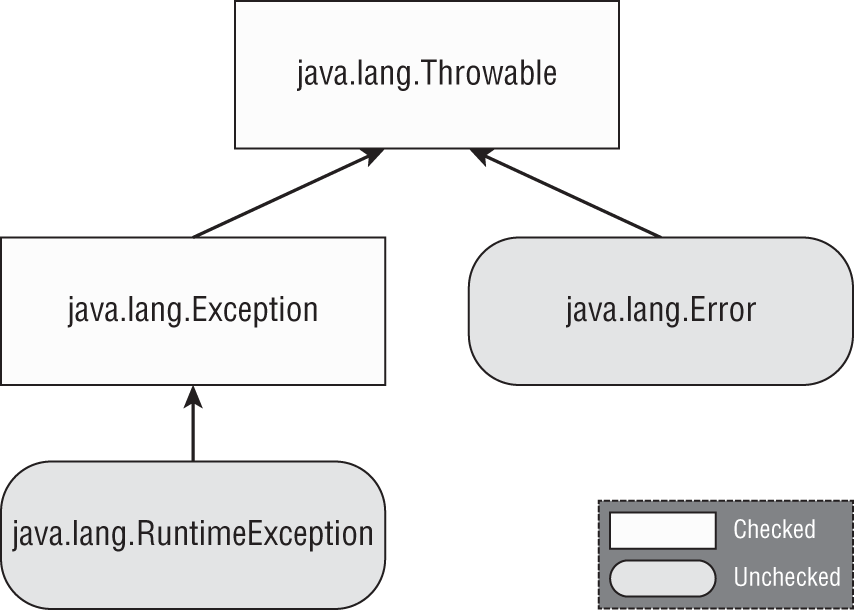

## Checked Exceptions

- A checked exception is an exception that must be declared or handled by the application code where it is thrown. 
- In Java, checked exceptions all inherit `Exception` but not `RuntimeException`
  
```java
void fall(int distance) throws IOException {
   if(distance> 10) {
      throw new IOException();
   }
}
```

```java
void fall(int distance) {
   try {
      if(distance> 10) {
         throw new IOException();
      }
   } catch (Exception e) {
      e.printStackTrace();
   }
}
```

## Unchecked exceptions

- An unchecked exception is any exception that does not need to be declared or handled by the application code where it is thrown. 
- Unchecked exceptions are often referred to as runtime exceptions
- unchecked exceptions include any class that inherits `RuntimeException` or `Error`.
- The code will compile if you declare an unchecked exception. However, it is redundant.

```java
void fall(String input) {
   System.out.println(input.toLowerCase());
// NullPointerException can be thrown in the body of
//  the following method if the input reference is null:   
}
```

## Error and Throwable

- Error means something went so horribly wrong that your program should not attempt to recover from it
- you can handle Throwable and Error exceptions, it is not recommended you do so in your application code.
  
## Examples

```java
String[] animals = new String[0];
System.out.println(animals[0]);  // ArrayIndexOutOfBoundsException
```

legal
```java
var e = new RuntimeException();
throw e;
```

```java
throw RuntimeException();   // DOES NOT COMPILE
```

```java
try {
   throw new RuntimeException();
   throw new ArrayIndexOutOfBoundsException();  // DOES NOT COMPILE
} catch (Exception e) {}
```

## Calling Methods That Throw Exceptions

```java
class NoMoreCarrotsException extends Exception {}
 
public class Bunny {
   public static void main(String[] args) {
      eatCarrot(); // DOES NOT COMPILE
   }
   private static void eatCarrot() throws NoMoreCarrotsException {}
}
```

```java
public static void main(String[] args) throws NoMoreCarrotsException {
   eatCarrot();
}
 
public static void main(String[] args) {
   try {
      eatCarrot();
   } catch (NoMoreCarrotsException e) {
      System.out.print("sad rabbit");
   }
}
```

You might have noticed that `eatCarrot()` didn't throw an exception; it just declared that it could. This is enough for the compiler to require the caller to handle or declare the exception.

The compiler is still on the lookout for unreachable code
```java
public void bad() {
   try {
      eatCarrot();
   } catch (NoMoreCarrotsException e) { // DOES NOT COMPILE
      System.out.print("sad rabbit");
   }
}
 
private void eatCarrot() {}
```

## Overriding Methods with Exceptions

- An overridden method may not declare any new or broader checked exceptions than the method it inherits

```java
class CanNotHopException extends Exception {}
 
class Hopper {
   public void hop() {}
}
 
class Bunny extends Hopper {
   public void hop() throws CanNotHopException {} // DOES NOT COMPILE
}
```

- An overridden method in a subclass is allowed to declare fewer exceptions than the superclass or interface
```java
class Hopper {
   public void hop() throws CanNotHopException {}
}
class Bunny extends Hopper {
   public void hop() {} // This is fine
}
// this is legal because callers are already handling them.
```

## Printing an Exception

```java
public static void main(String[] args) {
   try {
      hop();
   } catch (Exception e) {
      System.out.println(e + "\n");
      System.out.println(e.getMessage()+ "\n");
      e.printStackTrace();
   }
}
private static void hop() {
   throw new RuntimeException("cannot hop");
}
```

```log
java.lang.RuntimeException: cannot hop
 
cannot hop
 
java.lang.RuntimeException: cannot hop
   at Handling.hop(Handling.java:15)
   at Handling.main(Handling.java:7)
```

## Common Exceptions

### RuntimeException Classes

<table>
<thead>
<tr>
<th scope="col">Unchecked exception</th>
<th scope="col">Description</th> </tr> </thead>
<tbody>
<tr>
<td class="left"><code>ArithmeticException</code></td>
<td class="left">Thrown when code attempts to divide by zero.</td> </tr>
<tr>
<td class="left"><code>ArrayIndexOutOfBoundsException</code></td>
<td class="left">Thrown when code uses illegal index to access array.</td> </tr>
<tr>
<td class="left"><code>ClassCastException</code></td>
<td class="left">Thrown when attempt is made to cast object to class of which it is not an instance.</td> </tr>
<tr>
<td class="left"><code>NullPointerException</code></td>
<td class="left">Thrown when there is a <code>null</code> reference where an object is required.</td> </tr>
<tr>
<td class="left"><code>IllegalArgumentException</code></td>
<td class="left">Thrown by programmer to indicate that method has been passed illegal or inappropriate argument.</td> </tr>
<tr>
<td class="left"><code>NumberFormatException</code></td>
<td class="left">Subclass of <code>IllegalArgumentException</code>. Thrown when attempt is made to convert <code>String</code> to numeric type but <code>String</code> doesn't have appropriate format.</td> </tr> </tbody> </table>

```java
int answer = 11 / 0;
// Exception in thread "main" java.lang.ArithmeticException: / by zero
```

```java
int[] countsOfMoose = new int[3];
System.out.println(countsOfMoose[-1]);
// Exception in thread "main" java.lang.ArrayIndexOutOfBoundsException:
// Index -1 out of bounds for length 3
```

```java
String type = "moose";
Integer number = (Integer) type; // DOES NOT COMPILE
```

```java
String type = "moose";
Object obj = type;
Integer number = (Integer) obj; // ClassCastException
// Exception in thread "main" java.lang.ClassCastException:  java.base/java.lang.String
// cannot be cast to java.lang.base/java.lang.Integer
```

```java
public class Frog {
   public void hop(String name, Integer jump) {
      System.out.print(name.toLowerCase() + " " + jump.intValue());
   }
   
   public static void main(String[] args) {
      new Frog().hop(null, 1); 
   } }
// Exception in thread "main" java.lang.NullPointerException: 
// Cannot invoke "String.toLowerCase()" because "<parameter1>" is null   
```

in Java 17
The JVM now tells you the object reference that triggered the NullPointerException! This new feature is called Helpful NullPointerExceptions.


```java
Exception in thread "main" java.lang.NullPointerException: Cannot invoke "java.lang.Integer.intValue()" because "<parameter2>" is null
```

 By default, a NullPointerException on a local variable or method parameter is printed with a number indicating the order in which it appears in the method, such as <local2> or <parameter4>. If you're like us and want the actual variable name to be shown, compile the code with the -g:vars flag, which adds debug info. In the previous examples, <parameter1> and <parameter2> are then replaced with name and jump, respectively.

```java
public void setNumberEggs(int numberEggs) {
   if (numberEggs < 0)
      throw new IllegalArgumentException("# eggs must not be negative");
   this.numberEggs = numberEggs;
}
// Exception in thread "main"
// java.lang.IllegalArgumentException: # eggs must not be negative
```

```java
Integer.parseInt("abc");
// Exception in thread "main"
// java.lang.NumberFormatException: For input string: "abc"
```

### Checked Exception Classes

<table>
<thead>
<tr>
<th scope="col">Checked exception</th>
<th scope="col">Description</th> </tr> </thead>
<tbody>
<tr>
<td class="left"><code>FileNotFoundException</code></td>
<td class="left">Subclass of <code>IOException</code>. Thrown programmatically when code tries to reference file that does not exist.</td> </tr>
<tr>
<td class="left"><code>IOException</code></td>
<td class="left">Thrown programmatically when problem reading or writing file.</td> </tr>
<tr>
<td class="left"><code>NotSerializableException</code></td>
<td class="left">Subclass of <code>IOException</code>. Thrown programmatically when attempting to serialize or deserialize non-serializable class.</td> </tr>
<tr>
<td class="left"><code>ParseException</code></td>
<td class="left">Indicates problem parsing input.</td> </tr>
<tr>
<td class="left"><code>SQLException</code></td>
<td class="left">Thrown when error related to accessing database.</td> </tr> </tbody> </table>

### Error Classes

<table>
<thead>
<tr>
<th scope="col">Error</th>
<th scope="col">Description</th> </tr> </thead>
<tbody>
<tr>
<td class="left"><code>ExceptionInInitializerError</code></td>
<td class="left">Thrown when <code>static</code> initializer throws exception and doesn't handle it</td> </tr>
<tr>
<td class="left"><code>StackOverflowError</code></td>
<td class="left">Thrown when method calls itself too many times (called <i>infinite recursion</i> because method typically calls itself without end)</td> </tr>
<tr>
<td class="left"><code>NoClassDefFoundError</code></td>
<td class="left">Thrown when class that code uses is available at compile time but not runtime</td> </tr> </tbody> </table>

## Handling exceptions

```java
void explore() {
   try {
      fall();
      System.out.println("never get here");
   } catch (RuntimeException e) {
      getUp();
   }
   seeAnimals();
}
void fall() {  throw new RuntimeException(); }
```

```java
try  // DOES NOT COMPILE
   fall();
catch (Exception e)
   System.out.println("get up");
```

```java
try {  // DOES NOT COMPILE
   fall();
}
```

### Chaining catch Blocks

A rule exists for the order of the catch blocks. Java looks at them in the order they appear. If it is impossible for one of the catch blocks to be executed, a compiler error about unreachable code occurs. For example, this happens when a superclass catch block appears before a subclass catch block

```java
class AnimalsOutForAWalk extends RuntimeException {} 
class ExhibitClosed extends RuntimeException {}
class ExhibitClosedForLunch extends ExhibitClosed {}
```

```java
public void visitPorcupine() {
   try {
      seeAnimal();
   } catch (AnimalsOutForAWalk e) { // first catch block
      System.out.print("try back later");
   } catch (ExhibitClosed e) { // second catch block
      System.out.print("not today");
   }
}
```

```java
public void visitMonkeys() {
   try {
      seeAnimal();
   } catch (ExhibitClosedForLunch e) { // Subclass exception
      System.out.print("try back later");
   } catch (ExhibitClosed e) { // Superclass exception
      System.out.print("not today");
   }
}
```

```java
public void visitMonkeys() {
   try {
      seeAnimal();
   } catch (ExhibitClosed e) {
      System.out.print("not today");
   } catch (ExhibitClosedForLunch e) { // DOES NOT COMPILE
      System.out.print("try back later");
   }
}
```

```java
public void visitSnakes() {
   try {
   } catch (IllegalArgumentException e) {
   } catch (NumberFormatException e) { // DOES NOT COMPILE
   }
}
```

```java
public void visitManatees() {
   try {
   } catch (NumberFormatException e1) {
      System.out.println(e1);
   } catch (IllegalArgumentException e2) {
      System.out.println(e1); // DOES NOT COMPILE
   }
}
```

### Multi-catch Block

```java
public static void main(String[] args) {
   try {
      System.out.println(Integer.parseInt(args[1]));
   } catch (ArrayIndexOutOfBoundsException | NumberFormatException e) {
      System.out.println("Missing or invalid input");
   }
}
```

```java
catch(Exception1 e | Exception2 e | Exception3 e) // DOES NOT COMPILE
catch(Exception1 e1 | Exception2 e2 | Exception3 e3) // DOES NOT COMPILE
catch(Exception1 | Exception2 | Exception3 e)
```

Java intends multi-catch to be used for exceptions that aren't related, and it prevents you from specifying redundant types in a multi-catch
```java
try {
   throw new IOException();
} catch (FileNotFoundException | IOException p) {} // DOES NOT COMPILE

// The exception FileNotFoundException is already caught by the alternative IOException
```

```java
try {
   throw new IOException();
} catch (IOException e) {}
```

### finally Block

If an exception is thrown, the finally block is run after the catch block. If no exception is thrown, the finally block is run after the try block completes.

```java
void explore() {
   try {
      seeAnimals();
      fall();
   } catch (Exception e) {
      getHugFromDaddy();
   } finally {
      seeMoreAnimals();
   }
   goHome();
}
```

```java
try { // DOES NOT COMPILE
   fall();
} finally {
   System.out.println("all better");
} catch (Exception e) {
   System.out.println("get up");
}
try { // DOES NOT COMPILE
   fall();
}
try {
   fall();
} finally {
   System.out.println("all better");
}
```

```java
int goHome() {
   try {
      // Optionally throw an exception here
      System.out.print("1");
      return -1;
   } catch (Exception e) {
      System.out.print("2");
      return -2;
   } finally {
      System.out.print("3");
      return -3;
   }
// it's always -3 
}
```

```java
try {
   System.exit(0);
} finally {
   System.out.print("Never going to get here");  // Not printed
}
```

## Try-with-Resources

- one or more resources can be opened in the try clause. 
- When multiple resources are opened, they are closed in the reverse of the order in which they were created. 
- parentheses are used to list those resources, and semicolons are used to separate the declarations. 
- catch and finally are optional 
- Only classes that implement the `AutoCloseable` interface can be used in a try-with-resources statement. 
- `Closeable` extends `AutoCloseable`, they are both supported in try-with-resources statements. The only difference between the two is that `Closeable`'s `close()` method declares `IOException`, while `AutoCloseable`'s `close()` method declares `Exception`.
- You can declare a resource using `var`
- The resources created in the try clause are in scope only within the try block.
- While resources are often created in the try-with-resources statement, it is possible to declare them ahead of time, provided they are marked final or effectively final. 


```java
interface AutoCloseable {
   public void close() throws Exception;
}
```

```java
public void readFile(String file) {
   FileInputStream is = null;
   try {
      is = new FileInputStream("myfile.txt");
      // Read file data
   } catch (IOException e) {
      e.printStackTrace();
   } finally {
      if(is != null) {
         try {
            is.close();
         } catch (IOException e2) {
            e2.printStackTrace();
         }
      }
   }
}
```

```java
public void readFile(String file) {
   try (FileInputStream is = new FileInputStream("myfile.txt")) {
      // Read file data
   } catch (IOException e) {
      e.printStackTrace();
   }
}
```

```java
public void readFile(String file) throws IOException {
   try (FileInputStream is = new FileInputStream("myfile.txt")) {
      // Read file data
   }
}
```

```java
try (String reptile = "lizard") {}  // DOES NOT COMPILE
```

```java
public class MyFileClass implements AutoCloseable {
   private final int num;
   public MyFileClass(int num) { this.num = num; }
   @Override public void close() {
      System.out.println("Closing: " + num);
   } }
```

```java
try (var f = new BufferedInputStream(new FileInputStream("it.txt"))) {
   // Process file
}
```

```java
try (Scanner s = new Scanner(System.in)) {
   s.nextLine();
} catch(Exception e) {
   s.nextInt(); // DOES NOT COMPILE
} finally {
   s.nextInt(); // DOES NOT COMPILE
}
```

```java
public static void main(String… xyz) {
   try (MyFileClass bookReader = new MyFileClass(1);
         MyFileClass movieReader = new MyFileClass(2)) {
      System.out.println("Try Block");
      throw new RuntimeException();
   } catch (Exception e) {
      System.out.println("Catch Block");
   } finally {
      System.out.println("Finally Block");
   }
}
```
```
Try Block
Closing: 2
Closing: 1
Catch Block
Finally Block
```

### Applying Effectively Final

While resources are often created in the try-with-resources statement, it is possible to declare them ahead of time, provided they are marked final or effectively final. 

```java
public static void main(String… xyz) {
   final var bookReader = new MyFileClass(4);
   MyFileClass movieReader = new MyFileClass(5);
   try (bookReader;
         var tvReader = new MyFileClass(6);
         movieReader) {
      System.out.println("Try Block");
   } finally {
      System.out.println("Finally Block");
   }
}
```
```
Try Block
Closing: 5
Closing: 6
Closing: 4
Finally Block
```

```java
var writer = Files.newBufferedWriter(path);
try (writer) { // DOES NOT COMPILE
   writer.append("Welcome to the zoo!");
}
writer = null;
```

```java
var writer = Files.newBufferedWriter(path);
writer.append("This write is permitted but a really bad idea!");
try (writer) {
   writer.append("Welcome to the zoo!");
}
writer.append("This write will fail!"); // IOException
```

## Suppressed Exceptions

-  If more than two resources throw an exception, the first one to be thrown becomes the primary exception, and the rest are grouped as suppressed exceptions. And since resources are closed in the reverse of the order in which they are declared, the primary exception will be on the last declared resource that throws an exception.

```java
public class JammedTurkeyCage implements AutoCloseable {
   public void close() throws IllegalStateException {
      throw new IllegalStateException("Cage door does not close");
   }
   public static void main(String[] args) {
      try (JammedTurkeyCage t = new JammedTurkeyCage()) {
         System.out.println("Put turkeys in");
      } catch (IllegalStateException e) {
         System.out.println("Caught: " + e.getMessage());
      }
   }
// Caught: Cage door does not close   
}
```

What happens if the try block also throws an exception? When multiple exceptions are thrown, all but the first are called **suppressed exceptions**.

```java
public static void main(String[] args) {
   try (JammedTurkeyCage t = new JammedTurkeyCage()) {
      throw new IllegalStateException("Turkeys ran off");
   } catch (IllegalStateException e) {
      System.out.println("Caught: " + e.getMessage());
      for (Throwable t: e.getSuppressed())
         System.out.println("Suppressed: "+t.getMessage());
   }
}
```
```
Caught: Turkeys ran off
Suppressed: Cage door does not close
```

```java
public static void main(String[] args) {
   try (JammedTurkeyCage t = new JammedTurkeyCage()) {
      throw new RuntimeException("Turkeys ran off");
   } catch (IllegalStateException e) {
      System.out.println("caught: " + e.getMessage());
   }
}
```
 Since this does not match the catch clause, the exception is thrown to the caller. Eventually, the main() method would output something like the following:
```
Exception in thread "main" java.lang.RuntimeException: Turkeys ran off
   at JammedTurkeyCage.main(JammedTurkeyCage.java:7)
   Suppressed: java.lang.IllegalStateException:
         Cage door does not close
      at JammedTurkeyCage.close(JammedTurkeyCage.java:3)
      at JammedTurkeyCage.main(JammedTurkeyCage.java:8)
```      

Suppressed exceptions apply only to exceptions thrown in the try clause. The following example does not throw a suppressed exception:
```java
public static void main(String[] args) {
   try (JammedTurkeyCage t = new JammedTurkeyCage()) {
      throw new IllegalStateException("Turkeys ran off");
   } finally {
      throw new RuntimeException("and we couldn't find them");
   }
}
```
Since line 9 also throws an exception, the previous exception is lost, with the code printing the following:
```
Exception in thread "main" java.lang.RuntimeException:
   and we couldn't find them
   at JammedTurkeyCage.main(JammedTurkeyCage.java:9)
```

# Formatting values

in addition to [Formatting](#formatting)

## Formatting Numbers

`NumberFormat` interface
```java
public final String format(double number)
public final String format(long number)
```

`DecimalFormat` is an implementation of `NumberFormat`
```java
public DecimalFormat(String pattern)
```

<table>
<thead>
<tr>
<th scope="col">Symbol</th>
<th scope="col">Meaning</th>
<th scope="col">Examples</th> </tr> </thead>
<tbody>
<tr>
<td class="left"><code>#</code></td>
<td class="left">Omit position if no digit exists for it.</td>
<td class="left"><code>$2.2</code></td> </tr>
<tr>
<td class="left"><code>0</code></td>
<td class="left">Put <code>0</code> in position if no digit exists for it.</td>
<td class="left"><code>$002.20</code></td> </tr> </tbody> </table>

```java
double d = 1234.567;
NumberFormat f1 = new DecimalFormat("###,###,###.0");
System.out.println(f1.format(d));  // 1,234.6

NumberFormat f2 = new DecimalFormat("000,000,000.00000");
System.out.println(f2.format(d));  // 000,001,234.56700

NumberFormat f3 = new DecimalFormat("Your Balance $#,###,###.##");
System.out.println(f3.format(d));  // Your Balance $1,234.57
```

## Formatting Dates and Times

```java
LocalDate date = LocalDate.of(2022, Month.OCTOBER, 20);
System.out.println(date.getDayOfWeek()); // THURSDAY
System.out.println(date.getMonth());     // OCTOBER
System.out.println(date.getYear());      // 2022
System.out.println(date.getDayOfYear()); // 293
```

class `DateTimeFormatter` to display standard formats

```java
LocalDate date = LocalDate.of(2022, Month.OCTOBER, 20);
LocalTime time = LocalTime.of(11, 12, 34);
LocalDateTime dt = LocalDateTime.of(date, time);

System.out.println(date.format(DateTimeFormatter.ISO_LOCAL_DATE));
System.out.println(time.format(DateTimeFormatter.ISO_LOCAL_TIME));
System.out.println(dt.format(DateTimeFormatter.ISO_LOCAL_DATE_TIME));
```
```
2022-10-20
11:12:34
2022-10-20T11:12:34
```

```java
date.format(DateTimeFormatter.ISO_LOCAL_TIME); // RuntimeException
time.format(DateTimeFormatter.ISO_LOCAL_DATE); // RuntimeException
```

If you don't want to use one of the predefined formats, `DateTimeFormatter` supports a custom format using a date format String.

```java
var f = DateTimeFormatter.ofPattern("MMMM dd, yyyy 'at' hh:mm");
System.out.println(dt.format(f));  // October 20, 2022 at 11:12
```

<table>
<thead>
<tr>
<th scope="col">Symbol</th>
<th scope="col">Meaning</th>
<th scope="col">Examples</th> </tr> </thead>
<tbody>
<tr>
<td><code>y</code> </td>
<td class="left">Year</td>
<td class="left"><code>22</code>, <code>2022</code></td> </tr>
<tr>
<td><code>M</code> </td>
<td class="left">Month</td>
<td class="left"><code>1</code>, <code>01</code>, <code>Jan</code>, <code>January</code></td> </tr>
<tr>
<td><code>d</code> </td>
<td class="left">Day</td>
<td class="left"><code>5</code>, <code>05</code></td> </tr>
<tr>
<td><code>h</code> </td>
<td class="left">Hour</td>
<td class="left"><code>9</code>, <code>09</code></td> </tr>
<tr>
<td><code>m</code> </td>
<td class="left">Minute</td>
<td class="left"><code>45</code></td> </tr>
<tr>
<td><code>S</code> </td>
<td class="left">Second</td>
<td class="left"><code>52</code></td> </tr>
<tr>
<td><code>a</code> </td>
<td class="left">a.m./p.m.</td>
<td class="left"><code>AM</code>, <code>PM</code></td> </tr>
<tr>
<td><code>z</code> </td>
<td class="left">Time zone name</td>
<td class="left"><code>Eastern Standard Time</code>, <code>EST</code></td> </tr>
<tr>
<td><code>Z</code> </td>
<td class="left">Time zone offset</td>
<td class="left"><code>-0400</code></td> </tr> </tbody> </table>

```java
var dt = LocalDateTime.of(2022, Month.OCTOBER, 20, 6, 15, 30);
 
var formatter1 = DateTimeFormatter.ofPattern("MM/dd/yyyy hh:mm:ss");
System.out.println(dt.format(formatter1));  // 10/20/2022 06:15:30
 
var formatter2 = DateTimeFormatter.ofPattern("MM_yyyy_-_dd");
System.out.println(dt.format(formatter2));  // 10_2022_-_20
 
var formatter3 = DateTimeFormatter.ofPattern("h:mm z");
System.out.println(dt.format(formatter3));  // DateTimeException
```

```java
var dateTime = LocalDateTime.of(2022, Month.OCTOBER, 20, 6, 15, 30);
var formatter = DateTimeFormatter.ofPattern("MM/dd/yyyy hh:mm:ss");
 
System.out.println(dateTime.format(formatter)); // 10/20/2022 06:15:30
System.out.println(formatter.format(dateTime)); // 10/20/2022 06:15:30
```

### Adding Custom Text Values

- One way to address this would be to break the formatter into multiple smaller formatters and then concatenate the results.
  
```java
var dt = LocalDateTime.of(2022, Month.OCTOBER, 20, 6, 15, 30);
 
var f1 = DateTimeFormatter.ofPattern("MMMM dd, yyyy ");
var f2 = DateTimeFormatter.ofPattern(" hh:mm");
System.out.println(dt.format(f1) + "at" + dt.format(f2)); 
```

- You can escape the text by surrounding it with a pair of single quotes ('). Escaping text instructs the formatter to ignore the values inside the single quotes and just insert them as part of the final value.

```java
var f = DateTimeFormatter.ofPattern("MMMM dd, yyyy 'at' hh:mm");
System.out.println(dt.format(f));  // October 20, 2022 at 06:15
```

But what if you need to display a single quote in the output, too?  Java supports this by putting two single quotes next to each other.

```java
var g1 = DateTimeFormatter.ofPattern("MMMM dd', Party''s at' hh:mm");
System.out.println(dt.format(g1));  // October 20, Party's at 06:15
 
var g2 = DateTimeFormatter.ofPattern("'System format, hh:mm: 'hh:mm");
System.out.println(dt.format(g2));  // System format, hh:mm: 06:15
 
var g3 = DateTimeFormatter.ofPattern("'NEW! 'yyyy', yay!'");
System.out.println(dt.format(g3));  // NEW! 2022, yay!
```

```java
DateTimeFormatter.ofPattern("The time is hh:mm"); // Exception thrown
DateTimeFormatter.ofPattern("'Time is: hh:mm: "); // Exception thrown
```

# Supporting Internationalization and Localization

**Internationalization** is the process of designing your program so it can be adapted. This involves placing strings in a properties file and ensuring that the proper data formatters are used

**Localization** means supporting multiple locales or geographic regions. You can think of a locale as being like a language and country pairing. Localization includes translating strings to different languages. It also includes outputting dates and numbers in the correct format for that locale.

##  Locale

to find is the user's current locale
```java
Locale locale = Locale.getDefault();
System.out.println(locale);
```

The language is always required. Then comes an underscore followed by the uppercase country code. The country is optional

```java
US     // Cannot have country without language
enUS   // Missing underscore
US_en  // The country and language are reversed
EN     // Language must be lowercase
```
The corrected versions are `en` and `en_US`.

- The first is to use the built-in constants in the Locale class, available for some common locales.
```java
System.out.println(Locale.GERMAN);  // de
System.out.println(Locale.GERMANY); // de_DE
```
- The second way of selecting a Locale is to use the constructors to create a new object. You can pass just a language, or both a language and country:
```java
System.out.println(new Locale("fr"));       // fr
System.out.println(new Locale("hi", "IN")); // hi_IN
```
- There's a third way to create a Locale that is more flexible

```java
Locale l1 = new Locale.Builder()
   .setLanguage("en")
   .setRegion("US")
   .build();
 
Locale l2 = new Locale.Builder()
   .setRegion("US")
   .setLanguage("en")
   .build();
```   

to use a Locale other than a computer's default.
```java
System.out.println(Locale.getDefault());  // en_US
Locale locale = new Locale("fr");
Locale.setDefault(locale);
System.out.println(Locale.getDefault());  // fr
```

## Localizing Numbers

 For example, in the United States, the dollar sign is prepended before the value along with a decimal point for values less than one dollar, such as $2.15. In Germany, though, the euro symbol is appended to the value along with a comma for values less than one euro, such as 2,15 €.

 Once you have the `NumberFormat` instance, you can call `format()` to turn a number into a `String`, or you can use `parse()` to turn a `String` into a number.

<table>
<thead>
<tr>
<th scope="col">Description</th>
<th scope="col">Using default <code>Locale</code> and a specified <code>Locale</code></th> </tr> </thead>
<tbody>
<tr>
<td class="left">General-purpose formatter</td>
<td class="left"><code>NumberFormat.getInstance() <br> NumberFormat.getInstance(Locale locale)</code></td> </tr>
<tr>
<td class="left">Same as <code>getInstance</code></td>
<td class="left"><code>NumberFormat.getNumberInstance() <br> NumberFormat.getNumberInstance(Locale locale)</code></td> </tr>
<tr>
<td class="left">For formatting monetary amounts</td>
<td class="left"><code>NumberFormat.getCurrencyInstance() <br> NumberFormat.getCurrencyInstance(Locale locale)</code></td> </tr>
<tr>
<td class="left">For formatting percentages</td>
<td class="left"><code>NumberFormat.getPercentInstance() <br> NumberFormat.getPercentInstance(Locale locale)</code></td> </tr>
<tr>
<td class="left">Rounds decimal values before displaying</td>
<td class="left"><code>NumberFormat.getIntegerInstance() <br> NumberFormat.getIntegerInstance(Locale locale)</code></td> </tr>
<tr>
<td class="left">Returns compact number formatter</td>
<td class="left"><code>NumberFormat.getCompactNumberInstance() <br> NumberFormat.getCompactNumberInstance(</code> <br> <code>Locale locale, NumberFormat.Style formatStyle)</code></td> </tr> </tbody> </table>

```java
int attendeesPerYear = 3_200_000;
int attendeesPerMonth = attendeesPerYear / 12;
 
var us = NumberFormat.getInstance(Locale.US);
System.out.println(us.format(attendeesPerMonth)); // 266,666
 
var gr = NumberFormat.getInstance(Locale.GERMANY);
System.out.println(gr.format(attendeesPerMonth)); // 266.666
 
var ca = NumberFormat.getInstance(Locale.CANADA_FRENCH);
System.out.println(ca.format(attendeesPerMonth)); // 266 666
```

```java
double price = 48;
var myLocale = NumberFormat.getCurrencyInstance();
System.out.println(myLocale.format(price));
```
When run with the default locale of en_US for the United States, this code outputs $48.00. On the other hand, when run with the default locale of en_GB for Great Britain, it outputs £48.00.

```java
double successRate = 0.802;
var us = NumberFormat.getPercentInstance(Locale.US);
System.out.println(us.format(successRate)); // 80%
 
var gr = NumberFormat.getPercentInstance(Locale.GERMANY);
System.out.println(gr.format(successRate)); // 80 %
```

When we parse data, we convert it from a String to a structured object or primitive value. The `NumberFormat.parse()` method accomplishes this and takes the locale into consideration.

the `parse()` method, found in various types, declares a checked exception `ParseException` that must be handled or declared in the method in which it is called.

```java
String s = "40.45";
 
var en = NumberFormat.getInstance(Locale.US);
System.out.println(en.parse(s)); // 40.45
 
var fr = NumberFormat.getInstance(Locale.FRANCE);
System.out.println(fr.parse(s)); // 40
```

```java
String income = "$92,807.99";
var cf = NumberFormat.getCurrencyInstance();
double value = (Double) cf.parse(income);
System.out.println(value);  // 92807.99
```

###  CompactNumberFormat

`CompactNumberFormat` class inherited from `NumberFormat` added in Java 17

- First it determines the highest range for the number, such as thousand (K), million (M), billion (B), or trillion (T).
- It then returns up to the first three digits of that range, rounding the last digit as needed.
- Finally, it prints an identifier. If SHORT is used, a symbol is returned. If LONG is used, a space followed by a word is returned.

```java
var formatters = Stream.of(
   NumberFormat.getCompactNumberInstance(),
   NumberFormat.getCompactNumberInstance(Locale.getDefault(), Style.SHORT),
   NumberFormat.getCompactNumberInstance(Locale.getDefault(), Style.LONG),
 
   NumberFormat.getCompactNumberInstance(Locale.GERMAN, Style.SHORT),
   NumberFormat.getCompactNumberInstance(Locale.GERMAN, Style.LONG),
   NumberFormat.getNumberInstance());
 
formatters.map(s -> s.format(7_123_456)).forEach(System.out::println);
```

```
7M
7M
7 million
 
7 Mio.
7 Millionen
 
7,123,456
```

-  If you don't specify a style, `SHORT` is used by default
- notice that the values except the last one (which doesn't use a compact number formatter) are truncated
- the short form uses common labels for large values, such as K for thousand. 

```java
formatters.map(s -> s.format(314_900_000)).forEach(System.out::println);
```
```
315M
315M
315 million
 
315 Mio.
315 Millionen
 
314,900,000
```
- the third digit is automatically rounded up for the entries that use a CompactNumberFormat.

## Localizing Dates

Like numbers, date formats can vary by locale. These are methods used to retrieve an instance of a `DateTimeFormatter` using the default locale.

<table>
<thead>
<tr>
<th scope="col">Description</th>
<th scope="col">Using default <code>Locale</code></th> </tr> </thead>
<tbody>
<tr>
<td class="left">For formatting dates</td>
<td class="left"><code>DateTimeFormatter.ofLocalizedDate(FormatStyle dateStyle)</code></td> </tr>
<tr>
<td class="left">For formatting times</td>
<td class="left"><code>DateTimeFormatter.ofLocalizedTime(FormatStyle timeStyle)</code></td> </tr>
<tr>
<td class="left">For formatting dates and times</td>
<td class="left"><code>DateTimeFormatter.ofLocalizedDateTime(FormatStyle dateStyle,</code> <br> <code> FormatStyle timeStyle)</code> <br> <code>DateTimeFormatter.ofLocalizedDateTime(FormatStyle dateTimeStyle)</code></td> </tr> </tbody> </table>

Each method takes a `FormatStyle` parameter (or two) with possible values 
- SHORT
- MEDIUM
- LONG
- FULL

```java
public static void print(DateTimeFormatter dtf,
      LocalDateTime dateTime, Locale locale) {
   System.out.println(dtf.format(dateTime) + " --- "
      + dtf.withLocale(locale).format(dateTime));
}
public static void main(String[] args) {
   Locale.setDefault(new Locale("en", "US"));
   var italy = new Locale("it", "IT");
   var dt = LocalDateTime.of(2022, Month.OCTOBER, 20, 15, 12, 34);
 
   // 10/20/22 --- 20/10/22
   print(DateTimeFormatter.ofLocalizedDate(SHORT),dt,italy);
 
   // 3:12 PM --- 15:12
   print(DateTimeFormatter.ofLocalizedTime(SHORT),dt,italy);
 
   // 10/20/22, 3:12 PM --- 20/10/22, 15:12
   print(DateTimeFormatter.ofLocalizedDateTime(SHORT,SHORT),dt,italy);
}
```

## Locale Category

 If you require finer-grained control of the default locale, Java subdivides the underlying formatting options into distinct categories with the `§ocale.Category` enum.

 - `DISPLAY`	Category used for displaying data about locale
- `FORMAT`	Category used for formatting dates, numbers, or currencies

```java
 public static void printCurrency(Locale locale, double money) {
    System.out.println(
       NumberFormat.getCurrencyInstance().format(money)
       + ", " + locale.getDisplayLanguage());
 }
 public static void main(String[] args) {
    var spain = new Locale("es", "ES");
    var money = 1.23;

    // Print with default locale
    Locale.setDefault(new Locale("en", "US"));
    printCurrency(spain, money);  // $1.23, Spanish

    // Print with selected locale display
    Locale.setDefault(Category.DISPLAY, spain);
    printCurrency(spain, money);  // $1.23, español

    // Print with selected locale format
    Locale.setDefault(Category.FORMAT, spain);
    printCurrency(spain, money);  // 1,23 €, español
 }
```

You just need to know that you can set parts of the locale independently. You should also know that calling Locale.setDefault(us) after the previous code snippet will change both locale categories to en_US.

## Loading Properties with Resource Bundles

### Creating a Resource Bundle

- A **resource bundle** contains the locale-specific objects to be used by a program. It is like a map with keys and values. 
- The resource bundle is commonly stored in a properties file. 
- A properties file is a text file in a specific format with key/value pairs.
- They will let us easily translate our application to multiple locales or even support multiple locales at once.
-  If we don't have a country-specific resource bundle, Java will use a language-specific one

Zoo_en.properties
```properties
hello=Hello
open=The zoo is open
```

Zoo_fr.properties
```properties
hello=Bonjour
open=Le zoo est ouvert
```

```java
public static void printWelcomeMessage(Locale locale) {
   var rb = ResourceBundle.getBundle("Zoo", locale);
   System.out.println(rb.getString("hello")
      + ", " + rb.getString("open"));
}
public static void main(String[] args) {
   var us = new Locale("en", "US");
   var france = new Locale("fr", "FR");
   printWelcomeMessage(us); // Hello, The zoo is open
   printWelcomeMessage(france); // Bonjour, Le zoo est ouvert
}
```

```java
var us = new Locale("en", "US");
ResourceBundle rb = ResourceBundle.getBundle("Zoo", us);
rb.keySet().stream()
   .map(k -> k + ": " + rb.getString(k))
   .forEach(System.out::println);
```   

```
hello: Hello
open: The zoo is open
```

approach is to have all of the properties files in a separate properties JAR or folder and load them in the classpath at runtime. In this manner, a new language can be added without changing the application JAR.

### Picking a Resource Bundle

two common methods for obtaining a resource bundle

```java
ResourceBundle.getBundle("name"); // uses the default locale
ResourceBundle.getBundle("name", locale);
```

 It tries to find the most specific value

When asked for resource bundle Zoo with the locale new Locale("fr", "FR") when the default locale is U.S. English.
1.	`Zoo_fr_FR.properties`	Requested locale
2.	`Zoo_fr.properties`	Language we requested with no country
3.	`Zoo_en_US.properties`	Default locale
4.	`Zoo_en.properties`	Default locale's language with no country
5.	`Zoo.properties`	No locale at all—default bundle
6.	If still not found, throw `MissingResourceException`. No locale or default bundle available

```java
Locale.setDefault(new Locale("hi"));
ResourceBundle rb = ResourceBundle.getBundle("Zoo", new Locale("en"));
```

1. Zoo_en.properties
1. Zoo_hi.properties
1. Zoo.properties

### Selecting Resource Bundle Values

 - Java isn't required to get all of the keys from the same resource bundle. 
 - It can get them from any parent of the matching resource bundle. 
 - A parent resource bundle in the hierarchy just removes components of the name until it gets to the top
- Once a resource bundle has been selected, only properties along a single hierarchy will be used. 
  
Matching resource bundle:	`Zoo_fr_FR`	
Properties files keys can come from:
- `Zoo_fr_FR.properties`
- `Zoo_fr.properties`
- `Zoo.properties`

```properties
Zoo.properties
name=Vancouver Zoo
 
Zoo_en.properties
hello=Hello
open=is open
 
Zoo_en_US.properties
name=The Zoo
 
Zoo_en_CA.properties
visitors=Canada visitors
```

```java
Locale.setDefault(new Locale("en", "US"));
Locale locale = new Locale("en", "CA");
ResourceBundle rb = ResourceBundle.getBundle("Zoo", locale);
System.out.print(rb.getString("hello"));
System.out.print(". ");
System.out.print(rb.getString("name"));
System.out.print(" ");
System.out.print(rb.getString("open"));
System.out.print(" ");
System.out.print(rb.getString("visitors"));
// Hello. Vancouver Zoo is open Canada visitors
```

The default locale is en_US, and the requested locale is en_CA. First, Java goes through the available resource bundles to find a match. It finds one right away with Zoo_en_CA.properties. This means the default locale of en_US is irrelevant.

if a property is not found in any resource bundle? `MissingResourceException` at runtime.

## Formatting Messages

```
helloByName=Hello, {0} and {1}
```

```java
String format = rb.getString("helloByName");
System.out.print(MessageFormat.format(format, "Tammy", "Henry"));
// Hello, Tammy and Henry
```

## Properties Class

`Properties` functions like the `HashMap` class except that it uses `String` values for the keys and values.

```java
import java.util.Properties;
public class ZooOptions {
   public static void main(String[] args) {
      var props = new Properties();
      props.setProperty("name", "Our zoo");
      props.setProperty("open", "10am");
   }
}
```

```java
System.out.println(props.getProperty("camel"));        // null
System.out.println(props.getProperty("camel", "Bob")); // Bob
```

```java
props.get("open");                               // 10am
props.get("open", "The zoo will be open soon");  // DOES NOT COMPILE
```

# Concurrency

## Introducing Threads

### Thread Concurrency

- **concurrency** - The property of executing multiple threads and processes at the same time  
- Operating systems use a **thread scheduler** to determine which threads should be currently executing
- a **thread scheduler** may employ a round-robin schedule in which each available thread receives an equal number of CPU cycles with which to execute, with threads visited in a circular order.
-  A **thread priority** is a numeric value associated with a thread that is taken into consideration by the thread scheduler when determining which threads should currently be executing
- A **context switch** is the process of storing a thread's current state and later restoring the state of the thread to continue execution

### Creating a Thread

 to create a `Thread` and its associated task one of two ways in Java:
- Provide a `Runnable` object or lambda expression to the Thread constructor.
- Create a class that extends `Thread` and overrides the `run()` method.

```java
@FunctionalInterface public interface Runnable {
   void run();
}
```

to create and start a thread. 
```java
new Thread(() -> System.out.print("Hello")).start();
System.out.print("World");
```

`run` method does not start a new thread. Just invoke runnable interface synchronously
```java
new Thread(() -> System.out.print("Hello")).run();
System.out.print("World");
```

### Thread Types

- A `system thread` is created by the Java Virtual Machine (JVM) and runs in the background of the application. For example, garbage collection is managed by a system thread created by the JVM.
- a `user-defined thread` is one created by the application developer to accomplish a specific task. One  of user-defined threasd, which calls the main() method. 
- A `daemon thread` is one that will not prevent the JVM from exiting when the program finishes. System and user-defined threads can both be created as daemon threads.
- A Java application terminates when the only threads that are running are **daemon threads**. For example garbage collector thread.

```java
public class Zoo {
   public static void pause() {                 // Defines the thread task
      try {
         Thread.sleep(10_000);                  // Wait for 10 seconds
      } catch (InterruptedException e) {}
      System.out.println("Thread finished!");
   }
   
   public static void main(String[] unused) {
      var job = new Thread(() -> pause());      // Create thread
      job.start();                              // Start thread
      System.out.println("Main method finished!");
   } }

// Main method finished!
// --- 10 second wait ---
// Thread finished!   
```

if we add `job.setDaemon(true);`

```java
public class Zoo {
   public static void pause() {                 // Defines the thread task
      try {
         Thread.sleep(10_000);                  // Wait for 10 seconds
      } catch (InterruptedException e) {}
      System.out.println("Thread finished!");
   }
   
   public static void main(String[] unused) {
      var job = new Thread(() -> pause());      // Create thread
      job.setDaemon(true);
      job.start();                              // Start thread
      System.out.println("Main method finished!");
   } 
}
// Main method finished!
```

### Managing a Thread's Life Cycle

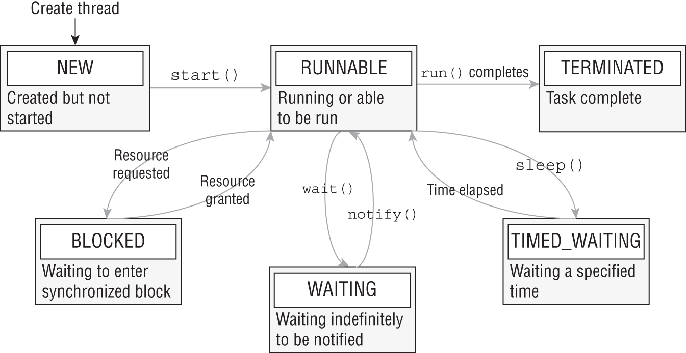

Every thread is initialized with a `NEW` state. As soon as `start()` is called, the thread is moved to a `RUNNABLE` state. Does that mean it is actually running? Not exactly: it may be running, or it may not be. The `RUNNABLE` state just means the thread is able to be run. Once the work for the thread is completed or an uncaught exception is thrown, the thread state becomes `TERMINATED`, and no more work is performed.

While in a `RUNNABLE` state, the thread may transition to one of three states where it pauses its work: `BLOCKED`, `WAITING`, or `TIMED_WAITING`. This figure includes common transitions between thread states, but there are other possibilities. For example, a thread in a `WAITING` state might be triggered by `notifyAll(`). Likewise, a thread that is interrupted by another thread will exit `TIMED_WAITING` and go straight back into `RUNNABLE`.

```java
public enum State {
        /**
         * Thread state for a thread which has not yet started.
         */
        NEW,

        /**
         * Thread state for a runnable thread.  A thread in the runnable
         * state is executing in the Java virtual machine but it may
         * be waiting for other resources from the operating system
         * such as processor.
         */
        RUNNABLE,

        /**
         * Thread state for a thread blocked waiting for a monitor lock.
         * A thread in the blocked state is waiting for a monitor lock
         * to enter a synchronized block/method or
         * reenter a synchronized block/method after calling
         * {@link Object#wait() Object.wait}.
         */
        BLOCKED,

        /**
         * Thread state for a waiting thread.
         * A thread is in the waiting state due to calling one of the
         * following methods:
         * <ul>
         *   <li>{@link Object#wait() Object.wait} with no timeout</li>
         *   <li>{@link #join() Thread.join} with no timeout</li>
         *   <li>{@link LockSupport#park() LockSupport.park}</li>
         * </ul>
         *
         * <p>A thread in the waiting state is waiting for another thread to
         * perform a particular action.
         *
         * For example, a thread that has called {@code Object.wait()}
         * on an object is waiting for another thread to call
         * {@code Object.notify()} or {@code Object.notifyAll()} on
         * that object. A thread that has called {@code Thread.join()}
         * is waiting for a specified thread to terminate.
         */
        WAITING,

        /**
         * Thread state for a waiting thread with a specified waiting time.
         * A thread is in the timed waiting state due to calling one of
         * the following methods with a specified positive waiting time:
         * <ul>
         *   <li>{@link #sleep Thread.sleep}</li>
         *   <li>{@link Object#wait(long) Object.wait} with timeout</li>
         *   <li>{@link #join(long) Thread.join} with timeout</li>
         *   <li>{@link LockSupport#parkNanos LockSupport.parkNanos}</li>
         *   <li>{@link LockSupport#parkUntil LockSupport.parkUntil}</li>
         * </ul>
         */
        TIMED_WAITING,

        /**
         * Thread state for a terminated thread.
         * The thread has completed execution.
         */
        TERMINATED;
    }
```    

### Interrupting a Thread

Calling `interrupt()` on a thread in the `TIMED_WAITING` or `WAITING` state causes the main() thread to become `RUNNABLE` again, triggering an `InterruptedException`. The thread may also move to a `BLOCKED` state if it needs to reacquire resources when it wakes up.

Calling `interrupt()` on a thread already in a `RUNNABLE` state doesn't change the state. In fact, it only changes the behavior if the thread is periodically checking the `Thread.isInterrupted()` value state.

```java
public class CheckResultsWithSleepAndInterrupt {
   private static int counter = 0;
   public static void main(String[] a) {
      final var mainThread = Thread.currentThread();
      new Thread(() -> {
         for(int i = 0; i < 1_000_000; i++) counter++;
         mainThread.interrupt();
      }).start();
      while(counter < 1_000_000) {
         System.out.println("Not reached yet");
         try {
            Thread.sleep(1_000);  // 1 SECOND
         } catch (InterruptedException e) {
            System.out.println("Interrupted!");
         }
      }
      System.out.println("Reached: "+counter);
   } }
```

## Creating Threads with the Concurrency API

### Executors

- The difference between a single-thread and a pooled-thread executor is what happens when a task is already running. While a single-thread executor will wait for the thread to become available before running the next task, a pooled-thread executor can execute the next task concurrently. If the pool runs out of available threads, the task will be queued by the thread executor and wait to be completed.

<table>
<thead>
<tr>
<th scope="col" class="left">Method name</th>
<th scope="col" class="left">Description</th> </tr> </thead>
<tbody>
<tr>
<td class="left"><code>ExecutorService <b>newSingleThreadExecutor</b>()</code></td>
<td class="left">Creates single-threaded executor that uses single worker thread operating off unbounded queue. Results are processed sequentially in order in which they are submitted.</td> </tr>
<tr>
<td class="left"><code>ScheduledExecutorService <b>newSingleThreadScheduledExecutor</b>()</code></td>
<td class="left">Creates single-threaded executor that can schedule commands to run after given delay or to execute periodically.</td> </tr>
<tr>
<td class="left"><code>ExecutorService <b>newCachedThreadPool</b>()</code></td>
<td class="left">Creates thread pool that creates new threads as needed but reuses previously constructed threads when they are available.</td> </tr>
<tr>
<td class="left"><code>ExecutorService <b>newFixedThreadPool</b>(int)</code></td>
<td class="left">Creates thread pool that reuses fixed number of threads operating off shared unbounded queue.</td> </tr>
<tr>
<td class="left"><code>ScheduledExecutorService <b>newScheduledThreadPool</b>(int)</code></td>
<td class="left">Creates thread pool that can schedule commands to run after given delay or execute periodically.</td> </tr> </tbody> </table>

###  Single-Thread Executor

```java
Runnable printInventory = () -> System.out.println("Printing zoo inventory");
Runnable printRecords = () -> {
   for (int i = 0; i < 3; i++)
      System.out.println("Printing record: " + i);
};

ExecutorService service = Executors.newSingleThreadExecutor();
try {
   System.out.println("begin");
   service.execute(printInventory);
   service.execute(printRecords);
   service.execute(printInventory);
   System.out.println("end");
} finally {
   service.shutdown();
}
```

```
begin
Printing zoo inventory
Printing record: 0
Printing record: 1
end
Printing record: 2
Printing zoo inventory
```

### Shutting Down a Thread Executor

- Once you have finished using a thread executor, it is important that you call the `shutdown()` method. 
- A thread executor creates a non-daemon thread on the first task that is executed, so failing to call `shutdown()` will result in your application never terminating.
- The shutdown process for a thread executor involves first rejecting any new tasks submitted to the thread executor while continuing to execute any previously submitted tasks. 
- During this time, calling `isShutdown()` will return `true`, while `isTerminated()` will return `false`. 
- If a new task is submitted to the thread executor while it is shutting down, a `RejectedExecutionException` will be thrown. 
- Once all active tasks have been completed, `isShutdown()` and `isTerminated()` will both return `true`
- `shutdown()` does not stop any tasks that have already been submitted to the thread executor.

- `ExecutorService` provides a method called `shutdownNow()`, which attempts to stop all running tasks and discards any that have not been started yet. It is not guaranteed to succeed because it is possible to create a thread that will never terminate, so any attempt to interrupt it may be ignored.
- `ExecutorService` interface does not extend the `AutoCloseable` interface, so you cannot use a try-with-resources statement.

### Submitting Tasks

<table>
<thead>
<tr>
<th scope="col" class="left">Method name</th>
<th scope="col" class="left">Description</th> </tr> </thead>
<tbody>
<tr>
<td class="left"><code>void <b>execute</b>(Runnable command)</code></td>
<td class="left">Executes <code>Runnable</code> task at some point in future.</td> </tr>
<tr>
<td class="left"><code>Future&lt;?&gt; <b>submit</b>(Runnable task)</code></td>
<td class="left">Executes <code>Runnable</code> task at some point in future and returns <code>Future</code> representing task.</td> </tr>
<tr>
<td class="left"><code>&lt;T&gt; Future&lt;T&gt; <b>submit</b>(Callable&lt;T&gt; task)</code></td>
<td class="left">Executes <code>Callable</code> task at some point in future and returns <code>Future</code> representing pending results of task.</td> </tr>
<tr>
<td class="left"><code>&lt;T&gt; List&lt;Future&lt;T&gt;&gt; <b>invokeAll</b>(Collection&lt;? extends Callable&lt;T&gt;&gt; tasks)</code></td>
<td class="left">Executes given tasks and waits for all tasks to complete. Returns <code>List</code> of <code>Future</code> instances in same order in which they were in original collection.</td> </tr>
<tr>
<td class="left"><code>&lt;T&gt; T <b>invokeAny</b>(Collection&lt;? extends Callable&lt;T&gt;&gt; tasks)</code></td>
<td class="left">Executes given tasks and waits for at least one to complete.</td> </tr> </tbody> </table>

### Waiting for Results

```java
Future<?> future = service.submit(() -> System.out.println("Hello"));
```

<table>
<thead>
<tr>
<th scope="col" class="left">Method name</th>
<th scope="col" class="left">Description</th> </tr> </thead>
<tbody>
<tr>
<td class="left"><code>boolean <b>isDone</b>()</code></td>
<td class="left">Returns <code>true</code> if task was completed, threw exception, or was cancelled.</td> </tr>
<tr>
<td class="left"><code>boolean <b>isCancelled</b>()</code></td>
<td class="left">Returns <code>true</code> if task was cancelled before it completed normally.</td> </tr>
<tr>
<td class="left"><code>boolean <b>cancel</b>(boolean mayInterruptIfRunning)</code></td>
<td class="left">Attempts to cancel execution of task and returns <code>true</code> if it was successfully cancelled or <code>false</code> if it could not be cancelled or is complete.</td> </tr>
<tr>
<td class="left"><code>V <b>get</b>()</code></td>
<td class="left">Retrieves result of task, waiting endlessly if it is not yet available.</td> </tr>
<tr>
<td class="left"><code>V <b>get</b>(long timeout, TimeUnit unit)</code></td>
<td class="left">Retrieves result of task, waiting specified amount of time. If result is not ready by time timeout is reached, checked <code>TimeoutException</code> will be thrown.</td> </tr> </tbody> </table>

```java
import java.util.concurrent.*;
public class CheckResults {
   private static int counter = 0;
   public static void main(String[] unused) throws Exception {
      ExecutorService service = Executors.newSingleThreadExecutor();
      try {
         Future<?> result = service.submit(() -> {
            for(int i = 0; i < 1_000_000; i++) counter++;
         });
         result.get(10, TimeUnit.SECONDS); // Returns null for Runnable
         System.out.println("Reached!");
      } catch (TimeoutException e) {
         System.out.println("Not reached in time");
      } finally {
         service.shutdown();
      } } }
```      

 As `Future<V>` is a generic interface, the type `V` is determined by the return type of the `Runnable` method. Since the return type of `Runnable.run()` is void, the `get()` method always returns `null` when working with `Runnable` expressions

<table>
<thead>
<tr>
<th scope="col" class="left">Enum name</th>
<th scope="col" class="left">Description</th> </tr> </thead>
<tbody>
<tr>
<td class="left"><code>TimeUnit.NANOSECONDS</code></td>
<td class="left">Time in one-billionths of a second (1/1,000,000,000)</td> </tr>
<tr>
<td class="left"><code>TimeUnit.MICROSECONDS</code></td>
<td class="left">Time in one-millionths of a second (1/1,000,000)</td> </tr>
<tr>
<td class="left"><code>TimeUnit.MILLISECONDS</code></td>
<td class="left">Time in one-thousandths of a second (1/1,000)</td> </tr>
<tr>
<td class="left"><code>TimeUnit.SECONDS</code></td>
<td class="left">Time in seconds</td> </tr>
<tr>
<td class="left"><code>TimeUnit.MINUTES</code></td>
<td class="left">Time in minutes</td> </tr>
<tr>
<td class="left"><code>TimeUnit.HOURS</code></td>
<td class="left">Time in hours</td> </tr>
<tr>
<td class="left"><code>TimeUnit.DAYS</code></td>
<td class="left">Time in days</td> </tr> </tbody> </table>

### Introducing Callable

- The `java.util.concurrent.Callable` functional interface is similar to `Runnable` except that its `call()` method returns a value and can throw a checked exception
- Unlike `Runnable`, in which the `get()` methods always return `null`, the `get()` methods on a `Future` instance return the matching generic type (which could also be a `null` value).
  
```java
@FunctionalInterface public interface Callable<V> {
   V call() throws Exception;
}
```

```java
var service = Executors.newSingleThreadExecutor();
try {
   Future<Integer> result = service.submit(() -> 30 + 11);
   System.out.println(result.get());   // 41
} finally {
   service.shutdown();
}
```

### Waiting for All Tasks to Finish

one solution is to call `get()` on each `Futur`e object returned by the `submit()` method. If we don't need the results of the tasks and are finished using our thread executor, there is a simpler approach

```java
ExecutorService service = Executors.newSingleThreadExecutor();
try {
   // Add tasks to the thread executor
   …
} finally {
   service.shutdown();
}
service.awaitTermination(1, TimeUnit.MINUTES);
 
// Check whether all tasks are finished
if(service.isTerminated()) System.out.println("Finished!");
else System.out.println("At least one task is still running");
```

### Scheduling Tasks

- `ScheduledExecutorService`, which is a subinterface of `ExecutorService`

```java
ScheduledExecutorService service = Executors.newSingleThreadScheduledExecutor();
```

Each of these methods returns a `ScheduledFuture` object.

<table>
<thead>
<tr>
<th scope="col" class="left">Method name</th>
<th scope="col" class="left">Description</th> </tr> </thead>
<tbody>
<tr>
<td class="left"><code><b>schedule</b>(Callable&lt;V&gt; callable, long delay, TimeUnit unit)</code></td>
<td class="left">Creates and executes <code>Callable</code> task after given delay</td> </tr>
<tr>
<td class="left"><code><b>schedule</b>(Runnable command, long delay, TimeUnit unit)</code></td>
<td class="left">Creates and executes <code>Runnable</code> task after given delay</td> </tr>
<tr>
<td class="left"><code><b>scheduleAtFixedRate</b>(Runnable command, long initialDelay, long period, TimeUnit unit)</code></td>
<td class="left">Creates and executes <code>Runnable</code> task after given initial delay, creating new task every period value that passes</td> </tr>
<tr>
<td class="left"><code><b>scheduleWithFixedDelay</b>(Runnable command, long initialDelay, long delay, TimeUnit unit)</code></td>
<td class="left">Creates and executes <code>Runnable</code> task after given initial delay and subsequently with given delay between termination of one execution and commencement of next</td> </tr> </tbody> </table>

```java
ScheduledExecutorService service
   = Executors.newSingleThreadScheduledExecutor();
Runnable task1 = () -> System.out.println("Hello Zoo");
Callable<String> task2 = () -> "Monkey";
ScheduledFuture<?> r1 = service.schedule(task1, 10, TimeUnit.SECONDS);
ScheduledFuture<?> r2 = service.schedule(task2, 8, TimeUnit.MINUTES);
```

- if the `ScheduledExecutorService` is shut down by the time the scheduled task execution time is reached, then these tasks will be discarded.

- The `scheduleAtFixedRate()` method creates a new task and submits it to the executor every period, regardless of whether the previous task finished. Method is useful for tasks that need to be run at specific intervals, such as checking the health of the animals once a day. Even if it takes two hours to examine an animal on Monday, this doesn't mean that Tuesday's exam should start any later in the day.
- `scheduleWithFixedDelay()` method creates a new task only after the previous task has finished. For example, if a task runs at 12:00 and takes five minutes to finish, with a period between executions of two minutes, the next task will start at 12:07. Method is useful for processes that you want to happen repeatedly but whose specific time is unimportant. For example, imagine that we have a zoo cafeteria worker who periodically restocks the salad bar throughout the day. The process can take 20 minutes or more, since it requires the worker to haul a large number of items from the back room. Once the worker has filled the salad bar with fresh food, they don't need to check at some specific time, just after enough time has passed for it to become low on stock again.


```java
// executes a Runnable task every minute, following an initial five-minute delay:
service.scheduleAtFixedRate(command, 5, 1, TimeUnit.MINUTES);
```

```java
service.scheduleWithFixedDelay(task1, 0, 2, TimeUnit.MINUTES);
```

## Writing Thread-Safe Code

- **Thread-safety** is the property of an object that guarantees safe execution by multiple threads at the same time
- unexpected result of two tasks executing at the same time is referred to as a **race condition**.


```java
import java.util.concurrent.*;
public class SheepManager {
   private int sheepCount = 0;
   private void incrementAndReport() {
      System.out.print((++sheepCount)+" ");
   }
   public static void main(String[] args) {
      ExecutorService service = Executors.newFixedThreadPool(20);
      try {
         SheepManager manager = new SheepManager();
         for(int i = 0; i < 10; i++)
            service.submit(() -> manager.incrementAndReport());
      } finally {
         service.shutdown();
      } } }
```

```
1 2 3 4 5 6 7 8 9 10
1 9 8 7 3 6 6 2 4 5
1 8 7 3 2 6 5 4 2 9
```

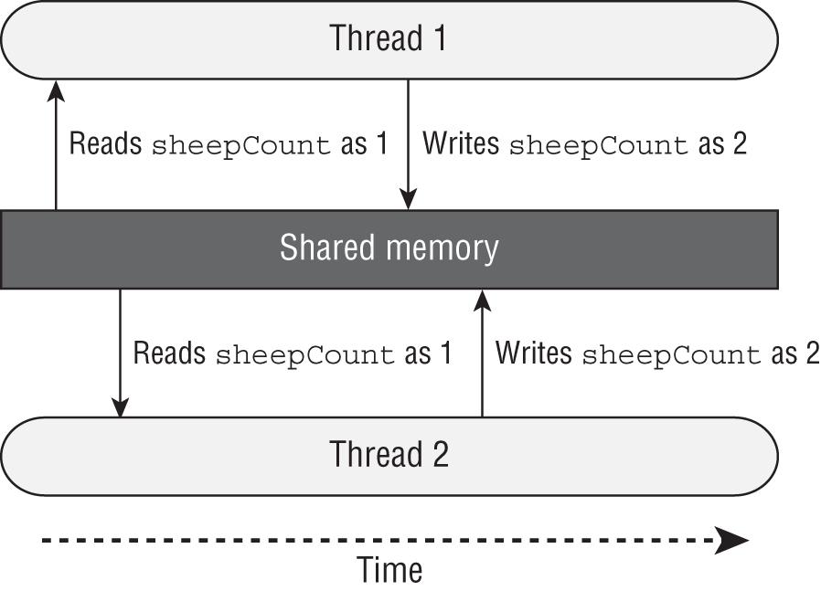

### Accessing Data with volatile

- The `volatile` keyword is used to guarantee that access to data within memory is consistent.
- The volatile attribute ensures that only one thread is modifying a variable at one time and that data read among multiple threads is consistent.
- Does volatile provide thread-safety? Not exactly. 

```java
private volatile int sheepCount = 0;
private void incrementAndReport() {
   System.out.print((++sheepCount)+" ");
}
```

```
2 6 1 7 5 3 2 9 4 8
```

- The reason this code is not thread-safe is that `++sheepCount` is still two distinct operations. Put another way, if the increment operator represents the expression `sheepCount = sheepCount + 1`, then each read and write operation is thread-safe, but the combined operation is not
- increment operator ++ is not thread-safe, even when volatile is used. It is not thread-safe because the operation is not atomic, carrying out two tasks, read and write, that can be interrupted by other threads.

### Protecting Data with Atomic Classes

**Atomic** is the property of an operation to be carried out as a single unit of execution without any interference from another thread.

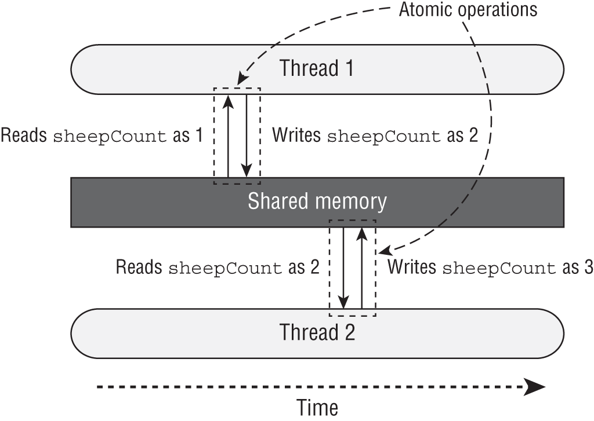

<table>
<thead>
<tr>
<th scope="col" class="left">Class name</th>
<th scope="col" class="left">Description</th> </tr> </thead>
<tbody>
<tr>
<td class="left"><code>AtomicBoolean</code></td>
<td class="left">A <code>boolean</code> value that may be updated atomically</td> </tr>
<tr>
<td class="left"><code>AtomicInteger</code></td>
<td class="left">An <code>int</code> value that may be updated atomically</td> </tr>
<tr>
<td class="left"><code>AtomicLong</code></td>
<td class="left">A <code>long</code> value that may be updated atomically</td> </tr> </tbody> </table>

```java
private AtomicInteger sheepCount = new AtomicInteger(0);
private void incrementAndReport() {
   System.out.print(sheepCount.incrementAndGet()+" ");
}
```

```
2 3 1 4 5 6 7 8 9 10
1 4 3 2 5 6 7 8 9 10
1 4 3 5 6 2 7 8 10 9
```

<table>
<thead>
<tr>
<th scope="col" class="left">Method</th>
<th scope="col" class="left">Description</th> </tr> </thead>
<tbody>
<tr>
<td class="left"><code>get()</code></td>
<td class="left">Retrieves current value</td> </tr>
<tr>
<td class="left"><code>set(<i>type</i> newValue)</code></td>
<td class="left">Sets given value, equivalent to assignment <code>=</code> operator</td> </tr>
<tr>
<td class="left"><code>getAndSet(<i>type</i> newValue)</code></td>
<td class="left">Atomically sets new value and returns old value</td> </tr>
<tr>
<td class="left"><code>incrementAndGet()</code></td>
<td class="left">For numeric classes, atomic pre-increment operation equivalent to <code>++value</code></td> </tr>
<tr>
<td class="left"><code>getAndIncrement()</code></td>
<td class="left">For numeric classes, atomic post-increment operation equivalent to <code>value++</code></td> </tr>
<tr>
<td class="left"><code>decrementAndGet()</code></td>
<td class="left">For numeric classes, atomic pre-decrement operation equivalent to <code>--value</code></td> </tr>
<tr>
<td class="left"><code>getAndDecrement()</code></td>
<td class="left">For numeric classes, atomic post-decrement operation equivalent to <code>value--</code></td> </tr> </tbody> </table>


### synchronized Blocks

- common technique is to use a **monitor** to synchronize access. A **monitor**, also called a lock, is a structure that supports mutual exclusion, which is the property that at most one thread is executing a particular segment of code at a given time.
- In Java, any `Object` can be used as a **monitor**, along with the synchronized keyword

```java
var manager = new SheepManager();
synchronized(manager) {
   // Work to be completed by one thread at a time
}
```

- Each thread that arrives will first check if any threads are already running the block. If the lock is not available, the thread will transition to a BLOCKED state until it can “acquire the lock.” If the lock is available (or the thread already holds the lock), the single thread will enter the block, preventing all other threads from entering. Once the thread finishes executing the block, it will release the lock, allowing one of the waiting threads to proceed.
- To synchronize access across multiple threads, each thread must have access to the same Object. If each thread synchronizes on different objects, the code is not thread-safe.

```java
import java.util.concurrent.*;
public class SheepManager {
   private int sheepCount = 0;
   private void incrementAndReport() {
      synchronized(this) {
         System.out.print((++sheepCount)+" ");
      }
   }
   public static void main(String[] args) {
      ExecutorService service = Executors.newFixedThreadPool(20);
      try {
         var manager = new SheepManager();
         for(int i = 0; i < 10; i++)
            service.submit(() -> manager.incrementAndReport());
      } finally {
         service.shutdown();
      } } }
```

```
1 2 3 4 5 6 7 8 9 10
```

also works as well

```java
private final Object herd = new Object();
private void incrementAndReport() {
   synchronized(herd) {
      System.out.print((++sheepCount)+" ");
   }
}
```

### Synchronizing on Methods

two method definitions are equivalent:
```java
void sing() {
   synchronized(this) {
      System.out.print("La la la!");
   }
}
synchronized void sing() {
   System.out.print("La la la!");
}
```

You can use static synchronization if you need to order thread access across all instances rather than a single instance.
```java
static void dance() {
   synchronized(SheepManager.class) {
      System.out.print("Time to dance!");
   }
}
static synchronized void dance() {
   System.out.print("Time to dance!");
}
```

### Lock Framework

A synchronized block supports only a limited set of functionality. For example, what if we want to check whether a lock is available and, if it is not, perform some other task? Furthermore, if the lock is never available and we synchronize on it, we might wait forever.

The Concurrency API includes the `Lock` interface, which is conceptually similar to using the synchronized keyword but with a lot more bells and whistles. Instead of synchronizing on any `Object`, though, we can “lock” only on an object that implements the `Lock` interface.

#### ReentrantLock


-  at most one thread is allowed to hold a lock at any given time.
- Wile certainly not required, it is a good practice to use a try/finally block with Lock instances. Doing so ensures that any acquired locks are properly released.
- The ReentrantLock class includes a constructor that takes a single boolean and sets a “fairness” parameter. If the parameter is set to true, the lock will usually be granted to each thread in the order in which it was requested. It is false by default when using the no-argument constructor. In practice, you should enable fairness only when ordering is absolutely required, as it could lead to a significant slowdown.
- Ability to request a lock without blocking.
- Ability to request a lock while blocking for a specified amount of time.

These two implementations are conceptually equivalent. 

```java
// Implementation #1 with a synchronized block
Object object = new Object();
synchronized(object) {
   // Protected code
}
 
// Implementation #2 with a Lock
Lock lock = new ReentrantLock();
try {
   lock.lock();
   // Protected code
} finally {
   lock.unlock();
}
```

 If you attempt to release a lock that you do not have, you will get an exception at runtime.

 ```java
Lock lock = new ReentrantLock();
lock.unlock(); // IllegalMonitorStateException
```

<table>
<thead>
<tr>
<th scope="col" class="left">Method</th>
<th scope="col" class="left">Description</th> </tr> </thead>
<tbody>
<tr>
<td class="left"><code>void <b>lock</b>()</code></td>
<td class="left">Requests lock and blocks until lock is acquired.</td> </tr>
<tr>
<td class="left"><code>void <b>unlock</b>()</code></td>
<td class="left">Releases lock.</td> </tr>
<tr>
<td class="left"><code>boolean <b>tryLock</b>()</code></td>
<td class="left">Requests lock and returns immediately. Returns <code>boolean</code> indicating whether lock was successfully acquired.</td> </tr>
<tr>
<td class="left"><code>boolean <b>tryLock</b>(long timeout, TimeUnit unit)</code></td>
<td class="left">Requests lock and blocks for specified time or until lock is acquired. Returns <code>boolean</code> indicating whether lock was successfully acquired.</td> </tr> </tbody> </table>


The ReentrantLock class maintains a counter of the number of times a lock has been successfully granted to a thread. To release the lock for other threads to use, unlock() must be called the same number of times the lock was granted.

```java
Lock lock = new ReentrantLock();
if(lock.tryLock()) {
   try {
      lock.lock();
      System.out.println("Lock obtained, entering protected code");
   } finally {
      lock.unlock();
   } }

// only one unlocking. It's a lock forever.
```   

#### ReentrantReadWriteLock

- includes separate locks for reading and writing data and is useful on data structures where reads are far more common than writes. For example, if you have a thousand threads reading data but only one thread writing data, this class can help you maximize concurrent access.

### CyclicBarrier

- After a `CyclicBarrier` limit is reached (aka the barrier is broken), all threads are released, and the number of threads waiting on the CyclicBarrier goes back to zero. 

```java
import java.util.concurrent.*;
public class LionPenManager {
   private void removeLions() { System.out.println("Removing lions");   }
   private void cleanPen()    { System.out.println("Cleaning the pen"); }
   private void addLions()    { System.out.println("Adding lions");     }
   public void performTask() {
      removeLions();
      cleanPen();
      addLions();
   }
   public static void main(String[] args) {
      var service = Executors.newFixedThreadPool(4);
      try {
         var manager = new LionPenManager();
         for (int i = 0; i < 4; i++)
            service.submit(() -> manager.performTask());
      } finally {
         service.shutdown();
      } } }
```      

```
Removing lions
Removing lions
Cleaning the pen
Adding lions
Removing lions
Cleaning the pen
Adding lions
Removing lions
Cleaning the pen
Adding lions
Cleaning the pen
Adding lions
```

```java
import java.util.concurrent.*;
public class LionPenManager {
   private void removeLions() { System.out.println("Removing lions");   }
   private void cleanPen()    { System.out.println("Cleaning the pen"); }
   private void addLions()    { System.out.println("Adding lions");     }
   public void performTask(CyclicBarrier c1, CyclicBarrier c2) {
      try {
         removeLions();
         c1.await();
         cleanPen();
         c2.await();
         addLions();
      } catch (InterruptedException | BrokenBarrierException e) {
         // Handle checked exceptions here
      }
   }
   public static void main(String[] args) {
      var service = Executors.newFixedThreadPool(4);
      try {
         var manager = new LionPenManager();
         var c1 = new CyclicBarrier(4);
         var c2 = new CyclicBarrier(4,
            () -> System.out.println("*** Pen Cleaned!"));
         for (int i = 0; i < 4; i++)
            service.submit(() -> manager.performTask(c1, c2));
      } finally {
         service.shutdown();
      } } }
```      

```
Removing lions
Removing lions
Removing lions
Removing lions
Cleaning the pen
Cleaning the pen
Cleaning the pen
Cleaning the pen
*** Pen Cleaned!
Adding lions
Adding lions
Adding lions
Adding lions
```

## Concurrent Collections

- If the collection is immutable (and contains immutable objects), the concurrent collections are not necessary. Immutable objects can be accessed by any number of threads and do not require synchronization. By definition, they do not change, so there is no chance of a memory consistency error.

### Memory Consistency Errors

 - **memory consistency error** occurs when two threads have inconsistent views of what should be the same data. Conceptually, we want writes on one thread to be available to another thread if it accesses the concurrent collection after the write has occurred.
- When two threads try to modify the same nonconcurrent collection, the JVM may throw a `ConcurrentModificationException` at runtime.
-  In fact, it can happen with a single thread.

```java
var foodData = new HashMap<String, Integer>();
foodData.put("penguin", 1);
foodData.put("flamingo", 2);
for(String key: foodData.keySet())
   foodData.remove(key); // ConcurrentModificationException
```

iterator on `keySet()` is not properly updated after the first element is removed.

to fix

```java
var foodData = new ConcurrentHashMap<String, Integer>();
```

- `ConcurrentHashMap` is ordering read/write access such that all access to the class is consistent.
- the iterator created by `keySet()` is updated as soon as an object is removed from the Map.

### Working with Concurrent Classes

- When you see a class with Skip in the name, just think “sorted concurrent” collections
- The CopyOnWrite classes create a copy of the collection any time a reference is added, removed, or changed in the collection and then update the original collection reference to point to the copy. These classes are commonly used to ensure an iterator doesn't see modifications to the collection.
- The CopyOnWrite classes can use a lot of memory, since a new collection structure is created any time the collection is modified. Therefore, they are commonly used in multithreaded environment situations where reads are far more common than writes.

<table>
<thead>
<tr>
<th scope="col" class="left">Class name</th>
<th scope="col" class="left">Java Collections interfaces</th>
<th scope="col" class="left">Sorted?</th>
<th scope="col" class="left">Blocking?</th> </tr> </thead>
<tbody>
<tr>
<td class="left"><code>ConcurrentHashMap</code></td>
<td class="left"><code>Map</code> <br> <code>ConcurrentMap</code></td>
<td><span class="center">No</span></td>
<td><span class="center">No</span></td> </tr>
<tr>
<td class="left"><code>ConcurrentLinkedQueue</code></td>
<td class="left"><code>Queue</code></td>
<td><span class="center">No</span></td>
<td><span class="center">No</span></td> </tr>
<tr>
<td class="left"><code>ConcurrentSkipListMap</code></td>
<td class="left"><code>Map</code> <br> <code>SortedMap</code> <br> <code>NavigableMap</code> <br> <code>ConcurrentMap</code> <br> <code>ConcurrentNavigableMap</code></td>
<td><span class="center">Yes</span></td>
<td><span class="center">No</span></td> </tr>
<tr>
<td class="left"><code>ConcurrentSkipListSet</code></td>
<td class="left"><code>Set</code> <br> <code>SortedSet</code> <br> <code>NavigableSet</code></td>
<td><span class="center">Yes</span></td>
<td><span class="center">No</span></td> </tr>
<tr>
<td class="left"><code>CopyOnWriteArrayList</code></td>
<td class="left"><code>List</code></td>
<td><span class="center">No</span></td>
<td><span class="center">No</span></td> </tr>
<tr>
<td class="left"><code>CopyOnWriteArraySet</code></td>
<td class="left"><code>Set</code></td>
<td><span class="center">No</span></td>
<td><span class="center">No</span></td> </tr>
<tr>
<td class="left"><code>LinkedBlockingQueue</code></td>
<td class="left"><code>Queue</code> <br> <code>BlockingQueue</code></td>
<td><span class="center">No</span></td>
<td><span class="center">Yes</span></td> </tr> </tbody> </table>

```java
List<Integer> favNumbers = new CopyOnWriteArrayList<>(List.of(4, 3, 42));
for (var n : favNumbers) {
   System.out.print(n + " ");                      // 4 3 42
   favNumbers.add(n+1);
}
System.out.println();
System.out.println("Size: " + favNumbers.size());  // Size: 6
```

 Alternatively, if we had used a regular `ArrayList` object, a `ConcurrentModificationException` would have been thrown at runtime.

### Obtaining Synchronized Collections

Synchronized Collections methods

```java
synchronizedCollection(Collection<T> c)
synchronizedList(List<T> list)
synchronizedMap(Map<K,V> m)
synchronizedNavigableMap(NavigableMap<K,V> m)
synchronizedNavigableSet(NavigableSet<T> s)
synchronizedSet(Set<T> s)
synchronizedSortedMap(SortedMap<K,V> m)
synchronizedSortedSet(SortedSet<T> s)
```

## Identifying Threading Problems

### Liveness

- **Liveness** is the ability of an application to be able to execute in a timely manner. 
- Liveness problems are those in which the application becomes unresponsive or is in some kind of “stuck” state. 
- liveness problems are often the result of a thread entering a `BLOCKING` or `WAITING` state forever, or repeatedly entering/exiting these states.

#### Deadlock

- **Deadlock** occurs when two or more threads are blocked forever, each waiting on the other

```java
import java.util.concurrent.*;
class Food {}
class Water {}
public record Fox(String name) {
   public void eatAndDrink(Food food, Water water) {
      synchronized(food) {
         System.out.println(name() + " Got Food!");
         move();
         synchronized(water) {
            System.out.println(name() + " Got Water!");
         } } }
   public void drinkAndEat(Food food, Water water) {
      synchronized(water) {
         System.out.println(name() + " Got Water!");
         move();
         synchronized(food) {
            System.out.println(name() + " Got Food!");
         } } }
   public void move() {
      try { Thread.sleep(100); } catch (InterruptedException e) {}
   }
   public static void main(String[] args) {
      // Create participants and resources
      var foxy = new Fox("Foxy");
      var tails = new Fox("Tails");
      var food = new Food();
      var water = new Water();
      // Process data
      var service = Executors.newScheduledThreadPool(10);
      try {
         service.submit(() -> foxy.eatAndDrink(food,water));
         service.submit(() -> tails.drinkAndEat(food,water));
      } finally {
         service.shutdown();
      } 
   }
}
```      

```
Foxy Got Food!
Tails Got Water!  ...   and forever hangs out
```

#### Starvation

**Starvation** occurs when a single thread is denied access to a shared resource or lock. The thread is still active, but it is unable to complete its work as a result of other threads constantly taking the resource that it is trying to access.

#### Livelock

- **Livelock** occurs when two or more threads are conceptually blocked forever, although they are each still active and trying to complete their task. Livelock is a special case of resource starvation in which two or more threads actively try to acquire a set of locks, are unable to do so, and restart part of the process.
- Livelock is often a result of two threads trying to resolve a deadlock. 
- In practice, livelock is often a difficult issue to detect. Threads in a livelock state appear active and able to respond to requests, even when they are stuck in an endless cycle.

### Managing Race Conditions

A **race condition** is an undesirable result that occurs when two tasks that should be completed sequentially are completed at the same time

Examples:
1. like above change shared variable without atomic or synchronization
   
2. Imagine that two zoo patrons, Olivia and Sophia, are signing up for an account on the zoo's new visitor website. Both of them want to use the same username, ZooFan, and each sends a request to create the account at the same time

   Possible Outcomes for This Race Condition: 

   - Both users are able to create accounts with the username ZooFan.
   - Neither user is able to create an account with the username ZooFan, and an error message is returned to both users.
   - One user is able to create an account with the username ZooFan, while the other user receives an error message

## Working with Parallel Streams

 - A **serial stream** is a stream in which the results are ordered, with only one entry being processed at a time.
- A **parallel stream** is capable of processing results concurrently, using multiple threads. 
- The number of threads available in a parallel stream is proportional to the number of available CPUs in your environment.
- `Stream` interface includes a method `isParallel()` that can be used to test whether the instance of a stream supports parallel processing
-  `map()` and `forEach()` operations on a parallel stream are equivalent to submitting multiple `Runnable` lambda expressions to a pooled thread executor and then waiting for the results.
- operations that consider order, such as `findFirst()`, `limit()`, and `skip()` order is still preserved, but performance may suffer on a parallel stream as a result of a parallel processing task being forced to coordinate all of its threads in a synchronized-like fashion. On the plus side, the results of ordered operations on a parallel stream will be consistent with a serial stream. For example, calling `skip(5).limit(2).findFirst()` will return the same result on ordered serial and parallel streams.


```java
Collection<Integer> collection = List.of(1,2);
 
Stream<Integer> p1 = collection.stream().parallel();
Stream<Integer> p2 = collection.parallelStream();
```

### Parallel Decomposition

**parallel decomposition** is the process of taking a task, breaking it into smaller pieces that can be performed concurrently, and then reassembling the results.

```java
private static int doWork(int input) {
   try {
      Thread.sleep(5000);
   } catch (InterruptedException e) {}
   return input;
}
```

with serial stream 

```java
long start = System.currentTimeMillis();
List.of(1,2,3,4,5)
   .stream()
   .map(w -> doWork(w))
   .forEach(s -> System.out.print(s + " "));
System.out.println();
var timeTaken = (System.currentTimeMillis()-start)/1000;
System.out.println("Time: "+timeTaken+" seconds");
```

```
1 2 3 4 5
Time: 25 seconds
```

with parallel stream 


```java
long start = System.currentTimeMillis();
List.of(1,2,3,4,5)
   .parallelStream()
   .map(w -> doWork(w))
   .forEach(s -> System.out.print(s + " "));
System.out.println();
var timeTaken = (System.currentTimeMillis()-start)/1000;
System.out.println("Time: "+timeTaken+" seconds");
```

```
3 2 1 5 4
Time: 5 seconds
```

with ordering

```java
long start = System.currentTimeMillis();
List.of(1,2,3,4,5)
   .parallelStream()
   .map(w -> doWork(w))
   .forEachOrdered(s -> System.out.print(s + " "));
System.out.println();
var timeTaken = (System.currentTimeMillis()-start)/1000;
System.out.println("Time: "+timeTaken+" seconds");
```

```
1 2 3 4 5
Time: 5 seconds
```
While we've lost some of the performance gains of using a parallel stream, our `map()` operation can still take advantage of the parallel stream.

### Unordered stream

- All of the streams are considered ordered by default. 
- It is possible to create an unordered stream from an ordered stream, similar to how you create a parallel stream from a serial stream.

```java
 List.of(1,2,3,4,5,6).stream().unordered();
 ```

- This method does not reorder the elements; it just tells the JVM that if an order-based stream operation is applied, the order can be ignored. For example, calling `skip(5)` on an unordered stream will skip any 5 elements, not necessarily the first 5 required on an ordered stream.
- For serial streams, using an unordered version has no effect. But on parallel streams, the results can greatly improve performance.
```java
    List.of(1,2,3,4,5,6).stream().unordered().parallel();
```

### Parallel reduction

- A **parallel reduction** is a reduction operation applied to a parallel stream. The results for parallel reductions can differ from what you expect when working with serial streams.

#### Combining Results with reduce()

```java
<U> U reduce(U identity,
   BiFunction<U,? super T,U> accumulator,
   BinaryOperator<U> combiner)
```

```java
System.out.println(List.of('w', 'o', 'l', 'f')
   .parallelStream()
   .reduce("",
      (s1,c) -> s1 + c,
      (s2,s3) -> s2 + s3)); // wolf
```      

 - in a serial stream, wolf is built one character at a time. In a parallel stream, the intermediate values `wo` and `lf` are created and then combined.
- make sure that the accumulator and combiner produce the same result regardless of the order they are called in.

```java
System.out.println(List.of(1,2,3,4,5,6)
   .parallelStream()
   .reduce(0, (a, b) -> (a - b))); // PROBLEMATIC ACCUMULATOR. 
   // It may output -21, 3, or some other value.
```

```java
System.out.println(List.of("w","o","l","f")
   .parallelStream()
   .reduce("X", String::concat)); // XwXoXlXf
```   

As part of the parallel process, the identity is applied to multiple elements in the stream, resulting in very unexpected data.

Although the one- and two-argument versions of reduce() support parallel processing, it is recommended that you use the three-argument version of reduce() when working with parallel streams. Providing an explicit combiner method allows the JVM to partition the operations in the stream more efficiently.

#### Combining Results with collect()

```java
<R> R collect(Supplier<R> supplier,
   BiConsumer<R, ? super T> accumulator,
   BiConsumer<R, R> combiner)
```   

```java
Stream<String> stream = Stream.of("w", "o", "l", "f").parallel();
SortedSet<String> set = stream.collect(ConcurrentSkipListSet::new,
   Set::add,
   Set::addAll);
System.out.println(set);  // [f, l, o, w]
```

Recall that elements in a `ConcurrentSkipListSet` are sorted according to their natural ordering. You should use a concurrent collection to combine the results, ensuring that the results of concurrent threads do not cause a ConcurrentModificationException.

#### Requirements for Parallel Reduction with collect()

- The stream is parallel.
- The parameter of the `collect()` operation has the `Characteristics.CONCURRENT` characteristic.
- Either the stream is unordered or the collector has the characteristic `Characteristics.UNORDERED`.

```java
parallelStream.collect(Collectors.toSet());  // Not a parallel reduction
```

while `Collectors.toSet()` does have the `UNORDERED` characteristic, it does not have the `CONCURRENT` characteristic.

The `Collectors` class includes two sets of static methods for retrieving collectors, `toConcurrentMap()` and `groupingByConcurrent()`, both of which are `UNORDERED` and `CONCURRENT`. These methods produce `Collector` instances capable of performing parallel reductions efficiently. Like their nonconcurrent counterparts, there are overloaded versions that take additional arguments.

```java
Stream<String> ohMy = Stream.of("lions", "tigers", "bears").parallel();
ConcurrentMap<Integer, String> map = ohMy
   .collect(Collectors.toConcurrentMap(String::length,
      k -> k,
      (s1, s2) -> s1 + "," + s2));
System.out.println(map);             // {5=lions,bears, 6=tigers}
System.out.println(map.getClass());  // java.util.concurrent.ConcurrentHashMap
```

```java
var ohMy = Stream.of("lions", "tigers", "bears").parallel();
ConcurrentMap<Integer, List<String>> map = ohMy.collect(
   Collectors.groupingByConcurrent(String::length));
System.out.println(map);             // {5=[lions, bears], 6=[tigers]}
```

#### Avoiding stateful streams

- Side effects can appear in parallel streams if your lambda expressions are stateful. 
- A stateful lambda expression is one whose result depends on any state that might change during the execution of a pipeline. 

```java
public List<Integer> addValues(IntStream source) {
   var data = Collections.synchronizedList(new ArrayList<Integer>());
   source.filter(s -> s % 2 == 0)
      .forEach(i -> { data.add(i); }); // STATEFUL: DON'T DO THIS!
   return data;
}
```

```java
var list = addValues(IntStream.range(1, 11));
System.out.print(list);                 // [2, 4, 6, 8, 10]
```

```java
var list = addValues(IntStream.range(1, 11).parallel());
System.out.print(list);                 // [6, 8, 10, 2, 4]
```

to fix rewrite as stateless

```java
public List<Integer> addValuesBetter(IntStream source) {
   return source.filter(s -> s % 2 == 0)
      .boxed()
      .collect(Collectors.toList());
}
```

- This method processes the stream and then collects all the results into a new list. It produces the same ordered result on both serial and parallel streams. 
- In fact, they should be avoided in serial streams since doing so limits the code's ability to someday take advantage of parallelization.


## Data races

example from String class:

The hash or hashIsZero fields are subject to a benign data race,
making it crucial to ensure that any observable result of the
calculation in this method stays correct under any possible read of
these fields. Necessary restrictions to allow this to be correct
without explicit memory fences or similar concurrency primitives is
that we can ever only write to one of these two fields for a given
String instance, and that the computation is idempotent and derived
from immutable state

```java

public final class String
    implements java.io.Serializable, Comparable<String>, CharSequence,
               Constable, ConstantDesc {

    private final byte[] value;
    private int hash;
    private boolean hashIsZero; // Default to false;

public int hashCode() {
    int h = hash;
    if (h == 0 && !hashIsZero) {
        h = isLatin1() ? StringLatin1.hashCode(value)
                       : StringUTF16.hashCode(value);
        if (h == 0) {
            hashIsZero = true;
        } else {
            hash = h;
        }
    }
    return h;
}

}
```


# I/O

## Referencing Files and Directories

- system property to retrieve the local separator character for the current environment:
```java
  System.out.print(System.getProperty("file.separator"));
  ```
- While the I/O APIs do not support symbolic links, NIO.2 includes full support for creating, detecting, and navigating symbolic links within the file system.
- `File` or `Path` can represent a file or a directory.
- `java.io.File` is the I/O class, while `Files` is an NIO.2 helper class. `Files` operates on `Path` instances, not `java.io.File`
 instances

```java
File zooFile1 = new File("/home/tiger/data/stripes.txt");
File zooFile2 = new File("/home/tiger", "data/stripes.txt");
 
File parent = new File("/home/tiger");
File zooFile3 = new File(parent, "data/stripes.txt");
 
System.out.println(zooFile1.exists());
```

- `Path` is an interface, we can't create an instance directly

```java
Path zooPath1 = Path.of("/home/tiger/data/stripes.txt");
Path zooPath2 = Path.of("/home", "tiger", "data", "stripes.txt");
 
Path zooPath3 = Paths.get("/home/tiger/data/stripes.txt");
Path zooPath4 = Paths.get("/home", "tiger", "data", "stripes.txt");
 
System.out.println(Files.exists(zooPath1));
```

```java
File file = new File("rabbit");
Path nowPath = file.toPath();
File backToFile = nowPath.toFile();
```

```java
Path zooPath1 = FileSystems.getDefault()
   .getPath("/home/tiger/data/stripes.txt");
Path zooPath2 = FileSystems.getDefault()
   .getPath("/home", "tiger", "data", "stripes.txt");
```

<table>
<thead>
<tr>
<th scope="col" class="left">Creates</th>
<th scope="col" class="left">Declared in</th>
<th scope="col" class="left">Method or Constructor</th> </tr> </thead>
<tbody>
<tr>
<td class="left"><code>File</code></td>
<td class="left"><code>File</code></td>
<td class="left"><code>public <b>File</b>(String pathname)</code> <br> <code>public <b>File</b>(File parent, String child)</code> <br> <code>public <b>File</b>(String parent, String child)</code></td> </tr>
<tr>
<td class="left"><code>File</code></td>
<td class="left"><code>Path</code></td>
<td class="left"><code>public default File <b>toFile</b>()</code></td> </tr>
<tr>
<td class="left"><code>Path</code></td>
<td class="left"><code>File</code></td>
<td class="left"><code>public Path <b>toPath</b>()</code></td> </tr>
<tr>
<td class="left"><code>Path</code></td>
<td class="left"><code>Path</code></td>
<td class="left"><code>public static Path <b>of</b>(String first, String… more)</code> <br> <code>public static Path <b>of</b>(URI uri)</code></td> </tr>
<tr>
<td class="left"><code>Path</code></td>
<td class="left"><code>Paths</code></td>
<td class="left"><code>public static Path <b>get</b>(String first, String… more)</code> <br> <code>public static Path <b>get</b>(URI uri)</code></td> </tr>
<tr>
<td class="left"><code>Path</code></td>
<td class="left"><code>FileSystem</code></td>
<td class="left"><code>public Path <b>getPath</b>(String first, String… more)</code></td> </tr>
<tr>
<td class="left"><code>FileSystem</code></td>
<td class="left"><code>FileSystems</code></td>
<td class="left"><code>public static FileSystem <b>getDefault</b>()</code></td> </tr> </tbody> </table>

## Operating on File and Path

<table>
<thead>
<tr>
<th scope="col" class="left">Description</th>
<th scope="col" class="left">I/O file instance method</th>
<th scope="col" class="left">NIO.2 path instance method</th> </tr> </thead>
<tbody>
<tr>
<td class="left">Gets name of file/directory</td>
<td class="left"><code>getName()</code></td>
<td class="left"><code>getFileName()</code></td> </tr>
<tr>
<td class="left">Retrieves parent directory or <code>null</code> if there is none</td>
<td class="left"><code>getParent()</code></td>
<td class="left"><code>getParent()</code></td> </tr>
<tr>
<td class="left">Checks if file/directory is absolute path</td>
<td class="left"><code>isAbsolute()</code></td>
<td class="left"><code>isAbsolute()</code></td> </tr> </tbody> </table>

<table>
<thead>
<tr>
<th scope="col" class="left">Description</th>
<th scope="col" class="left">I/O file instance method</th>
<th scope="col" class="left">NIO.2 files static method</th> </tr> </thead>
<tbody>
<tr>
<td class="left">Deletes file/directory</td>
<td class="left"><code>delete()</code></td>
<td class="left"><code>deleteIfExists(Path p) throws IOException</code></td> </tr>
<tr>
<td class="left">Checks if file/directory exists</td>
<td class="left"><code>exists()</code></td>
<td class="left"><code>exists(Path p, LinkOption… o)</code></td> </tr>
<tr>
<td class="left">Retrieves absolute path of file/directory</td>
<td class="left"><code>getAbsolutePath()</code></td>
<td class="left"><code>toAbsolutePath()</code></td> </tr>
<tr>
<td class="left">Checks if resource is directory</td>
<td class="left"><code>isDirectory()</code></td>
<td class="left"><code>isDirectory(Path p, LinkOption… o)</code></td> </tr>
<tr>
<td class="left">Checks if resource is file</td>
<td class="left"><code>isFile()</code></td>
<td class="left"><code>isRegularFile(Path p, LinkOption… o)</code></td> </tr>
<tr>
<td class="left">Returns the time the file was last modified</td>
<td class="left"><code>lastModified()</code></td>
<td class="left"><code>getLastModifiedTime(Path p, LinkOption… o) throws IOException</code></td> </tr>
<tr>
<td class="left">Retrieves number of bytes in file</td>
<td class="left"><code>length()</code></td>
<td class="left"><code>size(Path p) throws IOException</code></td> </tr>
<tr>
<td class="left">Lists contents of directory</td>
<td class="left"><code>listFiles()</code></td>
<td class="left"><code>list(Path p) throws IOException</code></td> </tr>
<tr>
<td class="left">Creates directory</td>
<td class="left"><code>mkdir()</code></td>
<td class="left"><code>createDirectory(Path p, FileAttribute… a) throws IOException</code></td> </tr>
<tr>
<td class="left">Creates directory including any nonexistent parent directories</td>
<td class="left"><code>mkdirs()</code></td>
<td class="left"><code>createDirectories(Path p, FileAttribute… a) throws IOException</code></td> </tr>
<tr>
<td class="left">Renames file/directory denoted</td>
<td class="left"><code>renameTo(File dest)</code></td>
<td class="left"><code>move(Path src, Path dest, CopyOption… o) throws IOException</code></td> </tr> </tbody> </table>

```java
public static void io() {
   var file = new File("C:\\data\\zoo.txt");
   if (file.exists()) {
      System.out.println("Absolute Path: " + file.getAbsolutePath());
      System.out.println("Is Directory: " + file.isDirectory());
      System.out.println("Parent Path: " + file.getParent());
      if (file.isFile()) {
         System.out.println("Size: " + file.length());
         System.out.println("Last Modified: " + file.lastModified());
      } else {
         for (File subfile : file.listFiles()) {
            System.out.println("   " + subfile.getName());
      } } } }
```

```
Absolute Path: C:\data\zoo.txt
Is Directory: false
Parent Path: C:\data
Size: 12382
Last Modified: 1650610000000
```

```
Absolute Path: C:\data
Is Directory: true
Parent Path: C:\
   employees.txt
   zoo.txt
   zoo-backup.txt
```

```java
public static void nio() throws IOException {
   var path = Path.of("C:\\data\\zoo.txt");
   if (Files.exists(path)) {
      System.out.println("Absolute Path: " + path.toAbsolutePath());
      System.out.println("Is Directory: " + Files.isDirectory(path));
      System.out.println("Parent Path: " + path.getParent());
      if (Files.isRegularFile(path)) {
         System.out.println("Size: " + Files.size(path));
         System.out.println("Last Modified: " 
            + Files.getLastModifiedTime(path));
      } else {
         try (Stream<Path> stream = Files.list(path)) {
            stream.forEach(p -> 
               System.out.println("   " + p.getName()));
      } } } }
```

 Common NIO.2 method arguments
<table>
<thead>
<tr>
<th scope="col" class="left">Enum type</th>
<th scope="col" class="left">Interface inherited</th>
<th scope="col" class="left">Enum value</th>
<th scope="col" class="left">Details</th> </tr> </thead>
<tbody>
<tr>
<td class="left"><code>LinkOption</code></td>
<td class="left"><code>CopyOption</code> <br> <code>OpenOption</code></td>
<td class="left"><code>NOFOLLOW_LINKS</code></td>
<td class="left">Do not follow symbolic links.</td> </tr>
<tr>
<td class="left" rowspan="3"><code>StandardCopyOption</code></td>
<td class="left" rowspan="3"><code>CopyOption</code></td>
<td class="left"><code>ATOMIC_MOVE</code></td>
<td class="left">Move file as atomic file system operation.</td> </tr>
<tr>
<td class="left"><code>COPY_ATTRIBUTES</code></td>
<td class="left">Copy existing attributes to new file.</td> </tr>
<tr>
<td class="left"><code>REPLACE_EXISTING</code></td>
<td class="left">Overwrite file if it already exists.</td> </tr>
<tr>
<td class="left" rowspan="6"><code>StandardOpenOption</code></td>
<td class="left" rowspan="6"><code>OpenOption</code></td>
<td class="left"><code>APPEND</code></td>
<td class="left">If file is already open for write, append to the end.</td> </tr>
<tr>
<td class="left"><code>CREATE</code></td>
<td class="left">Create new file if it does not exist.</td> </tr>
<tr>
<td class="left"><code>CREATE_NEW</code></td>
<td class="left">Create new file only if it does not exist; fail otherwise.</td> </tr>
<tr>
<td class="left"><code>READ</code></td>
<td class="left">Open for read access.</td> </tr>
<tr>
<td class="left"><code>TRUNCATE_EXISTING</code></td>
<td class="left">If file is already open for write, erase file and append to beginning.</td> </tr>
<tr>
<td class="left"><code>WRITE</code></td>
<td class="left">Open for write access.</td> </tr>
<tr>
<td class="left"><code>FileVisitOption</code></td>
<td class="left">N/A</td>
<td class="left"><code>FOLLOW_LINKS</code></td>
<td class="left">Follow symbolic links.</td> </tr> </tbody> </table>

```java
Path path = Paths.get("schedule.xml");
boolean exists = Files.exists(path, LinkOption.NOFOLLOW_LINKS);
```

```java
void copy(Path source, Path target) throws IOException {
   Files.move(source, target,
      LinkOption.NOFOLLOW_LINKS,
      StandardCopyOption.ATOMIC_MOVE);
}
```

### Interacting with NIO.2 Paths

- `Path` instances are immutable.
```java
Path p = Path.of("whale");
p.resolve("krill");
System.out.println(p);  // whale
```

```java
Path.of("/zoo/../home").getParent().normalize().toAbsolutePath();
```

<table>
<thead>
<tr>
<th scope="col" class="left">Description</th>
<th scope="col" class="left">Method or constructor</th> </tr> </thead>
<tbody>
<tr>
<td class="left">File path as string</td>
<td class="left">
<pre id="c14-code-0041"><code>public String <b>toString</b>()</code>
</pre></td> </tr>
<tr>
<td class="left">Single segment</td>
<td class="left">
<pre id="c14-code-0042"><code>public Path <b>getName</b>(int index)</code>
</pre></td> </tr>
<tr>
<td class="left">Number of segments</td>
<td class="left">
<pre id="c14-code-0043"><code>public int <b>getNameCount</b>()</code>
</pre></td> </tr>
<tr>
<td class="left">Segments in range</td>
<td class="left">
<pre id="c14-code-0044"><code>public Path <b>subpath</b>(int beginIndex, int endIndex)</code>
</pre></td> </tr>
<tr>
<td class="left">Final segment</td>
<td class="left">
<pre id="c14-code-0045"><code>public Path <b>getFileName</b>()</code>
</pre></td> </tr>
<tr>
<td class="left">Immediate parent</td>
<td class="left">
<pre id="c14-code-0046"><code>public Path <b>getParent</b>()</code>
</pre></td> </tr>
<tr>
<td class="left">Top-level segment</td>
<td class="left">
<pre id="c14-code-0047"><code>public Path <b>getRoot</b>()</code>
</pre></td> </tr>
<tr>
<td class="left">Concatenate paths</td>
<td class="left">
<pre id="c14-code-0048"><code>public Path <b>resolve</b>(String p) </code>
<code>public Path <b>resolve</b>(Path p)</code>
</pre></td> </tr>
<tr>
<td class="left">Construct path to one provided</td>
<td class="left">
<pre id="c14-code-0049"><code>public Path <b>relativize</b>(Path p)</code>
</pre></td> </tr>
<tr>
<td class="left">Remove redundant parts of path</td>
<td class="left">
<pre id="c14-code-0050"><code>public Path <b>normalize</b>()</code>
</pre></td> </tr>
<tr>
<td class="left">Follow symbolic links to find path on file system</td>
<td class="left">
<pre id="c14-code-0051"><code>public Path <b>toRealPath</b>()</code>
</pre></td> </tr> </tbody> </table>

#### Viewing the Path

```java
Path path = Paths.get("/land/hippo/harry.happy");
System.out.println("The Path Name is: " + path);
for(int i=0; i<path.getNameCount(); i++)
   System.out.println("   Element " + i + " is: " + path.getName(i));
```

```
The Path Name is: /land/hippo/harry.happy
   Element 0 is: land
   Element 1 is: hippo
   Element 2 is: harry.happy
```

```java
var p = Path.of("/");
System.out.print(p.getNameCount()); // 0
System.out.print(p.getName(0));     // IllegalArgumentException
```

#### Creating Part of the Path

The `Path` interface includes the `subpath()` method to select portions of a path. It takes two parameters: an inclusive beginIndex and an exclusive endIndex. This should sound familiar as it is how String's `substring()`

```java
var p = Paths.get("/mammal/omnivore/raccoon.image");
System.out.println("Path is: " + p);
for (int i = 0; i < p.getNameCount(); i++) {
   System.out.println("   Element " + i + " is: " + p.getName(i));
}
System.out.println();
System.out.println("subpath(0,3): " + p.subpath(0, 3));
System.out.println("subpath(1,2): " + p.subpath(1, 2));
System.out.println("subpath(1,3): " + p.subpath(1, 3));
```

```
Path is: /mammal/omnivore/raccoon.image
   Element 0 is: mammal
   Element 1 is: omnivore
   Element 2 is: raccoon.image
 
subpath(0,3): mammal/omnivore/raccoon.image
subpath(1,2): omnivore
subpath(1,3): omnivore/raccoon.image
```

```java
var q = p.subpath(0, 4); // IllegalArgumentException
var x = p.subpath(1, 1); // IllegalArgumentException
```

#### Accessing Path Elements

```java
public void printPathInformation(Path path) {
   System.out.println("Filename is: " + path.getFileName());
   System.out.println("   Root is: " + path.getRoot());
   Path currentParent = path;
   while((currentParent = currentParent.getParent()) != null)
      System.out.println("   Current parent is: " + currentParent);
   System.out.println();
}
```

```java
printPathInformation(Path.of("zoo"));
printPathInformation(Path.of("/zoo/armadillo/shells.txt"));
printPathInformation(Path.of("./armadillo/../shells.txt"));
```

```
Filename is: zoo
   Root is: null
 
Filename is: shells.txt
   Root is: /
   Current parent is: /zoo/armadillo
   Current parent is: /zoo
   Current parent is: /
 
Filename is: shells.txt
   Root is: null
   Current parent is: ./armadillo/..
   Current parent is: ./armadillo
   Current parent is: .
```

#### Resolving Paths

```java
Path path1 = Path.of("/cats/../panther");
Path path2 = Path.of("food");
System.out.println(path1.resolve(path2)); // /cats/../panther/food
```

```java
Path path3 = Path.of("/turkey/food");
System.out.println(path3.resolve("/tiger/cage")); // /tiger/cage
```

#### Relativizing a Path

```java
var path1 = Path.of("fish.txt");
var path2 = Path.of("friendly/birds.txt");
System.out.println(path1.relativize(path2));
System.out.println(path2.relativize(path1));
// ../friendly/birds.txt
// ../../fish.txt
```

```java
Path path3 = Paths.get("E:\\habitat");
Path path4 = Paths.get("E:\\sanctuary\\raven\\poe.txt");
System.out.println(path3.relativize(path4));
System.out.println(path4.relativize(path3));
// ..\sanctuary\raven\poe.txt
// ..\..\..\habitat
```

```java
Path path1 = Paths.get("/primate/chimpanzee");
Path path2 = Paths.get("bananas.txt");
path1.relativize(path2); // IllegalArgumentException
```

```java
Path path3 = Paths.get("C:\\primate\\chimpanzee");
Path path4 = Paths.get("D:\\storage\\bananas.txt");
path3.relativize(path4); // IllegalArgumentException
```

#### Normalizing a Path

```java
var p1 = Path.of("./armadillo/../shells.txt");
System.out.println(p1.normalize()); // shells.txt
 
var p2 = Path.of("/cats/../panther/food");
System.out.println(p2.normalize()); // /panther/food
 
var p3 = Path.of("../../fish.txt");
System.out.println(p3.normalize()); // ../../fish.txt
```

```java
var p1 = Paths.get("/pony/../weather.txt");
var p2 = Paths.get("/weather.txt");
System.out.println(p1.equals(p2)); // false
System.out.println(p1.normalize().equals(p2.normalize())); // true
```

#### Retrieving the Real File System Path

we have a file system in which we have a symbolic link from `/zebra` to `/horse`. What do you think the following will print, given a current working directory of `/horse/schedule`

```java
System.out.println(Paths.get("/zebra/food.txt").toRealPath()); // /horse/food.txt
System.out.println(Paths.get(".././food.txt").toRealPath());   // /horse/food.txt
```

```java
System.out.println(Paths.get(".").toRealPath());
```

### Creating, Moving, and Deleting Files and Directories

#### Making Directories

To create a directory, we use these `Files` methods:
```java
public static Path createDirectory(Path dir, FileAttribute<?>… attrs) throws IOException
 
public static Path createDirectories(Path dir, FileAttribute<?>… attrs) throws IOException
```

- The `createDirectory()` method will create a directory and throw an exception if it already exists or if the paths leading up to the directory do not exist. 
- The `createDirectories()` method creates the target directory along with any nonexistent parent directories leading up to the path. If all of the directories already exist,` createDirectories()` will simply complete without doing anything. This is useful in situations where you want to ensure a directory exists and create it if it does not.

```java
Files.createDirectory(Path.of("/bison/field"));
Files.createDirectories(Path.of("/bison/field/pasture/green"));
```

#### Copying Files

```java
public static Path copy(Path source, Path target, CopyOption… options) throws IOException
```

```java
Files.copy(Paths.get("/panda/bamboo.txt"), Paths.get("/panda-save/bamboo.txt"));
 
Files.copy(Paths.get("/turtle"), Paths.get("/turtleCopy"));
```

When directories are copied, the copy is shallow. A **shallow copy** means that the files and subdirectories within the directory are not copied. A **deep copy** means that the entire tree is copied, including all of its content and subdirectories.

 deep copy typically requires recursion
```java
public void copyPath(Path source, Path target) {
   try {
      Files.copy(source, target);
      if(Files.isDirectory(source))
         try (Stream<Path> s = Files.list(source)) {
            s.forEach(p -> copyPath(p,
               target.resolve(p.getFileName())));
         }
   } catch(IOException e) {
      // Handle exception
   }
}
```

the JVM will not follow symbolic links when using the list() method.

By default, if the target already exists, the `copy()` method will throw an exception. You can change this behavior by providing the `StandardCopyOption` enum value `REPLACE_EXISTING` to the method

```java
Files.copy(Paths.get("book.txt"), Paths.get("movie.txt"),
   StandardCopyOption.REPLACE_EXISTING);
```

#### Copying Files with I/O Streams

```java
public static long copy(InputStream in, Path target,
   CopyOption… options) throws IOException
 
public static long copy(Path source, OutputStream out)
   throws IOException
```

```java
try (var is = new FileInputStream("source-data.txt")) {
   // Write I/O stream data to a file
   Files.copy(is, Paths.get("/mammals/wolf.txt"));
}
 
Files.copy(Paths.get("/fish/clown.xsl"), System.out);
```

#### Copying Files into a Directory

```java
var file = Paths.get("food.txt");
var directory = Paths.get("/enclosure");
Files.copy(file, directory);
```

The command tries to create a new file named /enclosure. Since the path /enclosure already exists, an exception is thrown at runtime.

On the other hand, if the directory did not exist, the process would create a new file with the contents of food.txt, but the file would be called /enclosure.

```java
var file = Paths.get("food.txt");
var directory = Paths.get("/enclosure/food.txt");
Files.copy(file, directory);
```

#### Moving or Renaming Paths with move()

```java
public static Path move(Path source, Path target,
   CopyOption… options) throws IOException
```

```java
Files.move(Path.of("C:\\zoo"), Path.of("C:\\zoo-new")); // rename
 
Files.move(Path.of("C:\\user\\addresses.txt"),
   Path.of("C:\\zoo-new\\addresses2.txt"));   // move
```

- Like `copy()`, `move()` requires `REPLACE_EXISTING` to overwrite the target if it exists; otherwise, it will throw an exception. 
- like `copy()`, `move()` will not put a file in a directory if the source is a file and the target is a directory. Instead, it will create a new file with the name of the directory.

#### Performing an Atomic Move

```java
Files.move(Path.of("mouse.txt"), Path.of("gerbil.txt"), StandardCopyOption.ATOMIC_MOVE);
```

- any process monitoring the file system never sees an incomplete or partially written file. 
- If the file system does not support this feature, an `AtomicMoveNotSupportedException` will be thrown.

#### Deleting a File

```java
public static void delete(Path path) throws IOException
public static boolean deleteIfExists(Path path) throws IOException
```

- To delete a directory, it must be empty. 
- Both of these methods throw an exception if operated on a nonempty directory. 
- if the path is a symbolic link, the symbolic link will be deleted, not the path that the symbolic link points to.
-  The `delete()` method throws an exception if the path does not exist
- the `deleteIfExists()` method returns `true` if the delete was successful or false otherwise.

```java
Files.delete(Paths.get("/vulture/feathers.txt"));
Files.deleteIfExists(Paths.get("/pigeon"));
```

#### Comparing Files 

-  `isSameFile()` method takes two `Path` objects as input, resolves all path symbols, and follows symbolic links. 
-  Despite the name, the method can also be used to determine whether two `Path` objects refer to the same directory.

```java
System.out.println(Files.isSameFile(
   Path.of("/animals/cobra"),
   Path.of("/animals/snake")));
 
 
System.out.println(Files.isSameFile(
   Path.of("/animals/monkey/ears.png"),
   Path.of("/animals/wolf/ears.png")));
```

Since snake is a symbolic link to cobra, the first example outputs `true`. In the second example, the paths refer to different files, so `false` is printed.

The `mismatch()` method was introduced in Java 12. It takes two `Path` objects as input. The method returns `-1` if the files are the same; otherwise, it returns the index of the first position in the file that differs.

```java
System.out.println(Files.mismatch(
   Path.of("/animals/monkey.txt"),
   Path.of("/animals/wolf.txt")));
```

Suppose `monkey.txt` contains the name Harold and `wolf.txt` contains the name Howler. The previous code prints `1` in that case because the second position is different, and we use zero-based indexing in Java. 

Method is symmetric and returns the same result regardless of the order of the parameters.

##  I/O Streams

The `java.io` API defines two sets of I/O stream classes for reading and writing I/O streams: 
- byte I/O streams 
- character I/O streams. 

- Byte I/O streams read/write binary data (0s and 1s) and have class names that end in `InputStream` or `OutputStream`.
- Character I/O streams read/write text data and have class names that end in `Reader` or `Writer`.
- Most `InputStream` classes have a corresponding `OutputStream` class
- most `Reader` classes have a corresponding `Writer` class. 
- There are exceptions to this rule. `PrintWriter` has no accompanying `PrintReader` class. Likewise, the `PrintStream` is an `OutputStream` that has no corresponding `InputStream` class. It also does not have Output in its name. 
- A **low-level stream** connects directly with the source of the data, such as a file, an array, or a String
- a **high-level stream** is built on top of another I/O stream using wrapping. Wrapping is the process by which an instance is passed to the constructor of another class, and operations on the resulting instance are filtered and applied to the original instance.

```java
try (var ois = new ObjectInputStream(
      new BufferedInputStream(
         new FileInputStream("zoo-data.txt")))) {
   System.out.print(ois.readObject());
}
```

```java
new BufferedInputStream(new FileReader("z.txt"));  // DOES NOT COMPILE
new BufferedWriter(new FileOutputStream("z.txt")); // DOES NOT COMPILE
new ObjectInputStream(new FileOutputStream("z.txt")); // DOES NOT COMPILE
new BufferedInputStream(new InputStream());        // DOES NOT COMPILE
```

<table>
<thead>
<tr>
<th scope="col" class="left">Class name</th>
<th scope="col" class="left">Low/High level</th>
<th scope="col" class="left">Description</th> </tr> </thead>
<tbody>
<tr>
<td class="left"><code>FileInputStream</code></td>
<td class="left">Low</td>
<td class="left">Reads file data as bytes</td> </tr>
<tr>
<td class="left"><code>FileOutputStream</code></td>
<td class="left">Low</td>
<td class="left">Writes file data as bytes</td> </tr>
<tr>
<td class="left"><code>FileReader</code></td>
<td class="left">Low</td>
<td class="left">Reads file data as characters</td> </tr>
<tr>
<td class="left"><code>FileWriter</code></td>
<td class="left">Low</td>
<td class="left">Writes file data as characters</td> </tr>
<tr>
<td class="left"><code>BufferedInputStream</code></td>
<td class="left">High</td>
<td class="left">Reads byte data from existing <code>InputStream</code> in buffered manner, which improves efficiency and performance</td> </tr>
<tr>
<td class="left"><code>BufferedOutputStream</code></td>
<td class="left">High</td>
<td class="left">Writes byte data to existing <code>OutputStream</code> in buffered manner, which improves efficiency and performance</td> </tr>
<tr>
<td class="left"><code>BufferedReader</code></td>
<td class="left">High</td>
<td class="left">Reads character data from existing <code>Reader</code> in buffered manner, which improves efficiency and performance</td> </tr>
<tr>
<td class="left"><code>BufferedWriter</code></td>
<td class="left">High</td>
<td class="left">Writes character data to existing <code>Writer</code> in buffered manner, which improves efficiency and performance</td> </tr>
<tr>
<td class="left"><code>ObjectInputStream</code></td>
<td class="left">High</td>
<td class="left">Deserializes primitive Java data types and graphs of Java objects from existing <code>InputStream</code></td> </tr>
<tr>
<td class="left"><code>ObjectOutputStream</code></td>
<td class="left">High</td>
<td class="left">Serializes primitive Java data types and graphs of Java objects to existing <code>OutputStream</code></td> </tr>
<tr>
<td class="left"><code>PrintStream</code></td>
<td class="left">High</td>
<td class="left">Writes formatted representations of Java objects to binary stream</td> </tr>
<tr>
<td class="left"><code>PrintWriter</code></td>
<td class="left">High</td>
<td class="left">Writes formatted representations of Java objects to character stream</td> </tr> </tbody> </table>

### Character encoding

```java
Charset usAsciiCharset = Charset.forName("US-ASCII");
Charset utf8Charset = Charset.forName("UTF-8");
Charset utf16Charset = Charset.forName("UTF-16");
```

### Line separator

The line separator is `\n` or `\r\n`, depending on your operating system. 

```java
System.getProperty("line.separator");
System.lineSeparator();
```

### Using I/O Streams

```java
void copyStream(InputStream in, OutputStream out) throws IOException {
   int b;
   while ((b = in.read()) != -1) {
      out.write(b);
   }
}
 
void copyStream(Reader in, Writer out) throws IOException {
   int b;
   while ((b = in.read()) != -1) {
      out.write(b);
   }
}
```

```java
void copyStream(InputStream in, OutputStream out) throws IOException {
   int batchSize = 1024;
   var buffer = new byte[batchSize];
   int lengthRead;
   while ((lengthRead = in.read(buffer, 0, batchSize))> 0) {
      out.write(buffer, 0, lengthRead);
      out.flush();
   }
```

`flush()` method to reduce the amount of data lost if the application terminates unexpectedly. When data is written to an output stream, the underlying operating system does not guarantee that the data will make it to the file system immediately. The `flush()` method requests that all accumulated data be written immediately to disk. It is not without cost, though. Each time it is used, it may cause a noticeable delay in the application, especially for large files. Unless the data that you are writing is extremely critical, the `flush()` method should be used only intermittently.

Equivalent methods exist on `Reader` and `Writer`, but they use char rather than `byte`, making the equivalent copyStream() method very similar.

## Reading and Writing Files

```java
void copyTextFile(File src, File dest) throws IOException {
   try (var reader = new BufferedReader(new FileReader(src));
      var writer = new BufferedWriter(new FileWriter(dest))) {
      String line = null;
      while ((line = reader.readLine()) != null) {
         writer.write(line);
         writer.newLine();
      } } }
```

 - If the destination file already exists, this implementation will overwrite it. 
 - We can pass an optional `boolean` second parameter to `FileWriter` for an append flag if we want to change this behavior.

imagine that we wanted byte data instead of characters. We would need to choose different high-level classes: `BufferedInputStream`, `BufferedOutputStream`, `FileInputStream`, and `FileOuputStream`. We would call `readAllBytes()` instead of `readLine()` and store the result in a `byte[]` instead of a `String`. Finally, we wouldn't need to handle new lines since the data is binary.

We can do a little better than `BufferedOutputStream` and `BufferedWriter` by using a `PrintStream` and `PrintWriter`

```java
void copyTextFile(File src, File dest) throws IOException {
   try (var reader = new BufferedReader(new FileReader(src));
      var writer = new PrintWriter(new FileWriter(dest))) {
      String line = null;
      while ((line = reader.readLine()) != null)
          writer.println(line);
      }
}
```

Using `Files`

```java
private void copyPathAsString(Path input, Path output) throws IOException {
   String string = Files.readString(input);
   Files.writeString(output, string);
}
private void copyPathAsBytes(Path input, Path output) throws IOException {
    byte[] bytes = Files.readAllBytes(input);
    Files.write(output, bytes);
}
private void copyPathAsLines(Path input, Path output) throws IOException {
   List<String> lines = Files.readAllLines(input);
   Files.write(output, lines);
}
```

Be aware that the entire file is read at once for all three of these, thereby storing all of the contents of the file in memory at the same time. If the file is significantly large, you may trigger an `OutOfMemoryError` when trying to load all of it into memory. 
Luckily, there is an alternative.

```java
private void readLazily(Path path) throws IOException {
   try (Stream<String> s = Files.lines(path)) {
      s.forEach(System.out::println);
   }
}
```

Now the contents of the file are read and processed lazily, which means that only a small portion of the file is stored in memory at any given time. 

```java
try (var s = Files.lines(path)) {
   s.filter(f -> f.startsWith("WARN:"))
      .map(f -> f.substring(5))
      .forEach(System.out::println);
}
```

```
INFO:Server starting
DEBUG:Processes available = 10
WARN:No database could be detected
DEBUG:Processes available reset to 0
WARN:Performing manual recovery
INFO:Server successfully started
```

```
No database could be detected
Performing manual recovery
```

```java
Files.readAllLines(Paths.get("birds.txt")).forEach(System.out::println); // all lines in memory
Files.lines(Paths.get("birds.txt")).forEach(System.out::println); // lazy by line
```

```java
Files.readAllLines(Paths.get("birds.txt"))
      .filter(s -> s.length()> 2)  // DOES NOT COMPILE. List not Stream
      .forEach(System.out::println);
```

```java
private void copyPath(Path input, Path output) throws IOException {
   try (var reader = Files.newBufferedReader(input);
        var writer = Files.newBufferedWriter(output)) {
 
      String line = null;
      while ((line = reader.readLine()) != null)
         writer.write(line);
         writer.newLine();
      } } }
```

Common I/O read and write methods
<table>
<thead>
<tr>
<th scope="col" class="left">Class</th>
<th scope="col" class="left">Method name</th>
<th scope="col" class="left">Description</th> </tr> </thead>
<tbody>
<tr>
<td class="left">All input streams</td>
<td class="left"><code>public int <b>read</b>()</code></td>
<td class="left">Reads single byte or returns <code>-1</code> if no bytes available.</td> </tr>
<tr>
<td class="left"><code>InputStream</code></td>
<td class="left"><code>public int <b>read</b>(byte[] b)</code></td>
<td class="left" rowspan="2">Reads values into buffer. Returns number of bytes or characters read.</td> </tr>
<tr>
<td class="left"><code>Reader</code></td>
<td class="left"><code>public int <b>read</b>(char[] c)</code></td> </tr>
<tr>
<td class="left"><code>InputStream</code></td>
<td class="left"><code>public int <b>read</b>(byte[] b, int offset, int length)</code></td>
<td class="left" rowspan="2">Reads up to <code>length</code> values into buffer starting from position <code>offset</code>. Returns number of bytes or characters read.</td> </tr>
<tr>
<td class="left"><code>Reader</code></td>
<td class="left"><code>public int <b>read</b>(char[] c, int offset, int length)</code></td> </tr>
<tr>
<td class="left">All output streams</td>
<td class="left"><code>public void <b>write</b>(int b)</code></td>
<td class="left">Writes single byte.</td> </tr>
<tr>
<td class="left"><code>OutputStream</code></td>
<td class="left"><code>public void <b>write</b>(byte[] b)</code></td>
<td class="left" rowspan="2">Writes array of values into stream.</td> </tr>
<tr>
<td class="left"><code>Writer</code></td>
<td class="left"><code>public void <b>write</b>(char[] c)</code></td> </tr>
<tr>
<td class="left"><code>OutputStream</code></td>
<td class="left"><code>public void <b>write</b>(byte[] b, int offset, int length)</code></td>
<td class="left" rowspan="2">Writes <code>length</code> values from array into stream, starting with <code>offset</code> index.</td> </tr>
<tr>
<td class="left"><code>Writer</code></td>
<td class="left"><code>public void <b>write</b>(char[] c, int offset, int length)</code></td> </tr>
<tr>
<td class="left"><code>BufferedInputStream</code></td>
<td class="left"><code>public byte[] <b>readAllBytes</b>()</code></td>
<td class="left">Reads data in bytes.</td> </tr>
<tr>
<td class="left"><code>BufferedReader</code></td>
<td class="left"><code>public String <b>readLine</b>()</code></td>
<td class="left">Reads line of data.</td> </tr>
<tr>
<td class="left"><code>BufferedWriter</code></td>
<td class="left"><code>public void <b>write</b>(String line)</code></td>
<td class="left">Writes line of data.</td> </tr>
<tr>
<td class="left"><code>BufferedWriter</code></td>
<td class="left"><code>public void <b>newLine</b>()</code></td>
<td class="left">Writes new line.</td> </tr>
<tr>
<td class="left">All output streams</td>
<td class="left"><code>public void <b>flush</b>()</code></td>
<td class="left">Flushes buffered data through stream.</td> </tr>
<tr>
<td class="left">All streams</td>
<td class="left"><code>public void <b>close</b>()</code></td>
<td class="left">Closes stream and releases resources.</td> </tr> </tbody> </table>

Common Files NIO.2 read and write methods

<table>
<thead>
<tr>
<th scope="col" class="left">Method Name</th>
<th scope="col" class="left">Description</th> </tr> </thead>
<tbody>
<tr>
<td class="left"><code>public static byte[] <b>readAllBytes</b>()</code></td>
<td class="left">Reads all data as bytes</td> </tr>
<tr>
<td class="left"><code>public static String <b>readString</b>()</code></td>
<td class="left">Reads all data into <code>String</code></td> </tr>
<tr>
<td class="left"><code>public static List&lt;String&gt; <b>readAllLines</b>()</code></td>
<td class="left">Read all data into <code>List</code></td> </tr>
<tr>
<td class="left"><code>public static Stream&lt;String&gt; <b>lines</b>()</code></td>
<td class="left">Lazily reads data</td> </tr>
<tr>
<td class="left"><code>public static void <b>write</b>(Path path, byte[] bytes)</code></td>
<td class="left">Writes array of bytes</td> </tr>
<tr>
<td class="left"><code>public static void <b>writeString</b>(Path path, String string)</code></td>
<td class="left">Writes <code>String</code></td> </tr>
<tr>
<td class="left"><code>public static void <b>write</b>(Path path, List&lt;String&gt; list)</code></td>
<td class="left">Writes list of lines (technically, any <code>Iterable</code> of <code>CharSequence</code>, but you don't need to know that for the exam)</td> </tr> </tbody> </table>

## Serializing Data

- **Serialization** is the process of converting an in-memory object to a byte stream. 
- **Deserialization** is the process of converting from a byte stream into an object

- To serialize an object using the I/O API, the object must implement the `java.io.Serializable` interface. 
- `Serializable` interface is a marker interface, which means it does not have any methods. 
- any field that is marked `transient` will not be saved to an I/O stream when the class is serialized.
- Marking static fields transient has little effect on serialization. Other than the `serialVersionUID`, only the instance members of a class are serialized.  
  
```java
import java.io.Serializable;
public class Gorilla implements Serializable {
   private static final long serialVersionUID = 1L;
   private String name;
   private int age;
   private Boolean friendly;
   private transient String favoriteFood;
 
   // Constructors/Getters/Setters/toString() omitted
}
```

### SerialVersionUID

- a good practice to declare a `static serialVersionUID` variable in every class that implements `Serializable`. The version is stored with each object as part of serialization. 
- every time the class structure changes, this value is updated or incremented.
- The idea is a class could have been serialized with an older version of the class and deserialized with a newer version of the class.
The `serialVersionUID` helps inform the JVM that the stored data may not match the new class definition. If an older version of the class is encountered during deserialization, a `java.io.InvalidClassException` may be thrown. Alternatively, some APIs support converting data between versions.

### Ensuring That a Class Is Serializable

- Any process attempting to serialize an object will throw a `NotSerializableException` if the class does not implement the `Serializable` interface properly.
- The class must be marked `Serializable`.
- Every instance member of the class must be serializable, marked transient, or have a null value at the time of serialization.

```java
public class Cat implements Serializable {
   private Tail tail = new Tail();
}
 
public class Tail implements Serializable {
   private Fur fur = new Fur();
}
 
public class Fur {} // oops, not serializable
```

```java
public class Tail implements Serializable {
   private transient Fur fur = new Fur();
}
 
public class Fur implements Serializable {}
```

We could also make our `tail` or `fur` instance members null, although this would make `Cat` serializable only for particular instances, rather than all instances.

```java
  record Record(String name) {} // not serializable
```

```java
record Record(String name) implements Serializable {}
```

 Deserialization Creation Process:
- When you deserialize an object, the constructor of the serialized class, along with any instance initializers, is not called when the object is created. 
- Java will call the no-arg constructor of the first non-serializable parent class it can find in the class hierarchy. 
- any static or transient fields are ignored

#### Storing Data with ObjectOutputStream and ObjectInputStream

```java
// ObjectInputStream
public Object readObject() throws IOException, ClassNotFoundException
 
// ObjectOutputStream
public void writeObject(Object obj) throws IOException
```

```java
var gorillas = new ArrayList<Gorilla>();
gorillas.add(new Gorilla("Grodd", 5, false));
gorillas.add(new Gorilla("Ishmael", 8, true));
File dataFile = new File("gorilla.data");
 
saveToFile(gorillas, dataFile);
var gorillasFromDisk = readFromFile(dataFile);
System.out.print(gorillasFromDisk);
```

```java
void saveToFile(List<Gorilla> gorillas, File dataFile)
      throws IOException {
   try (var out = new ObjectOutputStream(
           new BufferedOutputStream(
              new FileOutputStream(dataFile)))) {
      for (Gorilla gorilla : gorillas)
         out.writeObject(gorilla);
   }
}
```

```java
List<Gorilla> readFromFile(File dataFile) throws IOException,
      ClassNotFoundException {
   var gorillas = new ArrayList<Gorilla>();
   try (var in = new ObjectInputStream(
           new BufferedInputStream(
              new FileInputStream(dataFile)))) {
      while (true) {  // dangerous
         var object = in.readObject();
         if (object instanceof Gorilla g)
            gorillas.add(g);
      }
   } catch (EOFException e) {
      // File end reached
   }
   return gorillas;
}
```

If your program happens to know the number of objects in the I/O stream, you can call `readObject()` a fixed number of times, rather than using an infinite loop.

## Interacting with Users

- we never created or closed `System.out`, `System.err`, and `System.in` when we used them. Because these are static objects, the System streams are shared by the entire application. 

### Reading Input as an I/O Stream

When executed, this application first fetches text from the user until the user presses the Enter key. It then outputs the text the user entered to the screen.

```java
var reader = new BufferedReader(new InputStreamReader(System.in));
String userInput = reader.readLine();
System.out.println("You entered: " + userInput);
```

```java
var reader = new BufferedReader(new InputStreamReader(System.in));
try (reader) {}
String data = reader.readLine(); // IOException
```

### Console

- The `Console` class is a singleton because it is accessible only from a factory method and only one instance of it is created by the JVM.
- The `Console` object may not be available, depending on where the code is being called. If it is not available, System.console() returns null. 
  
```java
Console c = new Console();  // DOES NOT COMPILE
```

```java
Console console = System.console();
if (console != null) {
   String userInput = console.readLine();
   console.writer().println("You entered: " + userInput);
} else {
   System.err.println("Console not available");
}
```

Accessing these classes is analogous to calling `System.in` and `System.out` directly,
```java
public Reader reader()
public PrintWriter writer()
```

```java
// PrintStream
public PrintStream format(String format, Object… args)
public PrintStream format(Locale loc, String format, Object… args)
 
// PrintWriter
public PrintWriter format(String format, Object… args)
public PrintWriter format(Locale loc, String format, Object… args)
```

```java
Console console = System.console();
if (console == null) {
   throw new RuntimeException("Console not available");
} else {
   console.writer().println("Welcome to Our Zoo!");
   console.format("It has %d animals and employs %d people", 391, 25);
   console.writer().println();
   console.printf("The zoo spans %5.1f acres", 128.91);
}
```

```
Welcome to Our Zoo!
It has 391 animals and employs 25 people
The zoo spans 128.9 acres.
```

```java
Console console = System.console();
console.writer().format(new Locale("fr", "CA"), "Hello World");
```

```java
public String readLine()
public String readLine(String fmt, Object… args)
 
public char[] readPassword()
public char[] readPassword(String fmt, Object… args)
```

Like using `System.in` with a `BufferedReader`, the `Console readLine()` method reads input until the user presses the Enter key. 

The `readPassword()` methods are similar to the `readLine()` method, with two important differences:
- The text the user types is not echoed back and displayed on the screen as they are typing. This feature improves security by not showing the password on the screen if someone happens to be sitting next to you
- The data is returned as a char[] instead of a String. This feature involves preventing passwords from entering the String pool.

```java
Console console = System.console();
if (console == null) {
   throw new RuntimeException("Console not available");
} else {
   String name = console.readLine("Please enter your name: ");
   console.writer().format("Hi %s", name);
   console.writer().println();
 
   console.format("What is your address? ");
   String address = console.readLine();
 
   char[] password = console.readPassword("Enter a password "
      + "between %d and %d characters: ", 5, 10);
   char[] verify = console.readPassword("Enter the password again: ");
   console.printf("Passwords "
      + (Arrays.equals(password, verify) ? "match" : "do not match"));
}
```
```
Please enter your name: Max
Hi Max
What is your address? Spoonerville
Enter a password between 5 and 10 characters:
Enter the password again:
Passwords match
```

## Working with Advanced APIs

### Manipulating Input Streams

```java
// InputStream and Reader
public boolean markSupported()
public void mark(int readLimit)
public void reset() throws IOException
public long skip(long n) throws IOException
```

- `mark()` and `reset()` methods return an I/O stream to an earlier position. Before calling either of these methods, you should call the` markSupported()` method, which returns true only if `mark()` is supported. 
- The skip() method is pretty simple; it basically reads data from the I/O stream and discards the contents.
- actuality `mark()` and `reset()` are not putting the data back into the I/O stream but are storing the data in a temporary buffer in memory to be read again. Therefore, you should not call the `mark()` operation with too large a value, as this could take up a lot of memory.

#### Marking Data

```java
// we have an InputStream instance whose next values are LION.
public void readData(InputStream is) throws IOException {
   System.out.print((char) is.read());     // L
   if (is.markSupported()) {
      is.mark(100); // Marks up to 100 bytes
      System.out.print((char) is.read());  // I
      System.out.print((char) is.read());  // O
      is.reset(); // Resets stream to position before I
   }
   System.out.print((char) is.read());     // I
   System.out.print((char) is.read());     // O
   System.out.print((char) is.read());     // N
}
```

#### Skipping Data

```java
// we have an InputStream instance whose next values are TIGERS
System.out.print ((char)is.read()); // T
is.skip(2);  // Skips I and G
is.read();   // Reads E but doesn't output it
System.out.print((char)is.read());  // R
System.out.print((char)is.read());  // S
```

#### Manipulation APIs

<table>
<thead>
<tr>
<th scope="col" class="left">Method name</th>
<th scope="col" class="left">Description</th> </tr> </thead>
<tbody>
<tr>
<td class="left"><code>public boolean <b>markSupported</b>()</code></td>
<td class="left">Returns <code>true</code> if stream class supports <code>mark()</code></td> </tr>
<tr>
<td class="left"><code>public <b>mark</b>(int readLimit)</code></td>
<td class="left">Marks current position in stream</td> </tr>
<tr>
<td class="left"><code>public void <b>reset</b>()</code></td>
<td class="left">Attempts to reset stream to <code>mark()</code> position</td> </tr>
<tr>
<td class="left"><code>public long <b>skip</b>(long n)</code></td>
<td class="left">Reads and discards specified number of characters</td> </tr> </tbody> </table>

### Discovering File Attributes

#### Checking for Symbolic Links

```java
System.out.print(Files.isDirectory(Paths.get("/canine/fur.jpg")));
System.out.print(Files.isSymbolicLink(Paths.get("/canine/coyote")));
System.out.print(Files.isRegularFile(Paths.get("/canine/types.txt")));
```

#### Checking File Accessibility

```java
System.out.print(Files.isHidden(Paths.get("/walrus.txt")));
System.out.print(Files.isReadable(Paths.get("/seal/baby.png")));
System.out.print(Files.isWritable(Paths.get("dolphin.txt")));
System.out.print(Files.isExecutable(Paths.get("whale.png")));
```

#### Attribute and View Types

- NIO.2 includes two methods for working with attributes in a single method call:
1. a read-only attributes method 
2. an updatable view method. We can both read and write attributes with the same object.
- For each method, you need to provide a file system type object, which tells the NIO.2 method which type of view you are requesting. 
  
The attributes and view types
<table>
<thead>
<tr>
<th scope="col" class="left">Attributes interface</th>
<th scope="col" class="left">View interface</th>
<th scope="col" class="left">Description</th> </tr> </thead>
<tbody>
<tr>
<td class="left"><code>BasicFileAttributes</code></td>
<td class="left"><code>BasicFileAttributeView</code></td>
<td class="left">Basic set of attributes supported by all file systems</td> </tr>
<tr>
<td class="left"><code>DosFileAttributes</code></td>
<td class="left"><code>DosFileAttributeView</code></td>
<td class="left">Basic set of attributes along with those supported by DOS/Windows-based systems</td> </tr>
<tr>
<td class="left"><code>PosixFileAttributes</code></td>
<td class="left"><code>PosixFileAttributeView</code></td>
<td class="left">Basic set of attributes along with those supported by POSIX systems, such as Unix, Linux, Mac, etc.</td> </tr> </tbody> </table>

#### Retrieving Attributes

`Files` class includes the following method to read attributes of a class in a read-only capacity
```java
public static <A extends BasicFileAttributes> A readAttributes(
   Path path,
   Class<A> type,
   LinkOption… options) throws IOException
```

```java
var path = Paths.get("/turtles/sea.txt");
BasicFileAttributes data = Files.readAttributes(path,
   BasicFileAttributes.class);
 
System.out.println("Is a directory? " + data.isDirectory());
System.out.println("Is a regular file? " + data.isRegularFile());
System.out.println("Is a symbolic link? " + data.isSymbolicLink());
System.out.println("Size (in bytes): " + data.size());
System.out.println("Last modified: " + data.lastModifiedTime());
```

 The advantage of using this method, though, is that all of the attributes are retrieved at once for some operating systems.

#### Modifying Attributes

The following `Files` method returns an updatable view:
```java
public static <V extends FileAttributeView> V getFileAttributeView(
   Path path,
   Class<V> type,
   LinkOption… options)
```   

```java
// Read file attributes
var path = Paths.get("/turtles/sea.txt");
BasicFileAttributeView view = Files.getFileAttributeView(path,
   BasicFileAttributeView.class);
BasicFileAttributes attributes = view.readAttributes();
 
// Modify file last modified time
FileTime lastModifiedTime = FileTime.fromMillis(
   attributes.lastModifiedTime().toMillis() + 10_000);
view.setTimes(lastModifiedTime, null, null);
```

```java
// BasicFileAttributeView instance method
public void setTimes(FileTime lastModifiedTime, FileTime lastAccessTime, FileTime createTime)  
```

This method allows us to pass null for any date/time value that we do not want to modify. In our sample code, only the last modified date/time is changed.

Not all file attributes can be modified with a view. For example, you cannot set a property that changes a file into a directory. Likewise, you cannot change the size of the object without modifying its contents.

### Traversing a Directory Tree

- `Files.list()` method is useful, it traverses the contents of only a single directory.

Two common strategies are associated with walking a directory tree: 
- **depth-first search** 
  - traverses the structure from the root to an arbitrary leaf and then navigates back up toward the root, traversing fully any paths it skipped along the way. 
  - The search depth is the distance from the root to current node. 
  - To prevent endless searching, Java includes a search depth that is used to limit how many levels (or hops) from the root the search is allowed to go.
- **breadth-first search**.
   - starts at the root and processes all elements of each particular depth before proceeding to the next depth level. 
   - The results are ordered by depth, with all nodes at depth 1 read before all nodes at depth 2, and so on. 
   - While a breadth-first search tends to be balanced and predictable, it also requires more memory since a list of visited nodes must be maintained.

NIO.2 Stream API methods use **depth-first** searching with a depth limit, which can be optionally changed.

#### Walking a Directory

- The Files class includes two methods for walking the directory tree using a depth-first search.
- stream methods, `walk()` uses lazy evaluation and evaluates a `Path` only as it gets to it. Even if the directory tree includes hundreds or thousands of files, the memory required to process a directory tree is low
- The first `walk()` method relies on a default maximum depth of Integer.MAX_VALUE  
- the overloaded version allows the user to set a maximum depth.

```java
public static Stream<Path> walk(Path start,
   FileVisitOption… options) throws IOException
 
public static Stream<Path> walk(Path start, int maxDepth,
   FileVisitOption… options) throws IOException
```

```java
private long getSize(Path p) {
   try {
      return  Files.size(p);
   } catch (IOException e) {
      throw new UncheckedIOException(e);
   }
}
 
public long getPathSize(Path source) throws IOException {
   try (var s = Files.walk(source)) {
      return s.parallel()
            .filter(p -> !Files.isDirectory(p))
            .mapToLong(this::getSize)
            .sum();
   }
}
```

```java
var size = getPathSize(Path.of("/fox/data"));
System.out.format("Total Size: %.2f megabytes", (size/1000000.0));
```

```
Total Size: 15.30 megabytes 
```

#### Applying a Depth Limit

```java
  try (var s = Files.walk(source, 5)) {
```

This new version checks for files only within 5 steps of the starting node. A depth value of 0 indicates the current path itself. Since the method calculates values only on files, you'd have to set a depth limit of at least 1 to get a nonzero result when this method is applied to a directory tree.

#### Avoiding Circular Paths

 `walk()` method is different in that it does not follow symbolic links by default and requires the `FOLLOW_LINKS` option to be enabled. We can alter our getPathSize() method to enable following symbolic links by adding the `FileVisitOption`

```java
  try (var s = Files.walk(source,
          FileVisitOption.FOLLOW_LINKS)) {
```

Be aware that when the `FOLLOW_LINKS` option is used, the walk() method will track all of the paths it has visited, throwing a `FileSystemLoopException` if a path is visited twice.


### Searching a Directory

```java
public static Stream<Path> find(Path start,
   int maxDepth,
   BiPredicate<Path, BasicFileAttributes> matcher,
   FileVisitOption… options) throws IOException
```

 Like `walk()`, `find()` also supports the `FOLLOW_LINK` option.

```java
Path path = Paths.get("/bigcats");
long minSize = 1_000;
try (var s = Files.find(path, 10,
      (p, a) -> a.isRegularFile()
         && p.toString().endsWith(".java")
         && a.size() > minSize)) {
   s.forEach(System.out::println);
}
```

## Review of Key APIs

<table>
<thead>
<tr>
<th scope="col" class="left">Class</th>
<th scope="col" class="left">Purpose</th> </tr> </thead>
<tbody>
<tr>
<td class="left"><code>File</code></td>
<td class="left">I/O representation of location in file system</td> </tr>
<tr>
<td class="left"><code>Files</code></td>
<td class="left">Helper methods for working with <code>Path</code></td> </tr>
<tr>
<td class="left"><code>Path</code></td>
<td class="left">NIO.2 representation of location in file system</td> </tr>
<tr>
<td class="left"><code>Paths</code></td>
<td class="left">Contains factory methods to get <code>Path</code></td> </tr>
<tr>
<td class="left"><code>URI</code></td>
<td class="left">Uniform resource identifier for files, URLs, etc.</td> </tr>
<tr>
<td class="left"><code>FileSystem</code></td>
<td class="left">NIO.2 representation of file system</td> </tr>
<tr>
<td class="left"><code>FileSystems</code></td>
<td class="left">Contains factory methods to get <code>FileSystem</code></td> </tr>
<tr>
<td class="left"><code>InputStream</code></td>
<td class="left">Superclass for reading files based on bytes</td> </tr>
<tr>
<td class="left"><code>OuputStream</code></td>
<td class="left">Superclass for writing files based on bytes</td> </tr>
<tr>
<td class="left"><code>Reader</code></td>
<td class="left">Superclass for reading files based on characters</td> </tr>
<tr>
<td class="left"><code>Writer</code></td>
<td class="left">Superclass for writing files based on characters</td> </tr> </tbody> </table>


# JDBC

Main interfaces in JDBC:
`Driver`: Establishes a connection to the database
`Connection`: Sends commands to a database
`PreparedStatement`: Executes a SQL query
`CallableStatement`: Executes commands stored in the database
`ResultSet`: Reads the results of a query

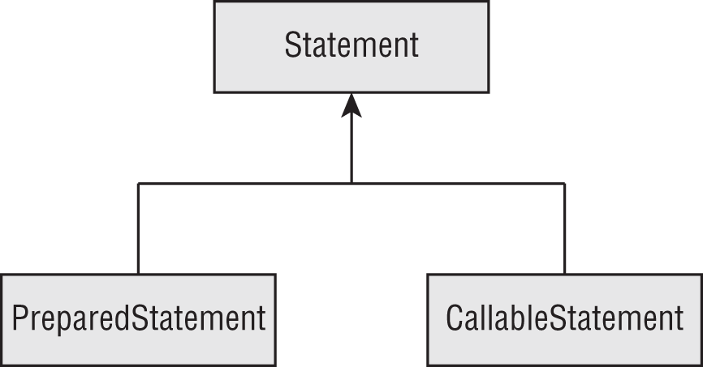

```java
public class MyFirstDatabaseConnection {
   public static void main(String[] args) throws SQLException {
      String url = "jdbc:hsqldb:file:zoo";
      try (Connection conn = DriverManager.getConnection(url);
         PreparedStatement ps = conn.prepareStatement(
            "SELECT name FROM exhibits");
         ResultSet rs = ps.executeQuery()) {
         while (rs.next())
            System.out.println(rs.getString(1));
      } } }
```

the JDBC classes are all in the module `java.sql`

if you do want to use JDBC code with modules, remember to update your `module-info` file
```java
  requires java.sql;
```

## Connecting to a Database

```
protocol:vendor_name:database_specific_connection_details
```

```
jdbc:postgresql://localhost/zoo
jdbc:oracle:thin:@123.123.123.123:1521:zoo
jdbc:mysql://localhost:3306
jdbc:mysql://localhost:3306/zoo?profileSQL=true
```

main ways to get a Connection: 
- DriverManager 
- DataSource

```java
import java.sql.*;
public class TestConnect {
   public static void main(String[] args) throws SQLException {
      try (Connection conn =
         DriverManager.getConnection("jdbc:hsqldb:file:zoo")) {
         System.out.println(conn);
      } } }
```      

```java
import java.sql.*;
public class TestExternal {
   public static void main(String[] args) throws SQLException {
      try (Connection conn = DriverManager.getConnection(
         "jdbc:postgresql://localhost:5432/ocp-book",
         "username",
         "Password20182")) {
         System.out.println(conn);
      } } }
```      

## Working with a PreparedStatement

 - A `Statement` and a `PreparedStatement` are similar to each other, except that a `PreparedStatement` takes parameters, while a `Statement` does not. 
 - A `Statement` just executes whatever SQL query you give it.

While it is possible to run SQL directly with `Statement`, you shouldn't. `PreparedStatement` is far superior for the following reasons:

- Performance: In most programs, you run similar queries multiple times. When you use `PreparedStatement`, the database software often devises a plan to run the query well and remembers it.
- Security: You are protected against an attack called SQL injection when using a `PreparedStatement` correctly.
- Readability: It's nice not to have to deal with string concatenation in building a query string with lots of parameters.
- Future use: Even if your query is being run only once or doesn't have any parameters, you should still use a `PreparedStatement`. That way, future editors of the code won't add a variable and have to remember to change to `PreparedStatement` then.

### Obtaining a PreparedStatement

Getting a PreparedStatement from a `Connection`
```java
try (PreparedStatement ps = conn.prepareStatement("SELECT * FROM exhibits")) {
   // work with ps
}
```

```java
try (var ps = conn.prepareStatement()) { // DOES NOT COMPILE
}
```

### Executing a PreparedStatement

#### Modifying Data with executeUpdate()

```java
 var insertSql = "INSERT INTO exhibits VALUES(10, 'Deer', 3)";
 var updateSql = "UPDATE exhibits SET name = '' " +
    "WHERE name = 'None'";
 var deleteSql = "DELETE FROM exhibits WHERE id = 10";

 try (var ps = conn.prepareStatement(insertSql)) {
    int result = ps.executeUpdate();
    System.out.println(result); // 1
 }

 try (var ps = conn.prepareStatement(updateSql)) {
    int result = ps.executeUpdate();
    System.out.println(result); // 0
 }

 try (var ps = conn.prepareStatement(deleteSql)) {
    int result = ps.executeUpdate();
    System.out.println(result); // 1
 }
```

#### Reading Data with executeQuery()

```java
var sql = "SELECT * FROM exhibits";
try (var ps = conn.prepareStatement(sql);
   ResultSet rs = ps.executeQuery() ) {
   // work with rs
}
```

#### Processing Data with execute()

method called `execute()` that can run either a query or an update. It returns a `boolean` so that we know whether there is a `ResultSet`. That way, we can call the proper method to get more detail. 

```java
boolean isResultSet = ps.execute();
if (isResultSet) {
   try (ResultSet rs = ps.getResultSet()) {
      System.out.println("ran a query");
   }
} else {
   int result = ps.getUpdateCount();
   System.out.println("ran an update");
}
```

#### Using the Correct Method

```java
var sql = "SELECT * FROM names";
try (var ps = conn.prepareStatement(sql)) {
 
   var result = ps.executeUpdate();
}
```

```
Exception in thread "main" java.sql.SQLException: 
statement does not generate a row count
```

We also get a `SQLException` when using `executeQuery()` with SQL that changes the database.
```
Exception in thread "main" java.sql.SQLException: 
statement does not generate a result set
```
 ## Reviewing PreparedStatement Methods

 SQL runnable by the execute method
<table>
<thead>
<tr>
<th scope="col" class="left">Method</th>
<th scope="col" class="left"><code>DELETE</code></th>
<th scope="col" class="left"><code>INSERT</code></th>
<th scope="col" class="left"><code>SELECT</code></th>
<th scope="col" class="left"><code>UPDATE</code></th> </tr> </thead>
<tbody>
<tr>
<td class="left"><code>ps.execute()</code></td>
<td class="left">Yes</td>
<td class="left">Yes</td>
<td class="left">Yes</td>
<td class="left">Yes</td> </tr>
<tr>
<td class="left"><code>ps.executeQuery()</code></td>
<td class="left">No</td>
<td class="left">No</td>
<td class="left">Yes</td>
<td class="left">No</td> </tr>
<tr>
<td class="left"><code>ps.executeUpdate()</code></td>
<td class="left">Yes</td>
<td class="left">Yes</td>
<td class="left">No</td>
<td class="left">Yes</td> </tr> </tbody> </table>

 Return types of execute methods
<table>
<thead>
<tr>
<th scope="col" class="left">Method</th>
<th scope="col" class="left">Return type</th>
<th scope="col" class="left">What is returned for <code>SELECT</code></th>
<th scope="col" class="left">What is returned for <code>DELETE/INSERT/UPDATE</code></th> </tr> </thead>
<tbody>
<tr>
<td class="left"><code>ps.execute()</code></td>
<td class="left"><code>boolean</code></td>
<td class="left"><code>true</code></td>
<td class="left"><code>false</code></td> </tr>
<tr>
<td class="left"><code>ps.executeQuery()</code></td>
<td class="left"><code>ResultSet</code></td>
<td class="left">Rows and columns returned</td>
<td class="left">n/a</td> </tr>
<tr>
<td class="left"><code>ps.executeUpdate()</code></td>
<td class="left"><code>int</code></td>
<td class="left">n/a</td>
<td class="left">Number of rows added/changed/removed</td> </tr> </tbody> </table>

### Working with Parameters

 the bind variables are counted starting with 1 rather than 0.

```java
 public static void register(Connection conn, int key,
    int type, String name) throws SQLException {

    String sql = "INSERT INTO names VALUES(?, ?, ?)";

    try (PreparedStatement ps = conn.prepareStatement(sql)) {
       ps.setInt(1, key);
       ps.setString(3, name);
       ps.setInt(2, type);
       ps.executeUpdate();
    }
 }
```

```java
var sql = "INSERT INTO names VALUES(?, ?, ?)";
try (var ps = conn.prepareStatement(sql)) {
   ps.setInt(1, key);
   ps.setInt(2, type);
   // missing the set for parameter number 3
   ps.executeUpdate();
}
```

```
Exception in thread "main" java.sql.SQLException: Parameter not set
```

```java
var sql = "INSERT INTO names VALUES(?, ?)";
try (var ps = conn.prepareStatement(sql)) {
   ps.setInt(1, key);
   ps.setInt(2, type);
   ps.setString(3, name);
   ps.executeUpdate();
}
```

```
Exception in thread "main" java.sql.SQLException:
row column count mismatch in statement [INSERT INTO names VALUES(?, ?)]
```

 PreparedStatement methods
<table>
<thead>
<tr>
<th scope="col" class="left">Method</th>
<th scope="col" class="left">Parameter type</th>
<th scope="col" class="left">Example database type</th> </tr> </thead>
<tbody>
<tr>
<td class="left"><code>setBoolean</code></td>
<td class="left"><code>boolean</code></td>
<td class="left"><code>BOOLEAN</code></td> </tr>
<tr>
<td class="left"><code>setDouble</code></td>
<td class="left"><code>double</code></td>
<td class="left"><code>DOUBLE</code></td> </tr>
<tr>
<td class="left"><code>setInt</code></td>
<td class="left"><code>int</code></td>
<td class="left"><code>INTEGER</code></td> </tr>
<tr>
<td class="left"><code>setLong</code></td>
<td class="left"><code>long</code></td>
<td class="left"><code>BIGINT</code></td> </tr>
<tr>
<td class="left"><code>setNull</code></td>
<td class="left"><code>int</code></td>
<td class="left">Any type</td> </tr>
<tr>
<td class="left"><code>setObject</code></td>
<td class="left"><code>Object</code></td>
<td class="left">Any type</td> </tr>
<tr>
<td class="left"><code>setString</code></td>
<td class="left"><code>String</code></td>
<td class="left"><code>CHAR</code>, <code>VARCHAR</code></td> </tr> </tbody> </table>

```java
String sql = "INSERT INTO names VALUES(?, ?, ?)";
try (PreparedStatement ps = conn.prepareStatement(sql)) {
   ps.setObject(1, key);
   ps.setObject(2, type);
   ps.setObject(3, name);
   ps.executeUpdate();
}
```

### Updating Multiple Records

```java
var sql = "INSERT INTO names VALUES(?, ?, ?)";
 
try (var ps = conn.prepareStatement(sql)) {
 
   ps.setInt(1, 20);
   ps.setInt(2, 1);
   ps.setString(3, "Ester");
   ps.executeUpdate();
 
   ps.setInt(1, 21);
   ps.setString(3, "Elias");
   ps.executeUpdate();
}
```

```java
public static void register(Connection conn, int firstKey, int type, String… names) throws SQLException {
   var sql = "INSERT INTO names VALUES(?, ?, ?)";
   var nextIndex = firstKey;
   try (var ps = conn.prepareStatement(sql)) {
      ps.setInt(2, type);
      for(var name: names) {
         ps.setInt(1, nextIndex);
         ps.setString(3, name);
         ps.addBatch();
         nextIndex++;
      }
      int[] result = ps.executeBatch();
      System.out.println(Arrays.toString(result));
   }
}

 register(conn, 100, 1,  "Elias", "Ester");

 //   [1, 1]
```       

## Getting Data from a ResultSet

### Reading a ResultSet

```java
 String sql = "SELECT id, name FROM exhibits";
 var idToNameMap = new HashMap<Integer, String>();

 try (var ps = conn.prepareStatement(sql);
    ResultSet rs = ps.executeQuery()) {

    while (rs.next()) {
       int id = rs.getInt("id");
       String name = rs.getString("name");
       idToNameMap.put(id, name);
    }
    System.out.println(idToNameMap);
 }
```

```java
int id = rs.getInt(1);
String name = rs.getString(2);
```

```java
// only one row
var sql = "SELECT count(*) FROM exhibits";
 
try (var ps = conn.prepareStatement(sql);
   var rs = ps.executeQuery()) {
 
   if (rs.next()) {
      int count = rs.getInt(1);
      System.out.println(count);
   }
}
```

If a query didn't return any rows, it would throw a `SQLException`, so the if statement checks that it is safe to call.

```java
var sql = "SELECT count(*) AS count FROM exhibits";
 
try (var ps = conn.prepareStatement(sql);
   var rs = ps.executeQuery()) {
 
   if (rs.next()) {
      var count = rs.getInt("total");
      System.out.println(count);
   }
}
```

```
Exception in thread "main" java.sql.SQLException: Column not found: total
```

```java
var sql = "SELECT count(*) FROM exhibits";
 
try (var ps = conn.prepareStatement(sql);
   var rs = ps.executeQuery()) {
 
   rs.getInt(1); // SQLException
}
```

### Getting Data for a Column

<table>
<thead>
<tr>
<th scope="col" class="left">Method</th>
<th scope="col" class="left">Return type</th> </tr> </thead>
<tbody>
<tr>
<td class="left"><code>getBoolean</code></td>
<td class="left"><code>boolean</code></td> </tr>
<tr>
<td class="left"><code>getDouble</code></td>
<td class="left"><code>double</code></td> </tr>
<tr>
<td class="left"><code>getInt</code></td>
<td class="left"><code>int</code></td> </tr>
<tr>
<td class="left"><code>getLong</code></td>
<td class="left"><code>long</code></td> </tr>
<tr>
<td class="left"><code>getObject</code></td>
<td class="left"><code>Object</code></td> </tr>
<tr>
<td class="left"><code>getString</code></td>
<td class="left"><code>String</code></td> </tr> </tbody> </table>

```java
var sql = "SELECT id, name FROM exhibits";
try (var ps = conn.prepareStatement(sql);
   var rs = ps.executeQuery()) {
   while (rs.next()) {
      Object idField = rs.getObject("id");
      Object nameField = rs.getObject("name");
      if (idField instanceof Integer id)
         System.out.println(id);
      if (nameField instanceof String name)
         System.out.println(name);
   }
}
```

### Using Bind Variables

```java
 var sql = "SELECT id FROM exhibits WHERE name = ?";

 try (var ps = conn.prepareStatement(sql)) {
    ps.setString(1, "Zebra");

    try (var rs = ps.executeQuery()) {
       while (rs.next()) {
          int id = rs.getInt("id");
          System.out.println(id);
       }
    }
 }
```

## Calling a CallableStatement

- A stored procedure is code that is compiled in advance and stored in the database. 
- Stored procedures are commonly written in a database-specific variant of SQL, which varies among database software providers.
- Using a stored procedure reduces network round trips. 

for test examples
<table>
<thead>
<tr>
<th scope="col" class="left">Name</th>
<th scope="col" class="left">Parameter name</th>
<th scope="col" class="left">Parameter type</th>
<th scope="col" class="left">Description</th> </tr> </thead>
<tbody>
<tr>
<td class="left"><code>read_e_names()</code></td>
<td class="left">n/a</td>
<td class="left">n/a</td>
<td class="left">Returns all rows in <code>names</code> table that have name beginning with <code>e</code> or <code>E</code></td> </tr>
<tr>
<td class="left"><code>read_names_by_letter()</code></td>
<td class="left"><code>prefix</code></td>
<td class="left"><code>IN</code></td>
<td class="left">Returns all rows in <code>names</code> table that have name beginning with specified parameter (case insensitive)</td> </tr>
<tr>
<td class="left"><code>magic_number()</code></td>
<td class="left"><code>num</code></td>
<td class="left"><code>OUT</code></td>
<td class="left">Returns number <code>42</code></td> </tr>
<tr>
<td class="left"><code>double_number()</code></td>
<td class="left"><code>num</code></td>
<td class="left"><code>INOUT</code></td>
<td class="left">Multiplies parameter by two and returns that number</td> </tr> </tbody> </table>

### Calling a Procedure without Parameters

```java
 String sql = "{call read_e_names()}";
 try (CallableStatement cs = conn.prepareCall(sql);
    ResultSet rs = cs.executeQuery()) {

    while (rs.next()) {
       System.out.println(rs.getString(3));
    }
 }
```

### Passing an IN Parameter

```java
 var sql = "{call read_names_by_letter(?)}";
 try (var cs = conn.prepareCall(sql)) {
    cs.setString("prefix", "Z");

    try (var rs = cs.executeQuery()) {
       while (rs.next()) {
          System.out.println(rs.getString(3));
       }
    }
 }
```

```java
cs.setString(1, "Z");
cs.setString("prefix", "Z");
```

### Returning an OUT Parameter

```java
 var sql = "{?= call magic_number(?) }";
 try (var cs = conn.prepareCall(sql)) {
    cs.registerOutParameter(1, Types.INTEGER);
    cs.execute();
    System.out.println(cs.getInt("num"));
 }
```

### Working with an INOUT Parameter

```java
 var sql = "{call double_number(?)}";
 try (var cs = conn.prepareCall(sql)) {
    cs.setInt(1, 8);
    cs.registerOutParameter(1, Types.INTEGER);
    cs.execute();
    System.out.println(cs.getInt("num"));
 }
```

### Comparing Callable Statement Parameters

<table>
<thead>
<tr>
<th scope="col" class="left">Parameter type</th>
<th scope="col" class="left"><code>IN</code></th>
<th scope="col" class="left"><code>OUT</code></th>
<th scope="col" class="left"><code>INOUT</code></th> </tr> </thead>
<tbody>
<tr>
<td class="left">Used for input</td>
<td class="left">Yes</td>
<td class="left">No</td>
<td class="left">Yes</td> </tr>
<tr>
<td class="left">Used for output</td>
<td class="left">No</td>
<td class="left">Yes</td>
<td class="left">Yes</td> </tr>
<tr>
<td class="left">Must set parameter value</td>
<td class="left">Yes</td>
<td class="left">No</td>
<td class="left">Yes</td> </tr>
<tr>
<td class="left">Must call <code>registerOutParameter()</code></td>
<td class="left">No</td>
<td class="left">Yes</td>
<td class="left">Yes</td> </tr>
<tr>
<td class="left">Can include <code>?=</code></td>
<td class="left">No</td>
<td class="left">Yes</td>
<td class="left">Yes</td> </tr> </tbody> </table>

### Using Additional Options

There are three ResultSet integer type values:
- `ResultSet.TYPE_FORWARD_ONLY`: Can go through the ResultSet only one row at a time
- `ResultSet.TYPE_SCROLL_INSENSITIVE`: Can go through the ResultSet in any order but will not see changes made to the underlying database table
- `ResultSet.TYPE_SCROLL_SENSITIVE`: Can go through the ResultSet in any order and will see changes made to the underlying database table

There are two ResultSet integer concurrency mode values:
- `ResultSet.CONCUR_READ_ONLY`: The ResultSet cannot be updated.
- `ResultSet.CONCUR_UPDATABLE`: The ResultSet can be updated.

These options are integer values, not enum values, which means you pass both as additional parameters after the SQL.

```java
conn.prepareCall(sql, ResultSet.TYPE_FORWARD_ONLY, ResultSet.CONCUR_READ_ONLY);
conn.prepareStatement(sql, ResultSet.TYPE_SCROLL_INSENSITIVE,  ResultSet.CONCUR_UPDATABLE);
```

## Controlling Data with Transactions

### Committing and Rolling Back

 `setAutoCommit(true)` will automatically trigger a commit when you are not already in autocommit mode. 


```java
public static void main(String[] args) throws SQLException {
     try (Connection conn = 
        DriverManager.getConnection("jdbc:hsqldb:file:zoo")) {

        conn.setAutoCommit(false);

       var elephantRowsUpdated = updateRow(conn, 5, "African Elephant");
       var zebraRowsUpdated = updateRow(conn, -5, "Zebra");
 
       if (! elephantRowsUpdated || ! zebraRowsUpdated)
          conn.rollback();
       else {
          String selectSql = """
             SELECT COUNT(*) 
             FROM exhibits 
             WHERE num:acres <= 0""";
          try (PreparedStatement ps = conn.prepareStatement(selectSql);
             ResultSet rs = ps.executeQuery()) {
 
             rs.next();
             int count = rs.getInt(1);
             if (count == 0)
                conn.commit();
             else
                conn.rollback();
          } } } }

 private static boolean updateRow(Connection conn, int numToAdd, String name) throws SQLException {
    String updateSql = """
       UPDATE exhibits 
       SET num:acres = num:acres + ? 
       WHERE name = ?""";

    try (PreparedStatement ps = conn.prepareStatement(updateSql)) {
       ps.setInt(1, numToAdd);
       ps.setString(2, name);
       return ps.executeUpdate()> 0;
    } 
   }
```

### Bookmarking with Savepoints

```java
 conn.setAutoCommit(false);
 Savepoint sp1 = conn.setSavepoint();
 // database code
 Savepoint sp2 = conn.setSavepoint("second savepoint");
 // database code
 conn.rollback(sp2);
 // database code
 conn.rollback(sp1);
```

### Reviewing Transaction APIs

<table>
<thead>
<tr>
<th scope="col" class="left">Method</th>
<th scope="col" class="left">Description</th> </tr> </thead>
<tbody>
<tr>
<td class="left"><code>setAutoCommit(boolean b)</code></td>
<td class="left">Sets mode for whether to commit right away</td> </tr>
<tr>
<td class="left"><code>commit()</code></td>
<td class="left">Saves data in database</td> </tr>
<tr>
<td class="left"><code>rollback()</code></td>
<td class="left">Gets rid of statements already made</td> </tr>
<tr>
<td class="left"><code>rollback(Savepoint sp)</code></td>
<td class="left">Goes back to state at <code>Savepoint</code></td> </tr>
<tr>
<td class="left"><code>setSavepoint()</code></td>
<td class="left">Creates bookmark</td> </tr>
<tr>
<td class="left"><code>setSavepoint(String name)</code></td>
<td class="left">Creates bookmark with name</td> </tr> </tbody> </table>

## Closing Database Resources

- The resources need to be closed in a specific order. The `ResultSet` is closed first, followed by the `PreparedStatement` (or `CallableStatement`) and then the `Connection`.
- Closing a `Connection` also closes `PreparedStatement` (or `CallableStatement`) and `ResultSet`.
- Closing a `PreparedStatement` (or `CallableStatement`) also closes the `ResultSet`.
- There's another way to close a `ResultSet`. JDBC automatically closes a `ResultSet` when you run another SQL statement from the same `Statement`. This could be a `PreparedStatement` or a `CallableStatement`.

```java
       var sql = "SELECT not_a_column FROM names";
       var url = "jdbc:hsqldb:zoo";
       try (var conn = DriverManager.getConnection(url);
          var ps = conn.prepareStatement(sql);
          var rs = ps.executeQuery()) {
          while (rs.next())
             System.out.println(rs.getString(1));
       } catch (SQLException e) {
          System.out.println(e.getMessage());
          System.out.println(e.getSQLState());
          System.out.println(e.getErrorCode()); 
   }
```

```
Column 'NOT_A_COLUMN' is either not in any table …
42X04
30000
```

# Modules

The Java Platform Module System (JPMS) groups code at a higher level. The main purpose of a module is to provide groups of related packages that offer developers a particular set of functionality. It's like a JAR file, except a developer chooses which packages are accessible outside the module.

The Java Platform Module System includes the following:

- A format for module JAR files
- Partitioning of the JDK into modules
- Additional command-line options for Java tools

## A Module

- A module is a group of one or more packages plus a special file called `module-info.java`
- The contents of this file are the **module declaration** 

 problems they are designed to solve:
- Better access control: In addition to the levels of access control you can have packages that are only accessible to other packages in the module.
- Clearer dependency management: Since modules specify what they rely on, Java can complain about a missing JAR when starting up the program rather than when it is first accessed at runtime.
- Custom Java builds: You can create a Java runtime that has only the parts of the JDK that your program needs rather than the full one at over 150 MB.
- Improved security: Since you can omit parts of the JDK from your custom build, you don't have to worry about vulnerabilities discovered in a part you don't use.
- Improved performance: Another benefit of a smaller Java package is improved startup time and a lower memory requirement.
- Unique package enforcement: Since modules specify exposed packages, Java can ensure that each package comes from only one module and avoid confusion about what is being run.

## Creating and Running a First Modular Program

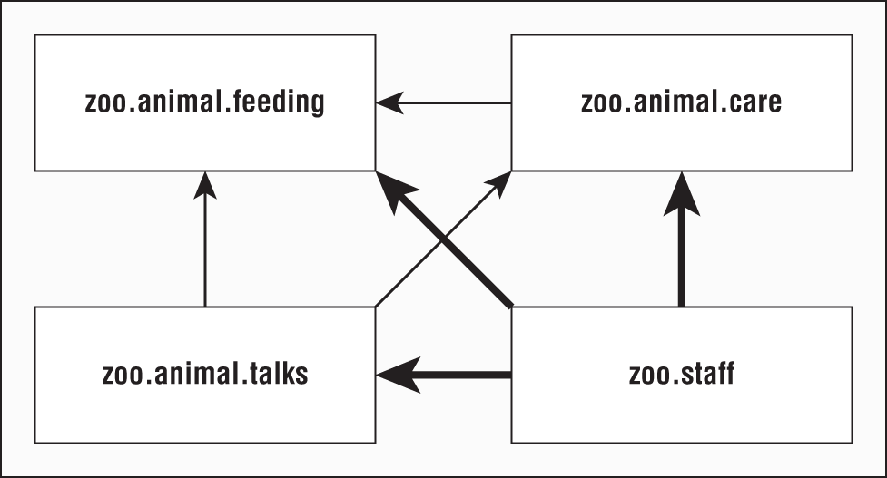

```java
package zoo.animal.feeding;
 
public class Task {
   public static void main(String… args) {
      System.out.println("All fed!");
   }
}
```

**module-info.java**
```java
module zoo.animal.feeding {
}
```

There are a few key differences between a module declaration and a regular Java class declaration:
- The `module-info.java` file must be in the root directory of your module. Regular Java classes should be in packages.
- The module declaration must use the keyword module instead of class, interface, or enum.
- The module name follows the naming rules for package names. It often includes periods (.) in its name. Regular class and package names are not allowed to have dashes (-). Module names follow the same rule.

### Compile
```
javac --module-path mods
   -d feeding
   feeding/zoo/animal/feeding/*.java feeding/module-info.java
```

<table>
<thead>
<tr>
<th scope="col" class="left">Use for</th>
<th scope="col" class="left">Abbreviation</th>
<th scope="col" class="left">Long form</th> </tr> </thead>
<tbody>
<tr>
<td class="left">Directory for class files</td>
<td class="left"><code>-d &lt;dir&gt;</code></td>
<td class="left">n/a</td> </tr>
<tr>
<td class="left">Module path</td>
<td class="left"><code>-p &lt;path&gt;</code></td>
<td class="left"><code>--module-path &lt;path&gt;</code></td> </tr> </tbody> </table>

- The classpath option has three possible forms: `-cp`, `--class-path`, and `-classpath`. You can still use these options. In fact, it is common to do so when writing non-modular programs.


```bash
javac -p mods -d feeding
   feeding/zoo/animal/feeding/*.java feeding/*.java
 
javac -p mods -d feeding
   feeding/zoo/animal/feeding/*.java feeding/module-info.java
 
javac -p mods -d feeding
   feeding/zoo/animal/feeding/Task.java feeding/module-info.java
 
javac -p mods -d feeding
   feeding/zoo/animal/feeding/Task.java feeding/*.java
```

### Running

```bash
java --module-path feeding
   --module zoo.animal.feeding/zoo.animal.feeding.Task
```

```bash
java -p feeding
   -m zoo.animal.feeding/zoo.animal.feeding.Task
```

<table>
<thead>
<tr>
<th scope="col" class="left">Use for</th>
<th scope="col" class="left">Abbreviation</th>
<th scope="col" class="left">Long form</th> </tr> </thead>
<tbody>
<tr>
<td class="left">Module name</td>
<td class="left"><code>-m &lt;name&gt;</code></td>
<td class="left"><code>--module &lt;name&gt;</code></td> </tr>
<tr>
<td class="left">Module path</td>
<td class="left"><code>-p &lt;path&gt;</code></td>
<td class="left"><code>--module-path &lt;path&gt;</code></td> </tr> </tbody> </table>

### Packaging

```sh
jar -cvf mods/zoo.animal.feeding.jar -C feeding/ .
```

run
```sh
java -p mods
   -m zoo.animal.feeding/zoo.animal.feeding.Task
```

### Creating module with dependency

- The `exports` directive is used to indicate that a module intends for those packages to be used by Java code outside the module. 
- without an exports directive, the module is only available to be run from the command line on its own
- The `requires` statement specifies that a module is needed  


```java
module zoo.animal.feeding {
   exports zoo.animal.feeding; //  lists the package we are exporting so it can be used by other modules.
}
```

```sh
javac -p mods
   -d feeding
   feeding/zoo/animal/feeding/*.java feeding/module-info.java
 
jar -cvf mods/zoo.animal.feeding.jar -C feeding/ .
```

then create module which will use previous module

```java
// HippoBirthday.java
package zoo.animal.care.details;
import zoo.animal.feeding.*;
public class HippoBirthday {
   private Task task;
}
 
// Diet.java
package zoo.animal.care.medical;
public class Diet { }
```

```java
module zoo.animal.care {
   exports zoo.animal.care.medical; //  lists the package we are exporting so it can be used by other modules.
   requires zoo.animal.feeding; //  The zoo.animal.care module depends on the zoo.animal.feeding module.
}
```


to compile
```sh
javac -p mods
   -d care
   care/zoo/animal/care/details/*.java
   care/zoo/animal/care/medical/*.java
   care/module-info.java
```   

to package
```sh
jar -cvf mods/zoo.animal.care.jar -C care/ .
```

### Module with many dependencies

```java
module zoo.animal.talks {
   exports zoo.animal.talks.content;
   exports zoo.animal.talks.media;
   exports zoo.animal.talks.schedule;

   requires zoo.animal.feeding;
   requires zoo.animal.care;
}
```

```java
// ElephantScript.java
package zoo.animal.talks.content;
public class ElephantScript { }
 
// SeaLionScript.java
package zoo.animal.talks.content;
public class SeaLionScript { }
 
// Announcement.java
package zoo.animal.talks.media;
public class Announcement {
   public static void main(String[] args) {
      System.out.println("We will be having talks");
   }
}
 
// Signage.java
package zoo.animal.talks.media;
public class Signage { }
 
// Weekday.java
package zoo.animal.talks.schedule;
public class Weekday { }
 
// Weekend.java
package zoo.animal.talks.schedule;
public class Weekend {}
```

```sh
javac -p mods
   -d talks
   talks/zoo/animal/talks/content/*.java talks/zoo/animal/talks/media/*.java
   talks/zoo/animal/talks/schedule/*.java talks/module-info.java
 
jar -cvf mods/zoo.animal.talks.jar -C talks/ .
```

```java
module zoo.staff {
   requires zoo.animal.feeding;
   requires zoo.animal.care;
   requires zoo.animal.talks;
}
```

```java
package zoo.staff;
public class Jobs { }
```

```sh
javac -p mods
   -d staff
   staff/zoo/staff/*.java staff/module-info.java
 
jar -cvf mods/zoo.staff.jar -C staff/ .
```

## Module Declaration

### Exporting a Package

- All public classes, interfaces, enums, and records are exported. Further, any public and protected fields and methods in those files are visible.
- It's also possible to export a package to a specific module. 

```java
module zoo.animal.talks {
   exports zoo.animal.talks.content to zoo.staff;
   exports zoo.animal.talks.media;
   exports zoo.animal.talks.schedule;
 
   requires zoo.animal.feeding;
   requires zoo.animal.care;
}
```

<table>
<thead>
<tr>
<th scope="col" class="left">Level</th>
<th scope="col" class="left">Within module code</th>
<th scope="col" class="left">Outside module</th> </tr> </thead>
<tbody>
<tr>
<td class="left"><code>private</code></td>
<td class="left">Available only within class</td>
<td class="left">No access</td> </tr>
<tr>
<td class="left">Package</td>
<td class="left">Available only within package</td>
<td class="left">No access</td> </tr>
<tr>
<td class="left"><code>protected</code></td>
<td class="left">Available only within package or to subclasses</td>
<td class="left">Accessible to subclasses only if package is exported</td> </tr>
<tr>
<td class="left"><code>public</code></td>
<td class="left">Available to all classes</td>
<td class="left">Accessible only if package is exported</td> </tr> </tbody> </table>

### Requiring a Module Transitively

`requires transitive moduleName`, which means that any module that requires this module will also depend on `moduleName`

```java
module zoo.animal.feeding {
   exports zoo.animal.feeding;
}
```

```java
module zoo.animal.care {
   exports zoo.animal.care.medical;
   requires transitive zoo.animal.feeding;
}
```

```java
module zoo.animal.talks {
   exports zoo.animal.talks.content to zoo.staff;
   exports zoo.animal.talks.media;
   exports zoo.animal.talks.schedule;
   // no longer needed requires zoo.animal.feeding;
   // no longer needed requires zoo.animal.care;
   requires transitive zoo.animal.care;
}
```

```java
module zoo.staff {
   // no longer needed requires zoo.animal.feeding;
   // no longer needed requires zoo.animal.care;
   requires zoo.animal.talks;
}
```

- Module `zoo.animal.talk`s can optionally declare that it requires the `zoo.animal.feeding` module, but it is not required.
- Module `zoo.animal.care` cannot be compiled or executed without access to the `zoo.animal.feeding` module.
- Module `zoo.animal.talks` cannot be compiled or executed without access to the `zoo.animal.feeding` module.

```java
module bad.module {
   requires zoo.animal.talks;
   requires transitive zoo.animal.talks; // DOES NOT COMPILE
}
```

### Opening a Package for Reflection

- The `opens` directive is used to enable reflection of a package within a module.
- Since reflection can be dangerous, the module system requires developers to explicitly allow reflection in the module declaration if they want calling modules to be allowed to use it. 

```java
module zoo.animal.talks {
   opens zoo.animal.talks.schedule; // allows any module using this one to use reflection
   opens zoo.animal.talks.media to zoo.staff; // only gives that privilege to the zoo.staff module.
}
```

to open whole module

```java
open module zoo.animal.talks {
}
```

```java
open module zoo.animal.talks {
   opens zoo.animal.talks.schedule; // DOES NOT COMPILE
}
```

## Service

- A service is composed of an interface, any classes the interface references, and a way of looking up implementations of the interface. 
- The implementations are not part of the service.

### Declaring Service provider

-  A service provider “interface” can be an abstract class rather than an actual interface

```java
// Souvenir.java
package zoo.tours.api;
 
public record Souvenir(String description) { }
```

```java
// Tour.java
package zoo.tours.api;
 
public interface Tour {
   String name();
   int length();
   Souvenir getSouvenir();
}
```

```java
// module-info.java
module zoo.tours.api {
   exports zoo.tours.api;
}
```

```sh
javac -d serviceProviderInterfaceModule
   serviceProviderInterfaceModule/zoo/tours/api/*.java
   serviceProviderInterfaceModule/module-info.java
 
jar -cvf mods/zoo.tours.api.jar -C serviceProviderInterfaceModule/ .
```

### Creating a Service Locator

- A **service locator** can find any classes that implement a service provider interface.
- The `ServiceLoader` call is relatively expensive. If you are writing a real application, it is best to cache the result.


```java
public final class ServiceLoader<S> implements Iterable<S> {
 
   public static <S> ServiceLoader<S> load(Class<S> service) { … }
 
   public Stream<Provider<S>> stream() { … }
 
    // Additional methods
}
```

```java
// TourFinder.java
package zoo.tours.reservations;
 
import java.util.*;
import zoo.tours.api.*;
 
public class TourFinder {
 
   public static Tour findSingleTour() {
      ServiceLoader<Tour> loader = ServiceLoader.load(Tour.class);
      for (Tour tour : loader)
         return tour;
      return null;
   }
   public static List<Tour> findAllTours() {
      List<Tour> tours = new ArrayList<>();
      ServiceLoader<Tour> loader = ServiceLoader.load(Tour.class);
      for (Tour tour : loader)
         tours.add(tour);
      return tours;
   }
}
```

```java
// module-info.java
module zoo.tours.reservations {
   exports zoo.tours.reservations;
   requires zoo.tours.api;
   uses zoo.tours.api.Tour;
}
```

```sh
javac -p mods -d serviceLocatorModule
   serviceLocatorModule/zoo/tours/reservations/*.java
   serviceLocatorModule/module-info.java
 
jar -cvf mods/zoo.tours.reservations.jar -C serviceLocatorModule/ .
```

### Invoking from a Consumer

A consumer (or client) refers to a module that obtains and uses a service. Once the consumer has acquired a service via the service locator, it is able to invoke the methods provided by the service provider interface.

```java
// Tourist.java
package zoo.visitor;
 
import java.util.*;
import zoo.tours.api.*;
import zoo.tours.reservations.*;
 
public class Tourist {
   public static void main(String[] args) {
      Tour tour = TourFinder.findSingleTour();
      System.out.println("Single tour: " + tour);
 
      List<Tour> tours = TourFinder.findAllTours();
      System.out.println("# tours: " + tours.size());
   }
}
```

```java
// module-info.java
module zoo.visitor {
   requires zoo.tours.api;
   requires zoo.tours.reservations;
}
```

```sh
javac -p mods -d consumerModule
   consumerModule/zoo/visitor/*.java consumerModule/module-info.java
 
jar -cvf mods/zoo.visitor.jar -C consumerModule/ .
 
java -p mods -m zoo.visitor/zoo.visitor.Tourist
```

```
Single tour: null
# tours: 0
```

### Adding a Service Provider

- A service provider is the implementation of a service provider interface. 
- at runtime it is possible to have multiple implementation classes or modules.
- service provider is allowed to provide only one service provider implementation

```java
// TourImpl.java
package zoo.tours.agency;
 
import zoo.tours.api.*;
 
public class TourImpl implements Tour {
   public String name() {
      return "Behind the Scenes";
   }
   public int length() {
      return 120;
   }
   public Souvenir getSouvenir() {
      return new Souvenir("stuffed animal");
   }
}
```

```java
// module-info.java
module zoo.tours.agency {
   requires zoo.tours.api;
   provides zoo.tours.api.Tour with zoo.tours.agency.TourImpl;
}
```

We don't export the package that implements the interface since we don't want callers referring to it directly. Instead, we use the provides directive. This allows us to specify that we provide an implementation of the interface with a specific implementation class.

```sh
javac -p mods -d serviceProviderModule
   serviceProviderModule/zoo/tours/agency/*.java
   serviceProviderModule/module-info.java
jar -cvf mods/zoo.tours.agency.jar -C serviceProviderModule/ .
```

```sh
java -p mods -m zoo.visitor/zoo.visitor.Tourist
```

```
Single tour: zoo.tours.agency.TourImpl@1936f0f5
# tours: 1
```

### Summary about directives

<table>
<thead>
<tr>
<th scope="col" class="left">Artifact</th>
<th scope="col" class="left">Part of the service</th>
<th scope="col" class="left">Directives required</th> </tr> </thead>
<tbody>
<tr>
<td class="left">Service provider interface</td>
<td class="left">Yes</td>
<td class="left"><code>exports</code></td> </tr>
<tr>
<td class="left">Service provider</td>
<td class="left">No</td>
<td class="left"><code>requires</code> <br> <code>provides</code></td> </tr>
<tr>
<td class="left">Service locator</td>
<td class="left">Yes</td>
<td class="left"><code>exports</code> <br> <code>requires</code> <br> <code>uses</code></td> </tr>
<tr>
<td class="left">Consumer</td>
<td class="left">No</td>
<td class="left"><code>requires</code></td> </tr> </tbody> </table>

<table >
<thead>
<tr>
<th scope="col" class="left">Directive</th>
<th scope="col" class="left">Description</th> </tr> </thead>
<tbody>
<tr>
<td class="left"><b><code>exports</code> </b> <code><i>package</i>;</code><br><b> <code>exports</code> </b> <i><code>package</code></i><b><code>to</code></b> <code><i>module</i>;</code></td>
<td class="left">Makes package available outside module</td> </tr>
<tr>
<td class="left"><b><code>requires</code> </b> <code><i>module</i>;</code><br><b> <code>requires transitive</code> </b> <code><i>module</i>;</code></td>
<td class="left">Specifies another module as dependency</td> </tr>
<tr>
<td class="left"><b><code>opens</code> </b> <code><i>package</i>;</code><br><b> <code>opens</code> </b> <i><code>package</code></i><b><code>to</code></b> <code><i>module</i>;</code></td>
<td class="left">Allows package to be used with reflection</td> </tr>
<tr>
<td class="left"><b><code>provides</code> </b> <i><code>serviceInterface</code></i><b><code>with</code></b> <code><i>implName</i>;</code></td>
<td class="left">Makes service available</td> </tr>
<tr>
<td class="left"><b><code>uses</code> </b> <code><i>serviceInterface</i>;</code></td>
<td class="left">References service</td> </tr> </tbody> </table>

## Discovering Modules

### Built-in Modules

- you don't have to use the requires directive for `java.base`; it is available to all modular applications. 
- `module-info.java` file will still compile if you explicitly require `java.base`. However, it is redundant
- module names begin with `java` for APIs you are likely to use and with `jdk` for APIs that are specific to the JDK

common modules
<table>
<thead>
<tr>
<th scope="col" class="left">Module name</th>
<th scope="col" class="left">What it contains</th>
<tbody>
<tr>
<td class="left"><code>java.base</code></td>
<td class="left">Collections, math, IO, NIO.2, concurrency, etc.</td>
<tr>
<td class="left"><code>java.desktop</code></td>
<td class="left">Abstract Windows Toolkit (AWT) and Swing</td>
<tr>
<td class="left"><code>java.logging</code></td>
<td class="left">Logging</td>
<tr>
<td class="left"><code>java.sql</code></td>
<td class="left">JDBC</td>
<tr>
<td class="left"><code>java.xml</code></td>
<td class="left">Extensible Markup Language (XML)</td> </tbody> </table>

another java modules:
- java.naming	
- java.smartcardio
- java.compiler
- java.net.http
- java.datatransfer
- java.prefs
- java.sql.rowset
- java.desktop
- java.rmi	java.transaction.xa
- java.instrument
- java.scripting	java.xml
- java.logging	
- java.se	
- java.xml.crypto
- java.management	
- java.security.jgss	
- java.management.rmi	
- java.security.sasl	

jdk modules:

- jdk.accessiblity
- jdk.javadoc	
- jdk.management.agent
- jdk.attach
- jdk.jcmd
- jdk.management.jfr
- jdk.charsets
- jdk.jconsole
- jdk.naming.dns
- jdk.compiler
- jdk.jdeps
- jdk.naming.rmi
- jdk.crypto.cryptoki
- jdk.jdi
- jdk.net
- jdk.crypto.ec
- jdk.jdwp.agent
- jdk.nio.mapmode
- jdk.dynalink
- jdk.jfr
- jdk.sctp
- jdk.editpad
- jdk.jlink
- jdk.security.auth
- jdk.hotspot.agent
- jdk.jshell
- jdk.security.jgss
- jdk.httpserver
- jdk.jsobject
- jdk.xml.dom
- jdk.incubator.foreign
- jdk.jstatd
- jdk.zipfs
- jdk.incubator.vector
- jdk.localedata	
- jdk.jartool
- jdk.management	

### Getting Details with java

#### Describing a Module

- You could “unjar” it and open the `module-info.java` file
and

```sh
java -p mods
   -d zoo.animal.feeding
 
java -p mods
   --describe-module zoo.animal.feeding
```

```
zoo.animal.feeding file:///absolutePath/mods/zoo.animal.feeding.jar
exports zoo.animal.feeding
requires java.base mandated
```

#### Listing Available Modules

to list the modules that are available

```sh
java --list-modules
```

```
java.base@17
java.compiler@17
java.datatransfer@17
...
```

```sh
java -p mods --list-modules
```

```
zoo.animal.care file:///absolutePath/mods/zoo.animal.care.jar
zoo.animal.feeding file:///absolutePath/mods/zoo.animal.feeding.jar
```

#### Showing Module Resolution

 a way of debugging modules. It spits out a lot of output when the program starts up. Then it runs the program.

```sh
java --show-module-resolution
   -p feeding
   -m zoo.animal.feeding/zoo.animal.feeding.Task
```

```
root zoo.animal.feeding file:///absolutePath/feeding/
java.base binds java.desktop jrt:/java.desktop
java.base binds jdk.jartool jrt:/jdk.jartool
…
jdk.security.auth requires java.naming jrt:/java.naming
jdk.security.auth requires java.security.jgss jrt:/java.security.jgss
…
All fed!
```

### Describing with jar

the jar command can describe a module

```sh
jar -f mods/zoo.animal.feeding.jar -d
jar --file mods/zoo.animal.feeding.jar --describe-module
```

```
zoo.animal.feeding jar:file:///absolutePath/mods/zoo.animal.feeding.jar
/!module-info.class
exports zoo.animal.feeding
requires java.base mandated
```

### Learning about Dependencies with jdeps

- `jdeps` command gives you information about dependencies within a module.
- Unlike describing a module, it looks at the code in addition to the module declaration. This tells you what dependencies are actually used rather than simply declared

```java
// Animatronic.java
package zoo.dinos;
 
import java.time.*;
import java.util.*;
import sun.misc.Unsafe;
 
public class Animatronic {
   private List<String> names;
   private LocalDate visitDate;
 
   public Animatronic(List<String> names, LocalDate visitDate) {
      this.names = names;
      this.visitDate = visitDate;
   }
   public void unsafeMethod() {
      Unsafe unsafe = Unsafe.getUnsafe();
   }
}
```

```sh
javac zoo/dinos/*.java
jar -cvf zoo.dino.jar .
```

```
jdeps zoo.dino.jar
 
zoo.dino.jar -> java.base
zoo.dino.jar -> jdk.unsupported
   zoo.dinos    -> java.lang       java.base
   zoo.dinos    -> java.time       java.base
   zoo.dinos    -> java.util       java.base
   zoo.dinos    -> sun.misc        JDK internal API (jdk.unsupported)
```

in summary mode, we only see just the first part where jdeps lists the modules
```
jdeps -s zoo.dino.jar
jdeps -summary zoo.dino.jar
 
zoo.dino.jar -> java.base
zoo.dino.jar -> jdk.unsupported
```

 a `--module-path` option that you can use if you want to look for modules outside the JDK


### Using the --jdk-internals Flag

Prior to the Java Platform Module System, classes had to be public if you wanted them to be used outside the package. It was reasonable to use the class in JDK code since that is low-level code that is already tightly coupled to the JDK. Since it was needed in multiple packages, the class was made public. Sun even named it Unsafe, figuring that would prevent anyone from using it outside the JDK.

However, developers are clever and used the class since it was available. A number of widely used open source libraries started using Unsafe. While it is quite unlikely that you are using this class in your project directly, you probably use an open source library that is using it.

The jdeps command allows you to look at these JARs to see whether you will have any problems when Oracle finally prevents the usage of this class. If you find any uses, you can look at whether there is a later version of the JAR that you can upgrade to.

- jdeps command has an option to provide details about these unsupported APIs.
- The `--jdk-internals` option lists any classes you are using that call an internal API along with which API. At the end, it provides a table suggesting what you should do about it. If you wrote the code calling the internal API, this message is useful. If not, the message would be useful to the team that did write the code. You, on the other hand, might need to update or replace that JAR file entirely with one that fixes the issue. 
- `-jdkinternals` is equivalent to `--jdk-internals`.

```
jdeps --jdk-internals zoo.dino.jar
 
zoo.dino.jar -> jdk.unsupported
   zoo.dinos.Animatronic  -> sun.misc.Unsafe
      JDK internal API (jdk.unsupported)
 
Warning: <omitted warning>
 
JDK Internal API      Suggested Replacement
________________      _____________________
sun.misc.Unsafe       See http://openjdk.java.net/jeps/260
```

### Using Module Files with jmod

Oracle recommends using JAR files for most modules. JMOD files are recommended only when you have native libraries or something that can't go inside a JAR file

### Creating Java Runtimes with jlink

One of the benefits of modules is being able to supply just the parts of Java you need

```sh
jlink --module-path mods --add-modules zoo.animal.talks --output zooApp
```

The output directory contains the bin, conf, include, legal, lib, and man directories along with a release file. These should look familiar as you find them in the full JDK as well.

### Reviewing Command-Line Options

For OCP exam

Comparing command-line operations

<table>
<thead>
<tr>
<th scope="col" class="left">Description</th>
<th scope="col" class="left">Syntax</th> </tr> </thead>
<tbody>
<tr>
<td class="left">Compile nonmodular code</td>
<td class="left"><code><b>javac</b> -cp <i>classpath</i> -d <i>directory classesToCompile</i></code> <br> <code><b>javac</b> --class-path <i>classpath</i> -d <i>directory classesToCompile</i></code> <br> <code><b>javac</b> -classpath <i>classpath</i> -d <i>directory classesToCompile</i></code></td> </tr>
<tr>
<td class="left">Run nonmodular code</td>
<td class="left"><code><b>java</b> -cp <i>classpath package.className</i></code> <br> <code><b>java</b> -classpath <i>classpath package.className</i></code> <br> <code><b>java</b> --class-path <i>classpath package.className</i></code></td> </tr>
<tr>
<td class="left">Compile module</td>
<td class="left"><code><b>javac</b> -p <i>moduleFolderName</i> -d <i>directory classesToCompileIncludingModuleInfo</i></code> <br> <code><b>javac</b> --module-path <i>moduleFolderName</i> -d <i>directory classesToCompileIncludingModuleInfo</i></code></td> </tr>
<tr>
<td class="left">Run module</td>
<td class="left"><code><b>java</b> -p <i>moduleFolderName</i> -m <i>moduleName/package.className</i></code> <br> <code><b>java</b> --module-path <i>moduleFolderName</i> --module <i>moduleName/package.className</i></code></td> </tr>
<tr>
<td class="left">Describe module</td>
<td class="left"><code><b>java</b> -p <i>moduleFolderName</i> -d <i>moduleName</i></code> <br> <code><b>java</b> --module-path <i>moduleFolderName</i> --describe-module <i>moduleName</i></code> <br> <code><b>jar</b> --file <i>jarName</i> --describe-module</code> <br> <code><b>jar</b> -f <i>jarName</i> -d</code></td> </tr>
<tr>
<td class="left">List available modules</td>
<td class="left"><code><b>java</b> --module-path <i>moduleFolderName</i> --list-modules</code> <br> <code><b>java</b> -p <i>moduleFolderName</i> --list-modules</code> <br> <code><b>java</b> --list-modules</code></td> </tr>
<tr>
<td class="left">View dependencies</td>
<td class="left"><code><b>jdeps</b> -summary --module-path <i>moduleFolderName jarName</i></code> <br> <code><b>jdeps</b> -s --module-path <i>moduleFolderName jarName</i></code> <br> <code><b>jdeps</b> --jdk-internals <i>jarName</i></code> <br> <code><b>jdeps</b> -jdkinternals <i>jarName</i></code></td> </tr>
<tr>
<td class="left">Show module resolution</td>
<td class="left"><code><b>java</b> --show-module-resolution -p <i>moduleFolderName</i> -m <i>moduleName</i></code> <br> <code><b>java</b> --show-module-resolution --module-path <i>moduleFolderName</i> --module <i>moduleName</i></code></td> </tr>
<tr>
<td class="left">Create runtime JAR</td>
<td class="left"><code><b>jlink</b> -p <i>moduleFolderName</i> --add-modules <i>moduleName</i> --output <i>zooApp</i></code> <br> <code><b>jlink</b> --module-path <i>moduleFolderName</i> --add-modules <i>moduleName</i> --output <i>zooApp</i></code></td> </tr> </tbody> </table>

 Options you need to know for the exam: javac

 <table>
<thead>
<tr>
<th scope="col" class="left">Option</th>
<th scope="col" class="left">Description</th> </tr> </thead>
<tbody>
<tr>
<td class="left"><code>-cp &lt;classpath&gt;</code> <br> <code>-classpath &lt;classpath&gt;</code> <br> <code>--class-path &lt;classpath&gt;</code></td>
<td class="left">Location of JARs in nonmodular program</td> </tr>
<tr>
<td class="left"><code>-d &lt;dir&gt;</code></td>
<td class="left">Directory in which to place generated class files</td> </tr>
<tr>
<td class="left"><code>-p &lt;path&gt;</code> <br> <code>--module-path &lt;path&gt;</code></td>
<td class="left">Location of JARs in modular program</td> </tr> </tbody> </table>

Options you need to know for the exam: java

<table>
<thead>
<tr>
<th scope="col" class="left">Option</th>
<th scope="col" class="left">Description</th> </tr> </thead>
<tbody>
<tr>
<td class="left"><code>-p &lt;path&gt;</code> <br> <code>--module-path &lt;path&gt;</code></td>
<td class="left">Location of JARs in modular program</td> </tr>
<tr>
<td class="left"><code>-m &lt;name&gt;</code> <br> <code>--module &lt;name&gt;</code></td>
<td class="left">Module name to run</td> </tr>
<tr>
<td class="left"><code>-d</code> <br> <code>--describe-module</code></td>
<td class="left">Describes details of module</td> </tr>
<tr>
<td class="left"><code>--list-modules</code></td>
<td class="left">Lists observable modules without running program</td> </tr>
<tr>
<td class="left"><code>--show-module-resolution</code></td>
<td class="left">Shows modules when running program</td> </tr> </tbody> </table>

Options you need to know for the exam: jar

<table>
<thead>
<tr>
<th scope="col" class="left">Option</th>
<th scope="col" class="left">Description</th> </tr> </thead>
<tbody>
<tr>
<td class="left"><code>-c</code> <br> <code>--create</code></td>
<td class="left">Creates new JAR file</td> </tr>
<tr>
<td class="left"><code>-v</code> <br> <code>--verbose</code></td>
<td class="left">Prints details when working with JAR files</td> </tr>
<tr>
<td class="left"><code>-f</code> <br> <code>--file</code></td>
<td class="left">JAR filename</td> </tr>
<tr>
<td class="left"><code>-C</code></td>
<td class="left">Directory containing files to be used to create JAR</td> </tr>
<tr>
<td class="left"><code>-d</code> <br> <code>--describe-module</code></td>
<td class="left">Describes details of module</td> </tr> </tbody> </table>

Options you need to know for the exam: jdeps

<table>
<thead>
<tr>
<th scope="col" class="left">Option</th>
<th scope="col" class="left">Description</th> </tr> </thead>
<tbody>
<tr>
<td class="left"><code>--module-path &lt;path&gt;</code></td>
<td class="left">Location of JARs in modular program</td> </tr>
<tr>
<td class="left"><code>-s</code> <br> <code>-summary</code></td>
<td class="left">Summarizes output</td> </tr>
<tr>
<td class="left"><code>--jdk-internals</code> <br> -<code>jdkinternals</code></td>
<td class="left">Lists uses of internal APIs</td> </tr> </tbody> </table>

Options you need to know for the exam: jlink

<table>
<thead>
<tr>
<th scope="col" class="left">Option</th>
<th scope="col" class="left">Description</th> </tr> </thead>
<tbody>
<tr>
<td class="left"><code>-p</code> <br> <code>--module-path &lt;path&gt;</code></td>
<td class="left">Location of JARs in modular program</td> </tr>
<tr>
<td class="left"><code>--add-modules</code></td>
<td class="left">List of modules to package</td> </tr>
<tr>
<td class="left"><code>--output</code></td>
<td class="left">Name of output directory</td> </tr> </tbody> </table>

## Comparing Types of Modules

### Named Modules

- A named module is one containing a `module-info.java` file.
- named module has the name inside the module-info.java file 
- `module-info.java` file appears in the root of the JAR alongside one or more packages. 
- Unless otherwise specified, a module is a named module. 
- Named modules appear on the module path rather than the classpath.

### Automatic Modules

- An automatic module appears on the module path but does not contain a `module-info.java` file. 
- It is simply a regular JAR file that is placed on the module path and gets treated as a module.
- Java automatically determines the module name
- The code referencing an automatic module treats it as if there is a `module-info.java` file present. It automatically exports all packages. 

the algorithm in a list for determining the name of an automatic module:

- If the MANIFEST.MF specifies an `Automatic-Module-Name`, use that. Otherwise, proceed with the remaining rules.
- Remove the file extension from the JAR name.
- Remove any version information from the end of the name. A version is digits and dots with possible extra information at the end: for example, -1.0.0 or -1.0-RC.
- Replace any remaining characters other than letters and numbers with dots.
- Replace any sequences of dots with a single dot.
- Remove the dot if it is the first or last character of the result.

<table>
<thead>
<tr>
<th scope="col" class="left">#</th>
<th scope="col" class="left">Description</th>
<th scope="col" class="left">Example 1</th>
<th scope="col" class="left">Example 2</th> </tr> </thead>
<tbody>
<tr>
<td class="left">1</td>
<td class="left">Beginning JAR name</td>
<td class="left"><code>commons2-x-1.0.0-SNAPSHOT.jar</code></td>
<td class="left"><code>mod_$-1.0.jar</code></td> </tr>
<tr>
<td class="left">2</td>
<td class="left">Remove file extension</td>
<td class="left"><code>commons2-x-1.0.0-SNAPSHOT</code></td>
<td class="left"><code>mod_$-1.0</code></td> </tr>
<tr>
<td class="left">3</td>
<td class="left">Remove version information</td>
<td class="left"><code>commons2-x</code></td>
<td class="left"><code>mod_$</code></td> </tr>
<tr>
<td class="left">4</td>
<td class="left">Replace special characters</td>
<td class="left"><code>commons2.x</code></td>
<td class="left"><code>mod..</code></td> </tr>
<tr>
<td class="left">5</td>
<td class="left">Replace sequence of dots</td>
<td class="left"><code>commons2.x</code></td>
<td class="left"><code>mod.</code></td> </tr>
<tr>
<td class="left">6</td>
<td class="left">Remove leading/trailing dots (results in the automatic module name)</td>
<td class="left"><code>commons2.x</code></td>
<td class="left"><code>mod</code></td> </tr> </tbody> </table>

### Unnamed modules

- An unnamed module appears on the classpath. 
- Like an automatic module, it is a regular JAR. 
- Unlike an automatic module, it is on the classpath rather than the module path. This means an unnamed module is treated like old code and a second-class citizen to modules.
- An unnamed module does not usually contain a `module-info.java` file. If it happens to contain one, that file will be ignored since it is on the classpath.
- Unnamed modules do not export any packages to named or automatic modules. 
- The unnamed module can read from any JARs on the classpath or module path. You can think of an unnamed module as code that works the way Java worked before modules. 


## Migrating an Application

<table>
<thead>
<tr>
<th scope="col" class="left">Category</th>
<th scope="col" class="left">Bottom-Up</th>
<th scope="col" class="left">Top-Down</th> </tr> </thead>
<tbody>
<tr>
<td class="left">Project that depends on all others</td>
<td class="left">Unnamed module on classpath</td>
<td class="left">Named module on module path</td> </tr>
<tr>
<td class="left">Project that has no dependencies</td>
<td class="left">Named module on module path</td>
<td class="left">Automatic module on module path</td> </tr> </tbody> </table>

### a Bottom-Up Migration Strategy

The easiest approach to migration is a bottom-up migration. This approach works best when you have the power to convert any JAR files that aren't already modules. For a bottom-up migration, you follow these steps:

- Pick the lowest-level project that has not yet been migrated. (Remember the way we ordered them by dependencies in the previous section?)
- Add a module-info.java file to that project. Be sure to add any exports to expose any package used by higher-level JAR files. Also, add a requires directive for any modules this module depends on.
- Move this newly migrated named module from the classpath to the module path.
- Ensure that any projects that have not yet been migrated stay as unnamed modules on the classpath.
- Repeat with the next-lowest-level project until you are done.

With a bottom-up migration, you are getting the lower-level projects in good shape. This makes it easier to migrate the top-level projects at the end. It also encourages care in what is exposed.

During migration, you have a mix of named modules and unnamed modules. The named modules are the lower-level ones that have been migrated. They are on the module path and not allowed to access any unnamed modules.

The unnamed modules are on the classpath. They can access JAR files on both the classpath and the module path.


### a Top-Down Migration Strategy

A top-down migration strategy is most useful when you don't have control of every JAR file used by your application. For example, suppose another team owns one project. They are just too busy to migrate. You wouldn't want this situation to hold up your entire migration.

For a top-down migration, you follow these steps:

- Place all projects on the module path.
- Pick the highest-level project that has not yet been migrated.
- Add a module-info.java file to that project to convert the automatic module into a named module. Again, remember to add any exports or requires directives. You can use the automatic module name of other modules when writing the requires directive since most of the projects on the module path do not have names yet.
- Repeat with the next-highest-level project until you are done.

With a top-down migration, you are conceding that all of the lower-level dependencies are not ready but that you want to make the application itself a module.

During migration, you have a mix of named modules and automatic modules. The named modules are the higher-level ones that have been migrated. They are on the module path and have access to the automatic modules. The automatic modules are also on the module path.


### Splitting a Big Project into Modules

The first step is to break them into logical groupings and draw the dependencies between them. 

The Java Platform Module System does not allow for cyclic dependencies. A cyclic dependency, or circular dependency, is when two things directly or indirectly depend on each other. If the zoo.tickets.delivery module requires the zoo.tickets.discount module, zoo.tickets.discount is not allowed to require the zoo.tickets.delivery module.

 A common technique is to introduce another module. That module contains the code that the other two modules share. Then the new modules without any cyclic dependencies. Notice the new module zoo.tickets.etech. We created new packages to put in that module. This allows the developers to put the common code in there and break the dependency. No more cyclic dependencies!

### Failing to Compile with a Cyclic Dependency

Java will not allow you to compile modules that have circular dependencies

```java
// Butterfly.java
package zoo.butterfly;
public class Butterfly {
  private Caterpillar caterpillar;
}
 
// module-info.java
module zoo.butterfly {
   exports zoo.butterfly;
   requires zoo.caterpillar;
}
```

We can't compile this yet as we need to build zoo.caterpillar first. After all, our butterfly requires it. Now we look at zoo.caterpillar:

```java
// Caterpillar.java
package zoo.caterpillar;
public class Caterpillar {
   Butterfly emergeCocoon() {
      // logic omitted
   }
}
 
// module-info.java
module zoo.caterpillar {
   exports zoo.caterpillar;
   requires zoo.butterfly;
}
```

We can't compile this yet as we need to build zoo.butterfly first.  This is our circular dependency problem at work.

Java will still allow you to have a cyclic dependency between packages within a module. It enforces that you do not have a cyclic dependency between modules.