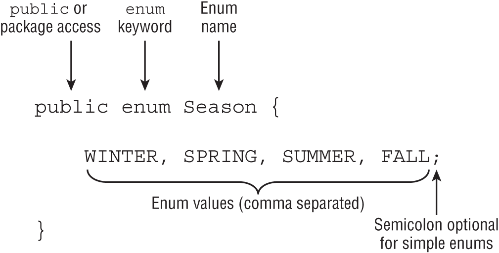

# Table of contents

- [Table of contents](#table-of-contents)
- [OCP preparation](#ocp-preparation)
- [Main method tricks](#main-method-tricks)
- [Compile and Run](#compile-and-run)
  - [Create Jar via CLI](#create-jar-via-cli)
- [Main arguments tricks](#main-arguments-tricks)
- [Import packages tricks](#import-packages-tricks)
- [Initializing class](#initializing-class)
  - [Constructor](#constructor)
  - [this](#this)
- [Numeric literals](#numeric-literals)
- [Underscores](#underscores)
- [Wrapper classes](#wrapper-classes)
- [Text blocks](#text-blocks)
- [Naming](#naming)
- [Variables declaration and initialization](#variables-declaration-and-initialization)
  - [Var](#var)
- [Eligibility for GC](#eligibility-for-gc)
- [Operators](#operators)
  - [Order of operator precedence](#order-of-operator-precedence)
  - [Some of unary operator](#some-of-unary-operator)
      - [Logical complement	`!a`](#logical-complementa)
    - [Bitwise complement\*\*	`~b`](#bitwise-complementb)
    - [Negation operator](#negation-operator)
    - [Increment decrement operators](#increment-decrement-operators)
    - [Modulus](#modulus)
- [Numeric promotion](#numeric-promotion)
- [Casting primitives](#casting-primitives)
- [Comparison](#comparison)
- [Ternary Operator tricks](#ternary-operator-tricks)
- [Pattern matching](#pattern-matching)
- [switch](#switch)
  - [switch statement](#switch-statement)
  - [Switch expression. New switch, which can return a value](#switch-expression-new-switch-which-can-return-a-value)
- [Cycles](#cycles)
  - [do while](#do-while)
  - [for](#for)
- [Labels](#labels)
- [Strings](#strings)
  - [String concatenation](#string-concatenation)
  - [important methods for OCP exam](#important-methods-for-ocp-exam)
  - [substring](#substring)
  - [equals](#equals)
  - [replace](#replace)
  - [strip and trim](#strip-and-trim)
  - [Working with indent](#working-with-indent)
  - [translateEscapes](#translateescapes)
  - [empty string](#empty-string)
  - [Formatting](#formatting)
  - [StringBuilder](#stringbuilder)
    - [Important methods](#important-methods)
    - [substring returns String](#substring-returns-string)
    - [append](#append)
    - [insert](#insert)
    - [delete](#delete)
    - [replace](#replace-1)
    - [reverse](#reverse)
  - [String pool](#string-pool)
- [Arrays](#arrays)
  - [Sort](#sort)
  - [Search](#search)
  - [Compare](#compare)
  - [Mismatch](#mismatch)
  - [Multidimensional Array](#multidimensional-array)
- [Math APIs](#math-apis)
  - [min max](#min-max)
  - [round](#round)
  - [Ceil and floor](#ceil-and-floor)
  - [Pow](#pow)
  - [random](#random)
- [Working with Dates and Times](#working-with-dates-and-times)
  - [LocalDate](#localdate)
  - [LocalTime](#localtime)
  - [LocalDateTime](#localdatetime)
  - [ZonedDateTime](#zoneddatetime)
  - [Manipulating date and times](#manipulating-date-and-times)
  - [Period](#period)
  - [Duration](#duration)
  - [Period vs Duration](#period-vs-duration)
  - [Instant](#instant)
  - [Daylight saving](#daylight-saving)
- [Methods](#methods)
  - [Signature](#signature)
  - [Access modifiers](#access-modifiers)
  - [return for void](#return-for-void)
  - [Local variables](#local-variables)
  - [Varargs](#varargs)
- [Access modifiers](#access-modifiers-1)
- [Static](#static)
- [Static import](#static-import)
- [Autoboxing](#autoboxing)
- [Overloading](#overloading)
  - [Rules](#rules)
- [Inheritance](#inheritance)
  - [hiding variables](#hiding-variables)
  - [super](#super)
  - [Constructor](#constructor-1)
  - [Class initialization](#class-initialization)
  - [Overriding](#overriding)
    - [Rules](#rules-1)
    - [Examples](#examples)
  - [Calling the parent version of an overridden method](#calling-the-parent-version-of-an-overridden-method)
  - [Redeclaring private methods](#redeclaring-private-methods)
  - [static method hiding](#static-method-hiding)
  - [variable hiding](#variable-hiding)
  - [final hiding and overriding](#final-hiding-and-overriding)
- [Abstract classes](#abstract-classes)
  - [Rules](#rules-2)
  - [Constructor in abstract class](#constructor-in-abstract-class)
- [Immutable classes](#immutable-classes)
  - [copy on read access method](#copy-on-read-access-method)
  - [Performing a Defensive Copy](#performing-a-defensive-copy)
- [Interfaces](#interfaces)
  - [Inheriting Duplicate Abstract Methods](#inheriting-duplicate-abstract-methods)
  - [default methods](#default-methods)
  - [Declaring static Interface Methods](#declaring-static-interface-methods)
  - [Private static and private methods](#private-static-and-private-methods)
  - [Calling Abstract Methods](#calling-abstract-methods)
- [Enum](#enum)
- [Sealing Classes](#sealing-classes)
  - [Omitting the permits Clause](#omitting-the-permits-clause)
  - [Sealed interfaces](#sealed-interfaces)
- [Encapsulation](#encapsulation)
- [Records](#records)
  - [Declaring Constructors](#declaring-constructors)
    - [Long constructor](#long-constructor)
    - [Compact constructor](#compact-constructor)
    - [Overloaded Constructors](#overloaded-constructors)
  - [Customized records](#customized-records)
- [Nested classes](#nested-classes)
  - [Inner class](#inner-class)
    - [Instantiating an Instance of an Inner Class](#instantiating-an-instance-of-an-inner-class)
  - [static nested class](#static-nested-class)
  - [Local Class](#local-class)
  - [Anonymous classes](#anonymous-classes)
- [Polymorphism discussion](#polymorphism-discussion)
- [Lambdas and Functional Interfaces](#lambdas-and-functional-interfaces)
  - [Lambda syntax](#lambda-syntax)
  - [Using Local Variables Inside a Lambda Body](#using-local-variables-inside-a-lambda-body)
  - [Referencing Variables from the Lambda Body](#referencing-variables-from-the-lambda-body)
  - [Functional interface](#functional-interface)
  - [Method References](#method-references)
    - [Calling static Methods](#calling-static-methods)
    - [Calling Instance Methods on a Particular Object](#calling-instance-methods-on-a-particular-object)
    - [Calling Instance Methods on a Parameter](#calling-instance-methods-on-a-parameter)
    - [Calling Constructors](#calling-constructors)
  - [General functional interfaces](#general-functional-interfaces)
    - [Supplier](#supplier)
    - [Consumer and BiConsumer](#consumer-and-biconsumer)
    - [Predicate and BiPredicate](#predicate-and-bipredicate)
    - [Function and BiFunction](#function-and-bifunction)
    - [UnaryOperator and BinaryOperator](#unaryoperator-and-binaryoperator)
    - [Convenience Methods on Functional Interfaces](#convenience-methods-on-functional-interfaces)
  - [Functional Interfaces for Primitives](#functional-interfaces-for-primitives)
- [Collections Framework](#collections-framework)
  - [Overview](#overview)
  - [Common methods for Collections](#common-methods-for-collections)
  - [Lists](#lists)
    - [Comparing Lists](#comparing-lists)
    - [Create list via factory methods](#create-list-via-factory-methods)
    - [Create lists via constructors](#create-lists-via-constructors)
    - [Lists methods](#lists-methods)
    - [List to Array](#list-to-array)
  - [Sets](#sets)
    - [Comparing sets](#comparing-sets)
      - [HashSet](#hashset)
      - [TreeSet](#treeset)
  - [Creating via factory methods](#creating-via-factory-methods)
    - [Sets methods](#sets-methods)
  - [Queue and Deque Interfaces](#queue-and-deque-interfaces)
    - [Comparing Deque Implementations](#comparing-deque-implementations)
    - [Methods Queue](#methods-queue)
    - [Methods Deque](#methods-deque)
  - [Maps](#maps)
    - [Factory methods](#factory-methods)
    - [Comparison maps](#comparison-maps)
      - [HashMap](#hashmap)
      - [LinkedHashMap](#linkedhashmap)
      - [TreeMap](#treemap)
    - [Maps methods](#maps-methods)
- [Sorting data](#sorting-data)
  - [Comparable Class](#comparable-class)
    - [Keeping compareTo() and equals() Consistent](#keeping-compareto-and-equals-consistent)
  - [Comparator](#comparator)
  - [Comparing Comparable and Comparator](#comparing-comparable-and-comparator)
  - [Helper methods to compare multiple fields](#helper-methods-to-compare-multiple-fields)
    - [Helper static methods for building a Comparator](#helper-static-methods-for-building-a-comparator)
    - [Helper default methods for building a Comparator to chain methods](#helper-default-methods-for-building-a-comparator-to-chain-methods)
  - [Sorting and Searching](#sorting-and-searching)
  - [Sorting a List](#sorting-a-list)
- [Generics](#generics)
  - [Generic Classes](#generic-classes)
  - [Naming conventions](#naming-conventions)
- [Streams](#streams)
- [Exceptions](#exceptions)
- [Internalization](#internalization)
- [Modules](#modules)
- [Concurrency](#concurrency)
  - [Data races](#data-races)
- [I/O](#io)
- [JDBC](#jdbc)


# OCP preparation

>  Some of the most time-consuming questions you may see on the exam could involve nested loops with lots of branching. Unless you spot an obvious compiler error, we recommend skipping these questions and coming back to them at the end. Remember, all questions on the exam are weighted evenly!


# Main method tricks

Allowed final word in main main method and arguments
```java
public final static void main(final String[] args) {}
```

# Compile and Run

If file doesn't contain any public class it can named any. After compiling this name of file will be vanish, and we get several file with classes.

If file contain main method and package name then java after javac doesn't invoke main method if we launch it from the package directory, it can not find main method to handle this
```
javac packagea/ClassA.java packageb/ClassB.java
```
of with wildcard
```
javac packagea/*.java packageb/*.java
```

then run it with package 
```
java packageb.ClassB
```

`javac` creates by default class at the same directories. It's not good enough. It's useful to specify a directory for classes for created package structure and put compiled files there.
```
javac -d classes packagea/ClassA.java packageb/ClassB.java
```
this command created classes folder and package structure and then compiled java classes to class files.

after that from current directory it's possible to run this program with class path options. There are several ways to do that:
```
java -cp classes packageb.ClassB
java -classpath classes packageb.ClassB
java --class-path classes packageb.ClassB
```
On Windows, you type the following:
```
java -cp ".;C:\temp\someOtherLocation;c:\temp\myJar.jar" myPackage.MyClass
```

And on macOS/Linux, you type this:
```
java -cp ".:/tmp/someOtherLocation:/tmp/myJar.jar" myPackage.MyClass
```
The period `.`indicates that you want to include the current directory in the classpath. The rest of the command says to look for loose class files (or packages) in someOtherLocation and within myJar.jar. Windows uses semicolons `;` to separate parts of the classpath; other operating systems use colons.

Just like when you're compiling, you can use a wildcard (*) to match all the JARs in a directory. Here's an example:
```
java -cp "C:\temp\directoryWithJars\*" myPackage.MyClass
```
This command will add to the classpath all the JARs that are in directoryWithJars. It won't include any JARs in the classpath that are in a subdirectory of directoryWithJars.

## Create Jar via CLI

create jar with classes and packages from the current folder
```
jar -cvf myNewFile.jar .
jar --create --verbose --file myNewFile.jar .
```
with '-C' option to specify directory with classes
```
jar -cvf myNewFile.jar -C dir .
```

# Main arguments tricks
---
use quotes for arguments with spaces
```
javac Zoo.java
java Zoo "San Diego" Zoo
```
---
single file source code - compile and launch with one command and pass parameters
```
java Zoo.java Bronx Zoo
```

# Import packages tricks

The import statement doesn't bring in child packages, fields, or methods; it imports only classes directly under the package

---

When we use multiple import sql classes and date from util. We need explicitly write date class
```java
import java.util.Date;
import java.sql.*;
```
if it will be that , then it's compile error
```java
import java.util.*;
import java.sql.*;  // causes Date declaration to not compile
```


# Initializing class

> Sometimes code blocks are inside a method. These are run when the method is called. Other times, code blocks appear outside a method. These are called **instance initializers**

> Class can have name started with lower case. 

```java
// Bear.java
class Bird {}
class Bear {}
class Fish {}
```

```java
// ClownFish.java
protected class ClownFish{} // DOES NOT COMPILE
 
// BlueTang.java
private class BlueTang {} // DOES NOT COMPILE
```

## Constructor

- A class can contain many overloaded constructors, provided the signature for each is distinct.
- The compiler inserts a default no-argument constructor if no constructors are declared.
- If a constructor calls this(), then it must be the first line of the constructor. Comments aren't considered statements and are allowed anywhere.
- Java does not allow cyclic constructor calls.

```java
public class Bunny {
   public bunny() {} // DOES NOT COMPILE
   public void Bunny() {}
}
```

```java
public class Bonobo {
   public Bonobo(var food) {  // DOES NOT COMPILE
   }
}
```

overloaded constructors
```java
public class Turtle {
   private String name;
   public Turtle() {
      name = "John Doe";
   }
   public Turtle(int age) {}
   public Turtle(long age) {}
   public Turtle(String newName, String… favoriteFoods) {
      name = newName;
   }
}
```

```java
public Hamster(int weight) {
   System.out.println("chew");
   // Set weight and default color
   this(weight, "brown");     // DOES NOT COMPILE
}
```

```java
public class Gopher {
   public Gopher(int dugHoles) {
      this(5);  // DOES NOT COMPILE
   }
}
```

```java
public class Gopher {
   public Gopher() {
      this(5);  // DOES NOT COMPILE
   }
   public Gopher(int dugHoles) {
      this();   // DOES NOT COMPILE
   }
}
```

## this

>the `this` reference refers to the current instance of the class and can be used to access any member of the class, including inherited members. 

> It can be used in any instance method, constructor, or instance initializer block. 

> It cannot be used when there is no implicit instance of the class, such as in a static method or static initializer block.

# Numeric literals

- **Octal** (digits 0–7), which uses the number `0` as a prefix—for example, `017`.
- **Hexadecimal** (digits 0–9 and letters A–F/a–f), which uses `0x` or `0X` as a prefix—for example, `0xFF`, `0xff`, `0XFf`. Hexadecimal is case insensitive, so all of these examples mean the same value.
- **Binary** (digits 0–1), which uses the number 0 followed by b or B as a prefix—for example, `0b10`, `0B10`.
# Underscores

You can add underscores anywhere except at the beginning of a literal, the end of a literal, right before a decimal point, or right after a decimal point. You can even place multiple underscore characters next to each other, although we don't recommend it.

Let's look at a few examples:

```java
double notAtStart = _1000.00;          // DOES NOT COMPILE
double notAtEnd = 1000.00_;            // DOES NOT COMPILE
double notByDecimal = 1000_.00;        // DOES NOT COMPILE
double annoyingButLegal = 1_00_0.0_0;  // Ugly, but compiles
double reallyUgly = 1__________2;      // Also compiles
```

# Wrapper classes

| Primitive type | Wrapper class | inherits Number? | Example of creating          |
| -------------- | ------------- | ---------------- | ---------------------------- |
| boolean        | Boolean       | No               | `Boolean.valueOf(true)`      |
| byte           | Byte          | Yes              | `Byte.valueOf((byte) 1)`     |
| short          | Short         | Yes              | `Short.valueOf((short) 1)`   |
| int            | Integer       | Yes              | `Integer.valueOf(1)`         |
| long           | Long          | Yes              | `Long.valueOf(1)`            |
| float          | Float         | Yes              | `Float.valueOf((float) 1.0)` |
| double         | Double        | Yes              | `Double.valueOf(1.0)`        |
| char           | Character     | No               | `Character.valueOf('c')`     |

There is also a `valueOf()` variant that converts a String into the wrapper class and `parse()`
```java
int primitive = Integer.parseInt("123");
Integer wrapper = Integer.valueOf("123");
```

All of the numeric classes in Table extend the `Number` class, which means they all come with some useful helper methods: `byteValue()`, `shortValue()`, `intValue()`, `longValue()`, `floatValue()`, and `doubleValue()`. 

```java
public abstract class Number implements java.io.Serializable {
    public Number() {super();}
    public abstract int intValue();
    public abstract long longValue();
    public abstract float floatValue();
    public abstract double doubleValue();
    public byte byteValue() {
        return (byte)intValue();
    }
    public short shortValue() {
        return (short)intValue();
    }
}
```


The `Boolean` and `Character` wrapper classes include `booleanValue()` and `charValue()`, respectively.

# Text blocks

> new line after first """ or compile error

> quotes inside may be with escaping \ or not

> spaces at the end of the line are ignored but we can use \s


# Naming

- Identifiers must begin with a letter, a currency symbol, or a `_` symbol. Currency symbols include dollar `$`, yuan `¥`, euro `€`, and so on.
- Identifiers can include numbers but not start with them.
- A single underscore `_` is not allowed as an identifier.
- You cannot use the same name as a Java reserved word.

# Variables declaration and initialization

initialized only `i3`
```java
void paintFence() {
   int i1, i2, i3 = 0;
}
```

Different types in one statement do not compile
```java
int num, String value; // DOES NOT COMPILE
```

```java
boolean b1, b2; // COMPILE
String s1 = "1", s2; // COMPILE
double d1, double d2; // DOES NOT COMPILE. Use one double in this case double d1, d2;
int i1; int i2; // COMPILE
int i3; i4; // DOES NOT COMPILE. Statement is finished ; and next statement without type
```

With final
```java
final int a =5, b = 4;
b = 5; // DOES NOT COMPILE

final int c =5, d;
d = 4;
d = 5; // DOES NOT COMPILE
```

```java
public void findAnswer(boolean check) {
   int answer;
   int otherAnswer;
   int onlyOneBranch;
   if (check) {
      onlyOneBranch = 1;
      answer = 1;
   } else {
      answer = 2;
   }
   System.out.println(answer);
   System.out.println(onlyOneBranch);  // DOES NOT COMPILE
}
```

```java
public void checkAnswer() {
   boolean value;
   findAnswer(value);  // DOES NOT COMPILE
}
```

> Instance and class variables (static) do not require you to initialize them. As soon as you declare these variables, they are given a default value. The compiler doesn't know what value to use and so wants the simplest value it can give the type: null for an object, zero for the numeric types, and false for a boolean. You don't need to know the default value for char, but in case you are curious, it is '\u0000' (NUL).

> The compiler does not apply a default value to final variables, though. A final instance or final static variable must receive a value when it is declared or as part of initialization.

## Var
> local variable type inference. Let's take that apart. First comes **local** variable. This means just what it sounds like. You can only use this feature for local variables.

> The compiler looks at the code **on the line of the declaration** and uses it to infer the type

```java
public class VarKeyword {
   var tricky = "Hello"; // DOES NOT COMPILE
}
```

```java
public void reassignment() {
   var number = 7;
   number = 4;
   number = "five";  // DOES NOT COMPILE
}
```

```java
public void breakingDeclaration() {
   var silly
      = 1;
}
```

```java
 public void doesThisCompile(boolean check) {
    var question; // DOES NOT COMPILE
    question = 1;
    var answer;  // DOES NOT COMPILE
    if (check) {
       answer = 2;
    } else {
       answer = 3;
    }
    System.out.println(answer);
 }
```

It can be possible to resolve Object type while assigning null to var. But not.. designers of the language decided do not compile this.
```java
public void twoTypes() {
   int a, var b = 3;  // DOES NOT COMPILE
   var n = null;      // DOES NOT COMPILE
   var fall = 2, autumn = 2; // DOES NOT COMPILE
}
```

```java
public int addition(var a, var b) { // DOES NOT COMPILE
   return a + b;
}
```

>var is not a reserved word and allowed to be used as an identifier. It is considered a reserved type name. A reserved type name means it cannot be used to define a type, such as a class, interface, or enum

```java
package var; 
public class Var {
   public void var() {
      var var = "var";
   }
   public void Var() {
      Var var = new Var();
   }
}
```

# Eligibility for GC
```java
 public class Scope {
    public static void main(String[] args) {
       String one, two;
       one = new String("a");
       two = new String("b");
       one = two;
       String three = one;
       one = null;
    } }
```
# Operators

## Order of operator precedence


| Operator                        | Symbols and examples                             | Evaluation    |
| ------------------------------- | ------------------------------------------------ | ------------- |
| Post-unary operators            | `expression++`, `expression--`                   | Left-to-right |
| Pre-unary operators             | `++expression`, `--expression`                   | Left-to-right |
| Other unary operators           | `- ! ~ + (type)`                                 | Right-to-left |
| Cast                            | `(Type)reference`                                | Right-to-left |
| Multiplication/division/modulus | `* / %`                                          | Left-to-right |
| Addition/subtraction            | `+ -`                                            | Left-to-right |
| Shift operators                 | `<< >> >>>`                                      | Left-to-right |
| Relational operators            | `< > <= >= instanceof`                           | Left-to-right |
| Logical AND                     | `&`                                              | Left-to-right |
| Logical exclusive OR            | `^`                                              | Left-to-right |
| Logical inclusive OR            | `\|`                                             | Left-to-right |
| Conditional AND                 | `&&`                                             | Left-to-right |
| Conditional OR                  | `\|\|`                                           | Left-to-right |
| Ternary operators               | `boolean expression ? expression1 : expression2` | Right-to-left |
| Assignment operators            | `= += -= *= /= %= &= ^= \|= <<= >>= >>>=`        | Right-to-left |
| Arrow operator                  | `->`                                             | Right-to-left |

## Some of unary operator

```java
int pelican = !5;         // DOES NOT COMPILE
boolean penguin = -true;  // DOES NOT COMPILE
boolean peacock = !0;     // DOES NOT COMPILE
```

#### Logical complement	`!a`	
Inverts a boolean's logical value
```java
boolean isAnimalAsleep = false;
System.out.print(isAnimalAsleep);  // false
isAnimalAsleep = !isAnimalAsleep;
System.out.print(isAnimalAsleep);  // true
```


### Bitwise complement**	`~b`	
which flips all of the 0s and 1s in a number. It can only be applied to integer numeric types such as `byte`, `short`, `char`, `int`, and `long`. Let's try an example. For simplicity, we only show the last four bits (instead of all 32 bits).

```java
int value = 3;                   // Stored as 0011
int complement = ~value;         // Stored as 1100
System.out.println(value);       // 3
System.out.println(complement);  // -4
```

to find the bitwise complement of a number, multiply it by negative one and then subtract one.
```java
System.out.println(-1*value - 1);      // -4
System.out.println(-1*complement - 1); // 3
```

### Negation operator

```java
double zooTemperature = 1.21;
System.out.println(zooTemperature);  // 1.21
zooTemperature = -zooTemperature;
System.out.println(zooTemperature);  // -1.21
zooTemperature = -(-zooTemperature);
System.out.println(zooTemperature);  // -1.21
```

### Increment decrement operators

Pre-increment	`++w`	Increases the value by 1 and returns the **new** value

Pre-decrement	`--x`	Decreases the value by 1 and returns the **new** value

Post-increment	`y++`	Increases the value by 1 and returns the **original** value

Post-decrement	`z--`	Decreases the value by 1 and returns the **original** value

```java
int a = 2, b = 4, c = 2;
System.out.println(a ˃ 2 ? --c : b++); // 4
System.out.println(b = (a!=c ? a : b++)); // 5  first decrement but return old value. b is already 6, but then result of ternary assign to b. And this result of ternary is 5 (old value of b)
```

```java
int parkAttendance = 0;
System.out.println(parkAttendance);    // 0
System.out.println(++parkAttendance); // 1
System.out.println(parkAttendance);    // 1
System.out.println(parkAttendance--); // 1
System.out.println(parkAttendance);    // 0
```

> All of the arithmetic operators may be applied to any Java primitives, with the exception of boolean. Furthermore, only the addition operators + and += may be applied to String values, which results in String concatenation

### Modulus 

```java
System.out.println(9 / 3);  // 3
System.out.println(9 % 3);  // 0
 
System.out.println(10 / 3); // 3
System.out.println(10 % 3); // 1
 
System.out.println(11 / 3); // 3
System.out.println(11 % 3); // 2
 
System.out.println(12 / 3); // 4
System.out.println(12 % 3); // 0
```

> For a given divisor y, the modulus operation results in a value between `0` and `(y - 1)` for positive dividends, or 0, 1, 2 in this example.

> The modulus operation is not limited to positive integer values in Java; it may also be applied to negative integers and floating-point numbers. For example, if the divisor is 5, then the modulus value of a negative number is between -4 and 0. 

# Numeric promotion

1. If two values have different data types, Java will automatically promote one of the values to the larger of the two data types.
2. If one of the values is integral and the other is floating-point, Java will automatically promote the integral value to the floating-point value's data type.
3. Smaller data types, namely, byte, short, and char, are first promoted to int any time they're used with a Java binary arithmetic operator with a variable (as opposed to a value), even if neither of the operands is int.
4. After all promotion has occurred and the operands have the same data type, the resulting value will have the same data type as its promoted operands.

> For the third rule, note that unary operators are excluded from this rule. For example, applying ++ to a short value results in a short value.

```java
int x = 1;
long y = 33;
var z = x * y; // long (first rule)
```

```java
short x = 10;
short y = 3;
var z = x * y; // int (third rule)
```

```java
double x = 39.21;
float y = 2.1; // doesn't compile
var z = x + y;
```

```java
char a = 'a' + 'c'; // compile because literals
char b = 'b';
char k = a + b; // doesn't compile because of int
```

```java 
short w = 14;
float x = 13;
double y = 30;
var z = w * x / y; // double 
```

# Casting primitives

```java
int fish = 1.0;        // DOES NOT COMPILE
short bird = 1921222;  // DOES NOT COMPILE
int mammal = 9f;       // DOES NOT COMPILE
long reptile = 192_301_398_193_810_323;  // DOES NOT COMPILE
```

fix
```java
int fish = (int)1.0;
short bird = (short)1921222;  // Stored as 20678
int mammal = (int)9f;
long reptile = (long)192301398193810323;  // DOES NOT COMPILE
long reptile = 192301398193810323L
```
---
```java
short mouse = 10;
short hamster = 3;
short capybara = mouse * hamster;  // DOES NOT COMPILE
```
fix
```java
short mouse = 10;
short hamster = 3;
short capybara = (short)(mouse * hamster);
```
---
```java
short mouse = 10;
short hamster = 3;
short capybara = (short)mouse * hamster;      // DOES NOT COMPILE
short capybara = 1 + (short)(mouse * hamster);  // DOES NOT COMPILE
```

> compiler doesn't require casting when working with literal values that fit into the data type

```java
byte hat = 1;
byte gloves = 7 * 10;
short scarf = 5;
short boots = 2 + 1;
```

```java
short boots = 2 + hat;  // DOES NOT COMPILE
byte gloves = 7 * 100;  // DOES NOT COMPILE
```

Compound operates can handle casting
```java
long goat = 10;
int sheep = 5;
sheep = sheep * goat;   // DOES NOT COMPILE
```

```java
long goat = 10;
int sheep = 5;
sheep *= goat;  // The compound operator will first cast sheep to a long, apply the multiplication of two long values, and then cast the result to an int. 
```

assignment with assignment
```java
long wolf = 5;
long coyote = (wolf=3);
System.out.println(wolf);   // 3
System.out.println(coyote); // 3
```
and as well
```java
long wolf = 5;
long coyote = (wolf=3);
long tiger = wolf = coyote = 10;
System.out.println(wolf);   // 10
System.out.println(coyote); // 10
 System.out.println(tiger); // 10
```

```java
boolean healthy = false;
if(healthy = true)
   System.out.print("Good!");
```


```java
public class CandyCounter {
   static long addCandy(double fruit, float vegetables) {
      return (int)fruit+vegetables;                         // doesn't compile because result will be float and float not casting to long
   }
   
   public static void main(String[] args) {
      System.out.print(addCandy(1.4, 2.4f) + ", ");
      System.out.print(addCandy(1.9, (float)4) + ", ");
      System.out.print(addCandy((long)(int)(short)2, (float)4)); } } // correct
```

# Comparison

>The equality operator can be applied to numeric values, boolean values, and objects (including String and null). When applying the equality operator, you cannot mix these types. I.E it's legal to compare different numeric types with each other.


```java
boolean monkey = true == 3;       // DOES NOT COMPILE
boolean ape = false != "Grape";   // DOES NOT COMPILE
boolean gorilla = 10.2 == "Koko"; // DOES NOT COMPILE
boolean a = 34L == 3.9f;
```

```java
boolean bear = false;
boolean polar = (bear = true);
System.out.println(polar);  // true
```

```java
var monday = new File("schedule.txt");
var tuesday = new File("schedule.txt");
var wednesday = tuesday;
System.out.println(monday == tuesday);    // false
System.out.println(tuesday == wednesday); // true
```

```java
System.out.print(null == null);  // true
```

> If the compiler can determine that a variable cannot possibly be cast to a specific class, it reports an error.

```java
public void openZoo(Number time) {
   if(time instanceof String) // DOES NOT COMPILE
      System.out.print(time);
}
```

```java
System.out.print(null instanceof Object);  // false
 
Object noObjectHere = null;
System.out.print(noObjectHere instanceof String);  // false
System.out.print(null instanceof null);  // DOES NOT COMPILE
```

```java
if(duck!=null & duck.getAge()<5) { // Could throw a NullPointerException
   // Do something
}
```

```java
if(duck!=null && duck.getAge()<5) {
   // Do something
}
```

```java
int ph = 7, vis = 2;
boolean clear = vis ˃ 1 & (vis ˂ 9 || ph ˂ 2);
boolean safe = (vis ˃ 2) && (ph++ ˃ 1);                 // right side never invokes
boolean tasty = 7 ˂= --ph;
System.out.println(clear + "-" + safe + "-" + tasty);  // true, false, false 
```

# Ternary Operator tricks

```java
int food1 = owl < 4 ? owl > 2 ? 3 : 4 : 5;
int food2 = (owl < 4 ? ((owl > 2) ? 3 : 4) : 5)
```

> there is no requirement that second and third expressions in ternary operations have the same data types, although it does come into play when combined with the assignment operator
```java
int stripes = 7;
 
System.out.print((stripes > 5) ? 21 : "Zebra");
 
int animal = (stripes < 9) ? 3 : "Horse";  // DOES NOT COMPILE
```

```java
int sheep = 1;
int zzz = 1;
int sleep = zzz < 10 ? sheep++ : zzz++;
System.out.print(sleep + "," + sheep + "," + zzz);  // 1,2,1
```    

```java
int sheep = 1;
int zzz = 1;
int sleep = sheep>=10 ? sheep++ : zzz++;
System.out.print(sleep + "," + sheep + "," + zzz);  // 1,1,2
```    

# Pattern matching 

For escaping type checking and casting in Java 16 there are pattern matching. Variable `data` is so called *pattern variable*.
```java
void compareIntegers(Number number) {
   if(number instanceof Integer data) {
      System.out.print(data.compareTo(5));
   }
}
```

if pattern variable is not final it can be reassigned
```java
if(number instanceof Integer data) {
   data = 10;
}
```

```java
if(number instanceof final Integer data) {
   data = 10;  // DOES NOT COMPILE
}
```

pattern variable can be possible to use in the same equations further

```java
void printIntegersGreaterThan5(Number number) {
   if(number instanceof Integer data && data.compareTo(5)>0)
      System.out.print(data);
}
```

Pattern variable must by sub type. In comparison an usual instanceof
```java
Integer value = 123;
if(value instanceof Integer) {}
if(value instanceof Integer data) {}  // DOES NOT COMPILE
```

the variable should be exist before using

```java
void printIntegersOrNumbersGreaterThan5(Number number) {
   if(number instanceof Integer data || data.compareTo(5)>0)  // DOES NOT COMPILE
      System.out.print(data);
}
```

Scope of variable is far beyond code block. Compilation will decide
```java
void printOnlyIntegers(Number number) { 
   if (!(number instanceof Integer data))
      return;
   System.out.print(data.intValue());
}
```

# switch

## switch statement


 - `default` can be everywhere among cases. It possible that there are no cases at all, and default will work in that case. Более того может быть вообще ничего внутри скобок
 - Если после значения идет `:` далее может идти как блок так и последовательность выражение разделенных `;`

```java
switch (random) {
       case 4:
        System.out.println("first");
        System.out.println("second");
        break;
    case 5: {
        System.out.println("third");
        System.out.println("other");
        break;
    }
}
```        

- допускается пустой switch
```java
switch(month) {}
```

The following is a list of all data types supported by switch statements:

- `int` and `Integer`
- `byte` and `Byte`
- `short` and `Short`
- `char` and `Character`
- `String`
- `enum` values
- `var` (if the type resolves to one of the preceding types)

Notice that `boolean`, `long`, `float`, and `double` are excluded from switch statements, as are their associated `Boolean`, `Long`, `Float`, and `Double` classes

обратить внимание на использование нескольких значений в одном `case`. Появилось в Java 14
```java
switch(animal) {
   case 1,2: System.out.print("Lion");
   case 3:   System.out.print("Tiger");
}
```
in the past we need to write like this

```java
switch(animal) {
   case 1: case 2: System.out.print("Lion");
   case 3:         System.out.print("Tiger");
}
``` 

```java
public void printSeason(int month) {
   switch(month) {
      case 1, 2, 3:    System.out.print("Winter");
      case 4, 5, 6:    System.out.print("Spring");
      default:         System.out.print("Unknown");
      case 7, 8, 9:    System.out.print("Summer");
      case 10, 11, 12: System.out.print("Fall");
   } 
}
```

In case we can write only constants and values which known in compile time
```java
final int getCookies() { return 4; }
void feedAnimals() {
   final int bananas = 1;
   int apples = 2;
   int numberOfAnimals = 3;
   final int cookies = getCookies();
   switch(numberOfAnimals) {
      case bananas:
      case apples:        // DOES NOT COMPILE
      case getCookies():  // DOES NOT COMPILE
      case cookies :      // DOES NOT COMPILE
      case 3 * 5 :
   } }
```   


## Switch expression. New switch, which can return a value


- After operator `->` is NOT lambda. 
- After comma separated values there is `->` but not `:`
- Mandatory use `;` if you use not a block of code but one expression.
- Mandatory use `;` after switch, since there is assignment result of switch to a local variable
- you don't need `break` branch is executed only if the expression matches.
- After code block `;` must no be used 
```java
public void printDayOfWeek(int day) {
   var result = switch(day) {
      case 0 -> "Sunday";
      case 1 -> "Monday";
      case 2 -> "Tuesday";
      case 3 -> "Wednesday";
      case 4 -> "Thursday";
      case 5 -> "Friday";
      case 6 -> "Saturday";
      default -> "Invalid value";
   };
   System.out.print(result);
}
```

here is no assignment to a variable, so you don't need a default branch 
```java
public void printSeason(int month) {
   switch(month) {
      case 1, 2, 3    -> System.out.print("Winter");
      case 4, 5, 6    -> System.out.print("Spring");
      case 7, 8, 9    -> System.out.print("Summer");
      case 10, 11, 12 -> System.out.print("Fall");
   } 
}
```   

1. All of the branches of a switch expression that do not throw an exception must return a consistent data type (if the switch expression returns a value).

      ```java
      int measurement = 10;
      int size = switch(measurement) {
         case 5 -> 1;
         case 10 -> (short)2;
         default -> 5;
         case 20 -> "3";   // DOES NOT COMPILE
         case 40 -> 4L;    // DOES NOT COMPILE
         case 50 -> null;  // DOES NOT COMPILE
      };
      ```

2. If the switch expression returns a value, then every branch that isn't an expression must yield a value.

```java
int fish = 5;
int length = 12;
var name = switch(fish) {
   case 1 -> "Goldfish";
   case 2 -> {yield "Trout";}
   case 3 -> {
      if(length > 10) yield "Blowfish";
      else yield "Green";
   }
   default -> "Swordfish";
};
```

```java
int fish = 5;
int length = 12;
var name = switch(fish) {
   case 1 -> "Goldfish";
   case 2 -> {}  // DOES NOT COMPILE
   case 3 -> {
      if(length > 10) yield "Blowfish";
   }  // DOES NOT COMPILE
   default -> "Swordfish";
};
```

3. A default branch is required unless all cases are covered or no value is returned.

```java
String type = switch(animal) { // DOES NOT COMPILE
   case 1 -> "dog";
   case 2 -> "wolf";
   case 3 -> "coyote";
};
```
Two ways how to fix:
1. Add default branch.
2. If the switch expression takes an enum value, add a case branch for every possible enum value.

```java
enum Season {WINTER, SPRING, SUMMER, FALL}
 
String getWeather(Season value) {
   return switch(value) {
      case WINTER -> "Cold";
      case SPRING -> "Rainy";
      case SUMMER -> "Hot";
      case FALL -> "Warm";
   };
}
```

- When you use enums with switch it's useful to use a default branch as well, even if it's not mandatory. If you add a value to enum there will be mandatory fixes to all using this enum in switch since code does not compiled. 

# Cycles

## do while
Mandatory use `;` after `while` in `do while` cycle
```java
int lizard = 0;
do {
   lizard++;
} while(false);
System.out.println(lizard);  // 1
```

## for

- Blocks can be compound. In such cases you need to use comma between them
- Expression in blocks are optional. This is infinite cycle. Mandatory `;` between blocks

```java
for( ; ; )
   System.out.println("Hello World");
```
this does not compiled `for( )`


variables scope
```java
for(int i=0; i < 10; i++)
   System.out.println("Value is: "+i);
System.out.println(i);  // DOES NOT COMPILE
```

```java
int i;
for(i=0; i < 10; i++)
   System.out.println("Value is: "+i);
System.out.println(i);
```

correct
```java
int x = 0;
for(long y = 0, z = 4; x < 5 && y < 10; x++, y++) {
   System.out.print(y + " "); }
System.out.print(x + " ");
```

not correct
```java
int x = 0;
for(long y = 0, int z = 4; x < 5; x++)  // DOES NOT COMPILE
   System.out.print(y + " ");

```java
int x = 0;
for(int x = 4; x < 5; x++)   // DOES NOT COMPILE
   System.out.print(x + " ");
```

# Labels

Labels can be before `if`, `switch` and all cycles.

```java
int[][] myComplexArray = {{5,2,1,3},{3,9,8,9},{5,7,12,7}};
 
OUTER_LOOP:  for(int[] mySimpleArray : myComplexArray) {
   INNER_LOOP:  for(int i=0; i<mySimpleArray.length; i++) {
      System.out.print(mySimpleArray[i]+"\t");
   }
   System.out.println();
}
```

such labels can be before any block
```java
int frog = 15;
BAD_IDEA: if(frog>10)
EVEN_WORSE_IDEA: {
   frog++;
}
```

`break` with label
```java
public class FindInMatrix {
   public static void main(String[] args) {
      int[][] list = {{1,13},{5,2},{2,2}};
      int searchValue = 2;
      int positionX = -1;
      int positionY = -1;
 
      PARENT_LOOP: for(int i=0; i<list.length; i++) {
         for(int j=0; j<list[i].length; j++) {
            if(list[i][j]==searchValue) {
               positionX = i;
               positionY = j;
               break PARENT_LOOP;
            }
         }
      }
      if(positionX==-1 || positionY==-1) {
         System.out.println("Value "+searchValue+" not found");
      } else {
         System.out.println("Value "+searchValue+" found at: " +
            "("+positionX+","+positionY+")");
      }
   }
}
```

you can interrupt cycles using `return`
```java
   private static int[] searchForValue(int[][] list, int v) {
      for (int i = 0; i < list.length; i++) {
         for (int j = 0; j < list[i].length; j++) {
            if (list[i][j] == v) {
               return new int[] {i,j};
            }
         }
      }
      return null;
   }
```   


`continue` with label
```java
public class CleaningSchedule {
   public static void main(String[] args) {
      CLEANING: for(char stables = 'a'; stables<='d'; stables++) {
         for(int leopard = 1; leopard<4; leopard++) {
            if(stables=='b' || leopard==2) {
               continue CLEANING;
            }
            System.out.println("Cleaning: "+stables+","+leopard);
} } } }
```

unreachable code for break, continue, return
```java
int checkDate = 0;
while(checkDate<10) {
   checkDate++;
   if(checkDate>100) {
      break;
      checkDate++;  // DOES NOT COMPILE
   }
}

int minute = 1;
WATCH: while(minute>2) {
   if(minute++>2) {
      continue WATCH;
      System.out.print(minute);  // DOES NOT COMPILE
   }
}
 
int hour = 2;
switch(hour) {
   case 1: return; hour++;  // DOES NOT COMPILE
   case 2:
}
```
# Strings

## String concatenation

Rules:
- If both operands are numeric, + means numeric addition.
- If either operand is a String, + means concatenation.
- The expression is evaluated left to right.

```java
System.out.println(1 + 2);           // 3
System.out.println("a" + "b");       // ab
System.out.println("a" + "b" + 3);   // ab3
System.out.println(1 + 2 + "c");     // 3c
System.out.println("c" + 1 + 2);     // c12
System.out.println("c" + null);      // cnull
```

```java
int three = 3;
String four = "4";
System.out.println(1 + 2 + three + four);
```

## important methods for OCP exam
```java
public int length()

public char charAt(int index)

public int indexOf(int ch) 
public int indexOf(int ch, int fromIndex)
public int indexOf(String str)
public int indexOf(String str, int fromIndex)

public String substring(int beginIndex)
public String substring(int beginIndex, int endIndex)

public String toLowerCase()
public String toUpperCase()

public boolean equals(Object obj)
public boolean equalsIgnoreCase(String str)

public boolean startsWith(String prefix)
public boolean endsWith(String suffix)
public boolean contains(CharSequence charSeq)

public String replace(char oldChar, char newChar)
public String replace(CharSequence target, CharSequence replacement)

public String strip()
public String stripLeading()
public String stripTrailing()
public String trim()

public String indent(int numberSpaces)
public String stripIndent()

public String translateEscapes()

public boolean isEmpty()
public boolean isBlank()

public static String format(String format, Object args…)
public static String format(Locale loc, String format, Object args…)
public String formatted(Object args…)
```

```java
var name = "animals";
System.out.println(name.indexOf('a'));       // 0
System.out.println(name.indexOf("al"));      // 4
System.out.println(name.indexOf('a', 4));    // 4
System.out.println(name.indexOf("al", 5));   // -1
```

## substring 

```java
public String substring(int beginIndex)
public String substring(int beginIndex, int endIndex)
```

second argument in `substring` doesn't included. Such as math `[left_arg, right_arg)`
```java
var name = "animals";
System.out.println(name.substring(3));                 // mals
System.out.println(name.substring(name.indexOf('m'))); // mals
System.out.println(name.substring(3, 4));              // m
System.out.println(name.substring(3, 7));              // mals

System.out.println(name.substring(3, 3)); // empty string
System.out.println(name.substring(3, 2)); // exception
System.out.println(name.substring(3, 8)); // exception
```

## equals

```java
public boolean equals(Object obj)
public boolean equalsIgnoreCase(String str)
```

```java
System.out.println("abc".equals("ABC"));            // false
System.out.println("ABC".equals("ABC"));            // true
System.out.println("abc".equalsIgnoreCase("ABC"));  // true
```

## replace

```java
public String replace(char oldChar, char newChar)
public String replace(CharSequence target, CharSequence replacement)
```

```java
System.out.println("abcabc".replace('a', 'A')); // AbcAbc
System.out.println("abcabc".replace("a", "A")); // AbcAbc
```

## strip and trim

```java
public String strip()
public String stripLeading()
public String stripTrailing()
```

```java
System.out.println("abc".strip());                 // abc
System.out.println("\t   a b c\n".strip());        // a b c
 
String text = " abc\t ";
System.out.println(text.trim().length());          // 3
System.out.println(text.strip().length());         // 3
System.out.println(text.stripLeading().length());  // 5
System.out.println(text.stripTrailing().length()); // 4
```

## Working with indent

```java
public String indent(int numberSpaces)
public String stripIndent()
```

- The `indent()` method adds the same number of blank spaces to the beginning of each line if you pass a positive number. If you pass a negative number, it tries to remove that number of whitespace characters from the beginning of the line. If you pass zero, the indentation will not change.
- `indent()` also normalizes whitespace characters. What does normalizing whitespace mean, you ask? First, a line break is added to the end of the string if not already there. Second, any line breaks are converted to the \n format. Regardless of whether your operating system uses \r\n (Windows) or\n (Mac/Unix), Java will standardize on \n for you.
- The `stripIndent()` method is useful when a String was built with concatenation rather than using a text block. It gets rid of all incidental whitespace. This means that all non-blank lines are shifted left so the same number of whitespace characters are removed from each line and the first character that remains is not blank. Like indent(), \r\n is turned into \n. However, the stripIndent() method does not add a trailing line break if it is missing.


```java
var block = """
            a
             b
            c""";
var concat = " a\n"
           + "  b\n"
           + " c";
System.out.println(block.length());                 // 6
System.out.println(concat.length());                // 9
System.out.println(block.indent(1).length());       // 10
System.out.println(concat.indent(-1).length());     // 7
System.out.println(concat.indent(-4).length());     // 6
System.out.println(concat.stripIndent().length());  // 6
```

## translateEscapes

```java
public String translateEscapes()
```

```java
var str = "1\\t2";
System.out.println(str);                    // 1\t2
System.out.println(str.translateEscapes()); // 1    2
```

> this method can be used for escape sequences such as \t (tab), \n (new line), \s (space), \" (double quote), and \' (single quote.)

## empty string
```java
public boolean isEmpty()
public boolean isBlank()
```

```java
System.out.println(" ".isEmpty()); // false
System.out.println("".isEmpty());  // true
System.out.println(" ".isBlank()); // true
System.out.println("".isBlank());  // true
```

## Formatting

```java
var name = "Kate";
var orderId = 5;
 
// All print: Hello Kate, order 5 is ready
System.out.println("Hello "+name+", order "+orderId+" is ready");
System.out.println(String.format("Hello %s, order %d is ready", 
   name, orderId));
System.out.println("Hello %s, order %d is ready"
   .formatted(name, orderId));
```

- `%s`	Applies to any type, commonly String values
- `%d`	Applies to integer values like int and long
- `%f`	Applies to floating-point values like float and double
- `%n`	Inserts a line break using the system-dependent line separator

```java
var name = "James";
var score = 90.25;
var total = 100;
System.out.println("%s:%n   Score: %f out of %d"
   .formatted(name, score, total));

/*
James:
   Score: 90.250000 out of 100
*/      
```

don't mix that types
```java
var str = "Food: %d tons".formatted(2.0); // IllegalFormatConversionException
```

> By default, %f displays exactly six digits past the decimal. If you want to display only one digit after the decimal, you can use %.1f instead of %f.

## StringBuilder

### Important methods

> <mark> StringBuild does not have overridden `equals` </mark>

```java

public String substring(int start, int end) 
public int length()
public char charAt(int index)
public int indexOf(String str)

public StringBuilder append(String str)
public StringBuilder insert(int offset, String str)
public StringBuilder delete(int startIndex, int endIndex)
public StringBuilder deleteCharAt(int index)
public StringBuilder replace(int startIndex, int endIndex, String newString)
public StringBuilder reverse()
```

```java
StringBuilder sb1 = new StringBuilder();
StringBuilder sb2 = new StringBuilder("animal");
StringBuilder sb3 = new StringBuilder(10);
```

```java
StringBuilder sb = new StringBuilder("start");
sb.append("+middle"); // sb = "start+middle"
StringBuilder same = sb.append("+end"); // "start+middle+end"
```

```java
StringBuilder a = new StringBuilder("abc");
StringBuilder b = a.append("de");
b = b.append("f").append("g");
System.out.println("a=" + a);
System.out.println("b=" + b);
//only one StringBuilder here
```

```java
var one = new StringBuilder();
var two = new StringBuilder();
var three = one.append("a");
System.out.println(one == two);   // false
System.out.println(one == three); // true
```

### substring returns String


```java
var sb = new StringBuilder("animals");
String sub = sb.substring(sb.indexOf("a"), sb.indexOf("al"));
int len = sb.length();
char ch = sb.charAt(6);
System.out.println(sub + " " + len + " " + ch);
```

### append

```java
public StringBuilder append(String str)
```

```java
var sb = new StringBuilder().append(1).append('c');
sb.append("-").append(true);
System.out.println(sb);      // 1c-true
```

### insert
```java
public StringBuilder insert(int offset, String str)
```

```java
var sb = new StringBuilder("animals");
sb.insert(7, "-");                  // sb = animals-
sb.insert(0, "-");                  // sb = -animals-
sb.insert(4, "-");                  // sb = -ani-mals-
System.out.println(sb);
```

### delete
```java
public StringBuilder delete(int startIndex, int endIndex)
public StringBuilder deleteCharAt(int index)
```

```java
var sb = new StringBuilder("abcdef");
sb.delete(1, 3);                   // sb = adef
sb.deleteCharAt(5);                // exception
```

delete is method with no exception when we put too big right value
```java
var sb = new StringBuilder("abcdef");
sb.delete(1, 100);                  // sb = a
```

### replace

```java
public StringBuilder replace(int startIndex, int endIndex, String newString)
```

```java
var builder = new StringBuilder("pigeon dirty");
builder.replace(3, 6, "sty");
System.out.println(builder);  // pigsty dirty
// First, Java deletes the characters starting with index 3 and ending right before index 6. This gives us pig dirty. Then Java inserts the value "sty" in that position.

var builder = new StringBuilder("pigeon dirty");
builder.replace(3, 100, "");
System.out.println(builder); // pig

```

### reverse

```java
public StringBuilder reverse()
```
```java
var sb = new StringBuilder("ABC");
sb.reverse();
System.out.println(sb);
```

## String pool

The string pool, also known as the intern pool, is a location in the Java Virtual Machine (JVM) that collects all these strings.

```java
var x = "Hello World";
var y = "Hello World";
System.out.println(x == y); // true
```

```java
var x = "Hello World";
var z = " Hello World".trim();
System.out.println(x == z); // false
```

```java
var singleString = "hello world";
var concat = "hello ";
concat += "world";
System.out.println(singleString == concat); // false
```

```java
var x = "Hello World";
var y = new String("Hello World");
System.out.println(x == y); // false
```

The intern() method will use an object in the string pool if one is present.

```java
public String intern()
```

```java
var name = "Hello World";
var name2 = new String("Hello World").intern();
System.out.println(name == name2); // true
```

Tricky. Concatenation of literals is just literal because compiler insert in byte code just one string. Except += like above. 
```java
var first = "rat" + 1;
var second = "r" + "a" + "t" + "1";
var third = "r" + "a" + "t" + new String("1");
System.out.println(first == second);          // true
System.out.println(first == second.intern()); // true
System.out.println(first == third);           // false
System.out.println(first == third.intern());  // true
```

# Arrays

The array does not allocate space for the objects. Instead, it allocates space for a reference to where the objects are really stored.

anonymous array
```java
int[] moreNumbers = new int[] {42, 55, 99};

int[] moreNumbers = {42, 55, 99};
```

```java
int[] numAnimals;
int [] numAnimals2;
int []numAnimals3;
int numAnimals4[];
int numAnimals5 [];
```

```java
int[] ids, types; 
  ```


```java
String[] strings = { "stringValue" };
Object[] objects = strings;
String[] againStrings = (String[]) objects;
againStrings[0] = new StringBuilder();   // DOES NOT COMPILE
objects[0] = new StringBuilder();        // ArrayStoreException in runtime
```

```java
String[] mammals = {"monkey", "chimp", "donkey"};
System.out.println(mammals.length());               // DOES NOT COMPILE
```

## Sort

```java
int[] numbers = { 6, 9, 1 };
Arrays.sort(numbers);
for (int i = 0; i < numbers.length; i++)
   System.out.print(numbers[i] +  " ");  // 1 6 9
```

```java
String[] strings = { "10", "9", "100" };
Arrays.sort(strings);
for (String s : strings)
   System.out.print(s + " "); // 10 100 9
```

## Search

Negative value showing one smaller than the negative of the index, where a match needs to be inserted to preserve sorted order

```java
int[] numbers = {2,4,6,8};
System.out.println(Arrays.binarySearch(numbers, 2)); // 0
System.out.println(Arrays.binarySearch(numbers, 4)); // 1
System.out.println(Arrays.binarySearch(numbers, 1)); // -1
System.out.println(Arrays.binarySearch(numbers, 3)); // -2
System.out.println(Arrays.binarySearch(numbers, 9)); // -5
```

Unsorted array	A surprise; this result is undefined

## Compare

```java
System.out.println(Arrays.compare(new int[] {1}, new int[] {2}));
```

compare return values: 
- A negative number means the first array is smaller than the second.
- A zero means the arrays are equal.
- A positive number means the first array is larger than the second.

rules:
- If both arrays are the same length and have the same values in each spot in the same order, return zero.
- If all the elements are the same but the second array has extra elements at the end, return a negative number.
- If all the elements are the same, but the first array has extra elements at the end, return a positive number.
- If the first element that differs is smaller in the first array, return a negative number.
- If the first element that differs is larger in the first array, return a positive number.
- `null` is smaller than any other value.
- For numbers, normal numeric order applies.
- For strings, one is smaller if it is a prefix of another.
- For strings/characters, numbers are smaller than letters.
- For strings/characters, uppercase is smaller than lowercase.


```java
System.out.println(Arrays.compare(
   new int[] {1}, new String[] {"a"})); // DOES NOT COMPILE
```

## Mismatch

If the arrays are equal, `mismatch()` returns `-1`. Otherwise, it returns the first index where they differ. 

```java
System.out.println(Arrays.mismatch(new int[] {1}, new int[] {1})); // -1
System.out.println(Arrays.mismatch(new String[] {"a"},             // 0
   new String[] {"A"}));
System.out.println(Arrays.mismatch(new int[] {1, 2}, new int[] {1})); // 1
```

## Multidimensional Array

```java
int[][] vars1;          // 2D array
int vars2 [][];         // 2D array
int[] vars3[];          // 2D array
int[] vars4 [], space [][];  // a 2D AND a 3D array

String [][] rectangle = new String[3][2];

int[][] differentSizes = {{1, 4}, {3}, {9,8,7}};

int [][] args = new int[4][];
args[0] = new int[5];
args[1] = new int[3];
```

```java
int[][] java = new int[][]; // DOES NOT COMPILE
int[][] types = new int[];  // DOES NOT COMPILE
Object[][][] cubbies = new Object[3][0][5]; // correct
```

```java
var twoD = new int[3][2];
for(int i = 0; i < twoD.length; i++) {
   for(int j = 0; j < twoD[i].length; j++)
      System.out.print(twoD[i][j] + " "); // print element
   System.out.println();                  // time for a new row
}

for(int[] inner : twoD) {
   for(int num : inner)
      System.out.print(num + " ");
   System.out.println();
}
```

# Math APIs

## min max

```java
public static double min(double a, double b)
public static float min(float a, float b)
public static int min(int a, int b)
public static long min(long a, long b)
```

```java
int first = Math.max(3, 7);   // 7
int second = Math.min(7, -9); // -9
```

## round

If the fractional part is .5 or higher, we round up.

```java
public static long round(double num)
public static int round(float num)
```

```java
long low = Math.round(123.45);       // 123
long high = Math.round(123.50);      // 124
int fromFloat = Math.round(123.45f); // 123
```

## Ceil and floor

The `ceil()` method takes a `double` value. If it is a whole number, it returns the same value. If it has any fractional value, it rounds up to the **next** whole number. 

By contrast, the `floor()` method discards any values after the decimal.

```java
public static double ceil(double num)
public static double floor(double num)
```

```java
double c = Math.ceil(3.14);  // 4.0
double f = Math.floor(3.14); // 3.0 
```

## Pow

```java
public static double pow(double number, double exponent)
```

```java
double squared = Math.pow(5, 2); // 25.0
```

## random

```java
public static double random()
```

```java
double num = Math.random(); // greater than or equal to 0 and less than 1
```

# Working with Dates and Times

New modern Java Time classes
```java
 import java.time.*;    // import time classes
 ```

- `LocalDate` Contains just a date—no time and no time zone. A good example of LocalDate is your birthday this year. It is your birthday for a full day, regardless of what time it is
- `LocalTime` Contains just a time—no date and no time zone. A good example of LocalTime is midnight. It is midnight at the same time every day.
- `LocalDateTime` Contains both a date and time but no time zone. A good example of LocalDateTime is “the stroke of midnight on New Year's Eve.” Midnight on January 2 isn't nearly as special, making the date relatively unimportant, and clearly an hour after midnight isn't as special either.
- `ZonedDateTime` Contains a date, time, and time zone. A good example of ZonedDateTime is “a conference call at 9:00 a.m. EST.” If you live in California, you'll have to get up really early since the call is at 6:00 a.m. local time!

```java
System.out.println(LocalDate.now());  // 2021–10–25
System.out.println(LocalTime.now());   //09:13:07.768
System.out.println(LocalDateTime.now());  //2021–10–25T09:13:07.768 divided by T
System.out.println(ZonedDateTime.now());  //2021–10–25T09:13:07.769–05:00[America/New_York]
```

```java
var d = new LocalDate(); // DOES NOT COMPILE Only static methods
```

```java
var d = LocalDate.of(2022, Month.JANUARY, 32) // DateTimeException
```

## LocalDate

```java
public static LocalDate of(int year, int month, int dayOfMonth)
public static LocalDate of(int year, Month month, int dayOfMonth)
```

```java
var date1 = LocalDate.of(2022, Month.JANUARY, 20);
var date2 = LocalDate.of(2022, 1, 20);
```

## LocalTime

```java
public static LocalTime of(int hour, int minute)
public static LocalTime of(int hour, int minute, int second)
public static LocalTime of(int hour, int minute, int second, int nanos)
```

```java
var time1 = LocalTime.of(6, 15);              // hour and minute
var time2 = LocalTime.of(6, 15, 30);          // + seconds
var time3 = LocalTime.of(6, 15, 30, 200);     // + nanoseconds
```

## LocalDateTime

```java
public static LocalDateTime of(int year, int month, int dayOfMonth, int hour, int minute)
public static LocalDateTime of(int year, int month, int dayOfMonth, int hour, int minute, int second)
public static LocalDateTime of(int year, int month, int dayOfMonth, int hour, int minute, int second, int nanos)

public static LocalDateTime of(int year, Month month, int dayOfMonth, int hour, int minute)
public static LocalDateTime of(int year, Month month, int dayOfMonth, int hour, int minute, int second)
public static LocalDateTime of(int year, Month month, int dayOfMonth, int hour, int minute, int second, int nanos)

public static LocalDateTime of(LocalDate date, LocalTime time)
```

```java
var dateTime1 = LocalDateTime.of(2022, Month.JANUARY, 20, 6, 15, 30);
var dateTime2 = LocalDateTime.of(date1, time1);
```

## ZonedDateTime

```java
public static ZonedDateTime of(int year, int month, int dayOfMonth, int hour, int minute, int second, int nanos, ZoneId zone)
public static ZonedDateTime of(LocalDate date, LocalTime time, ZoneId zone)
public static ZonedDateTime of(LocalDateTime dateTime, ZoneId zone)
```

```java
var zone = ZoneId.of("US/Eastern");
var zoned1 = ZonedDateTime.of(2022, 1, 20,
       6, 15, 30, 200, zone);
var zoned2 = ZonedDateTime.of(date1, time1, zone);
var zoned3 = ZonedDateTime.of(dateTime1, zone);
```

## Manipulating date and times

> All date time api classes are immutable. So don't forget to assign the result of manipulation to a reference

```java
var date = LocalDate.of(2022, Month.JANUARY, 20);
System.out.println(date);    // 2022–01–20
date = date.plusDays(2);
System.out.println(date);    // 2022–01–22
date = date.plusWeeks(1);
System.out.println(date);    // 2022–01–29
date = date.plusMonths(1);
System.out.println(date);    // 2022–02–28
date = date.plusYears(5);
System.out.println(date);    // 2027–02–28
```

```java
var date = LocalDate.of(2024, Month.JANUARY, 20);
var time = LocalTime.of(5, 15);
var dateTime = LocalDateTime.of(date, time);
System.out.println(dateTime);       // 2024–01–20T05:15
dateTime = dateTime.minusDays(1);
System.out.println(dateTime);       // 2024–01–19T05:15
dateTime = dateTime.minusHours(10);
System.out.println(dateTime);       // 2024–01–18T19:15
dateTime = dateTime.minusSeconds(30);
System.out.println(dateTime);       // 2024–01–18T19:14:30
```

or with chain
```java
var date = LocalDate.of(2024, Month.JANUARY, 20);
var time = LocalTime.of(5, 15);
var dateTime = LocalDateTime.of(date, time)
       .minusDays(1).minusHours(10).minusSeconds(30);
```       

```java
var date = LocalDate.of(2024, Month.JANUARY, 20);
date.plusDays(10);
System.out.println(date);  // January 20, 2024.
```

```java
var date = LocalDate.of(2024, Month.JANUARY, 20);
date = date.plusMinutes(1);       // DOES NOT COMPILE
```

## Period

```java
public static void main(String[] args) {
   var start = LocalDate.of(2022, Month.JANUARY, 1);
   var end = LocalDate.of(2022, Month.MARCH, 30);
   performAnimalEnrichment(start, end);
}
private static void performAnimalEnrichment(LocalDate start, LocalDate end) {
   var upTo = start;
   while (upTo.isBefore(end)) { // check if still before end
      System.out.println("give new toy: " + upTo);
      upTo = upTo.plusMonths(1); // add a month
} }
```

with `Period` is more reusable

```java
public static void main(String[] args) {
   var start = LocalDate.of(2022, Month.JANUARY, 1);
   var end = LocalDate.of(2022, Month.MARCH, 30);
   performAnimalEnrichment(start, end);
}
private static void performAnimalEnrichment(LocalDate start, LocalDate end) {
   var upTo = start;
   while (upTo.isBefore(end)) { // check if still before end
      System.out.println("give new toy: " + upTo);
      upTo = upTo.plusMonths(1); // add a month
} }
```

```java
var annually = Period.ofYears(1);            // every 1 year
var quarterly = Period.ofMonths(3);          // every 3 months
var everyThreeWeeks = Period.ofWeeks(3);     // every 3 weeks
var everyOtherDay = Period.ofDays(2);        // every 2 days
var everyYearAndAWeek = Period.of(1, 0, 7);  // every year and 7 days
```

chain doesn't work because of static method

```java
var wrong = Period.ofYears(1).ofWeeks(1); // every week
```

```java
var date = LocalDate.of(2022, 1, 20);
var time = LocalTime.of(6, 15);
var dateTime = LocalDateTime.of(date, time);
var period = Period.ofMonths(1);
System.out.println(date.plus(period));     // 2022–02–20
System.out.println(dateTime.plus(period)); // 2022–02–20T06:15
System.out.println(time.plus(period));     // Exception
```

## Duration

```java
var daily = Duration.ofDays(1);               // PT24H
var hourly = Duration.ofHours(1);             // PT1H
var everyMinute = Duration.ofMinutes(1);      // PT1M
var everyTenSeconds = Duration.ofSeconds(10); // PT10S
var everyMillis = Duration.ofMillis(1);        // PT0.001S
var everyNano = Duration.ofNanos(1);          // PT0.000000001S
```

```java
var daily = Duration.of(1, ChronoUnit.DAYS);
var hourly = Duration.of(1, ChronoUnit.HOURS);
var everyMinute = Duration.of(1, ChronoUnit.MINUTES);
var everyTenSeconds = Duration.of(10, ChronoUnit.SECONDS);
var everyMillis = Duration.of(1, ChronoUnit.MILLIS);
var everyNano = Duration.of(1, ChronoUnit.NANOS);
```

how to calculate difference between temporal values
```java
var one = LocalTime.of(5, 15);
var two = LocalTime.of(6, 30);
var date = LocalDate.of(2016, 1, 20);
System.out.println(ChronoUnit.HOURS.between(one, two));     // 1
System.out.println(ChronoUnit.MINUTES.between(one, two));   // 75
System.out.println(ChronoUnit.MINUTES.between(one, date));  // DateTimeException
```

```java
LocalTime time = LocalTime.of(3,12,45);
System.out.println(time);      // 03:12:45
LocalTime truncated = time.truncatedTo(ChronoUnit.MINUTES);
System.out.println(truncated); // 03:12
```

```java
var date = LocalDate.of(2022, 1, 20);
var time = LocalTime.of(6, 15);
var dateTime = LocalDateTime.of(date, time);
var duration = Duration.ofHours(6);
System.out.println(dateTime.plus(duration));  // 2022–01–20T12:15
System.out.println(time.plus(duration));      // 12:15
System.out.println(
   date.plus(duration));  // UnsupportedTemporalTypeException
```

```java
var date = LocalDate.of(2022, 1, 20);
var time = LocalTime.of(6, 15);
var dateTime = LocalDateTime.of(date, time);
var duration = Duration.ofHours(23);
System.out.println(dateTime.plus(duration));  // 2022–01–21T05:15
System.out.println(time.plus(duration));      // 05:15
System.out.println(
   date.plus(duration));  // UnsupportedTemporalTypeException
```

## Period vs Duration

```java
var date = LocalDate.of(2022, 5, 25);
var period = Period.ofDays(1);
var days = Duration.ofDays(1);
 
System.out.println(date.plus(period));   // 2022–05–26
System.out.println(date.plus(days));     // Unsupported unit: Seconds
```

## Instant

The `Instant` class represents a specific moment in time in the GMT time zone.

```java
var now = Instant.now();
// do something time consuming
var later = Instant.now();
 
var duration = Duration.between(now, later);
System.out.println(duration.toMillis());  // Returns number milliseconds
```

you can convert `ZonedDateTime` to `Instant`

```java
var date = LocalDate.of(2022, 5, 25);
var time = LocalTime.of(11, 55, 00);
var zone = ZoneId.of("US/Eastern");
var zonedDateTime = ZonedDateTime.of(date, time, zone);
var instant = zonedDateTime.toInstant(); // 2022–05–25T15:55:00Z
System.out.println(zonedDateTime); // 2022–05–25T11:55–04:00[US/Eastern]
System.out.println(instant); // 202–05–25T15:55:00Z
```

```java
Instant ins = new Instant()
```

## Daylight saving


```java
var date = LocalDate.of(2022, Month.MARCH, 13);
var time = LocalTime.of(1, 30);
var zone = ZoneId.of("US/Eastern");
var dateTime = ZonedDateTime.of(date, time, zone);
System.out.println(dateTime);  // 2022–03-13T01:30-05:00[US/Eastern]
System.out.println(dateTime.getHour()); // 1
System.out.println(dateTime.getOffset()); // -05:00
 
dateTime = dateTime.plusHours(1);
System.out.println(dateTime);  // 2022–03-13T03:30-04:00[US/Eastern]
System.out.println(dateTime.getHour()); // 3
System.out.println(dateTime.getOffset()); // -04:00
```

```java
var date = LocalDate.of(2022, Month.NOVEMBER, 6);
var time = LocalTime.of(1, 30);
var zone = ZoneId.of("US/Eastern");
var dateTime = ZonedDateTime.of(date, time, zone);
System.out.println(dateTime); // 2022-11-06T01:30-04:00[US/Eastern]
 
dateTime = dateTime.plusHours(1);
System.out.println(dateTime); // 2022-11-06T01:30-05:00[US/Eastern]
 
dateTime = dateTime.plusHours(1);
System.out.println(dateTime); // 2022-11-06T02:30-05:00[US/Eastern]
```

```java
var date = LocalDate.of(2022, Month.MARCH, 13);
var time = LocalTime.of(2, 30);
var zone = ZoneId.of("US/Eastern");
var dateTime = ZonedDateTime.of(date, time, zone);
System.out.println(dateTime);    // 2022–03–13T03:30–04:00[US/Eastern]
```

# Methods

## Signature

the method name and parameter list—are called the method signature. The method signature provides instructions for how callers can reference this method. The method signature does not include the return type and access modifiers, which control where the method can be referenced.

```java
public class Trip {
   public void visitZoo(String name, int waitTime) {}
   public void visitZoo(int rainFall, String attraction) {}
}
```

## Access modifiers

- **private** The private modifier means the method can be called only from within the same class.
- **Package Access** With package access, the method can be called only from a class in the same package. This one is tricky because there is no keyword. You simply omit the access modifier. Package access is sometimes referred to as package-private or default access (even within this book!).
- **protected** The protected modifier means the method can be called **only from a class in the same package or a subclass**.
- **public** The public modifier means the method can be called from anywhere.


## return for void

```java
public void swim(int distance) {
   if(distance <= 0) {
      // Exit early, nothing to do!
      return;
   }
   System.out.print("Fish is swimming " + distance + " meters");
}
```

## Local variables


> While it might not seem obvious, marking a local variable final is often a good practice. For example, you may have a complex method in which a variable is referenced dozens of times. It would be really bad if someone came in and reassigned the variable in the middle of the method. Using the final attribute is like sending a message to other developers to leave the variable alone!

> An **effectively final** local variable is one that is not modified after it is assigned. This means that the value of a variable doesn't change after it is set, regardless of whether it is explicitly marked as final. If you aren't sure whether a local variable is effectively final, just add the final keyword. If the code still compiles, the variable is effectively final.

## Varargs

- A method can have at most one varargs parameter.
- If a method contains a varargs parameter, it must be the last parameter in the list.

```java
public void walk1(int… steps) {}

// Pass an array
int[] data = new int[] {1, 2, 3};
walk1(data);
 
// Pass a list of values
walk1(1,2,3);

walk1(); // legal. Empty array will be created
```

```java
public void walk1(int… steps) {
   int[] step2 = steps; // Not necessary, but shows steps is of type int[]
   System.out.print(step2.length);
}
```

```java
public class DogWalker {
   public static void walkDog(int start, int… steps) {
      System.out.println(steps.length);
   }
   public static void main(String[] args) {
      walkDog(1);                    // 0
      walkDog(1, 2);                 // 1
      walkDog(1, 2, 3);              // 2
      walkDog(1, new int[] {4, 5});  // 2
      walkDog(1, null); // Triggers NullPointerException in walkDog()
   } }
```

# Access modifiers

```java
package pond.shore;

public class Bird {
    protected String text = "floating";
    protected void floatInWater() {
        System.out.print(text);
    }
}

-- 
package pond.swan;

import pond.shore.Bird;

public class Swan extends Bird {
    public void swim() {
        floatInWater();
        System.out.print(text);
    }

    public void helpOtherSwanSwim() {
        Swan other = new Swan();
        other.floatInWater();
        System.out.print(other.text);
    }

    public void helpOtherBirdSwim() {
        Bird other = new Bird();
        other.floatInWater();             // DOES NOT COMPILE
        System.out.print(other.text);     // DOES NOT COMPILE
    }
}

--
package pond.other;

import pond.swan.Swan;

public class SwanWatcher {

    public void watch() {
        Swan swan = new Swan();
        swan.floatInWater();              // DOES NOT COMPILE
    }
}
```

# Static
```java
public class Snake {
   public static long hiss = 2;
}

Snake s = new Snake();
System.out.println(s.hiss); 
s = null;
System.out.println(s.hiss);
```

# Static import

```java
import java.util.List;
import static java.util.Arrays.asList;          // static import
public class ZooParking {
   public static void main(String[] args) {
      List<String> list = asList("one", "two"); // No Arrays. prefix
   }
}
```


```java
import static java.util.Arrays;       // DOES NOT COMPILE
import static java.util.Arrays.asList;
static import java.util.Arrays.*;     // DOES NOT COMPILE
public class BadZooParking {
   public static void main(String[] args) {
      Arrays.asList("one");           // DOES NOT COMPILE
   }
}
```

```java
import static zoo.A.TYPE;
import static zoo.B.TYPE;     // DOES NOT COMPILE
```

# Autoboxing

```java
int quack = 5;
Integer quackquack = quack;        // Autoboxing
int quackquackquack = quackquack;  // Unboxing
```

```java
Short tail = 8;                        // Autoboxing
Character p = Character.valueOf('p');
char paw = p;                          // Unboxing
Boolean nose = true;                   // Autoboxing
Integer e = Integer.valueOf(9);
long ears = e;                         // Unboxing, then implicit casting
Long badGorilla = 8; // DOES NOT COMPILE
```

> Java will cast or autobox the value automatically, but not both at the same time.

```java
public class Gorilla {
   public void rest(Long x) {
      System.out.print("long");
   }
   public static void main(String[] args) {
      var g = new Gorilla();
      g.rest(8); // DOES NOT COMPILE
   }
}
```

```java
Character elephant = null;
char badElephant = elephant;   // NullPointerException
```

```java
Long aw = 12434L;
long a = 34234;
byte result;

result = (byte)a;
result = (byte)(long)aw;

---

Long aw = 12434L;
long a = 34234;
Byte result;

result = (byte)a;
result = (byte)(long)aw;

---

Byte aw = 124;
byte a = 3;

long result;
result = a;
result = aw;

---

Byte aw = 124;
byte a = 3;

Long result;
result = (long) a;
result = (long) aw;
```

# Overloading

```java
public class Falcon {
   public void fly(int numMiles) {}
   public void fly(short numFeet) {}
   public boolean fly() { return false; }
   void fly(int numMiles, short numFeet) {}
   public void fly(short numFeet, int numMiles) throws Exception {}
}
```

```java
public class Eagle {
   public void fly(int numMiles) {}
   public int fly(int numMiles) { return 1; }     // DOES NOT COMPILE
}
```

```java
public class Pelican {
   public void fly(String s) {
      System.out.print("string");
   }
 
   public void fly(Object o) {
      System.out.print("object");
   }
   public static void main(String[] args) {
      var p = new Pelican();
      p.fly("test");
      System.out.print("-");
      p.fly(56);            // string - object
   }
}
```

```java
import java.time.*;
import java.util.*;
public class Parrot {
   public static void print(List<Integer> i) {
      System.out.print("I");
   }
   public static void print(CharSequence c) {
      System.out.print("C");
   }
   public static void print(Object o) {
      System.out.print("O");
   }
   public static void main(String[] args){
      print("abc");
      print(Arrays.asList(3));
      print(LocalDate.of(2019, Month.JULY, 4)); // CIO
   }
}
```

```java
public class Ostrich {
   public void fly(int i) {
      System.out.print("int");
   }
   public void fly(long l) {
      System.out.print("long");
   }
   public static void main(String[] args) {
      var p = new Ostrich();
      p.fly(123);
      System.out.print("-");
      p.fly(123L); // int - long
   }
}
```

```java
public class Kiwi {
   public void fly(int numMiles) {}
   public void fly(Integer numMiles) {}
   // When the primitive int version isn't present, Java will autobox. However, when the primitive int version is provided, there is no reason for Java to do the extra work of autoboxing.
}
```

without autobox
```java
public static void walk(int[] ints) {}
public static void walk(Integer[] integers) {}
```

```java
public class Toucan {
   public void fly(int[] lengths) {}
   public void fly(int… lengths) {} // DOES NOT COMPILE
}

fly(new int[] { 1, 2, 3 }); // Allowed to call either fly() method
fly(1, 2, 3); // Allowed to call only the fly() method using varargs
```

## Rules 

Example of what will be chosen for glide(1,2)
- Exact match by type	`String glide(int i, int j)`
- Larger primitive type	`String glide(long i, long j)`
- Autoboxed type	`String glide(Integer i, Integer j)`
- Varargs	`String glide(int… nums)`

# Inheritance

> When one class inherits from a parent class, all public and protected members are automatically available as part of the child class. 

> If the two classes are in the same package, then package members are available to the child class

```java
public class Zoo { }
public class Zoo extends java.lang.Object { }
```

## hiding variables

```java
// Reptile.java
public class Reptile {
   protected int speed = 10;
}
 
// Crocodile.java
public class Crocodile extends Reptile {
   protected int speed = 20;
   public int getSpeed() {
      return speed;
   }
   public static void main(String[] data) {
      var croc = new Crocodile();
      System.out.println(croc.getSpeed()); // 20
   } }
```

## super

```java
class Insect {
   protected int numberOfLegs = 4;
   String label = "buggy";
}

public class Beetle extends Insect {
   protected int numberOfLegs = 6;
   short age = 3;
   public void printData() {
      System.out.println(this.label);
      System.out.println(super.label);
      System.out.println(this.age);
      System.out.println(super.age); // DOES NOT COMPILE
      System.out.println(numberOfLegs);
   }
   public static void main(String []n) {
      new Beetle().printData();
   }
}
```

## Constructor

- The first line of every constructor is a call to a parent constructor using super() or an overloaded constructor using this().
- If the constructor does not contain a this() or super() reference, then the compiler automatically inserts super() with no arguments as the first line of the constructor.
- If a constructor calls super(), then it must be the first line of the constructor.

```java
public class Animal {
   private int age;
   public Animal(int age) {
      super(); // Refers to constructor in java.lang.Object
      this.age = age;
   }
}
 
public class Zebra extends Animal {
   public Zebra(int age) {
      super(age); // Refers to constructor in Animal
   }
   public Zebra() {
      this(4); // Refers to constructor in Zebra with int argument
   }
}
```

```java
public class Zoo {
   public Zoo() {
      System.out.println("Zoo created");
      super();      // DOES NOT COMPILE
   }
}
 
public class Zoo {
   public Zoo() {
      super();
      System.out.println("Zoo created");
      super();      // DOES NOT COMPILE
   }
}
```

```java
public class Animal {
   private int age;
   private String name;
   public Animal(int age, String name) {
      super();
      this.age = age;
      this.name = name;
   }
   public Animal(int age) {
      super();
      this.age = age;
      this.name = null;
   }
}
 
public class Gorilla extends Animal {
   public Gorilla(int age) {
      super(age,"Gorilla");  // Calls the first Animal constructor
   }
   public Gorilla() {
      super(5);              // Calls the second Animal constructor
   }
}
```


```java
public class Donkey {}
 
public class Donkey {
   public Donkey() {}
}
 
public class Donkey {
   public Donkey() {
      super();
   }
}
```

```java
public class Mammal {
   public Mammal(int age) {}
}
 
public class Seal extends Mammal {}  // DOES NOT COMPILE
 
public class Elephant extends Mammal {
   public Elephant() {}             // DOES NOT COMPILE
}
```

## Class initialization

> the class containing the program entry point, aka the main() method, is loaded before the main() method is executed.

>  by the time the constructor completes, all final instance variables must be assigned a value exactly once.

- If there is a superclass Y of X, then initialize class Y first.
- Process all static variable declarations in the order in which they appear in the class.
- Process all static initializers in the order in which they appear in the class.

- Initialize class X if it has not been previously initialized.
- If there is a superclass Y of X, then initialize the instance of Y first.
- Process all instance variable declarations in the order in which they appear in the class.
- Process all instance initializers in the order in which they appear in the class.
- Initialize the constructor, including any overloaded constructors referenced with this().

```java
public class Animal {
   static { System.out.print("A"); }
}
 
public class Hippo extends Animal {
   public static void main(String[] grass) {
      System.out.print("C");
      new Hippo();
      new Hippo();
      new Hippo();
   }
   static { System.out.print("B"); }   // ABC
}
```

```java
public class MouseHouse {
   private final int volume;
   private final String name;
   public MouseHouse() {
      this.name = "Empty House"; // Constructor assignment
   }
   
   {
      volume = 10; // Instance initializer assignment
   }
}
```

```java
public class MouseHouse {
   private final int volume;
   private final String type;
   {
      this.volume = 10;
   }
   public MouseHouse(String type) {
      this.type = type;
   }
   public MouseHouse() {  // DOES NOT COMPILE
      this.volume = 2;    // DOES NOT COMPILE
   }
}
```

```java 
public class ZooTickets {
   private String name = "BestZoo";
   { System.out.print(name + "-"); }
   private static int COUNT = 0;
   static { System.out.print(COUNT + "-"); }
   static { COUNT += 10; System.out.print(COUNT + "-"); }

   public ZooTickets() {
      System.out.print("z-");
   }

   public static void main(String… patrons) {
      new ZooTickets();
   } }
   // 0-10-BestZoo-z-
```

```java
class Primate {
   public Primate() {
      System.out.print("Primate-");
   } }
 
class Ape extends Primate {
   public Ape(int fur) {
      System.out.print("Ape1-");
   }
   public Ape() {
      System.out.print("Ape2-");
   } }
 
public class Chimpanzee extends Ape {
   public Chimpanzee() {
      super(2);
      System.out.print("Chimpanzee-");
   }
   public static void main(String[] args) {
      new Chimpanzee();
   } }

   // Primate-Ape1-Chimpanzee-
```

```java
 public class Cuttlefish {
    private String name = "swimmy";
    { System.out.println(name); }
    private static int COUNT = 0;
    static { System.out.println(COUNT); }
    { COUNT++; System.out.println(COUNT); }

    public Cuttlefish() {
       System.out.println("Constructor");
    }

    public static void main(String[] args) {
       System.out.println("Ready");
       new Cuttlefish();
    } }
    
/*
0
Ready
swimmy
1
Constructor
*/
```

```java
  class GiraffeFamily {
     static { System.out.print("A"); }
     { System.out.print("B"); }

     public GiraffeFamily(String name) {
        this(1);
        System.out.print("C");
     }

    public GiraffeFamily() {
       System.out.print("D");
    }

    public GiraffeFamily(int stripes) {
       System.out.print("E");
    }
 }
 public class Okapi extends GiraffeFamily {
    static { System.out.print("F"); }

    public Okapi(int stripes) {
       super("sugar");
       System.out.print("G");
    }
    { System.out.print("H"); }

    public static void main(String[] grass) {
       new Okapi(1);
       System.out.println();
       new Okapi(2);
    }
 }
// AFBECHG
// BECHG
```

## Overriding

> In Java, overriding a method occurs when a subclass declares a new implementation for an inherited method with the same signature and compatible return type.

```java
public class Marsupial {
   public double getAverageWeight() {
      return 50;
   }
}
public class Kangaroo extends Marsupial {
   public double getAverageWeight() {
      return super.getAverageWeight()+20;
   }
   public static void main(String[] args) {
      System.out.println(new Marsupial().getAverageWeight());  // 50.0
      System.out.println(new Kangaroo().getAverageWeight());   // 70.0
   }
}
```

### Rules

- The method in the child class must have the same signature as the method in the parent class.
- The method in the child class must be at least as accessible as the method in the parent class.
- The method in the child class may not declare a checked exception that is new or broader than the class of any exception declared in the parent class method.
- If the method returns a value, it must be the same or a subtype of the method in the parent class, known as covariant return types.

### Examples

```java
public class Camel {
   public int getNumberOfHumps() {
      return 1;
   } }
 
public class BactrianCamel extends Camel {
   private int getNumberOfHumps() { // DOES NOT COMPILE
      return 2;
   } }
```

```java
public class Reptile {
   protected void sleep() throws IOException {}
 
   protected void hide() {}
 
   protected void exitShell() throws FileNotFoundException {}
}
 
public class GalapagosTortoise extends Reptile {
   public void sleep() throws FileNotFoundException {}
 
   public void hide() throws FileNotFoundException {} // DOES NOT COMPILE
 
 
   public void exitShell() throws IOException {} // DOES NOT COMPILE
}
```

```java
public class Rhino {
   protected CharSequence getName() {
      return "rhino";
   }
   protected String getColor() {
      return "grey, black, or white";
   } }
 
public class JavanRhino extends Rhino {
   public String getName() {
      return "javan rhino";
   }
   public CharSequence getColor() { // DOES NOT COMPILE
      return "grey";
   } }
```

```java
public class Fish {
   public void swim() {};
}
public class Shark extends Fish {
   @Override
   public void swim(int speed) {}; // DOES NOT COMPILE
}
```

## Calling the parent version of an overridden method

```java
public class EmperorPenguin extends Penguin {
    public int getHeight() { return 8; }
    public void printInfo() {
       System.out.print(super.getHeight());
    }
    public static void main(String []fish) {
       new EmperorPenguin().printInfo();  // 3
    }
 }
```


## Redeclaring private methods

```java
public class Beetle {
   private String getSize() {
      return "Undefined";
   } }
 
public class RhinocerosBeetle extends Beetle {
   private int getSize() {
      return 5;
   } }
```   

## static method hiding

The previous four rules for overriding a method must be followed when a method is hidden. In addition, a new fifth rule is added for hiding a method:

> The method defined in the child class must be marked as static if it is marked as static in a parent class.

Put simply, it is method hiding if the two methods are marked static and method overriding if they are not marked static. If one is marked static and the other is not, the class will not compile.

```java
public class Bear {
   public static void eat() {
      System.out.println("Bear is eating");
   } }
 
public class Panda extends Bear {
   public static void eat() {
      System.out.println("Panda is chewing");
   }
   public static void main(String[] args) {
      eat();
   } }
```

```java
public class Bear {
   public static void sneeze() {
      System.out.println("Bear is sneezing");
   }
   public void hibernate() {
      System.out.println("Bear is hibernating");
   }
   public static void laugh() {
      System.out.println("Bear is laughing");
   }
}
 
public class SunBear extends Bear {
   public void sneeze() {             // DOES NOT COMPILE
      System.out.println("Sun Bear sneezes quietly");
   }
   public static void hibernate() {   // DOES NOT COMPILE
      System.out.println("Sun Bear is going to sleep");
   }
   protected static void laugh() {    // DOES NOT COMPILE
      System.out.println("Sun Bear is laughing");
   }
}
```

## variable hiding

A hidden variable occurs when a child class defines a variable with the same name as an inherited variable defined in the parent class. This creates two distinct copies of the variable within an instance of the child class: one instance defined in the parent class and one defined in the child class.

```java
class Carnivore {
   protected boolean hasFur = false;
}
 
public class Meerkat extends Carnivore {
   protected boolean hasFur = true;
 
   public static void main(String[] args) {
      Meerkat m = new Meerkat();
      Carnivore c = m;
      System.out.println(m.hasFur); // true
      System.out.println(c.hasFur); // false
   }
}
```

## final hiding and overriding  

```java
public class Bird {
   public final boolean hasFeathers() {
      return true;
   }
   public final static void flyAway() {}
}
 
public class Penguin extends Bird {
   public final boolean hasFeathers() {   // DOES NOT COMPILE
      return false;
   }
   public final static void flyAway() {}  // DOES NOT COMPILE
}
```

the private methods would not be overridden or hidden.

# Abstract classes

 An abstract class is a class declared with the abstract modifier that cannot be instantiated directly and may contain abstract methods.

 ```java
 public abstract class Canine {}
 
public class Wolf extends Canine {}
 
public class Fox extends Canine {}
 
public class Coyote extends Canine {}
```

An abstract method is a method declared with the abstract modifier that does not define a body. Put another way, an abstract method forces subclasses to override the method.

```java
public abstract class Canine {
   public abstract String getSound();
   public void bark() { System.out.println(getSound()); }
}
 
public class Wolf extends Canine {
   public String getSound() {
      return "Wooooooof!";
   } }
 
public class Fox extends Canine {
   public String getSound() {
      return "Squeak!";
   } }
 
 
public class Coyote extends Canine {
   public String getSound() {
      return "Roar!";
   } }

public static void main(String[] p) {
   Canine w = new Fox();
   w.bark(); // Squeak!
}   
```

```java
abstract class Alligator {
   public static void main(String… food) {
      var a = new Alligator(); // DOES NOT COMPILE
   }
}
```

```java
public abstract class Llama {
   public void chew() {}
}
```

```java
public class abstract Bear { // DOES NOT COMPILE
   public int abstract howl(); // DOES NOT COMPILE
}
```

```java
public abstract class Animal {
   public abstract String getName();
}
 
public class Walrus extends Animal {} // DOES NOT COMPILE
```

```java
public abstract class Mammal {
   abstract void showHorn();
   abstract void eatLeaf();
}
 
public abstract class Rhino extends Mammal {
   void showHorn() {}  // Inherited from Mammal
}
 
public class BlackRhino extends Rhino {
   void eatLeaf() {}   // Inherited from Mammal
}
```

```java
public abstract class Animal {
   abstract String getName();
}
 
public abstract class BigCat extends Animal {
   protected abstract void roar();
}
 
public class Lion extends BigCat {
   public String getName() {
      return "Lion";
   }
   public void roar() {
      System.out.println("The Lion lets out a loud ROAR!");
   }
}
```

```java
public abstract class Whale {
   private abstract void sing(); // DOES NOT COMPILE
}
 
public class HumpbackWhale extends Whale {
   private void sing() {
      System.out.println("Humpback whale is singing");
   } }
```   

```java
abstract class Hippopotamus {
   abstract static void swim(); // DOES NOT COMPILE
}
```

## Rules

- Only instance methods can be marked abstract within a class, not variables, constructors, or static methods.
- An abstract method can only be declared in an abstract class.
- A non-abstract class that extends an abstract class must implement all inherited abstract methods.
- Overriding an abstract method follows the existing rules for overriding methods

> While it is not possible to declare a method abstract and private, it is possible (albeit redundant) to declare a method final and private.

## Constructor in abstract class

```java
abstract class Mammal {
   abstract CharSequence chew();
   public Mammal() {
      System.out.println(chew()); // Does this line compile?
   }
}
 
public class Platypus extends Mammal {
   String chew() { return "yummy!"; }
   public static void main(String[] args) {
      new Platypus();
   }
}
```

# Immutable classes

common strategy for making a class immutable:

+ Mark the class as final or make all of the constructors private.
+ Mark all the instance variables private and final.
+ Don't define any setter methods.
+ Don't allow referenced mutable objects to be modified.
+ Use a constructor to set all properties of the object, making a copy if needed.

```java
import java.util.*;
public final class Animal { // An immutable object declaration
   private final List<String> favoriteFoods;
 
   public Animal() {
      this.favoriteFoods = new ArrayList<String>();
      this.favoriteFoods.add("Apples");
   }
 
   public int getFavoriteFoodsCount() {
      return favoriteFoods.size();
   }
 
   public String getFavoriteFoodsItem(int index) {
      return favoriteFoods.get(index);
   } }
```

## copy on read access method

changes in the copy won't be reflected in the original, but at least the original is protected from external changes. This can be an expensive operation if called frequently by the caller.

```java
   public ArrayList<String> getFavoriteFoods() {
      return new ArrayList<String>(this.favoriteFoods);
   }
```   

## Performing a Defensive Copy

```java
public Animal(List<String> favoriteFoods) {
   if (favoriteFoods == null || favoriteFoods.size() == 0)
      throw new RuntimeException("favoriteFoods is required");
   this.favoriteFoods = new ArrayList<String>(favoriteFoods);
}
```   

# Interfaces


> Unlike a class, which can extend only one class, an interface can extend multiple interfaces.

- Interfaces are implicitly abstract.
- Interface variables are implicitly public, static, and final.
- Interface methods without a body are implicitly abstract.
- Interface methods without the private modifier are implicitly public.

Item	         | Membership type |	Required modifiers |	Implicit modifiers   |  Has value or body?
------| ---             |  ------------------ | -------------------- | -------------------
Constant variable	| Class	| — | 	public static final	| Yes
abstract method |	Instance	| — | 	public abstract	| No
default method	| Instance	| default | 	public | 	Yes
static method	| Class	| static	| public	| Yes
private method	| Instance	| private	| —	| Yes
private static method	| Class	| private static	| —	| Yes

> Alongside public methods, interfaces now support private methods. They do not support protected access, though, as a class cannot extend an interface. They also do not support package access, although more likely for syntax reasons and backward compatibility


```java
public interface Soar {
   int MAX_HEIGHT = 10;
   final static boolean UNDERWATER = true;
   void fly(int speed);
   abstract void takeoff();
   public abstract double dive();
}
 
public abstract interface Soar {
   public static final int MAX_HEIGHT = 10;
   public final static boolean UNDERWATER = true;
   public abstract void fly(int speed);
   public abstract void takeoff();
   public abstract double dive();
}
```

```java
public interface Nocturnal {
   public int hunt();
}
 
public interface CanFly {
   public void flap();
}
 
public interface HasBigEyes extends Nocturnal, CanFly {}
 
public class Owl implements HasBigEyes {
   public int hunt() { return 5; }
   public void flap() { System.out.println("Flap!"); }
}
```


## Inheriting Duplicate Abstract Methods

By compatible, we mean a method can be written that properly overrides both inherited methods: for example, by using covariant return types

```java
public interface Herbivore { public void eatPlants(); }
 
public interface Omnivore  { public void eatPlants(); }
 
public class Bear implements Herbivore, Omnivore {
   public void eatPlants() {
      System.out.println("Eating plants");
   } }
```

```java
public interface Herbivore { public void eatPlants(); }
 
public interface Omnivore  { public int eatPlants(); }
 
public class Tiger implements Herbivore, Omnivore { // DOES NOT COMPILE
   …
}
```

## default methods

A default method is a method defined in an interface with the default keyword and includes a method body. It may be optionally overridden by a class implementing the interface.

One use of default methods is for backward compatibility. You can add a new default method to an interface without the need to modify all of the existing classes that implement the interface. The older classes will just use the default implementation of the method defined in the interface. 

- A default method may be declared only within an interface.
- A default method must be marked with the default keyword and include a method body.
- A default method is implicitly public.
- A default method cannot be marked abstract, final, or static.
- A default method may be overridden by a class that implements the interface.
If a class inherits two or more default methods with the same method signature, then the class must override the method.

```java
public interface IsColdBlooded {
   boolean hasScales();
   default double getTemperature() {
      return 10.0;
   } 
}

public class Snake implements IsColdBlooded {
   public boolean hasScales() {       // Required override
      return true;
   }
 
   public double getTemperature() {   // Optional override
      return 12;
   }
}
```

```java
public interface Walk {
   public default int getSpeed() { return 5; }
}
 
public interface Run {
   public default int getSpeed() { return 10; }
}

public class Cat implements Walk, Run {} // DOES NOT COMPILE
```

```java
public class Cat implements Walk, Run {
   public int getSpeed() { return 1; }
}
```

```java
public class Cat implements Walk, Run {
   public int getSpeed() {
      return 1;
   }
 
   public int getWalkSpeed() {
      return Walk.super.getSpeed();
   } 
}
```

## Declaring static Interface Methods

- A static method must be marked with the static keyword and include a method body.
- A static method without an access modifier is implicitly public.
- A static method cannot be marked abstract or final.
- A static method is not inherited and cannot be accessed in a class implementing the interface without a reference to the interface name.

```java
public interface Hop {
   static int getJumpHeight() {
      return 8;
   } }

public class Skip {
   public int skip() {
      return Hop.getJumpHeight();
   } 
}   
```   

```java
public class Bunny implements Hop {
   public void printDetails() {
      System.out.println(getJumpHeight()); // DOES NOT COMPILE
   } }
```

## Private static and private methods

- A private interface method must be marked with the private modifier and include a method body.
- A private static interface method may be called by any method within the interface definition.
- A private interface method may only be called by default and other private non-static methods within the interface definition.

```java
public interface Schedule {
   default void wakeUp()           { checkTime(7);  }
   private void haveBreakfast()    { checkTime(9);  }
   static void workOut()           { checkTime(18); }
   private static void checkTime(int hour) {
      if (hour> 17) {
         System.out.println("You're late!");
      } else {
         System.out.println("You have "+(17-hour)+" hours left "
               + "to make the appointment");
      } } }
```      

## Calling Abstract Methods

```java
public interface ZooRenovation {
   public String projectName();
   abstract String status();
   default void printStatus() {
      System.out.print("The " + projectName() + " project " + status());
   } }
```


# Enum



All enum constructors are implicitly private, with the modifier being optional. This is reasonable since you can't extend an enum and the constructors can be called only within the enum itself. In fact, an enum constructor will not compile if it contains a public or protected modifier.


```java
var s = Season.SUMMER;
System.out.println(Season.SUMMER);      // SUMMER
System.out.println(s == Season.SUMMER); // true
```

```java
public enum ExtendedSeason extends Season {} // DOES NOT COMPILE
```

```java
for(var season: Season.values()) {
   System.out.println(season.name() + " " + season.ordinal());
}
// WINTER 0
// SPRING 1
// SUMMER 2
// FALL 3
```

```java
Season s = Season.valueOf("SUMMER"); // SUMMER
Season t = Season.valueOf("summer"); // IllegalArgumentException
```

```java
public enum Season {
   WINTER("Low"), SPRING("Medium"), SUMMER("High"), FALL("Medium");
   private final String expectedVisitors;
   private Season(String expectedVisitors) {
      this.expectedVisitors = expectedVisitors;
   }
   public void printExpectedVisitors() {
      System.out.println(expectedVisitors);
   } }
```

```java
public enum Season {
   WINTER {
      public String getHours() { return "10am-3pm"; }
   },
   SPRING {
      public String getHours() { return "9am-5pm"; }
   },
   SUMMER {
      public String getHours() { return "9am-7pm"; }
   },
   FALL {
      public String getHours() { return "9am-5pm"; }
   };
   public abstract String getHours();
}
```

```java
public enum Season {
   WINTER {
      public String getHours() { return "10am-3pm"; }
   },
   SUMMER {
      public String getHours() { return "9am-7pm"; }
   },
   SPRING, FALL;
   public String getHours() { return "9am-5pm"; }
}
```

```java
public interface Weather { int getAverageTemperature(); }
 
public enum Season implements Weather {
   WINTER, SPRING, SUMMER, FALL;
   public int getAverageTemperature() { return 30; }
}
```

# Sealing Classes

 A sealed class is a class that restricts which other classes may directly extend it. These are brand new to Java 17

 


- **sealed**: Indicates that a class or interface may only be extended/implemented by named classes or interfaces
- **permits**: Used with the sealed keyword to list the classes and interfaces allowed
- **non-sealed**: Applied to a class or interface that extends a sealed class, indicating that it can be extended by unspecified classes

- Sealed classes are declared with the sealed and permits modifiers.
- Sealed classes must be declared in the same package or named module as their direct subclasses.
- Direct subclasses of sealed classes must be marked final, sealed, or non-sealed.
- The permits clause is optional if the sealed class and its direct subclasses are declared within the same file or the subclasses are nested within the sealed class.
- Interfaces can be sealed to limit the classes that implement them or the interfaces that extend them.

```java
public class sealed Frog permits GlassFrog {} // DOES NOT COMPILE
public final class GlassFrog extends Frog {}
 
public abstract sealed class Wolf permits Timber {}
public final class Timber extends Wolf {}
public final class MyWolf extends Wolf {} // DOES NOT COMPILE
```

> Sealed classes are commonly declared with the abstract modifier, although this is certainly not required.

```java
// Penguin.java
package zoo;
public sealed class Penguin permits Emperor {} // DOES NOT COMPILE
 
// Emperor.java
package zoo;
public final class Emperor {}
```

> Every class that directly extends a sealed class must specify exactly one of the following three modifiers: `final`, `sealed`, or `non-sealed`.

```java
public sealed class Antelope permits Gazelle {} 
public final class Gazelle extends Antelope {}
public class George extends Gazelle {} // DOES NOT COMPILE
```

```java
public sealed class Mammal permits Equine {}
public sealed class Equine extends Mammal permits Zebra {}
public final class Zebra extends Equine {}
```

```java
public sealed class Wolf permits Timber {}
public non-sealed class Timber extends Wolf {}
public class MyWolf extends Timber {}
```

## Omitting the permits Clause

Imagine that you have a Snake.java file with two top-level classes defined inside it

```java
// Snake.java
public sealed class Snake permits Cobra {}
final class Cobra extends Snake {}
```

may be without `permits`
```java
// Snake.java
public sealed class Snake {}
final class Cobra extends Snake {}
```

for nested classes

```java
// Snake.java
public sealed class Snake {
   final class Cobra extends Snake {}
}
```

```java
public sealed class Snake permits Cobra { // DOES NOT COMPILE
   final class Cobra extends Snake {}
}
```

```java
 public sealed class Snake permits Snake.Cobra {
       final class Cobra extends Snake {}
    }
 ```   

## Sealed interfaces

- Interfaces that extend a sealed interface can only be marked sealed or non-sealed. They cannot be marked final.

```java
// Sealed interface
public sealed interface Swims permits Duck, Swan, Floats {}
 
// Classes permitted to implement sealed interface
public final class Duck implements Swims {}
public final class Swan implements Swims {}
 
// Interface permitted to extend sealed interface
public non-sealed interface Floats extends Swims {}
```

# Encapsulation

Encapsulation is about protecting a class from unexpected use. It also allows us to modify the methods and behavior of the class later without someone already having direct access to an instance variable within the class. For example, we can change the data type of an instance variable but maintain the same method signatures. In this manner, we maintain full control over the internal workings of a class.

To review, remember that data (an instance variable) is private and getters/setters are public for encapsulation. You don't even have to provide getters and setters. As long as the instance variables are private, you are good. For example, the following class is well encapsulated, although it is not terribly useful since it doesn't declare any non-private methods:

```java
public class Vet {
   private String name = "Dr Rogers";
   private int yearsExperience = 25;
}
```

# Records


analogous encapsulated and immutable class

```java
public final class Crane {
   private final int numberEggs;
   private final String name;
   public Crane(int numberEggs, String name) {
      this.numberEggs = numberEggs; 
      this.name = name;
   }
   public int getNumberEggs() {    
      return numberEggs;
   }
   public String getName() {
      return name;
   } 
}
```

just in one row
```java
public record Crane(int numberEggs, String name) {}
```

legal but redundant
```java
public final record Crane(int numberEggs, String name) {}
```

As a bonus, the compiler inserts useful implementations of the Object methods `equals()`, `hashCode()`, and `toString()`

```java
var mommy = new Crane(4, "Cammy");
System.out.println(mommy.numberEggs());   // 4
System.out.println(mommy.name());         // Cammy
```

```java
var father = new Crane(0, "Craig");
System.out.println(father);               // Crane[numberEggs=0, name=Craig]
 
var copy = new Crane(0, "Craig");
System.out.println(copy);                 // Crane[numberEggs=0, name=Craig]
System.out.println(father.equals(copy));  // true
System.out.println(father.hashCode() + ", " + copy.hashCode()); // 1007, 1007
```

it's legal
```java
public record Crane() {}
```

```java
public record BlueCrane() extends Crane {} // DOES NOT COMPILE
```

```java
public interface Bird {}
public record Crane(int numberEggs, String name) implements Bird {}
```

## Declaring Constructors

### Long constructor

```java
public record Crane(int numberEggs, String name) {
   public Crane(int numberEggs, String name) {
      if (numberEggs < 0) throw new IllegalArgumentException();
      this.numberEggs = numberEggs;
      this.name = name;
   }
}
```

```java
public record Crane(int numberEggs, String name) {
   public Crane(int numberEggs, String name) {} // DOES NOT COMPILE
}
```

### Compact constructor


```java
public record Crane(int numberEggs, String name) {
   public Crane {
      if (name == null || name.length() < 1)
         throw new IllegalArgumentException();
      name = name.substring(0,1).toUpperCase() 
         + name.substring(1).toLowerCase();
   }
}
```

```java
public record Crane(int numberEggs, String name) {
   public Crane {
      this.numberEggs = 10; // DOES NOT COMPILE
   }
}
```

### Overloaded Constructors

```java
public record Crane(int numberEggs, String name) {
   public Crane(String firstName, String lastName) {
      this(0, firstName + " " + lastName);
   }
}
```

```java
public record Crane(int numberEggs, String name) {
   public Crane(int numberEggs, String firstName, String lastName) {
      this(numberEggs + 1, firstName + " " + lastName);
      numberEggs = 10; // NO EFFECT (applies to parameter, not instance field)
      this.numberEggs = 20; // DOES NOT COMPILE
   }
}
```

```java
public record Crane(int numberEggs, String name) {
   public Crane(String name) {
      this(1);  // DOES NOT COMPILE
   }
   public Crane(int numberEggs) {
      this("");  // DOES NOT COMPILE
   }
}
```

## Customized records

members that records can include:

- Overloaded and compact constructors
- instance methods including overriding any provided methods (accessors, equals(), hashCode(), toString())
- Nested classes, interfaces, annotations, enum, and records

```java
public record Crane(int numberEggs, String name) {
   @Override public int numberEggs() { return 10; }
   @Override public String toString() { return name; }
}
```

While you can add methods, static fields, and other data types, you cannot add instance fields outside the record declaration, even if they are private. 

Records also do not support instance initializers. All initialization for the fields of a record must happen in a constructor.

```java
public record Crane(int numberEggs, String name) {
   private static int type = 10;
   public int size;              // DOES NOT COMPILE
   private boolean friendly;     // DOES NOT COMPILE
}
```

# Nested classes

- **Inner class**: A non-static type defined at the member level of a class
- **Static nested class**: A static type defined at the member level of a class
- **Local class**: A class defined within a method body
- **Anonymous class**: A special case of a local class that does not have a name

> With the introduction of records in Java 16, the existing rule that prevented an inner class from having any static members (other than static constants) was removed. All four types of nested classes can now define static variables and methods!

## Inner class

- Can be declared public, protected, package, or private
- Can extend a class and implement interfaces
- Can be marked abstract or final
- Can access members of the outer class, including private members


```java
 public class Home {
   private String greeting = "Hi";   // Outer class instance variable

   protected class Room {            // Inner class declaration
      public int repeat = 3;
      public void enter() {
         for (int i = 0; i < repeat; i++) greet(greeting);
      }

      private static void greet(String message) {
         System.out.println(message);
      }
    }

    public void enterRoom() {         // Instance method in outer class
       var room = new Room();         // Create the inner class instance
       room.enter();
    }

    public static void main(String[] args) {
       var home = new Home();         // Create the outer class instance
       home.enterRoom();
   } 
 }
```

You should be expecting the `Home.class` file. For the inner class, the compiler creates `Home$Room.class`

### Instantiating an Instance of an Inner Class

```java
public static void main(String[] args) {
   var home = new Home();
   Room room = home.new Room(); // Create the inner class instance
   room.enter();

   new Home().new Room().enter(); 
}
```


```java
public class A {
   private int x = 10;
   class B {
      private int x = 20;
      class C {
         private int x = 30;
         public void allTheX() {
            System.out.println(x);        // 30
            System.out.println(this.x);   // 30
            System.out.println(B.this.x); // 20
            System.out.println(A.this.x); // 10
   } } }
   public static void main(String[] args) {
      A a = new A();
      A.B b = a.new B();
      A.B.C c = b.new C();
      c.allTheX();
}}
```

 We could have written B as the type because that is available at the member level of A. Java knows where to look for it. Then we instantiate a C. This time, the A.B.C type is necessary to specify. C is too deep for Java to know where to look

## static nested class

- A static nested class is a static type defined at the member level. Unlike an inner class, a static nested class can be instantiated without an instance of the enclosing class. 
- it can't access instance variables or methods declared in the outer class.
- The nesting creates a namespace because the enclosing class name must be used to refer to it.
- It can additionally be marked private or protected.
- The enclosing class can refer to the fields and methods of the static nested class.

```java
public class Park {
   static class Ride {
      private int price = 6;
   }
   public static void main(String[] args) {
      var ride = new Ride();
      System.out.println(ride.price);
} }
```

## Local Class

- A local class is a nested class defined within a method. 
- Like local variables, a local class declaration does not exist until the method is invoked, and it goes out of scope when the method returns. You can create instances only from within the method. 
- Those instances can still be returned from the method. This is just how local variables work
- It can be declared inside constructors and initializers.
- They do not have an access modifier.
- They can be declared final or abstract.
- They have access to all fields and methods of the enclosing class (when defined in an instance method).
- They can access final and effectively final local variables.

```java
public class PrintNumbers {
   private int length = 5;
   public void calculate() {
      final int width = 20;
      class Calculator {
         public void multiply() {
            System.out.print(length * width);
         }
      }
      var calculator = new Calculator();
      calculator.multiply();
   }
   public static void main(String[] args) {
      var printer = new PrintNumbers();
      printer.calculate();  // 100
   }
}
```

```java
public void processData() {
   final int length = 5;
   int width = 10;
   int height = 2;
   class VolumeCalculator {
      public int multiply() {
         return length * width * height; // DOES NOT COMPILE
      }
   }
   width = 2;
}
```

## Anonymous classes

- An anonymous class is a specialized form of a local class that does not have a name. 
- It is declared and instantiated all in one statement using the `new` keyword, a type name with parentheses, and a set of braces {}. 
- Anonymous classes must extend an existing class or implement an existing interface. 
- They are useful when you have a short implementation that will not be used anywhere else.

```java
public class ZooGiftShop {
   abstract class SaleTodayOnly {
      abstract int dollarsOff();
   }
   public int admission(int basePrice) {
      SaleTodayOnly sale = new SaleTodayOnly() {
         int dollarsOff() { return 3; }
      }; // Don't forget the semicolon!
      return basePrice - sale.dollarsOff();
} }
```

```java
public class ZooGiftShop {
   interface SaleTodayOnly {
      int dollarsOff();
   }
   public int admission(int basePrice) {
      SaleTodayOnly sale = new SaleTodayOnly() {
         public int dollarsOff() { return 3; }
      };
      return basePrice - sale.dollarsOff();
} }
```

```java
public class Gorilla {
   interface Climb {}
   Climb climbing = new Climb() {};
}
```

But what if we want to both implement an interface and extend a class? You can't do so with an anonymous class unless the class to extend is java.lang.Object


# Polymorphism discussion

**polymorphism**, the property of an object to take on many different forms. 

a Java object may be accessed using:

- A reference with the same type as the object
- A reference that is a superclass of the object
- A reference that defines an interface the object implements or inherits

The type of the object determines which properties exist within the object in memory.

The type of the reference to the object determines which methods and variables are accessible to the Java program.

```java
public class Primate {
   public boolean hasHair() {
      return true;
   }
}
 
public interface HasTail {
   public abstract boolean isTailStriped();
}
 
public class Lemur extends Primate implements HasTail {
   public boolean isTailStriped() {
      return false;
   }
   public int age = 10;
   public static void main(String[] args) {
      Lemur lemur = new Lemur();
      System.out.println(lemur.age);
 
      HasTail hasTail = lemur;
      System.out.println(hasTail.isTailStriped());
 
      Primate primate = lemur;
      System.out.println(primate.hasHair());
   } }
```

```java
Lemur lemur = new Lemur();
Primate primate = lemur;       // Implicit Cast to supertype
Lemur lemur2 = (Lemur)primate; // Explicit Cast to subtype
Lemur lemur3 = primate;        // DOES NOT COMPILE (missing cast)
```

- Casting a reference from a subtype to a supertype doesn't require an **explicit cast**. There is **implicit cast**
- Casting a reference from a supertype to a subtype requires an **explicit cast**.
- At runtime, an invalid cast of a reference to an incompatible type results in a `ClassCastException` being thrown.
- The compiler disallows casts to unrelated types.

```java
public class Bird {}
 
public class Fish {
   public static void main(String[] args) {
      Fish fish = new Fish();
      Bird bird = (Bird)fish;  // DOES NOT COMPILE
   }
}
```

In this example, the classes Fish and Bird are not related through any class hierarchy that the compiler is aware of. While they both extend Object implicitly, they are considered unrelated types since one cannot be a subtype of the other.

And for instanceof as well

```java
public class Bird {}
 
public class Fish {
   public static void main(String[] args) {
      Fish fish = new Fish();
      if (fish instanceof Bird b) { // DOES NOT COMPILE
         // Do stuff
      }
   }
}
```


While the compiler can enforce rules about casting to unrelated types for classes, it cannot always do the same for interfaces. Remember, instances support multiple inheritance, which limits what the compiler can reason about them. While a given class may not implement an interface, it's possible that some subclass may implement the interface. When holding a reference to a particular class, the compiler doesn't know which specific subtype it is holding.
```java
 interface Canine {}
 interface Dog {}
 class Wolf implements Canine {}

 public class BadCasts {
    public static void main(String[] args) {
       Wolf wolfy = new Wolf();
       Dog badWolf = (Dog)wolfy;
    } }
```

This limitation aside, the compiler can enforce one rule around interface casting. The compiler does not allow a cast from an interface reference to an object reference if the object type cannot possibly implement the interface, such as if the class is marked final. For example, if the Wolf interface is marked final on line 3, then line 8 no longer compiles. The compiler recognizes that there are no possible subclasses of Wolf capable of implementing the Dog interface.

# Lambdas and Functional Interfaces

## Lambda syntax

Lambdas allow you to specify code that will be run later in the program.

```java
public record Animal(String species, boolean canHop, boolean canSwim) { }

public interface CheckTrait {
   boolean test(Animal a);
}
```

```java
a -> a.canHop()
```

- A single parameter specified with the name a
- The arrow operator (->) to separate the parameter and body
- A body that calls a single method and returns the result of that method

```java
(Animal a) -> { return a.canHop(); }
```
- A single parameter specified with the name a and stating that the type is Animal
- The arrow operator (->) to separate the parameter and body
- A body that has one or more lines of code, including a semicolon and a return statement

valid
```java
a -> { return a.canHop(); }
(Animal a) -> a.canHop()
```

The parentheses around the lambda parameters can be omitted only if there is a single parameter and its type is not explicitly stated

fun but valid
```java
 s -> {}
```

valid lambdas examples
```java
() -> true
x -> x.startsWith("test")
(String x) -> x.startsWith("test")
(x, y) -> { return x.startsWith("test"); }
(String x, String y) -> x.startsWith("test")
```


```java
var invalid = (Animal a) -> a.canHop();  // DOES NOT COMPILE
```

```java
Predicate<String> p = x -> true;
Predicate<String> p = (var x) -> true;
Predicate<String> p = (String x) -> true;
```

```java
public void counts(List<Integer> list) {
   list.sort((final var x, @Deprecated var y) -> x.compareTo(y));
}
```

```java
(var x, y) -> "Hello"                  // DOES NOT COMPILE
(var x, Integer y) -> true             // DOES NOT COMPILE
(String x, var y, Integer z) -> true   // DOES NOT COMPILE
(Integer x, y) -> "goodbye"            // DOES NOT COMPILE
```

## Using Local Variables Inside a Lambda Body

```java
(a, b) -> { int c = 0; return 5; }
```

```java
(a, b) -> { int a = 0; return 5; }     // DOES NOT COMPILE
```

```java
public void variables(int a) {
   int b = 1;
   Predicate<Integer> p1 = a -> {  // DOES NOT COMPILE
      int b = 0;                    // DOES NOT COMPILE
      int c = 0;
      return b == c; }              // DOES NOT COMPILE
}
```

## Referencing Variables from the Lambda Body

-  Instance variables (and class variables) are always allowed to reference
-  lambdas cannot access are variables that are not final or effectively final

```java
public class Crow {
   private String color;
   public void caw(String name) {
      String volume = "loudly";
      Consumer<String> consumer = s -> System.out.println(name + " says " + volume + " that she is " + color);
   }
}
```

## Functional interface

A functional interface is an interface that contains a single abstract method

```java
@FunctionalInterface
public interface Dance {  // DOES NOT COMPILE
   void move();
   void rest();
}
```

```java
@FunctionalInterface
public interface Sprint {
   public void sprint(int speed);
}
 
public class Tiger implements Sprint {
   public void sprint(int speed) {
      System.out.println("Animal is sprinting fast! " + speed);
   }
}


public interface Dash extends Sprint {}  // Functional interface
 
public interface Skip extends Sprint {  // Not Functional interface
   void skip();
}
 
public interface Sleep {            // Not Functional interface
   private void snore() {}
   default int getZzz() { return 1; }
}
 
public interface Climb {         // Functional interface
   void reach();
   default void fall() {}
   static int getBackUp() { return 100; }
   private static boolean checkHeight() { return true; }
}
```

If a functional interface includes an abstract method with the same signature as a public method found in Object, those methods do not count toward the single abstract method test

Since Java assumes all classes extend from Object, you also cannot declare an interface method that is incompatible with Object. For example, declaring an abstract method `int toString()` in an interface would not compile since Object's version of the method returns a String.

```java
@FunctionalInterface
public interface Dive {
   String toString();
   public boolean equals(Object o);
   public abstract int hashCode();
   public void dive();
}
```


## Method References

```java
public interface LearnToSpeak {
   void speak(String sound);
}

public class DuckHelper {
   public static void teacher(String name, LearnToSpeak trainer) {
      // Exercise patience (omitted)
      trainer.speak(name);
   }
}

public class Duckling {
   public static void makeSound(String sound) {
      LearnToSpeak learner = s -> System.out.println(s);
      DuckHelper.teacher(sound, learner);
   }
}
```

or
```java
LearnToSpeak learner = System.out::println;
```

There are four formats for method references:

- static methods
- Instance methods on a particular object
- Instance methods on a parameter to be determined at runtime
- Constructors

### Calling static Methods

```java
interface Converter { 
   long round(double num);
}

Converter methodRef = Math::round;
Converter lambda = x -> Math.round(x);

System.out.println(methodRef.round(100.1));  // 100
```

### Calling Instance Methods on a Particular Object

```java
interface StringStart {
   boolean beginningCheck(String prefix);
}

var str = "Zoo";
StringStart methodRef = str::startsWith;
StringStart lambda = s -> str.startsWith(s);

System.out.println(methodRef.beginningCheck("A"));  // false
```

```java
interface StringChecker {
   boolean check();
}

var str = "";
StringChecker methodRef = str::isEmpty;
StringChecker lambda = () -> str.isEmpty();

System.out.print(methodRef.check());  // true
```

While all method references can be turned into lambdas, the opposite is not always true.

```java
var str = "";
StringChecker lambda = () -> str.startsWith("Zoo");

StringChecker methodReference = str::startsWith;         // DOES NOT COMPILE
StringChecker methodReference = str::startsWith("Zoo");  // DOES NOT COMPILE
```

### Calling Instance Methods on a Parameter

```java
interface StringParameterChecker {
   boolean check(String text);
}

StringParameterChecker methodRef = String::isEmpty;
StringParameterChecker lambda = s -> s.isEmpty();

System.out.println(methodRef.check("Zoo"));  // false
```

```java
interface StringTwoParameterChecker {
   boolean check(String text, String prefix);
}

StringTwoParameterChecker methodRef = String::startsWith;
StringTwoParameterChecker lambda = (s, p) -> s.startsWith(p);

System.out.println(methodRef.check("Zoo", "A"));  // false
```

### Calling Constructors

```java
interface EmptyStringCreator {
   String create();
}

EmptyStringCreator methodRef = String::new;
EmptyStringCreator lambda = () -> new String();

var myString = methodRef.create();
System.out.println(myString.equals("Snake"));  // false
```

```java
interface StringCopier {
   String copy(String value);
}

StringCopier methodRef = String::new;
StringCopier lambda = x -> new String(x);

var myString = methodRef.copy("Zebra");
System.out.println(myString.equals("Zebra"));  // true
```


## General functional interfaces


Functional interface |  Return type	| Method name  | # of parameters
---------------------| -------------| -------------| ---------------
`Supplier<T>`        | `T`	         | `get()`      |	0
`Consumer<T>`        | `void`	      | `accept(T)`	| 1 (T)
`BiConsumer<T, U>`	| `void`	      | `accept(T,U)`| 2 (T, U)
`Predicate<T>`	      | `boolean`    | `test(T)`	   | 1 (T)
`BiPredicate<T, U>`	| `boolean`	   | `test(T,U)`	| 2 (T, U)
`Function<T, R>`	   | `R`	         | `apply(T)`	| 1 (T)
`BiFunction<T, U, R>`| `R`	         | `apply(T,U)`	| 2 (T, U)
`UnaryOperator<T>`	| `T`	         | `apply(T)`	| 1 (T)
`BinaryOperator<T>`	| `T`	         | `apply(T,T)`	| 2 (T, T)

### Supplier

A Supplier is used when you want to generate or supply values without taking any input.

```java
@FunctionalInterface
public interface Supplier<T> {
   T get();
}
```

```java
Supplier<LocalDate> s1 = LocalDate::now;
Supplier<LocalDate> s2 = () -> LocalDate.now();
 
LocalDate d1 = s1.get();
LocalDate d2 = s2.get();
 
System.out.println(d1);  // 2022-02-20
System.out.println(d2);  // 2022-02-20
```

```java
Supplier<StringBuilder> s1 = StringBuilder::new;
Supplier<StringBuilder> s2 = () -> new StringBuilder();
 
System.out.println(s1.get()); // Empty string
System.out.println(s2.get()); // Empty string
```

```java
Supplier<ArrayList<String>> s3 = ArrayList::new;
ArrayList<String> a1 = s3.get();
System.out.println(a1);  // []
```

### Consumer and BiConsumer

You use a Consumer when you want to do something with a parameter but not return anything. 

```java
@FunctionalInterface
public interface Consumer<T> {
   void accept(T t);
   // omitted default method
}
 
@FunctionalInterface
public interface BiConsumer<T, U> {
   void accept(T t, U u);
   // omitted default method
}
```

```java
Consumer<String> c1 = System.out::println;
Consumer<String> c2 = x -> System.out.println(x);
 
c1.accept("Annie"); // Annie
c2.accept("Annie"); // Annie
```

```java
var map = new HashMap<String, Integer>();
BiConsumer<String, Integer> b1 = map::put;
BiConsumer<String, Integer> b2 = (k, v) -> map.put(k, v);
 
b1.accept("chicken", 7);
b2.accept("chick", 1);
 
System.out.println(map);  // {chicken=7, chick=1}
```

### Predicate and BiPredicate

Predicate is often used when filtering or matching. Both are common operations

```java
@FunctionalInterface
public interface Predicate<T> {
   boolean test(T t);
   // omitted default and static methods
}
 
@FunctionalInterface
public interface BiPredicate<T, U> {
   boolean test(T t, U u);
   // omitted default methods
}
```

```java
Predicate<String> p1 = String::isEmpty;
Predicate<String> p2 = x -> x.isEmpty();
 
System.out.println(p1.test("")); // true
System.out.println(p2.test("")); // true
```

```java
BiPredicate<String, String> b1 = String::startsWith;
BiPredicate<String, String> b2 =
   (string, prefix) -> string.startsWith(prefix);
 
System.out.println(b1.test("chicken", "chick")); // true
System.out.println(b2.test("chicken", "chick")); // true
```

### Function and BiFunction

- A `Function` is responsible for turning one parameter into a value of a potentially different type and returning it. 
- A `BiFunction` is responsible for turning two parameters into a value and returning it.

```java
@FunctionalInterface
public interface Function<T, R> {
   R apply(T t);
   // omitted default and static methods
}
 
@FunctionalInterface
public interface BiFunction<T, U, R> {
   R apply(T t, U u);
   // omitted default method
}
```

```java
Function<String, Integer> f1 = String::length;
Function<String, Integer> f2 = x -> x.length();
 
System.out.println(f1.apply("cluck")); // 5
System.out.println(f2.apply("cluck")); // 5
```

```java
BiFunction<String, String, String> b1 = String::concat;
BiFunction<String, String, String> b2 =
   (string, toAdd) -> string.concat(toAdd);
 
System.out.println(b1.apply("baby ", "chick")); // baby chick
System.out.println(b2.apply("baby ", "chick")); // baby chick
```

### UnaryOperator and BinaryOperator

`UnaryOperator` and `BinaryOperator` are special cases of a `Function`. They require all type parameters to be the same type. 

```java
@FunctionalInterface
public interface UnaryOperator<T> extends Function<T, T> { 
   // omitted static method
}
 
@FunctionalInterface
public interface BinaryOperator<T> extends BiFunction<T, T, T> {
   // omitted static methods 
}
```

```java
UnaryOperator<String> u1 = String::toUpperCase;
UnaryOperator<String> u2 = x -> x.toUpperCase();
 
System.out.println(u1.apply("chirp")); // CHIRP
System.out.println(u2.apply("chirp")); // CHIRP
```

```java
BinaryOperator<String> b1 = String::concat;
BinaryOperator<String> b2 = (string, toAdd) -> string.concat(toAdd);
 
System.out.println(b1.apply("baby ", "chick")); // baby chick
System.out.println(b2.apply("baby ", "chick")); // baby chick
```

### Convenience Methods on Functional Interfaces

Interface instance   |	Method return type   |	Method name |	Method parameters
---------------------|-----------------------|--------------|-------------------
Consumer             | Consumer	            | `andThen()`  |	Consumer
Function	            | Function	            | `andThen()`  |	Function
Function	            | Function	            | `compose()`  |	Function
Predicate         	| Predicate	            | `and()`	   | Predicate
Predicate         	| Predicate	            | `negate()`   | —
Predicate         	| Predicate	            | `or()`	      | Predicate

```java
Predicate<String> egg = s -> s.contains("egg");
Predicate<String> brown = s -> s.contains("brown");

Predicate<String> brownEggs = egg.and(brown);
Predicate<String> otherEggs = egg.and(brown.negate());
```

```java
Consumer<String> c1 = x -> System.out.print("1: " + x);
Consumer<String> c2 = x -> System.out.print(",2: " + x);
 
Consumer<String> combined = c1.andThen(c2);
combined.accept("Annie");  // 1: Annie,2: Annie
```

```java
Function<Integer, Integer> before = x -> x + 1;
Function<Integer, Integer> after = x -> x * 2;
 
Function<Integer, Integer> combined = after.compose(before);
System.out.println(combined.apply(3));   // 8
```

## Functional Interfaces for Primitives

```java
@FunctionalInterface
public interface BooleanSupplier {
   boolean getAsBoolean();
}
```

```java
BooleanSupplier b1 = () -> true;
BooleanSupplier b2 = () -> Math.random()> .5;
System.out.println(b1.getAsBoolean()); // true
System.out.println(b2.getAsBoolean()); // false
```

Functional interfaces | Return type | Single abstract method | 
----------------------|-------------|------------------------|
DoubleSupplier        | double      | getAsDouble
IntSupplier           | int         | getAsInt
LongSupplier          | long	      | getAsLong     
----------------------|-------------|------------------------|
DoubleConsumer        | void        | accept
IntConsumer           | void        | accept
LongConsumer          | void        | accept
----------------------|-------------|------------------------|
DoublePredicate       | boolean     | test
IntPredicate          | boolean     | test
LongPredicate	       | boolean     | test
----------------------|-------------|------------------------|
DoubleFunction<R>     | R           | apply
IntFunction<R>        | R           | apply
LongFunction<R>       | R           | apply
----------------------|-------------|------------------------|
DoubleUnaryOperator   | double      | applyAsDouble
IntUnaryOperator      | int         | applyAsInt
LongUnaryOperator	    | long        | applyAsLong
----------------------|-------------|------------------------|
DoubleBinaryOperator  | double      | applyAsDouble
IntBinaryOperator     | int         | applyAsInt
LongBinaryOperator	 | long        | applyAsLong

Functional interfaces    | Return type | Single abstract method | 
-------------------------|-------------|------------------------|
ToDoubleFunction<T>      | double      | applyAsDouble
ToIntFunction<T>         | int         | applyAsInt
ToLongFunction<T>	       | long        | applyAsLong
-------------------------|-------------|------------------------|
ToDoubleBiFunction<T, U> | double      | applyAsDouble
ToIntBiFunction<T, U>    | int         | applyAsInt
ToLongBiFunction<T, U>	 | long        | applyAsLong
-------------------------|-------------|------------------------|
DoubleToIntFunction      | int         | applyAsInt
DoubleToLongFunction     | long        | applyAsLong
-------------------------|-------------|------------------------|
IntToDoubleFunction      | double      | applyAsDouble
IntToLongFunction        | long        | applyAsLong
-------------------------|-------------|------------------------|
LongToDoubleFunction     | double      | applyAsDouble
LongToIntFunction	       | int         | applyAsInt
-------------------------|-------------|------------------------|
ObjDoubleConsumer<T>     | void        | accept
ObjIntConsumer<T>        | void        | accept
ObjLongConsumer<T>       | void        | accept

# Collections Framework

## Overview

Interfaces - rectangles
Classes - ovals


## Common methods for Collections

```java
public boolean add(E element)
public boolean remove(Object object)
public boolean removeIf(Predicate<? super E> filter)
public boolean isEmpty()
public int size()
public void clear()
public boolean contains(Object object)
public void forEach(Consumer<? super T> action)
boolean equals(Object object)
```

```java
Collection<String> list = new ArrayList<>();
System.out.println(list.add("Sparrow")); // true
System.out.println(list.add("Sparrow")); // true

Collection<String> set = new HashSet<>();
System.out.println(set.add("Sparrow")); // true
System.out.println(set.add("Sparrow")); // false
```

```java
Collection<String> birds = new ArrayList<>();
birds.add("hawk");                            // [hawk]
birds.add("hawk");                            // [hawk, hawk]
System.out.println(birds.remove("cardinal")); // false  // removes only one match.
System.out.println(birds.remove("hawk"));     // true
System.out.println(birds);                    // [hawk]
```

```java
Collection<String> list = new ArrayList<>();
list.add("Magician");
list.add("Assistant");
System.out.println(list);     // [Magician, Assistant]
list.removeIf(s -> s.startsWith("A"));
System.out.println(list);     // [Magician]
```

```java
Collection<String> set = new HashSet<>();
set.add("Wand");
set.add("");
set.removeIf(String::isEmpty); // s -> s.isEmpty()
System.out.println(set);       // [Wand]
```

```java
Collection<String> birds = new ArrayList<>();
System.out.println(birds.isEmpty()); // true
System.out.println(birds.size());    // 0
birds.add("hawk");                   // [hawk]
birds.add("hawk");                   // [hawk, hawk]
System.out.println(birds.isEmpty()); // false
System.out.println(birds.size());    // 2
```

```java
Collection<String> birds = new ArrayList<>();
birds.add("hawk");                   // [hawk]
birds.add("hawk");                   // [hawk, hawk]
System.out.println(birds.isEmpty()); // false
System.out.println(birds.size());    // 2
birds.clear();                       // []
System.out.println(birds.isEmpty()); // true
System.out.println(birds.size());    // 0
```

```java
Collection<String> birds = new ArrayList<>();
birds.add("hawk"); // [hawk]
System.out.println(birds.contains("hawk"));  // true
System.out.println(birds.contains("robin")); // false
```

```java
Collection<String> cats = List.of("Annie", "Ripley");
cats.forEach(System.out::println);
cats.forEach(c -> System.out.println(c));
```

```java
var list1 = List.of(1, 2);
var list2 = List.of(2, 1);
var set1 = Set.of(1, 2);
var set2 = Set.of(2, 1);

System.out.println(list1.equals(list2));  // false
System.out.println(set1.equals(set2));    // true
System.out.println(list1.equals(set1));   // false
```

## Lists

### Comparing Lists

- The main benefit of an `ArrayList` is that you can look up any element in constant time. Adding or removing an element is slower than accessing an element. This makes an ArrayList a good choice when you are reading more often than (or the same amount as) writing to the ArrayList.
- A `LinkedList` is special because it implements both `List` and `Deque`. It has all the methods of a List. It also has additional methods to facilitate adding or removing from the beginning and/or end of the list. The main benefits of a LinkedList are that you can access, add to, and remove from the beginning and end of the list in constant time. The trade-off is that dealing with an arbitrary index takes linear time

### Create list via factory methods

Method | Description | Can add elements? | Can replace elements? | Can delete elements? |
-------|-------------|-------------------|-----------------------|----------------------|
`Arrays.asList(varargs)` | Returns fixed size list backed by an array |	No | Yes | No |
`List.of(varargs)` | Returns immutable list | No | No | No |
`List.copyOf(collection)` | Returns immutable list with copy of original collection's values	| No | No |	No |

```java
String[] array = new String[] {"a", "b", "c"};
List<String> asList = Arrays.asList(array); // [a, b, c]
List<String> of = List.of(array);           // [a, b, c]
List<String> copy = List.copyOf(asList);    // [a, b, c]
array[0] = "z";
System.out.println(asList);                 // [z, b, c]
System.out.println(of);                     // [a, b, c]
System.out.println(copy);                   // [a, b, c]
asList.set(0, "x");
System.out.println(Arrays.toString(array)); // [x, b, c]
copy.add("y");            // UnsupportedOperationException
```

### Create lists via constructors

```java
var linked1 = new LinkedList<String>();
var linked2 = new LinkedList<String>(linked1);

var list1 = new ArrayList<String>();
var list2 = new ArrayList<String>(list1);
var list3 = new ArrayList<String>(10); // kind of size of the underlying array.
```

fun but valid
```java
var list = new ArrayList<>(); // ArrayList<Object>
```

```java
var list = new ArrayList<>();
list.add("a");
for (String s: list) { } // DOES NOT COMPILE
```

### Lists methods

- `public boolean add(E element)`	Adds element to end (available on all Collection APIs).
- `public void add(int index, E element)`	Adds element at index and moves the rest toward the end.
- `public E get(int index)`	Returns element at index.
- `public E remove(int index)`	Removes element at index and moves the rest toward the front.
- `public default void replaceAll(UnaryOperator<E> op)`	Replaces each element in list with result of operator.
- `public E set(int index, E e)`	Replaces element at index and returns original. Throws `IndexOutOfBoundsException` if index is invalid.
- `public default void sort(Comparator<? super E> c)`	Sorts list. We cover this later in the chapter in the “Sorting Data” section.

```java
List<String> list = new ArrayList<>();
list.add("SD");                  // [SD]
list.add(0, "NY");               // [NY,SD]
list.set(1, "FL");               // [NY,FL]
System.out.println(list.get(0)); // NY
list.remove("NY");               // [FL]
list.remove(0);                  // []
list.set(0, "?");                // IndexOutOfBoundsException
```

```java
var numbers = Arrays.asList(1, 2, 3);
numbers.replaceAll(x -> x*2);
System.out.println(numbers);   // [2, 4, 6]
```

```java
var list = new LinkedList<Integer>();
list.add(3);
list.add(2);
list.add(1);   // [3, 2, 1]
list.remove(2);   // [3, 2]
list.remove(Integer.valueOf(2)); // [3]
System.out.println(list);  // [3]
```

### List to Array

```java
List<String> list = new ArrayList<>();
list.add("hawk");
list.add("robin");
Object[] objectArray = list.toArray();
String[] stringArray = list.toArray(new String[0]);
list.clear(); // out list is empty now
System.out.println(objectArray.length);     // 2
System.out.println(stringArray.length);     // 2
```

## Sets

### Comparing sets

#### HashSet

- `HashSet` stores its elements in a hash table, which means the keys are a hash and the values are an `Object`. This means that the `HashSet` uses the `hashCode()` method of the objects to retrieve them more efficiently. 
- The main benefit is that adding elements and checking whether an element is in the set both have constant time
- The trade-off is that you lose the order in which you inserted the elements.

#### TreeSet
- `TreeSet` stores its elements in a sorted tree structure.
- The main benefit is that the set is always in sorted order.
- The trade-off is that adding and checking whether an element exists takes longer than with a HashSet, especially as the tree grows larger.

## Creating via factory methods

```java
Set<Character> letters = Set.of('z', 'o', 'o'); // immutable Set
Set<Character> copy = Set.copyOf(letters);      // just mutable copy
```

### Sets methods

```java
Set<Integer> set = new HashSet<>();
boolean b1 = set.add(66);     // true
boolean b2 = set.add(10);     // true
boolean b3 = set.add(66);     // false
boolean b4 = set.add(8);      // true
set.forEach(System.out::println);  // 66 8 10
```

```java
Set<Integer> set = new TreeSet<>();
boolean b1 = set.add(66);   // true
boolean b2 = set.add(10);   // true
boolean b3 = set.add(66);   // false
boolean b4 = set.add(8);    // true
set.forEach(System.out::println);  // 8 10 66
```

## Queue and Deque Interfaces

### Comparing Deque Implementations

- `LinkedList` In addition to being a list, it is a `Deque`. The main benefit of a `LinkedList` is that it implements both the `List` and `Deque` interfaces. The trade-off is that it isn't as efficient as a “pure” queue. 
- use the `ArrayDeque` class if you don't need the List methods.

### Methods Queue

```java
// Add to back	(tail)
public boolean add(E e)
public boolean offer(E e)

// Read from front (head)
public E element ()
public E peek()

// Get and remove from front (head)
public E remove()
public E poll()
```

```java
Queue<Integer> queue = new LinkedList<>();
queue.add(10);
queue.add(4);
System.out.println(queue.remove());   // 10
System.out.println(queue.peek());     // 4
```

### Methods Deque

Since the `Deque` interface supports double-ended queues, it inherits all Queue methods and adds more

```java
// Add to front (head)
public void addFirst(E e)
public boolean offerFirst(E e)

// Add to back (tail)	
public void addLast(E e)
public boolean offerLast(E e)

// Read from front (head)	
public E getFirst()
public E peekFirst()

// Read from back	(tail)
public E getLast()
public E peekLast()

// Get and remove from front (head)
public E removeFirst()
public E pollFirst()

// Get and remove from back	
public E removeLast()
public E pollLast()
```

Using `Deque` as a stack

```java
// Add to the front/top	
public void push(E e)
//Remove from the front/top
public E pop()
// Get first element
public E peek()
```

## Maps

### Factory methods

```java
Map.of("key1", "value1", "key2", "value2");
```

```java
Map.ofEntries(
   Map.entry("key1", "value1"),
   Map.entry("key2", "value2"));
```

### Comparison maps

#### HashMap
- `HashMap` stores the keys in a hash table. This means that it uses the `hashCode()` method of the keys to retrieve their values more efficiently.
- The main benefit is that adding elements and retrieving the element by key both have constant time. 
- The trade-off is that you lose the order in which you inserted the elements. 
  
#### LinkedHashMap  
- If you concerned an order in which you inserted the elements order in which you inserted the elements, you could use `LinkedHashMap`

#### TreeMap
- A `TreeMap` stores the keys in a sorted tree structure. 
- The main benefit is that the keys are always in sorted order. 
- the trade-off is that adding and checking whether a key is present takes longer as the tree grows larger.


```java
 public class UseTreeSet {
    static class Rabbit{ int id; }
    public static void main(String[] args) {
       Set<Duck> ducks = new TreeSet<>();
       ducks.add(new Duck("Puddles"));
       Set<Rabbit> rabbits = new TreeSet<>();
       rabbits.add(new Rabbit());  // ClassCastException
 } }
```

> Exception in thread "main" java.lang.ClassCastException:
   class Rabbit cannot be cast to class java.lang.Comparable

```java
Set<Rabbit> rabbits = new TreeSet<>((r1, r2) -> r1.id - r2.id);
rabbits.add(new Rabbit());
```

### Maps methods

```java
public void clear()	// Removes all keys and values from map.
public boolean containsKey(Object key)	// Returns whether key is in map.
public boolean containsValue(Object value)	// Returns whether value is in map.
public Set<Map.Entry<K,V>> entrySet()	// Returns Set of key/value pairs.
public void forEach(BiConsumer<K key, V value>)	// Loops through each key/value pair.
public V get(Object key) //	Returns value mapped by key or null if none is mapped.
public V getOrDefault(Object key, V defaultValue)	// Returns value mapped by key or default value if none is mapped.
public boolean isEmpty()	// Returns whether map is empty.
public Set<K> keySet()	// Returns set of all keys.
public V merge(K key, V value, Function(<V, V, V> func))	// Sets value if key not set. Runs function if key is set, to determine new value. Removes if value is null.
public V put(K key, V value)	// Adds or replaces key/value pair. Returns previous value or null.
public V putIfAbsent(K key, V value)	// Adds value if key not present and returns null. Otherwise, returns existing value.
public V remove(Object key)	// Removes and returns value mapped to key. Returns null if none.
public V replace(K key, V value)	// Replaces value for given key if key is set. Returns original value or null if none.
public void replaceAll(BiFunction<K, V, V> func)	// Replaces each value with results of function.
public int size()	// Returns number of entries (key/value pairs) in map.
public Collection<V> values()	// Returns Collection of all values.
```

```java
Map<String, String> map = new HashMap<>();
map.put("koala", "bamboo");
map.put("lion", "meat");
map.put("giraffe", "leaf");
String food = map.get("koala"); // bamboo
for (String key: map.keySet())
   System.out.print(key + ","); // koala,giraffe,lion,
```

```java
Map<String, String> map = new TreeMap<>();
map.put("koala", "bamboo");
map.put("lion", "meat");
map.put("giraffe", "leaf");
String food = map.get("koala"); // bamboo
for (String key: map.keySet())
   System.out.print(key + ","); // giraffe,koala,lion,
```   

```java
System.out.println(map.contains("lion")); // DOES NOT COMPILE
System.out.println(map.containsKey("lion")); // true
System.out.println(map.containsValue("lion")); // false
System.out.println(map.size()); // 3
map.clear();
System.out.println(map.size()); // 0
System.out.println(map.isEmpty()); // true
```

```java
Map<Integer, Character> map = new HashMap<>();
map.put(1, 'a');
map.put(2, 'b');
map.put(3, 'c');
map.forEach((k, v) -> System.out.println(v));
map.values().forEach(System.out::println);
map.entrySet().forEach(e ->
   System.out.println(e.getKey() + " " + e.getValue()));
```

```java
Map<Character, String> map = new HashMap<>();
map.put('x', "spot");
System.out.println("X marks the " + map.get('x'));
System.out.println("X marks the " + map.getOrDefault('x', ""));
System.out.println("Y marks the " + map.get('y'));
System.out.println("Y marks the " + map.getOrDefault('y', ""));
/*
X marks the spot
X marks the spot
Y marks the null
Y marks the
*/
```

```java
Map<Integer, Integer> map = new HashMap<>();
map.put(1, 2);
map.put(2, 4);
Integer original = map.replace(2, 10); // 4
System.out.println(map);    // {1=2, 2=10}
map.replaceAll((k, v) -> k + v);
System.out.println(map);    // {1=3, 2=12}
```

```java
Map<String, String> favorites = new HashMap<>();
favorites.put("Jenny", "Bus Tour");
favorites.put("Tom", null);
favorites.putIfAbsent("Jenny", "Tram");
favorites.putIfAbsent("Sam", "Tram");
favorites.putIfAbsent("Tom", "Tram");
System.out.println(favorites); // {Tom=Tram, Jenny=Bus Tour, Sam=Tram}
```

```java
BiFunction<String, String, String> mapper = (v1, v2) -> v1.length()> v2.length() ? v1: v2;
Map<String, String> favorites = new HashMap<>();
favorites.put("Jenny", "Bus Tour");
favorites.put("Tom", "Tram");

String jenny = favorites.merge("Jenny", "Skyride", mapper);
String tom = favorites.merge("Tom", "Skyride", mapper);

System.out.println(favorites); // {Tom=Skyride, Jenny=Bus Tour}
System.out.println(jenny);     // Bus Tour
System.out.println(tom);       // Skyride
```

```java
BiFunction<String, String, String> mapper =
   (v1, v2) -> v1.length()> v2.length() ? v1 : v2;
Map<String, String> favorites = new HashMap<>();
favorites.put("Sam", null);
favorites.merge("Tom", "Skyride", mapper);
favorites.merge("Sam", "Skyride", mapper);
System.out.println(favorites);   // {Tom=Skyride, Sam=Skyride}
```

```java
BiFunction<String, String, String> mapper = (v1, v2) -> null;
Map<String, String> favorites = new HashMap<>();
favorites.put("Jenny", "Bus Tour");
favorites.put("Tom", "Bus Tour");
 
favorites.merge("Jenny", "Skyride", mapper);
favorites.merge("Sam", "Skyride", mapper);
System.out.println(favorites);   // {Tom=Bus Tour, Sam=Skyride}
```

# Sorting data

- When working with a String, remember that numbers sort before letters, and uppercase letters sort before lowercase letters

##  Comparable Class

```java
public interface Comparable<T> {
   int compareTo(T o);
}
```

- The number 0 is returned when the current object is equivalent to the argument to compareTo().
- A negative number (less than 0) is returned when the current object is smaller than the argument to compareTo().
- A positive number (greater than 0) is returned when the current object is larger than the argument to compareTo().

```java
import java.util.*;
public class Duck implements Comparable<Duck> {
   private String name;
   public Duck(String name) {
      this.name = name;
   }
   public String toString() {         // use readable output
      return name;
   }
   public int compareTo(Duck d) {
      return name.compareTo(d.name); // sorts ascendingly by name
   }
   public static void main(String[] args) {
      var ducks = new ArrayList<Duck>();
      ducks.add(new Duck("Quack"));
      ducks.add(new Duck("Puddles"));
      Collections.sort(ducks);        // sort by name
      System.out.println(ducks);     // [Puddles, Quack]
}}
```

```java
public class Animal implements Comparable<Animal> {
   private int id;
   public int compareTo(Animal a) {
      return id - a.id;                       // sorts ascending by id
      // return Integer.compare(id, a.id)  sorts ascending by id
      // return a.id - id  for  descending order.
   }
   public static void main(String[] args) {
      var a1 = new Animal();
      var a2 = new Animal();
      a1.id = 5;
      a2.id = 7;
      System.out.println(a1.compareTo(a2));   // -2
      System.out.println(a1.compareTo(a1));   // 0
      System.out.println(a2.compareTo(a1));   // 2
   } }
```

```java
public class LegacyDuck implements Comparable {
   private String name;
   public int compareTo(Object obj) {
      LegacyDuck d = (LegacyDuck) obj; // cast because no generics
      return name.compareTo(d.name);
   }
}
```

you should check for null

```java
public class MissingDuck implements Comparable<MissingDuck> {
   private String name;
   public int compareTo(MissingDuck quack) {
      if (quack == null)
         throw new IllegalArgumentException("Poorly formed duck!");
      if (this.name == null && quack.name == null)
         return 0;
      else if (this.name == null) return -1;
      else if (quack.name == null) return 1;
      else return name.compareTo(quack.name);
   }
}
```

### Keeping compareTo() and equals() Consistent

- If you write a class that implements `Comparable`, you introduce new business logic for determining equality. 
- The `compareTo()` method returns `0` if two objects are equal, while your `equals()` method returns `true` if two objects are equal. 
- A natural ordering that uses `compareTo()` is said to be consistent with equals if, and only if, `x.equals(y)` is `true` whenever `x.compareTo(y)` equals `0`.
- `x.equals(y)` must be `false` whenever `x.compareTo(y)` is not `0`. 
- You are strongly encouraged to make your `Comparable` classes consistent with `equals` because not all collection classes behave predictably if the `compareTo()` and `equals()` methods are not consistent.

## Comparator

- Sometimes you want to sort an object that did not implement `Comparable`, or you want to sort objects in different ways at different times. 
- Comparable can be used without an import statement


```java
import java.util.ArrayList;
import java.util.Collections;
import java.util.Comparator;

public class Duck implements Comparable<Duck> {
   private String name;
   private int weight;

     // Assume getters/setters/constructors provided

   public String toString() { return name; }

   public int compareTo(Duck d) {
       return name.compareTo(d.name);
    

   public static void main(String[] args) {
     Comparator<Duck> byWeight = new Comparator<Duck>() {
        public int compare(Duck d1, Duck d2) {
           return d1.getWeight()-d2.getWeight();
         }
      };
      
      var ducks = new ArrayList<Duck>();
      ducks.add(new Duck("Quack", 7));
      ducks.add(new Duck("Puddles", 10));
      Collections.sort(ducks);
      System.out.println(ducks); // [Puddles, Quack]
      Collections.sort(ducks, byWeight);
      System.out.println(ducks); // [Quack, Puddles]
   }
 }
```

```java
Comparator<Duck> byWeight = (d1, d2) -> d1.getWeight()-d2.getWeight();
Comparator<Duck> byWeight = Comparator.comparing(Duck::getWeight);
```      

## Comparing Comparable and Comparator

Difference | Comparable | Comparator |
-----------| ---------- | -----------|
Package name |	`java.lang`	| `java.util`
Interface must be implemented by class comparing? | Yes | No
Method name in interface | `compareTo()` | `compare()`
Number of parameters | 1 |	2 |
Common to declare using a lambda	| No | Yes

```java
var byWeight = new Comparator<Duck>() { // DOES NOT COMPILE
   public int compareTo(Duck d1, Duck d2) {
      return d1.getWeight()-d2.getWeight();
   }
};
```

## Helper methods to compare multiple fields

```java
public class Squirrel {
   private int weight;
   private String species;
   // Assume getters/setters/constructors provided
}

public class MultiFieldComparator implements Comparator<Squirrel> {
   public int compare(Squirrel s1, Squirrel s2) {
      int result = s1.getSpecies().compareTo(s2.getSpecies());
      if (result != 0) return result;
      return s1.getWeight()-s2.getWeight();
   }}
``

more shorter

```java
Comparator<Squirrel> c = Comparator.comparing(Squirrel::getSpecies)
   .thenComparingInt(Squirrel::getWeight);
```

```java
var c = Comparator.comparing(Squirrel::getSpecies).reversed();
```

### Helper static methods for building a Comparator 

- `comparing(function)`	Compare by results of function that returns any Object (or primitive autoboxed into Object).
- `comparingDouble(function)`	Compare by results of function that returns double.
- `comparingInt(function)`	Compare by results of function that returns int.
- `comparingLong(function)`	Compare by results of function that returns long.
- `naturalOrder()`	Sort using order specified by the Comparable implementation on object itself.
- `reverseOrder()`	Sort using reverse of order specified by Comparable implementation on object itself.

### Helper default methods for building a Comparator to chain methods

- `reversed()`	Reverse order of chained Comparator.
- `thenComparing(function)`	If previous Comparator returns 0, use this comparator that returns Object or can be autoboxed into one.
- `thenComparingDouble(function)`	If previous Comparator returns 0, use this comparator that returns double. Otherwise, return value from previous Comparator.
- `thenComparingInt(function)`	If previous Comparator returns 0, use this comparator that returns int. Otherwise, return value from previous Comparator.
- `thenComparingLong(function)`	If previous Comparator returns 0, use this comparator that returns long. Otherwise, return value from previous Comparator.

## Sorting and Searching

```java
public class SortRabbits {
   static record Rabbit(int id) {}
   public static void main(String[] args) {
      List<Rabbit> rabbits = new ArrayList<>();
      rabbits.add(new Rabbit(3));
      rabbits.add(new Rabbit(1));
      Collections.sort(rabbits); // DOES NOT COMPILE
   } }
```

```java
Comparator<Rabbit> c = (r1, r2) -> r1.id - r2.id;
Collections.sort(rabbits, c);
System.out.println(rabbits); // [Rabbit[id=1], Rabbit[id=3]]
```

Suppose you want to sort the rabbits in descending order. You could change the Comparator to `r2.id - r1.id`. Alternatively, you could reverse the contents of the list afterward:

```java
Comparator<Rabbit> c = (r1, r2) -> r1.id - r2.id;
Collections.sort(rabbits, c);
Collections.reverse(rabbits);
System.out.println(rabbits); // [Rabbit[id=3], Rabbit[id=1]]
```

The `sort()` and `binarySearch()` methods allow you to pass in a `Comparator` object when you don't want to use the natural order.

```java
List<Integer> list = Arrays.asList(6,9,1,8);
Collections.sort(list); // [1, 6, 8, 9]
System.out.println(Collections.binarySearch(list, 6)); // 1
System.out.println(Collections.binarySearch(list, 3)); // -2
```

```java
var names = Arrays.asList("Fluffy", "Hoppy");
Comparator<String> c = Comparator.reverseOrder();
var index = Collections.binarySearch(names, "Hoppy", c);
System.out.println(index); // -1
```

 list `[Fluffy, Hoppy]`. This list happens to be sorted in ascending order. Then creates a `Comparator` that reverses the natural order. then requests a binary search in descending order. Since the list is not in that order, we don't meet the precondition for doing a search.

## Sorting a List

While you can call `Collections.sort(list)`, you can also sort directly on the list object

```java
List<String> bunnies = new ArrayList<>();
bunnies.add("long ear");
bunnies.add("floppy");
bunnies.add("hoppy");
System.out.println(bunnies);     // [long ear, floppy, hoppy]
bunnies.sort((b1, b2) -> b1.compareTo(b2));
System.out.println(bunnies);     // [floppy, hoppy, long ear]
```

# Generics

## Generic Classes

The syntax for introducing a generic is to declare a **formal type parameter** in angle brackets

```java
public class Crate<T> {
   private T contents;
   public T lookInCrate() {
      return contents;
   }
   public void packCrate(T contents) {
      this.contents = contents;
   }
}
```

The generic type T is available anywhere within the class. When you instantiate the class, you tell the compiler what T should be for that particular instance.

```java
Elephant elephant = new Elephant();
Crate<Elephant> crateForElephant = new Crate<>();
crateForElephant.packCrate(elephant);
Elephant inNewHome = crateForElephant.lookInCrate();
```

Generic classes become useful when the classes used as the type parameter can have absolutely nothing to do with each other

```java
Robot joeBot = new Robot();
Crate<Robot> robotCrate = new Crate<>();
robotCrate.packCrate(joeBot);
 
// ship to Houston
Robot atDestination = robotCrate.lookInCrate();
```
We aren't requiring the objects to implement an interface named Crateable or the like. A class can be put in the Crate without any changes at all.

```java
public class SizeLimitedCrate<T, U> {
   private T contents;
   private U sizeLimit;
   public SizeLimitedCrate(T contents, U sizeLimit) {
      this.contents = contents;
      this.sizeLimit = sizeLimit;
   } 
}
```   

```java
Elephant elephant = new Elephant();
Integer numPounds = 15_000;
SizeLimitedCrate<Elephant, Integer> c1 = new SizeLimitedCrate<>(elephant, numPounds);
```   

## Naming conventions

- `E` for an element
- `K` for a map key
- `V` for a map value
- `N` for a number
- `T` for a generic data type
- `S, U, V` and so forth for multiple generic types

# Streams

# Exceptions

# Internalization

# Modules

# Concurrency

## Data races

example from String class:

The hash or hashIsZero fields are subject to a benign data race,
making it crucial to ensure that any observable result of the
calculation in this method stays correct under any possible read of
these fields. Necessary restrictions to allow this to be correct
without explicit memory fences or similar concurrency primitives is
that we can ever only write to one of these two fields for a given
String instance, and that the computation is idempotent and derived
from immutable state

```java

public final class String
    implements java.io.Serializable, Comparable<String>, CharSequence,
               Constable, ConstantDesc {

    private final byte[] value;
    private int hash;
    private boolean hashIsZero; // Default to false;

public int hashCode() {
    int h = hash;
    if (h == 0 && !hashIsZero) {
        h = isLatin1() ? StringLatin1.hashCode(value)
                       : StringUTF16.hashCode(value);
        if (h == 0) {
            hashIsZero = true;
        } else {
            hash = h;
        }
    }
    return h;
}

}
```

# I/O

# JDBC

