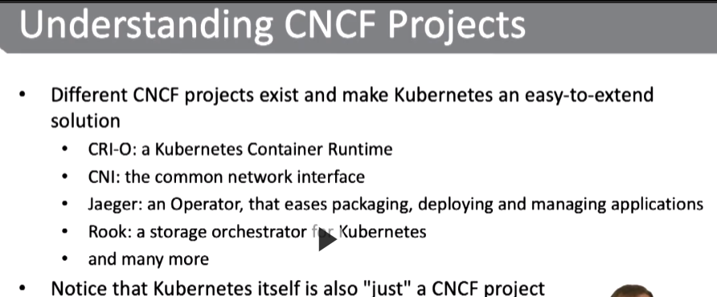
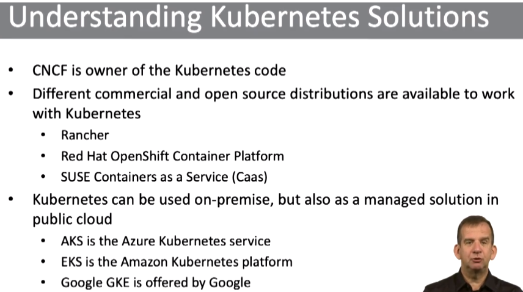
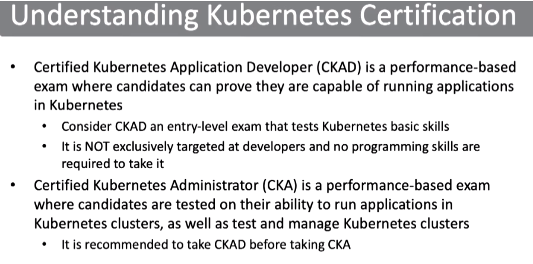
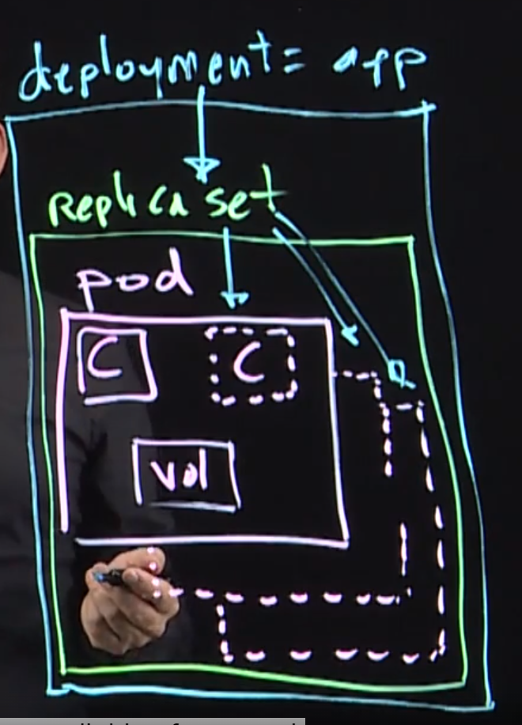

Проект Kubernates
-----------------

Установка Kubernetes
--------------------

Я устанавливал используя утилиту kind

curl -Lo ./kind https://kind.sigs.k8s.io/dl/v0.10.0/kind-linux-amd64

    2  chmod +x ./kind

    3  echo $PATH

    4  sudo mv ./kind /usr/local/bin/kind

    5  kind

    6  kind create cluster

    7  sudo snap install docker

    8  kind create cluster

Подключиться получается только из под root. Пока детальное решение не искал

### Получение справки

Kubectl -h

Получение справки по команде

Kubetl command -h

### Получение информации о созданных объектах

kubectl get all

Видим 1 деплоймент, который управляет одним репласетом, в котором 2 поды.

Можно посмотреть только поды

kubectl get pods

Расширенная информация

kubectl get all -o wide (также пример kubectl get pods -o wide)

### Создание объектов

Получить справку kubectl create deployment -h

Создать деплоймент

kubectl create deployment cmd-nginx --image=nginx

Создание объект , описание которого находится в yml файле

kubectl create -f my_file.yml

Удаление объекта

Kubectl delete -f my_file.yml

### Получение логов

Зная имя поды можно получить логи с поды.

kubectl logs &lt;pod_name&gt;

