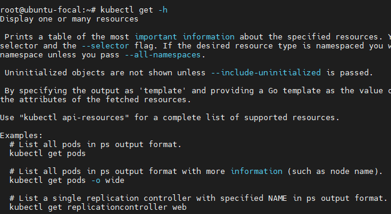
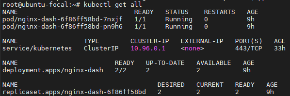
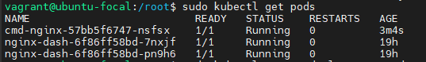
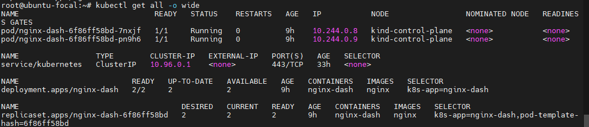
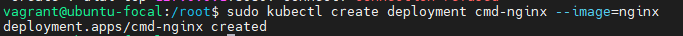
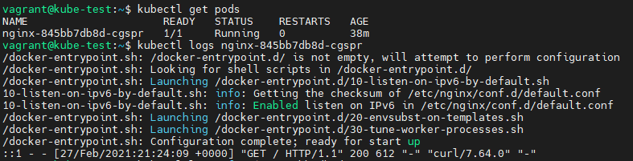

# Содержание
- [Содержание](#содержание)
- [Установка Kubernetes](#установка-kubernetes)
  - [Утилита kind](#утилита-kind)
- [Получение справки](#получение-справки)
  - [Справка о командах](#справка-о-командах)
  - [Получение информации о созданных объектах](#получение-информации-о-созданных-объектах)
- [Создание и удаление объектов](#создание-и-удаление-объектов)
- [Получение логов](#получение-логов)


# Установка Kubernetes

## Утилита kind

```bash
curl -Lo ./kind https://kind.sigs.k8s.io/dl/v0.10.0/kind-linux-amd64
chmod +x ./kind
echo $PATH
sudo mv ./kind /usr/local/bin/kind
kind
kind create cluster
sudo snap install docker
kind create cluster
```

Подключиться получается только из под `root`. 

# Получение справки

## Справка о командах
```
Kubectl -h
```

Получение справки по команде
```
kubectl command -h
```



## Получение информации о созданных объектах

```
kubectl get all
```



- Видим 1 deployment, который управляет одним replica set, в котором 2 поды.

Посмотреть все поды
```
kubectl get pods
```


Расширенная информация
```
kubectl get all -o wide 
kubectl get pods -o wide
```


# Создание и удаление объектов

Получить справку 
```
kubectl create deployment -h
```

Создать деплоймент
```
kubectl create deployment cmd-nginx --image=nginx
```




Создание объекта , описание которого находится в yml файле
```
kubectl create -f my_file.yml
```

Удаление объекта
```
Kubectl delete -f my_file.yml
```

# Получение логов

Зная имя поды можно получить логи с поды.
```
kubectl logs pod_name
```

