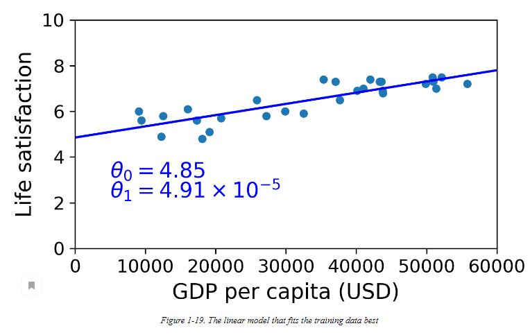

# Table of contents

- [Table of contents](#table-of-contents)
- [Examples](#examples)
- [Классы систем](#классы-систем)
  - [Классификация систем с точки зрения контроля](#классификация-систем-с-точки-зрения-контроля)
  - [Классификация с точки зрения возможности учиться онлайн](#классификация-с-точки-зрения-возможности-учиться-онлайн)
  - [Классификация с точки зрения обобщения](#классификация-с-точки-зрения-обобщения)
- [Трудности ML](#трудности-ml)

A computer program is said to learn from experience E with respect to some task T and some performance measure P, if its performance on T, as measured by P, improves with experience E.

Tom Mitchell, 1997

# Examples

The first ML application that really became mainstream, improving the lives of hundreds of millions of people, took over the world back in the 1990s: the spam filter.

Анализ изображений продуктов на производственной линии для их автоматической классификации

Это классификация изображений, обычно выполняемая с использованием сверточных нейронных сетей (CNN; см. Главу 14).

Обнаружение опухолей при сканировании мозга

Это семантическая сегментация, при которой каждый пиксель изображения классифицируется (поскольку мы хотим определить точное местоположение и форму опухолей), обычно также с использованием CNN.

Автоматическая классификация новостных статей

Это обработка естественного языка (NLP), а точнее классификация текста, с которой можно справиться с помощью рекуррентных нейронных сетей (RNN), CNN или трансформаторов (см. Главу 16).

Автоматическая отметка оскорбительных комментариев на дискуссионных форумах

Это тоже классификация текста с использованием тех же инструментов НЛП.

Автоматическое суммирование длинных документов

Это ветвь НЛП, называемая резюмированием текста, опять же с использованием тех же инструментов.

Создание чат-бота или личного помощника

Это включает в себя множество компонентов НЛП, включая модули понимания естественного языка (NLU) и вопросы ответов.

Прогнозирование доходов вашей компании на следующий год на основе многих показателей эффективности

Это задача регрессии (т. Е. Прогнозирование значений), которая может быть решена с использованием любой модели регрессии, такой как модель линейной регрессии или полиномиальной регрессии (см. Главу 4), SVM регрессии (см. Главу 5), случайный лес регрессии (см. Глава 7) или искусственная нейронная сеть (см. Главу 10). Если вы хотите принять во внимание последовательность прошлых показателей производительности, вы можете использовать RNN, CNN или трансформаторы (см. Главы 15 и 16).

Как заставить ваше приложение реагировать на голосовые команды

Это распознавание речи, которое требует обработки аудиосэмплов: поскольку они представляют собой длинные и сложные последовательности, они обычно обрабатываются с использованием RNN, CNN или преобразователей (см. Главы 15 и 16).

Обнаружение мошенничества с кредитными картами

Это обнаружение аномалии 

Сегментирование клиентов на основе их покупок, чтобы вы могли разработать свою маркетинговую стратегию для каждого сегмента.

Это кластеризация 

Представление сложного многомерного набора данных на четкой и понятной диаграмме

Это визуализация данных, часто использующая методы уменьшения размерности 

Рекомендация продукта, который может заинтересовать клиента, на основании прошлых покупок.

Это рекомендательная система. Один из подходов \- передать прошлые покупки (и другую информацию о клиенте) в искусственную нейронную сеть (см. Главу 10) и заставить ее выводить наиболее вероятную следующую покупку. Эта нейронная сеть обычно обучается на прошлых последовательностях покупок всех клиентов.

Создание интеллектуального бота для игры

Это часто решается с помощью обучения с подкреплением (RL; см. Главу 18), которое является ветвью машинного обучения, которое обучает агентов (например, ботов) выбирать действия, которые со временем увеличивают их вознаграждение (например, бот может получить вознаграждение. каждый раз, когда игрок теряет несколько очков жизни) в заданной среде (например, в игре). Знаменитая программа AlphaGo, победившая чемпиона мира по игре в го, была построена с использованием RL.

# Классы систем

## Классификация систем с точки зрения контроля

Контролируемое обучение  (supervised learning):

Система в наборе для обучения получает набор данных с метками. Например  спам и полезные письма. Таки задачи называют задачами классификации.

Еще пример. Система, которая должна определить цену автомобиля в зависимости от параметров  (predictors) (пробег, год выпуска) . В систему загружаются наборы данных с ценами. Т.е метка это цена. Такие задачи называются регрессионными.

Регрессионный алгоритмы, например Логистическая регрессия, используются и для задач классификации. Ее цель дать некое число, которое можно расценивать как вероятность попадания в определенный класс классификаци \- например 20% что письмо это спам.

Наиболее важные контроллируемые алгоритмы

* k-Nearest Neighbors
* Linear Regression
* Logistic Regression
* Support Vector Machines (SVMs)
* Decision Trees and Random Forests
* Neural networks[2](https://www.google.com/url?q=https://learning.oreilly.com/library/view/hands-on-machine-learning/9781492032632/ch01.html%23idm45022180537464&sa=D&source=editors&ust=1676218551378387&usg=AOvVaw27dSi4-PDHsOIcuQcsSbZy)

Неконтролируемое обучение (unsupervised learning)

Набор данных для обучения не размечен метками, т.е без преподавателя.

Пример 1 : проанализировать пользователей сайт. Применив иерархические кластерные алгоритмы можно например понять, что 40 процентов это люди определенного пола с определенными интересами (например, любители комиксов), которые заходят по вечерам, а другая группа это 20% которорые любят фантаситку и заходят по выходным. Зная эту статистистику можно лучше писать посты для каждой из целевых групп.

Также можно сводить данные, которые имеют множество свойств к данным, которые имеют меньше свойств, путем объединения свойств, которые сильно коррелируют между собой: например пробег машины и ее возраст. После такого преобразования можно использовать контролируемое обучение, которое будет работать с меньшим объемом информации и использовать меньше ресурсов для хранения.

        Также применение в поиске аномалий Anomaly detection в данных и в поиске новых данных.

        Также применение в поисках связей между данными. Association rule learning. Например анализируя набор покупок, можно обнаружить наборы продктов, которые покупают часто вместе, тогда разумно их ставить неподалеку.

Наиболее важные алгоритмы:

* Clustering

* K-Means
* DBSCAN
* Hierarchical Cluster Analysis (HCA)

* Anomaly detection and novelty detection

* One-class SVM
* Isolation Forest

* Visualization and dimensionality reduction

* Principal Component Analysis (PCA)
* Kernel PCA
* Locally Linear Embedding (LLE)
* t-Distributed Stochastic Neighbor Embedding (t-SNE)

* Association rule learning

* Apriori
* Eclat

Частично-контролируемое обучение (semisupervised learning )

Иногда размечены только некоторые данные, а в основном это неразмеченные данные.

Обычно являются комбинацией контролируемого и неконтролируемого. Например, загружаем много фотографий семьи. Кластеризация определяет по лицам одного и того же человека на многих фотографиях. Потом указав имя на одной фотографии, можно разметить все остальные фотографии этого человека и упростить поиск фотографий.

Пример: deep belief networks (DBNs)

Обучение с подтверждением (REINFORCEMENT LEARNING):

Система обозревает возможные варианты и выбирает действие. Делает действие и в результате получает либо награду, либо наказание. Далее возвращается на исходную точку и анализирует действие. Выбирает действие с большими наградами.

Пример. Часто роботы учаться управлять ходить именно таким способом. Также система Alpha Go выиграла чемпиона мира по шахматам в 2017 году, проанализировав множество шахматных партий, а также обучаясь на игре с самой собой. Награду приносят выигрышные шахматные партии.

## Классификация с точки зрения возможности учиться онлайн

Системы обучения offline (batching learning)

Обучаем системе на миссиве данных, а потом запускаем на реальных данных. Для обновления переобучаем систему на новых данных \+ старые и получаем новую версию. Часто требует значительных вычислительных мощностей.

Системы, обучающиемся в режиме реального времени (Online learning)

Получаем новые данные и постоянно переобучаемся. Более адаптивные алгоритмы. Постепенное обучение. Т.к данные часто не требуется для хранения, можно их просто выбрасывать после обработки.

 Сложность в определении глубины хранения данных. Если она будет небольшой, система будет быстрее реагировать на изменения, но быстро забывать старые данные. Если хранить долго, то новые изменения будут с задержкой оказываеть влияния на работу.

        Плохие данные могут испортить алгоритм, поэтому важное включать одновременно алгоритмы определяющие аномалии и если аномалий много обучение выключать и уметь чистить и восстанавливать систему на определенный момент времени.

## Классификация с точки зрения обобщения

Instance based learning.

При получении новых данных, система сравнивает с уже имеющимися помеченными данными, либо определяет степень похожести на них и определяет класс.

Model-based learning

Для описания системы выбираем модель, данее подбираем под нее параметры. И новые данные получаем из графика. В простейшем случае \- это линейная регрессия.

# Трудности ML

Либо плохие(недостаточные) данные, либо плохая модель процесса.

Даже простые алгоритмы работают хорошо, когда данных очень много.

Непепрезентативные данные.

Вот что будет если добавить несколько стран. Модель совсем ломается.

Пример нерепрезантивных данных. В выборах 36 года журнал Literary Digest отправил 10 миллионов писем изберателям и прогнозировал победу одного из кандидатов, но не учел что получатели этих писем были в основном состоятельные люди.

Часто специалисты по данным много время тратить на очистку данных для training set. Выбрасывают аномалии. Или решают проблемы в роде таких 5 процентов пользователй не указали свой возраст, следует ли отбросить эти данные или установить возраст как медианное значение или построить модель, где учитываются эти данные, а другую без них.

Слишком сильная подгонка модели под существующие данные.

Совет \- держать модели простыми. Чем меньше степеней свободы (переменных) \- тем лучше. Процесс ограничения модели называется регулиризацией.

Используется гиперпараметр регуляризации. Это параметр алгоритма обучения, но не модели. Чем больше этот параметр тем меньше будет будет подгонки данных под модель.

Слишком простая модель тоже может являться проблемой. Жизнь часто сложнее чем линейная функция. Поэтому не следует излишне упрощать модель. Также можно снизить гиперпараметр регуляризации.

Т.к проверка на реальных данных может привести к плохим последствиям, модель тестируют иначе. Все данные доступные в момент обучения, разделяют на две части. Training set на котором обучают модель. И test set , на котором проверяют модель и оценивают generalization error. Если модель хорошо показывает себя на training set , но generalization error высока на test set это означает, что модель слишком подогнана на тестовые данные.

Обычно 80% данных используется для обучения, а 20% - для тестирования. Однако это зависит от размера набора данных: если он содержит 10 миллионов экземпляров, то удержание 1% означает, что ваш тестовый набор будет содержать 100 000 экземпляров, что, вероятно, более чем достаточно, чтобы получить хорошую оценку ошибки обобщения.

Подход похитрее. Мы выбрали модель, но подбираем гипер параметр регуляризации. Если мы будем использовать 100 параметров на едином training set, получим в итоге лучший вариант подогнанный под этот set. Для уменьшения данного риска training set деляет на 2 части. Собственно training set и validation set. Выбирают лучшую модель на training set, далее прибавляют к набору данных validation set и получают результирующую модель. Далее проверяют на test set уже ошибки генерализации.