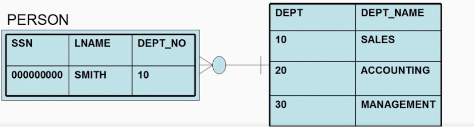
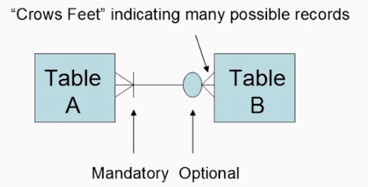
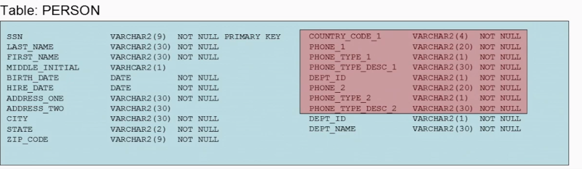
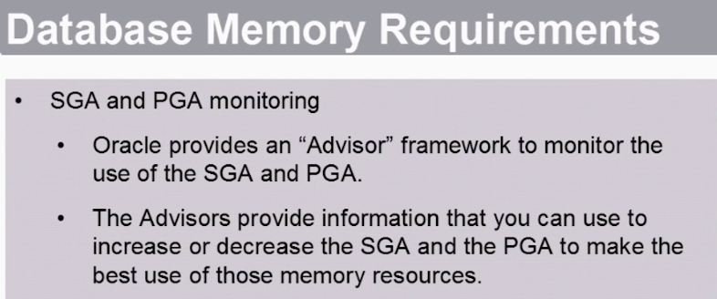
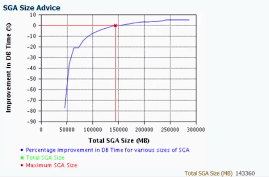

# Table of contents

- [Table of contents](#table-of-contents)
- [Useful links](#useful-links)
- [Usefual commands](#usefual-commands)
- [Relational db foundation](#relational-db-foundation)
  - [ACID](#acid)
  - [Tables](#tables)
- [Data types](#data-types)
  - [NUMBER](#number)
  - [DATE](#date)
  - [CHAR](#char)
  - [VARCHAR 2](#varchar-2)
- [Contraints](#contraints)
  - [Check constraint example](#check-constraint-example)
- [Create table model (ERD)](#create-table-model-erd)
  - [Anylize of model](#anylize-of-model)
  - [Example of analysis](#example-of-analysis)
  - [NULL values](#null-values)
  - [Create table in Oracle Data Modeller](#create-table-in-oracle-data-modeller)
  - [Primary key. Natural and surrogate keys.](#primary-key-natural-and-surrogate-keys)
  - [Relationships in ERD](#relationships-in-erd)
    - [One-to-one](#one-to-one)
    - [One-to-many](#one-to-many)
    - [Many-to-many](#many-to-many)
    - [Foreign ключи](#foreign-ключи)
- [Normalization](#normalization)
  - [Process of normalization](#process-of-normalization)
  - [Pros vs cons](#pros-vs-cons)
  - [1NF (First normal form - Entity atomicity)](#1nf-first-normal-form---entity-atomicity)
  - [Second normal form (dependency columns from primary key)](#second-normal-form-dependency-columns-from-primary-key)
  - [Third normal form (columns depend only on the primary key, but not on others)](#third-normal-form-columns-depend-only-on-the-primary-key-but-not-on-others)
- [What is inside the Oracle](#what-is-inside-the-oracle)
  - [Oracle Database Instance](#oracle-database-instance)
    - [SGA](#sga)
      - [Database Buffer Cache](#database-buffer-cache)
      - [Shared Pool](#shared-pool)
    - [Oracle Database Instance background processes](#oracle-database-instance-background-processes)
  - [Analyzing an Existing Oracle Instance](#analyzing-an-existing-oracle-instance)
    - [Database Location](#database-location)
    - [How to know ORACLE\_SID](#how-to-know-oracle_sid)
    - [Important files](#important-files)
- [Oracle instalation](#oracle-instalation)
  - [Installation Features](#installation-features)
  - [Environment variables](#environment-variables)
  - [Installer](#installer)
- [Uninstall Oracle](#uninstall-oracle)
- [OFA Oracle Flexible Architecture](#ofa-oracle-flexible-architecture)
- [Resource planning](#resource-planning)
  - [DBCA (Oracle Database Configuration Assistant)](#dbca-oracle-database-configuration-assistant)
  - [Capasity Planning](#capasity-planning)
  - [OLTP or OLAP and RAC](#oltp-or-olap-and-rac)
  - [Physical Storage Requirements](#physical-storage-requirements)
  - [Database Memory requirements](#database-memory-requirements)
      - [Создание базы данных через DBCA](#создание-базы-данных-через-dbca)
      - [Администрирования control files и redo logs](#администрирования-control-files-и-redo-logs)
      - [Redo logs](#redo-logs)


# Useful links

[Virtual Machine for Virtual Box  with Oracle 19](https://www.google.com/url?q=https://www.oracle.com/database/technologies/databaseappdev-vm.html&sa=D&source=editors&ust=1674949804304876&usg=AOvVaw2iaL0hD0EL7hZUdHVdkFIf)

# Usefual commands

Просмотр описания таблицы или view
```sql
desc table_name 
```


# Relational db foundation

What is a relational database?
- A collection of "things" (entities)
- Tables provide a way of storing information about entities
- Rows indicate a unique entity
- Columns describ attributes related to an antity


- Provides a way to define rules that exist for the entities (tables) and their attributes (columns) we are storing in database (constraints)
- Provides a way of defining how different things are related (foreign keys)
  


## ACID
A relational database adheres to the principles of ACID:
- (A)tomicity - Each transaction is all or nothing
- (C)onsistency - Each transaction will be valid according to all defined rules (contraints, cascades, triggers and so on)
- (I)solation - No dirty reads. Results of concurrent transactions are as if the transactions were run serially.
- (D)urability - Once a commit occurs the database ensures that it has been stored permanently and is recoverable in the event of failure

## Tables
Data is organized into tables.
- Each table has rows and columns
- One or more columns in each row makes that row unique. This is known as the tables's `primary key`
- The general convention when naming a table is to use the singular form (driver vs. drivers)
- Another general convention is to upper case the table name as well as the names of all of the columns
- The primary key is always unique
- A column can be empty (NULL)
- The data in the table in not sorted
  


# Data types

## NUMBER

- Non-integer datatype used to store positive, negative numbers with a default precision of up to 38 digits total
- Optionally define precision and scale when defining a number
  - Precision and scale provide additional integrity checking
  - Precision - up to 38 digits
    - For example, precision of 4 is 1234. Precision of 6 is 123456
  - Scale - Number of digits after the decimal point. Part of the total precision
    - For example, precisition of 4 and scale of 2 is `12.35`. `1234.56` would cause an error.


## DATE

- Integrity checking on stored dates. No invalid leap years or 09/31/2015 dates will be stored in your database
- A single data type can store a date/time that can be displayed using any number of formats.
    - `01-JAN-2015 01:00:00`
    - `01/01/2015`
    - `1/1/2015 21:30:00`
    - `1/1/15 09:30:00`
- Support is provided for
  - Daylight savings
  - Different time zone offsets
  - Date/Time arithmetic. For example: `1/31/2015 - 1/1/2015 = 30 days`

## CHAR 
- Fixed length storage of character values
- `CHAR` data type can stope up to 2000 bytes of character data
- `CHAR(10)` can store up to 10 characters. However each entry will require the same amount of storage (generally 10 bytes for a `CHAR(10) but there are exceptions) for any of these values
  - CAR
  - CART
  - CARTWHEELS
- A lot of wasted space 

## VARCHAR 2

- Variable length storate of character values
- In Oracle Database 12c a VARCHAR2 can store either:
  - 4000 characters by default
  - 32737 characters if extended data types are enabled
- There is no overhead for a `VARCHAR2`. An emptry `VARCHAR2` data type consumes no storage
- Generally you should use `VARCHAR2` datatypes instead of `CHAR`

# Contraints

Relational database constraints:
- Datatypes
- Check (check business rules while inserting data)
- Primary key. Created index for this.
- Unique (differ from primary key in that it can be null value in the column). Created index for this.
- Foreign key

## Check constraint example

- Create table and show it
```sql
create table demo_table
(
    primary_row_id      number      primary key,
    date_row_created    date,
    some_comment        varchar2(30)
);

desc demo_table
```


- Add check constraint to check date after than 1900 year
```sql
alter table demo_table add constraint ck_not_to_old check (date_row_created > to_date('01-01-1900', 'mm/dd/yyyy'));
```


- try to insert wrong row

```sql
insert into demo_table values (1, to_date('01-01-1800', 'mm/dd/yyyy'), 'test2');
```


# Create table model (ERD)

## Anylize of model 

- Before we actually create a model, we need to perform some analysis and understand the data we are modeling
- Generally this is done with various stakeholders - people who understand the business, developers, managers who understand the data you are modeling and how it will be used
- This process is an iterative process and can take some time
- The model will start taking form as this analysis is done

The Entity Relationship (ER) Diagram (ERD)
- The ERD is a "picture" of the physical model of the database
- When you model a database you will do so by creating an ER diagram for the database

ERD provides details on
- individual tables, columns and column definitions
- Constraint definitions
- Relationships between tables

## Example of analysis

- Create in Oracle Data Modeller first table and called it PERSON (not PEOPLE)
- Oracle support lower or mixed case, but uppercase is the accepted standart

- The column and its name should represent a single atomic data element stored in the column. Don't combine city, state and zip code in one column.
- Carefully consider data type and lengths. Don't store dates in VARCHAR2 for example.
- Understand the business rules related to the table columns. These translate into column constraints. 
  - Valid language related characters
  - Standardized formats (Upper case?)
  - Valid data range (minimum or maximum data ranges?)
  - Security (Encryption/PCI?)

Our example:
- `LAST_NAME` and `FIRST_NAME`
  - Init-capped name is required
  - Required in each record
  - `VARCHAR2(30)`
- `MIDDLE_NAME`
  - The business rule calls for it to be a single capitalized initial
  - The middle name is optional
  - we will rename the column to `MIDDLE_INITIAL` to more properly describe the data it contains
  - `VARCHAR2(1)`
- `BIRTH_DATE`
  - Entered can not be over 100 years ago
- `SSN`
  - Unique
  - will not be stored with dashes or any other kind of delimiter
  - Each SSN must be 9 characters in length
  - No mathematical calculations on SSN's will be needed
- `ZIP_CODE`
  - We will change the name of the `POSTAL_CODE`
  - Because the `POSTAL_CODE` in many countries is not always numeric, we will make the `POSTAL_CODE` column a varchar2(10) column

##  NULL values

- NULL usuallly represents an unknown or undetermined state
- When designing tables you need to consider if a column should be allowed to be NULL or not. 
- If the column MUST contain data then it should be defined as `NOT NULL`
- If the column MIGHT contain data then it should not be defined as `NOT NULL`
- In cases where the business rules do not require the column to contain data then it should not be defined as `NOT NULL`
- By default, a column in a table can contain NULL values
- Make a column `NOT NULL` when you create the table or you can alter an existing column to be NOT NULL as long as it does not contain any NULL values
- A column that is going to be part of a primary key (for example SSN) is always going to be `NOT NULL`
  
  You can define columns as `NOT NULL` or `NULL` when:
    - You initially create a table
    - You use the `alter table` command to modify the column
    - Add a column to a table with the `alter table` command

## Create table in Oracle Data Modeller


- ERD in Oracle Data Modeller


## Primary key. Natural and surrogate keys.


- in our `PERSON` table we used the SSN in the row to identify each row uniquely
- In reality the SSN is what is known as a surrogate key
  - It is a number generated by the government that is supposed to be unique for each person
  - However, there is nothing about the number that forses it to be unique
- If we had a way to store the entire DNA of a person then that wouild represent a natual key
  - A natural key is a column or combination of columns that uniquely identifies a row in a natural way
  - For example, latitude and longtitude might be sufficient to uniquely identify a given building in a table that contains building information.

## Relationships in ERD

### One-to-one

- One record in table A will have zero or one record in table B
- One record in table B **must** have one record in table A


### One-to-many

- One record in the A table must have one record in the B table
- One record in the B table will have zero, one or many records in A table



### Many-to-many

- One record in table A will have zero, one or many records in table B
- One record in table B must have one or more records in table A




This shows that if we enter an entry in the departments, then 0 or more employee objects can refer to it. But when entering an employee in the table of employees, there must be one or more records in the departments.

In such cases, a associative table is often introduced


### Foreign ключи


If we insert an employee with a department that is not in the department table, then there will be an insert error


# Normalization

## Process of normalization

- Normalizing a database model typically involves developing the model so that it is in what is called third mormal form (3NF)
- Normalizing a database model is a progressive process starting with first normal form and progressing from there (1NF, 2NF, 3NF)
- Each level of normalization requires the completion of the previous level of normalization
  
## Pros vs cons
Benefits of normalization:
- Reduction in overall logical and physical IO
- Reduction in data duplication/redundancy
- Data anomalies related to data modification less likely to occur
- Reduction in overall storage required
- Indexes tend to be smaller and therefore provide faster access

Negatives of normalization:
- A 3NF model can require more joins in a SQL statement making the SQL statement longer and potentially more complex
- In some rare cases a de-normalized table can perform better. More often than not in cases like this some basic SQL tuning - rather than de-normalizing the model - is the best solution.

## 1NF (First normal form - Entity atomicity)

- Data stored in each column of the table is "atomic" in value
- If a table has more than one entities information in it you separate that information into individual tables for each entity

Example: 
- Let's look at this table
  


- Here you can see that the phone is included in its entirety. But inside the phone there is an area code that will be repeated in many phone numbers. There is always a dilemma how deep to split the data. Here you need to look at the business requirements. If it is possible to imagine a case where the data is needed for analysis, the data should be normalized. In this case, create a separate field for the  country code. This creates the 1st normal form. Each column should reflect a separate property (attribute) of the entity.


- 1NF also prohibits repeating groups. 
- What if we wanted to have more than one phone number in our table?
- If we add more phone number like this, we violate 1NF because adding another phone number would create a repeating group
  


- To avoid this problem we will break the phone number information into its own table
  - Note that we also created a SSN column in the new PHONE table. This maintains the relationship between the person and their phone number
  - The combination of the SSN and the PNONE_TYPE are the pK of the PHONE table


  

## Second normal form (dependency columns from primary key)

- In 2NF all non-key columns must depends on the whole primary key to uniquely identify them
- The non-key columns must depend on the entire primary key in the case of a multiple column primary key
- As we did our analysis we discovered that a person might have certifications we want to track

Example:
- to track these we added certification table
- To track who they were certified by we added the certifier table


- Check if all columns depend on the primary key. This is a test for the second normalized form. There are problems here. In tables with `co_code` certification is part of the primary key. A person cannot have several certificates issued by one company.
- The company URL is independent of all primary key fields. It is logical to move it to the cert_company table.


## Third normal form (columns depend only on the primary key, but not on others)

- Moving data that is not solely dependent on a tables primary key into its own table
- If a column could change in a table because of a change to any non-primary key column in that table then that is a violation of 3NF. This is called a transient dependency
- Columns should only depend on the primary key. If, when changing one column, we must edit others, then we have a transitive dependency.

Example:
- The `PHONE_TYPE_DESC` column is not dependenent on the entire primary of `PHONE`
- It is only dependent on the `PHONE_TYPE` column
- Because of this we need to create another table to deal with `PHONE_TYPE`


# What is inside the Oracle 

- Oracle Database is a Relational Database Management System (RDBMS)
- There are two main parts to an Oracle Database
  - the Oracle Database instance
  - The Oracle database

## Oracle Database Instance

- Oracle database instance is a program - an operating system process that allows the database to work.
- Consisted of Processes/Threads/Services
- Instance is identified by its unique SID. 
- To connect to the Oracle database we have to know what `SID` we want to connect to

### SGA  
- Memory - Called the `SGA` (System Global Area) - memory area allocated at the start of the instance.
- The `SGA` is subdevided into smaller pools of memory
  -  Shared Pool
  -  Database Buffer Cache
  -  Relo Log Buffer
- The larger the SGA, the longer the objects are stored in memory. This greatly affects performance. If the data is not in the Buffer Cache, loading it there is expensive and time consuming.


#### Database Buffer Cache

- Dynamic storage of database data
- Data moves from disk to memory and back to disk
- Individual blocks of memory of the same size
- Size o the memory buffers is based on the DB block size
- DB Block size is defined when the database is created
- The size of blocks in RAM is the same as on disk.
- In Buffer Cache, client processes put data from disk.
- From Buffer Cache writes to disk process DBWR (Database Writer)


#### Shared Pool 

consists of several memory areas:
- **Shared SQL Area**. Responsible for executing SQL statements. When a client process starts sql Oracle puts this statement in the shared sql area. When an expression is no longer called frequently, Oracle removes it from the Shared SQL Area
- **Data Dictionary Cache**. Oracle system tables are loaded here


### Oracle Database Instance background processes

- Over 46 Linux processes in Oracle Database 12c when it's just idle, doing nothing
- Each of them has its own `PGA` memory area.
- If the base is loaded then there are much more processes.

The most important from them:
- **ARCH** - Archive Process
- **CKPT** - Checkpoint Process
- **DBWn** - Database Writer Process
- **LGWR** - Log Writer Process
- **PMON** - Process Monitor Process
- **SMON** - System Monitor Process 
- **Client Processes**
---

- If one of the 6 processes stops, it will most likely crash the database
- Client processes are created when a client session is opened.

## Analyzing an Existing Oracle Instance

### Database Location

- It is important to be able to look at the `ORACLE_HOME` environment variable in order to understand where the database is installed on the server.
- However, in the virtual machine examples from Oracle, the base can be installed here `/u01/app/oracle/product/version/db_1`


Важные файлы тут в каталоге `dbs`


### How to know ORACLE_SID

```
env | grep ORACLE_SID
```


All SIDs have a file ending with cdb. It is managed by oracle, but it can be opened and partially read by cat.


### Important files

- Instance and database parameter settings are set in the database parameter file
- The database parameter file is required to start the instance and then open the database
- Two kind of parameter files:
  - **SPFILE** - Automatically maintained by Oracle
  - **init.ora** - Manually managed parameter file. For example, the size of SGA.

# Oracle instalation

## Installation Features

- When allocating RAM, more attention is paid to memory for the database (SGA), but not for the memory of Oracle processes (PGA), which can significantly affect its operation.
- When allocating processor time, they devote most of the work to Oracle processes, but forget to leave a margin for client processes
- It is recommended that you allocate at least 4 times the amount of disk space plus 25 percent after determining future needs. 3 for the three versions of Oracle that can be shipped. 1 for a large patch, because the patch often takes the same as the oracle distribution and 25 percent for the logs of small patches
- It is not recommended to install Oracle on the root filesystem. There must be a separate partition and you cannot add oracle files to the root system, so that in any case the server does not crash. If Oracle fills up all the memory.

## Environment variables

- `ORACLE_BASE` directory where all software from oracle is installed. For example `/u01/app/oracle`


- `ORACLE_HOME` - directory where Oracle Database is installed. According to the OMF standard, it is located inside `ORACLE_BASE`
For example `$ORACLE_BASE/product/12.1.0.2`  `$ORACLE_BASE/product/11.2.0.3`


## Installer

- After downloading the file, you need to unzip the archives into a single folder under the root user


- See `runInstaller` script
- Give access rights for oracle user 


- Launch `runinstaller`

# Uninstall Oracle

В папке `$ORACLE_HOME/deinstall` есть файл `deinstall`


# OFA Oracle Flexible Architecture

For database file placement the DBCA will use the Oracle Flexible Architecture (OFA) standart by default. OFA provides a standart that allows you to:
- Locate more than on set of Oracle Database software on a given server. Several databases.
- Standardized placement of database related files on the database server

Base file systems:
- `/u01` - Oracle software
- `/u02` - Oracle Diagnostic files
- `/u03` - Oracle files
- `/u04` - Oracle files

# Resource planning

Tasks to accomplish before you start creating an Oracle database:
- Understand the Oracle Database Configuration Assistant (DBCA) 
- Perform capacity planning
- Determine which databse options that will be required
- Determine your physical storage requirements
- Determine the database memory requirements

## DBCA (Oracle Database Configuration Assistant)

Database configuration assistance - a tool for creating a database. (not installation)

Most Oracle databases will be created using the DBCA. The DBCA will interview you asking questions about how you want to configure your database. It will then create the database for you. The DBCA will prompt you for information that we need to collect before we start creating the database. 

When using DBCA Oracle will create the directories and database files so that they adhere to OFA standards 

## Capasity Planning

- Database capacity planning is the process of determining the production capacity needed by your database to meet both current and future demands for it's services
- Design capacity is the maximum amount of work that a database can complete in a given period

Things that influence capacity planning:
- CPU's
  - Speed
  - Quantity
  - Type
- Memory
- Storage
- Network
- Location/power/colling/etc
- Support/Spare avaliability
- Refresh schedule
- The application 

More things that influence capacity planning:
- Concurrency
- Growth/Change
- Service Level Agreement (SLA) with respect to
  - Performance
  - Backup and revovery requirements
  - High Availability requirements

Considerations when you are capacity planning:
- Number of databases you wish to run on the hardware
- Database options you want to support (ie Parallel Query)
- How representative of reality is the workload in your testing?

Additional capacity considerations:
- Type of database (OLTP, Data Warehouse, hybrid)
  - Nature of queries/transactions that will be run
  - Distribution of query types
  - Physical and logical database design requirements
- Third party tools to be used
- Security schema to be used

## OLTP or OLAP and RAC

- **OLTP** (online transaction processing) - normalized model. Application database.
- **OLAP** (Data Warehouse) - online analytic processing. Usually unnormalized data. Layer over different sources, including OLAP. Used to run analytical reports.
- **RAC**  Real Application Clusters. For high availablility

## Physical Storage Requirements
The database consists of different kinds of physical files:
- Database files
- Control files
- Redo log files
- Archived redo log files

The DBCA will ask you where you want to place these files and how big you want them

## Database Memory requirements

Memory areas you will need to plan for include
- SGA
  - Buffer Cache
  - Shared Pool
- PGA 

 Если на сервере предполагается только 1 база данных, выделяем памяти под нее не более 60 процентов.

PGA (Private Global Area). Каждая пользовательская сессия аллоцирует память в это области. Не только пользовательская, но и процессы Oracle. Размер памяти устанавливается в зависимости от ожидаемого количество пользовательских сессий у базы данных.


Существует два подхода (парадигмы) для установки памяти. AMM - тогда правим настройку MEMORY_TARGET . В этом случае оракл автоматически устанавливает размер SGA и PGA и может менять этот размер между этими областями по необходимости в рантайме, перераспределяя память.


или ASMM - тогда правим настройку SGA_TARGET.

Этой настройкой автоматически меняется только SGA. PGA не перераспределяется. PGA\_AGGRIGATE\_TARGET это целевое значение для PGA, но не строгое, база будет стремиться использовать его.


Также можно настраивать параметры памяти для отдельных областей SGA. Тут устанавливается минимально значение памяти для shared_pool внутри SGA. Он может быть увеличен, но не может быть меньше этой цифры.


Хотя и есть рекомендации ставить не более 60 процентов от памяти сервера, это достаточно условная цифра. Так, если на сервере размещена база в 500 МБ, выделять даже 1 ГБ оперативки для нее это излишнее выделения. Также и если база 200 ГБ, выделять 1 ТБ памяти это много. Также память зависит от активности использования базы -  более нагруженная база потребует большего SGA для выполнения заданной производительности. Также размер памяти зависит от требований к времени отклика (response time), если отклик должен быть минимальным, можно вообще все данные брать из памяти, это будет быстрее чем даше ssd диски.


С чего начать планировать ресурсы:

* Определить какое время будет существовать данные сервер до его замены. Например 3 года
* Определить размер данных в базе , который будет в конце этого срока.
* Поставить SGA 20% от этой цифры. Для начала.






#### Создание базы данных через DBCA

Через администратор можно пройти по нескольким шагам создать и создать базу данных. Нужен GUI

Посмотреть что Listener стартован

lsnrctl status


Пользователи


Схема = пользователь.

Можно давать гранты для доступа к оъектам других схем (пользователей)


Посмотреть пользователей .если зашли по system пользователем в Sql Developer


По-умолчанию у оракла есть тестовый пользователь scott


Сделать запрос от пользователя system в таблицу пользователя scott. Таблицы созданы scott и находятся в его схеме. Т.е если вы попытаетесь указать без схемы таблицу не найдем


SQL Developer подходит для разработки. Но для задач администрирования Oracle рекомендует использовать Oracle Enterprise Manager


При создании пользователю может быть присвоен tablespace - физическое место размещение его объектов. А также указать какую долю от tablespace могут занимать объекты этого пользователя, например весь tablespace, или вовсе запретить ему создавать объекты.

Также указывается профиль.


После создания пользователя у него нет никаких прав, даже на соединение с базой. Поэтому нужно выдать права, хотя бы на connect.


Удаление пользователя и всех его объектов


Изменение атрибутов пользователя


create user dba_one IDENTIFIED by password

default TABLESPACE users;


Выдадим грант на создание сессии


Теперь соединение проходит

Попробуем создать таблицу


Дадим пользователю роль dba , выдав грант


Как выяснилось и этого недостаточно. Нужно еще дать права на tablespace

alter user data_owner quota unlimited on users;

И потом уже можно создать таблицу


Полезные гранты

grantcreatetabletodata_owner;

grantcreateview, createprocedure, createsequencetodata_owner;

Поменять пароль


Удаляем пользователя


Словарь данных


Если указываем скоуп all. Значит видим все объекты, к которым имеем привилегии. Т.е объекты в собственной схеме + объекты в других схемах, на которые выданы гранты.


User видит объекты только в своей схеме.


* * *


⁹


Можно создавать таблицу с одинаковыми именами в разных схемах.


Селекты никогда не блокируются локами. Может быть кратковременный лок, когда oracle подгружает данные с диска, но это не тот блок, который может произойти между транзакциями.


#### Администрирования control files и redo logs


На стадии mount Oracle сравнивает SCN из control file и data file, если они совпадают, значит оракл может открыть базу данных, если нет - начинается процедура recovery


На стадии no_mount oracle открывает файл с параметрами parameters, поднимается oracle instance , аллоцируется память, запускаются процессы и считывает расположение control файлов.

Далее на стадии mount oracle находит эти ctl файлы и считывает их. После этого доступны вью V$.

Далее следует стадия open, где открывается дата-файлы.


#### Redo logs


До комита записи лога помещаются в область SGA redo log buffer. После коммита помещаются на диск. Именно это обеспечивает durablility в acid.

На диск могут попасть redo log и не закомиченных транзакций, например если вставляется множество данных и памяти в redo log buffer не хватает.


Если 3 зеркала redo logs после комита записывается в 3, но не синхронно. Синхронно (как я понимаю) только в 1.

Пример. Имеем две группы. В каждом 2 member ( можно думать о них как о файлах). Мемберы одинаковые в одной группе, просто зеркальные копии, их размер. Количество мемберов и их размеры в разных группах могут не совпадать


Размер redo logs важен. Если мы будем делать log switch из одной группы в другую, это будет существенно сказываться на производительности.


Установка Oracle на Lunux

Через графический интерфейс с пробросом X11

1.  См. Описание настройки проброса X11 в документе по Linux
2.  Поставить пакеты

sudo yum install xdpyinfo

sudo yum install xorg-x11-utils

Дать права на запуск пользователю. Это должен быть не root иначе не запуститься инсталлятор

sudo chown -R vagrant:vagrant *

sudo chown vagrant:vagrant ./oracle_distr/

3.  Экспортировать переменную окружения export CV\_ASSUME\_DISTID=OEL8.1
4.  Запустить инсталлер

