# Table of contents

- [Table of contents](#table-of-contents)
- [Useful links](#useful-links)
- [Usefual commands](#usefual-commands)
- [Relational db foundation](#relational-db-foundation)
  - [ACID](#acid)
  - [Tables](#tables)
- [Data types](#data-types)
  - [NUMBER](#number)
  - [DATE](#date)
    - [Contraints](#contraints)
    - [Создание модели таблицы (ERD)](#создание-модели-таблицы-erd)
    - [Концепция NULL значения в Oracle](#концепция-null-значения-в-oracle)
    - [Первичный ключ](#первичный-ключ)
    - [Натуральные и суррогатные первичные ключи](#натуральные-и-суррогатные-первичные-ключи)
    - [Нормализация](#нормализация)
      - [1-ая форма (Атомарность данных в колоноках)](#1-ая-форма-атомарность-данных-в-колоноках)
      - [Обозначение связей на ERD](#обозначение-связей-на-erd)
      - [Foreign ключи](#foreign-ключи)
      - [2-ая нормальная форма (зависимость колонок от первичного ключа)](#2-ая-нормальная-форма-зависимость-колонок-от-первичного-ключа)
      - [3-я форма (зависимость колонок только от первичного ключа, но не от других)](#3-я-форма-зависимость-колонок-только-от-первичного-ключа-но-не-от-других)
    - [Устройство Oracle](#устройство-oracle)
    - [Установка Oracle](#установка-oracle)
    - [Удаление Oracle](#удаление-oracle)
    - [Создание базы данных Oracle](#создание-базы-данных-oracle)
      - [Планирование мощностей](#планирование-мощностей)
      - [Создание базы данных через DBCA](#создание-базы-данных-через-dbca)
      - [Администрирования control files и redo logs](#администрирования-control-files-и-redo-logs)
      - [Redo logs](#redo-logs)


# Useful links

[Virtual Machine for Virtual Box  with Oracle 19](https://www.google.com/url?q=https://www.oracle.com/database/technologies/databaseappdev-vm.html&sa=D&source=editors&ust=1674949804304876&usg=AOvVaw2iaL0hD0EL7hZUdHVdkFIf)

# Usefual commands

Просмотр описания таблицы или view
```sql
desc table_name 
```


# Relational db foundation

What is a relational database?
- A collection of "things" (entities)
- Tables provide a way of storing information about entities
- Rows indicate a unique entity
- Columns describ attributes related to an antity

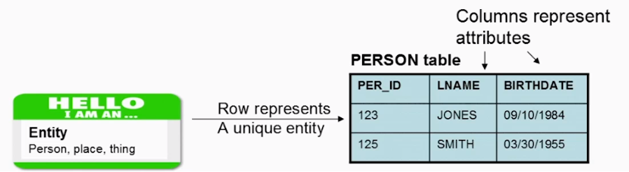

- Provides a way to define rules that exist for the entities (tables) and their attributes (columns) we are storing in database (constraints)
- Provides a way of defining how different things are related (foreign keys)
  
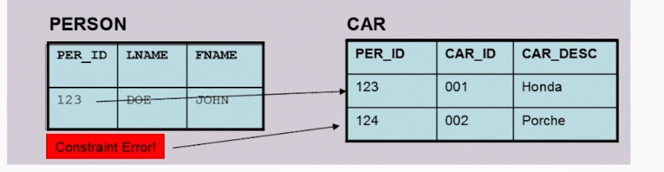

## ACID
A relational database adheres to the principles of ACID:
- (A)tomicity - Each transaction is all or nothing
- (C)onsistency - Each transaction will be valid according to all defined rules (contraints, cascades, triggers and so on)
- (I)solation - No dirty reads. Results of concurrent transactions are as if the transactions were run serially.
- (D)urability - Once a commit occurs the database ensures that it has been stored permanently and is recoverable in the event of failure

## Tables
Data is organized into tables.
- Each table has rows and columns
- One or more columns in each row makes that row unique. This is known as the tables's `primary key`
- The general convention when naming a table is to use the singular form (driver vs. drivers)
- Another general convention is to upper case the table name as well as the names of all of the columns
- The primary key is always unique
- A column can be empty (NULL)
- The data in the table in not sorted
  


# Data types

## NUMBER

- Non-integer datatype used to store positive, negative numbers with a default precision of up to 38 digits total
- Optionally define precision and scale when defining a number
  - Precision and scale provide additional integrity checking
  - Precision - up to 38 digits
    - For example, precision of 4 is 1234. Precision of 6 is 123456
  - Scale - Number of digits after the decimal point. Part of the total precision
    - For example, precisition of 4 and scale of 2 is `12.35`. `1234.56` would cause an error.


## DATE

- Integrity checking on stored dates. No invalid leap years or 09/31/2015 dates will be stored in your database
- A single data type can store a date/time that can be displayed using any number of formats.
    - `01-JAN-2015 01:00:00`
    - `01/01/2015`
    - `1/1/2015 21:30:00`
    - `1/1/15 09:30:00`
  
  


### Contraints

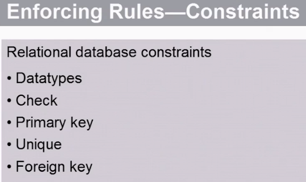

Check constraint - проверка бизнес правил при вставке записи.

Отличия unique constraint от primary key в том, что значение в колонке с unique constraint могут быть null значения.

И для unique и для primary key создается индекс.


Добавление check contraint


При вставке будем проверять, что дата не раньше чем 1900 год.


### Создание модели таблицы (ERD)


Можно создать модель базы данных в Oracle Data Modeller.


### Концепция NULL значения в Oracle


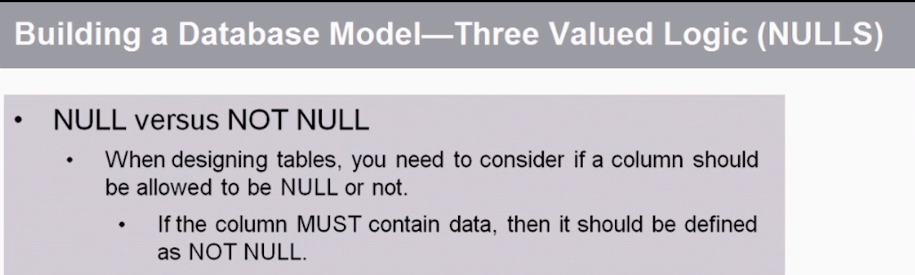


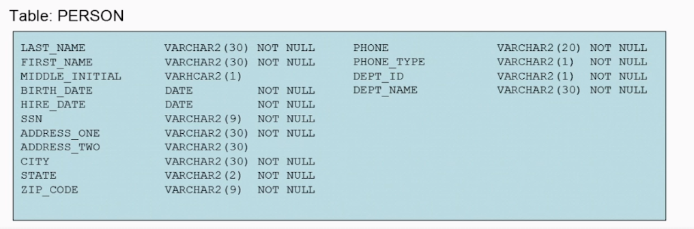

Повторим ERD в Oracle Data Modeller

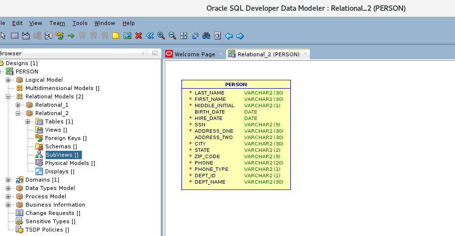

### Первичный ключ


### Натуральные и суррогатные первичные ключи


### Нормализация


#### 1-ая форма (Атомарность данных в колоноках)


Посмотрим на структуру таблицы


Тут видно, что телефон входит целиком. Но внутри телефона есть код города, который будет повторяться во многих телефонных номерах. Всегда стоит дилемма насколько глубоко дробить данные. Тут нужно смотреть на бизнес\-требования. Если возможно представить случай, когда данные понадобятся для анализа, следует данные нормализировать. В данном случае создать отдельное поле для кода \- города. Так создается 1-ая нормальная форма. Каждая колонка должна отражать отдельное свойство (атрибут) сущности (entity).


Что будет если нужно добавить несколько телефонных номеров


Тут есть проблема. Что если у человека может быть несколько телефонов одного типа. Т.к у нас в первичный ключ входит тип телефона в этой схеме это сделать нельзя.

#### Обозначение связей на ERD


Тут показано, что если вводим запись в депарартаменты, то на нее могут ссылаться 0 или более объектов работников. Но при вводе работника в таблицу работников, обязательно должны быть записи в департаментах одна или более.

В таких случаях часто вводят таблицу связку


#### Foreign ключи


Если добавляем работника с департаментом, которого нет в таблице департарментом, то будет ошибка вставки. Реализуем бизнес-требование.


#### 2-ая нормальная форма (зависимость колонок от первичного ключа)


Проверяем все ли колонки зависят от первичного ключа. Это проверка на вторую нормализованную форму. Тут проблемы.в таблицы с сертификация co_code входит в состав первичного ключа. Не может быть нескольких сертификатов у человека выданных одной компанией.

URL компании не зависит от всех полей первичного ключа. Логично вынести его в таблицу cert_company.


#### 3-я форма (зависимость колонок только от первичного ключа, но не от других)


Колонки должны зависеть только от первичного ключа. Если при изменении одной колонки мы должны править другие, значит у нас есть транзитивная зависимость.


### Устройство Oracle


Oracle database instance - это программа  - процесс операционной системы, которые позволяет работать базе данных работать.

SGA - область памяти, аллоцируемая при старте инстанса.

Может занимать от нескольких гигабайт до терабайт.


Разделена на более несколько пулов памяти.


Shared Pool

Database Buffer Cache

А также Redo Log Buffer и другие


Buffer Cache состоит из блоков фиксированного размера. Этот размер задается при создании базы данных. Т.е размер блоков в оперативной памяти такой же как и на диске.


В Buffer Cache клиентские процессы помещают данные с диска.

Из Buffer Cache записывает на диск процесс DBWR (Database Writer)

Shared Pool состоит из нескольких областей памяти.

Shared SQL Area. Отвечает за исполнение SQL выражений. Когда клиентский процесс запускает sql Oracle кладет это выражение в shared sql area. Когда выражение перестает часто вызываться Oracle убирает его зи Shared SQL Area

Также это Data Dictionary Cache. Сюда загружаются системные таблицы Oracle


Чем больше размер SGA тем дольше объекты сохраняются в памяти. Это сильно влияет на производительность. Если данные не находятся в Buffer Cache грузить их туда дорого и долго.


После старта инстанса, даже база ничего не делает, запущено более 46 процессов Linux. У каждого из них есть собственная область памяти PGA. Если база нагружена процессов намного больше.

Наиболее важные из них


Если один из 6 процессов остановится, скорее всего это приведет к поломке базы данных

Клиентские процессы создаются, когда открывается клиентская сессия.

Посмотрим параметры памяти:

show parameter memory


Важно уметь смотреть параметр ORACLE_HOME, чтобы понимать где установлена база данных на сервере.

env | grep ORACLE_SID


Обычно на расположение базы данных указывает переменная окружения ORACLE_HOME. Однако в примерах на виртуальных машинах от Oracle, база может быть установлена тут:

/u01/app/oracle/product/version/db_1


Важные файлы тут в каталоге dbs


Все SID имеют файл с окончанием cdb. Он управляется ораклом, но его можно открыть и частично прочитать cat.


В init.ora описываются параметры инстанса. Например размер SGA.

### Установка Oracle

При выделении оперативной памяти, больше внимание уделяют памяти для базы данных, но для памяти процессов Oracle, что может существенно влиять на его работу

При выделение процессорного времени большую часть уделяют работы процессов Oracle, но забывают оставить запас для клиентских процессов

Рекомендуется после определения будущих потребностей закладывать минимум в 4 раза больше плюс 25 процентов. 3 для трех версий Oracle , которые можно будет поставить. 1 для большого патча, т.к патч часто занимает также как и дистрибутив оракла и 25 процентов на логи маленькие патчи

Не рекомендуется ставить Oracle в root файловую систему. Должна быть отдельная партиция и нельзя добавлять файлы оракла в рутовую систему, чтобы в любом случае сервер не крашнулся. Если оракл забъет всю память.

ORACLE_BASE \- каталог куда остановлен весь софт от oracle


ORACLE\_HOME - каталог куда ставится Oracle Database. По стандарту OMF располагается внутри ORACLE\_BASE


После загрузки файла нужно разорхивировать архивы в единую папку под пользователем root


Увидим runInstaller

Дадим права на доступ пользователю oracle


Далее запустим runinstaller

### Удаление Oracle

В папке &ORACLE_HOME/deinstall есть файл deinstall


### Создание базы данных Oracle

#### Планирование мощностей


Тип OLTP (online transaction processing) - нормализированная модель. База данных приложений.

Тип OLAP (Data Warehouse) - online analytic processing. Обычно ненормализиованные данные. Слой над разными источниками, в том числи и OLAP. Используются для запуска аналитических отчетов.


RAC -, Real Application Clusters

это особый случай, потому что на самом деле он требует установки некоторого дополнительного программного обеспечения, называемого кластерным ПО. Таким образом, при установке Oracle Database вы не будете устанавливать программное обеспечение RAC, но RAC - это вариант для обеспечения высокой доступности. Это позволяет вам иметь несколько серверов баз данных, которые все подключены к одной и той же базе данных. Таким образом, если один из серверов баз данных выходит из строя, другие серверы баз данных берут на себя работу отказавшего сервера баз данных.

Partitioning опция, которая поставляется с носителями Oracle Database и позволяет вам брать таблицы и разбивать их на логические и физические единицы.


Database configuration assistance - средство для создания базы данных. (не установки)


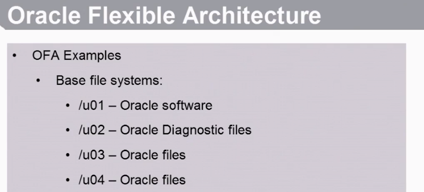


Рекомендация лектора. Если на сервере предполагается только 1 база данных, выделяем памяти под нее не более 60 процентов.

PGA (Private Global Area). Каждая пользовательская сессия аллоцирует память в это области. Не только пользовательская, но и процессы Oracle. Размер памяти устанавливается в зависимости от ожидаемого количество пользовательских сессий у базы данных.


Существует два подхода (парадигмы) для установки памяти. AMM - тогда правим настройку MEMORY_TARGET . В этом случае оракл автоматически устанавливает размер SGA и PGA и может менять этот размер между этими областями по необходимости в рантайме, перераспределяя память.


или ASMM - тогда правим настройку SGA_TARGET.

Этой настройкой автоматически меняется только SGA. PGA не перераспределяется. PGA\_AGGRIGATE\_TARGET это целевое значение для PGA, но не строгое, база будет стремиться использовать его.


Также можно настраивать параметры памяти для отдельных областей SGA. Тут устанавливается минимально значение памяти для shared_pool внутри SGA. Он может быть увеличен, но не может быть меньше этой цифры.


Хотя и есть рекомендации ставить не более 60 процентов от памяти сервера, это достаточно условная цифра. Так, если на сервере размещена база в 500 МБ, выделять даже 1 ГБ оперативки для нее это излишнее выделения. Также и если база 200 ГБ, выделять 1 ТБ памяти это много. Также память зависит от активности использования базы -  более нагруженная база потребует большего SGA для выполнения заданной производительности. Также размер памяти зависит от требований к времени отклика (response time), если отклик должен быть минимальным, можно вообще все данные брать из памяти, это будет быстрее чем даше ssd диски.


С чего начать планировать ресурсы:

* Определить какое время будет существовать данные сервер до его замены. Например 3 года
* Определить размер данных в базе , который будет в конце этого срока.
* Поставить SGA 20% от этой цифры. Для начала.

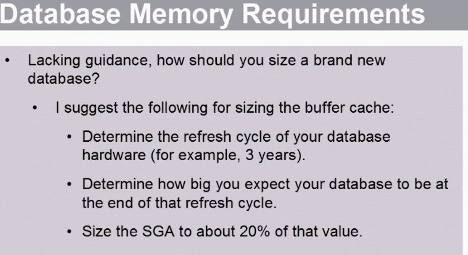


#### Создание базы данных через DBCA

Через администратор можно пройти по нескольким шагам создать и создать базу данных. Нужен GUI

Посмотреть что Listener стартован

lsnrctl status


Пользователи


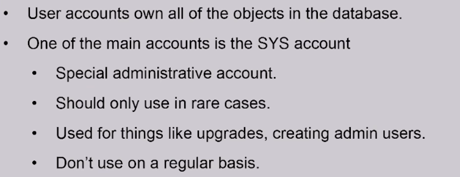

Схема = пользователь.

Можно давать гранты для доступа к оъектам других схем (пользователей)


Посмотреть пользователей .если зашли по system пользователем в Sql Developer


По-умолчанию у оракла есть тестовый пользователь scott


Сделать запрос от пользователя system в таблицу пользователя scott. Таблицы созданы scott и находятся в его схеме. Т.е если вы попытаетесь указать без схемы таблицу не найдем


SQL Developer подходит для разработки. Но для задач администрирования Oracle рекомендует использовать Oracle Enterprise Manager


При создании пользователю может быть присвоен tablespace - физическое место размещение его объектов. А также указать какую долю от tablespace могут занимать объекты этого пользователя, например весь tablespace, или вовсе запретить ему создавать объекты.

Также указывается профиль.


После создания пользователя у него нет никаких прав, даже на соединение с базой. Поэтому нужно выдать права, хотя бы на connect.


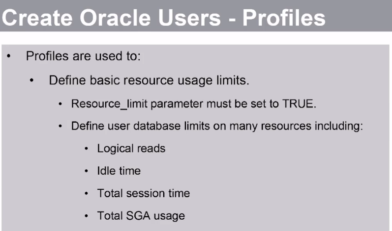


Удаление пользователя и всех его объектов


Изменение атрибутов пользователя


create user dba_one IDENTIFIED by password

default TABLESPACE users;


Выдадим грант на создание сессии


Теперь соединение проходит

Попробуем создать таблицу


Дадим пользователю роль dba , выдав грант


Как выяснилось и этого недостаточно. Нужно еще дать права на tablespace

alter user data_owner quota unlimited on users;

И потом уже можно создать таблицу


Полезные гранты

grantcreatetabletodata_owner;

grantcreateview, createprocedure, createsequencetodata_owner;

Поменять пароль

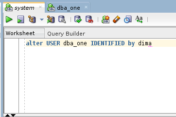

Удаляем пользователя


Словарь данных


Если указываем скоуп all. Значит видим все объекты, к которым имеем привилегии. Т.е объекты в собственной схеме + объекты в других схемах, на которые выданы гранты.


User видит объекты только в своей схеме.


* * *


⁹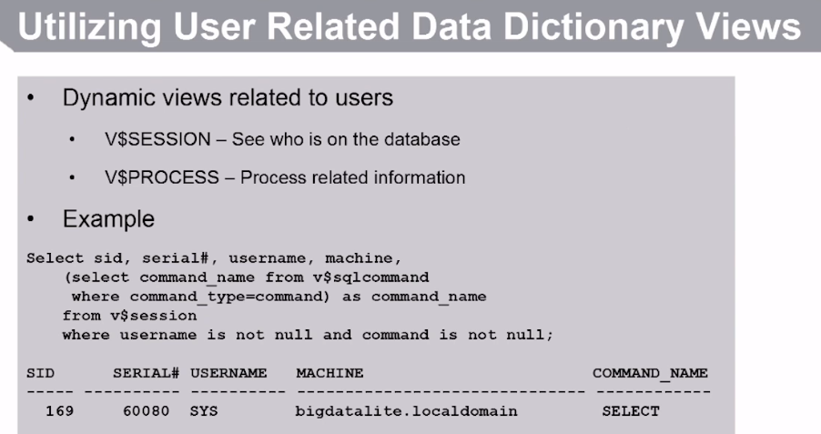


Можно создавать таблицу с одинаковыми именами в разных схемах.


Селекты никогда не блокируются локами. Может быть кратковременный лок, когда oracle подгружает данные с диска, но это не тот блок, который может произойти между транзакциями.


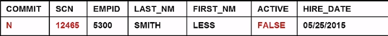


#### Администрирования control files и redo logs


На стадии mount Oracle сравнивает SCN из control file и data file, если они совпадают, значит оракл может открыть базу данных, если нет - начинается процедура recovery


На стадии no_mount oracle открывает файл с параметрами parameters, поднимается oracle instance , аллоцируется память, запускаются процессы и считывает расположение control файлов.

Далее на стадии mount oracle находит эти ctl файлы и считывает их. После этого доступны вью V$.

Далее следует стадия open, где открывается дата-файлы.


#### Redo logs


До комита записи лога помещаются в область SGA redo log buffer. После коммита помещаются на диск. Именно это обеспечивает durablility в acid.

На диск могут попасть redo log и не закомиченных транзакций, например если вставляется множество данных и памяти в redo log buffer не хватает.


Если 3 зеркала redo logs после комита записывается в 3, но не синхронно. Синхронно (как я понимаю) только в 1.

Пример. Имеем две группы. В каждом 2 member ( можно думать о них как о файлах). Мемберы одинаковые в одной группе, просто зеркальные копии, их размер. Количество мемберов и их размеры в разных группах могут не совпадать


Размер redo logs важен. Если мы будем делать log switch из одной группы в другую, это будет существенно сказываться на производительности.


Установка Oracle на Lunux

Через графический интерфейс с пробросом X11

1.  См. Описание настройки проброса X11 в документе по Linux
2.  Поставить пакеты

sudo yum install xdpyinfo

sudo yum install xorg-x11-utils

Дать права на запуск пользователю. Это должен быть не root иначе не запуститься инсталлятор

sudo chown -R vagrant:vagrant *

sudo chown vagrant:vagrant ./oracle_distr/

3.  Экспортировать переменную окружения export CV\_ASSUME\_DISTID=OEL8.1
4.  Запустить инсталлер

