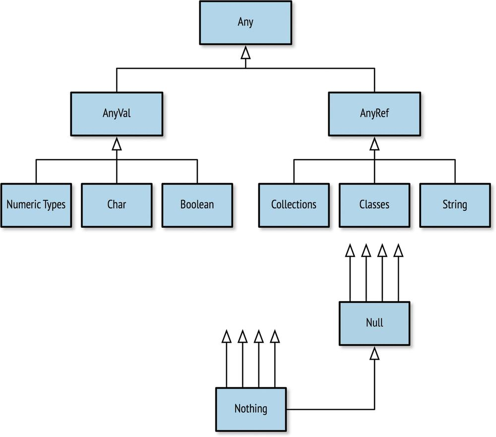

# Links

- [Docs](https://www.scala-lang.org/api/current/)
- [Scala official project on Github](https://github.com/scala/scala)
- [MUnit library for scala testing](https://scalameta.org/munit/)


# sbt

Tool to compile and build scala applications.

```
$ sbt
> help      # Describe commands.
> tasks     # Show the most commonly used, available tasks.
> tasks -V  # Show ALL the available tasks.
> compile   # Incrementally compile the code.
> test      # Incrementally compile the code and run the tests.
> clean     # Delete all build artifacts.
> console   # Start the interactive Scala environment.
> run       # Run one of the "main" methods (applications) in the project.
> show x    # Show the value of setting or task "x".
> exit      # Quit the sbt shell (also control-d works).
```

# Main class and singleton

```scala
object Main {
  def main(args: Array[String]): Unit = {

  }
}
```

Declaring `Main` as an `object` makes it a singleton, meaning there will always be only one instance of it, which the Scala runtime will create for us. You can’t create your own instances with `new`.

```scala
object MyObject {                  
  val a = new MyClass("Scala")     
  println(a.sayHello("Martin"))
}
```


# Comments

- `//` comment goes to the end of a line, 
- `/* comment */` multiline comment
- `/** comment */`  Scaladoc documentation

# Conventions

- Scala packages, names, and file organization mostly follow Java conventions. But in one file it is possible to have more than one public class

```scala
class Employee(name: String, company: String, department: Department)

class Department(name: String)
```

- Scala allows angle brackets `<>` to be used in identifiers, like method and variable names. For example, defining a “less than” method and naming it `<` is common. To avoid ambiguity, Scala reserves square brackets for parameterized types so that characters like `<` and `>` can be used as identifiers.

- Value and variable names, by convention, should start with a lowercase letter and then capitalize additional words. This is popularly known as camel case, and though not required it is recommended for all Scala developers. This helps to distinguish them from types and classes which (also by convention, not by rule) follow camel case but start with an uppercase letter.

# Quick facts

- all members public by default
- type after colon and name of variable like this `name: String`

# Var and val

- A value is an immutable, typed storage unit. A value can be assigned data when it is defined, but can never be reassigned. 
  
```scala
val age: Int = 4;
age = 44; // DOES NOT COMPILE
```

- A variable is a mutable, typed storage unit. A variable can be assigned data when it is defined and can also be reassigned data at any time.

```scala
var ageMutable: Int = 44;
ageMutable = age;
```

## lazy val 

only val can be lazy, not var

```scala
    lazy val a: Integer = {
      println("evaluated"); 5
    }

    println(a)    // evaluated \n 5
    println(a)    // 5
```

```scala
val a = 1 + b;
val b = 19

println(a) // forward reference to value b defined on line 6 extends over definition of value a
```

```scala
lazy val a = 1 + b;
lazy val b = 19

println(a)
```

# Basics

Method definitions start with the `def` keyword, followed by the method name and an optional parameter list. The method signature ends with an optional return type. The return type can be inferred in many cases, but adding the return type explicitly, as shown, provides useful documentation for the reader and also avoids occasional surprises from the type inference process.

```scala
  def convert(strings: Seq[String]): Seq[String] =
    strings.map((s: String) => s.toUpperCase)
```
Type definitions are specified using name: type syntax. The parameter list is `strings: Seq[String]` and the return type of the method is `Seq[String]`, after the parameter list.

Collection types like `Seq[T]` are parameterized types, where `T` is the type of the elements in the sequence. Scala uses square brackets `[…]` for parameterized types, whereas several other languages use angle brackets `<…>`.

The function passed to the map method to do the transformation is an unnamed (anonymous) function literal of the form `(parameters) => body`
```scala
(s: String) => s.toUpperCase
```

It takes a parameter list with a single `String` named `s`. The body of the function literal is after the “arrow” `=>`. The body calls the `toUpperCase` method on `s`. The result of this call is automatically returned by the function literal. 

In Scala, the last expression in a function, method, or other block is the return value. (The `return` keyword exists in Scala, but it can only be used in methods, not in anonymous functions like this one. It is only used for early returns in the middle of methods

```scala
class Upper1 {
  def convert(strings: Seq[String]): Seq[String] =
    strings.map((s: String) => s.toUpperCase)
}

object Main {
    def main(args: Array[String]): Unit = {
      val upper: Upper1 = new Upper1()
      val uppers = upper.convert(List("one", "two"))
      println(uppers)
    }
}
```

Note that the type of the return value of main method is `Unit`. For now, think of Unit as analogous to void in other languages, meaning nothing useful is returned.

## To uppercase examples

```scala
object ArgsToUpperCase {
  def main(params: Array[String]): Unit = {
    print("ArgsToUpperCase.main: ")

    params.map(s => s.toUpperCase).foreach(s => printf("%s ", s))
    println("")

    params.map((s: String) => s.toUpperCase()).foreach(s => printf("%s ", s))
    println("")

    val output = params.map(_.toUpperCase()).mkString(" ")
    println(output)
  }
}
```

# Auto import common methods

 Scala automatically imports many commonly used types and object members, like `Seq`, `List`, `Vector`, and the `print*` methods we used, which are actually methods in an object called `scala.Console`. Most of these things that are automatically imported are defined in a library object called `Predef`.

 # Types

  - there is no concept of a primitive type in Scala
  - Parant of all is `Any`. 


<table>
    <colgroup>
        <col>
        <col>
        <col>
        <col>
        <col>
    </colgroup>
    <thead>
        <tr>
            <td>Name</td>
            <td>Description</td>
            <td>Size</td>
            <td>Min</td>
            <td>Max</td>
        </tr>
    </thead>
    <tbody>
        <tr>
            <td>
                <p>Byte</p>
            </td>
            <td>
                <p>Signed integer</p>
            </td>
            <td>
                <p>1 byte</p>
            </td>
            <td>
                <p>–127</p>
            </td>
            <td>
                <p>128</p>
            </td>
        </tr>
        <tr>
            <td>
                <p>Short</p>
            </td>
            <td>
                <p>Signed integer</p>
            </td>
            <td>
                <p>2 bytes</p>
            </td>
            <td>
                <p>–32768</p>
            </td>
            <td>
                <p>32767</p>
            </td>
        </tr>
        <tr>
            <td>
                <p>Int</p>
            </td>
            <td>
                <p>Signed integer</p>
            </td>
            <td>
                <p>4 bytes</p>
            </td>
            <td>
                <p>–2<sup>31</sup></p>
            </td>
            <td>
                <p>2<sup>31</sup>–1</p>
            </td>
        </tr>
        <tr>
            <td>
                <p>Long</p>
            </td>
            <td>
                <p>Signed integer</p>
            </td>
            <td>
                <p>8 bytes</p>
            </td>
            <td>
                <p>–2<sup>63</sup></p>
            </td>
            <td>
                <p>2<sup>63</sup>–1</p>
            </td>
        </tr>
        <tr>
            <td>
                <p>Float</p>
            </td>
            <td>
                <p>Signed floating point</p>
            </td>
            <td>
                <p>4 bytes</p>
            </td>
            <td>
                <p>n/a</p>
            </td>
            <td>
                <p>n/a</p>
            </td>
        </tr>
        <tr>
            <td>
                <p>Double</p>
            </td>
            <td>
                <p>Signed floating point</p>
            </td>
            <td>
                <p>8 bytes</p>
            </td>
            <td>
                <p>n/a</p>
            </td>
            <td>
                <p>n/a</p>
            </td>
        </tr>
    </tbody>
</table>

down conversion

```scala
val l: Long = 20
l: Long = 20

val i: Int = l.toInt
i: Int = 20
```


<table>
    <colgroup>
        <col>
        <col>
        <col>
    </colgroup>
    <thead>
        <tr>
            <td>Literal</td>
            <td>Type</td>
            <td>Description</td>
        </tr>
    </thead>
    <tbody>
        <tr>
            <td>
                <p><code>5</code></p>
            </td>
            <td>
                <p>Int</p>
            </td>
            <td>
                <p>Unadorned integer literals are <code>Int</code> by default</p>
            </td>
        </tr>
        <tr>
            <td>
                <p><code>0x0f</code></p>
            </td>
            <td>
                <p>Int</p>
            </td>
            <td>
                <p>The “0x” prefix denotes hexadecimal notation</p>
            </td>
        </tr>
        <tr>
            <td>
                <p><code>5l</code></p>
            </td>
            <td>
                <p>Long</p>
            </td>
            <td>
                <p>The “l” suffix denotes a <code>Long</code> type</p>
            </td>
        </tr>
        <tr>
            <td>
                <p><code>5.0</code></p>
            </td>
            <td>
                <p>Double</p>
            </td>
            <td>
                <p>Unadorned decimal literals are <code>Double</code> by default</p>
            </td>
        </tr>
        <tr>
            <td>
                <p><code>5f</code></p>
            </td>
            <td>
                <p>Float</p>
            </td>
            <td>
                <p>The “f” suffix denotes a <code>Float</code> type</p>
            </td>
        </tr>
        <tr>
            <td>
                <p><code>5d</code></p>
            </td>
            <td>
                <p>Double</p>
            </td>
            <td>
                <p>The “d suffix denotes a <code>Double</code> type</p>
            </td>
        </tr>
    </tbody>
</table>

You can use either lowercase or uppercase letters in Scala’s literal types. The literal number `5L` is the same as the literal number `5l`.

```scala
scala> val anInt = 5
anInt: Int = 5

scala> val yellowRgb = 0xffff00
yellowRgb: Int = 16776960

scala> val id = 100l
id: Long = 100

scala> val pi = 3.1416
pi: Double = 3.1416
```

# Type operations

<table>
    <colgroup>
        <col>
        <col>
        <col>
    </colgroup>
    <thead>
        <tr>
            <td>Name </td>
            <td>Example </td>
            <td>Description</td>
        </tr>
    </thead>
    <tbody>
        <tr>
            <td>
                <p><code>asInstanceOf[&lt;type&gt;]</code></p>
            </td>
            <td>
                <p><code>5.asInstanceOf[Long]</code></p>
            </td>
            <td>
                <p>Converts the value to a value of the desired type. Causes an error if the value is not compatible
                    with the new type.</p>
            </td>
        </tr>
        <tr>
            <td>
                <p><code>getClass</code></p>
            </td>
            <td>
                <p><code>(7.0 / 5).getClass</code></p>
            </td>
            <td>
                <p>Returns the type (i.e., the class) of a value.</p>
            </td>
        </tr>
        <tr>
            <td>
                <p><code>isInstanceOf</code></p>
            </td>
            <td>
                <p><code>(5.0).isInstanceOf[Float]</code></p>
            </td>
            <td>
                <p>Returns true if the value has the given type.</p>
            </td>
        </tr>
        <tr>
            <td>
                <p><code>hashCode</code></p>
            </td>
            <td>
                <p><code>"A".hashCode</code></p>
            </td>
            <td>
                <p>Returns the hash code of the value, useful for hash-based collections.</p>
            </td>
        </tr>
        <tr>
            <td>
                <p><code>to&lt;type&gt;</code></p>
            </td>
            <td>
                <p><code>20.toByte; 47.toFloat</code></p>
            </td>
            <td>
                <p>Conversion functions to convert a value to a compatible value.</p>
            </td>
        </tr>
        <tr>
            <td>
                <p><code>toString</code></p>
            </td>
            <td>
                <p><code>(3.0 / 4.0).toString</code></p>
            </td>
            <td>
                <p>Renders the value to a <code>String</code>.</p>
            </td>
        </tr>
    </tbody>
</table>

# Strings

Scala’s String is built on Java’s String and adds unique features like multiline literals and string interpolation.

```scala
val hello = "Hello There"
val signature = "With Regards, \nYour friend"
```

## Equality

Unlike Java, the equals operator (==) checks for true equality, not object reference equality:

```scala
val greeting = "Hello, " + "World"
val matched = (greeting == "Hello, World") // true
```


##  multiline String

```scala
scala> val greeting = """She suggested reformatting the file
     | by replacing tabs (\t) with newlines (\n);
     | "Why do that?", he asked. """
greeting: String =
She suggested reformatting the file
by replacing tabs (\t) with newlines (\n);
"Why do that?", he asked.
```
##  string interpolation
- string interpolation is an “s” prefix added before the first double quote of the string
- dollar sign operators ($) (with optional braces) can be used to note references to external data.

```scala
class MyClass(name: String) {            
  def sayHello(otherName: String) = 
    s"Hi $otherName, my name is $name!"  
}
```

- An alternate format for string interpolation uses `printf` notation

```scala
scala> val item = "apple"
item: String = apple

scala> f"I wrote a new $item%.3s today"
res2: String = I wrote a new app today

scala> f"Enjoying this $item ${355/113.0}%.5f times today"
res3: String = Enjoying this apple 3.14159 times today
```

##  Capturing Values with Regular Expressions

```scala
scala> val input = "Enjoying this apple 3.14159 times today"
input: String = Enjoying this apple 3.14159 times today

scala> val pattern = """.* apple ([\d.]+) times .*""".r                     
pattern: scala.util.matching.Regex = .* apple ([\d.]+) times .*             

scala> val pattern(amountText) = input                                      
amountText: String = 3.14159

scala> val amount = amountText.toDouble                                     
amount: Double = 3.14159
```

# Tuples

A tuple is an ordered container of two or more values, all of which may have different types. 

`( <value 1>, <value 2>[, <value 3>...] )`

```scala
scala> val info = (5, "Korben", true)
info: (Int, String, Boolean) = (5,Korben,true)
```

access an individual element from a tuple by its 1-based index (e.g., where the first element is 1, second is 2, etc.):

```scala
val name = info._2
name: String = Korben
```

An alternate form of creating a 2-sized tuple is with the relation operator `->`.

```scala
scala> val red = "red" -> "0xff0000"
red: (String, String) = (red,0xff0000)

scala> val reversed = red._2 -> red._1
reversed: (String, String) = (0xff0000,red)
```

# Case classes

```scala
case class Point(x: Double = 0.0, y: Double = 0.0)    
```

each constructor parameter is automatically converted to a read-only (immutable) field for Point instances. In other words, it’s as if we put `val` before each field declaration. When you instantiate an instance named point, you can read the fields using `point.x` and `point.y`, but you can’t change their values. Attempting to write `point.y = 3.0` causes a compilation error.

You can also provide default values for constructor and method parameters. The `= 0.0` after each parameter definition specifies `0.0` as the default. Hence, the user doesn’t have to provide them explicitly, but they are inferred left to right. This implies that when you define a default value for one parameter, you must also do this for all parameters to its right.

case-class instances are constructed without using `new`, such as `val p = Point(…)`

While there is no class body for Point, another feature of the case keyword is that the compiler automatically generates several methods for us, including commonly used `toString`, `equals`, and `hashCode` methods. 

```scala
scala> import progscala3.introscala.shapes.*

scala> val p00 = Point()
val p00: progscala3.introscala.shapes.Point = Point(0.0,0.0)

scala> val p20 = Point(2.0)
val p20: progscala3.introscala.shapes.Point = Point(2.0,0.0)

scala> val p20b = Point(2.0)
val p20b: progscala3.introscala.shapes.Point = Point(2.0,0.0)

scala> val p02 = Point(y = 2.0)
val p02: progscala3.introscala.shapes.Point = Point(0.0,2.0)

scala> p20 == p20b
val res0: Boolean = true

scala> p20 == p02
val res1: Boolean = false
```

compiler also generates a companion object, a singleton object of the same name, for each case class. In other words, we declared the class `Point`, and the compiler also created an object `Point`.

compiler also adds several methods to the companion object automatically, one of which is named `apply`. It takes the same parameter list as the constructor. it is unnecessary to use `new` to create instances of case classes like Point, this works because the companion method Point.apply(…) gets called.

This is true for any instance, either a declared object or an instance of a class, not just for case-class companion objects

```scala
val p1 = Point.apply(1.0, 2.0)   // Point is the companion object here!
val p2 = Point(1.0, 2.0)         // Same!
```

You can add methods to the companion object, including overloaded `apply` methods. Just declare object `Point`: explicitly and add the methods. The default `apply` method will still be generated, unless you define it explicitly yourself.

#  higher-order function

When a function accepts other functions as parameters or returns functions as values, it is called a higher-order function (HOF).


```scala
package progscala3.introscala.shapes

case class Point(x: Double = 0.0, y: Double = 0.0)                    

abstract class Shape():                                               
  /**
   * Draw the shape.
   * @param f is a function to which the shape will pass a
   * string version of itself to be rendered.
   */
  def draw(f: String => Unit): Unit = f(s"draw: $this")               

case class Circle(center: Point, radius: Double) extends Shape        

case class Rectangle(lowerLeft: Point, height: Double, width: Double) 
      extends Shape

case class Triangle(point1: Point, point2: Point, point3: Point)
      extends Shape
  ```


You could say that draw defines a protocol that all shapes have to support, but users can customize. It’s up to each shape to serialize its state to a string representation through its toString method. The f method is called by draw, which constructs the final string using an interpolated string.

```scala
def divideByTwo(n: Int): Int = n / 2             
 
def addOne(f: Int => Int): Int => Int =          
  f andThen(_ + 1)
 
def divideByTwoAndAddOne = addOne(divideByTwo)   
```

# Exception

```scala
try {
  throw new IllegalStateException("ERROR!") 
} catch {
  case ex: RuntimeException =>   
    println("Something went bad...")
}
```

# Sealed classes

`sealed` keyword means that we can only define subtypes of `Message` in the same file

```scala
package progscala3.introscala.shapes

sealed trait Message                                                 
case class Draw(shape: Shape) extends Message                        
case class Response(message: String) extends Message                 
case object Exit extends Message 
```

# Pattern matching


```scala
message match
  case Exit =>
    expressions
  case Draw(shape) =>
    expressions
  case Response(unexpected) =>
    expressions
```

The `match` expressions work a lot like `if/else` expressions but are more powerful and concise. When one of the patterns matches, the block of expressions after the arrow `=>` is evaluated, up to the next case keyword or the end of the whole expression. Matching is eager; the first match wins.

```scala
package progscala3.introscala.shapes

object ProcessMessages:                                              
  def apply(message: Message): Message =                             
    message match {
      case Exit =>
        println(s"ProcessMessage: exiting...")
        Exit
      case Draw(shape) =>
        shape.draw(str => println(s"ProcessMessage: $str"))
        Response(s"ProcessMessage: $shape drawn")
      case Response(unexpected) =>
        val response = Response(s"ERROR: Unexpected Response: $unexpected")
        println(s"ProcessMessage: $response")
        response
    }
  ```

  If the case clauses don’t cover all possible values that can be passed to the match expression, a `MatchError` is thrown at runtime. 

  A powerful feature of pattern matching is the ability to extract data from the object matched, sometimes called deconstruction (the inverse of construction). Here, when the input message is a `Draw`, we extract the enclosed `Shape` and assign it to the variable `shape`. Similarly, if `Response` is detected, we extract the message as `unexpected`, so named because `ProcessMessages` doesn’t expect to receive a `Response`

  # Example with Shapes

  ```scala
  package progscala3.introscala.shapes

  def main(args: Array[String]): Unit = {
    val messages = Seq(
      Draw(Circle(Point(0.0, 0.0), 1.0)),
      Draw(Rectangle(Point(0.0, 0.0), 2, 5)),
      Response(s"Say hello to pi: 3.14159"),
      Draw(Triangle(Point(0.0, 0.0), Point(2.0, 0.0), Point(1.0, 2.0))),
      Exit)

    messages.foreach { message =>
      val response = ProcessMessages(message)
      println(response)
    }
  }
  ```

  # Akka

  ## Akka HTTP

### Dependencies
  ```scala
  val AkkaVersion = "2.7.0"
val AkkaHttpVersion = "10.5.0"
libraryDependencies ++= Seq(
  "com.typesafe.akka" %% "akka-actor-typed" % AkkaVersion,
  "com.typesafe.akka" %% "akka-stream" % AkkaVersion,
  "com.typesafe.akka" %% "akka-http" % AkkaHttpVersion,
  "com.typesafe.akka" %% "akka-http-spray-json" % AkkaHttpVersion,
  "com.typesafe.akka" %% "akka-stream-testkit" % AkkaVersion,
  "com.typesafe.akka" %% "akka-http-testkit" % AkkaHttpVersion
)
```

### Hello World

```scala
package docs.http.scaladsl

import akka.actor.typed.ActorSystem
import akka.actor.typed.scaladsl.Behaviors
import akka.http.scaladsl.Http
import akka.http.scaladsl.model._
import akka.http.scaladsl.server.Directives._
import scala.io.StdIn

object HttpServerRoutingMinimal {

  def main(args: Array[String]): Unit = {

    implicit val system = ActorSystem(Behaviors.empty, "my-system")
    // needed for the future flatMap/onComplete in the end
    implicit val executionContext = system.executionContext

    val route =
      path("hello") {
        get {
          complete(HttpEntity(ContentTypes.`text/html(UTF-8)`, "<h1>Say hello to akka-http</h1>"))
        }
      }

    val bindingFuture = Http().newServerAt("localhost", 8080).bind(route)

    println(s"Server now online. Please navigate to http://localhost:8080/hello\nPress RETURN to stop...")
    StdIn.readLine() // let it run until user presses return
    bindingFuture
      .flatMap(_.unbind()) // trigger unbinding from the port
      .onComplete(_ => system.terminate()) // and shutdown when done
  }
}
```

### With json marshalling

```scala
/*
 * Copyright (C) 2020-2023 Lightbend Inc. <https://www.lightbend.com>
 */

package docs.http.scaladsl

import akka.actor.typed.ActorSystem
import akka.actor.typed.scaladsl.Behaviors
import akka.http.scaladsl.Http
import akka.Done
import akka.http.scaladsl.server.Route
import akka.http.scaladsl.server.Directives._
import akka.http.scaladsl.model.StatusCodes
// for JSON serialization/deserialization following dependency is required:
// "com.typesafe.akka" %% "akka-http-spray-json" % "10.1.7"
import akka.http.scaladsl.marshallers.sprayjson.SprayJsonSupport._
import spray.json.DefaultJsonProtocol._
import spray.json.RootJsonFormat

import scala.io.StdIn

import scala.concurrent.ExecutionContext
import scala.concurrent.Future

object SprayJsonExample {

  // needed to run the route
  implicit val system: ActorSystem[_] = ActorSystem(Behaviors.empty, "SprayExample")
  // needed for the future map/flatmap in the end and future in fetchItem and saveOrder
  implicit val executionContext: ExecutionContext = system.executionContext

  var orders: List[Item] = Nil

  // domain model
  final case class Item(name: String, id: Long)
  final case class Order(items: List[Item])

  // formats for unmarshalling and marshalling
  implicit val itemFormat: RootJsonFormat[Item] = jsonFormat2(Item.apply)
  implicit val orderFormat: RootJsonFormat[Order] = jsonFormat1(Order.apply)

  // (fake) async database query api
  def fetchItem(itemId: Long): Future[Option[Item]] = Future {
    orders.find(o => o.id == itemId)
  }
  def saveOrder(order: Order): Future[Done] = {
    orders = order.items ::: orders
    Future { Done }
  }

  def main(args: Array[String]): Unit = {
    val route: Route =
      concat(
        get {
          pathPrefix("item" / LongNumber) { id =>
            // there might be no item for a given id
            val maybeItem: Future[Option[Item]] = fetchItem(id)

            onSuccess(maybeItem) {
              case Some(item) => complete(item)
              case None       => complete(StatusCodes.NotFound)
            }
          }
        },
        post {
          path("create-order") {
            entity(as[Order]) { order =>
              val saved: Future[Done] = saveOrder(order)
              onSuccess(saved) { _ => // we are not interested in the result value `Done` but only in the fact that it was successful
                complete("order created")
              }
            }
          }
        }
      )

    val bindingFuture = Http().newServerAt("localhost", 8080).bind(route)
    println(s"Server online at http://localhost:8080/\nPress RETURN to stop...")
    StdIn.readLine() // let it run until user presses return
    bindingFuture
      .flatMap(_.unbind()) // trigger unbinding from the port
      .onComplete(_ => system.terminate()) // and shutdown when done
  }
}
```